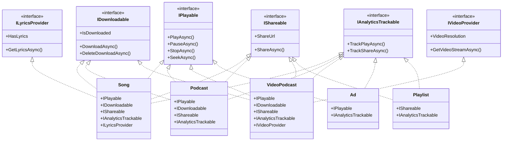
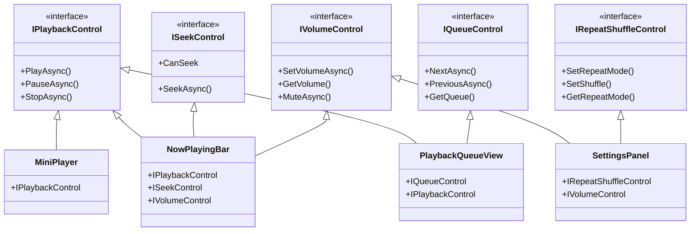
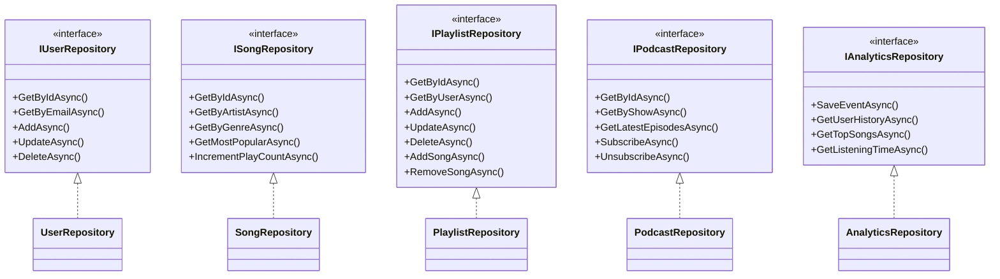

# Part 5: Interface Segregation Principle
## Don't Depend on What You Don't Use - The .NET 10 Way

---

**Subtitle:**
How Spotify designs fine-grained interfaces for playback, downloading, sharing, and analytics—so clients only depend on what they actually need—using .NET 10, default interface methods, and role-based design.

**Keywords:**
Interface Segregation Principle, ISP, .NET 10, C# 13, Role Interfaces, Default Interface Methods, Adapter Pattern, Fat Interfaces, Spotify system design

---

## Introduction: The Fat Interface Problem

**The Legacy Violation:**
```csharp
// BAD - A fat interface that tries to do everything
public interface IMediaPlayer
{
    // Playback
    Task PlayAsync(string contentId);
    Task PauseAsync();
    Task StopAsync();
    Task SeekAsync(TimeSpan position);
    
    // Download
    Task DownloadAsync(string contentId);
    Task DeleteDownloadAsync(string contentId);
    Task<List<string>> GetOfflineContentAsync();
    
    // Sharing
    Task ShareOnFacebookAsync(string contentId);
    Task ShareOnTwitterAsync(string contentId);
    Task ShareOnInstagramAsync(string contentId);
    
    // Analytics
    Task TrackPlayAsync(string contentId);
    Task TrackShareAsync(string contentId, string platform);
    Task<AnalyticsReport> GetListeningHistoryAsync();
    
    // Playlist management
    Task AddToPlaylistAsync(string contentId, string playlistId);
    Task CreatePlaylistAsync(string name);
    Task<List<Playlist>> GetPlaylistsAsync();
}

// Classes forced to implement methods they don't need
public class SimpleAudioPlayer : IMediaPlayer
{
    // Playback - needed ✓
    public Task PlayAsync(string contentId) { /* implementation */ }
    public Task PauseAsync() { /* implementation */ }
    public Task StopAsync() { /* implementation */ }
    public Task SeekAsync(TimeSpan position) { /* implementation */ }
    
    // Download - not needed ✗
    public Task DownloadAsync(string contentId) 
        => throw new NotSupportedException("This player doesn't support downloads");
    
    public Task DeleteDownloadAsync(string contentId)
        => throw new NotSupportedException("This player doesn't support downloads");
    
    public Task<List<string>> GetOfflineContentAsync()
        => throw new NotSupportedException("This player doesn't support downloads");
    
    // Sharing - not needed ✗
    public Task ShareOnFacebookAsync(string contentId)
        => throw new NotSupportedException("This player doesn't support sharing");
    
    public Task ShareOnTwitterAsync(string contentId)
        => throw new NotSupportedException("This player doesn't support sharing");
    
    public Task ShareOnInstagramAsync(string contentId)
        => throw new NotSupportedException("This player doesn't support sharing");
    
    // Analytics - not needed ✗
    public Task TrackPlayAsync(string contentId)
        => throw new NotSupportedException("This player doesn't track analytics");
    
    public Task TrackShareAsync(string contentId, string platform)
        => throw new NotSupportedException("This player doesn't track analytics");
    
    public Task<AnalyticsReport> GetListeningHistoryAsync()
        => throw new NotSupportedException("This player doesn't track analytics");
    
    // Playlist - not needed ✗
    public Task AddToPlaylistAsync(string contentId, string playlistId)
        => throw new NotSupportedException("This player doesn't manage playlists");
    
    public Task CreatePlaylistAsync(string name)
        => throw new NotSupportedException("This player doesn't manage playlists");
    
    public Task<List<Playlist>> GetPlaylistsAsync()
        => throw new NotSupportedException("This player doesn't manage playlists");
}
```

This interface violates the Interface Segregation Principle. Clients that only need playback are forced to depend on download, sharing, analytics, and playlist methods. Every change to any of these unrelated areas affects all clients.

**The Redefined View:**
The Interface Segregation Principle states that **no client should be forced to depend on methods it does not use**. Instead of one fat interface, create multiple small, focused interfaces—each serving one client role.

**Why This Matters for Spotify:**

| Scenario | Without ISP | With ISP |
|----------|-------------|----------|
| Simple audio player | Implements 20+ unused methods | Implements only IPlayable |
| Adding sharing feature | Modifies IMediaPlayer, affects all clients | Adds IShareable, no impact on others |
| Testing | Mock all unused methods | Mock only needed methods |
| Documentation | Unclear what capabilities exist | Clear role-based interfaces |

---

## The .NET 10 ISP Toolkit

### 1. Role Interfaces

```csharp
// WHY .NET 10: Small, focused interfaces for specific roles
public interface IPlayable
{
    Task PlayAsync(CancellationToken ct = default);
    Task PauseAsync(CancellationToken ct = default);
    Task StopAsync(CancellationToken ct = default);
    TimeSpan Duration { get; }
}

public interface IDownloadable
{
    Task DownloadAsync(CancellationToken ct = default);
    Task DeleteDownloadAsync(CancellationToken ct = default);
    bool IsDownloaded { get; }
}

public interface IShareable
{
    Task ShareAsync(string platform, CancellationToken ct = default);
    string ShareUrl { get; }
}

public interface IAnalyticsTrackable
{
    Task TrackPlayAsync(CancellationToken ct = default);
    Task TrackShareAsync(string platform, CancellationToken ct = default);
}
```

### 2. Default Interface Methods (C# 8+)

```csharp
// WHY .NET 10: Default methods allow interface evolution without breaking existing implementations
public interface IShareable
{
    Task ShareAsync(string platform, CancellationToken ct = default);
    string ShareUrl { get; }
    
    // New method with default implementation - doesn't break existing clients
    Task ShareToAllAsync(CancellationToken ct = default)
    {
        return Task.WhenAll(
            ShareAsync("facebook", ct),
            ShareAsync("twitter", ct),
            ShareAsync("instagram", ct)
        );
    }
}
```

### 3. Null Object Pattern

```csharp
// WHY .NET 10: Provides safe defaults for optional capabilities
public class NullShareable : IShareable
{
    public string ShareUrl => string.Empty;
    
    public Task ShareAsync(string platform, CancellationToken ct = default)
        => Task.CompletedTask; // Do nothing
}
```

### 4. Extension Methods for Composition

```csharp
// WHY .NET 10: Add behavior without modifying interfaces
public static class ShareableExtensions
{
    public static async Task ShareToAllAsync(this IShareable shareable, CancellationToken ct = default)
    {
        await shareable.ShareAsync("facebook", ct);
        await shareable.ShareAsync("twitter", ct);
        await shareable.ShareAsync("instagram", ct);
    }
}
```

---

## Real Spotify Example 1: Content Capabilities

Different types of content in Spotify have different capabilities:

| Content Type | Playable | Downloadable | Shareable | Analytics | Lyrics | Video |
|--------------|----------|--------------|-----------|-----------|--------|-------|
| Song | ✓ | ✓ | ✓ | ✓ | ✓ | ✗ |
| Podcast | ✓ | ✓ | ✓ | ✓ | ✗ | ✗ |
| Video Podcast | ✓ | ✓ | ✓ | ✓ | ✗ | ✓ |
| Audiobook | ✓ | ✓ | ✗ | ✓ | ✗ | ✗ |
| Ad | ✓ | ✗ | ✗ | ✓ | ✗ | ✗ |
| Playlist | ✗ | ✗ | ✓ | ✓ | ✗ | ✗ |

A fat interface would force all content types to implement everything. ISP gives us focused interfaces.



### The ISP-Compliant Implementation

```csharp
// ========== Role Interfaces ==========

/// <summary>
/// RESPONSIBILITY: Core playback operations
/// </summary>
public interface IPlayable
{
    string Id { get; }
    string Title { get; }
    TimeSpan Duration { get; }
    
    Task PlayAsync(CancellationToken cancellationToken = default);
    Task PauseAsync(CancellationToken cancellationToken = default);
    Task StopAsync(CancellationToken cancellationToken = default);
    Task SeekAsync(TimeSpan position, CancellationToken cancellationToken = default);
    
    IObservable<PlaybackProgress> Progress { get; }
}

public record PlaybackProgress(TimeSpan Position, TimeSpan Duration, bool IsPlaying);

/// <summary>
/// RESPONSIBILITY: Download operations
/// </summary>
public interface IDownloadable
{
    bool IsDownloaded { get; }
    long? DownloadSize { get; }
    
    Task DownloadAsync(CancellationToken cancellationToken = default);
    Task DeleteDownloadAsync(CancellationToken cancellationToken = default);
    Task<Stream> GetOfflineStreamAsync(CancellationToken cancellationToken = default);
    
    IObservable<DownloadProgress> DownloadProgress { get; }
}

public record DownloadProgress(int PercentageComplete, long BytesDownloaded, long TotalBytes);

/// <summary>
/// RESPONSIBILITY: Sharing operations
/// </summary>
public interface IShareable
{
    string ShareUrl { get; }
    string ShareTitle { get; }
    
    Task<string> ShareAsync(string platform, CancellationToken cancellationToken = default);
    Task<string> ShareToSocialAsync(CancellationToken cancellationToken = default);
}

/// <summary>
/// RESPONSIBILITY: Analytics tracking
/// </summary>
public interface IAnalyticsTrackable
{
    Task TrackPlayAsync(TimeSpan? duration = null, CancellationToken cancellationToken = default);
    Task TrackShareAsync(string platform, CancellationToken cancellationToken = default);
    Task TrackSkipAsync(TimeSpan position, CancellationToken cancellationToken = default);
}

/// <summary>
/// RESPONSIBILITY: Lyrics provision
/// </summary>
public interface ILyricsProvider
{
    bool HasLyrics { get; }
    Task<Lyrics> GetLyricsAsync(CancellationToken cancellationToken = default);
    Task<SyncedLyrics> GetSyncedLyricsAsync(CancellationToken cancellationToken = default);
}

public record Lyrics(string Text, string[] Lines, string? Language);
public record SyncedLyrics(List<SyncedLine> Lines);
public record SyncedLine(TimeSpan Timestamp, string Text);

/// <summary>
/// RESPONSIBILITY: Video provision
/// </summary>
public interface IVideoProvider
{
    string VideoResolution { get; }
    Task<Stream> GetVideoStreamAsync(CancellationToken cancellationToken = default);
    Task<Uri> GetVideoUriAsync(CancellationToken cancellationToken = default);
}

// ========== Song Implementation ==========

/// <summary>
/// Song implements multiple interfaces but clients only see what they need
/// </summary>
public class Song : IPlayable, IDownloadable, IShareable, IAnalyticsTrackable, ILyricsProvider
{
    private readonly ISongRepository _repository;
    private readonly ILogger<Song> _logger;
    private readonly Subject<PlaybackProgress> _progressSubject = new();
    private readonly Subject<DownloadProgress> _downloadSubject = new();
    
    public required string Id { get; init; }
    public required string Title { get; init; }
    public required string Artist { get; init; }
    public required string Album { get; init; }
    public TimeSpan Duration { get; init; }
    
    // IPlayable
    public IObservable<PlaybackProgress> Progress => _progressSubject.AsObservable();
    
    public async Task PlayAsync(CancellationToken cancellationToken = default)
    {
        _logger.LogInformation("Playing song: {Title} by {Artist}", Title, Artist);
        // Playback implementation
        await Task.Delay(100, cancellationToken);
    }
    
    public Task PauseAsync(CancellationToken cancellationToken = default)
    {
        _logger.LogDebug("Paused song: {Title}", Title);
        return Task.CompletedTask;
    }
    
    public Task StopAsync(CancellationToken cancellationToken = default)
    {
        _logger.LogDebug("Stopped song: {Title}", Title);
        return Task.CompletedTask;
    }
    
    public async Task SeekAsync(TimeSpan position, CancellationToken cancellationToken = default)
    {
        _logger.LogDebug("Seeking to {Position} in {Title}", position, Title);
        await Task.CompletedTask;
    }
    
    // IDownloadable
    public bool IsDownloaded { get; private set; }
    public long? DownloadSize => 5_000_000; // ~5MB
    
    public IObservable<DownloadProgress> DownloadProgress => _downloadSubject.AsObservable();
    
    public async Task DownloadAsync(CancellationToken cancellationToken = default)
    {
        _logger.LogInformation("Downloading song: {Title}", Title);
        
        for (int i = 0; i <= 100; i += 10)
        {
            _downloadSubject.OnNext(new DownloadProgress(i, i * 50000, 5000000));
            await Task.Delay(50, cancellationToken);
        }
        
        IsDownloaded = true;
    }
    
    public Task DeleteDownloadAsync(CancellationToken cancellationToken = default)
    {
        IsDownloaded = false;
        _logger.LogInformation("Deleted download: {Title}", Title);
        return Task.CompletedTask;
    }
    
    public async Task<Stream> GetOfflineStreamAsync(CancellationToken cancellationToken = default)
    {
        if (!IsDownloaded)
            throw new InvalidOperationException("Song not downloaded");
            
        return new MemoryStream(new byte[1024]); // Return local file stream
    }
    
    // IShareable
    public string ShareUrl => $"https://open.spotify.com/track/{Id}";
    public string ShareTitle => $"{Title} by {Artist} on Spotify";
    
    public async Task<string> ShareAsync(string platform, CancellationToken cancellationToken = default)
    {
        _logger.LogInformation("Sharing {Title} on {Platform}", Title, platform);
        await Task.Delay(50, cancellationToken);
        return $"Shared to {platform}";
    }
    
    public async Task<string> ShareToSocialAsync(CancellationToken cancellationToken = default)
    {
        await ShareAsync("social", cancellationToken);
        return "Shared to social media";
    }
    
    // IAnalyticsTrackable
    public Task TrackPlayAsync(TimeSpan? duration = null, CancellationToken cancellationToken = default)
    {
        _logger.LogInformation("Tracking play of {Title} (duration: {Duration})", Title, duration);
        return Task.CompletedTask;
    }
    
    public Task TrackShareAsync(string platform, CancellationToken cancellationToken = default)
    {
        _logger.LogInformation("Tracking share of {Title} on {Platform}", Title, platform);
        return Task.CompletedTask;
    }
    
    public Task TrackSkipAsync(TimeSpan position, CancellationToken cancellationToken = default)
    {
        _logger.LogInformation("Tracking skip of {Title} at {Position}", Title, position);
        return Task.CompletedTask;
    }
    
    // ILyricsProvider
    public bool HasLyrics => true;
    
    public Task<Lyrics> GetLyricsAsync(CancellationToken cancellationToken = default)
    {
        var lyrics = new Lyrics(
            "Sample lyrics...",
            new[] { "Line 1", "Line 2", "Line 3" },
            "en"
        );
        return Task.FromResult(lyrics);
    }
    
    public Task<SyncedLyrics> GetSyncedLyricsAsync(CancellationToken cancellationToken = default)
    {
        var lines = new List<SyncedLine>
        {
            new(TimeSpan.FromSeconds(0), "Line 1"),
            new(TimeSpan.FromSeconds(5), "Line 2"),
            new(TimeSpan.FromSeconds(10), "Line 3")
        };
        return Task.FromResult(new SyncedLyrics(lines));
    }
}

// ========== Podcast Implementation ==========

/// <summary>
/// Podcast implements only the interfaces it needs
/// </summary>
public class PodcastEpisode : IPlayable, IDownloadable, IShareable, IAnalyticsTrackable
{
    private readonly ILogger<PodcastEpisode> _logger;
    private readonly Subject<PlaybackProgress> _progressSubject = new();
    
    public required string Id { get; init; }
    public required string Title { get; init; }
    public required string ShowName { get; init; }
    public required string Host { get; init; }
    public TimeSpan Duration { get; init; }
    
    // IPlayable
    public IObservable<PlaybackProgress> Progress => _progressSubject.AsObservable();
    
    public async Task PlayAsync(CancellationToken cancellationToken = default)
    {
        _logger.LogInformation("Playing podcast: {Title} from {ShowName}", Title, ShowName);
        await Task.Delay(100, cancellationToken);
    }
    
    public Task PauseAsync(CancellationToken cancellationToken = default)
    {
        _logger.LogDebug("Paused podcast: {Title}", Title);
        return Task.CompletedTask;
    }
    
    public Task StopAsync(CancellationToken cancellationToken = default)
    {
        _logger.LogDebug("Stopped podcast: {Title}", Title);
        return Task.CompletedTask;
    }
    
    public async Task SeekAsync(TimeSpan position, CancellationToken cancellationToken = default)
    {
        _logger.LogDebug("Seeking to {Position} in {Title}", position, Title);
        await Task.CompletedTask;
    }
    
    // IDownloadable
    public bool IsDownloaded { get; private set; }
    public long? DownloadSize => 25_000_000; // ~25MB for podcasts
    
    public IObservable<DownloadProgress> DownloadProgress => throw new NotImplementedException();
    
    public async Task DownloadAsync(CancellationToken cancellationToken = default)
    {
        _logger.LogInformation("Downloading podcast: {Title}", Title);
        await Task.Delay(200, cancellationToken);
        IsDownloaded = true;
    }
    
    public Task DeleteDownloadAsync(CancellationToken cancellationToken = default)
    {
        IsDownloaded = false;
        _logger.LogInformation("Deleted podcast download: {Title}", Title);
        return Task.CompletedTask;
    }
    
    public async Task<Stream> GetOfflineStreamAsync(CancellationToken cancellationToken = default)
    {
        if (!IsDownloaded)
            throw new InvalidOperationException("Podcast not downloaded");
            
        return new MemoryStream(new byte[1024]);
    }
    
    // IShareable
    public string ShareUrl => $"https://open.spotify.com/episode/{Id}";
    public string ShareTitle => $"{Title} from {ShowName} on Spotify";
    
    public async Task<string> ShareAsync(string platform, CancellationToken cancellationToken = default)
    {
        _logger.LogInformation("Sharing podcast {Title} on {Platform}", Title, platform);
        await Task.Delay(50, cancellationToken);
        return $"Shared to {platform}";
    }
    
    public Task<string> ShareToSocialAsync(CancellationToken cancellationToken = default)
        => ShareAsync("social", cancellationToken);
    
    // IAnalyticsTrackable
    public Task TrackPlayAsync(TimeSpan? duration = null, CancellationToken cancellationToken = default)
    {
        _logger.LogInformation("Tracking podcast play: {Title}", Title);
        return Task.CompletedTask;
    }
    
    public Task TrackShareAsync(string platform, CancellationToken cancellationToken = default)
    {
        _logger.LogInformation("Tracking podcast share on {Platform}", platform);
        return Task.CompletedTask;
    }
    
    public Task TrackSkipAsync(TimeSpan position, CancellationToken cancellationToken = default)
    {
        _logger.LogInformation("Tracking podcast skip at {Position}", position);
        return Task.CompletedTask;
    }
}

// ========== Ad Implementation ==========

/// <summary>
/// Ad implements only playback and analytics - no download/share
/// </summary>
public class Ad : IPlayable, IAnalyticsTrackable
{
    private readonly ILogger<Ad> _logger;
    
    public required string Id { get; init; }
    public required string Title { get; init; }
    public required string Advertiser { get; init; }
    public TimeSpan Duration { get; init; }
    
    public IObservable<PlaybackProgress> Progress => Observable.Empty<PlaybackProgress>();
    
    public async Task PlayAsync(CancellationToken cancellationToken = default)
    {
        _logger.LogInformation("Playing ad from {Advertiser}: {Title}", Advertiser, Title);
        await Task.Delay(Duration, cancellationToken);
    }
    
    public Task PauseAsync(CancellationToken cancellationToken = default)
    {
        // Ads can't be paused
        return Task.CompletedTask;
    }
    
    public Task StopAsync(CancellationToken cancellationToken = default)
    {
        _logger.LogDebug("Ad stopped: {Title}", Title);
        return Task.CompletedTask;
    }
    
    public Task SeekAsync(TimeSpan position, CancellationToken cancellationToken = default)
    {
        // Ads can't be seeked
        return Task.CompletedTask;
    }
    
    public Task TrackPlayAsync(TimeSpan? duration = null, CancellationToken cancellationToken = default)
    {
        _logger.LogInformation("Tracking ad play: {Title}", Title);
        return Task.CompletedTask;
    }
    
    public Task TrackShareAsync(string platform, CancellationToken cancellationToken = default)
    {
        // Ads don't get shared
        return Task.CompletedTask;
    }
    
    public Task TrackSkipAsync(TimeSpan position, CancellationToken cancellationToken = default)
    {
        _logger.LogInformation("Ad skipped at {Position}", position);
        return Task.CompletedTask;
    }
}

// ========== Client That Uses Only What It Needs ==========

/// <summary>
/// RESPONSIBILITY: Play content - only depends on IPlayable
/// </summary>
public class AudioPlaybackService
{
    private readonly ILogger<AudioPlaybackService> _logger;
    
    public AudioPlaybackService(ILogger<AudioPlaybackService> logger)
    {
        _logger = logger;
    }
    
    /// <summary>
    /// Play any playable content - doesn't care about other capabilities
    /// </summary>
    public async Task PlayAsync(IPlayable playable, CancellationToken cancellationToken = default)
    {
        _logger.LogInformation("Playing: {Title} (Duration: {Duration})", 
            playable.Title, playable.Duration);
        
        // Subscribe to progress if needed
        using var subscription = playable.Progress.Subscribe(progress =>
        {
            _logger.LogTrace("Progress: {Position}/{Duration}", progress.Position, progress.Duration);
        });
        
        await playable.PlayAsync(cancellationToken);
    }
}

/// <summary>
/// RESPONSIBILITY: Manage downloads - only depends on IDownloadable
/// </summary>
public class DownloadManager
{
    private readonly ILogger<DownloadManager> _logger;
    
    public DownloadManager(ILogger<DownloadManager> logger)
    {
        _logger = logger;
    }
    
    /// <summary>
    /// Download any downloadable content
    /// </summary>
    public async Task DownloadAsync(IDownloadable downloadable, CancellationToken cancellationToken = default)
    {
        if (downloadable.IsDownloaded)
        {
            _logger.LogInformation("Already downloaded");
            return;
        }
        
        _logger.LogInformation("Downloading... Size: {DownloadSize} bytes", downloadable.DownloadSize);
        
        // Subscribe to progress
        using var subscription = downloadable.DownloadProgress.Subscribe(progress =>
        {
            _logger.LogInformation("Download progress: {Percentage}%", progress.PercentageComplete);
        });
        
        await downloadable.DownloadAsync(cancellationToken);
        
        _logger.LogInformation("Download complete");
    }
    
    public async Task<Stream> GetOfflineStreamAsync(IDownloadable downloadable, CancellationToken cancellationToken = default)
    {
        if (!downloadable.IsDownloaded)
            throw new InvalidOperationException("Content not downloaded");
            
        return await downloadable.GetOfflineStreamAsync(cancellationToken);
    }
}

/// <summary>
/// RESPONSIBILITY: Handle sharing - only depends on IShareable
/// </summary>
public class SocialSharingService
{
    private readonly ILogger<SocialSharingService> _logger;
    
    public SocialSharingService(ILogger<SocialSharingService> logger)
    {
        _logger = logger;
    }
    
    public async Task ShareToPlatformAsync(IShareable shareable, string platform, CancellationToken cancellationToken = default)
    {
        _logger.LogInformation("Sharing: {ShareTitle}", shareable.ShareTitle);
        _logger.LogInformation("URL: {ShareUrl}", shareable.ShareUrl);
        
        var result = await shareable.ShareAsync(platform, cancellationToken);
        _logger.LogInformation("Share result: {Result}", result);
    }
    
    public async Task ShareToAllAsync(IShareable shareable, CancellationToken cancellationToken = default)
    {
        // Using extension method
        await shareable.ShareToAllAsync(cancellationToken);
    }
}

/// <summary>
/// RESPONSIBILITY: Display lyrics - only depends on ILyricsProvider
/// </summary>
public class LyricsDisplayService
{
    private readonly ILogger<LyricsDisplayService> _logger;
    
    public LyricsDisplayService(ILogger<LyricsDisplayService> logger)
    {
        _logger = logger;
    }
    
    public async Task DisplayLyricsAsync(ILyricsProvider lyricsProvider, CancellationToken cancellationToken = default)
    {
        if (!lyricsProvider.HasLyrics)
        {
            _logger.LogInformation("No lyrics available");
            return;
        }
        
        var lyrics = await lyricsProvider.GetLyricsAsync(cancellationToken);
        _logger.LogInformation("Lyrics: {Text}", lyrics.Text);
        
        // Check if synced lyrics are available
        try
        {
            var synced = await lyricsProvider.GetSyncedLyricsAsync(cancellationToken);
            _logger.LogInformation("Synced lyrics available with {Count} lines", synced.Lines.Count);
        }
        catch (NotSupportedException)
        {
            _logger.LogInformation("Synced lyrics not supported");
        }
    }
}

// ========== Extension Methods for Composition ==========

public static class ShareableExtensions
{
    /// <summary>
    /// Share to multiple platforms at once
    /// </summary>
    public static async Task ShareToAllAsync(this IShareable shareable, CancellationToken cancellationToken = default)
    {
        var platforms = new[] { "facebook", "twitter", "instagram" };
        var tasks = platforms.Select(p => shareable.ShareAsync(p, cancellationToken));
        await Task.WhenAll(tasks);
    }
}

public static class PlayableExtensions
{
    /// <summary>
    /// Play with timeout
    /// </summary>
    public static async Task PlayWithTimeoutAsync(this IPlayable playable, TimeSpan timeout, CancellationToken cancellationToken = default)
    {
        using var cts = CancellationTokenSource.CreateLinkedTokenSource(cancellationToken);
        cts.CancelAfter(timeout);
        
        try
        {
            await playable.PlayAsync(cts.Token);
        }
        catch (OperationCanceledException) when (!cancellationToken.IsCancellationRequested)
        {
            throw new TimeoutException($"Playback timed out after {timeout}");
        }
    }
}

// ========== Usage Example ==========

public class ISPDemo
{
    public static async Task Main(string[] args)
    {
        using var loggerFactory = LoggerFactory.Create(b => b.AddConsole().SetMinimumLevel(LogLevel.Information));
        
        // Create different content types
        var song = new Song
        {
            Id = "song-1",
            Title = "Bohemian Rhapsody",
            Artist = "Queen",
            Album = "A Night at the Opera",
            Duration = TimeSpan.FromSeconds(355)
        };
        
        var podcast = new PodcastEpisode
        {
            Id = "podcast-1",
            Title = "The Future of AI",
            ShowName = "Tech Today",
            Host = "John Smith",
            Duration = TimeSpan.FromMinutes(45)
        };
        
        var ad = new Ad
        {
            Id = "ad-1",
            Title = "Summer Sale",
            Advertiser = "Nike",
            Duration = TimeSpan.FromSeconds(30)
        };
        
        // Services that depend only on what they need
        var playbackService = new AudioPlaybackService(loggerFactory.CreateLogger<AudioPlaybackService>());
        var downloadManager = new DownloadManager(loggerFactory.CreateLogger<DownloadManager>());
        var sharingService = new SocialSharingService(loggerFactory.CreateLogger<SocialSharingService>());
        var lyricsService = new LyricsDisplayService(loggerFactory.CreateLogger<LyricsDisplayService>());
        
        Console.WriteLine("\n=== Playback Service (depends only on IPlayable) ===");
        await playbackService.PlayAsync(song);
        await playbackService.PlayAsync(podcast);
        await playbackService.PlayAsync(ad);
        
        Console.WriteLine("\n=== Download Manager (depends only on IDownloadable) ===");
        await downloadManager.DownloadAsync(song);
        await downloadManager.DownloadAsync(podcast);
        
        // This would fail - ads aren't downloadable
        // await downloadManager.DownloadAsync(ad);
        
        Console.WriteLine("\n=== Sharing Service (depends only on IShareable) ===");
        await sharingService.ShareToPlatformAsync(song, "facebook");
        await sharingService.ShareToPlatformAsync(podcast, "twitter");
        
        // This would fail - ads aren't shareable
        // await sharingService.ShareToPlatformAsync(ad, "facebook");
        
        Console.WriteLine("\n=== Lyrics Service (depends only on ILyricsProvider) ===");
        await lyricsService.DisplayLyricsAsync(song);
        
        // This would fail - podcasts don't have lyrics
        // await lyricsService.DisplayLyricsAsync(podcast);
        
        Console.WriteLine("\n✅ ISP demonstrated:");
        Console.WriteLine("  • AudioPlaybackService only depends on IPlayable");
        Console.WriteLine("  • DownloadManager only depends on IDownloadable");
        Console.WriteLine("  • SocialSharingService only depends on IShareable");
        Console.WriteLine("  • LyricsDisplayService only depends on ILyricsProvider");
        Console.WriteLine("  • Song implements all interfaces");
        Console.WriteLine("  • Podcast implements playback, download, share");
        Console.WriteLine("  • Ad implements only playback and analytics");
        Console.WriteLine("  • No class forced to implement unused methods");
    }
}
```

**ISP Benefits Achieved:**
- **AudioPlaybackService** only sees playback methods
- **DownloadManager** only sees download methods
- **SocialSharingService** only sees share methods
- **LyricsDisplayService** only sees lyrics methods
- **Song** implements all interfaces but clients only see what they need
- **Podcast** doesn't need lyrics methods
- **Ad** doesn't need download/share methods

---

## Real Spotify Example 2: Player Controls with Role Interfaces

Different UI components need different subsets of player functionality:



### The Implementation

```csharp
// ========== Role Interfaces ==========

public interface IPlaybackControl
{
    Task PlayAsync(CancellationToken cancellationToken = default);
    Task PauseAsync(CancellationToken cancellationToken = default);
    Task StopAsync(CancellationToken cancellationToken = default);
    bool IsPlaying { get; }
}

public interface ISeekControl
{
    bool CanSeek { get; }
    Task SeekAsync(TimeSpan position, CancellationToken cancellationToken = default);
    TimeSpan CurrentPosition { get; }
    IObservable<TimeSpan> PositionChanged { get; }
}

public interface IVolumeControl
{
    float Volume { get; set; }
    bool IsMuted { get; }
    Task MuteAsync(CancellationToken cancellationToken = default);
    Task UnmuteAsync(CancellationToken cancellationToken = default);
    IObservable<float> VolumeChanged { get; }
}

public interface IQueueControl
{
    Task NextAsync(CancellationToken cancellationToken = default);
    Task PreviousAsync(CancellationToken cancellationToken = default);
    IReadOnlyList<QueueItem> GetQueue();
    Task AddToQueueAsync(string contentId, CancellationToken cancellationToken = default);
}

public interface IRepeatShuffleControl
{
    RepeatMode RepeatMode { get; set; }
    bool ShuffleEnabled { get; set; }
    Task SetRepeatModeAsync(RepeatMode mode, CancellationToken cancellationToken = default);
    Task SetShuffleAsync(bool enabled, CancellationToken cancellationToken = default);
}

public enum RepeatMode
{
    Off,
    RepeatOne,
    RepeatAll
}

public record QueueItem(string Id, string Title, string? Artist);

// ========== Player Implementation ==========

/// <summary>
/// Full-featured player implements all interfaces
/// </summary>
public class SpotifyPlayer : IPlaybackControl, ISeekControl, IVolumeControl, IQueueControl, IRepeatShuffleControl
{
    private readonly IAudioHardware _hardware;
    private readonly ILogger<SpotifyPlayer> _logger;
    private readonly Subject<TimeSpan> _positionSubject = new();
    private readonly Subject<float> _volumeSubject = new();
    
    private bool _isPlaying;
    private TimeSpan _currentPosition;
    private float _volume = 0.5f;
    private bool _isMuted;
    private RepeatMode _repeatMode;
    private bool _shuffleEnabled;
    private readonly List<QueueItem> _queue = new();
    private int _currentIndex = -1;
    
    public bool IsPlaying => _isPlaying;
    public bool CanSeek => true;
    public TimeSpan CurrentPosition => _currentPosition;
    public IObservable<TimeSpan> PositionChanged => _positionSubject.AsObservable();
    
    public float Volume
    {
        get => _isMuted ? 0 : _volume;
        set
        {
            _volume = Math.Clamp(value, 0f, 1f);
            _volumeSubject.OnNext(_volume);
            _ = _hardware.SetVolumeAsync(_volume);
        }
    }
    
    public bool IsMuted => _isMuted;
    public IObservable<float> VolumeChanged => _volumeSubject.AsObservable();
    
    public RepeatMode RepeatMode { get => _repeatMode; set => _repeatMode = value; }
    public bool ShuffleEnabled { get => _shuffleEnabled; set => _shuffleEnabled = value; }
    
    public SpotifyPlayer(IAudioHardware hardware, ILogger<SpotifyPlayer> logger)
    {
        _hardware = hardware;
        _logger = logger;
    }
    
    // IPlaybackControl
    public async Task PlayAsync(CancellationToken cancellationToken = default)
    {
        _logger.LogInformation("Play");
        await _hardware.PlayAsync(cancellationToken);
        _isPlaying = true;
    }
    
    public async Task PauseAsync(CancellationToken cancellationToken = default)
    {
        _logger.LogInformation("Pause");
        await _hardware.PauseAsync(cancellationToken);
        _isPlaying = false;
    }
    
    public async Task StopAsync(CancellationToken cancellationToken = default)
    {
        _logger.LogInformation("Stop");
        await _hardware.StopAsync(cancellationToken);
        _isPlaying = false;
        _currentPosition = TimeSpan.Zero;
        _positionSubject.OnNext(_currentPosition);
    }
    
    // ISeekControl
    public async Task SeekAsync(TimeSpan position, CancellationToken cancellationToken = default)
    {
        _logger.LogInformation("Seek to {Position}", position);
        await _hardware.SeekAsync(position, cancellationToken);
        _currentPosition = position;
        _positionSubject.OnNext(position);
    }
    
    // IVolumeControl
    public async Task MuteAsync(CancellationToken cancellationToken = default)
    {
        _logger.LogInformation("Mute");
        _isMuted = true;
        await _hardware.SetVolumeAsync(0, cancellationToken);
        _volumeSubject.OnNext(0);
    }
    
    public async Task UnmuteAsync(CancellationToken cancellationToken = default)
    {
        _logger.LogInformation("Unmute");
        _isMuted = false;
        await _hardware.SetVolumeAsync(_volume, cancellationToken);
        _volumeSubject.OnNext(_volume);
    }
    
    // IQueueControl
    public Task NextAsync(CancellationToken cancellationToken = default)
    {
        _logger.LogInformation("Next track");
        _currentIndex = (_currentIndex + 1) % _queue.Count;
        return Task.CompletedTask;
    }
    
    public Task PreviousAsync(CancellationToken cancellationToken = default)
    {
        _logger.LogInformation("Previous track");
        _currentIndex = (_currentIndex - 1 + _queue.Count) % _queue.Count;
        return Task.CompletedTask;
    }
    
    public IReadOnlyList<QueueItem> GetQueue() => _queue.AsReadOnly();
    
    public Task AddToQueueAsync(string contentId, CancellationToken cancellationToken = default)
    {
        _queue.Add(new QueueItem(contentId, $"Track {_queue.Count + 1}", null));
        return Task.CompletedTask;
    }
    
    // IRepeatShuffleControl
    public Task SetRepeatModeAsync(RepeatMode mode, CancellationToken cancellationToken = default)
    {
        _repeatMode = mode;
        _logger.LogInformation("Repeat mode set to {Mode}", mode);
        return Task.CompletedTask;
    }
    
    public Task SetShuffleAsync(bool enabled, CancellationToken cancellationToken = default)
    {
        _shuffleEnabled = enabled;
        _logger.LogInformation("Shuffle {Enabled}", enabled ? "enabled" : "disabled");
        return Task.CompletedTask;
    }
}

// ========== UI Components That Only See What They Need ==========

/// <summary>
/// Now Playing Bar - needs playback, seek, and volume controls
/// </summary>
public class NowPlayingBar
{
    private readonly IPlaybackControl _playback;
    private readonly ISeekControl _seek;
    private readonly IVolumeControl _volume;
    private readonly ILogger<NowPlayingBar> _logger;
    private readonly List<IDisposable> _subscriptions = new();
    
    public NowPlayingBar(
        IPlaybackControl playback,
        ISeekControl seek,
        IVolumeControl volume,
        ILogger<NowPlayingBar> logger)
    {
        _playback = playback;
        _seek = seek;
        _volume = volume;
        _logger = logger;
        
        // Subscribe to position updates
        _subscriptions.Add(seek.PositionChanged.Subscribe(pos =>
        {
            UpdateProgressBar(pos);
        }));
        
        // Subscribe to volume updates
        _subscriptions.Add(volume.VolumeChanged.Subscribe(vol =>
        {
            UpdateVolumeDisplay(vol);
        }));
    }
    
    public async Task OnPlayPauseClicked()
    {
        if (_playback.IsPlaying)
            await _playback.PauseAsync();
        else
            await _playback.PlayAsync();
    }
    
    public async Task OnStopClicked()
    {
        await _playback.StopAsync();
    }
    
    public async Task OnSeek(double percentage)
    {
        if (!_seek.CanSeek) return;
        
        var position = TimeSpan.FromTicks((long)(percentage * _seek.CurrentPosition.Ticks));
        await _seek.SeekAsync(position);
    }
    
    public async Task OnVolumeChanged(float volume)
    {
        _volume.Volume = volume;
    }
    
    public async Task OnMuteClicked()
    {
        if (_volume.IsMuted)
            await _volume.UnmuteAsync();
        else
            await _volume.MuteAsync();
    }
    
    private void UpdateProgressBar(TimeSpan position)
    {
        _logger.LogTrace("Progress: {Position}", position);
    }
    
    private void UpdateVolumeDisplay(float volume)
    {
        _logger.LogDebug("Volume: {Volume:P0}", volume);
    }
    
    public void Dispose()
    {
        foreach (var sub in _subscriptions)
        {
            sub.Dispose();
        }
    }
}

/// <summary>
/// Queue View - needs queue and playback controls
/// </summary>
public class PlaybackQueueView
{
    private readonly IQueueControl _queue;
    private readonly IPlaybackControl _playback;
    private readonly ILogger<PlaybackQueueView> _logger;
    
    public PlaybackQueueView(
        IQueueControl queue,
        IPlaybackControl playback,
        ILogger<PlaybackQueueView> logger)
    {
        _queue = queue;
        _playback = playback;
        _logger = logger;
    }
    
    public void DisplayQueue()
    {
        var items = _queue.GetQueue();
        _logger.LogInformation("Queue has {Count} items", items.Count);
        
        foreach (var item in items)
        {
            _logger.LogInformation("  {Title}", item.Title);
        }
    }
    
    public async Task OnNextClicked()
    {
        await _queue.NextAsync();
        await _playback.PlayAsync();
    }
    
    public async Task OnPreviousClicked()
    {
        await _queue.PreviousAsync();
        await _playback.PlayAsync();
    }
    
    public async Task OnAddToQueue(string contentId)
    {
        await _queue.AddToQueueAsync(contentId);
        DisplayQueue();
    }
}

/// <summary>
/// Settings Panel - needs volume and repeat/shuffle controls
/// </summary>
public class PlayerSettingsPanel
{
    private readonly IVolumeControl _volume;
    private readonly IRepeatShuffleControl _repeatShuffle;
    private readonly ILogger<PlayerSettingsPanel> _logger;
    
    public PlayerSettingsPanel(
        IVolumeControl volume,
        IRepeatShuffleControl repeatShuffle,
        ILogger<PlayerSettingsPanel> logger)
    {
        _volume = volume;
        _repeatShuffle = repeatShuffle;
        _logger = logger;
    }
    
    public async Task OnRepeatModeChanged(RepeatMode mode)
    {
        await _repeatShuffle.SetRepeatModeAsync(mode);
        _logger.LogInformation("Repeat mode: {Mode}", _repeatShuffle.RepeatMode);
    }
    
    public async Task OnShuffleToggled(bool enabled)
    {
        await _repeatShuffle.SetShuffleAsync(enabled);
        _logger.LogInformation("Shuffle: {Enabled}", _repeatShuffle.ShuffleEnabled);
    }
    
    public async Task OnVolumeUp()
    {
        _volume.Volume = Math.Min(1, _volume.Volume + 0.1f);
    }
    
    public async Task OnVolumeDown()
    {
        _volume.Volume = Math.Max(0, _volume.Volume - 0.1f);
    }
}

/// <summary>
/// Mini Player - only needs basic playback
/// </summary>
public class MiniPlayer
{
    private readonly IPlaybackControl _playback;
    private readonly ILogger<MiniPlayer> _logger;
    
    public MiniPlayer(IPlaybackControl playback, ILogger<MiniPlayer> logger)
    {
        _playback = playback;
        _logger = logger;
    }
    
    public async Task OnPlayPauseClicked()
    {
        if (_playback.IsPlaying)
        {
            await _playback.PauseAsync();
            _logger.LogInformation("⏸️");
        }
        else
        {
            await _playback.PlayAsync();
            _logger.LogInformation("▶️");
        }
    }
    
    public async Task OnStopClicked()
    {
        await _playback.StopAsync();
        _logger.LogInformation("⏹️");
    }
}
```

**ISP Benefits Achieved:**
- **NowPlayingBar** only sees playback, seek, and volume controls
- **PlaybackQueueView** only sees queue and playback controls
- **SettingsPanel** only sees volume and repeat/shuffle controls
- **MiniPlayer** only sees basic playback controls
- Each component gets exactly what it needs, nothing more

---

## Real Spotify Example 3: Repository Pattern with ISP

Repositories often become fat interfaces. ISP helps split them by entity type.



### The Implementation

```csharp
// ========== User Repository (only user operations) ==========

public interface IUserRepository
{
    Task<User?> GetByIdAsync(string id, CancellationToken cancellationToken = default);
    Task<User?> GetByEmailAsync(string email, CancellationToken cancellationToken = default);
    Task<bool> ExistsAsync(string email, CancellationToken cancellationToken = default);
    Task AddAsync(User user, CancellationToken cancellationToken = default);
    Task UpdateAsync(User user, CancellationToken cancellationToken = default);
    Task DeleteAsync(string id, CancellationToken cancellationToken = default);
}

public class UserRepository : IUserRepository
{
    private readonly SpotifyDbContext _context;
    private readonly ILogger<UserRepository> _logger;
    
    public UserRepository(SpotifyDbContext context, ILogger<UserRepository> logger)
    {
        _context = context;
        _logger = logger;
    }
    
    public async Task<User?> GetByIdAsync(string id, CancellationToken cancellationToken = default)
    {
        return await _context.Users
            .AsNoTracking()
            .FirstOrDefaultAsync(u => u.Id == id, cancellationToken);
    }
    
    public async Task<User?> GetByEmailAsync(string email, CancellationToken cancellationToken = default)
    {
        return await _context.Users
            .AsNoTracking()
            .FirstOrDefaultAsync(u => u.Email == email, cancellationToken);
    }
    
    public async Task<bool> ExistsAsync(string email, CancellationToken cancellationToken = default)
    {
        return await _context.Users.AnyAsync(u => u.Email == email, cancellationToken);
    }
    
    public async Task AddAsync(User user, CancellationToken cancellationToken = default)
    {
        await _context.Users.AddAsync(user, cancellationToken);
        await _context.SaveChangesAsync(cancellationToken);
        _logger.LogInformation("Added user {UserId}", user.Id);
    }
    
    public async Task UpdateAsync(User user, CancellationToken cancellationToken = default)
    {
        _context.Users.Update(user);
        await _context.SaveChangesAsync(cancellationToken);
        _logger.LogDebug("Updated user {UserId}", user.Id);
    }
    
    public async Task DeleteAsync(string id, CancellationToken cancellationToken = default)
    {
        var user = await _context.Users.FindAsync([id], cancellationToken);
        if (user != null)
        {
            _context.Users.Remove(user);
            await _context.SaveChangesAsync(cancellationToken);
            _logger.LogInformation("Deleted user {UserId}", id);
        }
    }
}

// ========== Song Repository (only song operations) ==========

public interface ISongRepository
{
    Task<Song?> GetByIdAsync(string id, CancellationToken cancellationToken = default);
    Task<List<Song>> GetByArtistAsync(string artist, int limit = 50, CancellationToken cancellationToken = default);
    Task<List<Song>> GetByGenreAsync(string genre, int limit = 50, CancellationToken cancellationToken = default);
    Task<List<Song>> GetMostPopularAsync(int count, CancellationToken cancellationToken = default);
    Task<List<Song>> GetRecommendationsAsync(string userId, int count, CancellationToken cancellationToken = default);
    Task IncrementPlayCountAsync(string id, CancellationToken cancellationToken = default);
}

public class SongRepository : ISongRepository
{
    private readonly SpotifyDbContext _context;
    private readonly ILogger<SongRepository> _logger;
    
    public SongRepository(SpotifyDbContext context, ILogger<SongRepository> logger)
    {
        _context = context;
        _logger = logger;
    }
    
    public async Task<Song?> GetByIdAsync(string id, CancellationToken cancellationToken = default)
    {
        return await _context.Songs
            .AsNoTracking()
            .FirstOrDefaultAsync(s => s.Id == id, cancellationToken);
    }
    
    public async Task<List<Song>> GetByArtistAsync(string artist, int limit = 50, CancellationToken cancellationToken = default)
    {
        return await _context.Songs
            .Where(s => s.Artist == artist)
            .OrderByDescending(s => s.PlayCount)
            .Take(limit)
            .AsNoTracking()
            .ToListAsync(cancellationToken);
    }
    
    public async Task<List<Song>> GetByGenreAsync(string genre, int limit = 50, CancellationToken cancellationToken = default)
    {
        return await _context.Songs
            .Where(s => s.Genres.Contains(genre))
            .OrderByDescending(s => s.PlayCount)
            .Take(limit)
            .AsNoTracking()
            .ToListAsync(cancellationToken);
    }
    
    public async Task<List<Song>> GetMostPopularAsync(int count, CancellationToken cancellationToken = default)
    {
        return await _context.Songs
            .OrderByDescending(s => s.PlayCount)
            .Take(count)
            .AsNoTracking()
            .ToListAsync(cancellationToken);
    }
    
    public async Task<List<Song>> GetRecommendationsAsync(string userId, int count, CancellationToken cancellationToken = default)
    {
        // Complex recommendation logic
        return await _context.Songs
            .OrderBy(s => Guid.NewGuid())
            .Take(count)
            .AsNoTracking()
            .ToListAsync(cancellationToken);
    }
    
    public async Task IncrementPlayCountAsync(string id, CancellationToken cancellationToken = default)
    {
        var song = await _context.Songs.FindAsync([id], cancellationToken);
        if (song != null)
        {
            song.PlayCount++;
            await _context.SaveChangesAsync(cancellationToken);
        }
    }
}

// ========== Playlist Repository (only playlist operations) ==========

public interface IPlaylistRepository
{
    Task<Playlist?> GetByIdAsync(string id, CancellationToken cancellationToken = default);
    Task<List<Playlist>> GetByUserAsync(string userId, CancellationToken cancellationToken = default);
    Task AddAsync(Playlist playlist, CancellationToken cancellationToken = default);
    Task UpdateAsync(Playlist playlist, CancellationToken cancellationToken = default);
    Task DeleteAsync(string id, CancellationToken cancellationToken = default);
    Task AddSongAsync(string playlistId, string songId, CancellationToken cancellationToken = default);
    Task RemoveSongAsync(string playlistId, string songId, CancellationToken cancellationToken = default);
    Task<bool> IsOwnerAsync(string playlistId, string userId, CancellationToken cancellationToken = default);
}

public class PlaylistRepository : IPlaylistRepository
{
    private readonly SpotifyDbContext _context;
    private readonly ILogger<PlaylistRepository> _logger;
    
    public PlaylistRepository(SpotifyDbContext context, ILogger<PlaylistRepository> logger)
    {
        _context = context;
        _logger = logger;
    }
    
    public async Task<Playlist?> GetByIdAsync(string id, CancellationToken cancellationToken = default)
    {
        return await _context.Playlists
            .Include(p => p.SongIds)
            .AsNoTracking()
            .FirstOrDefaultAsync(p => p.Id == id, cancellationToken);
    }
    
    public async Task<List<Playlist>> GetByUserAsync(string userId, CancellationToken cancellationToken = default)
    {
        return await _context.Playlists
            .Where(p => p.OwnerId == userId)
            .OrderByDescending(p => p.UpdatedAt ?? p.CreatedAt)
            .AsNoTracking()
            .ToListAsync(cancellationToken);
    }
    
    public async Task AddAsync(Playlist playlist, CancellationToken cancellationToken = default)
    {
        await _context.Playlists.AddAsync(playlist, cancellationToken);
        await _context.SaveChangesAsync(cancellationToken);
        _logger.LogInformation("Created playlist {PlaylistId}", playlist.Id);
    }
    
    public async Task UpdateAsync(Playlist playlist, CancellationToken cancellationToken = default)
    {
        _context.Playlists.Update(playlist);
        await _context.SaveChangesAsync(cancellationToken);
        _logger.LogDebug("Updated playlist {PlaylistId}", playlist.Id);
    }
    
    public async Task DeleteAsync(string id, CancellationToken cancellationToken = default)
    {
        var playlist = await _context.Playlists.FindAsync([id], cancellationToken);
        if (playlist != null)
        {
            _context.Playlists.Remove(playlist);
            await _context.SaveChangesAsync(cancellationToken);
            _logger.LogInformation("Deleted playlist {PlaylistId}", id);
        }
    }
    
    public async Task AddSongAsync(string playlistId, string songId, CancellationToken cancellationToken = default)
    {
        var playlist = await _context.Playlists.FindAsync([playlistId], cancellationToken);
        if (playlist != null)
        {
            playlist.SongIds.Add(songId);
            playlist.UpdatedAt = DateTime.UtcNow;
            await _context.SaveChangesAsync(cancellationToken);
            _logger.LogDebug("Added song {SongId} to playlist {PlaylistId}", songId, playlistId);
        }
    }
    
    public async Task RemoveSongAsync(string playlistId, string songId, CancellationToken cancellationToken = default)
    {
        var playlist = await _context.Playlists.FindAsync([playlistId], cancellationToken);
        if (playlist != null)
        {
            playlist.SongIds.Remove(songId);
            playlist.UpdatedAt = DateTime.UtcNow;
            await _context.SaveChangesAsync(cancellationToken);
            _logger.LogDebug("Removed song {SongId} from playlist {PlaylistId}", songId, playlistId);
        }
    }
    
    public async Task<bool> IsOwnerAsync(string playlistId, string userId, CancellationToken cancellationToken = default)
    {
        return await _context.Playlists
            .AnyAsync(p => p.Id == playlistId && p.OwnerId == userId, cancellationToken);
    }
}

// ========== Analytics Repository (only analytics operations) ==========

public interface IAnalyticsRepository
{
    Task SaveEventAsync(AnalyticsEvent @event, CancellationToken cancellationToken = default);
    Task<List<AnalyticsEvent>> GetUserEventsAsync(string userId, DateTime? from = null, DateTime? to = null, CancellationToken cancellationToken = default);
    Task<Dictionary<string, int>> GetTopSongsAsync(string userId, int limit = 10, CancellationToken cancellationToken = default);
    Task<TimeSpan> GetTotalListeningTimeAsync(string userId, DateTime? from = null, DateTime? to = null, CancellationToken cancellationToken = default);
    Task<Dictionary<string, double>> GetGenreBreakdownAsync(string userId, CancellationToken cancellationToken = default);
}

public class AnalyticsRepository : IAnalyticsRepository
{
    private readonly AnalyticsDbContext _context;
    private readonly ILogger<AnalyticsRepository> _logger;
    
    public AnalyticsRepository(AnalyticsDbContext context, ILogger<AnalyticsRepository> logger)
    {
        _context = context;
        _logger = logger;
    }
    
    public async Task SaveEventAsync(AnalyticsEvent @event, CancellationToken cancellationToken = default)
    {
        await _context.AnalyticsEvents.AddAsync(@event, cancellationToken);
        await _context.SaveChangesAsync(cancellationToken);
    }
    
    public async Task<List<AnalyticsEvent>> GetUserEventsAsync(string userId, DateTime? from = null, DateTime? to = null, CancellationToken cancellationToken = default)
    {
        var query = _context.AnalyticsEvents
            .Where(e => e.UserId == userId);
        
        if (from.HasValue)
            query = query.Where(e => e.Timestamp >= from.Value);
        
        if (to.HasValue)
            query = query.Where(e => e.Timestamp <= to.Value);
        
        return await query
            .OrderByDescending(e => e.Timestamp)
            .AsNoTracking()
            .ToListAsync(cancellationToken);
    }
    
    public async Task<Dictionary<string, int>> GetTopSongsAsync(string userId, int limit = 10, CancellationToken cancellationToken = default)
    {
        return await _context.AnalyticsEvents
            .Where(e => e.UserId == userId && e.EventType == "PlayStarted")
            .GroupBy(e => e.SongId)
            .Select(g => new { SongId = g.Key, Count = g.Count() })
            .OrderByDescending(x => x.Count)
            .Take(limit)
            .ToDictionaryAsync(x => x.SongId, x => x.Count, cancellationToken);
    }
    
    public async Task<TimeSpan> GetTotalListeningTimeAsync(string userId, DateTime? from = null, DateTime? to = null, CancellationToken cancellationToken = default)
    {
        var events = await GetUserEventsAsync(userId, from, to, cancellationToken);
        var totalTicks = events
            .Where(e => e.Duration.HasValue)
            .Sum(e => e.Duration!.Value.Ticks);
        
        return TimeSpan.FromTicks(totalTicks);
    }
    
    public async Task<Dictionary<string, double>> GetGenreBreakdownAsync(string userId, CancellationToken cancellationToken = default)
    {
        // Complex genre analysis
        return new Dictionary<string, double>
        {
            ["rock"] = 0.4,
            ["pop"] = 0.3,
            ["hip-hop"] = 0.2,
            ["electronic"] = 0.1
        };
    }
}

// ========== Services That Use Only What They Need ==========

public class UserProfileService
{
    private readonly IUserRepository _userRepository;
    
    public UserProfileService(IUserRepository userRepository)
    {
        _userRepository = userRepository;
    }
    
    public async Task<User?> GetUserAsync(string id)
    {
        return await _userRepository.GetByIdAsync(id);
    }
    // Only uses user repository
}

public class MusicDiscoveryService
{
    private readonly ISongRepository _songRepository;
    
    public MusicDiscoveryService(ISongRepository songRepository)
    {
        _songRepository = songRepository;
    }
    
    public async Task<List<Song>> GetPopularSongsAsync()
    {
        return await _songRepository.GetMostPopularAsync(50);
    }
    // Only uses song repository
}

public class PlaylistManagerService
{
    private readonly IPlaylistRepository _playlistRepository;
    
    public PlaylistManagerService(IPlaylistRepository playlistRepository)
    {
        _playlistRepository = playlistRepository;
    }
    
    public async Task<Playlist?> GetPlaylistAsync(string id)
    {
        return await _playlistRepository.GetByIdAsync(id);
    }
    // Only uses playlist repository
}
```

**ISP Benefits Achieved:**
- **UserProfileService** only depends on `IUserRepository`
- **MusicDiscoveryService** only depends on `ISongRepository`
- **PlaylistManagerService** only depends on `IPlaylistRepository`
- Each repository interface is focused on one entity type
- No service forced to depend on repositories it doesn't use

---

## Real Spotify Example 4: Default Interface Methods for Evolution

When adding new features, default interface methods allow evolution without breaking existing implementations.

```csharp
// ========== Original Interface ==========

public interface IPlayable
{
    Task PlayAsync(CancellationToken cancellationToken = default);
    Task PauseAsync(CancellationToken cancellationToken = default);
    Task StopAsync(CancellationToken cancellationToken = default);
    TimeSpan Duration { get; }
}

// Existing implementations
public class Song : IPlayable { /* ... */ }
public class Podcast : IPlayable { /* ... */ }

// ========== Evolving with Default Methods ==========

public interface IPlayable
{
    Task PlayAsync(CancellationToken cancellationToken = default);
    Task PauseAsync(CancellationToken cancellationToken = default);
    Task StopAsync(CancellationToken cancellationToken = default);
    TimeSpan Duration { get; }
    
    /// <summary>
    /// New method with default implementation - doesn't break existing code!
    /// </summary>
    public async Task SeekAsync(TimeSpan position, CancellationToken cancellationToken = default)
    {
        // Default implementation - stop and play from new position
        await StopAsync(cancellationToken);
        // In real app, would need to reload at position
        await PlayAsync(cancellationToken);
    }
    
    /// <summary>
    /// New property with default implementation
    /// </summary>
    public bool CanSeek => true;
}

// Existing implementations continue to work
// They automatically get the default SeekAsync implementation

// ========== Advanced Default Method Features ==========

public interface IShareable
{
    string ShareUrl { get; }
    string ShareTitle { get; }
    
    Task<string> ShareAsync(string platform, CancellationToken cancellationToken = default);
    
    /// <summary>
    /// Helper method with implementation
    /// </summary>
    public async Task ShareToAllAsync(CancellationToken cancellationToken = default)
    {
        await ShareAsync("facebook", cancellationToken);
        await ShareAsync("twitter", cancellationToken);
        await ShareAsync("instagram", cancellationToken);
    }
    
    /// <summary>
    /// Static method in interface
    /// </summary>
    public static IShareable CreateNullObject()
    {
        return new NullShareable();
    }
    
    private class NullShareable : IShareable
    {
        public string ShareUrl => string.Empty;
        public string ShareTitle => string.Empty;
        public Task<string> ShareAsync(string platform, CancellationToken cancellationToken = default)
            => Task.FromResult(string.Empty);
    }
}

// ========== Interface with State via Properties ==========

public interface IDownloadable
{
    bool IsDownloaded { get; }
    long? DownloadSize { get; }
    
    Task DownloadAsync(CancellationToken cancellationToken = default);
    Task DeleteDownloadAsync(CancellationToken cancellationToken = default);
    
    /// <summary>
    /// Computed property with default implementation
    /// </summary>
    public string DownloadStatus => IsDownloaded 
        ? $"Downloaded ({DownloadSize} bytes)" 
        : "Not downloaded";
}

// ========== Using Default Methods ==========

public class DefaultMethodDemo
{
    public static async Task Main()
    {
        // Old implementation works with new methods
        IPlayable song = new OldSong();
        
        // Can call SeekAsync even though OldSong doesn't implement it
        await song.SeekAsync(TimeSpan.FromSeconds(30));
        
        // Check capability
        if (song.CanSeek)
        {
            Console.WriteLine("Song supports seeking");
        }
        
        // Shareable with helper methods
        IShareable playlist = new OldPlaylist();
        await playlist.ShareToAllAsync(); // Uses default implementation
        
        // Static factory method
        var nullShareable = IShareable.CreateNullObject();
        
        // Downloadable with computed property
        IDownloadable podcast = new OldPodcast();
        Console.WriteLine(podcast.DownloadStatus);
    }
}

// Old implementations - no changes needed!
public class OldSong : IPlayable
{
    public TimeSpan Duration => TimeSpan.FromMinutes(3);
    
    public Task PlayAsync(CancellationToken cancellationToken = default)
    {
        Console.WriteLine("Playing old song");
        return Task.CompletedTask;
    }
    
    public Task PauseAsync(CancellationToken cancellationToken = default)
    {
        Console.WriteLine("Pausing old song");
        return Task.CompletedTask;
    }
    
    public Task StopAsync(CancellationToken cancellationToken = default)
    {
        Console.WriteLine("Stopping old song");
        return Task.CompletedTask;
    }
}

public class OldPlaylist : IShareable
{
    public string ShareUrl => "https://spotify.com/playlist/123";
    public string ShareTitle => "My Awesome Playlist";
    
    public Task<string> ShareAsync(string platform, CancellationToken cancellationToken = default)
    {
        Console.WriteLine($"Sharing to {platform}");
        return Task.FromResult($"Shared to {platform}");
    }
}

public class OldPodcast : IDownloadable
{
    public bool IsDownloaded => true;
    public long? DownloadSize => 50_000_000;
    
    public Task DownloadAsync(CancellationToken cancellationToken = default)
    {
        Console.WriteLine("Downloading...");
        return Task.CompletedTask;
    }
    
    public Task DeleteDownloadAsync(CancellationToken cancellationToken = default)
    {
        Console.WriteLine("Deleting...");
        return Task.CompletedTask;
    }
}
```

**Default Method Benefits:**
- **Evolution without breaking** existing implementations
- **Optional methods** with sensible defaults
- **Helper methods** built into interfaces
- **Static factories** for null objects
- **Computed properties** based on interface state

---

## ISP Anti-Patterns to Avoid

### 1. The Fat Interface

```csharp
// BAD
public interface IAllInOne
{
    void DoA();
    void DoB();
    void DoC();
    void DoD();
    void DoE();
    // 20 more methods...
}
```

### 2. Flag Parameters Instead of Segregation

```csharp
// BAD
public interface IMediaService
{
    Task ProcessAsync(string contentId, bool download, bool share, bool analytics, bool lyrics);
}
```

### 3. Multiple Unrelated Methods

```csharp
// BAD
public interface IUserService
{
    // User management
    Task<User> GetUserAsync(string id);
    Task UpdateUserAsync(User user);
    
    // Playback
    Task PlayAsync(string contentId);
    
    // Payments
    Task<PaymentResult> ProcessPaymentAsync(decimal amount);
    
    // Analytics
    Task<Report> GenerateReportAsync();
}
```

### 4. NotImplementedException Pattern

```csharp
// BAD - tells you ISP is violated
public class SimplePlayer : IMediaPlayer
{
    public Task PlayAsync() { /* ok */ }
    public Task PauseAsync() { /* ok */ }
    
    public Task DownloadAsync() 
        => throw new NotImplementedException(); // Smell!
}
```

### 5. Conditional Logic Based on Type

```csharp
// BAD
public void HandleMedia(IMediaPlayer player)
{
    if (player is SimplePlayer)
    {
        // Only use playback methods
    }
    else if (player is AdvancedPlayer)
    {
        // Use all methods
    }
}
```

---

## Testing ISP-Compliant Code

```csharp
public class PlaybackServiceTests
{
    [Fact]
    public async Task PlayAsync_ShouldCallPlayOnPlayable()
    {
        // Arrange
        var playable = new Mock<IPlayable>();
        var service = new AudioPlaybackService(Mock.Of<ILogger<AudioPlaybackService>>());
        
        // Act
        await service.PlayAsync(playable.Object);
        
        // Assert
        playable.Verify(p => p.PlayAsync(It.IsAny<CancellationToken>()), Times.Once);
    }
    
    // No need to mock download/share/lyrics methods!
}

public class DownloadManagerTests
{
    [Fact]
    public async Task DownloadAsync_ShouldCallDownloadOnDownloadable()
    {
        // Arrange
        var downloadable = new Mock<IDownloadable>();
        downloadable.Setup(d => d.IsDownloaded).Returns(false);
        
        var manager = new DownloadManager(Mock.Of<ILogger<DownloadManager>>());
        
        // Act
        await manager.DownloadAsync(downloadable.Object);
        
        // Assert
        downloadable.Verify(d => d.DownloadAsync(It.IsAny<CancellationToken>()), Times.Once);
    }
    
    [Fact]
    public async Task GetOfflineStreamAsync_ShouldThrow_WhenNotDownloaded()
    {
        // Arrange
        var downloadable = new Mock<IDownloadable>();
        downloadable.Setup(d => d.IsDownloaded).Returns(false);
        
        var manager = new DownloadManager(Mock.Of<ILogger<DownloadManager>>());
        
        // Act & Assert
        await Assert.ThrowsAsync<InvalidOperationException>(() => 
            manager.GetOfflineStreamAsync(downloadable.Object));
    }
}
```

---

## ISP Refactoring Checklist

When checking for ISP violations, ask these questions:

1. **Do any clients throw NotImplementedException?** They're forced to implement unused methods.
2. **Do any interfaces have many unrelated methods?** Split by role.
3. **Do clients depend on methods they don't call?** Segregate the interface.
4. **Are there conditional checks for capabilities?** Use capability interfaces.
5. **Do changes to one part of an interface affect many clients?** Split it.
6. **Are tests mocking many unused methods?** The interface is too fat.
7. **Can you name the interface with a single role?** If not, split it.

---

## Conclusion: The ISP Mindset

The Interface Segregation Principle is not about making interfaces as small as possible. It's about **designing interfaces that match client needs**—giving each client exactly what it needs and nothing more.

**When you violate ISP:**
- Clients throw `NotImplementedException`
- Changes affect many unrelated clients
- Tests are bloated with unnecessary mocks
- Capabilities are unclear

**When you follow ISP:**
- Each client gets exactly what it needs
- Changes are isolated to relevant clients
- Tests are simple and focused
- Capabilities are explicit through role interfaces

**The .NET 10 Advantage:**
- **Default interface methods** enable evolution without breaking
- **Extension methods** add behavior without modifying interfaces
- **Records** provide focused data carriers
- **Dependency injection** makes role-based design natural
- **Mocking frameworks** work perfectly with focused interfaces

---

## Next Up: Part 6 - Dependency Inversion Principle

In Part 6, we'll explore the **Dependency Inversion Principle** with:

- High-level modules not depending on low-level modules
- Abstractions not depending on details
- Dependency Injection containers
- Factory patterns for complex dependencies
- Testing with mocks and fakes
- Real Spotify examples with .NET 10
- Mermaid diagrams for every concept

**Coming Up in Part 6:**
*Dependency Inversion Principle: Depend on Abstractions, Not Concretions - The .NET 10 Way*

---