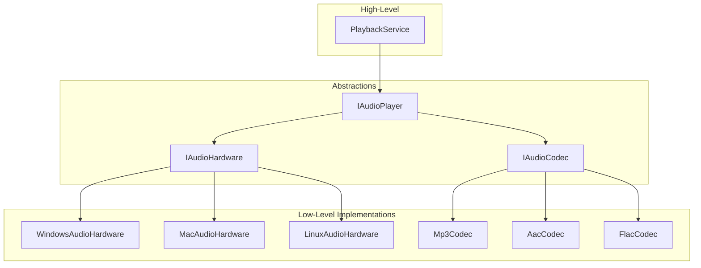
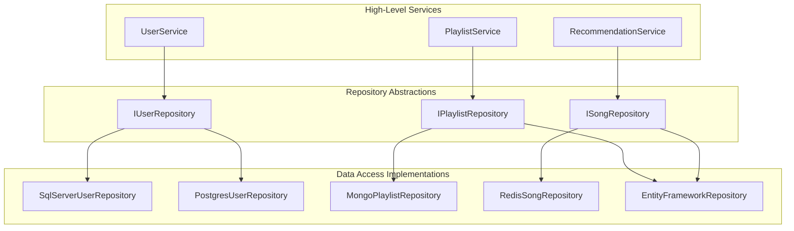
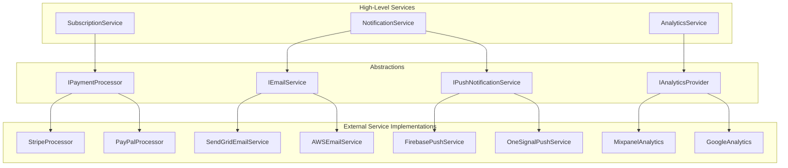

# Part 6: Dependency Inversion Principle
## Depend on Abstractions, Not Concretions - The .NET 10 Way

---

**Subtitle:**
How Spotify ensures high-level playback logic doesn't depend on low-level audio hardware, databases, or external APIs—using .NET 10, Dependency Injection, Factory Patterns, and Abstractions.

**Keywords:**
Dependency Inversion Principle, DIP, .NET 10, C# 13, Dependency Injection, Inversion of Control, Factory Pattern, Abstractions, Spotify system design

---

## Introduction: The Rigid System Problem

**The Legacy Violation:**
```csharp
// BAD - High-level module depends directly on low-level details
public class MusicPlayer
{
    private readonly SqlServerUserRepository _userRepository;
    private readonly Mp3AudioHardware _audioHardware;
    private readonly FileSystemCache _cache;
    private readonly StripePaymentProcessor _paymentProcessor;
    private readonly SendGridEmailService _emailService;
    
    public MusicPlayer()
    {
        _userRepository = new SqlServerUserRepository();
        _audioHardware = new Mp3AudioHardware();
        _cache = new FileSystemCache();
        _paymentProcessor = new StripePaymentProcessor();
        _emailService = new SendGridEmailService();
    }
    
    public async Task PlaySongAsync(string userId, string songId)
    {
        var user = _userRepository.GetById(userId);
        if (!user.IsPremium)
        {
            // Play ad
            await _audioHardware.PlayAdAsync();
        }
        
        var stream = _cache.GetStream(songId) ?? 
                     await DownloadFromNetwork(songId);
        
        await _audioHardware.PlayAsync(stream);
    }
}
```

This code violates the Dependency Inversion Principle. The high-level `MusicPlayer` is tightly coupled to specific low-level implementations. You cannot:
- Test without actual database and hardware
- Swap to a different database (PostgreSQL instead of SQL Server)
- Use a different audio format (AAC instead of MP3)
- Change payment processors (PayPal instead of Stripe)
- Run in a different environment (test, staging, production)

**The Redefined View:**
The Dependency Inversion Principle states that:
1. **High-level modules should not depend on low-level modules.** Both should depend on abstractions.
2. **Abstractions should not depend on details.** Details should depend on abstractions.

In plain English: **Program to an interface, not an implementation.** Depend on things that don't change (abstractions) rather than things that do (concrete implementations).

**Why This Matters for Spotify:**

| Scenario | Without DIP | With DIP |
|----------|-------------|----------|
| Testing | Requires actual database, hardware | Mock abstractions, test in isolation |
| Changing database | Rewrite all dependent code | Swap implementation, no other changes |
| Adding audio format | Modify MusicPlayer | Add new implementation, inject it |
| Environment config | Hard-coded connections | Configured via DI container |
| Parallel development | Blocked by dependencies | Work against interfaces |

---

## The .NET 10 DIP Toolkit

### 1. Dependency Injection Container

```csharp
// WHY .NET 10: Built-in DI container with keyed services, scopes, and factories
var builder = Host.CreateApplicationBuilder(args);

// Register with different lifetimes
builder.Services.AddSingleton<IAudioPlayer, AudioPlayer>();
builder.Services.AddScoped<IUserRepository, UserRepository>();
builder.Services.AddTransient<IEmailService, EmailService>();

// Keyed services for multiple implementations
builder.Services.AddKeyedSingleton<IPaymentProcessor, StripeProcessor>("stripe");
builder.Services.AddKeyedSingleton<IPaymentProcessor, PayPalProcessor>("paypal");

// Factory registration
builder.Services.AddSingleton<IAudioOutputFactory, AudioOutputFactory>();

// Register with factory delegate
builder.Services.AddScoped<IPlaylistService>(sp =>
{
    var repo = sp.GetRequiredService<IPlaylistRepository>();
    var cache = sp.GetRequiredService<IMemoryCache>();
    return new CachedPlaylistService(repo, cache);
});
```

### 2. Abstractions (Interfaces)

```csharp
// WHY .NET 10: Interfaces define contracts that don't change
public interface IAudioPlayer
{
    Task PlayAsync(string streamUrl, CancellationToken ct = default);
    Task PauseAsync(CancellationToken ct = default);
    Task StopAsync(CancellationToken ct = default);
    Task SetVolumeAsync(float volume, CancellationToken ct = default);
    IObservable<PlaybackState> StateChanges { get; }
}
```

### 3. Factory Pattern

```csharp
// WHY .NET 10: Factories create complex dependencies
public interface IAudioOutputFactory
{
    IAudioPlayer CreatePlayer(string deviceId);
    IAudioPlayer CreateDefaultPlayer();
}

public class AudioOutputFactory : IAudioOutputFactory
{
    private readonly IServiceProvider _services;
    
    public AudioOutputFactory(IServiceProvider services)
    {
        _services = services;
    }
    
    public IAudioPlayer CreatePlayer(string deviceId)
    {
        return deviceId switch
        {
            "speaker" => _services.GetRequiredKeyedService<IAudioPlayer>("speaker"),
            "headphones" => _services.GetRequiredKeyedService<IAudioPlayer>("headphones"),
            "bluetooth" => _services.GetRequiredKeyedService<IAudioPlayer>("bluetooth"),
            _ => _services.GetRequiredService<IAudioPlayer>()
        };
    }
}
```

### 4. Options Pattern

```csharp
// WHY .NET 10: Configuration bound to strongly-typed objects
public class AudioSettings
{
    public int DefaultVolume { get; set; } = 50;
    public int BufferSizeMs { get; set; } = 5000;
    public bool EnableGaplessPlayback { get; set; } = true;
}

// Register
builder.Services.Configure<AudioSettings>(builder.Configuration.GetSection("Audio"));

// Use
public class AudioPlayer
{
    private readonly AudioSettings _settings;
    
    public AudioPlayer(IOptions<AudioSettings> options)
    {
        _settings = options.Value;
    }
}
```

### 5. Null Object Pattern

```csharp
// WHY .NET 10: Safe defaults that do nothing
public class NullAnalyticsService : IAnalyticsService
{
    public Task TrackPlayAsync(string songId) => Task.CompletedTask;
    public Task TrackPauseAsync(string songId) => Task.CompletedTask;
    public Task TrackSkipAsync(string songId) => Task.CompletedTask;
}

// Register as fallback
builder.Services.AddSingleton<IAnalyticsService, NullAnalyticsService>();
builder.Services.Decorate<IAnalyticsService, RealAnalyticsService>();
```

---

## Real Spotify Example 1: Audio Player with DIP

The audio player is a perfect example of DIP—high-level playback logic should not depend on low-level audio hardware.



### The DIP-Compliant Implementation

```csharp
// ========== Abstractions ==========

/// <summary>
/// RESPONSIBILITY: Define audio playback contract
/// High-level modules depend on this abstraction
/// </summary>
public interface IAudioPlayer
{
    Task PlayAsync(string contentId, CancellationToken cancellationToken = default);
    Task PauseAsync(CancellationToken cancellationToken = default);
    Task StopAsync(CancellationToken cancellationToken = default);
    Task SetVolumeAsync(float volume, CancellationToken cancellationToken = default);
    Task SeekAsync(TimeSpan position, CancellationToken cancellationToken = default);
    
    PlaybackState CurrentState { get; }
    IObservable<PlaybackState> StateChanged { get; }
    IObservable<TimeSpan> PositionChanged { get; }
}

public enum PlaybackState
{
    Stopped,
    Buffering,
    Playing,
    Paused,
    Error
}

/// <summary>
/// RESPONSIBILITY: Low-level audio hardware operations
/// </summary>
public interface IAudioHardware
{
    Task InitializeAsync(CancellationToken cancellationToken = default);
    Task PlayStreamAsync(Stream audioStream, AudioFormat format, CancellationToken cancellationToken = default);
    Task PauseAsync(CancellationToken cancellationToken = default);
    Task StopAsync(CancellationToken cancellationToken = default);
    Task SetVolumeAsync(float volume, CancellationToken cancellationToken = default);
    Task<TimeSpan> GetPositionAsync(CancellationToken cancellationToken = default);
    
    string DeviceName { get; }
    bool IsAvailable { get; }
}

/// <summary>
/// RESPONSIBILITY: Audio codec operations
/// </summary>
public interface IAudioCodec
{
    string FormatName { get; }
    bool CanDecode(string mimeType, string fileExtension);
    Task<DecodedAudio> DecodeAsync(Stream compressedStream, CancellationToken cancellationToken = default);
    AudioMetadata ExtractMetadata(Stream compressedStream);
}

public record AudioFormat(string MimeType, string Extension, int Bitrate);
public record DecodedAudio(Stream PcmStream, int SampleRate, int Channels, int BitsPerSample);
public record AudioMetadata(TimeSpan Duration, int Bitrate, string? Title, string? Artist);

// ========== High-Level Service ==========

/// <summary>
/// RESPONSIBILITY: Orchestrate playback using abstractions
/// Depends only on interfaces, not concrete implementations
/// </summary>
public class PlaybackService
{
    private readonly IAudioPlayer _audioPlayer;
    private readonly IContentRepository _contentRepository;
    private readonly IAnalyticsService _analytics;
    private readonly ILogger<PlaybackService> _logger;
    
    public PlaybackService(
        IAudioPlayer audioPlayer,
        IContentRepository contentRepository,
        IAnalyticsService analytics,
        ILogger<PlaybackService> logger)
    {
        _audioPlayer = audioPlayer;
        _contentRepository = contentRepository;
        _analytics = analytics;
        _logger = logger;
    }
    
    public async Task PlaySongAsync(string userId, string songId, CancellationToken cancellationToken = default)
    {
        _logger.LogInformation("Playing song {SongId} for user {UserId}", songId, userId);
        
        var content = await _contentRepository.GetContentAsync(songId, cancellationToken);
        
        await _audioPlayer.PlayAsync(content.StreamUrl, cancellationToken);
        
        await _analytics.TrackPlayAsync(userId, songId, cancellationToken);
    }
    
    public async Task PauseAsync(CancellationToken cancellationToken = default)
    {
        await _audioPlayer.PauseAsync(cancellationToken);
    }
    
    public async Task ResumeAsync(CancellationToken cancellationToken = default)
    {
        if (_audioPlayer.CurrentState == PlaybackState.Paused)
        {
            await _audioPlayer.PlayAsync(null, cancellationToken); // Resume current
        }
    }
}

// ========== Concrete Audio Player ==========

/// <summary>
/// RESPONSIBILITY: Concrete audio player implementation
/// Depends on hardware and codec abstractions
/// </summary>
public class AudioPlayer : IAudioPlayer, IDisposable
{
    private readonly IAudioHardware _hardware;
    private readonly IEnumerable<IAudioCodec> _codecs;
    private readonly ILogger<AudioPlayer> _logger;
    private readonly Subject<PlaybackState> _stateSubject = new();
    private readonly Subject<TimeSpan> _positionSubject = new();
    
    private PlaybackState _currentState = PlaybackState.Stopped;
    private CancellationTokenSource? _playbackCts;
    private Task? _playbackTask;
    
    public PlaybackState CurrentState => _currentState;
    public IObservable<PlaybackState> StateChanged => _stateSubject.AsObservable();
    public IObservable<TimeSpan> PositionChanged => _positionSubject.AsObservable();
    
    public AudioPlayer(
        IAudioHardware hardware,
        IEnumerable<IAudioCodec> codecs,
        ILogger<AudioPlayer> logger)
    {
        _hardware = hardware;
        _codecs = codecs;
        _logger = logger;
    }
    
    public async Task PlayAsync(string? contentId, CancellationToken cancellationToken = default)
    {
        if (contentId != null)
        {
            _logger.LogInformation("Playing new content: {ContentId}", contentId);
            _playbackCts = CancellationTokenSource.CreateLinkedTokenSource(cancellationToken);
            
            UpdateState(PlaybackState.Buffering);
            
            // In real app, would fetch stream based on contentId
            var stream = new MemoryStream(); // Placeholder
            
            // Select appropriate codec
            var codec = _codecs.FirstOrDefault(c => c.CanDecode("audio/mpeg", ".mp3"));
            
            if (codec == null)
            {
                throw new InvalidOperationException("No codec available for this format");
            }
            
            var decoded = await codec.DecodeAsync(stream, _playbackCts.Token);
            
            _playbackTask = PlayInternalAsync(decoded, _playbackCts.Token);
        }
        else
        {
            // Resume
            _logger.LogInformation("Resuming playback");
            await _hardware.PlayStreamAsync(Stream.Null, new AudioFormat("", "", 0), cancellationToken);
            UpdateState(PlaybackState.Playing);
        }
    }
    
    private async Task PlayInternalAsync(DecodedAudio decoded, CancellationToken cancellationToken)
    {
        try
        {
            await _hardware.PlayStreamAsync(decoded.PcmStream, 
                new AudioFormat("audio/pcm", ".pcm", 1411), cancellationToken);
            
            UpdateState(PlaybackState.Playing);
            
            // Position tracking
            while (!cancellationToken.IsCancellationRequested && 
                   _currentState == PlaybackState.Playing)
            {
                var position = await _hardware.GetPositionAsync(cancellationToken);
                _positionSubject.OnNext(position);
                await Task.Delay(100, cancellationToken);
            }
        }
        catch (OperationCanceledException)
        {
            _logger.LogDebug("Playback cancelled");
        }
        catch (Exception ex)
        {
            _logger.LogError(ex, "Playback error");
            UpdateState(PlaybackState.Error);
        }
    }
    
    public async Task PauseAsync(CancellationToken cancellationToken = default)
    {
        _logger.LogInformation("Pausing playback");
        await _hardware.PauseAsync(cancellationToken);
        UpdateState(PlaybackState.Paused);
    }
    
    public async Task StopAsync(CancellationToken cancellationToken = default)
    {
        _logger.LogInformation("Stopping playback");
        await _hardware.StopAsync(cancellationToken);
        UpdateState(PlaybackState.Stopped);
        
        _playbackCts?.Cancel();
        _playbackCts?.Dispose();
        _playbackCts = null;
    }
    
    public async Task SetVolumeAsync(float volume, CancellationToken cancellationToken = default)
    {
        await _hardware.SetVolumeAsync(volume, cancellationToken);
    }
    
    public async Task SeekAsync(TimeSpan position, CancellationToken cancellationToken = default)
    {
        // Would need to restart playback at position
        await StopAsync(cancellationToken);
        // Reload at position
    }
    
    private void UpdateState(PlaybackState newState)
    {
        if (_currentState == newState) return;
        
        _currentState = newState;
        _stateSubject.OnNext(newState);
    }
    
    public void Dispose()
    {
        _playbackCts?.Dispose();
        _stateSubject.Dispose();
        _positionSubject.Dispose();
    }
}

// ========== Platform-Specific Hardware Implementations ==========

/// <summary>
/// Windows implementation using WASAPI
/// </summary>
public class WindowsAudioHardware : IAudioHardware
{
    private readonly ILogger<WindowsAudioHardware> _logger;
    
    public string DeviceName => "Windows Audio";
    public bool IsAvailable => OperatingSystem.IsWindows();
    
    public WindowsAudioHardware(ILogger<WindowsAudioHardware> logger)
    {
        _logger = logger;
    }
    
    public Task InitializeAsync(CancellationToken cancellationToken = default)
    {
        _logger.LogInformation("Initializing Windows WASAPI audio");
        return Task.CompletedTask;
    }
    
    public async Task PlayStreamAsync(Stream audioStream, AudioFormat format, CancellationToken cancellationToken = default)
    {
        _logger.LogInformation("Playing through Windows audio with format {Format}", format.MimeType);
        // Windows-specific implementation
        await Task.Delay(10, cancellationToken);
    }
    
    public Task PauseAsync(CancellationToken cancellationToken = default)
    {
        _logger.LogDebug("Windows audio paused");
        return Task.CompletedTask;
    }
    
    public Task StopAsync(CancellationToken cancellationToken = default)
    {
        _logger.LogDebug("Windows audio stopped");
        return Task.CompletedTask;
    }
    
    public Task SetVolumeAsync(float volume, CancellationToken cancellationToken = default)
    {
        _logger.LogDebug("Windows volume set to {Volume}", volume);
        return Task.CompletedTask;
    }
    
    public Task<TimeSpan> GetPositionAsync(CancellationToken cancellationToken = default)
    {
        return Task.FromResult(TimeSpan.Zero);
    }
}

/// <summary>
/// macOS implementation using CoreAudio
/// </summary>
public class MacAudioHardware : IAudioHardware
{
    private readonly ILogger<MacAudioHardware> _logger;
    
    public string DeviceName => "macOS CoreAudio";
    public bool IsAvailable => OperatingSystem.IsMacOS();
    
    public MacAudioHardware(ILogger<MacAudioHardware> logger)
    {
        _logger = logger;
    }
    
    public Task InitializeAsync(CancellationToken cancellationToken = default)
    {
        _logger.LogInformation("Initializing macOS CoreAudio");
        return Task.CompletedTask;
    }
    
    public async Task PlayStreamAsync(Stream audioStream, AudioFormat format, CancellationToken cancellationToken = default)
    {
        _logger.LogInformation("Playing through macOS audio");
        await Task.Delay(10, cancellationToken);
    }
    
    public Task PauseAsync(CancellationToken cancellationToken = default)
    {
        _logger.LogDebug("macOS audio paused");
        return Task.CompletedTask;
    }
    
    public Task StopAsync(CancellationToken cancellationToken = default)
    {
        _logger.LogDebug("macOS audio stopped");
        return Task.CompletedTask;
    }
    
    public Task SetVolumeAsync(float volume, CancellationToken cancellationToken = default)
    {
        _logger.LogDebug("macOS volume set to {Volume}", volume);
        return Task.CompletedTask;
    }
    
    public Task<TimeSpan> GetPositionAsync(CancellationToken cancellationToken = default)
    {
        return Task.FromResult(TimeSpan.Zero);
    }
}

// ========== Codec Implementations ==========

public class Mp3Codec : IAudioCodec
{
    private readonly ILogger<Mp3Codec> _logger;
    
    public string FormatName => "MP3";
    
    public Mp3Codec(ILogger<Mp3Codec> logger)
    {
        _logger = logger;
    }
    
    public bool CanDecode(string mimeType, string fileExtension)
    {
        return mimeType.Contains("mpeg") || fileExtension.Equals(".mp3", StringComparison.OrdinalIgnoreCase);
    }
    
    public async Task<DecodedAudio> DecodeAsync(Stream compressedStream, CancellationToken cancellationToken = default)
    {
        _logger.LogDebug("Decoding MP3 stream");
        
        // MP3 decoding logic using NAudio or similar
        await Task.Delay(50, cancellationToken);
        
        var pcmStream = new MemoryStream(); // Placeholder
        return new DecodedAudio(pcmStream, 44100, 2, 16);
    }
    
    public AudioMetadata ExtractMetadata(Stream compressedStream)
    {
        return new AudioMetadata(TimeSpan.FromMinutes(3), 320, null, null);
    }
}

public class FlacCodec : IAudioCodec
{
    private readonly ILogger<FlacCodec> _logger;
    
    public string FormatName => "FLAC";
    
    public FlacCodec(ILogger<FlacCodec> logger)
    {
        _logger = logger;
    }
    
    public bool CanDecode(string mimeType, string fileExtension)
    {
        return mimeType.Contains("flac") || fileExtension.Equals(".flac", StringComparison.OrdinalIgnoreCase);
    }
    
    public async Task<DecodedAudio> DecodeAsync(Stream compressedStream, CancellationToken cancellationToken = default)
    {
        _logger.LogDebug("Decoding FLAC stream (lossless)");
        
        await Task.Delay(150, cancellationToken);
        
        var pcmStream = new MemoryStream();
        return new DecodedAudio(pcmStream, 96000, 2, 24);
    }
    
    public AudioMetadata ExtractMetadata(Stream compressedStream)
    {
        return new AudioMetadata(TimeSpan.FromMinutes(3), 1411, null, null);
    }
}

// ========== Dependency Injection Setup ==========

/*
// In Program.cs
var builder = Host.CreateApplicationBuilder(args);

// Register abstractions with appropriate implementations per platform
if (OperatingSystem.IsWindows())
{
    builder.Services.AddSingleton<IAudioHardware, WindowsAudioHardware>();
}
else if (OperatingSystem.IsMacOS())
{
    builder.Services.AddSingleton<IAudioHardware, MacAudioHardware>();
}
else
{
    builder.Services.AddSingleton<IAudioHardware, NullAudioHardware>();
}

// Register codecs
builder.Services.AddSingleton<IAudioCodec, Mp3Codec>();
builder.Services.AddSingleton<IAudioCodec, FlacCodec>();

// Register audio player
builder.Services.AddSingleton<IAudioPlayer, AudioPlayer>();

// Register high-level service
builder.Services.AddScoped<PlaybackService>();

var host = builder.Build();
host.Run();
*/
```

**DIP Benefits Achieved:**
- **PlaybackService** depends only on abstractions
- **AudioPlayer** depends on hardware and codec abstractions
- **Platform-specific** hardware can be swapped per OS
- **Codecs** can be added without changing player
- **Testing** with mocks is trivial

---

## Real Spotify Example 2: Repository Pattern with DIP

The repository pattern is a classic example of DIP—high-level services depend on repository abstractions, not concrete data access implementations.



### The Implementation

```csharp
// ========== Repository Abstractions ==========

public interface IUserRepository
{
    Task<User?> GetByIdAsync(string id, CancellationToken cancellationToken = default);
    Task<User?> GetByEmailAsync(string email, CancellationToken cancellationToken = default);
    Task<bool> ExistsAsync(string email, CancellationToken cancellationToken = default);
    Task AddAsync(User user, CancellationToken cancellationToken = default);
    Task UpdateAsync(User user, CancellationToken cancellationToken = default);
    Task DeleteAsync(string id, CancellationToken cancellationToken = default);
}

public interface IPlaylistRepository
{
    Task<Playlist?> GetByIdAsync(string id, CancellationToken cancellationToken = default);
    Task<List<Playlist>> GetByUserAsync(string userId, CancellationToken cancellationToken = default);
    Task AddAsync(Playlist playlist, CancellationToken cancellationToken = default);
    Task UpdateAsync(Playlist playlist, CancellationToken cancellationToken = default);
    Task DeleteAsync(string id, CancellationToken cancellationToken = default);
    Task AddSongAsync(string playlistId, string songId, CancellationToken cancellationToken = default);
    Task RemoveSongAsync(string playlistId, string songId, CancellationToken cancellationToken = default);
}

public interface ISongRepository
{
    Task<Song?> GetByIdAsync(string id, CancellationToken cancellationToken = default);
    Task<List<Song>> GetByIdsAsync(IEnumerable<string> ids, CancellationToken cancellationToken = default);
    Task<List<Song>> GetByArtistAsync(string artist, int limit = 50, CancellationToken cancellationToken = default);
    Task<List<Song>> GetMostPopularAsync(int count, CancellationToken cancellationToken = default);
    Task IncrementPlayCountAsync(string id, CancellationToken cancellationToken = default);
}

// ========== High-Level Service Using Abstractions ==========

/// <summary>
/// RESPONSIBILITY: User management - depends only on IUserRepository
/// </summary>
public class UserService
{
    private readonly IUserRepository _userRepository;
    private readonly IPasswordHasher _passwordHasher;
    private readonly IEmailService _emailService;
    private readonly ILogger<UserService> _logger;
    
    public UserService(
        IUserRepository userRepository,
        IPasswordHasher passwordHasher,
        IEmailService emailService,
        ILogger<UserService> logger)
    {
        _userRepository = userRepository;
        _passwordHasher = passwordHasher;
        _emailService = emailService;
        _logger = logger;
    }
    
    public async Task<User> RegisterAsync(string email, string password, CancellationToken cancellationToken = default)
    {
        _logger.LogInformation("Registering user {Email}", email);
        
        if (await _userRepository.ExistsAsync(email, cancellationToken))
        {
            throw new InvalidOperationException("User already exists");
        }
        
        var user = new User
        {
            Id = Guid.NewGuid().ToString(),
            Email = email,
            PasswordHash = _passwordHasher.Hash(password),
            CreatedAt = DateTime.UtcNow
        };
        
        await _userRepository.AddAsync(user, cancellationToken);
        await _emailService.SendWelcomeEmailAsync(user, cancellationToken);
        
        return user;
    }
    
    public async Task<User?> GetUserAsync(string id, CancellationToken cancellationToken = default)
    {
        return await _userRepository.GetByIdAsync(id, cancellationToken);
    }
}

// ========== SQL Server Implementation ==========

public class SqlServerUserRepository : IUserRepository
{
    private readonly SpotifyDbContext _context;
    private readonly ILogger<SqlServerUserRepository> _logger;
    
    public SqlServerUserRepository(SpotifyDbContext context, ILogger<SqlServerUserRepository> logger)
    {
        _context = context;
        _logger = logger;
    }
    
    public async Task<User?> GetByIdAsync(string id, CancellationToken cancellationToken = default)
    {
        return await _context.Users
            .AsNoTracking()
            .FirstOrDefaultAsync(u => u.Id == id, cancellationToken);
    }
    
    public async Task<User?> GetByEmailAsync(string email, CancellationToken cancellationToken = default)
    {
        return await _context.Users
            .AsNoTracking()
            .FirstOrDefaultAsync(u => u.Email == email, cancellationToken);
    }
    
    public async Task<bool> ExistsAsync(string email, CancellationToken cancellationToken = default)
    {
        return await _context.Users.AnyAsync(u => u.Email == email, cancellationToken);
    }
    
    public async Task AddAsync(User user, CancellationToken cancellationToken = default)
    {
        await _context.Users.AddAsync(user, cancellationToken);
        await _context.SaveChangesAsync(cancellationToken);
        _logger.LogInformation("Added user {UserId} to SQL Server", user.Id);
    }
    
    public async Task UpdateAsync(User user, CancellationToken cancellationToken = default)
    {
        _context.Users.Update(user);
        await _context.SaveChangesAsync(cancellationToken);
        _logger.LogDebug("Updated user {UserId} in SQL Server", user.Id);
    }
    
    public async Task DeleteAsync(string id, CancellationToken cancellationToken = default)
    {
        var user = await _context.Users.FindAsync([id], cancellationToken);
        if (user != null)
        {
            _context.Users.Remove(user);
            await _context.SaveChangesAsync(cancellationToken);
            _logger.LogInformation("Deleted user {UserId} from SQL Server", id);
        }
    }
}

// ========== PostgreSQL Implementation ==========

public class PostgresUserRepository : IUserRepository
{
    private readonly NpgsqlConnection _connection;
    private readonly ILogger<PostgresUserRepository> _logger;
    
    public PostgresUserRepository(IConfiguration configuration, ILogger<PostgresUserRepository> logger)
    {
        _connection = new NpgsqlConnection(configuration.GetConnectionString("Postgres"));
        _logger = logger;
    }
    
    public async Task<User?> GetByIdAsync(string id, CancellationToken cancellationToken = default)
    {
        const string sql = "SELECT * FROM users WHERE id = @id";
        
        await using var cmd = new NpgsqlCommand(sql, _connection);
        cmd.Parameters.AddWithValue("id", id);
        
        await _connection.OpenAsync(cancellationToken);
        await using var reader = await cmd.ExecuteReaderAsync(cancellationToken);
        
        if (await reader.ReadAsync(cancellationToken))
        {
            return MapToUser(reader);
        }
        
        return null;
    }
    
    public async Task<User?> GetByEmailAsync(string email, CancellationToken cancellationToken = default)
    {
        const string sql = "SELECT * FROM users WHERE email = @email";
        
        await using var cmd = new NpgsqlCommand(sql, _connection);
        cmd.Parameters.AddWithValue("email", email);
        
        await _connection.OpenAsync(cancellationToken);
        await using var reader = await cmd.ExecuteReaderAsync(cancellationToken);
        
        if (await reader.ReadAsync(cancellationToken))
        {
            return MapToUser(reader);
        }
        
        return null;
    }
    
    public async Task<bool> ExistsAsync(string email, CancellationToken cancellationToken = default)
    {
        const string sql = "SELECT COUNT(*) FROM users WHERE email = @email";
        
        await using var cmd = new NpgsqlCommand(sql, _connection);
        cmd.Parameters.AddWithValue("email", email);
        
        await _connection.OpenAsync(cancellationToken);
        var count = (long)await cmd.ExecuteScalarAsync(cancellationToken);
        
        return count > 0;
    }
    
    public async Task AddAsync(User user, CancellationToken cancellationToken = default)
    {
        const string sql = @"
            INSERT INTO users (id, email, password_hash, created_at)
            VALUES (@id, @email, @passwordHash, @createdAt)";
        
        await using var cmd = new NpgsqlCommand(sql, _connection);
        cmd.Parameters.AddWithValue("id", user.Id);
        cmd.Parameters.AddWithValue("email", user.Email);
        cmd.Parameters.AddWithValue("passwordHash", user.PasswordHash);
        cmd.Parameters.AddWithValue("createdAt", user.CreatedAt);
        
        await _connection.OpenAsync(cancellationToken);
        await cmd.ExecuteNonQueryAsync(cancellationToken);
        
        _logger.LogInformation("Added user {UserId} to PostgreSQL", user.Id);
    }
    
    public async Task UpdateAsync(User user, CancellationToken cancellationToken = default)
    {
        const string sql = @"
            UPDATE users 
            SET email = @email, password_hash = @passwordHash
            WHERE id = @id";
        
        await using var cmd = new NpgsqlCommand(sql, _connection);
        cmd.Parameters.AddWithValue("id", user.Id);
        cmd.Parameters.AddWithValue("email", user.Email);
        cmd.Parameters.AddWithValue("passwordHash", user.PasswordHash);
        
        await _connection.OpenAsync(cancellationToken);
        await cmd.ExecuteNonQueryAsync(cancellationToken);
        
        _logger.LogDebug("Updated user {UserId} in PostgreSQL", user.Id);
    }
    
    public async Task DeleteAsync(string id, CancellationToken cancellationToken = default)
    {
        const string sql = "DELETE FROM users WHERE id = @id";
        
        await using var cmd = new NpgsqlCommand(sql, _connection);
        cmd.Parameters.AddWithValue("id", id);
        
        await _connection.OpenAsync(cancellationToken);
        await cmd.ExecuteNonQueryAsync(cancellationToken);
        
        _logger.LogInformation("Deleted user {UserId} from PostgreSQL", id);
    }
    
    private User MapToUser(NpgsqlDataReader reader)
    {
        return new User
        {
            Id = reader.GetString(0),
            Email = reader.GetString(1),
            PasswordHash = reader.GetString(2),
            CreatedAt = reader.GetDateTime(3)
        };
    }
}

// ========== Caching Decorator for Repository ==========

/// <summary>
/// Decorator that adds caching to any IUserRepository
/// </summary>
public class CachedUserRepository : IUserRepository
{
    private readonly IUserRepository _inner;
    private readonly IMemoryCache _cache;
    private readonly ILogger<CachedUserRepository> _logger;
    
    public CachedUserRepository(
        IUserRepository inner,
        IMemoryCache cache,
        ILogger<CachedUserRepository> logger)
    {
        _inner = inner;
        _cache = cache;
        _logger = logger;
    }
    
    public async Task<User?> GetByIdAsync(string id, CancellationToken cancellationToken = default)
    {
        var cacheKey = $"user_{id}";
        
        if (_cache.TryGetValue<User?>(cacheKey, out var cached))
        {
            _logger.LogDebug("Cache hit for user {UserId}", id);
            return cached;
        }
        
        _logger.LogDebug("Cache miss for user {UserId}", id);
        
        var user = await _inner.GetByIdAsync(id, cancellationToken);
        
        if (user != null)
        {
            _cache.Set(cacheKey, user, TimeSpan.FromMinutes(5));
        }
        
        return user;
    }
    
    public async Task<User?> GetByEmailAsync(string email, CancellationToken cancellationToken = default)
    {
        // Similar caching logic
        return await _inner.GetByEmailAsync(email, cancellationToken);
    }
    
    public async Task<bool> ExistsAsync(string email, CancellationToken cancellationToken = default)
    {
        return await _inner.ExistsAsync(email, cancellationToken);
    }
    
    public async Task AddAsync(User user, CancellationToken cancellationToken = default)
    {
        await _inner.AddAsync(user, cancellationToken);
        
        // Invalidate cache
        _cache.Remove($"user_{user.Id}");
        _cache.Remove($"user_email_{user.Email}");
    }
    
    public async Task UpdateAsync(User user, CancellationToken cancellationToken = default)
    {
        await _inner.UpdateAsync(user, cancellationToken);
        
        // Invalidate cache
        _cache.Remove($"user_{user.Id}");
        _cache.Remove($"user_email_{user.Email}");
    }
    
    public async Task DeleteAsync(string id, CancellationToken cancellationToken = default)
    {
        await _inner.DeleteAsync(id, cancellationToken);
        
        // Invalidate cache
        _cache.Remove($"user_{id}");
    }
}

// ========== Repository Factory ==========

/// <summary>
/// Factory that creates appropriate repository based on configuration
/// </summary>
public class UserRepositoryFactory
{
    private readonly IServiceProvider _serviceProvider;
    private readonly IConfiguration _configuration;
    
    public UserRepositoryFactory(IServiceProvider serviceProvider, IConfiguration configuration)
    {
        _serviceProvider = serviceProvider;
        _configuration = configuration;
    }
    
    public IUserRepository CreateRepository()
    {
        var provider = _configuration["DatabaseProvider"];
        
        IUserRepository repository = provider switch
        {
            "SqlServer" => _serviceProvider.GetRequiredService<SqlServerUserRepository>(),
            "PostgreSQL" => _serviceProvider.GetRequiredService<PostgresUserRepository>(),
            _ => _serviceProvider.GetRequiredService<SqlServerUserRepository>()
        };
        
        // Decorate with caching if enabled
        if (_configuration.GetValue<bool>("Features:EnableCaching"))
        {
            var cache = _serviceProvider.GetRequiredService<IMemoryCache>();
            var logger = _serviceProvider.GetRequiredService<ILogger<CachedUserRepository>>();
            repository = new CachedUserRepository(repository, cache, logger);
        }
        
        return repository;
    }
}

// ========== Dependency Injection Setup ==========

/*
// In Program.cs
var builder = Host.CreateApplicationBuilder(args);

// Register repository implementations
builder.Services.AddScoped<SqlServerUserRepository>();
builder.Services.AddScoped<PostgresUserRepository>();

// Register factory
builder.Services.AddScoped<UserRepositoryFactory>();

// Register the repository based on configuration
builder.Services.AddScoped<IUserRepository>(sp =>
{
    var factory = sp.GetRequiredService<UserRepositoryFactory>();
    return factory.CreateRepository();
});

// Register services that depend on repository
builder.Services.AddScoped<UserService>();

// Register other dependencies
builder.Services.AddSingleton<IPasswordHasher, BCryptPasswordHasher>();
builder.Services.AddSingleton<IEmailService, SendGridEmailService>();
builder.Services.AddMemoryCache();

var host = builder.Build();
host.Run();
*/
```

**DIP Benefits Achieved:**
- **UserService** depends only on `IUserRepository`
- Can switch between SQL Server and PostgreSQL without changing service
- Caching added via decorator without modifying repository
- Factory pattern handles complex creation logic
- Configuration drives implementation selection

---

## Real Spotify Example 3: External Service Abstractions

Spotify integrates with many external services: payment processors, email providers, analytics platforms. DIP ensures these can be swapped.



### The Implementation

```csharp
// ========== Payment Abstractions ==========

public interface IPaymentProcessor
{
    string ProviderName { get; }
    Task<PaymentResult> ProcessPaymentAsync(PaymentRequest request, CancellationToken cancellationToken = default);
    Task<RefundResult> RefundAsync(RefundRequest request, CancellationToken cancellationToken = default);
    Task<PaymentMethod[]> GetAvailablePaymentMethodsAsync(string userId, CancellationToken cancellationToken = default);
    bool SupportsCurrency(string currencyCode);
}

public record PaymentRequest
{
    public required string TransactionId { get; init; }
    public required string UserId { get; init; }
    public required decimal Amount { get; init; }
    public required string CurrencyCode { get; init; }
    public required string PaymentMethod { get; init; }
    public Dictionary<string, string>? PaymentDetails { get; init; }
    public string? Description { get; init; }
}

public record PaymentResult
{
    public required bool Success { get; init; }
    public required string TransactionId { get; init; }
    public string? ProviderTransactionId { get; init; }
    public string? ErrorMessage { get; init; }
    public string? ErrorCode { get; init; }
}

public record RefundRequest
{
    public required string OriginalTransactionId { get; init; }
    public required decimal Amount { get; init; }
    public string? Reason { get; init; }
}

public record RefundResult
{
    public required bool Success { get; init; }
    public required string RefundId { get; init; }
    public string? ErrorMessage { get; init; }
}

public record PaymentMethod(string Id, string DisplayName, string IconUrl);

// ========== Stripe Implementation ==========

public class StripeProcessor : IPaymentProcessor
{
    private readonly IHttpClientFactory _httpClientFactory;
    private readonly IOptions<StripeOptions> _options;
    private readonly ILogger<StripeProcessor> _logger;
    
    public string ProviderName => "Stripe";
    
    public StripeProcessor(
        IHttpClientFactory httpClientFactory,
        IOptions<StripeOptions> options,
        ILogger<StripeProcessor> logger)
    {
        _httpClientFactory = httpClientFactory;
        _options = options;
        _logger = logger;
    }
    
    public async Task<PaymentResult> ProcessPaymentAsync(PaymentRequest request, CancellationToken cancellationToken = default)
    {
        _logger.LogInformation("Processing {Amount} {Currency} via Stripe", request.Amount, request.CurrencyCode);
        
        var client = _httpClientFactory.CreateClient("Stripe");
        
        var response = await client.PostAsJsonAsync("https://api.stripe.com/v1/charges", new
        {
            amount = (long)(request.Amount * 100),
            currency = request.CurrencyCode.ToLower(),
            description = request.Description,
            payment_method = request.PaymentDetails?["paymentMethodId"]
        }, cancellationToken);
        
        if (response.IsSuccessStatusCode)
        {
            var result = await response.Content.ReadFromJsonAsync<StripeChargeResponse>(cancellationToken);
            
            return new PaymentResult
            {
                Success = true,
                TransactionId = request.TransactionId,
                ProviderTransactionId = result?.Id
            };
        }
        
        var error = await response.Content.ReadAsStringAsync(cancellationToken);
        _logger.LogError("Stripe payment failed: {Error}", error);
        
        return new PaymentResult
        {
            Success = false,
            TransactionId = request.TransactionId,
            ErrorMessage = "Payment processing failed",
            ErrorCode = $"STRIPE_{response.StatusCode}"
        };
    }
    
    public async Task<RefundResult> RefundAsync(RefundRequest request, CancellationToken cancellationToken = default)
    {
        // Refund implementation
        return new RefundResult { Success = true, RefundId = Guid.NewGuid().ToString() };
    }
    
    public Task<PaymentMethod[]> GetAvailablePaymentMethodsAsync(string userId, CancellationToken cancellationToken = default)
    {
        return Task.FromResult(new[]
        {
            new PaymentMethod("card", "Credit Card", "https://stripe.com/card.png"),
            new PaymentMethod("apple_pay", "Apple Pay", "https://stripe.com/applepay.png")
        });
    }
    
    public bool SupportsCurrency(string currencyCode)
    {
        return new[] { "USD", "EUR", "GBP", "CAD", "AUD" }.Contains(currencyCode);
    }
}

// ========== PayPal Implementation ==========

public class PayPalProcessor : IPaymentProcessor
{
    private readonly IHttpClientFactory _httpClientFactory;
    private readonly ILogger<PayPalProcessor> _logger;
    
    public string ProviderName => "PayPal";
    
    public PayPalProcessor(IHttpClientFactory httpClientFactory, ILogger<PayPalProcessor> logger)
    {
        _httpClientFactory = httpClientFactory;
        _logger = logger;
    }
    
    public async Task<PaymentResult> ProcessPaymentAsync(PaymentRequest request, CancellationToken cancellationToken = default)
    {
        _logger.LogInformation("Processing {Amount} {Currency} via PayPal", request.Amount, request.CurrencyCode);
        
        // PayPal implementation
        await Task.Delay(100, cancellationToken);
        
        return new PaymentResult
        {
            Success = true,
            TransactionId = request.TransactionId,
            ProviderTransactionId = $"PP-{Guid.NewGuid()}"
        };
    }
    
    public async Task<RefundResult> RefundAsync(RefundRequest request, CancellationToken cancellationToken = default)
    {
        await Task.Delay(50, cancellationToken);
        return new RefundResult { Success = true, RefundId = Guid.NewGuid().ToString() };
    }
    
    public Task<PaymentMethod[]> GetAvailablePaymentMethodsAsync(string userId, CancellationToken cancellationToken = default)
    {
        return Task.FromResult(new[]
        {
            new PaymentMethod("paypal", "PayPal", "https://paypal.com/logo.png"),
            new PaymentMethod("credit", "PayPal Credit", "https://paypal.com/credit.png")
        });
    }
    
    public bool SupportsCurrency(string currencyCode)
    {
        return new[] { "USD", "EUR", "GBP", "AUD", "CAD", "JPY" }.Contains(currencyCode);
    }
}

// ========== High-Level Subscription Service ==========

/// <summary>
/// RESPONSIBILITY: Manage subscriptions using any payment processor
/// </summary>
public class SubscriptionService
{
    private readonly IPaymentProcessor _paymentProcessor;
    private readonly IUserRepository _userRepository;
    private readonly ISubscriptionRepository _subscriptionRepository;
    private readonly ILogger<SubscriptionService> _logger;
    
    public SubscriptionService(
        IPaymentProcessor paymentProcessor,
        IUserRepository userRepository,
        ISubscriptionRepository subscriptionRepository,
        ILogger<SubscriptionService> logger)
    {
        _paymentProcessor = paymentProcessor;
        _userRepository = userRepository;
        _subscriptionRepository = subscriptionRepository;
        _logger = logger;
    }
    
    public async Task<SubscriptionResult> UpgradeToPremiumAsync(
        string userId, 
        string paymentMethod, 
        Dictionary<string, string>? paymentDetails = null,
        CancellationToken cancellationToken = default)
    {
        _logger.LogInformation("Upgrading user {UserId} to premium via {Provider}", 
            userId, _paymentProcessor.ProviderName);
        
        var user = await _userRepository.GetByIdAsync(userId, cancellationToken);
        if (user == null)
            throw new UserNotFoundException(userId);
        
        // Process payment
        var paymentRequest = new PaymentRequest
        {
            TransactionId = Guid.NewGuid().ToString(),
            UserId = userId,
            Amount = 9.99m,
            CurrencyCode = "USD",
            PaymentMethod = paymentMethod,
            PaymentDetails = paymentDetails,
            Description = "Spotify Premium Monthly"
        };
        
        var paymentResult = await _paymentProcessor.ProcessPaymentAsync(paymentRequest, cancellationToken);
        
        if (!paymentResult.Success)
        {
            return new SubscriptionResult(false, "Payment failed: " + paymentResult.ErrorMessage);
        }
        
        // Create subscription
        var subscription = new Subscription
        {
            Id = Guid.NewGuid().ToString(),
            UserId = userId,
            Tier = SubscriptionTier.Premium,
            StartedAt = DateTime.UtcNow,
            ExpiresAt = DateTime.UtcNow.AddMonths(1),
            PaymentProvider = _paymentProcessor.ProviderName,
            ProviderTransactionId = paymentResult.ProviderTransactionId
        };
        
        await _subscriptionRepository.AddAsync(subscription, cancellationToken);
        
        // Update user
        user.Tier = SubscriptionTier.Premium;
        await _userRepository.UpdateAsync(user, cancellationToken);
        
        _logger.LogInformation("User {UserId} upgraded to premium", userId);
        
        return new SubscriptionResult(true, "Successfully upgraded to Premium", subscription);
    }
    
    public async Task<bool> CancelSubscriptionAsync(string userId, CancellationToken cancellationToken = default)
    {
        var subscription = await _subscriptionRepository.GetActiveForUserAsync(userId, cancellationToken);
        if (subscription == null)
            return false;
        
        subscription.CancelledAt = DateTime.UtcNow;
        await _subscriptionRepository.UpdateAsync(subscription, cancellationToken);
        
        var user = await _userRepository.GetByIdAsync(userId, cancellationToken);
        if (user != null)
        {
            user.Tier = SubscriptionTier.Free;
            await _userRepository.UpdateAsync(user, cancellationToken);
        }
        
        return true;
    }
}

public record SubscriptionResult(bool Success, string Message, Subscription? Subscription = null);

// ========== Payment Processor Factory ==========

/// <summary>
/// Factory that creates appropriate payment processor based on configuration
/// </summary>
public class PaymentProcessorFactory
{
    private readonly IServiceProvider _serviceProvider;
    private readonly IConfiguration _configuration;
    
    public PaymentProcessorFactory(IServiceProvider serviceProvider, IConfiguration configuration)
    {
        _serviceProvider = serviceProvider;
        _configuration = configuration;
    }
    
    public IPaymentProcessor GetDefaultProcessor()
    {
        var providerName = _configuration["Payment:DefaultProvider"] ?? "Stripe";
        return GetProcessor(providerName);
    }
    
    public IPaymentProcessor GetProcessor(string providerName)
    {
        return providerName.ToLower() switch
        {
            "stripe" => _serviceProvider.GetRequiredKeyedService<IPaymentProcessor>("stripe"),
            "paypal" => _serviceProvider.GetRequiredKeyedService<IPaymentProcessor>("paypal"),
            _ => _serviceProvider.GetRequiredKeyedService<IPaymentProcessor>("stripe")
        };
    }
    
    public IPaymentProcessor GetProcessorForCurrency(string currencyCode)
    {
        var processors = _serviceProvider.GetServices<IPaymentProcessor>();
        return processors.FirstOrDefault(p => p.SupportsCurrency(currencyCode))
            ?? _serviceProvider.GetRequiredKeyedService<IPaymentProcessor>("stripe");
    }
}

// ========== Dependency Injection Setup ==========

/*
// In Program.cs
var builder = Host.CreateApplicationBuilder(args);

// Register payment processors with keys
builder.Services.AddKeyedSingleton<IPaymentProcessor, StripeProcessor>("stripe");
builder.Services.AddKeyedSingleton<IPaymentProcessor, PayPalProcessor>("paypal");

// Register factory
builder.Services.AddSingleton<PaymentProcessorFactory>();

// Register the processor based on context
builder.Services.AddScoped<IPaymentProcessor>(sp =>
{
    var factory = sp.GetRequiredService<PaymentProcessorFactory>();
    return factory.GetDefaultProcessor();
});

// Register services
builder.Services.AddScoped<SubscriptionService>();
builder.Services.AddScoped<IUserRepository, SqlServerUserRepository>();
builder.Services.AddScoped<ISubscriptionRepository, SubscriptionRepository>();

// Configure Stripe options
builder.Services.Configure<StripeOptions>(builder.Configuration.GetSection("Stripe"));

var host = builder.Build();
host.Run();
*/
```

**DIP Benefits Achieved:**
- **SubscriptionService** depends only on `IPaymentProcessor`
- Can switch between Stripe and PayPal without changing service
- Factory selects appropriate processor based on currency or configuration
- New payment providers added without modifying existing code
- Testing with mock payment processor is trivial

---

## Real Spotify Example 4: Testing with DIP

DIP makes testing trivial by allowing dependencies to be mocked.

```csharp
// ========== Service Under Test ==========

public class RecommendationService
{
    private readonly IUserRepository _userRepository;
    private readonly ISongRepository _songRepository;
    private readonly IRecommendationStrategy _strategy;
    private readonly IAnalyticsService _analytics;
    private readonly ILogger<RecommendationService> _logger;
    
    public RecommendationService(
        IUserRepository userRepository,
        ISongRepository songRepository,
        IRecommendationStrategy strategy,
        IAnalyticsService analytics,
        ILogger<RecommendationService> logger)
    {
        _userRepository = userRepository;
        _songRepository = songRepository;
        _strategy = strategy;
        _analytics = analytics;
        _logger = logger;
    }
    
    public async Task<List<Song>> GetRecommendationsAsync(string userId, int count, CancellationToken cancellationToken = default)
    {
        _logger.LogInformation("Getting recommendations for user {UserId}", userId);
        
        var user = await _userRepository.GetByIdAsync(userId, cancellationToken);
        if (user == null)
            throw new UserNotFoundException(userId);
        
        var songIds = await _strategy.GetRecommendationsAsync(userId, count, cancellationToken);
        var songs = await _songRepository.GetByIdsAsync(songIds, cancellationToken);
        
        await _analytics.TrackRecommendationsAsync(userId, songIds, cancellationToken);
        
        return songs;
    }
}

// ========== Unit Tests ==========

public class RecommendationServiceTests
{
    [Fact]
    public async Task GetRecommendationsAsync_WhenUserExists_ReturnsRecommendations()
    {
        // Arrange
        var userId = "test-user";
        var expectedSongs = new List<Song> 
        { 
            new Song { Id = "song-1", Title = "Song 1" },
            new Song { Id = "song-2", Title = "Song 2" }
        };
        
        var userRepository = new Mock<IUserRepository>();
        userRepository.Setup(r => r.GetByIdAsync(userId, It.IsAny<CancellationToken>()))
            .ReturnsAsync(new User { Id = userId, Email = "test@example.com" });
        
        var songRepository = new Mock<ISongRepository>();
        songRepository.Setup(r => r.GetByIdsAsync(
                It.Is<List<string>>(ids => ids.Count == 2), 
                It.IsAny<CancellationToken>()))
            .ReturnsAsync(expectedSongs);
        
        var strategy = new Mock<IRecommendationStrategy>();
        strategy.Setup(s => s.GetRecommendationsAsync(
                userId, 10, It.IsAny<CancellationToken>()))
            .ReturnsAsync(new List<string> { "song-1", "song-2" });
        
        var analytics = new Mock<IAnalyticsService>();
        
        var logger = new Mock<ILogger<RecommendationService>>();
        
        var service = new RecommendationService(
            userRepository.Object,
            songRepository.Object,
            strategy.Object,
            analytics.Object,
            logger.Object);
        
        // Act
        var result = await service.GetRecommendationsAsync(userId, 10);
        
        // Assert
        Assert.Equal(2, result.Count);
        Assert.Equal("Song 1", result[0].Title);
        
        userRepository.Verify(r => r.GetByIdAsync(userId, It.IsAny<CancellationToken>()), Times.Once);
        strategy.Verify(s => s.GetRecommendationsAsync(userId, 10, It.IsAny<CancellationToken>()), Times.Once);
        songRepository.Verify(r => r.GetByIdsAsync(
            It.Is<List<string>>(ids => ids.Contains("song-1")), 
            It.IsAny<CancellationToken>()), Times.Once);
        analytics.Verify(a => a.TrackRecommendationsAsync(
            userId, 
            It.Is<List<string>>(ids => ids.Count == 2), 
            It.IsAny<CancellationToken>()), Times.Once);
    }
    
    [Fact]
    public async Task GetRecommendationsAsync_WhenUserNotFound_ThrowsException()
    {
        // Arrange
        var userId = "non-existent";
        
        var userRepository = new Mock<IUserRepository>();
        userRepository.Setup(r => r.GetByIdAsync(userId, It.IsAny<CancellationToken>()))
            .ReturnsAsync((User?)null);
        
        var service = new RecommendationService(
            userRepository.Object,
            Mock.Of<ISongRepository>(),
            Mock.Of<IRecommendationStrategy>(),
            Mock.Of<IAnalyticsService>(),
            Mock.Of<ILogger<RecommendationService>>());
        
        // Act & Assert
        await Assert.ThrowsAsync<UserNotFoundException>(() => 
            service.GetRecommendationsAsync(userId, 10));
    }
    
    [Fact]
    public async Task GetRecommendationsAsync_WhenStrategyFails_PropagatesException()
    {
        // Arrange
        var userId = "test-user";
        
        var userRepository = new Mock<IUserRepository>();
        userRepository.Setup(r => r.GetByIdAsync(userId, It.IsAny<CancellationToken>()))
            .ReturnsAsync(new User { Id = userId });
        
        var strategy = new Mock<IRecommendationStrategy>();
        strategy.Setup(s => s.GetRecommendationsAsync(userId, 10, It.IsAny<CancellationToken>()))
            .ThrowsAsync(new HttpRequestException("API error"));
        
        var service = new RecommendationService(
            userRepository.Object,
            Mock.Of<ISongRepository>(),
            strategy.Object,
            Mock.Of<IAnalyticsService>(),
            Mock.Of<ILogger<RecommendationService>>());
        
        // Act & Assert
        await Assert.ThrowsAsync<HttpRequestException>(() => 
            service.GetRecommendationsAsync(userId, 10));
    }
}

// ========== Integration Tests with Test Implementations ==========

public class TestUserRepository : IUserRepository
{
    private readonly Dictionary<string, User> _users = new();
    
    public Task<User?> GetByIdAsync(string id, CancellationToken cancellationToken = default)
    {
        _users.TryGetValue(id, out var user);
        return Task.FromResult(user);
    }
    
    public Task<User?> GetByEmailAsync(string email, CancellationToken cancellationToken = default)
    {
        var user = _users.Values.FirstOrDefault(u => u.Email == email);
        return Task.FromResult(user);
    }
    
    public Task<bool> ExistsAsync(string email, CancellationToken cancellationToken = default)
    {
        return Task.FromResult(_users.Values.Any(u => u.Email == email));
    }
    
    public Task AddAsync(User user, CancellationToken cancellationToken = default)
    {
        _users[user.Id] = user;
        return Task.CompletedTask;
    }
    
    public Task UpdateAsync(User user, CancellationToken cancellationToken = default)
    {
        _users[user.Id] = user;
        return Task.CompletedTask;
    }
    
    public Task DeleteAsync(string id, CancellationToken cancellationToken = default)
    {
        _users.Remove(id);
        return Task.CompletedTask;
    }
}

public class TestRecommendationStrategy : IRecommendationStrategy
{
    private readonly List<string> _recommendations;
    
    public TestRecommendationStrategy(List<string> recommendations)
    {
        _recommendations = recommendations;
    }
    
    public Task<List<string>> GetRecommendationsAsync(string userId, int count, CancellationToken cancellationToken = default)
    {
        return Task.FromResult(_recommendations.Take(count).ToList());
    }
}

// Integration test using test implementations
public class RecommendationServiceIntegrationTests
{
    [Fact]
    public async Task GetRecommendationsAsync_WithTestImplementations_Works()
    {
        // Arrange
        var userId = "test-user";
        
        var userRepo = new TestUserRepository();
        await userRepo.AddAsync(new User { Id = userId, Email = "test@example.com" });
        
        var songRepo = new Mock<ISongRepository>();
        songRepo.Setup(r => r.GetByIdsAsync(It.IsAny<List<string>>(), It.IsAny<CancellationToken>()))
            .ReturnsAsync((List<string> ids, CancellationToken ct) => 
                ids.Select(id => new Song { Id = id, Title = $"Song {id}" }).ToList());
        
        var strategy = new TestRecommendationStrategy(new List<string> { "song-1", "song-2", "song-3" });
        
        var service = new RecommendationService(
            userRepo,
            songRepo.Object,
            strategy,
            Mock.Of<IAnalyticsService>(),
            Mock.Of<ILogger<RecommendationService>>());
        
        // Act
        var result = await service.GetRecommendationsAsync(userId, 2);
        
        // Assert
        Assert.Equal(2, result.Count);
        Assert.Equal("Song song-1", result[0].Title);
    }
}
```

**Testing Benefits with DIP:**
- **Mock abstractions** easily with Moq
- **Test implementations** for integration tests
- **Isolated tests** without real dependencies
- **Fast tests** without database or network
- **Comprehensive coverage** of edge cases

---

## DIP Anti-Patterns to Avoid

### 1. The "New" Keyword in Business Logic

```csharp
// BAD
public class PlaylistService
{
    public async Task AddSongAsync(string playlistId, string songId)
    {
        var repository = new SqlServerPlaylistRepository(); // Direct dependency!
        var playlist = await repository.GetByIdAsync(playlistId);
        // ...
    }
}
```

### 2. Static Method Calls

```csharp
// BAD
public class Logger
{
    public static void Log(string message) { }
}

public class PlaybackService
{
    public async Task PlayAsync()
    {
        Logger.Log("Playing"); // Hard dependency!
    }
}
```

### 3. Concrete Types in Method Signatures

```csharp
// BAD
public class UserService
{
    public async Task ProcessUserAsync(SqlServerUser user) // Depends on concrete type
    {
        // ...
    }
}
```

### 4. Service Locator Pattern

```csharp
// BAD
public class PlaybackService
{
    public async Task PlayAsync()
    {
        var repo = ServiceLocator.Get<ISongRepository>(); // Hidden dependency
    }
}
```

### 5. Tollgate Pattern (Static Factory)

```csharp
// BAD
public static class RepositoryFactory
{
    public static IUserRepository Create() => new SqlServerUserRepository(); // Hard-coded
}
```

---

## DIP Refactoring Checklist

When checking for DIP violations, ask these questions:

1. **Does high-level code create concrete instances with `new`?** Inject instead.
2. **Are there static method calls to utilities?** Consider injecting.
3. **Do method signatures use concrete types?** Use interfaces.
4. **Can you test without real dependencies?** If not, DIP is violated.
5. **Can you swap implementations without changing code?** If not, DIP is violated.
6. **Are dependencies hidden (Service Locator)?** Make them explicit.
7. **Does configuration drive implementation choice?** Good sign of DIP.

---

## Conclusion: The DIP Mindset

The Dependency Inversion Principle is not about using interfaces everywhere. It's about **protecting high-level policy from changes in low-level details**. The core business logic of Spotify should not change when you switch databases, payment processors, or audio hardware.

**When you violate DIP:**
- Changes ripple through the system
- Testing requires real infrastructure
- Code is rigid and hard to change
- Parallel development is blocked

**When you follow DIP:**
- High-level policy is stable
- Details can change freely
- Testing is fast and isolated
- Teams work independently

**The .NET 10 Advantage:**
- **Built-in DI container** makes dependency injection natural
- **Keyed services** support multiple implementations
- **Factory patterns** handle complex creation
- **Options pattern** provides configuration
- **Decorator support** adds cross-cutting concerns
- **Testing frameworks** work seamlessly with abstractions

---

## Series Conclusion: The SOLID Foundation

Over this six-part series, we've rebuilt Spotify from the ground up using SOLID principles:

| Part | Principle | Key Insight |
|------|-----------|-------------|
| **1** | Introduction | SOLID as survival strategy |
| **2** | Single Responsibility | One reason to change |
| **3** | Open-Closed | Open for extension, closed for modification |
| **4** | Liskov Substitution | Subtypes must be substitutable |
| **5** | Interface Segregation | Don't depend on what you don't use |
| **6** | Dependency Inversion | Depend on abstractions |

**The Unified View:**
- **SRP** keeps classes focused
- **OCP** allows extension without modification
- **LSP** ensures polymorphism works
- **ISP** prevents fat interfaces
- **DIP** decouples policy from detail

**The .NET 10 Advantage Throughout:**
- **Reactive programming** with System.Reactive
- **Async streaming** with IAsyncEnumerable
- **Thread-safe queues** with Channel<T>
- **High-performance** with Native AOT
- **Clean data** with records
- **Explicit dependencies** with primary constructors
- **Flexible configuration** with options pattern
- **Testability** with DI and mocks

**The Final Lesson:**
SOLID is not about writing perfect code. It's about **designing for change**. Software that doesn't change is dead. SOLID keeps your code alive, adaptable, and maintainable for years to come.

When you face a design decision tomorrow, don't ask "Which SOLID principle applies?" Ask:
- "Who might want this to change?" → **SRP**
- "How will I add new features?" → **OCP**
- "Will subtypes behave as expected?" → **LSP**
- "What do clients actually need?" → **ISP**
- "What are the stable abstractions?" → **DIP**

Your code will thank you.

---