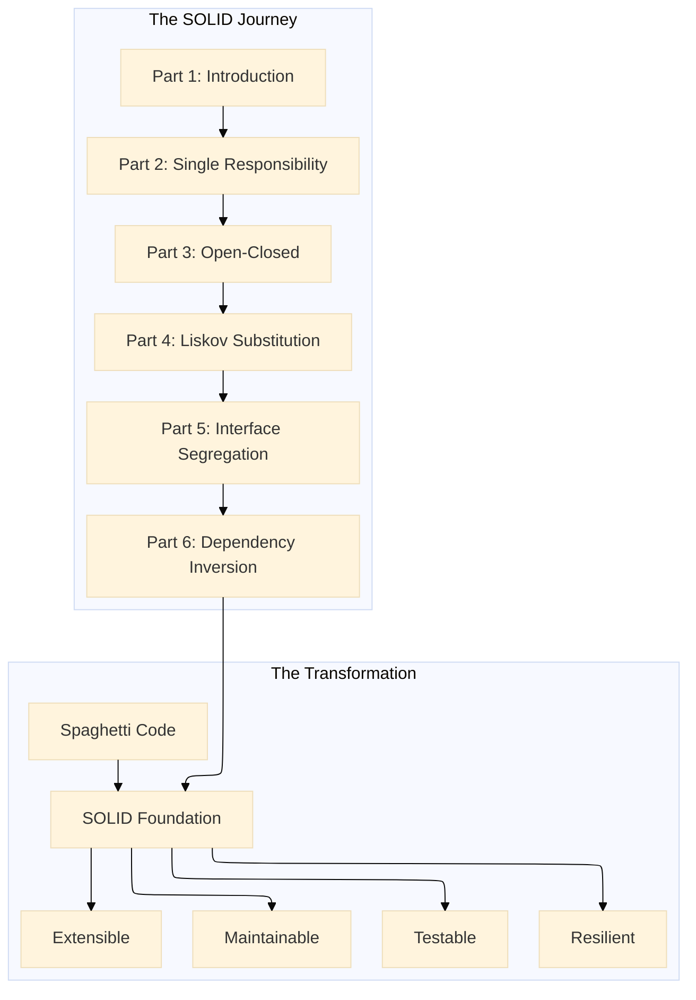

# *- Coming soon*

```mermaid
---
config:
  layout: elk
  theme: base
---
graph TD
    subgraph "The SOLID Journey"
        A[Part 1: Introduction] --> B[Part 2: Single Responsibility]
        B --> C[Part 3: Open-Closed]
        C --> D[Part 4: Liskov Substitution]
        D --> E[Part 5: Interface Segregation]
        E --> F[Part 6: Dependency Inversion]
    end
    
    subgraph "The Transformation"
        G[Spaghetti Code] --> H[SOLID Foundation]
        H --> I[Maintainable]
        H --> J[Testable]
        H --> K[Extensible]
        H --> L[Resilient]
    end
    
    F --> H
```
