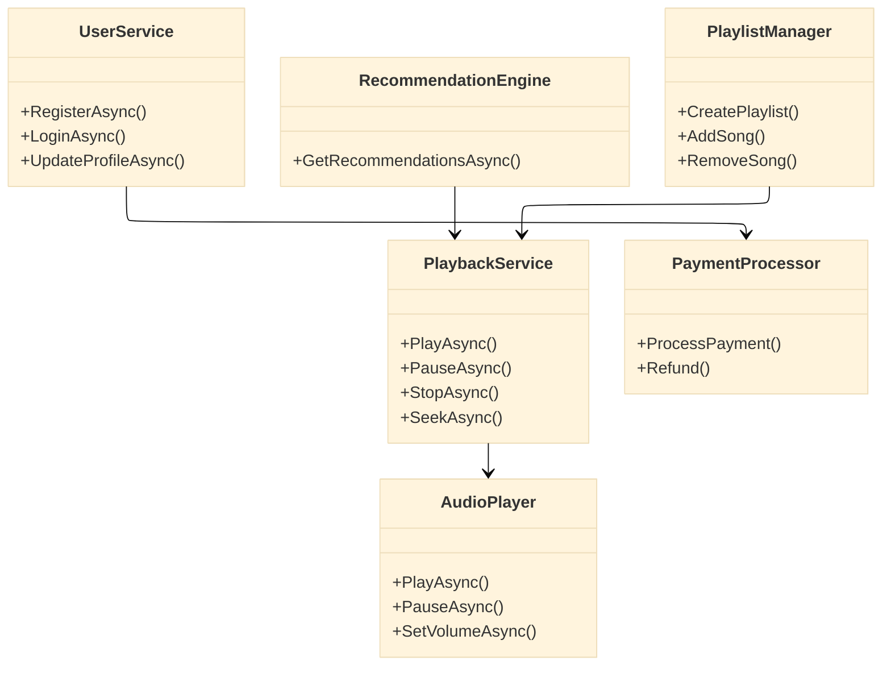

# Throughout this series, you'll meet the same Spoti

```mermaid
---
config:
  layout: elk
  theme: base
---
classDiagram
    class PlaybackService {
        +PlayAsync()
        +PauseAsync()
        +StopAsync()
        +SeekAsync()
    }
    
    class UserService {
        +RegisterAsync()
        +LoginAsync()
        +UpdateProfileAsync()
    }
    
    class RecommendationEngine {
        +GetRecommendationsAsync()
    }
    
    class PlaylistManager {
        +CreatePlaylist()
        +AddSong()
        +RemoveSong()
    }
    
    class AudioPlayer {
        +PlayAsync()
        +PauseAsync()
        +SetVolumeAsync()
    }
    
    class PaymentProcessor {
        +ProcessPayment()
        +Refund()
    }
    
    PlaybackService --> AudioPlayer
    RecommendationEngine --> PlaybackService
    PlaylistManager --> PlaybackService
    UserService --> PaymentProcessor
```
