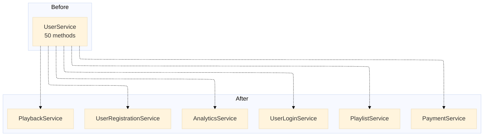

# We decomposed the monolith into focused services, 

```mermaid
---
config:
  layout: elk
  theme: base
---
graph TD
    subgraph "Before"
        A[UserService<br/>50 methods]
    end
    
    subgraph "After"
        B[UserRegistrationService]
        C[UserLoginService]
        D[PlaybackService]
        E[PlaylistService]
        F[PaymentService]
        G[AnalyticsService]
    end
    
    A -.-> B
    A -.-> C
    A -.-> D
    A -.-> E
    A -.-> F
    A -.-> G
```
