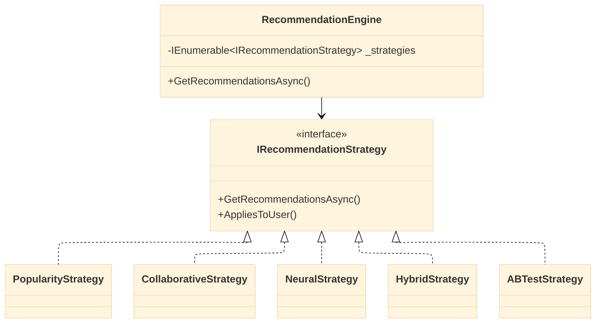

# We applied the Strategy Pattern, making the engine

```mermaid
---
config:
  layout: elk
  theme: base
---
classDiagram
    class IRecommendationStrategy {
        <<interface>>
        +GetRecommendationsAsync()
        +AppliesToUser()
    }
    
    class PopularityStrategy
    class CollaborativeStrategy
    class NeuralStrategy
    class HybridStrategy
    class ABTestStrategy
    
    class RecommendationEngine {
        -IEnumerable~IRecommendationStrategy~ _strategies
        +GetRecommendationsAsync()
    }
    
    IRecommendationStrategy <|.. PopularityStrategy
    IRecommendationStrategy <|.. CollaborativeStrategy
    IRecommendationStrategy <|.. NeuralStrategy
    IRecommendationStrategy <|.. HybridStrategy
    IRecommendationStrategy <|.. ABTestStrategy
    RecommendationEngine --> IRecommendationStrategy
```
