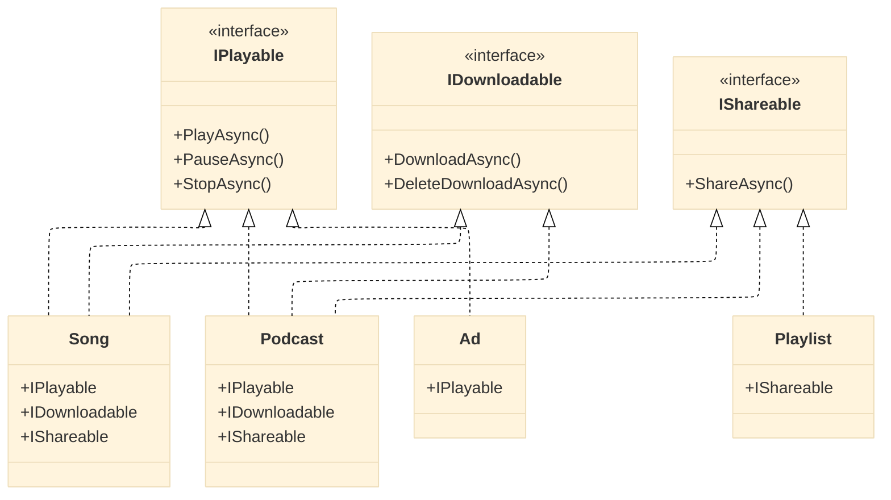

# We redesigned the hierarchy with proper contracts 

```mermaid
---
config:
  layout: elk
  theme: base
---
classDiagram
    class IPlayable {
        <<interface>>
        +PlayAsync()
        +PauseAsync()
        +StopAsync()
    }
    
    class IDownloadable {
        <<interface>>
        +DownloadAsync()
        +DeleteDownloadAsync()
    }
    
    class IShareable {
        <<interface>>
        +ShareAsync()
    }
    
    class Song {
        +IPlayable
        +IDownloadable
        +IShareable
    }
    
    class Podcast {
        +IPlayable
        +IDownloadable
        +IShareable
    }
    
    class Ad {
        +IPlayable
    }
    
    class Playlist {
        +IShareable
    }
    
    IPlayable <|.. Song
    IPlayable <|.. Podcast
    IPlayable <|.. Ad
    IDownloadable <|.. Song
    IDownloadable <|.. Podcast
    IShareable <|.. Song
    IShareable <|.. Podcast
    IShareable <|.. Playlist
```
