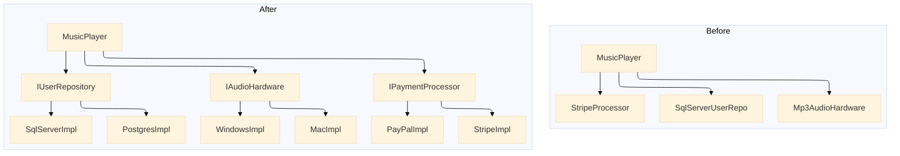

# We inverted dependencies, making high-level module

```mermaid
---
config:
  layout: elk
  theme: base
---
graph TD
    subgraph "Before"
        A[MusicPlayer] --> B[SqlServerUserRepo]
        A --> C[Mp3AudioHardware]
        A --> D[StripeProcessor]
    end
    
    subgraph "After"
        E[MusicPlayer] --> F[IUserRepository]
        E --> G[IAudioHardware]
        E --> H[IPaymentProcessor]
        
        F --> I[SqlServerImpl]
        F --> J[PostgresImpl]
        
        G --> K[WindowsImpl]
        G --> L[MacImpl]
        
        H --> M[StripeImpl]
        H --> N[PayPalImpl]
    end
```
