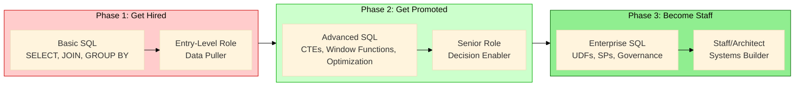

# SQL Mechanic to Data Architect: Advanced Queries, SPs & Scalable Systems - The Complete Journey
## Master concepts that separate data pullers from decision drivers—your complete roadmap from entry-level to Staff Engineer.

## Introduction: The Two Promotions

I still remember the day I got my first SQL-related promotion. I had spent six months writing queries that ran without errors, delivered exactly what stakeholders asked for, and never broke in production—or so I thought.

My manager sat me down and said something that changed my career trajectory: *"You're reliable. You deliver what people ask for. But you're not yet someone people come to when they don't know what to ask. That's the next level."*

At the time, I didn't fully understand what she meant. I knew SQL. I could join tables, aggregate data, and even write a window function or two. But I was a **SQL Mechanic**—I fixed problems when they arose, answered questions literally, and worked in isolation.

The journey from that conversation to becoming a Staff Engineer took years, but it was built on mastering two distinct levels of SQL expertise:

---

## Part 1: From Mechanic to Advanced Practitioner — What Gets You Promoted

The first level is about transforming how you write queries. It's the shift from:

- **Reactive** to **Proactive** thinking
- **Linear queries** to **modular CTEs**
- **Hardcoded values** to **config-driven logic**
- **Raw data output** to **business insights**
- **Personal scripts** to **team assets**

This is what separates Senior Analysts and Engineers from their mid-level counterparts. When you master these 11 concepts, you stop being seen as someone who "pulls data" and start being seen as someone who "drives decisions."

**[SQL Mechanic to Architect: CTEs, Window Functions, Query Optimization, and Scalable Patterns- Part 1](link-to-part-1)** (Comming soon)  to capture exactly this transformation. It's the foundation that every data professional needs to build before they can think about systems.

---

## Part 2: From Advanced Practitioner to Architect — What Gets You to Staff

But there's a second level—one that separates Senior Engineers from Staff Engineers, Technical Leads, and Data Architects.

At this level, you stop thinking about queries and start thinking about **systems**. You move from:

- **Duplicated CASE statements** to **encapsulated User-Defined Functions**
- **Fragmented scripts** to **automated Stored Procedures**
- **Static, rigid queries** to **flexible Dynamic SQL**
- **Fragile, failing pipelines** to **robust error handling**
- **Guesswork optimization** to **EXPLAIN-driven performance tuning**
- **Inconsistent definitions** to **comprehensive data governance**

This is the level where you become a **force multiplier**. Instead of solving one problem at a time, you build components that enable everyone around you to solve problems faster. Instead of writing code that works today, you build systems that scale for years.

**[SQL Mechanic to Architect: Database UDFs, Stored Procedures, & Production-Grade Patterns — Part 2](link-to-part-2)** (Comming Soon) explores exactly this transformation. It's the bridge from being a skilled practitioner to being a systems architect.

---

## The Complete Picture

Together, these two guides form a complete roadmap from SQL beginner to Data Architect:

---

## What You'll Find in Each Part

### [Part 1: Core Query Foundations](link-to-part-1) — 11 Concepts, 20 Minutes

| Concept | Basic SQL | Advanced SQL |
|---------|-----------|--------------|
| Mindset | Reactive, answers literally | Proactive, anticipates needs |
| Structure | Long linear queries | Modular CTEs, debuggable layers |
| Logic | Hardcoded values buried | Config-driven, single source of truth |
| Scale | Works on small data | Handles millions with EXPLAIN |
| Output | Raw numbers | Insights and recommendations |
| Collaboration | Personal cryptic code | Documented team assets |
| Requirements | Answers as stated | Pushes back, validates |
| Reusability | One-off queries | Views and templates |
| Resilience | Breaks on NULLs | Anticipates edge cases |
| Trust | Built slowly | Becomes go-to person |
| Impact | Individual output | Enables entire team |

### [Part 2: Advanced Database Programming](link-to-part-2) — 6 Concepts, 25 Minutes

| Concept | Basic Approach | Advanced Approach |
|---------|----------------|------------------|
| Logic Reuse | Duplicated CASE statements | Encapsulated User-Defined Functions |
| Automation | Fragmented manual scripts | Atomic Stored Procedures with transactions |
| Flexibility | Static queries per scenario | Dynamic SQL with parameters |
| Resilience | No error handling | Comprehensive error logging and recovery |
| Performance | Guesswork indexing | EXPLAIN-driven optimization, partitioning |
| Governance | Inconsistent definitions | Row-level security, audit logs, data lineage |

---

## A Note on the Code Examples

Throughout both guides, you'll find extensive SQL code examples. These are designed to be:

- **Realistic** - Based on actual production patterns
- **Debuggable** - With comments showing how to test each component
- **Portable** - Using standard SQL with notes for PostgreSQL, Snowflake, and BigQuery variations

Each concept includes:
- **What it is** - Clear definition
- **Why it matters** - Business impact
- **Basic implementation** - What gets you hired
- **Advanced implementation** - What gets you promoted
- **Debugging benefits** - How the advanced approach saves time

---

## The Path Forward

Whether you're just starting your SQL journey or you've been writing queries for years, these guides are designed to meet you where you are.

If you're comfortable with `SELECT`, `JOIN`, and `GROUP BY` but find yourself rewriting the same logic over and over, start with **Part 1**.

If you've mastered CTEs and window functions but want to build automated pipelines, encapsulated logic, and governed data platforms, dive into **Part 2**.

The journey from SQL Mechanic to Data Architect isn't about learning every function—it's about changing how you think about your role. You're not just answering questions. You're building the systems that answer questions reliably, at scale, for the entire organization.

**Now let's begin.**

---

## Continue Reading

- **[SQL Mechanic to Architect: CTEs, Window Functions, Query Optimization, and Scalable Patterns- Part 1](link-to-part-1)**
- **[SQL Mechanic to Architect: Database UDFs, Stored Procedures, & Production-Grade Patterns — Part 2](link-to-part-2)**