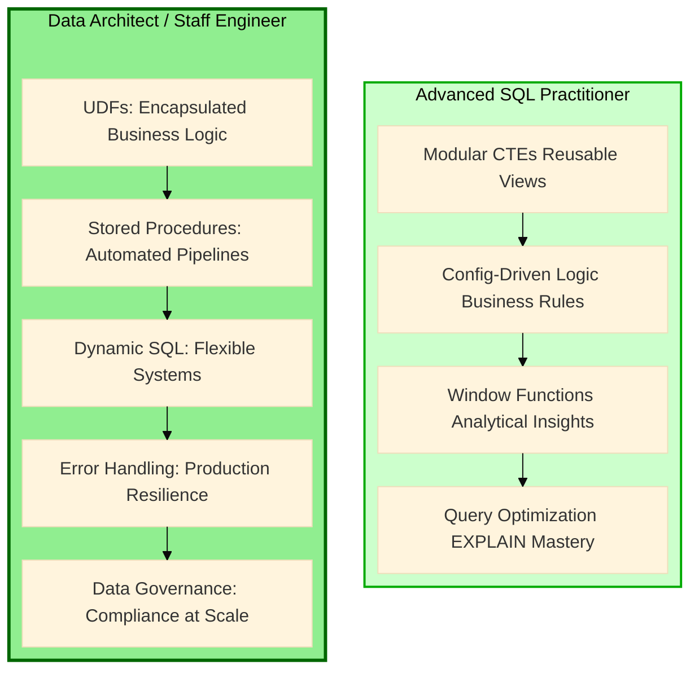
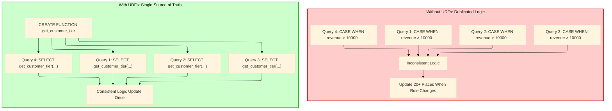
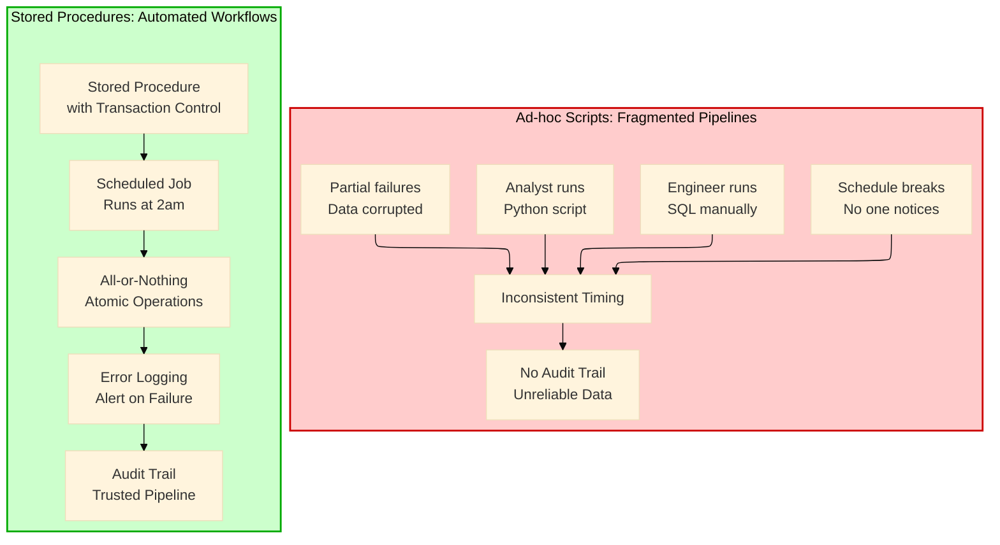
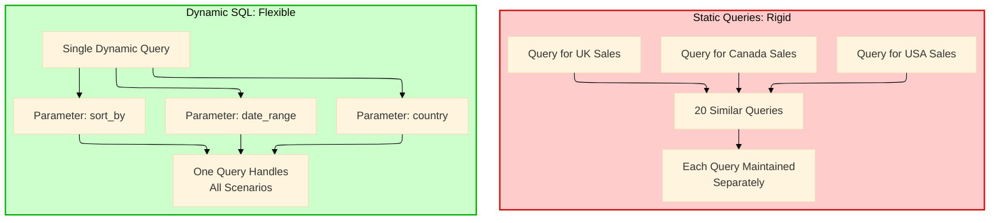
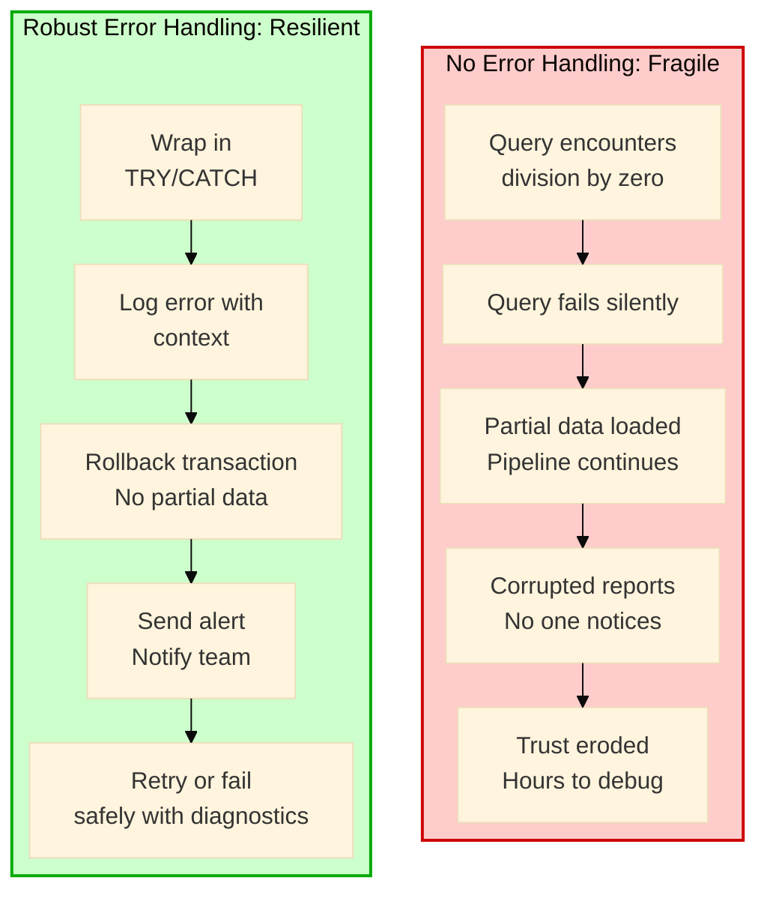
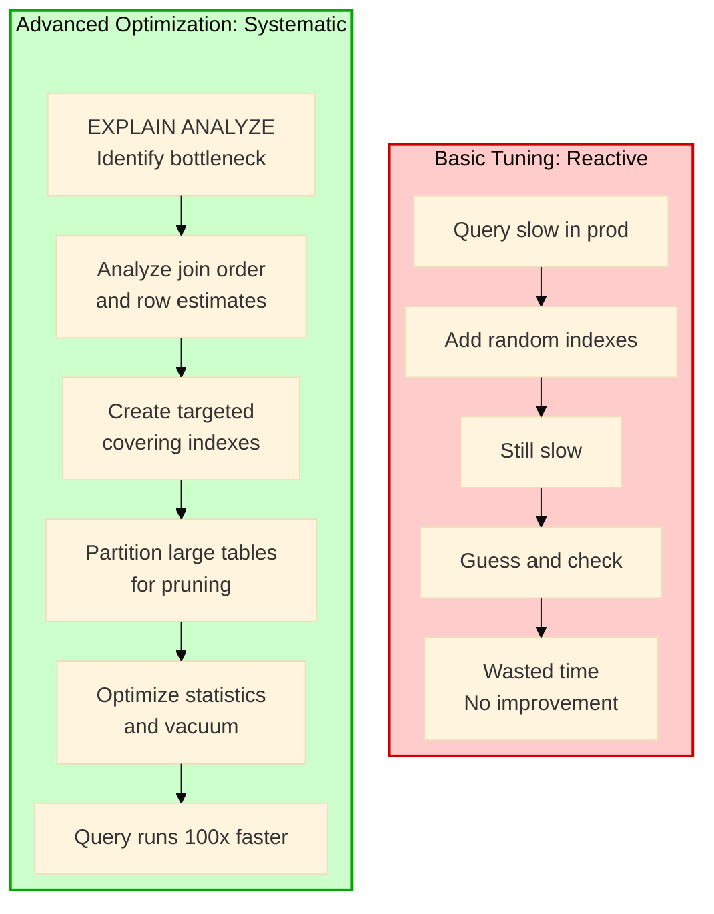

# SQL Mechanic to Architect: Database UDFs, Stored Procedures, & Production-Grade Patterns — Part 2
## Encapsulate logic, automate pipelines, enforce governance, and build the production-grade systems that earn you Staff Engineer.


In [Part 1](link-to-part-1), we explored the 11 foundational concepts that separate Basic SQL from Advanced SQL—from reactive vs proactive mindsets to CTEs, window functions, and building reusable views. We learned how to write queries that are modular, debuggable, scalable, and trusted.

Now it's time to level up. The concepts we covered in Part 1 make you an excellent Advanced SQL practitioner. But to become a **Staff Engineer**, **Data Architect**, or **Technical Lead**, you need to move beyond queries and start building **systems**. This means mastering:

- **User-Defined Functions (UDFs)** - Encapsulating complex business logic into reusable components
- **Stored Procedures (SPs)** - Building automated workflows and data pipelines
- **Dynamic SQL** - Creating flexible, parameterized systems that adapt to changing requirements
- **Error Handling** - Building robust, production-ready code that fails gracefully
- **Advanced Performance Tuning** - Optimizing at the database level with execution plan mastery
- **Data Governance** - Ensuring consistency, compliance, and security at scale

Let's explore each of these advanced concepts with the same rigor we applied in Part 1—comparing basic approaches with advanced implementations, understanding the debugging benefits, and seeing how they transform your career trajectory.

---

## The Journey from Advanced SQL Practitioner to Data Architect

Before diving into the concepts, let's visualize the next transformation:



This transformation is what separates Senior Analysts and Engineers from Staff-level technical leaders. Let's explore each concept.

---

## Concept 12: Basic Queries vs User-Defined Functions (UDFs)

### What It Is
User-Defined Functions encapsulate reusable logic that can be called repeatedly across queries, reports, and applications.

### Why It Matters
Without UDFs, the same business logic—like revenue calculation, tax computation, or customer tier assignment—gets rewritten in dozens of places. When rules change, you must find and update every instance. UDFs create a **single source of truth** for business logic that the entire organization can rely on.



### Basic SQL: Duplicated logic across queries

```sql
-- ============================================================================
-- PROBLEM: Customer tier logic duplicated in every query
-- IMPACT: When tier thresholds change, update 50+ queries
-- DEBUGGING: Each query might have slightly different logic
-- ============================================================================

-- Marketing query
SELECT 
    customer_id,
    CASE 
        WHEN lifetime_value >= 10000 THEN 'Platinum'
        WHEN lifetime_value >= 5000 THEN 'Gold'
        WHEN lifetime_value >= 1000 THEN 'Silver'
        ELSE 'Standard'
    END as customer_tier
FROM customer_metrics;

-- Sales query (same logic, different column name)
SELECT 
    customer_id,
    CASE 
        WHEN total_spent >= 10000 THEN 'Platinum'
        WHEN total_spent >= 5000 THEN 'Gold'
        WHEN total_spent >= 1000 THEN 'Silver'
        ELSE 'Standard'
    END as tier
FROM sales_summary;

-- Finance query (slightly different thresholds!)
SELECT 
    customer_id,
    CASE 
        WHEN revenue >= 15000 THEN 'Platinum'  -- Different threshold!
        WHEN revenue >= 7500 THEN 'Gold'       -- Different threshold!
        WHEN revenue >= 2000 THEN 'Silver'     -- Different threshold!
        ELSE 'Standard'
    END as customer_category
FROM financial_metrics;

-- Problem: Three different definitions of "Platinum" customer
-- No consistency across the organization
```

**Debugging Challenges:**
- When a stakeholder asks "how many Platinum customers do we have?"—which query is correct?
- Business rules are buried in CASE statements across dozens of queries
- No single place to verify current thresholds
- Changes require hunting through the entire codebase

### Advanced SQL: Encapsulated logic with User-Defined Functions

```sql
-- ============================================================================
-- SOLUTION: Create UDF that encapsulates business logic once
-- BENEFIT: Single source of truth, update once, use everywhere
-- DEBUGGING: Test the function once, trust it everywhere
-- ============================================================================

-- ============================================================================
-- FUNCTION: get_customer_tier
-- PURPOSE: Standardized customer tier classification
-- PARAMETERS: lifetime_value DECIMAL - Customer's total spend
-- RETURNS: VARCHAR - Customer tier (Platinum, Gold, Silver, Standard)
-- USAGE: SELECT customer_id, get_customer_tier(lifetime_value) FROM customers
-- ============================================================================
CREATE OR REPLACE FUNCTION get_customer_tier(lifetime_value DECIMAL)
RETURNS VARCHAR
LANGUAGE plpgsql
IMMUTABLE  -- Same input always returns same output (can be cached)
AS $$
BEGIN
    RETURN CASE
        WHEN lifetime_value >= 10000 THEN 'Platinum'
        WHEN lifetime_value >= 5000 THEN 'Gold'
        WHEN lifetime_value >= 1000 THEN 'Silver'
        WHEN lifetime_value > 0 THEN 'Bronze'
        ELSE 'Prospect'
    END;
END;
$$;

-- ============================================================================
-- FUNCTION: get_churn_risk
-- PURPOSE: Calculate churn risk based on days since last activity
-- PARAMETERS: last_activity_date DATE, days_threshold INTEGER
-- RETURNS: VARCHAR - Churn risk level
-- ============================================================================
CREATE OR REPLACE FUNCTION get_churn_risk(last_activity_date DATE, days_threshold INTEGER DEFAULT 90)
RETURNS VARCHAR
LANGUAGE plpgsql
IMMUTABLE
AS $$
DECLARE
    days_inactive INTEGER;
BEGIN
    IF last_activity_date IS NULL THEN
        RETURN 'Never Active';
    END IF;
    
    days_inactive := CURRENT_DATE - last_activity_date;
    
    RETURN CASE
        WHEN days_inactive <= 30 THEN 'Active'
        WHEN days_inactive <= days_threshold THEN 'At Risk'
        ELSE 'Churned'
    END;
END;
$$;

-- ============================================================================
-- FUNCTION: calculate_net_revenue
-- PURPOSE: Standardized revenue calculation across all reports
-- PARAMETERS: gross_amount DECIMAL, refund_amount DECIMAL, discount_amount DECIMAL
-- RETURNS: DECIMAL - Net revenue after refunds and discounts
-- ============================================================================
CREATE OR REPLACE FUNCTION calculate_net_revenue(
    gross_amount DECIMAL,
    refund_amount DECIMAL DEFAULT 0,
    discount_amount DECIMAL DEFAULT 0
)
RETURNS DECIMAL
LANGUAGE plpgsql
IMMUTABLE
AS $$
BEGIN
    RETURN COALESCE(gross_amount, 0) 
         - COALESCE(refund_amount, 0) 
         - COALESCE(discount_amount, 0);
END;
$$;

-- ============================================================================
-- Now all queries use the same logic
-- ============================================================================

-- Marketing query (clean and consistent)
SELECT 
    customer_id,
    customer_name,
    get_customer_tier(lifetime_value) as customer_tier,
    get_churn_risk(last_order_date) as churn_status
FROM customer_metrics;

-- Sales query (same logic, different source table)
SELECT 
    customer_id,
    get_customer_tier(total_spent) as tier,
    get_churn_risk(last_purchase_date, 60) as risk  -- Custom threshold
FROM sales_summary;

-- Finance query (consistent thresholds!)
SELECT 
    customer_id,
    get_customer_tier(revenue) as customer_category,
    calculate_net_revenue(gross_revenue, refunds, discounts) as net_revenue
FROM financial_metrics;

-- Reporting view that uses functions
CREATE VIEW v_monthly_executive_summary AS
SELECT 
    DATE_TRUNC('month', order_date) as month,
    get_customer_tier(SUM(total_amount)) as tier,
    COUNT(DISTINCT customer_id) as customers,
    SUM(calculate_net_revenue(total_amount, refund_amount, 0)) as net_revenue
FROM orders o
LEFT JOIN refunds r ON o.order_id = r.order_id
GROUP BY DATE_TRUNC('month', order_date), get_customer_tier(SUM(total_amount));
```

**Debugging Benefits:**
- Run `SELECT get_customer_tier(7500)` to test function behavior instantly
- All business logic is in one place—update thresholds once, all reports update
- Function signatures document expected parameters and return types
- IMMUTABLE functions can be cached, improving performance
- You can write unit tests for functions independently of queries

---

## Concept 13: Ad-hoc Scripts vs Stored Procedures (SPs)

### What It Is
Stored Procedures are pre-compiled SQL programs that encapsulate complex workflows, transactions, and business logic that can be executed on demand or scheduled.

### Why It Matters
Without stored procedures, data pipelines are built as fragmented scripts run by different people at different times. Stored procedures provide **atomic, repeatable, and auditable** workflows that ensure data consistency and enable automation.



### Basic SQL: Fragmented ad-hoc scripts

```sql
-- ============================================================================
-- PROBLEM: Manual, fragmented ETL process
-- IMPACT: Inconsistent data, no error handling, no audit trail
-- DEBUGGING: When data is wrong, you don't know which step failed
-- ============================================================================

-- Step 1: Analyst manually runs this at 9am
DROP TABLE IF EXISTS temp_daily_sales;
CREATE TABLE temp_daily_sales AS
SELECT 
    DATE_TRUNC('day', order_date) as sale_date,
    SUM(total_amount) as daily_revenue
FROM orders
WHERE order_date = CURRENT_DATE - 1
GROUP BY DATE_TRUNC('day', order_date);

-- Step 2: Engineer manually runs this at 10am
DROP TABLE IF EXISTS temp_customer_metrics;
CREATE TABLE temp_customer_metrics AS
SELECT 
    customer_id,
    COUNT(order_id) as order_count,
    SUM(total_amount) as lifetime_value
FROM orders
WHERE order_date >= DATE_TRUNC('month', CURRENT_DATE - INTERVAL '30 days')
GROUP BY customer_id;

-- Step 3: Analyst runs this at 2pm (if they remember)
INSERT INTO daily_summary 
SELECT * FROM temp_daily_sales;

-- Problems:
-- 1. No transaction control - partial failures corrupt data
-- 2. No scheduling - depends on people remembering to run scripts
-- 3. No error handling - if a step fails, pipeline continues
-- 4. No audit trail - can't trace when data was processed
```

**Debugging Challenges:**
- When data is wrong, you can't tell which step failed or when
- No atomicity—if Step 2 fails, Step 1 data might still be loaded
- No logging—you don't know who ran what and when
- Manual processes mean human error is inevitable

### Advanced SQL: Automated Stored Procedures with Error Handling

```sql
-- ============================================================================
-- SOLUTION: Stored Procedure with transaction control and error handling
-- BENEFIT: Atomic, repeatable, auditable data pipeline
-- DEBUGGING: Comprehensive logging, rollback on failure
-- ============================================================================

-- ============================================================================
-- PROCEDURE: sp_process_daily_etl
-- PURPOSE: Automated daily ETL pipeline for sales data
-- SCHEDULE: Runs daily at 2am via cron/job scheduler
-- PARAMETERS: p_process_date DATE - Date to process (defaults to yesterday)
-- ============================================================================
CREATE OR REPLACE PROCEDURE sp_process_daily_etl(p_process_date DATE DEFAULT CURRENT_DATE - 1)
LANGUAGE plpgsql
AS $$
DECLARE
    v_start_time TIMESTAMP;
    v_end_time TIMESTAMP;
    v_record_count INTEGER;
    v_error_message TEXT;
BEGIN
    -- Start logging
    v_start_time := CLOCK_TIMESTAMP();
    
    -- Log process start
    INSERT INTO etl_audit_log (process_name, process_date, status, start_time)
    VALUES ('daily_etl', p_process_date, 'RUNNING', v_start_time);
    
    -- Begin transaction - all or nothing
    BEGIN
        
        -- Step 1: Create staging table for daily sales
        RAISE NOTICE 'Step 1: Creating daily sales staging';
        
        DROP TABLE IF EXISTS temp_daily_sales_&p_process_date;
        
        CREATE TEMP TABLE temp_daily_sales_&p_process_date AS
        SELECT 
            p_process_date as sale_date,
            COALESCE(SUM(total_amount), 0) as daily_revenue,
            COUNT(DISTINCT order_id) as order_count,
            COUNT(DISTINCT customer_id) as unique_customers
        FROM orders
        WHERE DATE(order_date) = p_process_date
          AND status IN ('completed', 'shipped');
        
        GET DIAGNOSTICS v_record_count = ROW_COUNT;
        RAISE NOTICE 'Step 1 complete: % records inserted', v_record_count;
        
        -- Step 2: Update daily summary with validation
        RAISE NOTICE 'Step 2: Updating daily summary';
        
        INSERT INTO daily_sales_summary (sale_date, daily_revenue, order_count, unique_customers)
        SELECT * FROM temp_daily_sales_&p_process_date
        ON CONFLICT (sale_date) DO UPDATE SET
            daily_revenue = EXCLUDED.daily_revenue,
            order_count = EXCLUDED.order_count,
            unique_customers = EXCLUDED.unique_customers,
            updated_at = CURRENT_TIMESTAMP;
        
        -- Step 3: Update rolling metrics (7-day, 30-day averages)
        RAISE NOTICE 'Step 3: Updating rolling metrics';
        
        WITH rolling_metrics AS (
            SELECT 
                sale_date,
                AVG(daily_revenue) OVER (ORDER BY sale_date ROWS BETWEEN 6 PRECEDING AND CURRENT ROW) as revenue_ma7,
                AVG(daily_revenue) OVER (ORDER BY sale_date ROWS BETWEEN 29 PRECEDING AND CURRENT ROW) as revenue_ma30
            FROM daily_sales_summary
            WHERE sale_date >= p_process_date - 30
        )
        UPDATE daily_sales_summary dss
        SET 
            revenue_ma7 = rm.revenue_ma7,
            revenue_ma30 = rm.revenue_ma30,
            updated_at = CURRENT_TIMESTAMP
        FROM rolling_metrics rm
        WHERE dss.sale_date = rm.sale_date
          AND dss.sale_date = p_process_date;
        
        -- Step 4: Data validation - check for anomalies
        RAISE NOTICE 'Step 4: Running data validation';
        
        INSERT INTO data_quality_alerts (alert_date, alert_type, alert_message, severity)
        SELECT 
            p_process_date,
            'Revenue Anomaly',
            CONCAT('Daily revenue $', daily_revenue, ' is ', 
                   ROUND(100.0 * (daily_revenue - revenue_ma7) / NULLIF(revenue_ma7, 0), 1), 
                   '% below 7-day average'),
            'WARNING'
        FROM daily_sales_summary
        WHERE sale_date = p_process_date
          AND daily_revenue < revenue_ma7 * 0.7;
        
        -- Step 5: Clean up staging tables
        DROP TABLE IF EXISTS temp_daily_sales_&p_process_date;
        
        -- Commit transaction
        COMMIT;
        
        -- Log success
        v_end_time := CLOCK_TIMESTAMP();
        UPDATE etl_audit_log 
        SET status = 'SUCCESS', 
            end_time = v_end_time,
            records_processed = v_record_count,
            duration_seconds = EXTRACT(EPOCH FROM (v_end_time - v_start_time))
        WHERE process_name = 'daily_etl' 
          AND process_date = p_process_date 
          AND status = 'RUNNING';
        
        RAISE NOTICE 'ETL completed successfully in % seconds', 
                     EXTRACT(EPOCH FROM (v_end_time - v_start_time));
        
    EXCEPTION
        WHEN OTHERS THEN
            -- Rollback on any error
            ROLLBACK;
            
            -- Capture error details
            GET STACKED DIAGNOSTICS v_error_message = MESSAGE_TEXT;
            
            -- Log failure
            v_end_time := CLOCK_TIMESTAMP();
            UPDATE etl_audit_log 
            SET status = 'FAILED', 
                end_time = v_end_time,
                error_message = v_error_message,
                duration_seconds = EXTRACT(EPOCH FROM (v_end_time - v_start_time))
            WHERE process_name = 'daily_etl' 
              AND process_date = p_process_date 
              AND status = 'RUNNING';
            
            -- Re-raise error for scheduler
            RAISE EXCEPTION 'ETL failed: %', v_error_message;
    END;
END;
$$;

-- ============================================================================
-- PROCEDURE: sp_backfill_data
-- PURPOSE: Backfill historical data when needed
-- PARAMETERS: p_start_date DATE, p_end_date DATE
-- ============================================================================
CREATE OR REPLACE PROCEDURE sp_backfill_data(p_start_date DATE, p_end_date DATE)
LANGUAGE plpgsql
AS $$
DECLARE
    v_current_date DATE;
BEGIN
    v_current_date := p_start_date;
    
    WHILE v_current_date <= p_end_date LOOP
        RAISE NOTICE 'Processing %', v_current_date;
        CALL sp_process_daily_etl(v_current_date);
        v_current_date := v_current_date + 1;
    END LOOP;
    
    RAISE NOTICE 'Backfill complete for % to %', p_start_date, p_end_date;
END;
$$;

-- ============================================================================
-- Now the pipeline is automated and auditable
-- ============================================================================

-- Schedule this to run daily at 2am via cron or job scheduler
-- CALL sp_process_daily_etl();

-- Query audit log to verify execution
SELECT * FROM etl_audit_log 
WHERE process_name = 'daily_etl' 
ORDER BY start_time DESC 
LIMIT 10;

-- Check for data quality alerts
SELECT * FROM data_quality_alerts 
WHERE alert_date >= CURRENT_DATE - 7
ORDER BY alert_date DESC;
```

**Debugging Benefits:**
- The audit log shows exactly when each process ran, how long it took, and whether it succeeded
- Transaction control ensures atomicity—no partial data loads
- RAISE NOTICE statements provide real-time progress updates
- Error handling captures and logs failures with detailed messages
- Data quality alerts proactively flag anomalies
- You can backfill specific date ranges with the backfill procedure

---

## Concept 14: Static Queries vs Dynamic SQL

### What It Is
Dynamic SQL allows you to construct and execute SQL statements dynamically at runtime based on parameters, conditions, or user input.

### Why It Matters
Static queries are rigid—they work for specific scenarios but fail when requirements vary. Dynamic SQL enables **flexible, reusable systems** that adapt to different tables, columns, filters, and sorting criteria without rewriting code.



### Basic SQL: Static queries for every scenario

```sql
-- ============================================================================
-- PROBLEM: Hardcoded queries for every variation
-- IMPACT: 50+ similar queries, each maintained separately
-- DEBUGGING: Changes require updating multiple files
-- ============================================================================

-- Query for USA sales
SELECT 
    DATE_TRUNC('month', order_date) as month,
    SUM(total_amount) as revenue
FROM orders
WHERE country = 'USA'
  AND order_date >= '2024-01-01'
GROUP BY DATE_TRUNC('month', order_date)
ORDER BY month;

-- Query for Canada sales (almost identical)
SELECT 
    DATE_TRUNC('month', order_date) as month,
    SUM(total_amount) as revenue
FROM orders
WHERE country = 'Canada'
  AND order_date >= '2024-01-01'
GROUP BY DATE_TRUNC('month', order_date)
ORDER BY month;

-- Query for UK sales (repeated again)
SELECT 
    DATE_TRUNC('month', order_date) as month,
    SUM(total_amount) as revenue
FROM orders
WHERE country = 'UK'
  AND order_date >= '2024-01-01'
GROUP BY DATE_TRUNC('month', order_date)
ORDER BY month;

-- Problem: 50 countries = 50 queries to maintain
-- Adding a new filter requires updating all queries
-- Sorting by different columns requires new queries
```

**Debugging Challenges:**
- Changes to business logic require updating dozens of queries
- Inconsistent filters across queries lead to different results
- No way to dynamically adjust to user requirements
- Code duplication makes the system brittle

### Advanced SQL: Flexible Dynamic SQL

```sql
-- ============================================================================
-- SOLUTION: Dynamic SQL for flexible, reusable queries
-- BENEFIT: One function handles all variations
-- DEBUGGING: Single place to fix logic, SQL injection protection
-- ============================================================================

-- ============================================================================
-- FUNCTION: fn_get_sales_report
-- PURPOSE: Dynamic sales report with flexible parameters
-- PARAMETERS: 
--   p_countries TEXT[] - List of countries (NULL = all)
--   p_start_date DATE - Start date (NULL = all time)
--   p_end_date DATE - End date (NULL = today)
--   p_group_by VARCHAR - Group by: 'day', 'week', 'month', 'quarter', 'year'
--   p_sort_by VARCHAR - Sort by: 'date', 'revenue', 'orders'
--   p_sort_dir VARCHAR - Sort direction: 'ASC', 'DESC'
--   p_limit INTEGER - Row limit (NULL = no limit)
-- RETURNS: TABLE with dynamic results
-- ============================================================================
CREATE OR REPLACE FUNCTION fn_get_sales_report(
    p_countries TEXT[] DEFAULT NULL,
    p_start_date DATE DEFAULT NULL,
    p_end_date DATE DEFAULT NULL,
    p_group_by VARCHAR DEFAULT 'month',
    p_sort_by VARCHAR DEFAULT 'date',
    p_sort_dir VARCHAR DEFAULT 'DESC',
    p_limit INTEGER DEFAULT NULL
)
RETURNS TABLE(
    period DATE,
    revenue DECIMAL,
    order_count BIGINT,
    customer_count BIGINT,
    avg_order_value DECIMAL,
    countries_covered TEXT
)
LANGUAGE plpgsql
AS $$
DECLARE
    v_sql TEXT;
    v_date_trunc TEXT;
BEGIN
    -- Map group_by to date trunc function
    v_date_trunc := CASE p_group_by
        WHEN 'day' THEN 'day'
        WHEN 'week' THEN 'week'
        WHEN 'month' THEN 'month'
        WHEN 'quarter' THEN 'quarter'
        WHEN 'year' THEN 'year'
        ELSE 'month'
    END;
    
    -- Build dynamic SQL
    v_sql := FORMAT('
        WITH filtered_orders AS (
            SELECT 
                DATE_TRUNC(%L, order_date) as period,
                total_amount,
                order_id,
                customer_id,
                country
            FROM orders
            WHERE 1=1
                %s  -- Country filter
                %s  -- Date range filter
                AND status IN (''completed'', ''shipped'')
        ),
        aggregated AS (
            SELECT 
                period,
                SUM(total_amount) as revenue,
                COUNT(DISTINCT order_id) as order_count,
                COUNT(DISTINCT customer_id) as customer_count,
                AVG(total_amount) as avg_order_value,
                STRING_AGG(DISTINCT country, '', '' ORDER BY country) as countries_covered
            FROM filtered_orders
            GROUP BY period
        )
        SELECT 
            period,
            revenue,
            order_count,
            customer_count,
            avg_order_value,
            countries_covered
        FROM aggregated
        ORDER BY %I %s
        %s',
        v_date_trunc,
        CASE WHEN p_countries IS NOT NULL 
             THEN FORMAT(' AND country = ANY(%L::TEXT[])', p_countries)
             ELSE '' END,
        CASE WHEN p_start_date IS NOT NULL AND p_end_date IS NOT NULL
             THEN FORMAT(' AND order_date BETWEEN %L AND %L', p_start_date, p_end_date)
             WHEN p_start_date IS NOT NULL
             THEN FORMAT(' AND order_date >= %L', p_start_date)
             WHEN p_end_date IS NOT NULL
             THEN FORMAT(' AND order_date <= %L', p_end_date)
             ELSE '' END,
        p_sort_by,
        p_sort_dir,
        CASE WHEN p_limit IS NOT NULL 
             THEN FORMAT(' LIMIT %s', p_limit)
             ELSE '' END
    );
    
    -- Debug: Log the generated SQL (useful for troubleshooting)
    RAISE DEBUG 'Generated SQL: %', v_sql;
    
    -- Execute dynamic query and return results
    RETURN QUERY EXECUTE v_sql;
END;
$$;

-- ============================================================================
-- FUNCTION: fn_get_dynamic_pivot
-- PURPOSE: Generate pivot tables dynamically
-- ============================================================================
CREATE OR REPLACE FUNCTION fn_get_dynamic_pivot(
    p_row_column VARCHAR,
    p_pivot_column VARCHAR,
    p_value_column VARCHAR,
    p_table_name VARCHAR,
    p_where_clause TEXT DEFAULT NULL
)
RETURNS TEXT
LANGUAGE plpgsql
AS $$
DECLARE
    v_sql TEXT;
    v_columns TEXT;
    v_result TEXT;
BEGIN
    -- Get distinct values for pivot columns
    v_sql := FORMAT('
        SELECT STRING_AGG(DISTINCT FORMAT(''%%s AS "%s"'', %I), '', '')
        FROM %I
        %s
    ', p_pivot_column, p_pivot_column, p_table_name, 
       COALESCE('WHERE ' || p_where_clause, ''));
    
    EXECUTE v_sql INTO v_columns;
    
    -- Build pivot query
    v_sql := FORMAT('
        SELECT *
        FROM crosstab(
            ''SELECT %I, %I, %I 
              FROM %I 
              %s
              ORDER BY 1,2'',
            ''SELECT DISTINCT %I FROM %I %s ORDER BY 1''
        ) AS ct(%I TEXT, %s)
    ',
        p_row_column, p_pivot_column, p_value_column,
        p_table_name,
        COALESCE('WHERE ' || p_where_clause, ''),
        p_pivot_column, p_table_name,
        COALESCE('WHERE ' || p_where_clause, ''),
        p_row_column, v_columns
    );
    
    RETURN v_sql;
END;
$$;

-- ============================================================================
-- FUNCTION: fn_search_orders
-- PURPOSE: Flexible search across multiple fields
-- ============================================================================
CREATE OR REPLACE FUNCTION fn_search_orders(
    p_search_term TEXT DEFAULT NULL,
    p_customer_name TEXT DEFAULT NULL,
    p_product_name TEXT DEFAULT NULL,
    p_min_amount DECIMAL DEFAULT NULL,
    p_max_amount DECIMAL DEFAULT NULL,
    p_status TEXT[] DEFAULT NULL,
    p_start_date DATE DEFAULT NULL,
    p_end_date DATE DEFAULT NULL
)
RETURNS TABLE(
    order_id INTEGER,
    order_date DATE,
    customer_name TEXT,
    total_amount DECIMAL,
    status VARCHAR,
    match_score INTEGER
)
LANGUAGE plpgsql
AS $$
DECLARE
    v_sql TEXT;
    v_conditions TEXT[] := ARRAY[]::TEXT[];
    v_idx INTEGER := 1;
BEGIN
    -- Build conditions dynamically
    IF p_search_term IS NOT NULL THEN
        v_conditions := array_append(v_conditions, 
            FORMAT('(o.order_id::TEXT ILIKE ''%%%s%%'' OR 
                     c.customer_name ILIKE ''%%%s%%'' OR 
                     p.product_name ILIKE ''%%%s%%'')', 
                     p_search_term, p_search_term, p_search_term));
    END IF;
    
    IF p_customer_name IS NOT NULL THEN
        v_conditions := array_append(v_conditions, 
            FORMAT('c.customer_name ILIKE ''%%%s%%''', p_customer_name));
    END IF;
    
    IF p_product_name IS NOT NULL THEN
        v_conditions := array_append(v_conditions, 
            FORMAT('p.product_name ILIKE ''%%%s%%''', p_product_name));
    END IF;
    
    IF p_min_amount IS NOT NULL THEN
        v_conditions := array_append(v_conditions, 
            FORMAT('o.total_amount >= %L', p_min_amount));
    END IF;
    
    IF p_max_amount IS NOT NULL THEN
        v_conditions := array_append(v_conditions, 
            FORMAT('o.total_amount <= %L', p_max_amount));
    END IF;
    
    IF p_status IS NOT NULL AND array_length(p_status, 1) > 0 THEN
        v_conditions := array_append(v_conditions, 
            FORMAT('o.status = ANY(%L::TEXT[])', p_status));
    END IF;
    
    IF p_start_date IS NOT NULL THEN
        v_conditions := array_append(v_conditions, 
            FORMAT('o.order_date >= %L', p_start_date));
    END IF;
    
    IF p_end_date IS NOT NULL THEN
        v_conditions := array_append(v_conditions, 
            FORMAT('o.order_date <= %L', p_end_date));
    END IF;
    
    -- Build final query with match scoring
    v_sql := FORMAT('
        SELECT DISTINCT
            o.order_id,
            o.order_date,
            c.customer_name,
            o.total_amount,
            o.status,
            (%s) as match_score
        FROM orders o
        JOIN customers c ON o.customer_id = c.customer_id
        LEFT JOIN order_items oi ON o.order_id = oi.order_id
        LEFT JOIN products p ON oi.product_id = p.product_id
        %s
        ORDER BY match_score DESC, o.order_date DESC
        LIMIT 100',
        COALESCE(array_to_string(v_conditions, ' + ', '0'), '0'),
        CASE WHEN array_length(v_conditions, 1) > 0 
             THEN 'WHERE ' || array_to_string(v_conditions, ' AND ')
             ELSE '' END
    );
    
    RAISE DEBUG 'Search SQL: %', v_sql;
    
    RETURN QUERY EXECUTE v_sql;
END;
$$;

-- ============================================================================
-- USAGE EXAMPLES
-- ============================================================================

-- Get monthly sales for USA and Canada, sorted by revenue
SELECT * FROM fn_get_sales_report(
    p_countries := ARRAY['USA', 'Canada'],
    p_start_date := '2024-01-01',
    p_end_date := '2024-12-31',
    p_group_by := 'month',
    p_sort_by := 'revenue',
    p_sort_dir := 'DESC'
);

-- Get daily sales for UK, last 30 days
SELECT * FROM fn_get_sales_report(
    p_countries := ARRAY['UK'],
    p_start_date := CURRENT_DATE - 30,
    p_group_by := 'day',
    p_sort_by := 'date'
);

-- Flexible search across orders
SELECT * FROM fn_search_orders(
    p_search_term := 'John',
    p_min_amount := 500,
    p_status := ARRAY['pending', 'processing'],
    p_start_date := '2024-01-01'
);
```

**Debugging Benefits:**
- RAISE DEBUG statements show the generated SQL, making it easy to verify logic
- Single function handles all variations—debug once, use everywhere
- FORMAT with %L and %I prevents SQL injection
- Parameter validation can be added before execution
- You can test the generated SQL independently by copying the debug output

---

## Concept 15: Fragile Scripts vs Robust Error Handling

### What It Is
Error handling is the practice of anticipating, capturing, and responding to failures gracefully—ensuring systems continue functioning or fail safely with clear diagnostics.

### Why It Matters
Without error handling, a single unexpected NULL, division by zero, or constraint violation can crash an entire pipeline, leaving corrupted data and no trace of what happened. Robust error handling makes systems **production-ready and self-healing**.



### Basic SQL: No error handling, fragile execution

```sql
-- ============================================================================
-- PROBLEM: No error handling, queries fail silently
-- IMPACT: Division by zero crashes, NULLs cause wrong results
-- DEBUGGING: When something fails, you have no idea why
-- ============================================================================

-- This query fails when prev_revenue is 0
SELECT 
    month,
    revenue,
    (revenue - prev_revenue) / prev_revenue as growth_pct
FROM monthly_sales;

-- This inserts data but doesn't validate
INSERT INTO daily_summary 
SELECT * FROM temp_daily_sales;

-- No transaction control - partial inserts corrupt data
DELETE FROM daily_summary WHERE sale_date = '2024-01-01';
INSERT INTO daily_summary SELECT * FROM temp_daily_sales;
-- If INSERT fails, data is still deleted!

-- No logging - can't trace what happened
```

**Debugging Challenges:**
- When a query fails, you only see the error, not the context
- No transaction control means partial data corruption
- No logging means you don't know when or why failures occurred
- Stakeholders discover issues days later

### Advanced SQL: Comprehensive error handling

```sql
-- ============================================================================
-- SOLUTION: Robust error handling with context, logging, and recovery
-- BENEFIT: Self-healing systems, clear diagnostics, data integrity
-- DEBUGGING: Complete audit trail of all operations
-- ============================================================================

-- ============================================================================
-- TABLE: error_log - Centralized error tracking
-- ============================================================================
CREATE TABLE IF NOT EXISTS error_log (
    error_id BIGSERIAL PRIMARY KEY,
    error_timestamp TIMESTAMP DEFAULT CURRENT_TIMESTAMP,
    error_code TEXT,
    error_message TEXT,
    error_context JSONB,
    procedure_name TEXT,
    user_name TEXT,
    affected_tables TEXT[]
);

-- ============================================================================
-- FUNCTION: safe_divide
-- PURPOSE: Division with NULL handling and zero protection
-- ============================================================================
CREATE OR REPLACE FUNCTION safe_divide(numerator NUMERIC, denominator NUMERIC, default_value NUMERIC DEFAULT 0)
RETURNS NUMERIC
LANGUAGE plpgsql
IMMUTABLE
AS $$
BEGIN
    IF denominator IS NULL OR denominator = 0 THEN
        RETURN default_value;
    END IF;
    RETURN numerator / denominator;
EXCEPTION
    WHEN OTHERS THEN
        RETURN default_value;
END;
$$;

-- ============================================================================
-- FUNCTION: try_cast
-- PURPOSE: Safe type casting with fallback
-- ============================================================================
CREATE OR REPLACE FUNCTION try_cast(p_input TEXT, p_target_type TEXT, p_default TEXT DEFAULT NULL)
RETURNS TEXT
LANGUAGE plpgsql
IMMUTABLE
AS $$
DECLARE
    v_result TEXT;
BEGIN
    EXECUTE FORMAT('SELECT %L::%s', p_input, p_target_type) INTO v_result;
    RETURN v_result;
EXCEPTION
    WHEN OTHERS THEN
        RETURN COALESCE(p_default, p_input);
END;
$$;

-- ============================================================================
-- PROCEDURE: sp_process_with_error_handling
-- PURPOSE: Template for robust ETL with comprehensive error handling
-- ============================================================================
CREATE OR REPLACE PROCEDURE sp_process_with_error_handling(
    p_batch_id TEXT,
    p_force_retry BOOLEAN DEFAULT FALSE
)
LANGUAGE plpgsql
AS $$
DECLARE
    v_start_time TIMESTAMP;
    v_error_code TEXT;
    v_error_message TEXT;
    v_error_detail TEXT;
    v_error_hint TEXT;
    v_context TEXT;
    v_retry_count INTEGER;
    v_max_retries CONSTANT INTEGER := 3;
BEGIN
    -- Check if this batch was already processed successfully
    IF NOT p_force_retry THEN
        SELECT COUNT(*) INTO v_retry_count
        FROM etl_batch_control
        WHERE batch_id = p_batch_id 
          AND status = 'SUCCESS';
        
        IF v_retry_count > 0 THEN
            RAISE NOTICE 'Batch % already processed successfully. Use p_force_retry=TRUE to override.', p_batch_id;
            RETURN;
        END IF;
    END IF;
    
    -- Start transaction with error handling
    BEGIN
        v_start_time := CLOCK_TIMESTAMP();
        
        -- Log batch start
        INSERT INTO etl_batch_control (batch_id, start_time, status, retry_count)
        VALUES (p_batch_id, v_start_time, 'RUNNING', 
                COALESCE((SELECT retry_count + 1 FROM etl_batch_control WHERE batch_id = p_batch_id), 0))
        ON CONFLICT (batch_id) DO UPDATE SET
            start_time = v_start_time,
            status = 'RUNNING',
            retry_count = etl_batch_control.retry_count + 1;
        
        -- Step 1: Validate source data
        RAISE NOTICE 'Step 1: Validating source data for batch %', p_batch_id;
        
        PERFORM * FROM validate_source_data();
        
        IF NOT FOUND THEN
            RAISE EXCEPTION 'Source data validation failed - no records found';
        END IF;
        
        -- Step 2: Process data with safe operations
        RAISE NOTICE 'Step 2: Processing data';
        
        -- Use safe_divide to prevent division by zero
        INSERT INTO processed_metrics (batch_id, metric_name, metric_value)
        SELECT 
            p_batch_id,
            'growth_rate',
            safe_divide(current_revenue, previous_revenue, 1) - 1
        FROM revenue_comparison;
        
        -- Step 3: Validate results
        RAISE NOTICE 'Step 3: Validating results';
        
        -- Check for NULLs in critical columns
        IF EXISTS (SELECT 1 FROM processed_metrics WHERE batch_id = p_batch_id AND metric_value IS NULL) THEN
            RAISE WARNING 'NULL values detected in processed_metrics for batch %', p_batch_id;
            
            -- Log warning but continue
            INSERT INTO data_quality_issues (batch_id, issue_type, issue_description)
            VALUES (p_batch_id, 'NULL_VALUES', 'NULL values found in processed metrics');
        END IF;
        
        -- Step 4: Update master tables with transaction control
        RAISE NOTICE 'Step 4: Updating master tables';
        
        -- Use MERGE with conflict handling
        MERGE INTO master_daily_metrics target
        USING staging_daily_metrics source ON target.batch_id = source.batch_id
        WHEN MATCHED THEN
            UPDATE SET
                metric_value = COALESCE(source.metric_value, target.metric_value),
                updated_at = CURRENT_TIMESTAMP,
                update_count = target.update_count + 1
        WHEN NOT MATCHED THEN
            INSERT (batch_id, metric_name, metric_value, created_at)
            VALUES (source.batch_id, source.metric_name, source.metric_value, CURRENT_TIMESTAMP);
        
        -- Commit transaction
        COMMIT;
        
        -- Log success
        UPDATE etl_batch_control 
        SET status = 'SUCCESS',
            end_time = CLOCK_TIMESTAMP(),
            duration_seconds = EXTRACT(EPOCH FROM (CLOCK_TIMESTAMP() - v_start_time)),
            records_processed = (SELECT COUNT(*) FROM processed_metrics WHERE batch_id = p_batch_id)
        WHERE batch_id = p_batch_id;
        
        RAISE NOTICE 'Batch % completed successfully', p_batch_id;
        
    EXCEPTION
        WHEN OTHERS THEN
            -- Rollback transaction
            ROLLBACK;
            
            -- Capture detailed error information
            GET STACKED DIAGNOSTICS 
                v_error_code = RETURNED_SQLSTATE,
                v_error_message = MESSAGE_TEXT,
                v_error_detail = PG_EXCEPTION_DETAIL,
                v_error_hint = PG_EXCEPTION_HINT,
                v_context = PG_EXCEPTION_CONTEXT;
            
            -- Log error with full context
            INSERT INTO error_log (
                error_code, 
                error_message, 
                error_context,
                procedure_name,
                user_name,
                affected_tables
            ) VALUES (
                v_error_code,
                v_error_message,
                jsonb_build_object(
                    'batch_id', p_batch_id,
                    'detail', v_error_detail,
                    'hint', v_error_hint,
                    'context', v_context,
                    'retry_count', (SELECT COALESCE(retry_count, 0) FROM etl_batch_control WHERE batch_id = p_batch_id)
                ),
                'sp_process_with_error_handling',
                CURRENT_USER,
                ARRAY['processed_metrics', 'master_daily_metrics']
            );
            
            -- Update batch control with failure
            UPDATE etl_batch_control 
            SET status = 'FAILED',
                end_time = CLOCK_TIMESTAMP(),
                error_message = v_error_message,
                error_code = v_error_code
            WHERE batch_id = p_batch_id;
            
            -- Send alert (could be email, Slack, etc.)
            PERFORM send_alert(
                p_severity => 'ERROR',
                p_subject => FORMAT('ETL Batch %s Failed', p_batch_id),
                p_message => FORMAT('Batch %s failed with error: %s\nContext: %s', 
                                   p_batch_id, v_error_message, v_context)
            );
            
            -- Re-raise with context for caller
            RAISE EXCEPTION 'Batch % failed: % (SQLSTATE: %)', p_batch_id, v_error_message, v_error_code;
    END;
END;
$$;

-- ============================================================================
-- FUNCTION: validate_source_data
-- PURPOSE: Comprehensive data validation with error context
-- ============================================================================
CREATE OR REPLACE FUNCTION validate_source_data()
RETURNS TABLE(
    validation_passed BOOLEAN,
    issues JSONB
)
LANGUAGE plpgsql
AS $$
DECLARE
    v_issues JSONB := '[]'::JSONB;
    v_issue_count INTEGER := 0;
BEGIN
    -- Check for NULLs in required columns
    SELECT COUNT(*) INTO v_issue_count
    FROM orders
    WHERE order_id IS NULL OR customer_id IS NULL OR total_amount IS NULL;
    
    IF v_issue_count > 0 THEN
        v_issues := v_issues || jsonb_build_object(
            'type', 'NULL_REQUIRED_FIELDS',
            'count', v_issue_count,
            'severity', 'ERROR',
            'tables', ARRAY['orders']
        );
    END IF;
    
    -- Check for negative amounts
    SELECT COUNT(*) INTO v_issue_count
    FROM orders
    WHERE total_amount < 0;
    
    IF v_issue_count > 0 THEN
        v_issues := v_issues || jsonb_build_object(
            'type', 'NEGATIVE_AMOUNTS',
            'count', v_issue_count,
            'severity', 'WARNING',
            'tables', ARRAY['orders']
        );
    END IF;
    
    -- Check for future dates
    SELECT COUNT(*) INTO v_issue_count
    FROM orders
    WHERE order_date > CURRENT_DATE;
    
    IF v_issue_count > 0 THEN
        v_issues := v_issues || jsonb_build_object(
            'type', 'FUTURE_DATES',
            'count', v_issue_count,
            'severity', 'ERROR',
            'tables', ARRAY['orders']
        );
    END IF;
    
    -- Check referential integrity
    SELECT COUNT(*) INTO v_issue_count
    FROM orders o
    LEFT JOIN customers c ON o.customer_id = c.customer_id
    WHERE c.customer_id IS NULL;
    
    IF v_issue_count > 0 THEN
        v_issues := v_issues || jsonb_build_object(
            'type', 'ORPHANED_RECORDS',
            'count', v_issue_count,
            'severity', 'ERROR',
            'tables', ARRAY['orders', 'customers']
        );
    END IF;
    
    -- Return results
    RETURN QUERY
    SELECT 
        jsonb_array_length(v_issues) = 0 as validation_passed,
        v_issues as issues;
END;
$$;

-- ============================================================================
-- FUNCTION: send_alert
-- PURPOSE: Send alerts to monitoring systems
-- ============================================================================
CREATE OR REPLACE FUNCTION send_alert(p_severity TEXT, p_subject TEXT, p_message TEXT)
RETURNS VOID
LANGUAGE plpgsql
AS $$
BEGIN
    -- Insert into alert queue
    INSERT INTO alert_queue (severity, subject, message, created_at)
    VALUES (p_severity, p_subject, p_message, CURRENT_TIMESTAMP);
    
    -- For critical errors, also log to system log
    IF p_severity IN ('ERROR', 'CRITICAL') THEN
        RAISE LOG 'ALERT: % - %', p_subject, p_message;
    END IF;
END;
$$;

-- ============================================================================
-- USAGE EXAMPLES
-- ============================================================================

-- Process with automatic retry protection
CALL sp_process_with_error_handling('batch_20240315');

-- Check error log
SELECT * FROM error_log 
ORDER BY error_timestamp DESC 
LIMIT 10;

-- Check batch control
SELECT * FROM etl_batch_control 
ORDER BY start_time DESC 
LIMIT 10;

-- Safe division usage
SELECT 
    month,
    revenue,
    previous_revenue,
    safe_divide(revenue - previous_revenue, previous_revenue, 0) as growth_pct
FROM monthly_sales;

-- Safe casting
SELECT 
    try_cast(amount_text, 'NUMERIC', '0') as safe_amount,
    try_cast(date_text, 'DATE', CURRENT_DATE::TEXT) as safe_date
FROM raw_data;
```

**Debugging Benefits:**
- Complete error log with context, stack trace, and affected tables
- Transaction control ensures no partial data corruption
- Validation functions catch issues before processing
- Alerts notify teams immediately when failures occur
- Safe functions prevent common errors like division by zero
- Batch control prevents duplicate processing

---

## Concept 16: Manual Tuning vs Advanced Performance Optimization

### What It Is
Advanced performance optimization goes beyond basic indexing to master execution plans, partition strategies, query hints, and database-level tuning.

### Why It Matters
As data volumes grow, even well-written queries can become slow. Advanced performance optimization ensures systems remain responsive at scale, reducing costs and maintaining user trust.



### Basic SQL: Reactive, guess-based optimization

```sql
-- ============================================================================
-- PROBLEM: No systematic approach to optimization
-- IMPACT: Queries get slower as data grows, no understanding of why
-- DEBUGGING: Add indexes randomly, hope for improvement
-- ============================================================================

-- Slow query on large table
SELECT 
    c.customer_id,
    c.customer_name,
    COUNT(o.order_id) as order_count,
    SUM(o.total_amount) as total_spent
FROM customers c
LEFT JOIN orders o ON c.customer_id = o.customer_id
WHERE o.order_date >= '2024-01-01'
  AND o.status IN ('completed', 'shipped')
  AND c.segment = 'VIP'
GROUP BY c.customer_id, c.customer_name
ORDER BY total_spent DESC;

-- Developer: "It's slow. Let me add an index."
CREATE INDEX idx_orders_date ON orders(order_date);  -- Maybe helps
CREATE INDEX idx_customers_segment ON customers(segment);  -- Maybe helps

-- Still slow after 3 months
-- No understanding of actual execution plan
-- Guesswork optimization
```

**Debugging Challenges:**
- No visibility into what's actually causing the slowdown
- Random index additions may or may not help
- Don't know if indexes are being used
- Can't predict performance degradation

### Advanced SQL: Systematic optimization with execution plan mastery

```sql
-- ============================================================================
-- SOLUTION: Systematic optimization using EXPLAIN ANALYZE
-- BENEFIT: Predictable performance, cost reduction, scalability
-- DEBUGGING: Complete visibility into query execution
-- ============================================================================

-- ============================================================================
-- Step 1: Analyze current execution plan
-- ============================================================================
EXPLAIN (ANALYZE, BUFFERS, VERBOSE, TIMING, COSTS)
SELECT 
    c.customer_id,
    c.customer_name,
    COUNT(o.order_id) as order_count,
    SUM(o.total_amount) as total_spent
FROM customers c
LEFT JOIN orders o ON c.customer_id = o.customer_id
WHERE o.order_date >= '2024-01-01'
  AND o.status IN ('completed', 'shipped')
  AND c.segment = 'VIP'
GROUP BY c.customer_id, c.customer_name
ORDER BY total_spent DESC;

-- Analysis shows:
-- 1. Full table scan on orders (50M rows) - problem!
-- 2. Hash join with customers after filtering - inefficient
-- 3. No index on order_date + status combination

-- ============================================================================
-- Step 2: Create optimized covering index
-- ============================================================================
-- Covering index that includes all columns needed for filtering and joins
CREATE INDEX idx_orders_date_status_customer ON orders(order_date, status, customer_id) 
INCLUDE (total_amount)  -- Include the column we need to sum
WHERE status IN ('completed', 'shipped');  -- Partial index for frequent values

-- Analyze new plan
EXPLAIN (ANALYZE, BUFFERS, VERBOSE, TIMING)
SELECT 
    c.customer_id,
    c.customer_name,
    COUNT(o.order_id) as order_count,
    SUM(o.total_amount) as total_spent
FROM customers c
LEFT JOIN orders o ON c.customer_id = o.customer_id
WHERE o.order_date >= '2024-01-01'
  AND o.status IN ('completed', 'shipped')
  AND c.segment = 'VIP'
GROUP BY c.customer_id, c.customer_name
ORDER BY total_spent DESC;

-- ============================================================================
-- Step 3: Table partitioning for large tables
-- ============================================================================
-- Partition orders table by date for efficient pruning
CREATE TABLE orders_partitioned (
    order_id BIGSERIAL,
    customer_id INTEGER NOT NULL,
    order_date DATE NOT NULL,
    total_amount DECIMAL(10,2),
    status VARCHAR(20)
) PARTITION BY RANGE (order_date);

-- Create monthly partitions
CREATE TABLE orders_2024_01 PARTITION OF orders_partitioned
    FOR VALUES FROM ('2024-01-01') TO ('2024-02-01');
    
CREATE TABLE orders_2024_02 PARTITION OF orders_partitioned
    FOR VALUES FROM ('2024-02-01') TO ('2024-03-01');
    
-- Query automatically prunes to relevant partitions
EXPLAIN (ANALYZE, BUFFERS)
SELECT * FROM orders_partitioned
WHERE order_date BETWEEN '2024-01-15' AND '2024-01-20';
-- Only scans orders_2024_01 partition

-- ============================================================================
-- Step 4: Query rewriting for optimization
-- ============================================================================
-- Original: Subquery runs for each row
SELECT 
    customer_id,
    (SELECT SUM(total_amount) FROM orders o2 WHERE o2.customer_id = c.customer_id) as total_spent
FROM customers c;

-- Optimized: Aggregate once, then join
WITH customer_totals AS (
    SELECT customer_id, SUM(total_amount) as total_spent
    FROM orders
    GROUP BY customer_id
)
SELECT c.customer_id, ct.total_spent
FROM customers c
LEFT JOIN customer_totals ct ON c.customer_id = ct.customer_id;

-- ============================================================================
-- Step 5: Statistics optimization for better query planning
-- ============================================================================
-- Update statistics on frequently filtered columns
ANALYZE orders (order_date, status, customer_id);

-- Increase statistics target for columns with skewed distribution
ALTER TABLE orders ALTER COLUMN status SET STATISTICS 1000;
ALTER TABLE customers ALTER COLUMN segment SET STATISTICS 1000;

ANALYZE orders;
ANALYZE customers;

-- ============================================================================
-- Step 6: Query hinting for complex joins (PostgreSQL example)
-- ============================================================================
-- Force specific join order when planner makes wrong choice
SET join_collapse_limit = 1;  -- Prevent reordering of joins

-- Or use CTEs to force order of operations
WITH filtered_orders AS MATERIALIZED (  -- MATERIALIZED forces execution first
    SELECT customer_id, SUM(total_amount) as total_spent
    FROM orders
    WHERE order_date >= '2024-01-01'
      AND status IN ('completed', 'shipped')
    GROUP BY customer_id
)
SELECT c.customer_id, c.customer_name, fo.total_spent
FROM customers c
JOIN filtered_orders fo ON c.customer_id = fo.customer_id
WHERE c.segment = 'VIP';

-- ============================================================================
-- Step 7: Create function for complex logic with caching
-- ============================================================================
-- STABLE functions can be cached within a query
CREATE OR REPLACE FUNCTION get_customer_tier(customer_id INTEGER)
RETURNS TEXT
LANGUAGE plpgsql
STABLE  -- Same result for same input during query execution
AS $$
DECLARE
    v_total_spent DECIMAL;
BEGIN
    SELECT SUM(total_amount) INTO v_total_spent
    FROM orders
    WHERE customer_id = $1;
    
    RETURN CASE
        WHEN v_total_spent >= 10000 THEN 'Platinum'
        WHEN v_total_spent >= 5000 THEN 'Gold'
        ELSE 'Standard'
    END;
END;
$$;

-- ============================================================================
-- Step 8: Materialized views for expensive aggregations
-- ============================================================================
-- Pre-compute expensive aggregations
CREATE MATERIALIZED VIEW mv_daily_customer_metrics AS
SELECT 
    DATE_TRUNC('day', order_date) as day,
    customer_id,
    COUNT(order_id) as order_count,
    SUM(total_amount) as daily_spent
FROM orders
WHERE order_date >= '2024-01-01'
GROUP BY DATE_TRUNC('day', order_date), customer_id;

-- Refresh on schedule
REFRESH MATERIALIZED VIEW CONCURRENTLY mv_daily_customer_metrics;

-- Query becomes fast
SELECT customer_id, SUM(daily_spent) as monthly_spent
FROM mv_daily_customer_metrics
WHERE day >= '2024-01-01'
  AND day < '2024-02-01'
GROUP BY customer_id;

-- ============================================================================
-- Step 9: Monitor and analyze slow queries
-- ============================================================================
-- Create slow query log for ongoing monitoring
CREATE TABLE slow_query_log (
    query_id BIGSERIAL PRIMARY KEY,
    query_text TEXT,
    duration_ms INTEGER,
    execution_time TIMESTAMP DEFAULT CURRENT_TIMESTAMP,
    rows_returned BIGINT,
    plan_json JSONB
);

-- Function to log slow queries
CREATE OR REPLACE FUNCTION log_slow_query()
RETURNS EVENT_TRIGGER
LANGUAGE plpgsql
AS $$
BEGIN
    INSERT INTO slow_query_log (query_text, duration_ms, rows_returned, plan_json)
    SELECT 
        query,
        total_time,
        rows,
        query_plan
    FROM pg_stat_statements
    WHERE total_time > 1000  -- Queries over 1 second
    ORDER BY total_time DESC;
END;
$$;
```

**Debugging Benefits:**
- EXPLAIN ANALYZE shows exact execution steps, row estimates, and actual rows
- Partition pruning eliminates scanning irrelevant data
- Covering indexes eliminate table access for common queries
- Statistics optimization helps the planner make better decisions
- Query hints force optimal join orders when needed
- Materialized views pre-compute expensive operations
- Slow query logging identifies problems before users notice

---

## Concept 17: Inconsistent Definitions vs Data Governance

### What It Is
Data governance is the practice of defining, documenting, and enforcing consistent definitions, access controls, and compliance across the organization.

### Why It Matters
Without governance, different departments define metrics differently, access controls are inconsistent, and compliance becomes impossible. Data governance ensures **trust, security, and scalability** as the organization grows.

```mermaid
---
config:
  theme: base
  layout: elk
---
graph TD
    subgraph Basic [No Governance: Chaos]
        direction TB
        B1[Marketing: "Active" = last 30 days] --> B5[Inconsistent Reports]
        B2[Sales: "Active" = last 90 days] --> B5
        B3[Anyone can access<br/>any data] --> B6[Security Risk]
        B4[No audit trail<br/>No compliance] --> B7[Regulatory Exposure]
    end
    
    subgraph Advanced [Data Governance: Controlled]
        direction TB
        G1[Business Glossary<br/>Single definitions] --> G5[Consistent Metrics]
        G2[Row-Level Security<br/>Access controls] --> G6[Data Protected]
        G3[Audit Logs<br/>Compliance tracking] --> G7[Regulatory Ready]
        G4[Data Lineage<br/>Traceability] --> G8[Full Visibility]
    end
    
    style Basic fill:#ffcccc,stroke:#cc0000,stroke-width:2px
    style Advanced fill:#ccffcc,stroke:#00aa00,stroke-width:2px
```

### Basic SQL: No governance, inconsistent definitions

```sql
-- ============================================================================
-- PROBLEM: No standard definitions, no access controls
-- IMPACT: Different teams report different numbers, security breaches possible
-- DEBUGGING: Can't trace where data came from or who changed it
-- ============================================================================

-- Marketing's definition of "active customer"
SELECT COUNT(*) FROM customers 
WHERE last_order_date >= CURRENT_DATE - 30;

-- Sales' definition of "active customer" (different!)
SELECT COUNT(*) FROM customers 
WHERE last_order_date >= CURRENT_DATE - 90 
  AND total_orders >= 1;

-- No access control - anyone can query anything
SELECT * FROM customers;  -- Includes PII, sensitive data

-- No audit trail - can't track who changed what
UPDATE customers SET email = 'wrong@email.com' WHERE customer_id = 123;
-- No record of who made this change or when
```

**Debugging Challenges:**
- When numbers don't match, no way to know which definition is "correct"
- Data breaches go undetected without audit logs
- Compliance violations risk fines
- New employees don't know which metrics to trust

### Advanced SQL: Comprehensive data governance

```sql
-- ============================================================================
-- SOLUTION: Data governance with standard definitions, access controls, audit
-- BENEFIT: Trusted data, security compliance, full traceability
-- DEBUGGING: Complete lineage and audit trail for every change
-- ============================================================================

-- ============================================================================
-- 1. Business Glossary Table - Single source of truth for definitions
-- ============================================================================
CREATE TABLE business_glossary (
    metric_id SERIAL PRIMARY KEY,
    metric_name VARCHAR(100) UNIQUE NOT NULL,
    metric_definition TEXT NOT NULL,
    calculation_logic TEXT,
    data_source VARCHAR(200),
    owner VARCHAR(100),
    approval_status VARCHAR(20) DEFAULT 'DRAFT',
    approved_by VARCHAR(100),
    approved_at TIMESTAMP,
    created_at TIMESTAMP DEFAULT CURRENT_TIMESTAMP,
    updated_at TIMESTAMP DEFAULT CURRENT_TIMESTAMP
);

-- Insert standard definitions
INSERT INTO business_glossary (metric_name, metric_definition, calculation_logic, owner) VALUES
('Active Customer', 'Customer who has made at least one purchase in the last 30 days', 
 'COUNT(DISTINCT customer_id) WHERE last_order_date >= CURRENT_DATE - 30', 'Data Governance'),
('Customer Lifetime Value', 'Total revenue generated by a customer over their entire relationship',
 'SUM(total_amount) WHERE order_status IN (''completed'', ''shipped'')', 'Finance'),
('Monthly Recurring Revenue', 'Revenue expected to recur monthly from subscriptions',
 'SUM(subscription_amount) WHERE subscription_status = ''active''', 'Revenue Operations');

-- ============================================================================
-- 2. Standardized View Using Governance Definitions
-- ============================================================================
-- All queries must use these standard views
CREATE VIEW v_active_customers AS
SELECT 
    customer_id,
    customer_name,
    email,
    last_order_date,
    CASE 
        WHEN last_order_date >= CURRENT_DATE - 30 THEN TRUE
        ELSE FALSE
    END as is_active
FROM customers;

-- All reports now use the same definition
-- SELECT COUNT(*) FROM v_active_customers WHERE is_active = TRUE;

-- ============================================================================
-- 3. Row-Level Security (RLS) for Access Control
-- ============================================================================
-- Enable RLS on sensitive tables
ALTER TABLE customers ENABLE ROW LEVEL SECURITY;
ALTER TABLE orders ENABLE ROW LEVEL SECURITY;

-- Create roles for different access levels
CREATE ROLE sales_team;
CREATE ROLE marketing_team;
CREATE ROLE executive_team;
CREATE ROLE data_analyst;

-- Sales team can only see their assigned customers
CREATE POLICY sales_customer_policy ON customers
    FOR SELECT
    TO sales_team
    USING (assigned_sales_rep = current_user);

-- Marketing team can see all customers but not PII
CREATE POLICY marketing_customer_policy ON customers
    FOR SELECT
    TO marketing_team
    USING (true)
    WITH CHECK (email IS NULL AND phone IS NULL);  -- Mask PII

-- Executives can see everything
CREATE POLICY executive_customer_policy ON customers
    FOR ALL
    TO executive_team
    USING (true);

-- Data analysts can see anonymized data only
CREATE POLICY analyst_customer_policy ON customers
    FOR SELECT
    TO data_analyst
    USING (true)
    WITH CHECK (email = 'REDACTED' AND phone = 'REDACTED');

-- ============================================================================
-- 4. Audit Logging for Compliance
-- ============================================================================
-- Create audit log table
CREATE TABLE audit_log (
    audit_id BIGSERIAL PRIMARY KEY,
    table_name VARCHAR(100),
    operation VARCHAR(10),
    record_id INTEGER,
    old_data JSONB,
    new_data JSONB,
    changed_by VARCHAR(100),
    changed_at TIMESTAMP DEFAULT CURRENT_TIMESTAMP,
    client_ip INET,
    application VARCHAR(100)
);

-- Create audit trigger function
CREATE OR REPLACE FUNCTION audit_trigger_function()
RETURNS TRIGGER
LANGUAGE plpgsql
SECURITY DEFINER
AS $$
BEGIN
    INSERT INTO audit_log (
        table_name,
        operation,
        record_id,
        old_data,
        new_data,
        changed_by,
        client_ip,
        application
    )
    VALUES (
        TG_TABLE_NAME,
        TG_OP,
        COALESCE(NEW.customer_id, OLD.customer_id),
        CASE WHEN TG_OP IN ('UPDATE', 'DELETE') THEN row_to_json(OLD) ELSE NULL END,
        CASE WHEN TG_OP IN ('INSERT', 'UPDATE') THEN row_to_json(NEW) ELSE NULL END,
        current_user,
        inet_client_addr(),
        current_setting('application_name', TRUE)
    );
    
    RETURN NEW;
END;
$$;

-- Add audit triggers to sensitive tables
CREATE TRIGGER audit_customers
    AFTER INSERT OR UPDATE OR DELETE ON customers
    FOR EACH ROW EXECUTE FUNCTION audit_trigger_function();

CREATE TRIGGER audit_orders
    AFTER INSERT OR UPDATE OR DELETE ON orders
    FOR EACH ROW EXECUTE FUNCTION audit_trigger_function();

-- ============================================================================
-- 5. Data Lineage Tracking
-- ============================================================================
CREATE TABLE data_lineage (
    lineage_id BIGSERIAL PRIMARY KEY,
    source_table VARCHAR(200),
    target_table VARCHAR(200),
    transformation TEXT,
    created_by VARCHAR(100),
    created_at TIMESTAMP DEFAULT CURRENT_TIMESTAMP,
    last_validated TIMESTAMP
);

-- Track where data comes from
INSERT INTO data_lineage (source_table, target_table, transformation, created_by) VALUES
('orders', 'v_customer_metrics', 
 'Aggregated by customer_id, sum(total_amount) as lifetime_value', 
 'Data Engineering'),
('customers', 'v_customer_metrics',
 'Joined with orders on customer_id', 
 'Data Engineering');

-- ============================================================================
-- 6. Data Quality Rules
-- ============================================================================
CREATE TABLE data_quality_rules (
    rule_id SERIAL PRIMARY KEY,
    table_name VARCHAR(100),
    column_name VARCHAR(100),
    rule_type VARCHAR(50),  -- NOT_NULL, UNIQUE, RANGE, PATTERN
    rule_expression TEXT,
    severity VARCHAR(20),  -- ERROR, WARNING, INFO
    enabled BOOLEAN DEFAULT TRUE
);

INSERT INTO data_quality_rules (table_name, column_name, rule_type, rule_expression, severity) VALUES
('orders', 'total_amount', 'RANGE', 'total_amount >= 0', 'ERROR'),
('orders', 'order_date', 'NOT_NULL', 'order_date IS NOT NULL', 'ERROR'),
('customers', 'email', 'PATTERN', 'email ~ ''^[^@]+@[^@]+\.[^@]+$''', 'WARNING'),
('orders', 'status', 'VALID_VALUES', 'status IN (''pending'', ''completed'', ''shipped'', ''cancelled'')', 'ERROR');

-- Function to validate data quality
CREATE OR REPLACE FUNCTION validate_data_quality(p_table_name VARCHAR)
RETURNS TABLE(
    rule_id INTEGER,
    violation_count BIGINT,
    sample_violations JSONB
)
LANGUAGE plpgsql
AS $$
DECLARE
    v_sql TEXT;
    v_rule RECORD;
BEGIN
    FOR v_rule IN 
        SELECT * FROM data_quality_rules 
        WHERE table_name = p_table_name AND enabled = TRUE
    LOOP
        v_sql := FORMAT('
            SELECT 
                %L as rule_id,
                COUNT(*) as violation_count,
                JSONB_AGG(ROW_TO_JSON(t) LIMIT 5) as sample_violations
            FROM %I t
            WHERE NOT (%s)
        ', v_rule.rule_id, v_rule.table_name, v_rule.rule_expression);
        
        RETURN QUERY EXECUTE v_sql;
    END LOOP;
END;
$$;

-- ============================================================================
-- 7. Data Classification and Masking
-- ============================================================================
-- Classify columns by sensitivity
CREATE TABLE data_classification (
    table_name VARCHAR(100),
    column_name VARCHAR(100),
    classification VARCHAR(20),  -- PUBLIC, INTERNAL, CONFIDENTIAL, RESTRICTED
    masking_rule TEXT,
    PRIMARY KEY (table_name, column_name)
);

INSERT INTO data_classification VALUES
('customers', 'customer_name', 'PUBLIC', NULL),
('customers', 'email', 'CONFIDENTIAL', 'regexp_replace(email, ''[^@]+@'', ''***@'')'),
('customers', 'phone', 'CONFIDENTIAL', 'regexp_replace(phone, ''\d{3}-\d{3}-'', ''***-***-'')'),
('customers', 'credit_card', 'RESTRICTED', 'regexp_replace(credit_card, ''\d{12}(\d{4})'', ''****-****-****-\\1'')');

-- View that applies masking based on user role
CREATE OR REPLACE VIEW v_customers_masked AS
SELECT 
    customer_id,
    customer_name,
    CASE 
        WHEN current_user IN ('executive_team', 'compliance') THEN email
        ELSE (SELECT masking_rule FROM data_classification WHERE table_name = 'customers' AND column_name = 'email')
    END as email,
    CASE 
        WHEN current_user IN ('executive_team', 'compliance') THEN phone
        ELSE (SELECT masking_rule FROM data_classification WHERE table_name = 'customers' AND column_name = 'phone')
    END as phone
FROM customers;

-- ============================================================================
-- 8. Compliance Reporting
-- ============================================================================
CREATE VIEW v_compliance_report AS
SELECT 
    'GDPR' as regulation,
    COUNT(CASE WHEN email IS NOT NULL AND country = 'EU' THEN 1 END) as data_subjects,
    COUNT(CASE WHEN consent_given = FALSE AND country = 'EU' THEN 1 END) as missing_consent,
    MAX(CASE WHEN last_updated > consent_given_at THEN 'Needs Review' ELSE 'Compliant' END) as status
FROM customers
WHERE country IN ('Germany', 'France', 'Italy', 'Spain', 'Netherlands', 'Belgium');

-- ============================================================================
-- 9. Usage Monitoring
-- ============================================================================
CREATE TABLE query_usage_log (
    query_id BIGSERIAL PRIMARY KEY,
    user_name VARCHAR(100),
    query_text TEXT,
    execution_time_ms INTEGER,
    rows_returned BIGINT,
    tables_accessed TEXT[],
    executed_at TIMESTAMP DEFAULT CURRENT_TIMESTAMP
);

-- Log all queries (enable via pg_stat_statements or middleware)
```

**Governance Benefits:**
- Single source of truth for business definitions
- Row-level security ensures data is only accessible to authorized users
- Complete audit trail for compliance and debugging
- Data lineage shows exactly where data comes from
- Quality rules automatically flag data issues
- Sensitive data is automatically masked based on user role
- Compliance reports ready for auditors

---

## The Complete Journey: From Mechanic to Architect

Let's visualize the full transformation we've covered across both parts:

```mermaid
---
config:
  theme: base
  layout: elk
---
graph TB
    subgraph "Part 1: Core Query Foundations"
        direction TB
        P1["CTEs: Modular, Debuggable"] 
        P2["Window Functions: Proactive Context"]
        P3["Config-Driven: Single Source of Truth"]
        P4["Scalable: EXPLAIN, Indexes, Partitioning"]
        P5["Insights: Trends, Alerts, Decisions"]
        P6["Collaborative: Documented, Shared"]
    end
    
    subgraph "Part 2: Advanced Database Programming"
        direction TB
        P2A["UDFs: Encapsulated Business Logic"]
        P2B["Stored Procedures: Automated Pipelines"]
        P2C["Dynamic SQL: Flexible Systems"]
        P2D["Error Handling: Production Resilience"]
        P2E["Performance Tuning: Systematic Optimization"]
        P2F["Data Governance: Trust & Compliance"]
    end
    
    P1 --> P2A
    P2 --> P2A
    P3 --> P2B
    P4 --> P2E
    P5 --> P2C
    P6 --> P2F
    
    P2A & P2B & P2C & P2D & P2E & P2F --> S[Staff Engineer / Data Architect<br/>Systems Builder, Strategic Leader]
    
    style "Part 1: Core Query Foundations" fill:#ccffcc,stroke:#00aa00,stroke-width:2px
    style "Part 2: Advanced Database Programming" fill:#90EE90,stroke:#006600,stroke-width:2px
    style S fill:#FFD700,stroke:#AA6F00,stroke-width:3px
```

---

## Conclusion: The Architect's Mindset

Throughout this two-part series, we've journeyed from Basic SQL syntax to Advanced SQL patterns, and finally to the systems-level thinking of a Data Architect.

### The Complete Transformation

| Level | Mindset | Output | Impact |
|-------|---------|--------|--------|
| **Basic SQL** | "Get the data" | Raw numbers | Hired |
| **Advanced SQL** | "Deliver insights" | Decisions | Promoted |
| **Staff/Architect** | "Build systems" | Scalable, trusted infrastructure | Leadership |

### The Key Takeaways

From Part 1, we learned to:
- **Think proactively** - Anticipate business needs
- **Structure with CTEs** - Write debuggable, layered logic
- **Centralize with config** - One source of truth for rules
- **Scale with optimization** - Design for millions of rows
- **Deliver insights** - Turn data into decisions
- **Collaborate** - Write code that outlives you

From Part 2, we learned to:
- **Encapsulate with UDFs** - Single source of truth for business logic
- **Automate with SPs** - Atomic, repeatable, auditable pipelines
- **Flex with Dynamic SQL** - One function, endless variations
- **Protect with Error Handling** - Self-healing, diagnosable systems
- **Optimize systematically** - EXPLAIN-driven performance tuning
- **Govern with policies** - Trust, security, compliance at scale

### The Final Thought

The difference between getting hired and getting promoted isn't about knowing more functions. It's about thinking differently about your role. The difference between getting promoted and becoming a Staff Engineer or Architect is about thinking about **systems, not queries**.

You're not just answering questions. You're building the systems that answer questions reliably, at scale, for the entire organization. You're not just writing code for today. You're creating reusable components that will serve the business for years. You're not just solving problems. You're enabling everyone around you to solve problems faster.

The queries you write today become the views that become the functions that become the procedures that become the trusted systems your company depends on.

**Now go build the system that gets you promoted to Staff.**