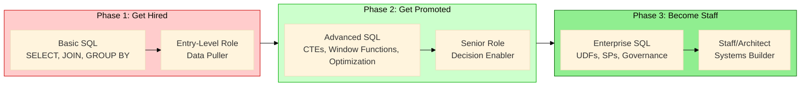

# diagram_01_together-these-two-guides-form-a-complete-roadmap-1c4a

```mermaid
---
config:
  theme: base
  layout: elk
---
graph LR
    subgraph Phase1 [Phase 1: Get Hired]
        direction LR
        B[Basic SQL<br/>SELECT, JOIN, GROUP BY] --> C[Entry-Level Role<br/>Data Puller]
    end
    
    subgraph Phase2 [Phase 2: Get Promoted]
        direction LR
        A[Advanced SQL<br/>CTEs, Window Functions, Optimization] --> S[Senior Role<br/>Decision Enabler]
    end
    
    subgraph Phase3 [Phase 3: Become Staff]
        direction LR
        E[Enterprise SQL<br/>UDFs, SPs, Governance] --> L[Staff/Architect<br/>Systems Builder]
    end
    
    Phase1 --> Phase2 --> Phase3
    
    style Phase1 fill:#ffcccc,stroke:#cc0000
    style Phase2 fill:#ccffcc,stroke:#00aa00
    style Phase3 fill:#90EE90,stroke:#006600
```
