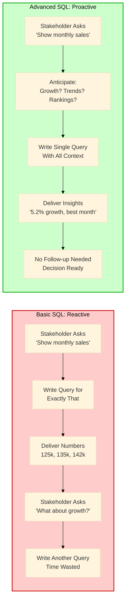

# diagram_02_basic-sql-practitioners-react-to-requests-literall-ddee

```mermaid
---
config:
  theme: base
---
graph LR
    subgraph Basic["Basic SQL: Reactive"]
        R1["Stakeholder Asks<br/>'Show monthly sales'"] --> R2["Write Query for<br/>Exactly That"]
        R2 --> R3["Deliver Numbers<br/>125k, 135k, 142k"]
        R3 --> R4["Stakeholder Asks<br/>'What about growth?'"]
        R4 --> R5["Write Another Query<br/>Time Wasted"]
    end
    
    subgraph Advanced["Advanced SQL: Proactive"]
        P1["Stakeholder Asks<br/>'Show monthly sales'"] --> P2["Anticipate:<br/>Growth? Trends? Rankings?"]
        P2 --> P3["Write Single Query<br/>With All Context"]
        P3 --> P4["Deliver Insights<br/>'5.2% growth, best month'"]
        P4 --> P5["No Follow-up Needed<br/>Decision Ready"]
    end
    
    style Basic fill:#ffcccc,stroke:#cc0000,stroke-width:2px
    style Advanced fill:#ccffcc,stroke:#00aa00,stroke-width:2px
```
