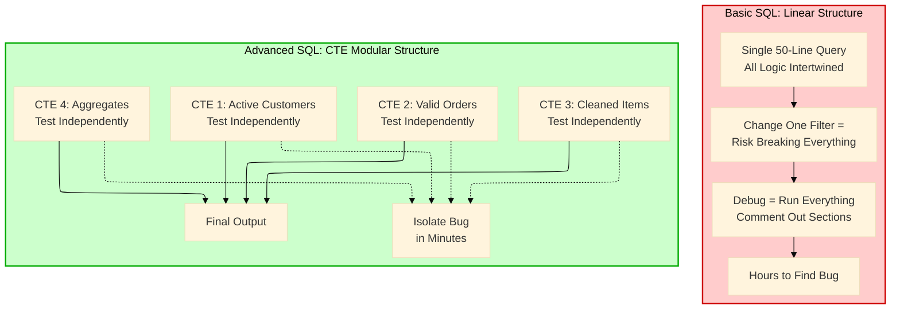

# diagram_03_code-thats-readable-is-maintainable-code-thats-e563

```mermaid
---
config:
  theme: base
  layout: elk
---
graph TD
    subgraph Basic [Basic SQL: Linear Structure]
        direction TB
        L1[Single 50-Line Query<br/>All Logic Intertwined] --> L2[Change One Filter =<br/>Risk Breaking Everything]
        L2 --> L3[Debug = Run Everything<br/>Comment Out Sections]
        L3 --> L4["Hours to Find Bug"]
    end
    
    subgraph Advanced [Advanced SQL: CTE Modular Structure]
        direction TB
        M1[CTE 1: Active Customers<br/>Test Independently] --> M5[Final Output]
        M2[CTE 2: Valid Orders<br/>Test Independently] --> M5
        M3[CTE 3: Cleaned Items<br/>Test Independently] --> M5
        M4[CTE 4: Aggregates<br/>Test Independently] --> M5
        M1 -.-> D1[Isolate Bug<br/>in Minutes]
        M2 -.-> D1
        M3 -.-> D1
        M4 -.-> D1
    end
    
    style Basic fill:#ffcccc,stroke:#cc0000,stroke-width:2px
    style Advanced fill:#ccffcc,stroke:#00aa00,stroke-width:2px
```
