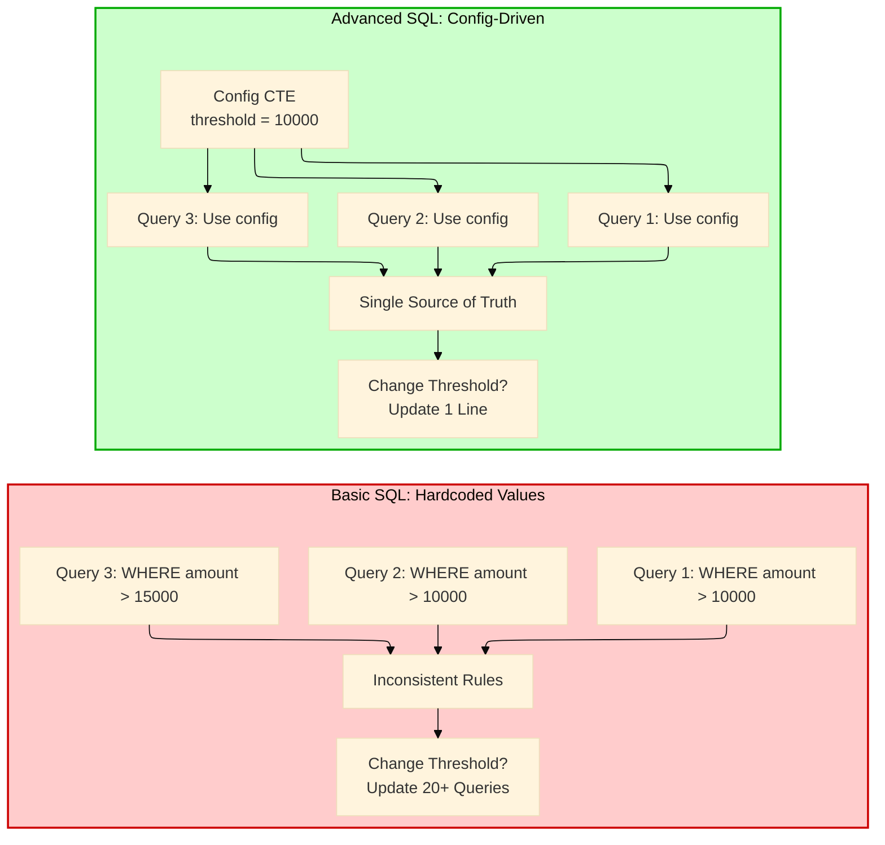

# diagram_04_when-business-rules-change-and-they-always-do-h-7ec6

```mermaid
---
config:
  theme: base
  layout: elk
---
graph LR
    subgraph Basic [Basic SQL: Hardcoded Values]
        direction TB
        H1[Query 1: WHERE amount > 10000] --> H3[Inconsistent Rules]
        H2[Query 2: WHERE amount > 10000] --> H3
        H4[Query 3: WHERE amount > 15000] --> H3
        H3 --> H5[Change Threshold?<br/>Update 20+ Queries]
    end
    
    subgraph Advanced [Advanced SQL: Config-Driven]
        direction TB
        C1[Config CTE<br/>threshold = 10000] --> C2[Query 1: Use config]
        C1 --> C3[Query 2: Use config]
        C1 --> C4[Query 3: Use config]
        C2 --> C5[Single Source of Truth]
        C3 --> C5
        C4 --> C5
        C5 --> C6[Change Threshold?<br/>Update 1 Line]
    end
    
    style Basic fill:#ffcccc,stroke:#cc0000,stroke-width:2px
    style Advanced fill:#ccffcc,stroke:#00aa00,stroke-width:2px
```
