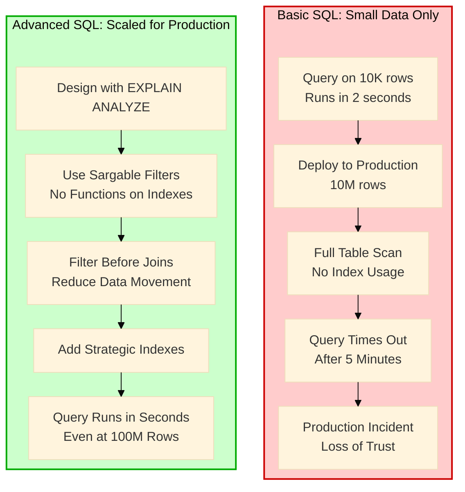

# diagram_05_queries-that-work-on-10000-rows-often-fail-catast-1a10

```mermaid
---
config:
  theme: base
  layout: elk
---
graph TD
    subgraph Basic [Basic SQL: Small Data Only]
        direction TB
        B1[Query on 10K rows<br/>Runs in 2 seconds] --> B2[Deploy to Production<br/>10M rows]
        B2 --> B3[Full Table Scan<br/>No Index Usage]
        B3 --> B4[Query Times Out<br/>After 5 Minutes]
        B4 --> B5[Production Incident<br/>Loss of Trust]
    end
    
    subgraph Advanced [Advanced SQL: Scaled for Production]
        direction TB
        A1[Design with EXPLAIN ANALYZE] --> A2[Use Sargable Filters<br/>No Functions on Indexes]
        A2 --> A3[Filter Before Joins<br/>Reduce Data Movement]
        A3 --> A4[Add Strategic Indexes]
        A4 --> A5[Query Runs in Seconds<br/>Even at 100M Rows]
    end
    
    style Basic fill:#ffcccc,stroke:#cc0000,stroke-width:2px
    style Advanced fill:#ccffcc,stroke:#00aa00,stroke-width:2px
```
