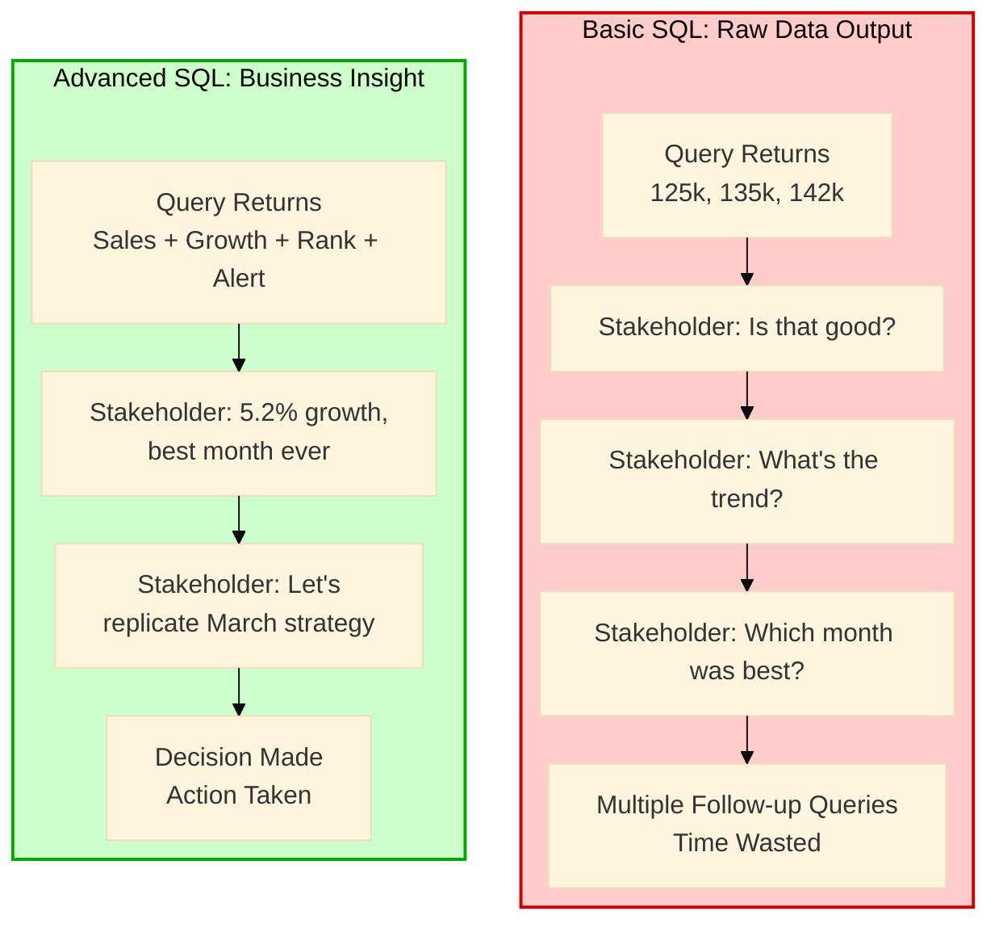

# diagram_06_raw-data-requires-stakeholders-to-do-their-own-ana-57d3

```mermaid
---
config:
  theme: base
  layout: elk
---
graph TB
    subgraph Basic [Basic SQL: Raw Data Output]
        direction TB
        R1[Query Returns<br/>125k, 135k, 142k] --> R2[Stakeholder: Is that good?]
        R2 --> R3[Stakeholder: What's the trend?]
        R3 --> R4[Stakeholder: Which month was best?]
        R4 --> R5[Multiple Follow-up Queries<br/>Time Wasted]
    end
    
    subgraph Advanced [Advanced SQL: Business Insight]
        direction TB
        I1[Query Returns<br/>Sales + Growth + Rank + Alert] --> I2[Stakeholder: 5.2% growth,<br/>best month ever]
        I2 --> I3[Stakeholder: Let's<br/>replicate March strategy]
        I3 --> I4[Decision Made<br/>Action Taken]
    end
    
    style Basic fill:#ffcccc,stroke:#cc0000,stroke-width:2px
    style Advanced fill:#ccffcc,stroke:#00aa00,stroke-width:2px
```
