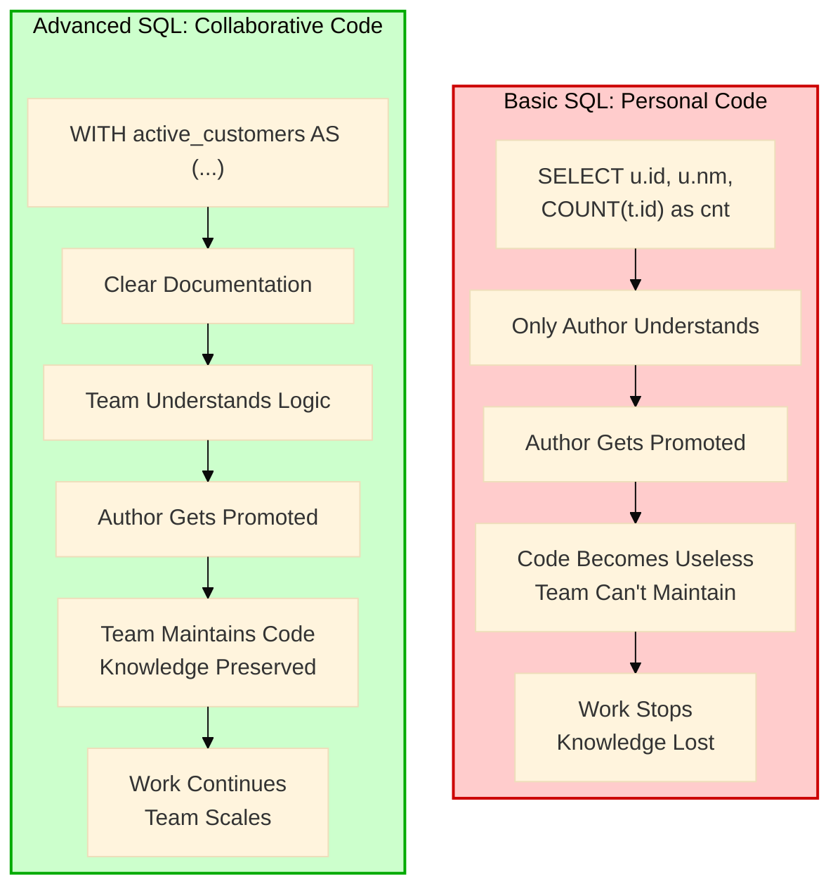

# diagram_07_code-that-only-you-understand-creates-a-knowledge-dab6

```mermaid
---
config:
  theme: base
  layout: elk
---
graph TD
    subgraph Basic [Basic SQL: Personal Code]
        direction TB
        P1["SELECT u.id, u.nm,<br/>COUNT(t.id) as cnt"] --> P2[Only Author Understands]
        P2 --> P3[Author Gets Promoted]
        P3 --> P4[Code Becomes Useless<br/>Team Can't Maintain]
        P4 --> P5[Work Stops<br/>Knowledge Lost]
    end
    
    subgraph Advanced [Advanced SQL: Collaborative Code]
        direction TB
        C1["WITH active_customers AS (...)"] --> C2[Clear Documentation]
        C2 --> C3[Team Understands Logic]
        C3 --> C4[Author Gets Promoted]
        C4 --> C5[Team Maintains Code<br/>Knowledge Preserved]
        C5 --> C6[Work Continues<br/>Team Scales]
    end
    
    style Basic fill:#ffcccc,stroke:#cc0000,stroke-width:2px
    style Advanced fill:#ccffcc,stroke:#00aa00,stroke-width:2px
```
