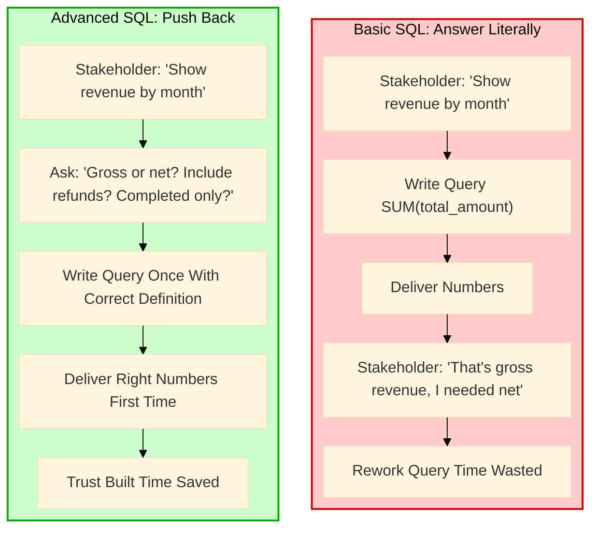

# diagram_08_stakeholders-often-dont-know-exactly-what-they-ne-3990

```mermaid
---
config:
  theme: base
  layout: elk
---
graph TB
    subgraph Basic [Basic SQL: Answer Literally]
        direction TB
        A1["Stakeholder: 'Show revenue by month'"] --> A2["Write Query SUM(total_amount)"]
        A2 --> A3["Deliver Numbers"]
        A3 --> A4["Stakeholder: 'That's gross revenue, I needed net'"]
        A4 --> A5["Rework Query Time Wasted"]
    end
    
    subgraph Advanced [Advanced SQL: Push Back]
        direction TB
        B1["Stakeholder: 'Show revenue by month'"] --> B2["Ask: 'Gross or net? Include refunds? Completed only?'"]
        B2 --> B3["Write Query Once With Correct Definition"]
        B3 --> B4["Deliver Right Numbers First Time"]
        B4 --> B5["Trust Built Time Saved"]
    end
    
    style Basic fill:#ffcccc,stroke:#cc0000,stroke-width:2px
    style Advanced fill:#ccffcc,stroke:#00aa00,stroke-width:2px
```
