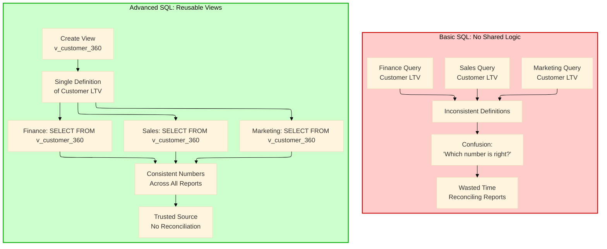

# diagram_09_one-off-queries-create-duplicated-work-and-inconsi-6811

```mermaid
---
config:
  theme: base
  layout: elk
---
graph TD
    subgraph Basic [Basic SQL: No Shared Logic]
        direction TB
        N1[Marketing Query<br/>Customer LTV] --> N4[Inconsistent Definitions]
        N2[Sales Query<br/>Customer LTV] --> N4
        N3[Finance Query<br/>Customer LTV] --> N4
        N4 --> N5["Confusion:<br/>'Which number is right?'"]
        N5 --> N6[Wasted Time<br/>Reconciling Reports]
    end
    
    subgraph Advanced [Advanced SQL: Reusable Views]
        direction TB
        R1[Create View<br/>v_customer_360] --> R2[Single Definition<br/>of Customer LTV]
        R2 --> R3[Marketing: SELECT FROM v_customer_360]
        R2 --> R4[Sales: SELECT FROM v_customer_360]
        R2 --> R5[Finance: SELECT FROM v_customer_360]
        R3 --> R6[Consistent Numbers<br/>Across All Reports]
        R4 --> R6
        R5 --> R6
        R6 --> R7[Trusted Source<br/>No Reconciliation]
    end
    
    style Basic fill:#ffcccc,stroke:#cc0000,stroke-width:2px
    style Advanced fill:#ccffcc,stroke:#00aa00,stroke-width:2px
```
