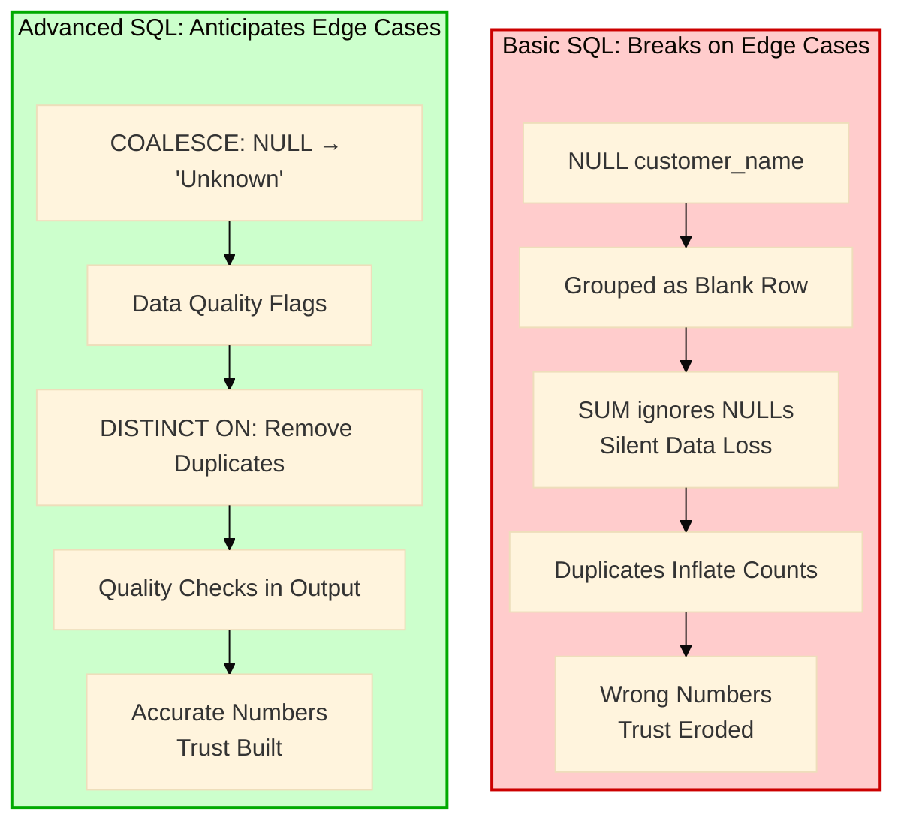

# diagram_10_real-data-is-messy-nulls-duplicates-and-edge-ca-0452

```mermaid
---
config:
  theme: base
  layout: elk
---
graph TD
    subgraph Basic [Basic SQL: Breaks on Edge Cases]
        direction TB
        B1[NULL customer_name] --> B2[Grouped as Blank Row]
        B2 --> B3[SUM ignores NULLs<br/>Silent Data Loss]
        B3 --> B4[Duplicates Inflate Counts]
        B4 --> B5[Wrong Numbers<br/>Trust Eroded]
    end
    
    subgraph Advanced [Advanced SQL: Anticipates Edge Cases]
        direction TB
        A1[COALESCE: NULL → 'Unknown'] --> A2[Data Quality Flags]
        A2 --> A3[DISTINCT ON: Remove Duplicates]
        A3 --> A4[Quality Checks in Output]
        A4 --> A5[Accurate Numbers<br/>Trust Built]
    end
    
    style Basic fill:#ffcccc,stroke:#cc0000,stroke-width:2px
    style Advanced fill:#ccffcc,stroke:#00aa00,stroke-width:2px
```
