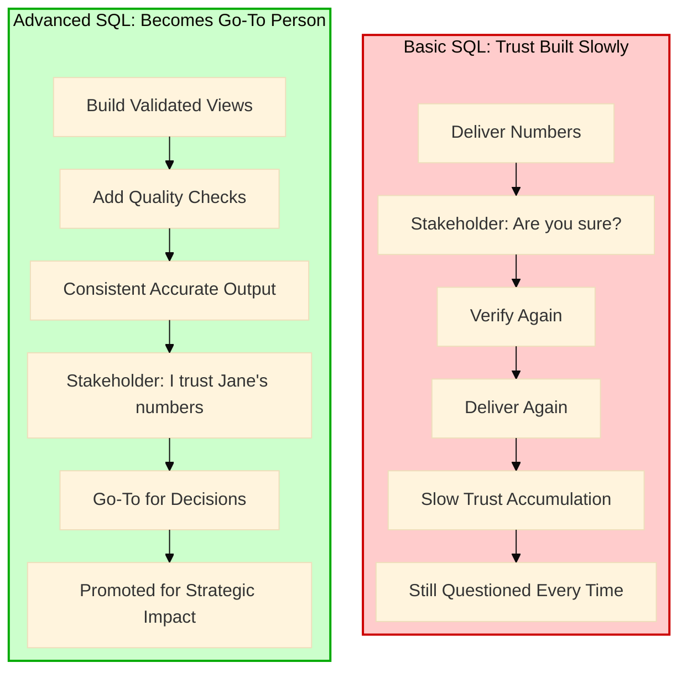

# diagram_11_when-you-consistently-deliver-accurate-well-docum-5c6b

```mermaid
---
config:
  theme: base
  layout: elk
---
graph TB
    subgraph Basic [Basic SQL: Trust Built Slowly]
        direction TB
        T1["Deliver Numbers"] --> T2["Stakeholder: Are you sure?"]
        T2 --> T3["Verify Again"]
        T3 --> T4["Deliver Again"]
        T4 --> T5["Slow Trust Accumulation"]
        T5 --> T6["Still Questioned Every Time"]
    end
    
    subgraph Advanced [Advanced SQL: Becomes Go-To Person]
        direction TB
        G1["Build Validated Views"] --> G2["Add Quality Checks"]
        G2 --> G3["Consistent Accurate Output"]
        G3 --> G4["Stakeholder: I trust Jane's numbers"]
        G4 --> G5["Go-To for Decisions"]
        G5 --> G6["Promoted for Strategic Impact"]
    end
    
    style Basic fill:#ffcccc,stroke:#cc0000,stroke-width:2px
    style Advanced fill:#ccffcc,stroke:#00aa00,stroke-width:2px
```
