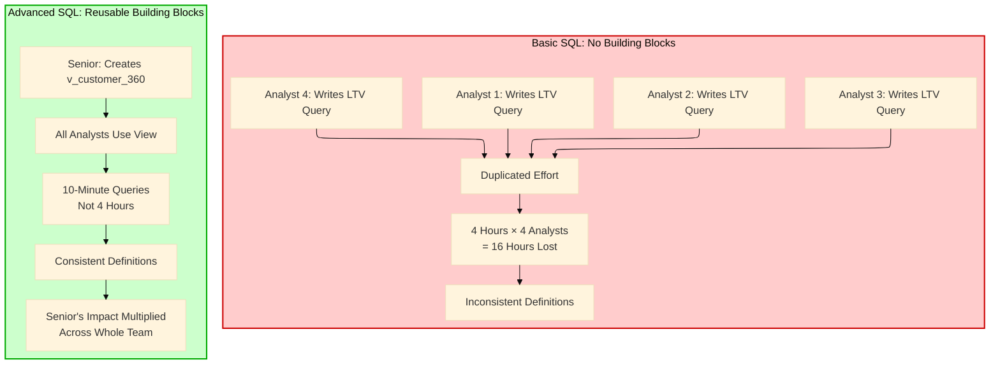

# diagram_12_reusable-views-and-templates-multiply-your-impact-1c8f

```mermaid
---
config:
  theme: base
  layout: elk
---
graph TD
    subgraph Basic [Basic SQL: No Building Blocks]
        direction TB
        N1[Analyst 1: Writes LTV Query] --> N5[Duplicated Effort]
        N2[Analyst 2: Writes LTV Query] --> N5
        N3[Analyst 3: Writes LTV Query] --> N5
        N4[Analyst 4: Writes LTV Query] --> N5
        N5 --> N6[4 Hours × 4 Analysts<br/>= 16 Hours Lost]
        N6 --> N7[Inconsistent Definitions]
    end
    
    subgraph Advanced [Advanced SQL: Reusable Building Blocks]
        direction TB
        R1[Senior: Creates v_customer_360] --> R2[All Analysts Use View]
        R2 --> R3[10-Minute Queries<br/>Not 4 Hours]
        R3 --> R4[Consistent Definitions]
        R4 --> R5[Senior's Impact Multiplied<br/>Across Whole Team]
    end
    
    style Basic fill:#ffcccc,stroke:#cc0000,stroke-width:2px
    style Advanced fill:#ccffcc,stroke:#00aa00,stroke-width:2px
```
