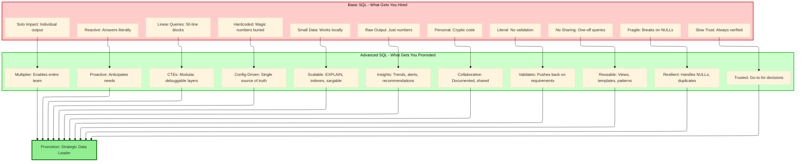

# diagram_13_lets-visualize-the-complete-transformation-weve-d4d6

```mermaid
---
config:
  theme: base
  layout: elk
---
graph TB
    subgraph BASIC [Basic SQL - What Gets You Hired]
        direction TB
        B1["Reactive: Answers literally"]
        B2["Linear Queries: 50-line blocks"]
        B3["Hardcoded: Magic numbers buried"]
        B4["Small Data: Works locally"]
        B5["Raw Output: Just numbers"]
        B6["Personal: Cryptic code"]
        B7["Literal: No validation"]
        B8["No Sharing: One-off queries"]
        B9["Fragile: Breaks on NULLs"]
        B10["Slow Trust: Always verified"]
        B11["Solo Impact: Individual output"]
    end
    
    subgraph ADVANCED [Advanced SQL - What Gets You Promoted]
        direction TB
        A1["Proactive: Anticipates needs"]
        A2["CTEs: Modular, debuggable layers"]
        A3["Config-Driven: Single source of truth"]
        A4["Scalable: EXPLAIN, indexes, sargable"]
        A5["Insights: Trends, alerts, recommendations"]
        A6["Collaborative: Documented, shared"]
        A7["Validates: Pushes back on requirements"]
        A8["Reusable: Views, templates, patterns"]
        A9["Resilient: Handles NULLs, duplicates"]
        A10["Trusted: Go-to for decisions"]
        A11["Multiplier: Enables entire team"]
    end
    
    B1 --> A1
    B2 --> A2
    B3 --> A3
    B4 --> A4
    B5 --> A5
    B6 --> A6
    B7 --> A7
    B8 --> A8
    B9 --> A9
    B10 --> A10
    B11 --> A11
    
    A1 --> P
    A2 --> P
    A3 --> P
    A4 --> P
    A5 --> P
    A6 --> P
    A7 --> P
    A8 --> P
    A9 --> P
    A10 --> P
    A11 --> P
    
    P["Promotion: Strategic Data Leader"]
    
    style BASIC fill:#ffcccc,stroke:#cc0000,stroke-width:2px
    style ADVANCED fill:#ccffcc,stroke:#00aa00,stroke-width:2px
    style P fill:#90EE90,stroke:#006600,stroke-width:3px
```
