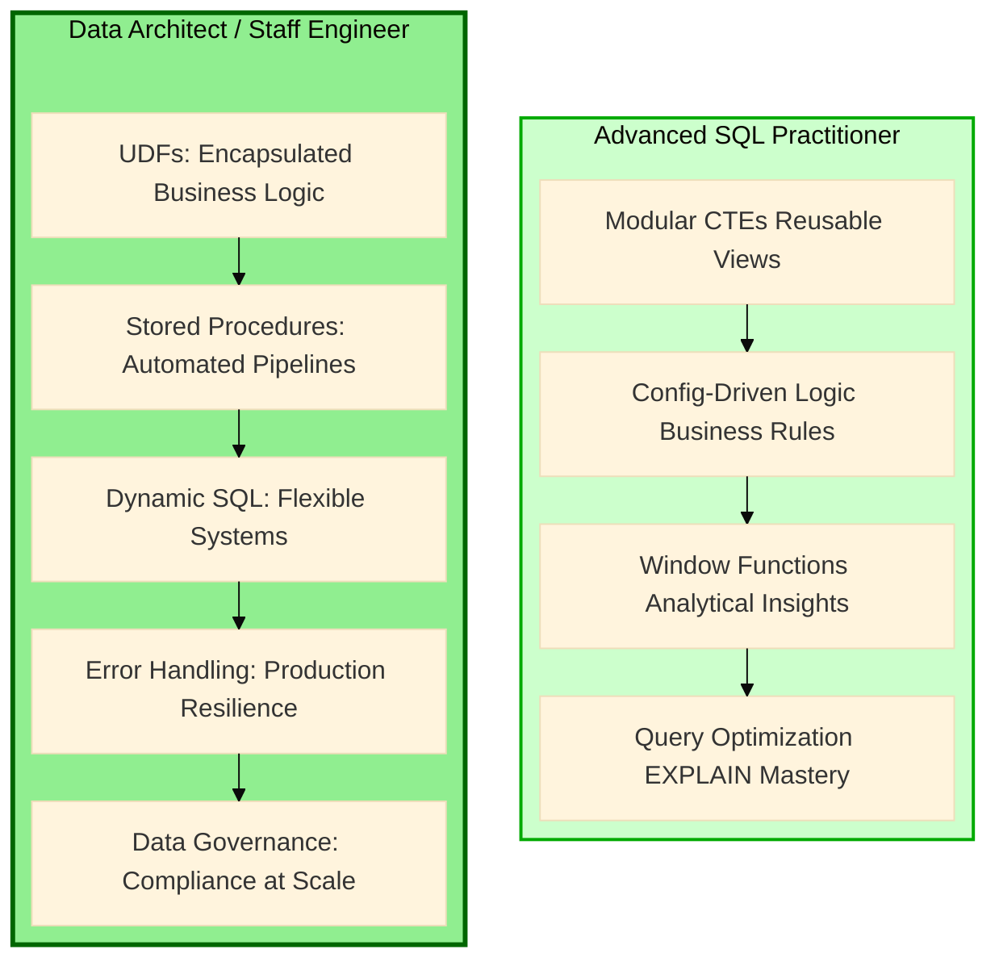

# diagram_01_before-diving-into-the-concepts-lets-visualize-t-99f6

```mermaid
---
config:
  theme: base
  layout: elk
---
graph TB
    subgraph Practitioner [Advanced SQL Practitioner]
        direction TB
        A["Modular CTEs Reusable Views"] --> B["Config-Driven Logic Business Rules"]
        B --> C["Window Functions Analytical Insights"]
        C --> D["Query Optimization EXPLAIN Mastery"]
    end
    
    subgraph Architect [Data Architect / Staff Engineer]
        direction TB
        E["UDFs: Encapsulated Business Logic"] --> F["Stored Procedures: Automated Pipelines"]
        F --> G["Dynamic SQL: Flexible Systems"]
        G --> H["Error Handling: Production Resilience"]
        H --> I["Data Governance: Compliance at Scale"]
    end
        
    style Practitioner fill:#ccffcc,stroke:#00aa00,stroke-width:2px
    style Architect fill:#90EE90,stroke:#006600,stroke-width:3px
```
