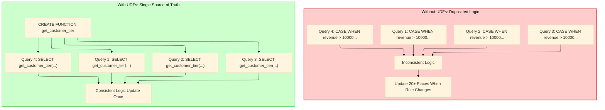

# diagram_02_without-udfs-the-same-business-logiclike-revenue-f143

```mermaid
---
config:
  theme: base
  layout: elk
---
graph TB
    subgraph Basic [Without UDFs: Duplicated Logic]
        direction TB
        B1["Query 1: CASE WHEN revenue > 10000..."] --> B5["Inconsistent Logic"]
        B2["Query 2: CASE WHEN revenue > 10000..."] --> B5
        B3["Query 3: CASE WHEN revenue > 10000..."] --> B5
        B4["Query 4: CASE WHEN revenue > 10000..."] --> B5
        B5 --> B6["Update 20+ Places When Rule Changes"]
    end
    
    subgraph Advanced [With UDFs: Single Source of Truth]
        direction TB
        U1["CREATE FUNCTION get_customer_tier"] --> U2["Query 1: SELECT get_customer_tier(...)"]
        U1 --> U3["Query 2: SELECT get_customer_tier(...)"]
        U1 --> U4["Query 3: SELECT get_customer_tier(...)"]
        U1 --> U5["Query 4: SELECT get_customer_tier(...)"]
        U2 --> U6["Consistent Logic Update Once"]
        U3 --> U6
        U4 --> U6
        U5 --> U6
    end
    
    style Basic fill:#ffcccc,stroke:#cc0000,stroke-width:2px
    style Advanced fill:#ccffcc,stroke:#00aa00,stroke-width:2px
```
