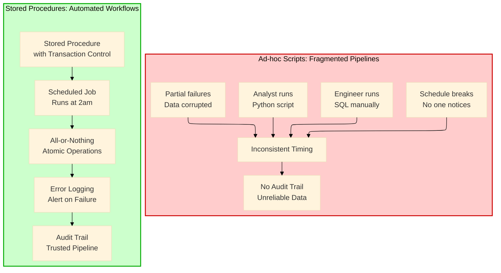

# diagram_03_without-stored-procedures-data-pipelines-are-buil-279a

```mermaid
---
config:
  theme: base
  layout: elk
---
graph TD
    subgraph Basic [Ad-hoc Scripts: Fragmented Pipelines]
        direction TB
        B1[Analyst runs<br/>Python script] --> B5[Inconsistent Timing]
        B2[Engineer runs<br/>SQL manually] --> B5
        B3[Schedule breaks<br/>No one notices] --> B5
        B4[Partial failures<br/>Data corrupted] --> B5
        B5 --> B6[No Audit Trail<br/>Unreliable Data]
    end
    
    subgraph Advanced [Stored Procedures: Automated Workflows]
        direction TB
        A1[Stored Procedure<br/>with Transaction Control] --> A2[Scheduled Job<br/>Runs at 2am]
        A2 --> A3[All-or-Nothing<br/>Atomic Operations]
        A3 --> A4[Error Logging<br/>Alert on Failure]
        A4 --> A5[Audit Trail<br/>Trusted Pipeline]
    end
    
    style Basic fill:#ffcccc,stroke:#cc0000,stroke-width:2px
    style Advanced fill:#ccffcc,stroke:#00aa00,stroke-width:2px
```
