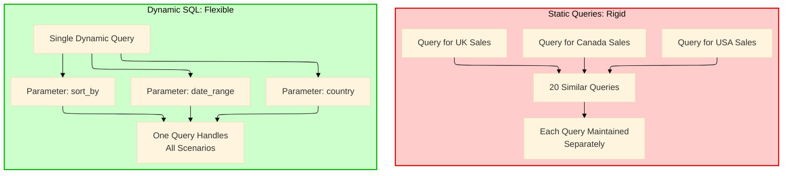

# diagram_04_static-queries-are-rigidthey-work-for-specific-sc-0a2f

```mermaid
---
config:
  theme: base
  layout: elk
---
graph TD
    subgraph Basic [Static Queries: Rigid]
        direction TB
        S1[Query for USA Sales] --> S4[20 Similar Queries]
        S2[Query for Canada Sales] --> S4
        S3[Query for UK Sales] --> S4
        S4 --> S5[Each Query Maintained<br/>Separately]
    end
    
    subgraph Advanced [Dynamic SQL: Flexible]
        direction TB
        D1[Single Dynamic Query] --> D2[Parameter: country]
        D1 --> D3[Parameter: date_range]
        D1 --> D4[Parameter: sort_by]
        D2 --> D5[One Query Handles<br/>All Scenarios]
        D3 --> D5
        D4 --> D5
    end
    
    style Basic fill:#ffcccc,stroke:#cc0000,stroke-width:2px
    style Advanced fill:#ccffcc,stroke:#00aa00,stroke-width:2px
```
