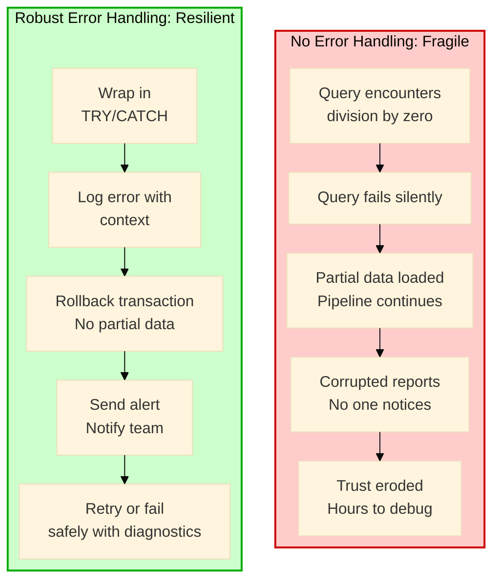

# diagram_05_without-error-handling-a-single-unexpected-null-5977

```mermaid
---
config:
  theme: base
  layout: elk
---
graph TD
    subgraph Basic [No Error Handling: Fragile]
        direction TB
        B1[Query encounters<br/>division by zero] --> B2[Query fails silently]
        B2 --> B3[Partial data loaded<br/>Pipeline continues]
        B3 --> B4[Corrupted reports<br/>No one notices]
        B4 --> B5[Trust eroded<br/>Hours to debug]
    end
    
    subgraph Advanced [Robust Error Handling: Resilient]
        direction TB
        A1[Wrap in<br/>TRY/CATCH] --> A2[Log error with<br/>context]
        A2 --> A3[Rollback transaction<br/>No partial data]
        A3 --> A4[Send alert<br/>Notify team]
        A4 --> A5[Retry or fail<br/>safely with diagnostics]
    end
    
    style Basic fill:#ffcccc,stroke:#cc0000,stroke-width:2px
    style Advanced fill:#ccffcc,stroke:#00aa00,stroke-width:2px
```
