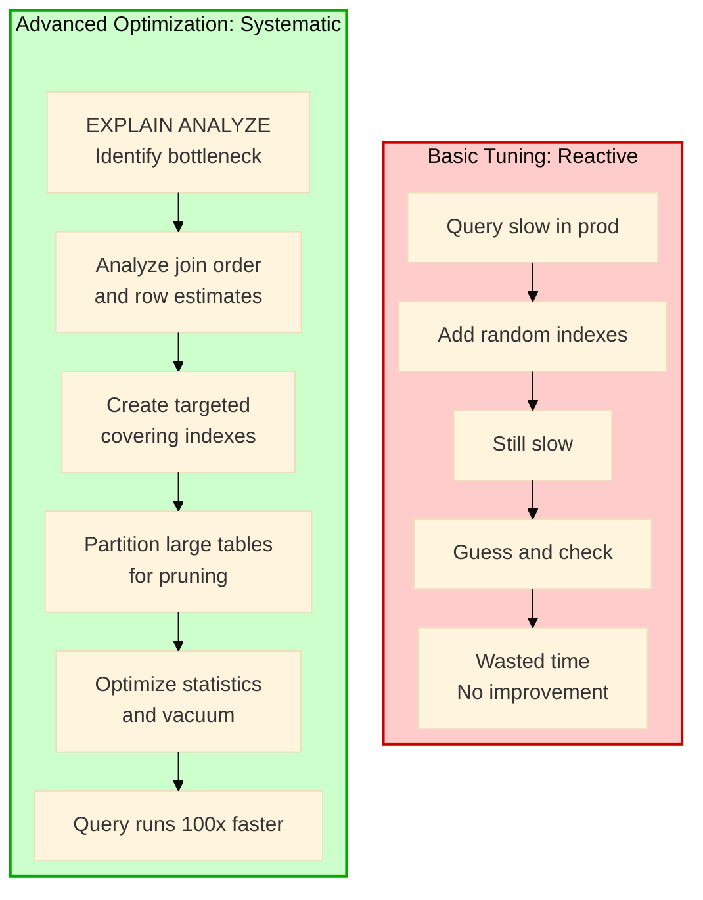

# diagram_06_as-data-volumes-grow-even-well-written-queries-ca-3bbc

```mermaid
---
config:
  theme: base
  layout: elk
---
graph TD
    subgraph Basic [Basic Tuning: Reactive]
        direction TB
        B1[Query slow in prod] --> B2[Add random indexes]
        B2 --> B3[Still slow]
        B3 --> B4[Guess and check]
        B4 --> B5[Wasted time<br/>No improvement]
    end
    
    subgraph Advanced [Advanced Optimization: Systematic]
        direction TB
        A1[EXPLAIN ANALYZE<br/>Identify bottleneck] --> A2[Analyze join order<br/>and row estimates]
        A2 --> A3[Create targeted<br/>covering indexes]
        A3 --> A4[Partition large tables<br/>for pruning]
        A4 --> A5[Optimize statistics<br/>and vacuum]
        A5 --> A6[Query runs 100x faster]
    end
    
    style Basic fill:#ffcccc,stroke:#cc0000,stroke-width:2px
    style Advanced fill:#ccffcc,stroke:#00aa00,stroke-width:2px
```
