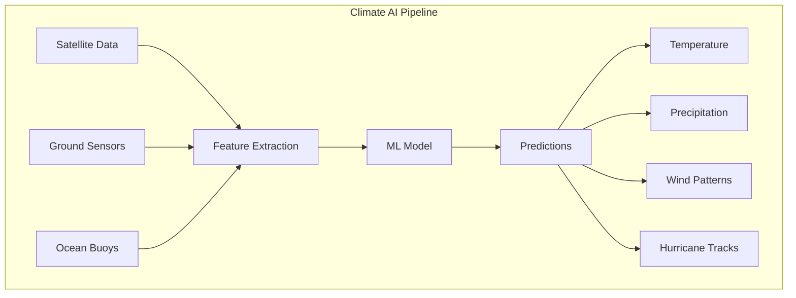

# The 2026 AI Metromap: AI for Social Good – Climate Action, Agriculture, and Sustainability

## Series E: Applied AI & Agents Line | Story 14 of 15+

---

## 📖 Introduction

**Welcome to the fourteenth stop on the Applied AI & Agents Line.**

In our last four stories, we explored AI in healthcare, finance, gaming, and manufacturing. You've seen how AI saves lives, moves money, entertains millions, and builds products. Your applications span industries and impact billions of people.

Now let's turn to something even bigger: **the future of our planet.**

Climate change, food security, energy sustainability, wildlife conservation, disaster response—these aren't just problems. They're existential challenges that AI is uniquely positioned to address. AI can predict weather patterns with unprecedented accuracy, optimize renewable energy grids, monitor deforestation in real-time, detect diseases in crops before they spread, and coordinate disaster response when every second counts.

This story—**The 2026 AI Metromap: AI for Social Good – Climate Action, Agriculture, and Sustainability**—is your guide to building AI that makes the world better. We'll implement climate modeling—predicting weather patterns and climate impacts. We'll build precision agriculture systems—optimizing irrigation, detecting crop disease, predicting yields. We'll create energy optimization—forecasting renewable generation, optimizing grid operations. And we'll develop wildlife conservation and disaster response systems that protect both nature and people.

**Let's build AI that matters.**

---

## 📚 Where You Are in the Journey

### The Master Story Arc: The 2026 AI Metromap Series (Complete)

- 🗺️ **[The 2026 AI Metromap: Why the Old Learning Routes Are Obsolete](#)** – A paradigm shift from linear learning to transit-system mastery.
- 🧭 **[The 2026 AI Metromap: Reading the Map](#)** – Strategic navigation across the three core lines.
- 🎒 **[The 2026 AI Metromap: Avoiding Derailments](#)** – Diagnosing and preventing the most common learning pitfalls.
- 🏁 **[The 2026 AI Metromap: From Passenger to Driver](#)** – Building your portfolio using the Metromap structure.

### Series A: Foundations Station (Complete)
### Series B: Supervised Learning Line (Complete)
### Series C: Modern Architecture Line (Complete)
### Series D: Engineering & Optimization Yard (Complete)

### Series E: Applied AI & Agents Line (15+ Stories)

- 💬 **[The 2026 AI Metromap: Prompt Engineering 101 – The Art of Talking to AI](#)**
- 📚 **[The 2026 AI Metromap: RAG – Retrieval-Augmented Generation for Knowledge-Intensive Tasks](#)**
- 🤖 **[The 2026 AI Metromap: AI Agents & Autonomous Workflows – The Self-Driving Trains](#)**
- 🗣️ **[The 2026 AI Metromap: Voice Assistants & Speech Models – Making AI Talk](#)**
- 👁️ **[The 2026 AI Metromap: Computer Vision Projects – From OCR to Face Recognition](#)**
- 🎨 **[The 2026 AI Metromap: Image Generation & Editing – Diffusion Models in Practice](#)**
- 🔤 **[The 2026 AI Metromap: NLP Tasks – NER, Translation, Summarization, and Beyond](#)**
- 📈 **[The 2026 AI Metromap: Time Series Forecasting – ARIMA, LSTM, and Transformers](#)**
- 👍 **[The 2026 AI Metromap: Recommendation Systems – From Collaborative Filtering to Two-Tower Networks](#)**
- 🏥 **[The 2026 AI Metromap: AI in Healthcare – Medical Research, Diagnostics, and Wellness](#)**
- 💰 **[The 2026 AI Metromap: AI in Finance – Banking, Insurance, and Trading](#)**
- 🎮 **[The 2026 AI Metromap: AI in Gaming, VR/AR, and Entertainment](#)**
- 🏭 **[The 2026 AI Metromap: AI in Robotics, Manufacturing, and Supply Chain](#)**
- 🌱 **The 2026 AI Metromap: AI for Social Good – Climate Action, Agriculture, and Sustainability** – Crop yield prediction; climate modeling; energy optimization; wildlife conservation; disaster response. **⬅️ YOU ARE HERE**

- 🎓 **[The 2026 AI Metromap: AI in Education – Personalized Learning and Training](#)** – Intelligent tutoring systems; automated grading; personalized content recommendation; adaptive learning paths. 🔜 *Up Next*

### The Complete Story Catalog

For a complete view of all upcoming stories across every series, visit the **[Complete 2026 AI Metromap Story Catalog](#)**.

---

## 🌍 Climate Modeling and Weather Prediction

AI enhances climate models and improves weather forecasting accuracy.



```python
def climate_modeling():
    """Implement AI for climate modeling and weather prediction"""
    
    print("="*60)
    print("AI FOR CLIMATE MODELING")
    print("="*60)
    
    print("""
    import numpy as np
    import torch
    import torch.nn as nn
    from sklearn.ensemble import RandomForestRegressor
    import xarray as xr
    
    # 1. Temperature prediction with CNN
    class TemperaturePredictor(nn.Module):
        \"\"\"CNN for temperature prediction from spatial data\"\"\"
        
        def __init__(self):
            super().__init__()
            self.conv1 = nn.Conv2d(3, 64, 3, padding=1)
            self.conv2 = nn.Conv2d(64, 128, 3, padding=1)
            self.conv3 = nn.Conv2d(128, 256, 3, padding=1)
            self.pool = nn.MaxPool2d(2)
            self.fc = nn.Sequential(
                nn.Linear(256 * 8 * 8, 512),
                nn.ReLU(),
                nn.Dropout(0.3),
                nn.Linear(512, 1)
            )
        
        def forward(self, x):
            x = self.pool(torch.relu(self.conv1(x)))
            x = self.pool(torch.relu(self.conv2(x)))
            x = self.pool(torch.relu(self.conv3(x)))
            x = x.view(x.size(0), -1)
            return self.fc(x)
    
    # 2. Hurricane tracking with LSTM
    class HurricaneTracker(nn.Module):
        \"\"\"LSTM for hurricane path prediction\"\"\"
        
        def __init__(self, input_dim=10, hidden_dim=128):
            super().__init__()
            self.lstm = nn.LSTM(input_dim, hidden_dim, batch_first=True)
            self.fc = nn.Sequential(
                nn.Linear(hidden_dim, 64),
                nn.ReLU(),
                nn.Linear(64, 2)  # Latitude, longitude
            )
        
        def forward(self, x):
            # x shape: (batch, timesteps, features)
            lstm_out, _ = self.lstm(x)
            last_output = lstm_out[:, -1, :]
            return self.fc(last_output)
    
    # 3. Precipitation forecasting with Random Forest
    class PrecipitationForecaster:
        \"\"\"Random forest for precipitation prediction\"\"\"
        
        def __init__(self):
            self.model = RandomForestRegressor(n_estimators=100, max_depth=10)
        
        def train(self, features, targets):
            \"\"\"Train on historical weather data\"\"\"
            self.model.fit(features, targets)
        
        def predict(self, features):
            \"\"\"Predict precipitation\"\"\"
            return self.model.predict(features)
        
        def get_feature_importance(self, feature_names):
            \"\"\"Identify most important weather factors\"\"\"
            importance = self.model.feature_importances_
            return sorted(zip(feature_names, importance), key=lambda x: x[1], reverse=True)
    
    # 4. Carbon emissions monitoring
    class CarbonMonitor:
        \"\"\"Monitor and predict carbon emissions\"\"\"
        
        def __init__(self):
            self.emission_model = None
            self.satellite_data = None
        
        def process_satellite_data(self, satellite_images):
            \"\"\"Extract emission indicators from satellite imagery\"\"\"
            # Detect industrial activity, deforestation, urban growth
            features = {
                'industrial_heat': self._detect_heat_sources(satellite_images),
                'deforestation_rate': self._measure_deforestation(satellite_images),
                'urban_expansion': self._measure_urban_growth(satellite_images)
            }
            return features
        
        def predict_emissions(self, economic_data, weather_data):
            \"\"\"Predict future emissions\"\"\"
            features = np.concatenate([economic_data, weather_data])
            return self.emission_model.predict([features])[0]
    
    # 5. Sea level rise prediction
    class SeaLevelPredictor:
        \"\"\"Predict sea level rise using historical data\"\"\"
        
        def __init__(self):
            self.model = self._build_lstm()
        
        def _build_lstm(self):
            return nn.Sequential(
                nn.LSTM(5, 64, batch_first=True),
                nn.Linear(64, 32),
                nn.ReLU(),
                nn.Linear(32, 1)
            )
        
        def predict(self, historical_data, scenarios):
            \"\"\"Predict sea level under different scenarios\"\"\"
            predictions = {}
            
            for scenario_name, scenario_params in scenarios.items():
                # Adjust inputs based on scenario
                scenario_data = self._apply_scenario(historical_data, scenario_params)
                
                # Predict
                pred = self.model(scenario_data)
                predictions[scenario_name] = pred
            
            return predictions
    
    # 6. Weather pattern classification
    class WeatherPatternClassifier:
        \"\"\"Classify weather patterns from satellite imagery\"\"\"
        
        def __init__(self):
            self.model = self._build_resnet()
        
        def classify(self, satellite_image):
            \"\"\"Classify weather pattern\"\"\"
            patterns = ['clear', 'cloudy', 'rain', 'storm', 'hurricane', 'fog']
            probs = self.model(satellite_image)
            pattern_idx = torch.argmax(probs).item()
            
            return {
                'pattern': patterns[pattern_idx],
                'confidence': probs[pattern_idx].item(),
                'all_probabilities': {p: prob.item() for p, prob in zip(patterns, probs)}
            }
    """)
    
    print("\n" + "="*60)
    print("CLIMATE APPLICATIONS")
    print("="*60)
    
    applications = [
        ("Weather Forecasting", "Short-term predictions", "Agriculture, aviation, events"),
        ("Hurricane Tracking", "Path and intensity", "Evacuation, emergency response"),
        ("Drought Prediction", "Water scarcity forecasting", "Agriculture, water management"),
        ("Sea Level Rise", "Long-term projections", "Coastal planning, infrastructure"),
        ("Carbon Monitoring", "Emissions tracking", "Policy, verification"),
        ("Renewable Energy", "Solar/wind forecasting", "Grid management")
    ]
    
    print(f"\n{'Application':<22} {'Description':<25} {'Impact':<30}")
    print("-"*80)
    for app, desc, impact in applications:
        print(f"{app:<22} {desc:<25} {impact:<30}")

climate_modeling()
```

---

## 🌾 Precision Agriculture: Feeding the World

AI optimizes farming, reduces waste, and increases yields.

```python
def precision_agriculture():
    """Implement AI for precision agriculture"""
    
    print("="*60)
    print("AI FOR PRECISION AGRICULTURE")
    print("="*60)
    
    print("""
    import torch
    import torch.nn as nn
    import numpy as np
    from sklearn.ensemble import RandomForestRegressor
    import cv2
    
    # 1. Crop disease detection
    class CropDiseaseDetector(nn.Module):
        \"\"\"CNN for detecting crop diseases from leaf images\"\"\"
        
        def __init__(self, num_diseases=10):
            super().__init__()
            self.conv1 = nn.Conv2d(3, 32, 3, padding=1)
            self.conv2 = nn.Conv2d(32, 64, 3, padding=1)
            self.conv3 = nn.Conv2d(64, 128, 3, padding=1)
            self.pool = nn.MaxPool2d(2)
            self.fc = nn.Sequential(
                nn.Linear(128 * 28 * 28, 256),
                nn.ReLU(),
                nn.Dropout(0.3),
                nn.Linear(256, num_diseases)
            )
        
        def forward(self, x):
            x = self.pool(torch.relu(self.conv1(x)))
            x = self.pool(torch.relu(self.conv2(x)))
            x = self.pool(torch.relu(self.conv3(x)))
            x = x.view(x.size(0), -1)
            return torch.softmax(self.fc(x), dim=1)
    
    # 2. Yield prediction model
    class YieldPredictor:
        \"\"\"Predict crop yields based on weather and soil\"\"\"
        
        def __init__(self):
            self.model = RandomForestRegressor(n_estimators=100)
        
        def train(self, historical_data):
            \"\"\"Train on historical yield data\"\"\"
            features = self._extract_features(historical_data)
            self.model.fit(features, historical_data['yield'])
        
        def predict(self, weather_forecast, soil_data, crop_type):
            \"\"\"Predict yield for upcoming season\"\"\"
            features = np.concatenate([
                self._encode_weather(weather_forecast),
                self._encode_soil(soil_data),
                self._encode_crop(crop_type)
            ])
            return self.model.predict([features])[0]
        
        def explain_prediction(self, weather_forecast, soil_data, crop_type):
            \"\"\"Explain what factors affect yield\"\"\"
            features = self._extract_features_combined(weather_forecast, soil_data, crop_type)
            
            # Get feature importance from model
            importance = self.model.feature_importances_
            
            return {
                'predicted_yield': self.predict(weather_forecast, soil_data, crop_type),
                'key_factors': self._get_top_factors(importance),
                'recommendations': self._generate_recommendations(importance)
            }
    
    # 3. Irrigation optimization
    class IrrigationOptimizer:
        \"\"\"Optimize irrigation to conserve water\"\"\"
        
        def __init__(self):
            self.evapotranspiration_model = None
            self.soil_moisture_model = None
        
        def optimize(self, weather_forecast, soil_moisture, crop_type):
            \"\"\"Calculate optimal irrigation schedule\"\"\"
            # Calculate evapotranspiration
            et = self._calculate_et(weather_forecast, crop_type)
            
            # Current soil moisture deficit
            deficit = self._calculate_deficit(soil_moisture, crop_type)
            
            # Days until irrigation needed
            days_until_irrigation = deficit / et if et > 0 else 999
            
            # Recommended water amount
            water_amount = self._calculate_water_amount(deficit, crop_type)
            
            return {
                'irrigation_needed': days_until_irrigation < 7,
                'days_until_irrigation': days_until_irrigation,
                'recommended_water_mm': water_amount,
                'water_savings': self._calculate_savings(water_amount)
            }
    
    # 4. Weed detection with segmentation
    class WeedDetector(nn.Module):
        \"\"\"U-Net for weed segmentation\"\"\"
        
        def __init__(self):
            super().__init__()
            # U-Net architecture for pixel-level weed detection
            self.encoder = self._build_encoder()
            self.decoder = self._build_decoder()
        
        def segment(self, field_image):
            \"\"\"Identify weed locations in field\"\"\"
            with torch.no_grad():
                weed_mask = self(field_image)
            
            # Find weed patches
            weed_patches = self._find_contiguous_patches(weed_mask)
            
            return {
                'weed_coverage': weed_mask.mean().item(),
                'weed_patches': weed_patches,
                'spray_recommendation': self._calculate_spray_plan(weed_patches)
            }
    
    # 5. Livestock monitoring
    class LivestockMonitor:
        \"\"\"Monitor animal health and behavior\"\"\"
        
        def __init__(self):
            self.pose_estimator = self._load_pose_model()
            self.health_model = self._load_health_model()
        
        def analyze_animal(self, video_frame):
            \"\"\"Analyze individual animal\"\"\"
            # Detect animal
            animal = self._detect_animal(video_frame)
            
            # Estimate pose
            pose = self.pose_estimator(animal)
            
            # Detect lameness (abnormal gait)
            lameness = self._detect_lameness(pose)
            
            # Estimate weight from size
            weight = self._estimate_weight(animal)
            
            return {
                'animal_id': animal['id'],
                'weight_kg': weight,
                'lameness_score': lameness,
                'health_risk': self.health_model.predict(pose, weight),
                'recommendation': self._get_recommendation(lameness)
            }
        
        def monitor_herd(self, drone_footage):
            \"\"\"Monitor entire herd from drone\"\"\"
            herd_data = []
            for animal in self._detect_all_animals(drone_footage):
                herd_data.append(self.analyze_animal(animal))
            
            return {
                'herd_size': len(herd_data),
                'average_weight': np.mean([a['weight_kg'] for a in herd_data]),
                'animals_at_risk': [a for a in herd_data if a['health_risk'] > 0.5],
                'feed_recommendation': self._calculate_feed(herd_data)
            }
    
    # 6. Drone-based crop monitoring
    class DroneCropMonitor:
        \"\"\"Monitor crops from drone imagery\"\"\"
        
        def __init__(self):
            self.ndvi_model = None
            self.disease_detector = CropDiseaseDetector()
        
        def process_imagery(self, drone_images):
            \"\"\"Process multispectral drone imagery\"\"\"
            results = []
            
            for image in drone_images:
                # Calculate NDVI (Normalized Difference Vegetation Index)
                ndvi = self._calculate_ndvi(image)
                
                # Detect stressed areas
                stress_areas = self._detect_stress(ndvi)
                
                # Detect disease
                disease = self.disease_detector.detect(image)
                
                results.append({
                    'field_section': image['section'],
                    'ndvi_avg': ndvi.mean(),
                    'stress_areas': stress_areas,
                    'disease_detected': disease['detected'],
                    'action_needed': self._determine_action(ndvi, disease)
                })
            
            return {
                'field_health': np.mean([r['ndvi_avg'] for r in results]),
                'problem_areas': [r for r in results if r['ndvi_avg'] < 0.4],
                'prescription_map': self._generate_prescription(results)
            }
    """)
    
    print("\n" + "="*60)
    print("AGRICULTURE APPLICATIONS")
    print("="*60)
    
    applications = [
        ("Crop Disease Detection", "Early detection from images", "Reduce crop loss 20-30%"),
        ("Yield Prediction", "Forecast harvest", "Planning, pricing, logistics"),
        ("Irrigation Optimization", "Water conservation", "Reduce water use 30-50%"),
        ("Weed Detection", "Precision spraying", "Reduce herbicide 50-70%"),
        ("Livestock Monitoring", "Health tracking", "Early disease detection"),
        ("Drone Monitoring", "Field surveillance", "Real-time crop health")
    ]
    
    print(f"\n{'Application':<25} {'Description':<25} {'Impact':<30}")
    print("-"*85)
    for app, desc, impact in applications:
        print(f"{app:<25} {desc:<25} {impact:<30}")

precision_agriculture()
```

---

## ⚡ Energy Optimization: Powering the Future

AI optimizes renewable energy, grid operations, and energy consumption.

```python
def energy_optimization():
    """Implement AI for energy optimization"""
    
    print("="*60)
    print("AI FOR ENERGY OPTIMIZATION")
    print("="*60)
    
    print("""
    import numpy as np
    import torch
    import torch.nn as nn
    from sklearn.ensemble import RandomForestRegressor
    
    # 1. Solar power forecasting
    class SolarForecaster(nn.Module):
        \"\"\"Predict solar power generation\"\"\"
        
        def __init__(self, input_dim=10, hidden_dim=64):
            super().__init__()
            self.lstm = nn.LSTM(input_dim, hidden_dim, batch_first=True)
            self.fc = nn.Sequential(
                nn.Linear(hidden_dim, 32),
                nn.ReLU(),
                nn.Linear(32, 1)
            )
        
        def forward(self, x):
            # x: (cloud_cover, temperature, humidity, time_of_day, day_of_year, etc.)
            lstm_out, _ = self.lstm(x)
            return self.fc(lstm_out[:, -1, :])
    
    # 2. Wind power forecasting
    class WindForecaster:
        \"\"\"Predict wind power generation\"\"\"
        
        def __init__(self):
            self.model = RandomForestRegressor(n_estimators=100)
        
        def predict(self, wind_speed, wind_direction, temperature, humidity):
            \"\"\"Predict wind power output\"\"\"
            features = np.array([wind_speed, wind_direction, temperature, humidity])
            return self.model.predict([features])[0]
    
    # 3. Energy demand prediction
    class EnergyDemandPredictor:
        \"\"\"Predict electricity demand\"\"\"
        
        def __init__(self):
            self.model = self._build_lstm()
        
        def predict(self, historical_usage, weather_forecast, day_type):
            \"\"\"Predict demand for next 24 hours\"\"\"
            features = self._combine_features(historical_usage, weather_forecast, day_type)
            return self.model.predict(features)
        
        def peak_load_prediction(self, date):
            \"\"\"Predict peak load for specific date\"\"\"
            forecast = self.predict(self._get_historical(date), self._weather_forecast(date))
            return {
                'peak_load': max(forecast),
                'peak_time': np.argmax(forecast),
                'capacity_margin': self._calculate_margin(max(forecast))
            }
    
    # 4. Smart grid optimization
    class SmartGridOptimizer:
        \"\"\"Optimize grid operations with AI\"\"\"
        
        def __init__(self):
            self.demand_model = EnergyDemandPredictor()
            self.solar_model = SolarForecaster()
            self.wind_model = WindForecaster()
        
        def optimize_dispatch(self, date):
            \"\"\"Optimize power generation dispatch\"\"\"
            # Forecast demand
            demand = self.demand_model.predict(date)
            
            # Forecast renewable generation
            solar = self.solar_model.predict(date)
            wind = self.wind_model.predict(date)
            
            # Calculate shortfall
            shortfall = demand - (solar + wind)
            
            # Optimize dispatch of conventional plants
            dispatch_plan = self._economic_dispatch(shortfall)
            
            return {
                'demand': demand,
                'renewable_generation': solar + wind,
                'renewable_penetration': (solar + wind) / demand,
                'dispatch_plan': dispatch_plan,
                'carbon_savings': self._calculate_carbon_savings(dispatch_plan)
            }
    
    # 5. Building energy efficiency
    class BuildingEnergyOptimizer:
        \"\"\"Optimize building energy consumption\"\"\"
        
        def __init__(self):
            self.hvac_model = None
            self.lighting_model = None
        
        def optimize_hvac(self, occupancy, outdoor_temp, indoor_temp):
            \"\"\"Optimize HVAC setpoints\"\"\"
            # Predict optimal temperature setpoint
            optimal_setpoint = self.hvac_model.predict([occupancy, outdoor_temp])
            
            # Calculate energy savings
            current_usage = self._current_hvac_usage()
            optimal_usage = self._simulate_usage(optimal_setpoint)
            
            return {
                'current_setpoint': indoor_temp,
                'recommended_setpoint': optimal_setpoint,
                'energy_savings': current_usage - optimal_usage,
                'comfort_impact': self._calculate_comfort(optimal_setpoint)
            }
        
        def lighting_control(self, occupancy, daylight, time_of_day):
            \"\"\"Optimize lighting based on occupancy and daylight\"\"\"
            # Determine required light level
            required_light = self._required_light_level(occupancy, time_of_day)
            
            # Available daylight
            daylight_available = self._measure_daylight(daylight)
            
            # Artificial light needed
            artificial_needed = max(0, required_light - daylight_available)
            
            return {
                'lights_on': artificial_needed > 0,
                'dim_level': artificial_needed / required_light,
                'energy_usage': artificial_needed * self._light_power_density(),
                'savings': self._calculate_lighting_savings(daylight_available)
            }
    
    # 6. Electric vehicle charging optimization
    class EVChargingOptimizer:
        \"\"\"Optimize EV charging to reduce grid impact\"\"\"
        
        def __init__(self):
            self.price_forecaster = None
        
        def optimize_charging(self, battery_level, departure_time, price_forecast):
            \"\"\"Schedule charging to minimize cost\"\"\"
            hours_until_departure = departure_time - time.now()
            energy_needed = (1 - battery_level) * battery_capacity
            
            # Calculate minimum charging rate
            min_rate = energy_needed / hours_until_departure
            
            # Find cheapest hours
            cheapest_hours = self._find_cheapest_hours(price_forecast, hours_until_departure)
            
            schedule = []
            for hour in cheapest_hours:
                schedule.append({
                    'hour': hour,
                    'rate': min(charge_rate, energy_needed),
                    'cost': price_forecast[hour] * charge_rate
                })
                energy_needed -= charge_rate
            
            return {
                'schedule': schedule,
                'total_cost': sum(s['cost'] for s in schedule),
                'carbon_impact': self._calculate_carbon(schedule),
                'grid_benefit': self._calculate_grid_benefit(schedule)
            }
    """)
    
    print("\n" + "="*60)
    print("ENERGY APPLICATIONS")
    print("="*60)
    
    applications = [
        ("Solar Forecasting", "Predict solar generation", "Grid stability, storage"),
        ("Wind Forecasting", "Predict wind power", "Grid integration"),
        ("Demand Prediction", "Forecast electricity use", "Resource planning"),
        ("Smart Grid", "Optimize dispatch", "Renewable integration"),
        ("Building Efficiency", "HVAC optimization", "Energy savings 20-30%"),
        ("EV Charging", "Smart charging", "Grid load management")
    ]
    
    print(f"\n{'Application':<22} {'Description':<25} {'Impact':<30}")
    print("-"*80)
    for app, desc, impact in applications:
        print(f"{app:<22} {desc:<25} {impact:<30}")

energy_optimization()
```

---

## 🐘 Wildlife Conservation: Protecting Biodiversity

AI helps monitor and protect endangered species and ecosystems.

```python
def wildlife_conservation():
    """Implement AI for wildlife conservation"""
    
    print("="*60)
    print("AI FOR WILDLIFE CONSERVATION")
    print("="*60)
    
    print("""
    import torch
    import torch.nn as nn
    import cv2
    import numpy as np
    
    # 1. Animal species classification
    class AnimalClassifier(nn.Module):
        \"\"\"Classify animal species from camera trap images\"\"\"
        
        def __init__(self, num_species=100):
            super().__init__()
            self.backbone = torchvision.models.resnet50(pretrained=True)
            in_features = self.backbone.fc.in_features
            self.backbone.fc = nn.Linear(in_features, num_species)
        
        def classify(self, image):
            \"\"\"Identify animal species\"\"\"
            with torch.no_grad():
                probs = torch.softmax(self(image), dim=1)
                species_idx = torch.argmax(probs).item()
                confidence = probs[0, species_idx].item()
            
            return {
                'species': self.species_names[species_idx],
                'confidence': confidence,
                'alternative_predictions': self._get_top_k(probs, k=5)
            }
    
    # 2. Animal counting and population estimation
    class AnimalCounter:
        \"\"\"Count animals in drone imagery\"\"\"
        
        def __init__(self):
            self.detector = self._load_object_detector()
        
        def count_animals(self, drone_image):
            \"\"\"Count animals in image\"\"\"
            detections = self.detector.detect(drone_image)
            
            # Group by species
            counts = {}
            for detection in detections:
                species = detection['species']
                counts[species] = counts.get(species, 0) + 1
            
            return {
                'total_count': len(detections),
                'counts_by_species': counts,
                'population_density': len(detections) / self._image_area(drone_image),
                'detection_map': self._create_heatmap(detections)
            }
    
    # 3. Poacher detection
    class PoacherDetector:
        \"\"\"Detect poachers using thermal imagery and audio\"\"\"
        
        def __init__(self):
            self.thermal_model = self._load_thermal_model()
            self.audio_model = self._load_audio_model()
        
        def detect(self, thermal_image, audio_stream):
            \"\"\"Detect human presence in protected areas\"\"\"
            # Thermal detection
            human_detections = self.thermal_model.detect_humans(thermal_image)
            
            # Audio detection (gunshots, voices)
            audio_alerts = self.audio_model.detect_threats(audio_stream)
            
            if human_detections or audio_alerts:
                return {
                    'alert': 'POACHER_DETECTED',
                    'location': self._get_location(human_detections),
                    'timestamp': datetime.now(),
                    'dispatch_required': True,
                    'evidence': self._collect_evidence(thermal_image, audio_stream)
                }
            
            return {'alert': 'CLEAR'}
    
    # 4. Migration pattern analysis
    class MigrationAnalyzer:
        \"\"\"Analyze animal migration patterns\"\"\"
        
        def __init__(self):
            self.tracker = self._load_tracker()
        
        def analyze_migration(self, tracking_data, years=10):
            \"\"\"Analyze migration patterns over time\"\"\"
            patterns = {
                'routes': self._identify_routes(tracking_data),
                'timing': self._analyze_timing(tracking_data),
                'climate_impact': self._correlate_with_climate(tracking_data),
                'population_trends': self._calculate_trends(tracking_data)
            }
            
            # Detect changes from historical patterns
            anomalies = self._detect_anomalies(patterns, years)
            
            return {
                'migration_routes': patterns['routes'],
                'peak_migration_times': patterns['timing'],
                'climate_effects': patterns['climate_impact'],
                'population_change': patterns['population_trends']['change_percent'],
                'conservation_areas': self._identify_critical_habitats(patterns),
                'anomalies_detected': anomalies
            }
    
    # 5. Forest monitoring for deforestation
    class DeforestationMonitor:
        \"\"\"Monitor forest cover change using satellite imagery\"\"\"
        
        def __init__(self):
            self.model = self._load_unet_segmentation()
        
        def monitor(self, satellite_image, date):
            \"\"\"Detect deforestation events\"\"\"
            # Segment forest cover
            forest_mask = self.model(satellite_image)
            
            # Compare with previous images
            previous_cover = self._get_previous_cover(date)
            change = previous_cover - forest_mask
            
            deforestation_areas = change[change > 0.1]  # 10% loss
            
            if len(deforestation_areas) > 0:
                return {
                    'alert': 'DEFORESTATION_DETECTED',
                    'area_lost_ha': len(deforestation_areas) * self._pixel_to_area(),
                    'locations': self._get_coordinates(deforestation_areas),
                    'probable_cause': self._identify_cause(satellite_image, deforestation_areas),
                    'reporting_authorities': True
                }
            
            return {'status': 'NO_CHANGE', 'forest_cover_percent': forest_mask.mean().item()}
    
    # 6. Biodiversity assessment
    class BiodiversityAssessor:
        \"\"\"Assess biodiversity in protected areas\"\"\"
        
        def __init__(self):
            self.species_detector = AnimalClassifier()
            self.eDNA_analyzer = self._load_eDNA_model()
        
        def assess_area(self, camera_trap_images, eDNA_samples, acoustic_recordings):
            \"\"\"Comprehensive biodiversity assessment\"\"\"
            # Species detected via camera traps
            camera_species = []
            for image in camera_trap_images:
                species = self.species_detector.classify(image)
                camera_species.append(species)
            
            # Species from eDNA
            edna_species = self.eDNA_analyzer.analyze(eDNA_samples)
            
            # Species from acoustic monitoring
            acoustic_species = self._analyze_acoustic(acoustic_recordings)
            
            # Combine all sources
            all_species = set(camera_species + edna_species + acoustic_species)
            
            return {
                'total_species': len(all_species),
                'species_list': list(all_species),
                'endangered_species': [s for s in all_species if s.is_endangered()],
                'biodiversity_index': self._calculate_shannon_index(all_species),
                'conservation_recommendations': self._generate_recommendations(all_species)
            }
    """)
    
    print("\n" + "="*60)
    print("CONSERVATION APPLICATIONS")
    print("="*60)
    
    applications = [
        ("Species Classification", "Camera trap analysis", "Population monitoring"),
        ("Animal Counting", "Drone surveys", "Census, population trends"),
        ("Poacher Detection", "Thermal + audio", "Anti-poaching"),
        ("Migration Analysis", "GPS tracking", "Habitat protection"),
        ("Deforestation Monitoring", "Satellite imagery", "Forest protection"),
        ("Biodiversity Assessment", "Multi-modal", "Conservation planning")
    ]
    
    print(f"\n{'Application':<25} {'Method':<20} {'Impact':<30}")
    print("-"*80)
    for app, method, impact in applications:
        print(f"{app:<25} {method:<20} {impact:<30}")

wildlife_conservation()
```

---

## 🌊 Disaster Response: Saving Lives

AI helps predict, respond to, and recover from natural disasters.

```python
def disaster_response():
    """Implement AI for disaster response"""
    
    print("="*60)
    print("AI FOR DISASTER RESPONSE")
    print("="*60)
    
    print("""
    import torch
    import torch.nn as nn
    import numpy as np
    from sklearn.ensemble import RandomForestClassifier
    
    # 1. Earthquake damage assessment
    class EarthquakeDamageAssessor:
        \"\"\"Assess building damage from satellite imagery\"\"\"
        
        def __init__(self):
            self.model = self._load_resnet()
        
        def assess_damage(self, before_image, after_image):
            \"\"\"Compare pre- and post-earthquake imagery\"\"\"
            # Detect changes
            change_map = self._detect_changes(before_image, after_image)
            
            # Classify damage levels
            damage_levels = self.model.classify(change_map)
            
            return {
                'total_buildings': self._count_buildings(before_image),
                'damaged_buildings': self._count_damaged(damage_levels),
                'damage_severity': {
                    'minor': damage_levels['minor'],
                    'moderate': damage_levels['moderate'],
                    'severe': damage_levels['severe'],
                    'collapsed': damage_levels['collapsed']
                },
                'priority_areas': self._identify_priority_areas(damage_levels)
            }
    
    # 2. Flood prediction and mapping
    class FloodPredictor:
        \"\"\"Predict flood risk and map inundation\"\"\"
        
        def __init__(self):
            self.hydrological_model = None
            self.topographic_model = None
        
        def predict_flood(self, rainfall_forecast, river_levels, terrain):
            \"\"\"Predict flood risk areas\"\"\"
            # Calculate runoff
            runoff = self._calculate_runoff(rainfall_forecast, terrain)
            
            # River flow
            river_flow = self._forecast_river_flow(river_levels, rainfall_forecast)
            
            # Identify flood-prone areas
            flood_zones = self._identify_flood_zones(runoff, river_flow, terrain)
            
            return {
                'risk_level': self._calculate_risk(runoff, river_flow),
                'flood_zones': flood_zones,
                'affected_population': self._estimate_affected(flood_zones),
                'evacuation_recommended': self._evacuation_needed(flood_zones)
            }
        
        def map_inundation(self, satellite_image, flood_extent):
            \"\"\"Map current flood extent\"\"\"
            # Segment water bodies
            water_mask = self._segment_water(satellite_image)
            
            # Identify flooded areas (water not normally present)
            flooded_areas = water_mask & ~self._normal_water_bodies()
            
            return {
                'flooded_area_km2': flooded_areas.sum() * self._pixel_area,
                'affected_roads': self._find_affected_infrastructure(flooded_areas, 'roads'),
                'affected_buildings': self._find_affected_infrastructure(flooded_areas, 'buildings'),
                'response_priorities': self._prioritize_response(flooded_areas)
            }
    
    # 3. Wildfire detection and spread prediction
    class WildfirePredictor:
        \"\"\"Detect and predict wildfire spread\"\"\"
        
        def __init__(self):
            self.fire_detector = self._load_fire_detector()
            self.spread_model = self._load_spread_model()
        
        def detect_fires(self, satellite_image, thermal_image):
            \"\"\"Detect active fires\"\"\"
            # Visible detection (smoke, flames)
            visible_fires = self.fire_detector.detect(satellite_image)
            
            # Thermal detection
            thermal_fires = self._detect_hotspots(thermal_image)
            
            # Combine detections
            all_fires = self._merge_detections(visible_fires, thermal_fires)
            
            return {
                'fire_count': len(all_fires),
                'fire_locations': all_fires,
                'total_area_burning': sum(f['area'] for f in all_fires),
                'alert_level': self._determine_alert(all_fires)
            }
        
        def predict_spread(self, current_fires, weather_forecast, terrain):
            \"\"\"Predict wildfire spread in next 24-72 hours\"\"\"
            predictions = []
            
            for fire in current_fires:
                spread = self.spread_model.predict(
                    fire['location'],
                    weather_forecast['wind_speed'],
                    weather_forecast['wind_direction'],
                    weather_forecast['humidity'],
                    weather_forecast['temperature'],
                    terrain
                )
                
                predictions.append({
                    'fire_id': fire['id'],
                    'current_area': fire['area'],
                    'predicted_area_24h': spread['area_24h'],
                    'predicted_area_48h': spread['area_48h'],
                    'predicted_area_72h': spread['area_72h'],
                    'threatened_communities': spread['communities_at_risk'],
                    'resources_needed': spread['resources']
                })
            
            return {
                'predictions': predictions,
                'total_threatened_area': sum(p['predicted_area_72h'] for p in predictions),
                'evacuation_zones': self._define_evacuation_zones(predictions),
                'resource_allocation': self._optimize_resources(predictions)
            }
    
    # 4. Search and rescue with drones
    class SearchAndRescue:
        \"\"\"Use AI-powered drones for search and rescue\"\"\"
        
        def __init__(self):
            self.human_detector = self._load_human_detector()
            self.thermal_detector = self._load_thermal_detector()
        
        def search_area(self, drone_footage):
            \"\"\"Search for survivors\"\"\"
            detections = []
            
            for frame in drone_footage:
                # Visual detection
                people = self.human_detector.detect(frame)
                
                # Thermal detection (for night/obscured)
                thermal = self.thermal_detector.detect(frame)
                
                # Combine detections
                all_detections = self._merge_detections(people, thermal)
                
                for detection in all_detections:
                    detections.append({
                        'location': detection['coordinates'],
                        'confidence': detection['confidence'],
                        'timestamp': frame['timestamp'],
                        'needs_assistance': self._assess_condition(detection)
                    })
            
            return {
                'survivors_found': len(detections),
                'locations': [d['location'] for d in detections],
                'priority_rescues': [d for d in detections if d['needs_assistance']],
                'rescue_plan': self._generate_rescue_plan(detections)
            }
    
    # 5. Supply chain coordination for relief
    class ReliefCoordinator:
        \"\"\"Coordinate disaster relief supply chains\"\"\"
        
        def __init__(self):
            self.demand_forecaster = None
            self.route_optimizer = None
        
        def coordinate_relief(self, disaster_zone, affected_population):
            \"\"\"Coordinate relief supply delivery\"\"\"            
            # Calculate needs
            needs = {
                'food': affected_population * 3,  # 3 meals/day
                'water': affected_population * 4,  # 4 liters/day
                'shelter': affected_population // 50,  # 50 people per shelter
                'medical': affected_population // 100  # 1 medical team per 100
            }
            
            # Check available supplies
            available = self._check_inventory(disaster_zone)
            
            # Identify gaps
            gaps = {
                resource: needs[resource] - available.get(resource, 0)
                for resource in needs
                if needs[resource] > available.get(resource, 0)
            }
            
            # Optimize delivery routes
            routes = self.route_optimizer.optimize(
                disaster_zone,
                self._get_supply_locations(),
                gaps
            )
            
            return {
                'needs_assessment': needs,
                'supply_gaps': gaps,
                'delivery_routes': routes,
                'estimated_arrival': self._estimate_arrival(routes),
                'coordination_plan': self._create_coordination_plan(routes)
            }
    """)
    
    print("\n" + "="*60)
    print("DISASTER RESPONSE APPLICATIONS")
    print("="*60)
    
    applications = [
        ("Earthquake Assessment", "Satellite damage mapping", "Rapid response prioritization"),
        ("Flood Prediction", "Hydrological modeling", "Early warning, evacuation"),
        ("Wildfire Detection", "Thermal/visible imagery", "Early detection, containment"),
        ("Search & Rescue", "Drone-based detection", "Locate survivors faster"),
        ("Relief Coordination", "Supply chain optimization", "Efficient aid delivery")
    ]
    
    print(f"\n{'Application':<25} {'Method':<25} {'Impact':<30}")
    print("-"*85)
    for app, method, impact in applications:
        print(f"{app:<25} {method:<25} {impact:<30}")

disaster_response()
```

---

## 🌱 Complete Social Good AI Pipeline

```python
def social_good_pipeline():
    """Complete AI pipeline for social good"""
    
    print("="*60)
    print("COMPLETE SOCIAL GOOD AI PIPELINE")
    print("="*60)
    
    print("""
    class SocialGoodAI:
        \"\"\"Integrated AI platform for social good\"\"\"
        
        def __init__(self):
            self.climate_model = ClimateModel()
            self.agriculture = PrecisionAgriculture()
            self.energy = EnergyOptimizer()
            self.conservation = WildlifeConservation()
            self.disaster = DisasterResponse()
            self.ethics = AIEthics()
        
        def assess_sustainability(self, region_data):
            \"\"\"Comprehensive sustainability assessment\"\"\"
            
            return {
                'climate_risk': self.climate_model.assess_risk(region_data),
                'food_security': self.agriculture.assess_security(region_data),
                'energy_sustainability': self.energy.assess_grid(region_data),
                'biodiversity': self.conservation.assess_biodiversity(region_data),
                'disaster_vulnerability': self.disaster.assess_vulnerability(region_data)
            }
        
        def optimize_resource_allocation(self, resources, needs):
            \"\"\"Optimize allocation of humanitarian resources\"\"\"
            
            # Multi-objective optimization
            solution = self._optimize_multi_objective(resources, needs)
            
            return {
                'allocation_plan': solution['plan'],
                'expected_impact': solution['impact'],
                'fairness_score': self._calculate_fairness(solution['plan']),
                'efficiency_score': self._calculate_efficiency(solution['plan'])
            }
        
        def predict_environmental_impact(self, project_proposal):
            \"\"\"Predict environmental impact of proposed projects\"\"\"
            
            impact = {
                'carbon_footprint': self._calculate_carbon(project_proposal),
                'water_usage': self._calculate_water(project_proposal),
                'biodiversity_impact': self._assess_biodiversity_impact(project_proposal),
                'social_impact': self._assess_social_impact(project_proposal)
            }
            
            return {
                'impact_assessment': impact,
                'sustainability_score': self._calculate_sustainability_score(impact),
                'mitigation_recommendations': self._generate_mitigation(impact)
            }
        
        def monitor_sdgs(self, country_data):
            \"\"\"Monitor progress on Sustainable Development Goals\"\"\"
            
            sdg_progress = {}
            for goal in SDG_GOALS:
                progress = self._measure_progress(goal, country_data)
                sdg_progress[goal] = {
                    'current_score': progress['score'],
                    'target_2030': progress['target'],
                    'gap': progress['target'] - progress['score'],
                    'on_track': progress['score'] >= progress['track_projection'],
                    'recommendations': self._generate_recommendations(goal, progress)
                }
            
            return sdg_progress
    """)
    
    print("\n" + "="*60)
    print("SOCIAL GOOD METRICS")
    print("="*60)
    
    metrics = [
        ("Carbon Reduction", "CO2 emissions saved", "Tonnes/year"),
        ("Lives Saved", "Disaster response", "Number of people"),
        ("Biodiversity Protected", "Species preserved", "Hectares"),
        ("Water Conserved", "Irrigation optimization", "Liters/year"),
        ("Food Security", "Yield increase", "% improvement"),
        ("Energy Efficiency", "Renewable penetration", "% of grid")
    ]
    
    print(f"\n{'Metric':<22} {'Description':<30} {'Unit':<20}")
    print("-"*75)
    for metric, desc, unit in metrics:
        print(f"{metric:<22} {desc:<30} {unit:<20}")

social_good_pipeline()
```

---

## 📊 Takeaway from This Story

**What You Learned:**

- **Climate Modeling** – Temperature prediction with CNNs, hurricane tracking with LSTMs, precipitation forecasting, sea level rise prediction, carbon emissions monitoring.

- **Precision Agriculture** – Crop disease detection, yield prediction, irrigation optimization, weed segmentation, livestock monitoring, drone-based crop analysis.

- **Energy Optimization** – Solar/wind forecasting, demand prediction, smart grid optimization, building efficiency, EV charging optimization.

- **Wildlife Conservation** – Animal species classification, population counting, poacher detection, migration analysis, deforestation monitoring, biodiversity assessment.

- **Disaster Response** – Earthquake damage assessment, flood prediction, wildfire detection and spread modeling, search and rescue drones, relief coordination.

---

## 🔗 Navigation

- **⬅️ Previous Story:** [The 2026 AI Metromap: AI in Robotics, Manufacturing, and Supply Chain](#)

- **📚 Series E Catalog:** [Series E: Applied AI & Agents Line](#) – View all 15+ stories in this series.

- **📚 Complete Story Catalog:** [Complete 2026 AI Metromap Story Catalog](#) – Your navigation guide to all 39+ stories.

- **➡️ Next Story:** **[The 2026 AI Metromap: AI in Education – Personalized Learning and Training](#)** – Intelligent tutoring systems; automated grading; personalized content recommendation; adaptive learning paths.

---

## 📝 Your Invitation

Before the final story arrives, build AI for social good:

1. **Climate modeling** – Use satellite data to predict temperature or precipitation. Build a simple CNN.

2. **Precision agriculture** – Train a disease detector on plant image datasets (PlantVillage). Test on new images.

3. **Energy optimization** – Forecast solar power generation using weather data. Build an LSTM model.

4. **Wildlife conservation** – Use camera trap images to classify animal species. Build a classifier.

5. **Disaster response** – Create a flood mapping system using satellite imagery. Segment water bodies.

**You've mastered AI for social good. Next stop: AI in Education!**

---

*Found this helpful? Clap, comment, and share your social good AI projects. Next stop: AI in Education!* 🚇