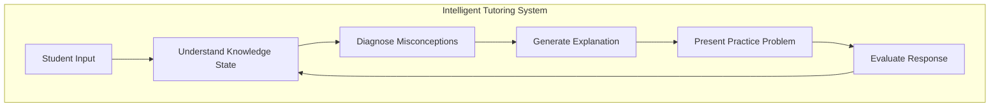

# The 2026 AI Metromap: AI in Education – Personalized Learning and Training

## Series E: Applied AI & Agents Line | Story 15 of 15+


## 📖 Introduction

**Welcome to the fifteenth and final stop on the Applied AI & Agents Line.**

You've come a long way on this journey. From prompt engineering to RAG, from AI agents to voice assistants, from computer vision to image generation, from NLP to time series, from recommendation systems to healthcare, finance, gaming, manufacturing, and social good. You've built applications across every domain. Your toolkit is complete.

Now let's explore one of the most important applications of AI: **education**.

Education is the foundation of human progress. It's how knowledge passes from generation to generation. It's how skills are built, minds are expanded, and potential is unlocked. But traditional education is one-size-fits-all. Every student learns the same material at the same pace, regardless of their background, interests, or learning style.

AI changes that. AI can create personalized learning experiences that adapt to each student. Intelligent tutoring systems can provide one-on-one guidance at scale. Automated grading frees teachers to focus on teaching. Adaptive learning paths ensure every student masters concepts before moving on. And with generative AI, we can create personalized content, exercises, and explanations for every learner.

This story—**The 2026 AI Metromap: AI in Education – Personalized Learning and Training**—is your guide to building AI that transforms how people learn. We'll implement intelligent tutoring systems that guide students step by step. We'll build automated grading systems that provide instant feedback. We'll create personalized content recommendation engines. And we'll develop adaptive learning paths that adjust to each student's pace and understanding.

**Let's transform education.**

---

## 📚 Where You Are in the Journey

### The Master Story Arc: The 2026 AI Metromap Series (Complete)

- 🗺️ **[The 2026 AI Metromap: Why the Old Learning Routes Are Obsolete](#)** – A paradigm shift from linear learning to transit-system mastery.
- 🧭 **[The 2026 AI Metromap: Reading the Map](#)** – Strategic navigation across the three core lines.
- 🎒 **[The 2026 AI Metromap: Avoiding Derailments](#)** – Diagnosing and preventing the most common learning pitfalls.
- 🏁 **[The 2026 AI Metromap: From Passenger to Driver](#)** – Building your portfolio using the Metromap structure.

### Series A: Foundations Station (Complete)
### Series B: Supervised Learning Line (Complete)
### Series C: Modern Architecture Line (Complete)
### Series D: Engineering & Optimization Yard (Complete)

### Series E: Applied AI & Agents Line (15+ Stories – Complete)

- 💬 **[The 2026 AI Metromap: Prompt Engineering 101 – The Art of Talking to AI](#)**
- 📚 **[The 2026 AI Metromap: RAG – Retrieval-Augmented Generation for Knowledge-Intensive Tasks](#)**
- 🤖 **[The 2026 AI Metromap: AI Agents & Autonomous Workflows – The Self-Driving Trains](#)**
- 🗣️ **[The 2026 AI Metromap: Voice Assistants & Speech Models – Making AI Talk](#)**
- 👁️ **[The 2026 AI Metromap: Computer Vision Projects – From OCR to Face Recognition](#)**
- 🎨 **[The 2026 AI Metromap: Image Generation & Editing – Diffusion Models in Practice](#)**
- 🔤 **[The 2026 AI Metromap: NLP Tasks – NER, Translation, Summarization, and Beyond](#)**
- 📈 **[The 2026 AI Metromap: Time Series Forecasting – ARIMA, LSTM, and Transformers](#)**
- 👍 **[The 2026 AI Metromap: Recommendation Systems – From Collaborative Filtering to Two-Tower Networks](#)**
- 🏥 **[The 2026 AI Metromap: AI in Healthcare – Medical Research, Diagnostics, and Wellness](#)**
- 💰 **[The 2026 AI Metromap: AI in Finance – Banking, Insurance, and Trading](#)**
- 🎮 **[The 2026 AI Metromap: AI in Gaming, VR/AR, and Entertainment](#)**
- 🏭 **[The 2026 AI Metromap: AI in Robotics, Manufacturing, and Supply Chain](#)**
- 🌱 **[The 2026 AI Metromap: AI for Social Good – Climate Action, Agriculture, and Sustainability](#)**
- 🎓 **The 2026 AI Metromap: AI in Education – Personalized Learning and Training** – Intelligent tutoring systems; automated grading; personalized content recommendation; adaptive learning paths. **⬅️ YOU ARE HERE**

### The Complete Story Catalog

For a complete view of all 39+ stories across all series, visit the **[Complete 2026 AI Metromap Story Catalog](#)**.

---

## 🧠 Intelligent Tutoring Systems: One-on-One at Scale

Intelligent tutoring systems provide personalized guidance, feedback, and explanations.



```python
def intelligent_tutoring():
    """Implement AI-powered intelligent tutoring systems"""
    
    print("="*60)
    print("INTELLIGENT TUTORING SYSTEMS")
    print("="*60)
    
    print("""
    import openai
    import numpy as np
    from sklearn.ensemble import RandomForestClassifier
    
    # 1. Knowledge tracing (Bayesian Knowledge Tracing)
    class KnowledgeTracer:
        \"\"\"Track student knowledge over time\"\"\"
        
        def __init__(self, num_concepts):
            self.num_concepts = num_concepts
            self.mastery_prob = np.ones(num_concepts) * 0.1  # Initial probability
            self.guess_prob = 0.25
            self.slip_prob = 0.1
            self.learn_rate = 0.3
        
        def update(self, concept_id, correct):
            \"\"\"Update mastery probability based on response\"\"\"
            p_old = self.mastery_prob[concept_id]
            
            # Probability of correct given mastery
            p_correct_given_mastery = 1 - self.slip_prob
            
            # Probability of correct given not mastered
            p_correct_given_not = self.guess_prob
            
            # Bayes update
            if correct:
                p_new = (p_correct_given_mastery * p_old) / (
                    p_correct_given_mastery * p_old + 
                    p_correct_given_not * (1 - p_old)
                )
            else:
                p_new = ((1 - p_correct_given_mastery) * p_old) / (
                    (1 - p_correct_given_mastery) * p_old + 
                    (1 - p_correct_given_not) * (1 - p_old)
                )
            
            # Add learning (if correct, increase mastery)
            if correct:
                p_new = p_new + self.learn_rate * (1 - p_new)
            
            self.mastery_prob[concept_id] = p_new
            return p_new
    
    # 2. Deep Knowledge Tracing (LSTM-based)
    class DeepKnowledgeTracer(nn.Module):
        \"\"\"LSTM for tracking student knowledge\"\"\"
        
        def __init__(self, num_concepts, hidden_dim=128):
            super().__init__()
            self.num_concepts = num_concepts
            self.lstm = nn.LSTM(num_concepts * 2, hidden_dim, batch_first=True)
            self.fc = nn.Linear(hidden_dim, num_concepts)
        
        def forward(self, interactions):
            # interactions: (batch, seq_len, num_concepts*2)
            # One-hot of concept + correct/incorrect
            lstm_out, _ = self.lstm(interactions)
            return torch.sigmoid(self.fc(lstm_out))
    
    # 3. Intelligent tutoring agent
    class IntelligentTutor:
        \"\"\"AI-powered tutor that adapts to student\"\"\"
        
        def __init__(self, subject, curriculum):
            self.subject = subject
            self.curriculum = curriculum
            self.knowledge_tracer = KnowledgeTracer(len(curriculum.concepts))
            self.student_model = {}
            self.conversation_history = []
        
        def generate_question(self, concept_id):
            \"\"\"Generate a practice question\"\"\"
            concept = self.curriculum.concepts[concept_id]
            mastery = self.knowledge_tracer.mastery_prob[concept_id]
            
            # Adjust difficulty based on mastery
            if mastery < 0.3:
                difficulty = "easy"
            elif mastery < 0.7:
                difficulty = "medium"
            else:
                difficulty = "hard"
            
            prompt = f\"\"\"
            Generate a {difficulty} practice question for {self.subject}:
            Concept: {concept.name}
            Description: {concept.description}
            
            Include:
            - Question
            - Answer choices (if multiple choice)
            - Correct answer
            - Explanation
            \"\"\"
            
            response = openai.ChatCompletion.create(
                model="gpt-4",
                messages=[{"role": "user", "content": prompt}]
            )
            
            return self._parse_question(response)
        
        def evaluate_response(self, question, student_answer):
            \"\"\"Evaluate student response and provide feedback\"\"\"
            prompt = f\"\"\"
            Evaluate this student's answer:
            
            Question: {question['text']}
            Correct answer: {question['correct_answer']}
            Student answer: {student_answer}
            
            Provide:
            1. Whether correct (true/false)
            2. Explanation of why
            3. Hints if incorrect
            4. Follow-up question if needed
            \"\"\"
            
            response = openai.ChatCompletion.create(
                model="gpt-4",
                messages=[{"role": "user", "content": prompt}]
            )
            
            evaluation = self._parse_evaluation(response)
            
            # Update knowledge tracing
            self.knowledge_tracer.update(question['concept_id'], evaluation['correct'])
            
            return evaluation
        
        def explain_concept(self, concept_id):
            \"\"\"Generate personalized explanation\"\"\"
            concept = self.curriculum.concepts[concept_id]
            mastery = self.knowledge_tracer.mastery_prob[concept_id]
            
            prompt = f\"\"\"
            Explain {concept.name} to a student who currently understands it at {mastery*100:.0f}% mastery.
            
            Use:
            - Simple language
            - Real-world examples
            - Visual descriptions
            - Connect to previous concepts they've learned
            
            Concept details: {concept.description}
            \"\"\"
            
            response = openai.ChatCompletion.create(
                model="gpt-4",
                messages=[{"role": "user", "content": prompt}]
            )
            
            return response.choices[0].message.content
        
        def generate_learning_path(self):
            \"\"\"Generate personalized learning path\"\"\"
            # Identify concepts below mastery threshold
            weak_concepts = []
            for i, mastery in enumerate(self.knowledge_tracer.mastery_prob):
                if mastery < 0.7:
                    weak_concepts.append(self.curriculum.concepts[i])
            
            # Order by prerequisites
            learning_path = self._order_by_prerequisites(weak_concepts)
            
            return {
                'next_concepts': learning_path[:3],
                'estimated_time': self._estimate_time(learning_path),
                'prerequisites': self._get_prerequisites(learning_path[0])
            }
    """)
    
    print("\n" + "="*60)
    print("TUTORING SYSTEM COMPONENTS")
    print("="*60)
    
    components = [
        ("Knowledge Tracing", "Track student mastery", "Bayesian, Deep Learning"),
        ("Question Generation", "Create practice problems", "LLMs, templates"),
        ("Response Evaluation", "Grade and give feedback", "NLP, LLMs"),
        ("Concept Explanation", "Personalized teaching", "LLMs, RAG"),
        ("Learning Path", "Adaptive curriculum", "Prerequisite graphs")
    ]
    
    print(f"\n{'Component':<20} {'Function':<20} {'Techniques':<25}")
    print("-"*70)
    for comp, func, tech in components:
        print(f"{comp:<20} {func:<20} {tech:<25}")

intelligent_tutoring()
```

---

## 📝 Automated Grading: Instant Feedback at Scale

Automated grading provides immediate feedback and reduces teacher workload.

```python
def automated_grading():
    """Implement AI-powered automated grading"""
    
    print("="*60)
    print("AUTOMATED GRADING")
    print("="*60)
    
    print("""
    import torch
    import torch.nn as nn
    from transformers import AutoTokenizer, AutoModel
    import numpy as np
    
    # 1. Essay scoring (AES)
    class EssayScorer(nn.Module):
        \"\"\"BERT-based essay scoring\"\"\"
        
        def __init__(self, max_score=6):
            super().__init__()
            self.bert = AutoModel.from_pretrained('bert-base-uncased')
            self.fc = nn.Linear(768, max_score + 1)
        
        def score(self, essay):
            \"\"\"Score essay on rubric\"\"\"
            inputs = self.tokenizer(essay, return_tensors='pt', truncation=True, max_length=512)
            outputs = self.bert(**inputs)
            pooled = outputs.pooler_output
            scores = torch.softmax(self.fc(pooled), dim=1)
            
            return {
                'score': torch.argmax(scores).item(),
                'confidence': torch.max(scores).item(),
                'score_distribution': scores.detach().numpy()[0]
            }
    
    # 2. Rubric-based grading
    class RubricGrader:
        \"\"\"Grade based on custom rubric\"\"\"
        
        def __init__(self, rubric):
            self.rubric = rubric
            self.criteria_weights = {c['name']: c['weight'] for c in rubric['criteria']}
        
        def grade(self, submission):
            \"\"\"Grade submission against rubric\"\"\"
            scores = {}
            feedback = []
            
            for criterion in self.rubric['criteria']:
                # Evaluate each criterion
                score = self._evaluate_criterion(submission, criterion)
                scores[criterion['name']] = score
                
                # Generate feedback
                if score < criterion['max_score']:
                    feedback.append(self._generate_feedback(criterion, score))
            
            # Calculate total score
            total_score = sum(
                scores[c['name']] * c['weight'] 
                for c in self.rubric['criteria']
            )
            
            return {
                'total_score': total_score,
                'criteria_scores': scores,
                'feedback': feedback,
                'max_score': self.rubric['max_score']
            }
        
        def _evaluate_criterion(self, submission, criterion):
            \"\"\"Evaluate single criterion using LLM\"\"\"
            prompt = f\"\"\"
            Evaluate this submission for criterion: {criterion['name']}
            
            Criterion description: {criterion['description']}
            Scoring guide: {criterion['scoring_guide']}
            Max score: {criterion['max_score']}
            
            Submission: {submission}
            
            Provide:
            - Score (0-{criterion['max_score']})
            - Brief justification
            \"\"\"
            
            response = openai.ChatCompletion.create(
                model="gpt-4",
                messages=[{"role": "user", "content": prompt}]
            )
            
            return self._parse_score(response)
    
    # 3. Code grading
    class CodeGrader:
        \"\"\"Grade programming assignments\"\"\"
        
        def __init__(self, test_cases):
            self.test_cases = test_cases
        
        def grade(self, code):
            \"\"\"Run code against test cases\"\"\"
            results = []
            
            for test in self.test_cases:
                try:
                    # Execute code with test input (in sandbox)
                    output = self._execute_safely(code, test['input'])
                    correct = output == test['expected_output']
                    
                    results.append({
                        'test_name': test['name'],
                        'passed': correct,
                        'output': output,
                        'expected': test['expected_output']
                    })
                except Exception as e:
                    results.append({
                        'test_name': test['name'],
                        'passed': False,
                        'error': str(e)
                    })
            
            # Calculate score
            passed = sum(1 for r in results if r['passed'])
            score = passed / len(self.test_cases) * 100
            
            # Generate feedback
            feedback = self._generate_feedback(results, code)
            
            return {
                'score': score,
                'results': results,
                'feedback': feedback,
                'suggestions': self._suggest_improvements(code, results)
            }
    
    # 4. Multiple choice grading
    class MCQGrader:
        \"\"\"Grade multiple choice questions\"\"\"
        
        def __init__(self, answer_key):
            self.answer_key = answer_key
        
        def grade(self, answers):
            \"\"\"Grade multiple choice responses\"\"\"
            results = []
            score = 0
            
            for i, (question_id, student_answer) in enumerate(answers.items()):
                correct = student_answer == self.answer_key[question_id]
                if correct:
                    score += 1
                
                results.append({
                    'question_id': question_id,
                    'correct': correct,
                    'student_answer': student_answer,
                    'correct_answer': self.answer_key[question_id],
                    'explanation': self._generate_explanation(question_id, correct)
                })
            
            return {
                'score': score,
                'total': len(answers),
                'percentage': score / len(answers) * 100,
                'detailed_results': results,
                'weak_areas': self._identify_weak_areas(results)
            }
    
    # 5. Feedback generation
    class FeedbackGenerator:
        \"\"\"Generate personalized feedback\"\"\"
        
        def __init__(self):
            self.templates = self._load_templates()
        
        def generate(self, grading_result, student_profile):
            \"\"\"Generate personalized feedback\"\"\"
            prompt = f\"\"\"
            Generate personalized feedback for a student:
            
            Student level: {student_profile['level']}
            Previous performance: {student_profile['recent_scores']}
            Current grading: {grading_result}
            
            Include:
            1. Positive reinforcement
            2. Areas for improvement
            3. Specific suggestions
            4. Resources to review
            5. Next steps
            \"\"\"
            
            response = openai.ChatCompletion.create(
                model="gpt-4",
                messages=[{"role": "user", "content": prompt}]
            )
            
            return {
                'feedback_text': response.choices[0].message.content,
                'action_items': self._extract_actions(response),
                'recommended_resources': self._suggest_resources(grading_result)
            }
    """)
    
    print("\n" + "="*60)
    print("GRADING APPLICATIONS")
    print("="*60)
    
    applications = [
        ("Essay Scoring", "Automated essay grading", "Efficiency, consistency"),
        ("Rubric Grading", "Custom rubric evaluation", "Flexible assessment"),
        ("Code Grading", "Programming assignments", "Immediate feedback"),
        ("MCQ Grading", "Multiple choice tests", "Speed, analytics"),
        ("Feedback Generation", "Personalized comments", "Student growth")
    ]
    
    print(f"\n{'Application':<20} {'Description':<25} {'Benefit':<25}")
    print("-"*75)
    for app, desc, benefit in applications:
        print(f"{app:<20} {desc:<25} {benefit:<25}")

automated_grading()
```

---

## 🎯 Personalized Content Recommendation

AI recommends learning content tailored to each student's needs and interests.

```python
def personalized_content():
    """Implement personalized content recommendation"""
    
    print("="*60)
    print("PERSONALIZED CONTENT RECOMMENDATION")
    print("="*60)
    
    print("""
    import numpy as np
    from sklearn.metrics.pairwise import cosine_similarity
    from sentence_transformers import SentenceTransformer
    
    # 1. Content-based recommendation
    class ContentRecommender:
        \"\"\"Recommend content based on student interests\"\"\"
        
        def __init__(self):
            self.encoder = SentenceTransformer('all-MiniLM-L6-v2')
            self.content_embeddings = []
            self.content_metadata = []
        
        def add_content(self, content_items):
            \"\"\"Add content to library\"\"\"
            for item in content_items:
                # Encode content
                text = item['title'] + " " + item['description']
                embedding = self.encoder.encode([text])[0]
                
                self.content_embeddings.append(embedding)
                self.content_metadata.append(item)
        
        def recommend(self, student_profile, top_k=5):
            \"\"\"Recommend content based on student profile\"\"\"
            # Create student query from profile
            query_text = self._profile_to_text(student_profile)
            query_embedding = self.encoder.encode([query_text])[0]
            
            # Compute similarities
            similarities = cosine_similarity([query_embedding], self.content_embeddings)[0]
            
            # Filter by reading level
            filtered = []
            for i, score in enumerate(similarities):
                level_match = self._check_level(self.content_metadata[i], student_profile['reading_level'])
                if level_match:
                    filtered.append((i, score))
            
            # Sort and return top-k
            filtered.sort(key=lambda x: x[1], reverse=True)
            recommendations = []
            
            for idx, score in filtered[:top_k]:
                recommendations.append({
                    'content': self.content_metadata[idx],
                    'score': score,
                    'reason': self._generate_reason(student_profile, self.content_metadata[idx])
                })
            
            return recommendations
    
    # 2. Collaborative filtering for learners
    class CollaborativeLearner:
        \"\"\"Recommend based on similar learners\"\"\"
        
        def __init__(self):
            self.user_item_matrix = None
            self.user_similarity = None
        
        def build_model(self, interactions):
            \"\"\"Build user-item interaction matrix\"\"\"
            # interactions: (user_id, item_id, rating)
            self.user_item_matrix = self._create_matrix(interactions)
            
            # Compute user similarity
            self.user_similarity = cosine_similarity(self.user_item_matrix)
        
        def recommend(self, user_id, top_k=5):
            \"\"\"Recommend items based on similar users\"\"\"
            user_idx = self._get_user_index(user_id)
            
            # Get similar users
            similar_users = np.argsort(self.user_similarity[user_idx])[::-1][1:20]
            
            # Aggregate recommendations
            recommendations = {}
            for sim_user in similar_users:
                user_items = self.user_item_matrix[sim_user]
                for item_idx, rating in enumerate(user_items):
                    if rating > 0 and self.user_item_matrix[user_idx, item_idx] == 0:
                        recommendations[item_idx] = recommendations.get(item_idx, 0) + rating
            
            # Sort and return
            top_items = sorted(recommendations.items(), key=lambda x: x[1], reverse=True)[:top_k]
            
            return [self._get_item_metadata(item_idx) for item_idx, _ in top_items]
    
    # 3. Adaptive learning path
    class AdaptivePath:
        \"\"\"Generate adaptive learning paths\"\"\"
        
        def __init__(self, curriculum_graph):
            self.curriculum = curriculum_graph  # Directed graph of concepts
        
        def generate_path(self, start_concept, target_concept, student_mastery):
            \"\"\"Generate optimal learning path\"\"\"
            # Find shortest path in curriculum graph
            path = self._find_shortest_path(start_concept, target_concept)
            
            # Adapt based on mastery
            adapted_path = []
            for concept in path:
                if student_mastery.get(concept, 0) < 0.8:
                    adapted_path.append(concept)
                else:
                    # Skip mastered concepts
                    continue
            
            # Add remediation for weak concepts
            weak_concepts = self._identify_weak_concepts(student_mastery)
            remediation = self._generate_remediation(weak_concepts)
            
            return {
                'path': adapted_path,
                'remediation': remediation,
                'estimated_time': self._estimate_time(adapted_path),
                'prerequisites': self._get_prerequisites(adapted_path[0])
            }
    
    # 4. Spaced repetition system
    class SpacedRepetition:
        \"\"\"Optimize review timing with spaced repetition\"\"\"
        
        def __init__(self):
            self.memory_strength = {}  # Concept -> strength (0-1)
            self.next_review = {}  # Concept -> next review date
        
        def update(self, concept_id, recall_success):
            \"\"\"Update memory strength based on recall\"\"\"
            current_strength = self.memory_strength.get(concept_id, 0.5)
            
            # SM-2 algorithm
            if recall_success:
                # Increase strength
                new_strength = min(1.0, current_strength + 0.1)
                interval = self._calculate_interval(new_strength)
            else:
                # Decrease strength
                new_strength = max(0.0, current_strength - 0.2)
                interval = 1  # Review tomorrow
            
            self.memory_strength[concept_id] = new_strength
            self.next_review[concept_id] = datetime.now() + timedelta(days=interval)
            
            return new_strength
        
        def get_due_reviews(self, date):
            \"\"\"Get concepts due for review\"\"\"
            due = []
            for concept_id, review_date in self.next_review.items():
                if review_date <= date:
                    due.append({
                        'concept_id': concept_id,
                        'strength': self.memory_strength[concept_id],
                        'days_overdue': (date - review_date).days
                    })
            
            # Prioritize by strength (weakest first)
            due.sort(key=lambda x: x['strength'])
            return due
    """)
    
    print("\n" + "="*60)
    print("RECOMMENDATION APPROACHES")
    print("="*60)
    
    approaches = [
        ("Content-Based", "Match content to student interests", "Initial recommendations"),
        ("Collaborative", "Find similar learners", "Diverse recommendations"),
        ("Adaptive Paths", "Optimize learning sequence", "Personalized curricula"),
        ("Spaced Repetition", "Optimize review timing", "Long-term retention")
    ]
    
    print(f"\n{'Approach':<20} {'Method':<25} {'Use Case':<25}")
    print("-"*75)
    for app, method, use in approaches:
        print(f"{app:<20} {method:<25} {use:<25}")

personalized_content()
```

---

## 🎓 Complete Education AI Platform

```python
def education_platform():
    """Complete AI-powered education platform"""
    
    print("="*60)
    print("COMPLETE EDUCATION AI PLATFORM")
    print("="*60)
    
    print("""
    class EducationAI:
        \"\"\"Complete AI-powered learning platform\"\"\"
        
        def __init__(self):
            self.tutor = IntelligentTutor()
            self.grader = AutomatedGrader()
            self.recommender = ContentRecommender()
            self.adaptive_path = AdaptivePath()
            self.spaced_repetition = SpacedRepetition()
            self.student_profiles = {}
        
        def onboard_student(self, student_id, initial_assessment):
            \"\"\"Create student profile\"\"\"
            self.student_profiles[student_id] = {
                'id': student_id,
                'level': initial_assessment['level'],
                'interests': initial_assessment['interests'],
                'learning_style': initial_assessment['learning_style'],
                'mastery': {},
                'history': [],
                'preferences': {}
            }
            
            # Initial knowledge tracing
            for concept in initial_assessment['concepts']:
                self.student_profiles[student_id]['mastery'][concept] = 0.1
            
            return {'status': 'onboarded', 'profile': self.student_profiles[student_id]}
        
        def get_personalized_lesson(self, student_id):
            \"\"\"Get next lesson based on student state\"\"\"
            profile = self.student_profiles[student_id]
            
            # Generate learning path
            path = self.adaptive_path.generate_path(
                profile['current_concept'],
                profile['target_concept'],
                profile['mastery']
            )
            
            # Get next concept
            next_concept = path['path'][0]
            
            # Generate explanation
            explanation = self.tutor.explain_concept(next_concept, profile['level'])
            
            # Generate practice questions
            questions = self.tutor.generate_questions(next_concept, profile['mastery'][next_concept])
            
            # Recommend additional resources
            resources = self.recommender.recommend({
                'concept': next_concept,
                'level': profile['level'],
                'interests': profile['interests']
            })
            
            return {
                'concept': next_concept,
                'explanation': explanation,
                'questions': questions,
                'resources': resources,
                'path_progress': len(path['path']),
                'estimated_time': path['estimated_time']
            }
        
        def submit_answer(self, student_id, question_id, answer):
            \"\"\"Process student answer\"\"\"
            profile = self.student_profiles[student_id]
            
            # Grade answer
            grading = self.grader.grade(question_id, answer)
            
            # Update knowledge tracing
            concept_id = grading['concept_id']
            new_mastery = self.tutor.update_mastery(
                concept_id,
                grading['correct'],
                profile['mastery'][concept_id]
            )
            profile['mastery'][concept_id] = new_mastery
            
            # Update spaced repetition
            self.spaced_repetition.update(concept_id, grading['correct'])
            
            # Record history
            profile['history'].append({
                'timestamp': datetime.now(),
                'question_id': question_id,
                'correct': grading['correct'],
                'mastery_after': new_mastery
            })
            
            # Generate feedback
            feedback = self.grader.generate_feedback(grading, profile['level'])
            
            # Determine next action
            if new_mastery > 0.8:
                next_action = 'advance'
            elif grading['correct']:
                next_action = 'practice_more'
            else:
                next_action = 'remediate'
            
            return {
                'correct': grading['correct'],
                'feedback': feedback,
                'new_mastery': new_mastery,
                'next_action': next_action,
                'suggested_review': self.spaced_repetition.get_next_review(concept_id)
            }
        
        def generate_study_plan(self, student_id, days=30):
            \"\"\"Generate personalized study plan\"\"\"
            profile = self.student_profiles[student_id]
            
            # Get due reviews
            due_reviews = self.spaced_repetition.get_due_reviews(datetime.now())
            
            # Get concepts to learn
            to_learn = [
                concept for concept, mastery in profile['mastery'].items()
                if mastery < 0.7
            ]
            
            # Create daily schedule
            schedule = []
            for day in range(days):
                day_plan = {
                    'day': day + 1,
                    'reviews': [],
                    'new_concepts': [],
                    'practice': []
                }
                
                # Add reviews
                for review in due_reviews[:3]:
                    day_plan['reviews'].append(review)
                    due_reviews.remove(review)
                
                # Add new concept every 3 days
                if day % 3 == 0 and to_learn:
                    day_plan['new_concepts'].append(to_learn.pop(0))
                
                schedule.append(day_plan)
            
            return {
                'schedule': schedule,
                'total_new_concepts': len(to_learn),
                'total_reviews': len(due_reviews),
                'estimated_hours': days * 2
            }
        
        def get_learning_analytics(self, student_id):
            \"\"\"Generate learning analytics dashboard\"\"\"
            profile = self.student_profiles[student_id]
            
            # Calculate metrics
            metrics = {
                'overall_mastery': np.mean(list(profile['mastery'].values())),
                'strongest_concepts': self._get_top_concepts(profile['mastery'], 5),
                'weakest_concepts': self._get_bottom_concepts(profile['mastery'], 5),
                'learning_rate': self._calculate_learning_rate(profile['history']),
                'time_spent': self._total_time(profile['history']),
                'accuracy': self._calculate_accuracy(profile['history']),
                'streak': self._current_streak(profile['history'])
            }
            
            # Generate recommendations
            recommendations = []
            if metrics['weakest_concepts']:
                recommendations.append(f"Review {metrics['weakest_concepts'][0]['name']}")
            if metrics['accuracy'] < 0.7:
                recommendations.append("Practice more before advancing")
            if metrics['streak'] > 7:
                recommendations.append("Great progress! Consider increasing difficulty")
            
            return {
                'metrics': metrics,
                'recommendations': recommendations,
                'progress_chart': self._generate_progress_chart(profile['history']),
                'next_milestone': self._get_next_milestone(metrics)
            }
        
        def predict_student_risk(self, student_id):
            \"\"\"Predict students at risk of falling behind\"\"\"
            profile = self.student_profiles[student_id]
            
            risk_factors = {
                'low_engagement': self._engagement_score(profile) < 0.3,
                'low_mastery': np.mean(list(profile['mastery'].values())) < 0.4,
                'negative_trend': self._performance_trend(profile['history']) < 0,
                'missed_reviews': self._missed_review_rate(profile) > 0.5
            }
            
            risk_score = sum(risk_factors.values()) / len(risk_factors)
            
            if risk_score > 0.5:
                return {
                    'risk_level': 'HIGH',
                    'risk_score': risk_score,
                    'factors': risk_factors,
                    'intervention': self._generate_intervention(risk_factors)
                }
            
            return {
                'risk_level': 'LOW',
                'risk_score': risk_score,
                'factors': risk_factors
            }
    """)
    
    print("\n" + "="*60)
    print("EDUCATION PLATFORM FEATURES")
    print("="*60)
    
    features = [
        ("Personalized Tutoring", "AI tutor adapts to student", "Mastery-based learning"),
        ("Automated Grading", "Instant feedback", "Teacher efficiency"),
        ("Content Recommendation", "Personalized resources", "Engagement"),
        ("Adaptive Paths", "Optimized learning sequence", "Efficiency"),
        ("Spaced Repetition", "Optimized review timing", "Retention"),
        ("Learning Analytics", "Progress tracking", "Data-driven insights"),
        ("Risk Prediction", "Early intervention", "Student success")
    ]
    
    print(f"\n{'Feature':<22} {'Description':<30} {'Benefit':<25}")
    print("-"*80)
    for feature, desc, benefit in features:
        print(f"{feature:<22} {desc:<30} {benefit:<25}")

education_platform()
```

---

## 📊 Takeaway from This Story

**What You Learned:**

- **Intelligent Tutoring Systems** – Knowledge tracing (Bayesian, Deep), question generation with LLMs, response evaluation, concept explanation, adaptive learning paths.

- **Automated Grading** – Essay scoring with BERT, rubric-based grading, code grading with test cases, MCQ grading, personalized feedback generation.

- **Personalized Content** – Content-based recommendation with embeddings, collaborative filtering, adaptive learning paths, spaced repetition (SM-2 algorithm).

- **Complete Platform** – Student onboarding, personalized lessons, answer processing, study plan generation, learning analytics, risk prediction.

- **Educational AI Impact** – One-on-one tutoring at scale, immediate feedback, personalized learning, reduced teacher workload, improved student outcomes.

---

## 🔗 Navigation

- **⬅️ Previous Story:** [The 2026 AI Metromap: AI for Social Good – Climate Action, Agriculture, and Sustainability](#)

- **📚 Series E Catalog:** [Series E: Applied AI & Agents Line](#) – View all 15+ stories in this series.

- **📚 Complete Story Catalog:** [Complete 2026 AI Metromap Story Catalog](#) – Your navigation guide to all 39+ stories.

- **🏁 Journey Complete:** You've reached the final stop on the Applied AI & Agents Line. Congratulations on completing the entire 2026 AI Metromap journey!

---

## 📝 Your Invitation

You've reached the end of the Applied AI & Agents Line—and the entire 2026 AI Metromap journey. You've mastered foundations, supervised learning, modern architectures, engineering, and applied AI across every domain.

Before you go:

1. **Build an intelligent tutor** – Create a simple tutoring system for a subject you know well. Use LLMs to generate questions and explanations.

2. **Create an automated grader** – Build a rubric-based grader for student submissions. Provide personalized feedback.

3. **Implement spaced repetition** – Build a flashcard system that schedules reviews based on recall success.

4. **Design a personalized learning path** – Map out prerequisite relationships. Generate adaptive sequences.

5. **Launch your education platform** – Combine all components into a prototype. Test with real students.

---

**Congratulations! You've completed the 2026 AI Metromap.**

You started at Foundations Station, mastered the Supervised Learning Line, rode the Modern Architecture express train, passed through the Engineering & Optimization Yard, and explored every stop on the Applied AI & Agents Line. You've built applications across text, vision, voice, agents, healthcare, finance, gaming, manufacturing, social good, and education.

You're no longer a passenger on the AI journey. You're a driver.

Now go build something amazing. The tracks are yours to lay.

---

*Thank you for riding the 2026 AI Metromap. Your journey continues—where will you go next?* 🚇