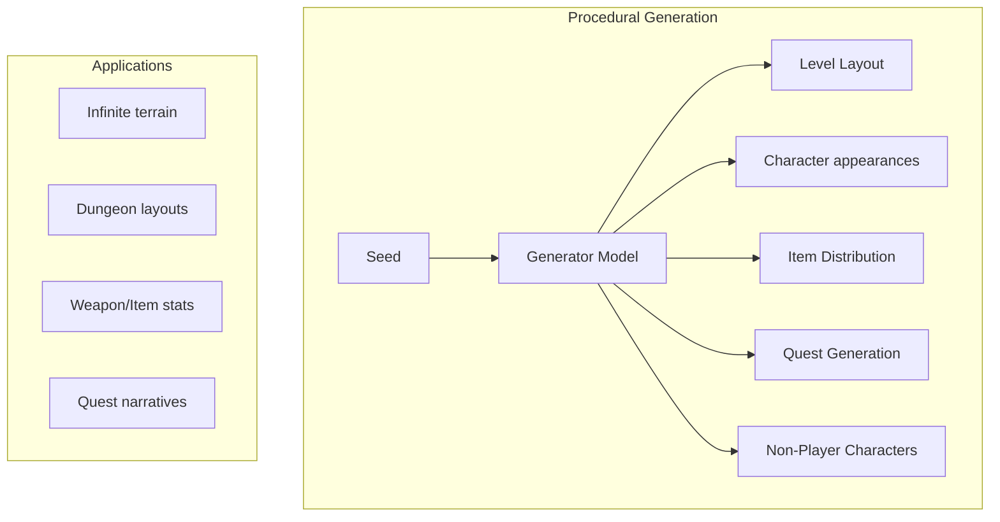

# The 2026 AI Metromap: AI in Gaming, VR/AR, and Entertainment

## Series E: Applied AI & Agents Line | Story 12 of 15+

---

## 📖 Introduction

**Welcome to the twelfth stop on the Applied AI & Agents Line.**

In our last two stories, we explored AI in healthcare and finance—domains where precision, compliance, and high stakes dominate. You've seen how AI can save lives and move billions of dollars.

Now let's turn to a domain where the stakes are different but the impact is no less profound: **gaming and entertainment**.

The gaming industry is now larger than movies and music combined. And AI is revolutionizing how games are created, played, and experienced. From procedurally generated worlds that are infinite and unique, to NPCs that converse like humans, to AI-driven storytelling that adapts to your choices—AI is transforming entertainment.

But gaming AI isn't just about making games. It's about creating immersive experiences, believable characters, and worlds that feel alive. It's about understanding player behavior, balancing difficulty, and generating content that never runs out. And with VR/AR, AI is creating entirely new forms of entertainment that blend the digital and physical worlds.

This story—**The 2026 AI Metromap: AI in Gaming, VR/AR, and Entertainment**—is your guide to building AI-powered games and experiences. We'll implement procedural content generation—creating infinite worlds, levels, and items. We'll build intelligent NPCs—characters that talk, remember, and react. We'll create adaptive difficulty systems that learn from player skill. And we'll explore AI in VR/AR—from gesture recognition to immersive storytelling.

**Let's level up.**

---

## 📚 Where You Are in the Journey

### The Master Story Arc: The 2026 AI Metromap Series (Complete)

- 🗺️ **[The 2026 AI Metromap: Why the Old Learning Routes Are Obsolete](#)** – A paradigm shift from linear learning to transit-system mastery.
- 🧭 **[The 2026 AI Metromap: Reading the Map](#)** – Strategic navigation across the three core lines.
- 🎒 **[The 2026 AI Metromap: Avoiding Derailments](#)** – Diagnosing and preventing the most common learning pitfalls.
- 🏁 **[The 2026 AI Metromap: From Passenger to Driver](#)** – Building your portfolio using the Metromap structure.

### Series A: Foundations Station (Complete)
### Series B: Supervised Learning Line (Complete)
### Series C: Modern Architecture Line (Complete)
### Series D: Engineering & Optimization Yard (Complete)

### Series E: Applied AI & Agents Line (15+ Stories)

- 💬 **[The 2026 AI Metromap: Prompt Engineering 101 – The Art of Talking to AI](#)**
- 📚 **[The 2026 AI Metromap: RAG – Retrieval-Augmented Generation for Knowledge-Intensive Tasks](#)**
- 🤖 **[The 2026 AI Metromap: AI Agents & Autonomous Workflows – The Self-Driving Trains](#)**
- 🗣️ **[The 2026 AI Metromap: Voice Assistants & Speech Models – Making AI Talk](#)**
- 👁️ **[The 2026 AI Metromap: Computer Vision Projects – From OCR to Face Recognition](#)**
- 🎨 **[The 2026 AI Metromap: Image Generation & Editing – Diffusion Models in Practice](#)**
- 🔤 **[The 2026 AI Metromap: NLP Tasks – NER, Translation, Summarization, and Beyond](#)**
- 📈 **[The 2026 AI Metromap: Time Series Forecasting – ARIMA, LSTM, and Transformers](#)**
- 👍 **[The 2026 AI Metromap: Recommendation Systems – From Collaborative Filtering to Two-Tower Networks](#)**
- 🏥 **[The 2026 AI Metromap: AI in Healthcare – Medical Research, Diagnostics, and Wellness](#)**
- 💰 **[The 2026 AI Metromap: AI in Finance – Banking, Insurance, and Trading](#)**
- 🎮 **The 2026 AI Metromap: AI in Gaming, VR/AR, and Entertainment** – Procedural content generation; NPC behavior with LLMs; AI-driven storytelling; game testing automation. **⬅️ YOU ARE HERE**

- 🏭 **[The 2026 AI Metromap: AI in Robotics, Manufacturing, and Supply Chain](#)** – Computer vision for quality control; predictive maintenance; autonomous navigation; warehouse optimization. 🔜 *Up Next*

- 🌱 **[The 2026 AI Metromap: AI for Social Good – Climate Action, Agriculture, and Sustainability](#)** – Crop yield prediction; climate modeling; energy optimization; wildlife conservation; disaster response.

- 🎓 **[The 2026 AI Metromap: AI in Education – Personalized Learning and Training](#)** – Intelligent tutoring systems; automated grading; personalized content recommendation; adaptive learning paths.

### The Complete Story Catalog

For a complete view of all upcoming stories across every series, visit the **[Complete 2026 AI Metromap Story Catalog](#)**.

---

## 🌍 Procedural Content Generation: Infinite Worlds

Procedural content generation (PCG) uses AI to create game content automatically—levels, maps, items, quests, and even entire worlds.



```python
def procedural_generation():
    """Implement AI-driven procedural content generation"""
    
    print("="*60)
    print("PROCEDURAL CONTENT GENERATION")
    print("="*60)
    
    print("""
    import numpy as np
    import torch
    import torch.nn as nn
    from noise import pnoise2  # Perlin noise for terrain
    
    # 1. Terrain generation with Perlin noise
    class TerrainGenerator:
        \"\"\"Generate realistic terrain using Perlin noise\"\"\"
        
        def __init__(self, width=256, height=256, scale=100.0):
            self.width = width
            self.height = height
            self.scale = scale
        
        def generate_heightmap(self, seed=42):
            \"\"\"Generate heightmap using Perlin noise\"\"\"
            heightmap = np.zeros((self.height, self.width))
            
            for y in range(self.height):
                for x in range(self.width):
                    # Multiple octaves for natural-looking terrain
                    h = 0
                    for octave in range(4):
                        freq = 2 ** octave / self.scale
                        amp = 0.5 ** octave
                        h += pnoise2(x * freq, y * freq, base=seed) * amp
                    
                    heightmap[y, x] = (h + 1) / 2  # Normalize to 0-1
            
            return heightmap
        
        def classify_terrain(self, heightmap):
            \"\"\"Convert heightmap to terrain types\"\"\"
            terrain = np.zeros_like(heightmap, dtype=int)
            
            terrain[heightmap < 0.3] = 0  # Water
            terrain[(heightmap >= 0.3) & (heightmap < 0.4)] = 1  # Sand
            terrain[(heightmap >= 0.4) & (heightmap < 0.6)] = 2  # Grass
            terrain[(heightmap >= 0.6) & (heightmap < 0.8)] = 3  # Forest
            terrain[heightmap >= 0.8] = 4  # Mountain
            
            return terrain
    
    # 2. Dungeon generation with Wave Function Collapse
    class DungeonGenerator:
        \"\"\"Generate dungeon layouts using Wave Function Collapse\"\"\"
        
        def __init__(self, tiles):
            self.tiles = tiles  # Tile patterns (rooms, corridors, walls)
            self.constraints = self._build_constraints()
        
        def generate(self, width=50, height=50):
            \"\"\"Generate dungeon layout\"\"\"
            # Initialize grid with all possibilities
            grid = [[set(range(len(self.tiles))) for _ in range(width)] for _ in range(height)]
            
            # Wave Function Collapse algorithm
            while not self._is_collapsed(grid):
                # Find cell with fewest possibilities
                cell = self._find_min_entropy_cell(grid)
                
                # Collapse to a specific tile
                tile = self._choose_tile(grid[cell[0]][cell[1]])
                grid[cell[0]][cell[1]] = {tile}
                
                # Propagate constraints
                self._propagate_constraints(grid, cell[0], cell[1])
            
            # Convert to final layout
            layout = [[list(cell)[0] for cell in row] for row in grid]
            return layout
    
    # 3. Wave Function Collapse tile patterns
    def create_dungeon_tiles():
        \"\"\"Define tile patterns for dungeon generation\"\"\"
        
        tiles = {
            'room': {
                'pattern': [[1, 1, 1], [1, 1, 1], [1, 1, 1]],
                'connections': {'up': True, 'down': True, 'left': True, 'right': True}
            },
            'corridor_h': {
                'pattern': [[0, 0, 0], [1, 1, 1], [0, 0, 0]],
                'connections': {'up': False, 'down': False, 'left': True, 'right': True}
            },
            'corridor_v': {
                'pattern': [[0, 1, 0], [0, 1, 0], [0, 1, 0]],
                'connections': {'up': True, 'down': True, 'left': False, 'right': False}
            },
            't_junction': {
                'pattern': [[0, 1, 0], [1, 1, 1], [0, 1, 0]],
                'connections': {'up': True, 'down': True, 'left': True, 'right': True}
            }
        }
        
        return tiles
    
    # 4. Weapon generation with GANs
    class WeaponGenerator:
        \"\"\"Generate balanced weapon stats using GANs\"\"\"
        
        def __init__(self, latent_dim=32, weapon_dim=8):
            self.generator = self._build_generator(latent_dim, weapon_dim)
            self.discriminator = self._build_discriminator(weapon_dim)
        
        def _build_generator(self, latent_dim, output_dim):
            return nn.Sequential(
                nn.Linear(latent_dim, 128),
                nn.ReLU(),
                nn.Linear(128, 256),
                nn.ReLU(),
                nn.Linear(256, output_dim),
                nn.Sigmoid()  # Normalize stats 0-1
            )
        
        def generate_weapon(self):
            \"\"\"Generate random weapon stats\"\"\"
            z = torch.randn(1, 32)
            stats = self.generator(z).detach().numpy()[0]
            
            return {
                'damage': stats[0] * 100,
                'speed': stats[1] * 2,
                'range': stats[2] * 50,
                'accuracy': stats[3],
                'critical_chance': stats[4],
                'mana_cost': stats[5] * 100,
                'weight': stats[6] * 20,
                'value': stats[7] * 1000
            }
    
    # 5. Quest generation with LLMs
    class QuestGenerator:
        \"\"\"Generate narrative quests using LLMs\"\"\"
        
        def __init__(self, llm):
            self.llm = llm
        
        def generate_quest(self, player_level, quest_type, location):
            \"\"\"Generate a new quest\"\"\"
            
            prompt = f\"\"\"
            Generate a {quest_type} quest for a level {player_level} player in {location}.
            
            Include:
            - Quest title
            - Quest giver
            - Objective
            - Rewards (XP and gold)
            - Optional: multiple completion paths
            
            Format as JSON.
            \"\"\"
            
            response = self.llm.generate(prompt)
            return json.loads(response)
        
        def generate_quest_chain(self, length=5):
            \"\"\"Generate a chain of connected quests\"\"\"
            quests = []
            current_story = ""
            
            for i in range(length):
                quest = self.generate_quest(
                    player_level=10 + i * 2,
                    quest_type="story",
                    location=self._get_next_location(quests)
                )
                quests.append(quest)
                current_story += quest['summary'] + "\\n"
            
            return quests
    
    # 6. Item generation with evolutionary algorithms
    class ItemGenerator:
        \"\"\"Evolve balanced item properties\"\"\"
        
        def __init__(self, population_size=100):
            self.population_size = population_size
        
        def generate_items(self, target_stats, generations=50):
            \"\"\"Generate items matching target stats\"\"\"
            
            # Initialize population
            population = [self._random_item() for _ in range(self.population_size)]
            
            for gen in range(generations):
                # Evaluate fitness
                fitness = [self._calculate_fitness(item, target_stats) for item in population]
                
                # Selection
                parents = self._tournament_selection(population, fitness)
                
                # Crossover and mutation
                new_population = []
                for i in range(0, len(parents), 2):
                    child1, child2 = self._crossover(parents[i], parents[i+1])
                    new_population.extend([self._mutate(child1), self._mutate(child2)])
                
                population = new_population[:self.population_size]
            
            # Return best item
            best_idx = np.argmax(fitness)
            return population[best_idx]
    """)
    
    print("\n" + "="*60)
    print("PCG TECHNIQUES")
    print("="*60)
    
    techniques = [
        ("Perlin Noise", "Natural terrain, textures", "Minecraft, No Man's Sky"),
        ("Wave Function Collapse", "Dungeons, puzzles", "Caves of Qud, Townscaper"),
        ("GANs", "Weapons, characters, textures", "NVIDIA GameGAN"),
        ("LLMs", "Quests, dialogue, lore", "AI Dungeon, ChatGPT mods"),
        ("Evolutionary", "Balanced items, enemy stats", "Diablo, Borderlands")
    ]
    
    print(f"\n{'Technique':<18} {'Application':<20} {'Example Games':<25}")
    print("-"*70)
    for tech, app, examples in techniques:
        print(f"{tech:<18} {app:<20} {examples:<25}")

procedural_generation()
```

---

## 🧠 Intelligent NPCs: Characters That Live and Breathe

Non-Player Characters (NPCs) powered by AI can converse, remember, and react like real people.

```python
def intelligent_npcs():
    """Implement AI-powered NPCs with LLMs"""
    
    print("="*60)
    print("INTELLIGENT NPCs")
    print("="*60)
    
    print("""
    import openai
    import chromadb
    from sentence_transformers import SentenceTransformer
    
    # 1. LLM-powered NPC with memory
    class NPC:
        \"\"\"Intelligent NPC with personality, memory, and goals\"\"\"
        
        def __init__(self, name, personality, background, goals):
            self.name = name
            self.personality = personality
            self.background = background
            self.goals = goals
            self.memory = []  # Short-term memory
            self.long_term_memory = chromadb.Client().create_collection(f"memory_{name}")
            self.relationship = {}  # Relationship with player
            self.current_mood = "neutral"
        
        def converse(self, player_input, player_name):
            \"\"\"Generate response based on player input\"\"\"
            
            # Retrieve relevant memories
            relevant_memories = self._retrieve_memories(player_input)
            
            # Build prompt with context
            prompt = f\"\"\"
            You are {self.name}, a {self.personality} character.
            Background: {self.background}
            Current mood: {self.current_mood}
            
            Your goals: {', '.join(self.goals)}
            Relationship with {player_name}: {self.relationship.get(player_name, 'stranger')}
            
            Recent memories:
            {self._format_memories(relevant_memories)}
            
            Player: {player_input}
            
            Respond as {self.name} (be concise, in character):
            \"\"\"
            
            response = openai.ChatCompletion.create(
                model="gpt-4",
                messages=[{"role": "user", "content": prompt}],
                max_tokens=100,
                temperature=0.8
            )
            
            reply = response.choices[0].message.content
            
            # Store interaction in memory
            self._store_memory(player_input, reply, player_name)
            
            # Update mood based on interaction
            self._update_mood(reply)
            
            return reply
        
        def _retrieve_memories(self, query, k=3):
            \"\"\"Retrieve relevant past interactions\"\"\"
            embedding = self.embedder.encode([query])[0]
            results = self.long_term_memory.query(
                query_embeddings=[embedding.tolist()],
                n_results=k
            )
            return results['documents'][0] if results['documents'] else []
        
        def _store_memory(self, player_input, response, player_name):
            \"\"\"Store interaction in memory\"\"\"
            memory_text = f"Player said: {player_input}\nI responded: {response}"
            embedding = self.embedder.encode([memory_text])[0]
            
            self.long_term_memory.add(
                ids=[str(len(self.long_term_memory.get()['ids']) + 1)],
                embeddings=[embedding.tolist()],
                documents=[memory_text],
                metadatas=[{'player': player_name, 'timestamp': time.time()}]
            )
        
        def _update_mood(self, response):
            \"\"\"Update mood based on conversation\"\"\"
            sentiment = self._analyze_sentiment(response)
            
            if sentiment > 0.5:
                self.current_mood = "happy"
            elif sentiment < -0.5:
                self.current_mood = "angry"
            else:
                self.current_mood = "neutral"
        
        def act(self, game_state):
            \"\"\"NPC autonomous actions\"\"\"
            # Decide what to do based on goals and environment
            actions = []
            
            for goal in self.goals:
                if goal == "find_food" and self._is_hungry():
                    actions.append("move_to_food_source")
                elif goal == "guard_treasure" and self._detect_intruder(game_state):
                    actions.append("attack_intruder")
            
            return actions
    
    # 2. Dialogue trees with LLM (dynamic instead of scripted)
    class DynamicDialogueSystem:
        \"\"\"Generate dialogue dynamically based on context\"\"\"
        
        def __init__(self, npcs):
            self.npcs = npcs
        
        def generate_dialogue(self, npc, player, topic, history):
            \"\"\"Generate dialogue branch on the fly\"\"\"
            
            prompt = f\"\"\"
            Generate dialogue for {npc.name} speaking to {player.name}.
            
            NPC personality: {npc.personality}
            Topic: {topic}
            
            Previous dialogue:
            {history[-3:] if history else 'None'}
            
            Generate 3 possible responses:
            \"\"\"
            
            response = openai.ChatCompletion.create(
                model="gpt-4",
                messages=[{"role": "user", "content": prompt}],
                max_tokens=150
            )
            
            return self._parse_dialogue_options(response.choices[0].message.content)
    
    # 3. NPC relationships and reputation
    class RelationshipSystem:
        \"\"\"Track and evolve relationships between NPCs and players\"\"\"
        
        def __init__(self):
            self.relationships = {}  # (npc, player) -> score
            self.factions = {}
        
        def modify_relationship(self, npc, player, delta, reason):
            \"\"\"Change relationship based on player actions\"\"\"
            key = (npc.name, player.name)
            current = self.relationships.get(key, 0)
            new_score = max(-100, min(100, current + delta))
            
            self.relationships[key] = new_score
            
            # Trigger events based on threshold
            if new_score < -50 and current >= -50:
                npc.trigger_event("hostile", reason)
            elif new_score > 80 and current <= 80:
                npc.trigger_event("ally", reason)
            
            return new_score
        
        def get_reaction(self, npc, player):
            \"\"\"Get NPC reaction based on relationship\"\"\"
            score = self.relationships.get((npc.name, player.name), 0)
            
            if score >= 80:
                return "friendly", "Greetings, old friend!"
            elif score >= 20:
                return "friendly", "Good to see you again."
            elif score >= -20:
                return "neutral", "What do you want?"
            elif score >= -50:
                return "unfriendly", "I'm not interested in talking."
            else:
                return "hostile", "Get out of my sight!"
    
    # 4. NPC scheduling and routines
    class NPCScheduler:
        \"\"\"NPCs follow daily routines\"\"\"
        
        def __init__(self, npc):
            self.npc = npc
            self.schedule = self._generate_schedule()
        
        def _generate_schedule(self):
            \"\"\"Generate daily schedule based on NPC role\"\"\"
            return {
                6: "wake_up",
                7: "eat_breakfast",
                8: "work_at_shop",
                12: "eat_lunch",
                13: "work_at_shop",
                18: "eat_dinner",
                20: "relax_at_tavern",
                22: "sleep"
            }
        
        def get_current_action(self, hour):
            \"\"\"Get NPC action for current hour\"\"\"
            return self.schedule.get(hour, "idle")
    """)
    
    print("\n" + "="*60)
    print("NPC CAPABILITIES")
    print("="*60)
    
    capabilities = [
        ("Conversation", "Natural dialogue with LLMs", "Skyrim mods, AI Dungeon"),
        ("Memory", "Remember past interactions", "Long-term relationship"),
        ("Goals", "Autonomous actions", "The Sims, Dwarf Fortress"),
        ("Schedules", "Daily routines", "Stardew Valley, Skyrim"),
        ("Relationships", "Evolving friendships/enmity", "Mass Effect, Dragon Age")
    ]
    
    print(f"\n{'Capability':<15} {'Description':<30} {'Example Games':<25}")
    print("-"*75)
    for cap, desc, examples in capabilities:
        print(f"{cap:<15} {desc:<30} {examples:<25}")

intelligent_npcs()
```

---

## 📖 AI-Driven Storytelling: Narratives That Adapt

AI can create branching narratives that adapt to player choices in real-time.

```python
def ai_storytelling():
    """Implement AI-driven adaptive storytelling"""
    
    print("="*60)
    print("AI-DRIVEN STORYTELLING")
    print("="*60)
    
    print("""
    import numpy as np
    from typing import List, Dict
    
    # 1. Narrative graph system
    class NarrativeGraph:
        \"\"\"Dynamic narrative that branches based on player choices\"\"\"
        
        def __init__(self):
            self.nodes = {}  # story nodes
            self.current_node = None
            self.player_state = {}  # world state, relationships, inventory
            self.history = []  # choices made
        
        def add_node(self, node_id, description, choices):
            \"\"\"Add a story node with possible choices\"\"\"
            self.nodes[node_id] = {
                'description': description,
                'choices': choices,
                'visited': False
            }
        
        def make_choice(self, choice_id):
            \"\"\"Process player choice and advance story\"\"\"
            # Record choice
            self.history.append(choice_id)
            
            # Update player state
            self._update_state(choice_id)
            
            # Get next node
            next_node = self._get_next_node(choice_id)
            self.current_node = next_node
            self.nodes[next_node]['visited'] = True
            
            return self.get_current_scene()
        
        def get_current_scene(self):
            \"\"\"Get description of current scene\"\"\"
            node = self.nodes[self.current_node]
            return {
                'description': node['description'],
                'choices': self._filter_choices(node['choices'])
            }
        
        def _filter_choices(self, choices):
            \"\"\"Filter choices based on player state\"\"\"
            available = []
            for choice in choices:
                if self._meets_prerequisites(choice.get('prerequisites', {})):
                    available.append(choice)
            return available
    
    # 2. LLM-powered narrative generation
    class StoryGenerator:
        \"\"\"Generate narrative on the fly with LLMs\"\"\"
        
        def __init__(self, llm):
            self.llm = llm
            self.story_context = []
            self.world_state = {}
        
        def generate_scene(self, player_action, location, npcs):
            \"\"\"Generate next scene based on player action\"\"\"
            
            prompt = f\"\"\"
            Generate the next scene in an interactive story.
            
            Current location: {location}
            Present NPCs: {', '.join(npcs)}
            World state: {self.world_state}
            Recent story: {self.story_context[-3:]}
            
            Player action: {player_action}
            
            Generate:
            1. Scene description (2-3 sentences)
            2. 3 possible actions the player can take
            3. How the world state changes
            
            Format as JSON.
            \"\"\"
            
            response = self.llm.generate(prompt)
            scene = json.loads(response)
            
            # Update story context
            self.story_context.append(scene['description'])
            self.world_state.update(scene['world_changes'])
            
            return scene
        
        def generate_quest(self, player_level, location):
            \"\"\"Generate a new quest dynamically\"\"\"
            
            prompt = f\"\"\"
            Generate a quest for a level {player_level} player in {location}.
            
            Include:
            - Quest name
            - Quest giver
            - Objective
            - Steps (3-5 steps)
            - Rewards
            - Optional: branching paths
            
            Make it engaging and fit the fantasy setting.
            \"\"\"
            
            response = self.llm.generate(prompt)
            return json.loads(response)
    
    # 3. Player modeling for personalized stories
    class PlayerModel:
        \"\"\"Model player preferences to personalize narrative\"\"\"
        
        def __init__(self):
            self.preferences = {
                'combat': 0.0,
                'exploration': 0.0,
                'social': 0.0,
                'puzzle': 0.0,
                'story': 0.0
            }
            self.choice_history = []
        
        def update_from_choice(self, choice):
            \"\"\"Update player model based on choices\"\"\"
            self.choice_history.append(choice)
            
            # Update preferences based on choice type
            for pref in choice.get('tags', []):
                if pref in self.preferences:
                    self.preferences[pref] += 0.1
            
            # Normalize
            total = sum(self.preferences.values())
            if total > 0:
                for pref in self.preferences:
                    self.preferences[pref] /= total
        
        def get_next_content(self):
            \"\"\"Predict what content player will enjoy\"\"\"
            # Return content type with highest preference
            return max(self.preferences, key=self.preferences.get)
        
        def generate_personalized_intro(self):
            \"\"\"Generate personalized story introduction\"\"\"
            
            if self.preferences['combat'] > 0.5:
                return "You are a warrior, seeking glory in battle..."
            elif self.preferences['exploration'] > 0.5:
                return "You are an explorer, drawn to uncharted lands..."
            elif self.preferences['social'] > 0.5:
                return "You are a diplomat, navigating complex relationships..."
            else:
                return "You are an adventurer, seeking your destiny..."
    
    # 4. Emergent narrative systems
    class EmergentNarrative:
        \"\"\"Narrative emerges from NPC interactions and world state\"\"\"
        
        def __init__(self):
            self.events = []
            self.factions = {}
            self.npcs = []
        
        def simulate(self, game_state):
            \"\"\"Simulate world and generate narrative events\"\"\"
            
            events = []
            
            # NPCs pursue their goals
            for npc in self.npcs:
                actions = npc.decide_actions(game_state)
                for action in actions:
                    event = {
                        'actor': npc.name,
                        'action': action,
                        'impact': self._calculate_impact(action, game_state),
                        'reactions': []
                    }
                    
                    # Other NPCs react
                    for other in self.npcs:
                        if other != npc and self._would_react(other, event):
                            reaction = other.react(event)
                            event['reactions'].append(reaction)
                    
                    events.append(event)
            
            # Factions respond
            for faction in self.factions.values():
                if faction.is_affected(events):
                    faction_event = faction.respond(events)
                    events.append(faction_event)
            
            return events
        
        def generate_summary(self, events):
            \"\"\"Generate narrative summary from events\"\"\"
            prompt = f\"\"\"
            Summarize these game events into a compelling narrative:
            
            {events}
            
            Write as a short story (2-3 paragraphs).
            \"\"\"
            
            return self.llm.generate(prompt)
    """)
    
    print("\n" + "="*60)
    print("STORYTELLING APPROACHES")
    print("="*60)
    
    approaches = [
        ("Branching Narrative", "Pre-scripted branches", "The Witcher, Detroit: Become Human"),
        ("Dynamic Generation", "LLM-generated content", "AI Dungeon, ChatGPT games"),
        ("Emergent", "NPC-driven events", "Dwarf Fortress, RimWorld"),
        ("Personalized", "Adapts to player", "Middle-earth: Shadow of Mordor")
    ]
    
    print(f"\n{'Approach':<20} {'Description':<30} {'Examples':<30}")
    print("-"*85)
    for app, desc, examples in approaches:
        print(f"{app:<20} {desc:<30} {examples:<30}")

ai_storytelling()
```

---

## 🎯 Adaptive Difficulty: Games That Learn You

AI can adjust game difficulty dynamically to keep players engaged.

```python
def adaptive_difficulty():
    """Implement AI-driven difficulty adjustment"""
    
    print("="*60)
    print("ADAPTIVE DIFFICULTY")
    print("="*60)
    
    print("""
    import numpy as np
    from sklearn.ensemble import RandomForestRegressor
    
    # 1. Player skill modeling
    class PlayerSkillModel:
        \"\"\"Model player skill over time\"\"\"
        
        def __init__(self):
            self.skill_history = []
            self.model = RandomForestRegressor()
            self.is_trained = False
        
        def update(self, performance_metrics):
            \"\"\"Update player skill estimate\"\"\"
            self.skill_history.append(performance_metrics)
            
            # Calculate current skill (moving average)
            recent_skill = np.mean([p['success_rate'] for p in self.skill_history[-10:]])
            
            return recent_skill
        
        def predict_skill(self, context):
            \"\"\"Predict skill for new situation\"\"\"
            if self.is_trained:
                return self.model.predict([context])[0]
            return 0.5  # Default
    
    # 2. Dynamic difficulty adjustment (DDA)
    class DifficultyAdjuster:
        \"\"\"Adjust game difficulty in real-time\"\"\"
        
        def __init__(self):
            self.difficulty = 0.5  # 0-1 scale
            self.target_engagement = 0.7  # Target win rate for engagement
            self.performance_window = []
        
        def update(self, player_performance):
            \"\"\"Update difficulty based on player performance\"\"\"
            self.performance_window.append(player_performance)
            
            # Keep last 10
            if len(self.performance_window) > 10:
                self.performance_window.pop(0)
            
            # Calculate recent success rate
            success_rate = np.mean(self.performance_window)
            
            # Adjust difficulty
            if success_rate > self.target_engagement + 0.1:
                # Too easy, increase difficulty
                self.difficulty = min(1.0, self.difficulty + 0.05)
            elif success_rate < self.target_engagement - 0.1:
                # Too hard, decrease difficulty
                self.difficulty = max(0.0, self.difficulty - 0.05)
            
            return self.get_current_settings()
        
        def get_current_settings(self):
            \"\"\"Get game settings for current difficulty\"\"\"
            return {
                'enemy_health': 0.5 + self.difficulty * 0.5,
                'enemy_damage': 0.5 + self.difficulty * 0.5,
                'player_health_regen': 1.0 - self.difficulty * 0.5,
                'ammo_drop_rate': 1.0 - self.difficulty * 0.3,
                'puzzle_time': 60 - self.difficulty * 30
            }
    
    # 3. Reinforcement learning opponents
    class AdaptiveOpponent:
        \"\"\"RL agent that learns to challenge player\"\"\"
        
        def __init__(self, state_dim, action_dim):
            self.q_network = self._build_network(state_dim, action_dim)
            self.target_network = self._build_network(state_dim, action_dim)
            self.experience_buffer = []
        
        def act(self, state, player_skill):
            \"\"\"Choose action based on player skill\"\"\"
            # Higher player skill -> opponent takes optimal actions
            exploration = max(0.1, 1.0 - player_skill)
            
            if np.random.random() < exploration:
                return np.random.randint(self.action_dim)
            else:
                q_values = self.q_network(state)
                return q_values.argmax().item()
        
        def learn_from_player(self, state, action, reward, next_state, done):
            \"\"\"Learn from player interactions\"\"\"
            self.experience_buffer.append((state, action, reward, next_state, done))
            
            # Train on batch
            if len(self.experience_buffer) > 64:
                batch = random.sample(self.experience_buffer, 64)
                self._train_step(batch)
    
    # 4. Player retention prediction
    class RetentionPredictor:
        \"\"\"Predict when players might quit\"\"\"
        
        def __init__(self):
            self.model = RandomForestClassifier()
        
        def predict_churn_risk(self, player_data):
            \"\"\"Predict if player is at risk of quitting\"\"\"
            features = [
                player_data['session_length'],
                player_data['days_since_last_play'],
                player_data['win_rate'],
                player_data['difficulty_satisfaction'],
                player_data['achievement_progress']
            ]
            
            risk = self.model.predict_proba([features])[0][1]
            
            if risk > 0.7:
                return {
                    'risk': 'HIGH',
                    'intervention': 'Reduce difficulty, offer rewards, suggest new content'
                }
            elif risk > 0.4:
                return {
                    'risk': 'MEDIUM',
                    'intervention': 'Introduce new mechanics, increase variety'
                }
            else:
                return {
                    'risk': 'LOW',
                    'intervention': 'Continue current engagement'
                }
    
    # 5. Player experience optimization
    class ExperienceOptimizer:
        \"\"\"Optimize for flow state (challenge = skill)\"\"\"
        
        def __init__(self):
            self.flow_zone = (0.4, 0.6)  # Optimal challenge range
        
        def calculate_flow_score(self, player_skill, game_challenge):
            \"\"\"Calculate how close player is to flow state\"\"\"
            # Challenge - Skill gap
            gap = game_challenge - player_skill
            
            # Flow is when gap is small
            if abs(gap) < 0.1:
                return 1.0
            elif abs(gap) < 0.2:
                return 0.7
            elif abs(gap) < 0.3:
                return 0.4
            else:
                return 0.1
        
        def adjust_for_flow(self, player_skill, current_challenge):
            \"\"\"Adjust to keep player in flow\"\"\"
            score = self.calculate_flow_score(player_skill, current_challenge)
            
            if score < 0.5:
                # Player out of flow
                if current_challenge > player_skill:
                    # Too hard
                    return {'adjustment': -0.1, 'reason': 'Too hard'}
                else:
                    # Too easy
                    return {'adjustment': 0.1, 'reason': 'Too easy'}
            
            return {'adjustment': 0, 'reason': 'In flow'}
    """)
    
    print("\n" + "="*60)
    print("DIFFICULTY ADAPTATION TECHNIQUES")
    print("="*60)
    
    techniques = [
        ("Rubberbanding", "Racing games: slower cars catch up", "Mario Kart, Need for Speed"),
        ("Health Scaling", "Enemy health adjusts to player", "Resident Evil 4, Left 4 Dead"),
        ("Resource Drops", "More/less ammo based on need", "Doom, Half-Life"),
        ("AI Opponent", "RL agent that adapts", "Forza Drivatar, AI opponents"),
        ("Retention Models", "Predict and prevent churn", "Mobile games, live service")
    ]
    
    print(f"\n{'Technique':<15} {'Description':<35} {'Examples':<30}")
    print("-"*85)
    for tech, desc, examples in techniques:
        print(f"{tech:<15} {desc:<35} {examples:<30}")

adaptive_difficulty()
```

---

## 🕶️ AI in VR/AR: Blending Digital and Physical

VR/AR creates immersive experiences enhanced by AI.

```python
def vr_ar_ai():
    """Implement AI for virtual and augmented reality"""
    
    print("="*60)
    print("AI IN VR/AR")
    print("="*60)
    
    print("""
    import mediapipe as mp
    import cv2
    import numpy as np
    
    # 1. Gesture recognition for VR
    class GestureRecognizer:
        \"\"\"Recognize hand gestures for VR interaction\"\"\"
        
        def __init__(self):
            self.mp_hands = mp.solutions.hands
            self.hands = self.mp_hands.Hands(static_image_mode=False, max_num_hands=2)
        
        def recognize_gesture(self, frame):
            \"\"\"Recognize hand gesture from camera feed\"\"\"
            rgb = cv2.cvtColor(frame, cv2.COLOR_BGR2RGB)
            results = self.hands.process(rgb)
            
            if results.multi_hand_landmarks:
                for hand_landmarks in results.multi_hand_landmarks:
                    # Extract features
                    features = self._extract_features(hand_landmarks)
                    
                    # Classify gesture
                    gesture = self._classify_gesture(features)
                    
                    return gesture
            
            return None
        
        def _classify_gesture(self, features):
            \"\"\"Classify hand gesture from features\"\"\"
            # Simple gesture detection based on finger positions
            thumb_up = features['thumb_tip_y'] < features['thumb_ip_y']
            index_up = features['index_tip_y'] < features['index_mcp_y']
            middle_up = features['middle_tip_y'] < features['middle_mcp_y']
            
            if thumb_up and index_up and not middle_up:
                return "point"
            elif thumb_up and not index_up and not middle_up:
                return "thumbs_up"
            elif not thumb_up and index_up and middle_up:
                return "peace"
            elif thumb_up and index_up and middle_up:
                return "open_hand"
            else:
                return "fist"
    
    # 2. Eye tracking for foveated rendering
    class EyeTracker:
        \"\"\"Track eye gaze for foveated rendering and interaction\"\"\"
        
        def __init__(self):
            self.gaze_position = (0, 0)
            self.fixation_duration = 0
        
        def track_gaze(self, eye_image):
            \"\"\"Estimate gaze direction from eye image\"\"\"
            # Using MediaPipe Face Mesh
            mp_face = mp.solutions.face_mesh
            face_mesh = mp_face.FaceMesh()
            
            results = face_mesh.process(eye_image)
            
            if results.multi_face_landmarks:
                # Extract eye landmarks
                left_eye = self._extract_eye_landmarks(results, 33, 133)
                right_eye = self._extract_eye_landmarks(results, 362, 263)
                
                # Estimate gaze (simplified)
                gaze_x = (left_eye[0] + right_eye[0]) / 2
                gaze_y = (left_eye[1] + right_eye[1]) / 2
                
                self.gaze_position = (gaze_x, gaze_y)
            
            return self.gaze_position
    
    # 3. Scene understanding for AR
    class ARSceneUnderstanding:
        \"\"\"Understand physical environment for AR\"\"\"
        
        def __init__(self):
            self.segmentation_model = None  # Instance segmentation
            self.depth_model = None
        
        def understand_scene(self, image):
            \"\"\"Understand what's in the camera view\"\"\"
            # Object detection
            objects = self._detect_objects(image)
            
            # Depth estimation
            depth_map = self._estimate_depth(image)
            
            # Plane detection (floor, walls, tables)
            planes = self._detect_planes(depth_map)
            
            return {
                'objects': objects,
                'depth': depth_map,
                'planes': planes,
                'lighting': self._estimate_lighting(image)
            }
        
        def place_virtual_object(self, scene, object_type, position):
            \"\"\"Place virtual object with realistic occlusion\"\"\"            
            # Check if position is on detected plane
            if self._is_on_plane(scene['planes'], position):
                # Get depth at position
                depth = self._get_depth_at_position(scene['depth'], position)
                
                # Check for occlusion by real objects
                if not self._is_occluded(scene['objects'], position):
                    return {
                        'position': position,
                        'scale': self._calculate_scale(depth),
                        'occlusion': self._generate_occlusion_mask(scene['objects'])
                    }
            
            return None
    
    # 4. Spatial audio for immersion
    class SpatialAudio:
        \"\"\"Generate spatial audio based on virtual environment\"\"\"
        
        def __init__(self):
            self.audio_engine = None
        
        def render_audio(self, virtual_scene, listener_position):
            \"\"\"Render spatial audio for VR/AR\"\"\"
            audio_sources = []
            
            for source in virtual_scene['audio_sources']:
                # Calculate direction and distance
                direction = source['position'] - listener_position
                distance = np.linalg.norm(direction)
                
                # Attenuation based on distance
                volume = 1.0 / (1.0 + distance / source['falloff_distance'])
                
                # HRTF for direction (simplified)
                left_gain, right_gain = self._hrtf(direction)
                
                audio_sources.append({
                    'sound': source['sound'],
                    'left_gain': volume * left_gain,
                    'right_gain': volume * right_gain
                })
            
            return audio_sources
    
    # 5. Avatar animation from video
    class AvatarAnimator:
        \"\"\"Animate 3D avatar from video capture\"\"\"
        
        def __init__(self):
            self.pose_estimator = mp.solutions.pose.Pose()
        
        def capture_pose(self, frame):
            \"\"\"Capture pose from video\"\"\"
            rgb = cv2.cvtColor(frame, cv2.COLOR_BGR2RGB)
            results = self.pose_estimator.process(rgb)
            
            if results.pose_landmarks:
                # Extract joint angles
                pose_data = []
                for landmark in results.pose_landmarks.landmark:
                    pose_data.append([landmark.x, landmark.y, landmark.z])
                
                return pose_data
            
            return None
        
        def apply_to_avatar(self, pose_data, avatar_skeleton):
            \"\"\"Apply captured pose to avatar skeleton\"\"\"
            # Convert pose data to joint rotations
            rotations = self._inverse_kinematics(pose_data, avatar_skeleton)
            
            # Apply to avatar
            for joint, rotation in zip(avatar_skeleton.joints, rotations):
                joint.rotation = rotation
            
            return avatar_skeleton
    """)
    
    print("\n" + "="*60)
    print("VR/AR APPLICATIONS")
    print("="*60)
    
    applications = [
        ("Gesture Control", "Hand-tracking for menus", "Oculus Quest, HoloLens"),
        ("Eye Tracking", "Foveated rendering, selection", "PlayStation VR2, Varjo"),
        ("Scene Understanding", "AR placement, occlusion", "ARKit, ARCore"),
        ("Spatial Audio", "Immersive sound", "Steam Audio, Resonance Audio"),
        ("Avatar Animation", "Realistic avatars", "VRChat, Ready Player Me")
    ]
    
    print(f"\n{'Application':<18} {'Description':<30} {'Platforms':<30}")
    print("-"*85)
    for app, desc, platforms in applications:
        print(f"{app:<18} {desc:<30} {platforms:<30}")

vr_ar_ai()
```

---

## 📊 Complete Game AI Pipeline

```python
def game_ai_pipeline():
    """Complete AI pipeline for games"""
    
    print("="*60)
    print("COMPLETE GAME AI PIPELINE")
    print("="*60)
    
    print("""
    class GameAI:
        \"\"\"Complete AI system for games\"\"\"
        
        def __init__(self, game_config):
            self.content_gen = ProceduralGenerator()
            self.npcs = [NPC(config) for config in game_config['npcs']]
            self.dialogue_system = DynamicDialogueSystem(self.npcs)
            self.story_generator = StoryGenerator()
            self.difficulty_controller = DifficultyAdjuster()
            self.player_model = PlayerModel()
            self.scene_understanding = ARSceneUnderstanding()
        
        def generate_world(self, seed):
            \"\"\"Generate procedural world\"\"\"
            return {
                'terrain': self.content_gen.generate_terrain(seed),
                'dungeons': self.content_gen.generate_dungeons(seed),
                'towns': self.content_gen.generate_towns(seed),
                'quests': self.story_generator.generate_quest_chain(5)
            }
        
        def update_npcs(self, player_actions, game_state):
            \"\"\"Update all NPCs based on player actions\"\"\"
            updates = []
            
            for npc in self.npcs:
                # React to player actions
                for action in player_actions:
                    reaction = npc.react(action, game_state)
                    if reaction:
                        updates.append(reaction)
                
                # Perform autonomous actions
                autonomous = npc.act(game_state)
                updates.extend(autonomous)
                
                # Update memory
                npc.update_memory(game_state)
            
            return updates
        
        def generate_dialogue(self, npc, player_input, player_name):
            \"\"\"Generate NPC dialogue response\"\"\"
            return npc.converse(player_input, player_name)
        
        def adjust_difficulty(self, player_performance):
            \"\"\"Adjust game difficulty\"\"\"
            # Update player model
            player_skill = self.player_model.update(player_performance)
            
            # Adjust difficulty
            settings = self.difficulty_controller.update(player_skill)
            
            return settings
        
        def generate_story_event(self, game_state):
            \"\"\"Generate narrative event\"\"\"
            return self.story_generator.generate_event(game_state, self.player_model)
        
        def process_ar_frame(self, camera_frame):
            \"\"\"Process AR camera frame for mixed reality\"\"\"
            # Understand scene
            scene = self.scene_understanding.understand_scene(camera_frame)
            
            # Place virtual objects
            virtual_objects = self._get_virtual_objects()
            
            # Check occlusions
            rendered = self._render_with_occlusion(virtual_objects, scene)
            
            # Add spatial audio
            audio = self._generate_spatial_audio(scene, self.player_position)
            
            return rendered, audio
        
        def run_tests(self, test_scenarios):
            \"\"\"Automated game testing with AI\"\"\"
            results = []
            
            for scenario in test_scenarios:
                # AI player plays the game
                ai_player = TestAgent()
                outcome = ai_player.play(scenario)
                
                results.append({
                    'scenario': scenario.name,
                    'completed': outcome.success,
                    'time': outcome.duration,
                    'bugs': outcome.bugs_found,
                    'balance_issues': outcome.balance_issues
                })
            
            return results
    """)
    
    print("\n" + "="*60)
    print("GAME AI METRICS")
    print("="*60)
    
    metrics = [
        ("Content Variety", "Unique levels/items", ">1000 combinations"),
        ("NPC Reactivity", "Meaningful responses", ">90% appropriate"),
        ("Difficulty Balance", "Player retention", ">80% completion"),
        ("Story Engagement", "Player choices matter", ">5 meaningful branches"),
        ("Performance", "Frame rate impact", "<5% overhead")
    ]
    
    print(f"\n{'Metric':<20} {'Description':<25} {'Target':<20}")
    print("-"*70)
    for metric, desc, target in metrics:
        print(f"{metric:<20} {desc:<25} {target:<20}")

game_ai_pipeline()
```

---

## 📊 Takeaway from This Story

**What You Learned:**

- **Procedural Content Generation** – Perlin noise for terrain, Wave Function Collapse for dungeons, GANs for items, LLMs for quests. Create infinite, unique content.

- **Intelligent NPCs** – LLM-powered characters with personality, memory, goals, and relationships. Dynamic dialogue trees, daily schedules, autonomous actions.

- **AI-Driven Storytelling** – Branching narratives, LLM-generated scenes, player modeling for personalization, emergent narratives from NPC interactions.

- **Adaptive Difficulty** – Player skill modeling, dynamic difficulty adjustment (DDA), RL opponents, retention prediction, flow state optimization.

- **VR/AR AI** – Gesture recognition, eye tracking, scene understanding for AR, spatial audio, avatar animation.

- **Game AI Pipeline** – World generation, NPC simulation, dialogue, difficulty, story events, AR processing, automated testing.

---

## 🔗 Navigation

- **⬅️ Previous Story:** [The 2026 AI Metromap: AI in Finance – Banking, Insurance, and Trading](#)

- **📚 Series E Catalog:** [Series E: Applied AI & Agents Line](#) – View all 15+ stories in this series.

- **📚 Complete Story Catalog:** [Complete 2026 AI Metromap Story Catalog](#) – Your navigation guide to all 39+ stories.

- **➡️ Next Story:** **[The 2026 AI Metromap: AI in Robotics, Manufacturing, and Supply Chain](#)** – Computer vision for quality control; predictive maintenance; autonomous navigation; warehouse optimization.

---

## 📝 Your Invitation

Before the next story arrives, build AI for games:

1. **Procedural generation** – Generate terrain with Perlin noise. Create a simple dungeon with Wave Function Collapse.

2. **Intelligent NPC** – Create an LLM-powered NPC. Add memory and goals. Have a conversation.

3. **Adaptive difficulty** – Build a simple difficulty adjuster. Test with simulated player skill.

4. **Story generation** – Use an LLM to generate a quest. Create branching narrative paths.

5. **AR gesture** – Use MediaPipe to recognize hand gestures. Map them to game actions.

**You've mastered AI in gaming. Next stop: AI in Robotics!**

---

*Found this helpful? Clap, comment, and share your game AI experiments. Next stop: AI in Robotics!* 🚇