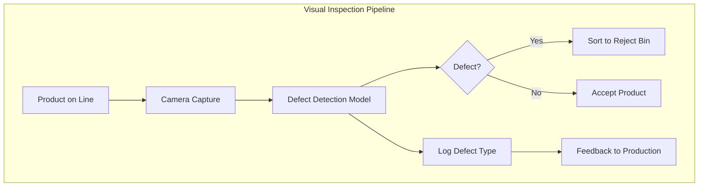

# The 2026 AI Metromap: AI in Robotics, Manufacturing, and Supply Chain

## Series E: Applied AI & Agents Line | Story 13 of 15+

---

## 📖 Introduction

**Welcome to the thirteenth stop on the Applied AI & Agents Line.**

In our last three stories, we explored AI in healthcare, finance, and gaming. You've seen how AI saves lives, moves money, and creates immersive entertainment. Your applications span the digital world.

Now let's turn to the physical world: **robotics, manufacturing, and supply chain.**

This is where AI meets atoms, not bits. Robots that see, grasp, and assemble. Factories that predict failures before they happen. Supply chains that optimize themselves across continents. These aren't science fiction—they're happening today.

AI in manufacturing and robotics is transforming how things are made, moved, and delivered. Computer vision systems inspect products with superhuman accuracy. Predictive maintenance saves billions in downtime. Autonomous mobile robots navigate warehouses without human guidance. And supply chain AI optimizes inventory across the globe, reducing waste and ensuring products arrive when and where they're needed.

This story—**The 2026 AI Metromap: AI in Robotics, Manufacturing, and Supply Chain**—is your guide to building AI that powers the physical economy. We'll implement computer vision for quality control—detecting defects at production speed. We'll build predictive maintenance systems that forecast equipment failure before it happens. We'll create autonomous navigation for robots in warehouses and factories. And we'll develop supply chain optimization that balances inventory, demand, and logistics.

**Let's build the factory of the future.**

---

## 📚 Where You Are in the Journey

### The Master Story Arc: The 2026 AI Metromap Series (Complete)

- 🗺️ **[The 2026 AI Metromap: Why the Old Learning Routes Are Obsolete](#)** – A paradigm shift from linear learning to transit-system mastery.
- 🧭 **[The 2026 AI Metromap: Reading the Map](#)** – Strategic navigation across the three core lines.
- 🎒 **[The 2026 AI Metromap: Avoiding Derailments](#)** – Diagnosing and preventing the most common learning pitfalls.
- 🏁 **[The 2026 AI Metromap: From Passenger to Driver](#)** – Building your portfolio using the Metromap structure.

### Series A: Foundations Station (Complete)
### Series B: Supervised Learning Line (Complete)
### Series C: Modern Architecture Line (Complete)
### Series D: Engineering & Optimization Yard (Complete)

### Series E: Applied AI & Agents Line (15+ Stories)

- 💬 **[The 2026 AI Metromap: Prompt Engineering 101 – The Art of Talking to AI](#)**
- 📚 **[The 2026 AI Metromap: RAG – Retrieval-Augmented Generation for Knowledge-Intensive Tasks](#)**
- 🤖 **[The 2026 AI Metromap: AI Agents & Autonomous Workflows – The Self-Driving Trains](#)**
- 🗣️ **[The 2026 AI Metromap: Voice Assistants & Speech Models – Making AI Talk](#)**
- 👁️ **[The 2026 AI Metromap: Computer Vision Projects – From OCR to Face Recognition](#)**
- 🎨 **[The 2026 AI Metromap: Image Generation & Editing – Diffusion Models in Practice](#)**
- 🔤 **[The 2026 AI Metromap: NLP Tasks – NER, Translation, Summarization, and Beyond](#)**
- 📈 **[The 2026 AI Metromap: Time Series Forecasting – ARIMA, LSTM, and Transformers](#)**
- 👍 **[The 2026 AI Metromap: Recommendation Systems – From Collaborative Filtering to Two-Tower Networks](#)**
- 🏥 **[The 2026 AI Metromap: AI in Healthcare – Medical Research, Diagnostics, and Wellness](#)**
- 💰 **[The 2026 AI Metromap: AI in Finance – Banking, Insurance, and Trading](#)**
- 🎮 **[The 2026 AI Metromap: AI in Gaming, VR/AR, and Entertainment](#)**
- 🏭 **The 2026 AI Metromap: AI in Robotics, Manufacturing, and Supply Chain** – Computer vision for quality control; predictive maintenance; autonomous navigation; warehouse optimization. **⬅️ YOU ARE HERE**

- 🌱 **[The 2026 AI Metromap: AI for Social Good – Climate Action, Agriculture, and Sustainability](#)** – Crop yield prediction; climate modeling; energy optimization; wildlife conservation; disaster response. 🔜 *Up Next*

- 🎓 **[The 2026 AI Metromap: AI in Education – Personalized Learning and Training](#)** – Intelligent tutoring systems; automated grading; personalized content recommendation; adaptive learning paths.

### The Complete Story Catalog

For a complete view of all upcoming stories across every series, visit the **[Complete 2026 AI Metromap Story Catalog](#)**.

---

## 🔍 Computer Vision for Quality Control

Quality control is one of the most impactful applications of computer vision in manufacturing.



```python
def quality_control():
    """Implement AI-powered visual quality inspection"""
    
    print("="*60)
    print("AI FOR QUALITY CONTROL")
    print("="*60)
    
    print("""
    import torch
    import torch.nn as nn
    import torchvision.transforms as transforms
    from torchvision import models
    import cv2
    import numpy as np
    
    # 1. Defect detection model
    class DefectDetector(nn.Module):
        \"\"\"Detect defects in manufactured products\"\"\"
        
        def __init__(self, num_classes=5):  # 4 defect types + no defect
            super().__init__()
            self.backbone = models.efficientnet_b3(pretrained=True)
            in_features = self.backbone.classifier[1].in_features
            self.backbone.classifier = nn.Sequential(
                nn.Dropout(0.3),
                nn.Linear(in_features, 256),
                nn.ReLU(),
                nn.Dropout(0.2),
                nn.Linear(256, num_classes)
            )
        
        def forward(self, x):
            return self.backbone(x)
    
    # 2. Anomaly detection (for unknown defects)
    class AnomalyDetector:
        \"\"\"Detect anomalies without training on defects\"\"\"
        
        def __init__(self):
            self.encoder = self._build_encoder()
            self.decoder = self._build_decoder()
            self.threshold = None
        
        def _build_encoder(self):
            return nn.Sequential(
                nn.Conv2d(3, 32, 3, stride=2, padding=1),
                nn.ReLU(),
                nn.Conv2d(32, 64, 3, stride=2, padding=1),
                nn.ReLU(),
                nn.Conv2d(64, 128, 3, stride=2, padding=1),
                nn.ReLU(),
                nn.Flatten(),
                nn.Linear(128 * 28 * 28, 256)
            )
        
        def _build_decoder(self):
            return nn.Sequential(
                nn.Linear(256, 128 * 28 * 28),
                nn.ReLU(),
                nn.Unflatten(1, (128, 28, 28)),
                nn.ConvTranspose2d(128, 64, 3, stride=2, padding=1, output_padding=1),
                nn.ReLU(),
                nn.ConvTranspose2d(64, 32, 3, stride=2, padding=1, output_padding=1),
                nn.ReLU(),
                nn.ConvTranspose2d(32, 3, 3, stride=2, padding=1, output_padding=1),
                nn.Sigmoid()
            )
        
        def train_on_good_samples(self, good_images):
            \"\"\"Train autoencoder on defect-free images\"\"\"
            # Train to reconstruct good images
            optimizer = torch.optim.Adam(self.parameters())
            
            for epoch in range(50):
                for img in good_images:
                    reconstructed = self(img)
                    loss = nn.MSELoss()(reconstructed, img)
                    loss.backward()
                    optimizer.step()
            
            # Set threshold based on reconstruction error
            errors = []
            for img in good_images:
                with torch.no_grad():
                    recon = self(img)
                    error = nn.MSELoss()(recon, img).item()
                    errors.append(error)
            
            self.threshold = np.percentile(errors, 95)
        
        def detect(self, image):
            \"\"\"Detect anomalies by reconstruction error\"\"\"
            with torch.no_grad():
                reconstructed = self(image)
                error = nn.MSELoss()(reconstructed, image).item()
                
                return {
                    'is_anomaly': error > self.threshold,
                    'anomaly_score': error,
                    'threshold': self.threshold,
                    'heatmap': (image - reconstructed).abs().sum(dim=1)  # Where the defect is
                }
    
    # 3. Real-time inspection system
    class InspectionSystem:
        \"\"\"Real-time quality inspection on production line\"\"\"
        
        def __init__(self, model, camera_id=0):
            self.model = model
            self.camera = cv2.VideoCapture(camera_id)
            self.defect_counts = {}
            self.total_inspected = 0
        
        def run_inspection(self):
            \"\"\"Run continuous inspection loop\"\"\"
            while True:
                ret, frame = self.camera.read()
                if not ret:
                    break
                
                # Preprocess
                image = self._preprocess(frame)
                
                # Detect defects
                result = self.model.detect(image)
                
                # Log results
                self.total_inspected += 1
                if result['defect_type'] != 'none':
                    self.defect_counts[result['defect_type']] = \
                        self.defect_counts.get(result['defect_type'], 0) + 1
                    
                    # Trigger sorting mechanism
                    self._trigger_reject()
                    
                    # Alert operator
                    self._show_alert(frame, result['defect_type'])
                
                # Display FPS and stats
                self._display_stats(frame)
                
                if cv2.waitKey(1) & 0xFF == ord('q'):
                    break
            
            self.camera.release()
            cv2.destroyAllWindows()
        
        def get_quality_metrics(self):
            \"\"\"Calculate quality metrics\"\"\"
            return {
                'defect_rate': sum(self.defect_counts.values()) / max(self.total_inspected, 1),
                'defects_per_thousand': sum(self.defect_counts.values()) / max(self.total_inspected, 1) * 1000,
                'defect_breakdown': self.defect_counts,
                'total_inspected': self.total_inspected
            }
    
    # 4. Surface defect segmentation (pixel-level)
    class DefectSegmenter(nn.Module):
        \"\"\"U-Net for pixel-level defect segmentation\"\"\"
        
        def __init__(self):
            super().__init__()
            # U-Net architecture
            self.enc1 = self._conv_block(3, 64)
            self.enc2 = self._conv_block(64, 128)
            self.enc3 = self._conv_block(128, 256)
            self.enc4 = self._conv_block(256, 512)
            
            self.bottleneck = self._conv_block(512, 1024)
            
            self.up4 = nn.ConvTranspose2d(1024, 512, 2, stride=2)
            self.dec4 = self._conv_block(1024, 512)
            self.up3 = nn.ConvTranspose2d(512, 256, 2, stride=2)
            self.dec3 = self._conv_block(512, 256)
            self.up2 = nn.ConvTranspose2d(256, 128, 2, stride=2)
            self.dec2 = self._conv_block(256, 128)
            self.up1 = nn.ConvTranspose2d(128, 64, 2, stride=2)
            self.dec1 = self._conv_block(128, 64)
            
            self.out = nn.Conv2d(64, 1, 1)
        
        def _conv_block(self, in_ch, out_ch):
            return nn.Sequential(
                nn.Conv2d(in_ch, out_ch, 3, padding=1),
                nn.BatchNorm2d(out_ch),
                nn.ReLU(),
                nn.Conv2d(out_ch, out_ch, 3, padding=1),
                nn.BatchNorm2d(out_ch),
                nn.ReLU()
            )
        
        def forward(self, x):
            # Encoder
            e1 = self.enc1(x)
            e2 = self.enc2(nn.MaxPool2d(2)(e1))
            e3 = self.enc3(nn.MaxPool2d(2)(e2))
            e4 = self.enc4(nn.MaxPool2d(2)(e3))
            
            # Bottleneck
            b = self.bottleneck(nn.MaxPool2d(2)(e4))
            
            # Decoder with skips
            d4 = self.up4(b)
            d4 = torch.cat([d4, e4], dim=1)
            d4 = self.dec4(d4)
            
            d3 = self.up3(d4)
            d3 = torch.cat([d3, e3], dim=1)
            d3 = self.dec3(d3)
            
            d2 = self.up2(d3)
            d2 = torch.cat([d2, e2], dim=1)
            d2 = self.dec2(d2)
            
            d1 = self.up1(d2)
            d1 = torch.cat([d1, e1], dim=1)
            d1 = self.dec1(d1)
            
            return torch.sigmoid(self.out(d1))
    """)
    
    print("\n" + "="*60)
    print("DEFECT TYPES IN MANUFACTURING")
    print("="*60)
    
    defects = [
        ("Surface Scratches", "Lines or marks on surface", "Paints, plastics, metals"),
        ("Dents & Dings", "Physical deformations", "Metal stamping, casting"),
        ("Color Variations", "Inconsistent coloring", "Textiles, plastics"),
        ("Missing Components", "Assembly errors", "Electronics, mechanical"),
        ("Dimension Errors", "Size out of spec", "Machined parts, 3D prints"),
        ("Foreign Particles", "Contamination", "Food, pharmaceuticals")
    ]
    
    print(f"\n{'Defect Type':<20} {'Description':<25} {'Common In':<25}")
    print("-"*75)
    for defect, desc, common in defects:
        print(f"{defect:<20} {desc:<25} {common:<25}")

quality_control()
```

---

## 🔧 Predictive Maintenance: Forecasting Equipment Failure

Predictive maintenance uses sensor data to forecast when equipment will fail, enabling repairs before breakdowns occur.

```python
def predictive_maintenance():
    """Implement predictive maintenance systems"""
    
    print("="*60)
    print("PREDICTIVE MAINTENANCE")
    print("="*60)
    
    print("""
    import numpy as np
    import pandas as pd
    import torch
    import torch.nn as nn
    from sklearn.ensemble import RandomForestClassifier
    from sklearn.preprocessing import StandardScaler
    
    # 1. Time-to-failure prediction
    class RemainingUsefulLife(nn.Module):
        \"\"\"Predict remaining useful life (RUL) of equipment\"\"\"
        
        def __init__(self, input_dim, hidden_dim=128):
            super().__init__()
            self.lstm = nn.LSTM(input_dim, hidden_dim, batch_first=True)
            self.fc = nn.Sequential(
                nn.Linear(hidden_dim, 64),
                nn.ReLU(),
                nn.Linear(64, 1)
            )
        
        def forward(self, x):
            # x shape: (batch, sequence_length, features)
            lstm_out, (hidden, cell) = self.lstm(x)
            last_output = lstm_out[:, -1, :]
            return self.fc(last_output)
    
    # 2. Anomaly detection on sensor data
    class SensorAnomalyDetector:
        \"\"\"Detect anomalous sensor readings\"\"\"
        
        def __init__(self, n_sensors):
            self.models = {}
            self.thresholds = {}
        
        def train(self, normal_data):
            \"\"\"Train on normal operational data\"\"\"
            for sensor_id in range(normal_data.shape[1]):
                sensor_data = normal_data[:, sensor_id]
                
                # Fit distribution
                mean = np.mean(sensor_data)
                std = np.std(sensor_data)
                
                self.models[sensor_id] = {'mean': mean, 'std': std}
                self.thresholds[sensor_id] = mean + 3 * std  # 3-sigma rule
        
        def detect(self, readings):
            \"\"\"Detect anomalies in current readings\"\"\"
            anomalies = []
            
            for sensor_id, value in enumerate(readings):
                if abs(value - self.models[sensor_id]['mean']) > self.thresholds[sensor_id]:
                    anomalies.append({
                        'sensor': sensor_id,
                        'value': value,
                        'expected_range': (self.models[sensor_id]['mean'] - self.thresholds[sensor_id],
                                           self.models[sensor_id]['mean'] + self.thresholds[sensor_id])
                    })
            
            return anomalies
    
    # 3. Vibration analysis for rotating machinery
    class VibrationAnalyzer:
        \"\"\"Analyze vibration patterns for bearing fault detection\"\"\"
        
        def __init__(self):
            self.fft = np.fft
        
        def analyze(self, vibration_signal, sample_rate):
            \"\"\"Extract features from vibration signal\"\"\"
            # FFT to get frequency domain
            fft_values = np.abs(self.fft.fft(vibration_signal))
            frequencies = self.fft.fftfreq(len(vibration_signal), 1/sample_rate)
            
            # Key features
            features = {
                'overall_rms': np.sqrt(np.mean(vibration_signal ** 2)),
                'peak_to_peak': np.max(vibration_signal) - np.min(vibration_signal),
                'crest_factor': np.max(np.abs(vibration_signal)) / np.sqrt(np.mean(vibration_signal ** 2)),
                'kurtosis': self._calculate_kurtosis(vibration_signal),
                'dominant_freq': frequencies[np.argmax(fft_values[:len(fft_values)//2])],
                'energy_1k': np.sum(fft_values[(frequencies > 0) & (frequencies < 1000)]),
                'energy_2k': np.sum(fft_values[(frequencies > 1000) & (frequencies < 2000)]),
                'energy_5k': np.sum(fft_values[(frequencies > 2000) & (frequencies < 5000)])
            }
            
            return features
    
    # 4. Maintenance scheduling optimization
    class MaintenanceScheduler:
        \"\"\"Optimize maintenance scheduling\"\"\"
        
        def __init__(self, equipment):
            self.equipment = equipment
            self.schedule = []
        
        def optimize(self, failure_risks, maintenance_costs, downtime_costs):
            \"\"\"Schedule maintenance to minimize total cost\"\"\"
            # Risk-based scheduling
            schedule = []
            
            for equipment_id, risk in enumerate(failure_risks):
                # Expected cost of failure
                expected_failure_cost = risk * downtime_costs[equipment_id]
                
                # Cost of preventive maintenance
                maintenance_cost = maintenance_costs[equipment_id]
                
                # Schedule if preventive is cheaper than expected failure
                if maintenance_cost < expected_failure_cost:
                    schedule.append({
                        'equipment': equipment_id,
                        'priority': risk,
                        'recommended_date': self._calculate_date(risk)
                    })
            
            # Sort by priority
            schedule.sort(key=lambda x: x['priority'], reverse=True)
            
            return schedule
    
    # 5. Digital twin integration
    class DigitalTwin:
        \"\"\"Virtual representation of physical equipment\"\"\"
        
        def __init__(self, equipment_model):
            self.model = equipment_model  # Physics-based or ML model
            self.state = {}
            self.history = []
        
        def update(self, sensor_data):
            \"\"\"Update digital twin with real sensor data\"\"\"
            self.history.append(sensor_data)
            
            # Predict current state
            self.state = self.model.predict(self.history[-10:])
            
            # Detect deviations from expected behavior
            deviations = self._detect_deviations(sensor_data)
            
            return {
                'state': self.state,
                'deviations': deviations,
                'remaining_life': self.state.get('remaining_life'),
                'recommended_actions': self._generate_actions(deviations)
            }
        
        def simulate_failure_modes(self):
            \"\"\"Simulate different failure scenarios\"\"\"
            scenarios = []
            
            for failure_mode in ['bearing_wear', 'misalignment', 'imbalance', 'lubrication']:
                simulated_state = self.model.simulate_failure(failure_mode)
                scenarios.append({
                    'mode': failure_mode,
                    'time_to_failure': simulated_state['time_to_failure'],
                    'symptoms': simulated_state['symptoms']
                })
            
            return scenarios
    """)
    
    print("\n" + "="*60)
    print("PREDICTIVE MAINTENANCE TECHNIQUES")
    print("="*60)
    
    techniques = [
        ("Vibration Analysis", "FFT, envelope analysis", "Rotating machinery, bearings"),
        ("Thermal Imaging", "Temperature patterns", "Electrical, motors, furnaces"),
        ("Oil Analysis", "Particle counts, spectroscopy", "Engines, hydraulics, gears"),
        ("Acoustic Monitoring", "Ultrasound, sound analysis", "Leaks, electrical arcs"),
        ("Current Analysis", "Motor current signature", "Pumps, fans, compressors"),
        ("ML Models", "LSTM, Random Forest", "Complex systems, multi-sensor")
    ]
    
    print(f"\n{'Technique':<20} {'Description':<25} {'Applications':<30}")
    print("-"*80)
    for tech, desc, apps in techniques:
        print(f"{tech:<20} {desc:<25} {apps:<30}")

predictive_maintenance()
```

---

## 🤖 Autonomous Mobile Robots (AMRs) and Navigation

Autonomous robots navigate warehouses, factories, and distribution centers.

```python
def autonomous_robots():
    """Implement autonomous navigation for mobile robots"""
    
    print("="*60)
    print("AUTONOMOUS MOBILE ROBOTS")
    print("="*60)
    
    print("""
    import numpy as np
    import heapq
    from typing import List, Tuple
    
    # 1. Path planning with A* algorithm
    class PathPlanner:
        \"\"\"Plan optimal paths through obstacle fields\"\"\"
        
        def __init__(self, grid_size, obstacles):
            self.grid = np.zeros(grid_size)
            for obs in obstacles:
                self.grid[obs[0], obs[1]] = 1  # Mark obstacles
        
        def a_star(self, start, goal):
            \"\"\"A* path planning\"\"\"
            open_set = []
            heapq.heappush(open_set, (0, start))
            
            came_from = {}
            g_score = {start: 0}
            f_score = {start: self._heuristic(start, goal)}
            
            while open_set:
                current = heapq.heappop(open_set)[1]
                
                if current == goal:
                    return self._reconstruct_path(came_from, current)
                
                for neighbor in self._get_neighbors(current):
                    tentative_g = g_score[current] + self._distance(current, neighbor)
                    
                    if neighbor not in g_score or tentative_g < g_score[neighbor]:
                        came_from[neighbor] = current
                        g_score[neighbor] = tentative_g
                        f_score[neighbor] = tentative_g + self._heuristic(neighbor, goal)
                        heapq.heappush(open_set, (f_score[neighbor], neighbor))
            
            return None  # No path found
        
        def _heuristic(self, a, b):
            \"\"\"Euclidean distance heuristic\"\"\"
            return np.sqrt((a[0] - b[0]) ** 2 + (a[1] - b[1]) ** 2)
    
    # 2. SLAM (Simultaneous Localization and Mapping)
    class SLAM:
        \"\"\"Build map while localizing robot\"\"\"
        
        def __init__(self):
            self.map = []
            self.robot_pose = (0, 0, 0)  # x, y, theta
            self.landmarks = []
        
        def process_laser_scan(self, scan_data, odometry):
            \"\"\"Update map and pose with new scan\"\"\"
            # Predict pose from odometry
            predicted_pose = self._predict_pose(odometry)
            
            # Find correspondences between scan and map
            correspondences = self._find_correspondences(scan_data, self.map)
            
            # Update pose estimate
            self.robot_pose = self._update_pose(predicted_pose, correspondences)
            
            # Update map with new observations
            self.map = self._update_map(self.robot_pose, scan_data)
            
            return self.map, self.robot_pose
    
    # 3. Reinforcement learning for navigation
    class RLNavigator:
        \"\"\"Deep Q-Network for robot navigation\"\"\"
        
        def __init__(self, state_dim, action_dim=4):  # forward, back, left, right
            self.q_network = self._build_network(state_dim, action_dim)
            self.epsilon = 1.0
            self.epsilon_decay = 0.995
            self.memory = []
        
        def get_action(self, state):
            \"\"\"Choose action using epsilon-greedy\"\"\"
            if np.random.random() < self.epsilon:
                return np.random.randint(4)  # Explore
            else:
                with torch.no_grad():
                    q_values = self.q_network(state)
                    return q_values.argmax().item()
        
        def train(self, batch_size=64):
            \"\"\"Train on experience replay\"\"\"
            if len(self.memory) < batch_size:
                return
            
            batch = random.sample(self.memory, batch_size)
            states, actions, rewards, next_states, dones = zip(*batch)
            
            # Compute target Q-values
            with torch.no_grad():
                next_q = self.target_network(next_states).max(1)[0]
                targets = rewards + 0.99 * next_q * (1 - dones)
            
            # Current Q-values
            current_q = self.q_network(states).gather(1, actions.unsqueeze(1))
            
            # Update network
            loss = nn.MSELoss()(current_q.squeeze(), targets)
            self.optimizer.zero_grad()
            loss.backward()
            self.optimizer.step()
            
            self.epsilon *= self.epsilon_decay
    
    # 4. Multi-robot coordination
    class FleetManager:
        \"\"\"Coordinate multiple robots in warehouse\"\"\"
        
        def __init__(self):
            self.robots = []
            self.task_queue = []
            self.reserved_paths = []
        
        def assign_task(self, robot_id, task):
            \"\"\"Assign task to robot with path planning\"\"\"
            robot = self.robots[robot_id]
            
            # Check if robot is available
            if robot.status != 'idle':
                return {'status': 'rejected', 'reason': 'robot busy'}
            
            # Plan path
            path = self.path_planner.plan(robot.position, task.location)
            
            # Check for conflicts with other robots
            conflicts = self._check_path_conflicts(path)
            
            if conflicts:
                # Wait or reassign
                return {'status': 'delayed', 'reason': 'path conflict'}
            
            # Reserve path
            self.reserved_paths.append((robot_id, path))
            
            # Assign task
            robot.assign_task(task, path)
            
            return {'status': 'assigned', 'robot': robot_id, 'eta': self._estimate_time(path)}
        
        def optimize_routes(self):
            \"\"\"Optimize all robot routes globally\"\"\"
            # Hungarian algorithm for assignment
            costs = self._compute_cost_matrix()
            assignments = self._hungarian_algorithm(costs)
            
            # Reassign tasks to minimize total cost
            for robot_id, task_id in assignments:
                self.robots[robot_id].reassign_task(self.task_queue[task_id])
    """)
    
    print("\n" + "="*60)
    print("ROBOT NAVIGATION TECHNIQUES")
    print("="*60)
    
    techniques = [
        ("A* Path Planning", "Global path planning", "Warehouse navigation"),
        ("SLAM", "Mapping and localization", "Unknown environments"),
        ("Reinforcement Learning", "Learned navigation", "Dynamic obstacles"),
        ("Fleet Management", "Multi-robot coordination", "Large-scale operations"),
        ("Obstacle Avoidance", "Local reactive planning", "Real-time collision avoidance")
    ]
    
    print(f"\n{'Technique':<22} {'Description':<25} {'Application':<30}")
    print("-"*80)
    for tech, desc, app in techniques:
        print(f"{tech:<22} {desc:<25} {app:<30}")

autonomous_robots()
```

---

## 📦 Supply Chain Optimization: From Factory to Customer

Supply chain AI optimizes inventory, demand forecasting, and logistics.

```python
def supply_chain_optimization():
    """Implement AI-powered supply chain optimization"""
    
    print("="*60)
    print("SUPPLY CHAIN OPTIMIZATION")
    print("="*60)
    
    print("""
    import numpy as np
    import pandas as pd
    from sklearn.ensemble import RandomForestRegressor
    from ortools.linear_solver import pywraplp
    
    # 1. Demand forecasting
    class DemandForecaster:
        \"\"\"Predict product demand across locations\"\"\"
        
        def __init__(self):
            self.models = {}
        
        def train(self, historical_data):
            \"\"\"Train forecast models per SKU/location\"\"\"
            for (sku, location), data in historical_data.groupby(['sku', 'location']):
                # Feature engineering
                features = self._create_features(data)
                
                # Train model
                model = RandomForestRegressor(n_estimators=100)
                model.fit(features, data['demand'])
                
                self.models[(sku, location)] = model
        
        def forecast(self, sku, location, future_features):
            \"\"\"Generate demand forecast\"\"\"
            model = self.models.get((sku, location))
            if model:
                return model.predict([future_features])[0]
            return None
    
    # 2. Inventory optimization
    class InventoryOptimizer:
        \"\"\"Optimize safety stock and reorder points\"\"\"
        
        def __init__(self, service_level=0.95, lead_time_days=7):
            self.service_level = service_level
            self.lead_time = lead_time_days
            self.z_score = norm.ppf(service_level)
        
        def calculate_safety_stock(self, demand_std):
            \"\"\"Calculate safety stock for given demand variability\"\"\"
            return self.z_score * demand_std * np.sqrt(self.lead_time)
        
        def calculate_reorder_point(self, avg_demand, safety_stock):
            \"\"\"Calculate reorder point\"\"\"
            return avg_demand * self.lead_time + safety_stock
        
        def optimize(self, sku_data):
            \"\"\"Optimize inventory parameters for SKU\"\"\"
            results = {}
            
            for sku, data in sku_data.items():
                avg_demand = data['avg_daily_demand']
                demand_std = data['demand_std']
                holding_cost = data['holding_cost']
                ordering_cost = data['ordering_cost']
                
                # Economic Order Quantity (EOQ)
                eoq = np.sqrt(2 * avg_demand * 365 * ordering_cost / holding_cost)
                
                # Safety stock
                safety_stock = self.calculate_safety_stock(demand_std)
                
                # Reorder point
                reorder_point = self.calculate_reorder_point(avg_demand, safety_stock)
                
                results[sku] = {
                    'eoq': eoq,
                    'safety_stock': safety_stock,
                    'reorder_point': reorder_point,
                    'max_inventory': eoq + safety_stock,
                    'total_cost': self._calculate_total_cost(sku, eoq, safety_stock)
                }
            
            return results
    
    # 3. Vehicle routing optimization
    class VehicleRouter:
        \"\"\"Optimize delivery routes\"\"\"
        
        def __init__(self, locations, vehicle_capacity):
            self.locations = locations
            self.capacity = vehicle_capacity
            self.distances = self._compute_distance_matrix(locations)
        
        def solve_vrp(self, demands):
            \"\"\"Solve vehicle routing problem\"\"\"
            # Using Google OR-Tools
            solver = pywraplp.Solver.CreateSolver('SCIP')
            
            # Decision variables
            x = {}
            for i in range(len(self.locations)):
                for j in range(len(self.locations)):
                    x[i, j] = solver.IntVar(0, 1, f'x_{i}_{j}')
            
            # Constraints
            # Each location visited once
            for i in range(1, len(self.locations)):
                solver.Add(solver.Sum(x[i, j] for j in range(len(self.locations))) == 1)
                solver.Add(solver.Sum(x[j, i] for j in range(len(self.locations))) == 1)
            
            # Capacity constraints
            # ... (simplified)
            
            # Objective: minimize total distance
            objective = solver.Objective()
            for i in range(len(self.locations)):
                for j in range(len(self.locations)):
                    objective.SetCoefficient(x[i, j], self.distances[i][j])
            objective.SetMinimization()
            
            # Solve
            status = solver.Solve()
            
            if status == pywraplp.Solver.OPTIMAL:
                return self._extract_routes(x)
            return None
    
    # 4. Supplier selection optimization
    class SupplierOptimizer:
        \"\"\"Select optimal suppliers based on multiple criteria\"\"\"
        
        def __init__(self):
            self.criteria_weights = {
                'cost': 0.4,
                'quality': 0.3,
                'reliability': 0.2,
                'lead_time': 0.1
            }
        
        def score_suppliers(self, suppliers):
            \"\"\"Score suppliers using weighted criteria\"\"\"
            scored = []
            
            for supplier in suppliers:
                # Normalize criteria
                cost_score = 1 - (supplier['cost'] - min_cost) / (max_cost - min_cost)
                quality_score = supplier['quality_rate'] / 100
                reliability_score = supplier['on_time_rate'] / 100
                lead_time_score = 1 - (supplier['lead_time'] - min_lead) / (max_lead - min_lead)
                
                # Weighted sum
                total_score = (
                    self.criteria_weights['cost'] * cost_score +
                    self.criteria_weights['quality'] * quality_score +
                    self.criteria_weights['reliability'] * reliability_score +
                    self.criteria_weights['lead_time'] * lead_time_score
                )
                
                scored.append({
                    'supplier': supplier['name'],
                    'score': total_score,
                    'breakdown': {
                        'cost': cost_score,
                        'quality': quality_score,
                        'reliability': reliability_score,
                        'lead_time': lead_time_score
                    }
                })
            
            return sorted(scored, key=lambda x: x['score'], reverse=True)
    
    # 5. Real-time tracking and ETA prediction
    class ShipmentTracker:
        \"\"\"Track shipments and predict arrival times\"\"\"
        
        def __init__(self):
            self.eta_model = None  # ML model for ETA
        
        def predict_eta(self, shipment):
            \"\"\"Predict estimated time of arrival\"\"\"
            features = {
                'distance': shipment['distance'],
                'mode': shipment['transport_mode'],
                'origin_port_congestion': shipment['port_congestion'],
                'weather_conditions': shipment['weather'],
                'historical_avg': shipment['historical_avg_time']
            }
            
            eta = self.eta_model.predict([features])[0]
            
            return {
                'estimated_arrival': eta,
                'confidence_interval': self._calculate_confidence(eta),
                'risk_factors': self._identify_risks(shipment)
            }
        
        def detect_delays(self, shipment, current_position):
            \"\"\"Detect and alert on potential delays\"\"\"
            expected_position = self._expected_position(shipment)
            deviation = self._calculate_deviation(expected_position, current_position)
            
            if deviation > 0.2:  # 20% deviation
                return {
                    'alert': 'DELAY_DETECTED',
                    'estimated_delay': self._estimate_delay(deviation),
                    'recommended_action': self._suggest_action(shipment, deviation)
                }
            
            return None
    """)
    
    print("\n" + "="*60)
    print("SUPPLY CHAIN OPTIMIZATION AREAS")
    print("="*60)
    
    areas = [
        ("Demand Forecasting", "Predict future demand", "ML, time series"),
        ("Inventory Optimization", "Safety stock, reorder points", "EOQ, stochastic models"),
        ("Route Optimization", "Delivery routes", "VRP, OR-Tools"),
        ("Supplier Selection", "Multi-criteria decisions", "Weighted scoring, optimization"),
        ("Warehouse Layout", "Storage optimization", "Slotting algorithms"),
        ("Last Mile Delivery", "Dynamic routing", "Real-time optimization")
    ]
    
    print(f"\n{'Area':<22} {'Description':<25} {'Techniques':<30}")
    print("-"*80)
    for area, desc, techniques in areas:
        print(f"{area:<22} {desc:<25} {techniques:<30}")

supply_chain_optimization()
```

---

## 🏭 Complete Manufacturing AI Pipeline

```python
def manufacturing_pipeline():
    """Complete AI pipeline for manufacturing and supply chain"""
    
    print("="*60)
    print("COMPLETE MANUFACTURING AI PIPELINE")
    print("="*60)
    
    print("""
    class SmartFactory:
        \"\"\"AI-powered smart factory system\"\"\"
        
        def __init__(self, config):
            self.config = config
            
            # AI modules
            self.quality_control = QualityInspectionSystem()
            self.predictive_maintenance = PredictiveMaintenance()
            self.robots = FleetManager()
            self.supply_chain = SupplyChainOptimizer()
            self.inventory = InventoryOptimizer()
            
            # Data pipelines
            self.sensor_data = []
            self.production_logs = []
            self.quality_metrics = []
        
        def process_production_batch(self, batch_id, product_spec):
            \"\"\"Process a production batch with full AI integration\"\"\"
            
            # 1. Check inventory for raw materials
            materials_available = self.supply_chain.check_materials(product_spec['materials'])
            if not materials_available['available']:
                return {'status': 'DELAYED', 'reason': 'Materials shortage'}
            
            # 2. Schedule production on machines
            schedule = self._schedule_production(product_spec, batch_id)
            
            # 3. Monitor production in real-time
            quality_results = []
            for step in schedule:
                # Execute production step
                result = self._execute_step(step)
                
                # Quality inspection
                inspection = self.quality_control.inspect(result['output'])
                quality_results.append(inspection)
                
                if inspection['defect_rate'] > self.config['quality_threshold']:
                    self._trigger_quality_alert(inspection)
                    
                    # Adjust parameters
                    self._adjust_process_parameters(inspection)
            
            # 4. Update inventory
            self.inventory.update(batch_id, product_spec['output_quantity'])
            
            # 5. Schedule maintenance if needed
            maintenance_needed = self.predictive_maintenance.check_health()
            if maintenance_needed['risk'] > 0.7:
                self._schedule_maintenance(maintenance_needed['equipment'])
            
            return {
                'batch_id': batch_id,
                'status': 'COMPLETED',
                'quality_metrics': self._aggregate_quality(quality_results),
                'production_time': schedule['total_time'],
                'maintenance_alerts': maintenance_needed if maintenance_needed else None
            }
        
        def optimize_warehouse(self):
            \"\"\"Optimize warehouse layout and picking routes\"\"\"
            
            # Get current inventory and order data
            inventory = self.inventory.get_current()
            orders = self.get_pending_orders()
            
            # Optimize slotting (where to store items)
            slotting = self._optimize_slotting(inventory)
            
            # Optimize picking routes
            routes = self.robots.optimize_routes(orders, inventory)
            
            # Update warehouse layout
            self._update_warehouse_layout(slotting)
            
            return {
                'slotting_plan': slotting,
                'picking_routes': routes,
                'estimated_time_savings': self._calculate_savings(routes)
            }
        
        def digital_twin_simulation(self, scenario):
            \"\"\"Simulate production scenarios with digital twin\"\"\"
            
            # Create virtual copy of factory
            digital_twin = self._create_digital_twin()
            
            # Run simulation
            results = digital_twin.simulate(scenario)
            
            # Analyze outcomes
            analysis = {
                'throughput': results['units_produced'],
                'bottlenecks': results['bottlenecks'],
                'quality_impact': results['defect_rate'],
                'energy_usage': results['energy_consumption'],
                'recommendations': self._generate_recommendations(results)
            }
            
            return analysis
        
        def real_time_dashboard(self):
            \"\"\"Generate real-time factory dashboard\"\"\"
            
            return {
                'overall_equipment_effectiveness': self._calculate_oee(),
                'defect_rate': self._current_defect_rate(),
                'inventory_status': self.inventory.get_summary(),
                'machine_health': self.predictive_maintenance.get_health_scores(),
                'active_orders': self._get_active_orders(),
                'alerts': self._get_active_alerts(),
                'energy_usage': self._get_energy_usage(),
                'throughput': self._get_throughput()
            }
        
        def predictive_quality(self, product_id):
            \"\"\"Predict quality issues before they occur\"\"\"
            
            # Get process parameters for this product
            params = self._get_process_params(product_id)
            
            # Get current machine conditions
            machine_state = self.predictive_maintenance.get_state()
            
            # Predict quality outcomes
            prediction = self.quality_control.predict_quality(params, machine_state)
            
            if prediction['predicted_defect_rate'] > 0.05:
                return {
                    'alert': 'QUALITY_RISK',
                    'predicted_defect_rate': prediction['predicted_defect_rate'],
                    'recommended_adjustments': prediction['adjustments'],
                    'estimated_impact': prediction['cost_impact']
                }
            
            return {'status': 'OK', 'predicted_defect_rate': prediction['predicted_defect_rate']}
    """)
    
    print("\n" + "="*60)
    print("MANUFACTURING KEY PERFORMANCE INDICATORS")
    print("="*60)
    
    kpis = [
        ("OEE", "Overall Equipment Effectiveness", ">85%", "Availability × Performance × Quality"),
        ("Defect Rate", "Percentage of defective units", "<1%", "Quality control"),
        ("Downtime", "Unplanned stoppages", "<5%", "Predictive maintenance"),
        ("Inventory Turns", "Inventory efficiency", ">12/year", "Supply chain"),
        ("On-Time Delivery", "Customer satisfaction", ">98%", "Logistics"),
        ("Energy Efficiency", "Energy per unit", "-10% YoY", "Sustainability")
    ]
    
    print(f"\n{'KPI':<22} {'Description':<25} {'Target':<12} {'Driven By':<25}")
    print("-"*85)
    for kpi, desc, target, driven in kpis:
        print(f"{kpi:<22} {desc:<25} {target:<12} {driven:<25}")

manufacturing_pipeline()
```

---

## 📊 Takeaway from This Story

**What You Learned:**

- **Quality Control** – Defect detection with CNNs, anomaly detection with autoencoders, segmentation with U-Net. Real-time inspection at production speeds.

- **Predictive Maintenance** – Remaining useful life (RUL) prediction, vibration analysis (FFT), anomaly detection on sensors, maintenance scheduling optimization.

- **Autonomous Robots** – Path planning (A*), SLAM for mapping, reinforcement learning for navigation, multi-robot coordination.

- **Supply Chain Optimization** – Demand forecasting, inventory optimization (EOQ, safety stock), vehicle routing (VRP), supplier selection, real-time tracking.

- **Smart Factory** – Integrated AI across production, quality, maintenance, inventory, and logistics. Digital twins for simulation. Real-time dashboards.

---

## 🔗 Navigation

- **⬅️ Previous Story:** [The 2026 AI Metromap: AI in Gaming, VR/AR, and Entertainment](#)

- **📚 Series E Catalog:** [Series E: Applied AI & Agents Line](#) – View all 15+ stories in this series.

- **📚 Complete Story Catalog:** [Complete 2026 AI Metromap Story Catalog](#) – Your navigation guide to all 39+ stories.

- **➡️ Next Story:** **[The 2026 AI Metromap: AI for Social Good – Climate Action, Agriculture, and Sustainability](#)** – Crop yield prediction; climate modeling; energy optimization; wildlife conservation; disaster response.

---

## 📝 Your Invitation

Before the next story arrives, build manufacturing AI:

1. **Quality control** – Train a defect detector on a dataset (e.g., MVTec AD). Implement real-time inspection.

2. **Predictive maintenance** – Use vibration data to predict bearing failure. Build an LSTM for RUL prediction.

3. **Robot navigation** – Implement A* path planning. Add obstacle avoidance.

4. **Supply chain** – Forecast demand for a product. Calculate optimal inventory levels.

5. **Digital twin** – Create a simulation of a simple manufacturing process. Run what-if scenarios.

**You've mastered AI in manufacturing. Next stop: AI for Social Good!**

---

*Found this helpful? Clap, comment, and share your manufacturing AI projects. Next stop: AI for Social Good!* 🚇