# The 2026 AI Metromap: Activation Functions & Backpropagation – The Electrical Grid of the Network

## Series B: Supervised Learning Line | Story 3 of 4

---

## 📖 Introduction

**Welcome to the third stop on the Supervised Learning Line.**

In our last story, you built the Multi-Layer Perceptron—a network of neurons stacked into layers. You saw how depth gives power. But there was a missing piece.

When we built the MLP, we used the ReLU activation function in the hidden layers and sigmoid in the output. But why? Why not just use linear functions? Why do we need activations at all?

And there's a bigger question: **How does a deep network actually learn?**

You've seen gradient descent update weights. But when you have 10, 50, or 100 layers, how do you calculate the gradients for the first layer? How does the error signal travel back through all those layers to tell the early neurons what to change?

The answer is **backpropagation**—the algorithm that made deep learning possible. And at its heart are **activation functions**—the non-linearities that give neural networks their power.

This story—**The 2026 AI Metromap: Activation Functions & Backpropagation – The Electrical Grid of the Network**—is your deep dive into how networks actually learn. We'll explore why non-linear activations are essential. We'll understand the chain rule—the calculus that powers backpropagation. We'll build backpropagation from scratch, visualizing how error flows backward through the network. And we'll confront the vanishing gradient problem—the challenge that nearly killed deep learning before ReLU saved it.

**Let's wire up the electrical grid.**

---

## 📚 Where You Are in the Journey

### The Master Story Arc: The 2026 AI Metromap Series (Complete)

- 🗺️ **[The 2026 AI Metromap: Why the Old Learning Routes Are Obsolete](#)** – A paradigm shift from linear learning to transit-system mastery.
- 🧭 **[The 2026 AI Metromap: Reading the Map](#)** – Strategic navigation across the three core lines.
- 🎒 **[The 2026 AI Metromap: Avoiding Derailments](#)** – Diagnosing and preventing the most common learning pitfalls.
- 🏁 **[The 2026 AI Metromap: From Passenger to Driver](#)** – Building your portfolio using the Metromap structure.

### Series A: Foundations Station (Complete)

- 🏗️ **[The 2026 AI Metromap: Foundations Station – Why Data Cleaning and Git Are Your Board Games, Not Just Chores](#)**
- 🖥️ **[The 2026 AI Metromap: Command Line & Version Control – Navigating the Terminal Like a Conductor](#)**
- 🧮 **[The 2026 AI Metromap: Linear Algebra for ML – The Language of the Map](#)**
- 📊 **[The 2026 AI Metromap: Data Cleaning & Visualization – Turning Raw Data into Tracks](#)**
- 🔄 **[The 2026 AI Metromap: Ethics & Responsible AI – The Safety Systems of the Metro](#)**

### Series B: Supervised Learning Line (4 Stories)

- 📊 **[The 2026 AI Metromap: Regression & Classification – The Grand Central Station of AI](#)** – Linear regression from scratch; logistic regression; evaluation metrics; connecting classical ML to modern deep learning.

- 🧬 **[The 2026 AI Metromap: Neural Network Architecture – From Perceptron to MLP](#)** – The biological inspiration; perceptron implementation; multi-layer perceptrons; forward propagation; universal approximation theorem.

- ⚡ **The 2026 AI Metromap: Activation Functions & Backpropagation – The Electrical Grid of the Network** – Sigmoid, tanh, ReLU, Leaky ReLU, Swish, GELU; the chain rule explained visually; backpropagation step-by-step; vanishing and exploding gradients. **⬅️ YOU ARE HERE**

- 🎯 **[The 2026 AI Metromap: Loss Functions & Optimization – Navigating to the Minimum](#)** – Cross-entropy, MSE, MAE, Huber loss; gradient descent variants (SGD, Momentum, Adam, AdamW); learning rate schedules. 🔜 *Up Next*

### The Complete Story Catalog

For a complete view of all upcoming stories across every series, visit the **[Complete 2026 AI Metromap Story Catalog](#)**.

---

## ⚡ Why Activation Functions Matter

Without activation functions, neural networks are just linear regression—no matter how many layers you stack.

```mermaid
graph LR
    subgraph "Without Activation (Linear)"
        X[Input] --> W1[W1]
        W1 --> W2[W2]
        W2 --> Y[Output = W2·W1·X]
        Y --> N[Still Linear!]
    end
    
    subgraph "With Activation (Non-Linear)"
        X2[Input] --> W12[W1]
        W12 --> A1[σ₁]
        A1 --> W22[W2]
        W22 --> A2[σ₂]
        A2 --> Y2[Output = σ₂(W2·σ₁(W1·X))]
        Y2 --> C[Complex, Non-Linear]
    end
    
    style N fill:#ff6b6b,stroke:#333,stroke-width:2px
    style C fill:#90be6d,stroke:#333,stroke-width:4px
```

**The Core Insight:**

- **Linear activation** → Stacked linear transformations = still linear
- **Non-linear activation** → Each layer can learn new, non-linear features
- Without non-linearity, deep networks are useless

---

## 🔌 The Activation Function Zoo

Different activations for different purposes. Let's explore the most important ones.

```mermaid
graph TD
    subgraph "Activation Functions"
        S[Sigmoid<br/>σ(z) = 1/(1+e⁻ᶻ)]
        T[Tanh<br/>tanh(z) = (eᶻ-e⁻ᶻ)/(eᶻ+e⁻ᶻ)]
        R[ReLU<br/>max(0, z)]
        L[Leaky ReLU<br/>max(0.01z, z)]
        SW[Swish<br/>z·σ(z)]
        G[GELU<br/>z·Φ(z)]
    end
    
    subgraph "When to Use"
        S --> O[Output layer<br/>Binary classification]
        T --> H[Hidden layers<br/>(older networks)]
        R --> H2[Hidden layers<br/>(modern default)]
        L --> H3[Hidden layers<br/>(when dying ReLU)]
        SW --> H4[Hidden layers<br/>(advanced)]
        G --> H5[Hidden layers<br/>(Transformers)]
    end
    
    style R fill:#ffd700,stroke:#333,stroke-width:4px
```

### Visualizing All Activations

```python
import numpy as np
import matplotlib.pyplot as plt

def sigmoid(z):
    return 1 / (1 + np.exp(-z))

def tanh(z):
    return np.tanh(z)

def relu(z):
    return np.maximum(0, z)

def leaky_relu(z, alpha=0.01):
    return np.where(z > 0, z, alpha * z)

def swish(z, beta=1.0):
    return z * sigmoid(beta * z)

def gelu(z):
    # Approximate GELU
    return 0.5 * z * (1 + np.tanh(np.sqrt(2 / np.pi) * (z + 0.044715 * z**3)))

# Generate input values
z = np.linspace(-5, 5, 1000)

# Compute activations
activations = {
    'Sigmoid': sigmoid(z),
    'Tanh': tanh(z),
    'ReLU': relu(z),
    'Leaky ReLU (α=0.01)': leaky_relu(z),
    'Swish': swish(z),
    'GELU': gelu(z)
}

# Plot all activations
fig, axes = plt.subplots(2, 3, figsize=(15, 10))
axes = axes.flatten()

for ax, (name, values) in zip(axes, activations.items()):
    ax.plot(z, values, 'b-', linewidth=2)
    ax.axhline(y=0, color='k', linestyle='-', alpha=0.3)
    ax.axvline(x=0, color='k', linestyle='-', alpha=0.3)
    ax.grid(True, alpha=0.3)
    ax.set_title(name)
    ax.set_xlabel('z')
    ax.set_ylabel('σ(z)')
    ax.set_ylim(-1.5, 1.5 if name != 'ReLU' and name != 'Leaky ReLU' else 5)

plt.tight_layout()
plt.show()
```

### Activation Function Comparison

| Function | Range | Derivative | Pros | Cons |
|----------|-------|------------|------|------|
| **Sigmoid** | (0, 1) | σ(z)(1-σ(z)) | Smooth, probabilistic | Vanishing gradients, not zero-centered |
| **Tanh** | (-1, 1) | 1 - tanh²(z) | Zero-centered | Still vanishing gradients |
| **ReLU** | [0, ∞) | 0 if z<0, 1 if z>0 | Fast, no vanishing | Dying ReLU (neurons die) |
| **Leaky ReLU** | (-∞, ∞) | α if z<0, 1 if z>0 | Fixes dying ReLU | Extra parameter |
| **Swish** | (-∞, ∞) | σ(z) + z·σ(z)(1-σ(z)) | Smooth, non-monotonic | More computation |
| **GELU** | (-∞, ∞) | Complex | Used in Transformers | Complex derivative |

---

## 📐 The Chain Rule: Calculus That Powers Learning

Backpropagation is just the chain rule from calculus, applied repeatedly.

```mermaid
graph TD
    subgraph "The Chain Rule"
        A[y = f(g(x))] --> B[dy/dx = f'(g(x))·g'(x)]
    end
    
    subgraph "In a Neural Network"
        X[Input x] --> L1[Layer 1: h = σ(W₁x)]
        L1 --> L2[Layer 2: y = σ(W₂h)]
        L2 --> L[Loss L(y, ŷ)]
    end
    
    subgraph "Chain Rule Applied"
        C[dL/dW₂ = dL/dy · dy/dz₂ · dz₂/dW₂]
        D[dL/dW₁ = dL/dy · dy/dz₂ · dz₂/dh · dh/dz₁ · dz₁/dW₁]
    end
    
    style A fill:#ffd700,stroke:#333,stroke-width:2px
    style D fill:#90be6d,stroke:#333,stroke-width:4px
```

**The Intuition:**

- Error at the output depends on the last layer's weights
- Error at earlier layers depends on the error at later layers
- We propagate error **backward** through the chain

---

## 🔄 Building Backpropagation from Scratch

Let's build a complete neural network with backpropagation, visualizing every step.

```python
import numpy as np
import matplotlib.pyplot as plt
from sklearn.datasets import make_moons
from sklearn.model_selection import train_test_split

class NeuralNetworkWithBackprop:
    """
    A complete neural network with detailed backpropagation visualization.
    """
    
    def __init__(self, layer_sizes, learning_rate=0.1):
        """
        Initialize network with given layer sizes.
        
        Args:
            layer_sizes: List like [input_size, hidden1, hidden2, output_size]
            learning_rate: Step size for gradient descent
        """
        self.layer_sizes = layer_sizes
        self.lr = learning_rate
        self.num_layers = len(layer_sizes)
        
        # Initialize weights and biases
        self.weights = []
        self.biases = []
        
        for i in range(self.num_layers - 1):
            # He initialization for ReLU
            w = np.random.randn(layer_sizes[i], layer_sizes[i+1]) * np.sqrt(2 / layer_sizes[i])
            b = np.zeros((1, layer_sizes[i+1]))
            self.weights.append(w)
            self.biases.append(b)
        
        # Storage for forward pass values (for backprop)
        self.z = []  # Linear outputs before activation
        self.a = []  # Activations after activation
        
        # Storage for gradients
        self.grad_weights = []
        self.grad_biases = []
        
        self.loss_history = []
        self.gradient_history = []
    
    def activation(self, z, layer_idx):
        """
        Activation function with derivative tracking.
        Different activations for different layers.
        """
        # Last layer uses sigmoid for binary classification
        if layer_idx == self.num_layers - 2:
            return 1 / (1 + np.exp(-z)), 'sigmoid'
        # Hidden layers use ReLU
        else:
            return np.maximum(0, z), 'relu'
    
    def activation_derivative(self, z, activation_type):
        """Derivative of activation function"""
        if activation_type == 'sigmoid':
            s = 1 / (1 + np.exp(-z))
            return s * (1 - s)
        else:  # relu
            return (z > 0).astype(float)
    
    def forward(self, X):
        """
        Forward propagation: compute predictions.
        Store all intermediate values for backprop.
        """
        self.z = []
        self.a = []
        
        # Input layer
        current = X
        self.a.append(current)
        
        # Hidden and output layers
        for i in range(self.num_layers - 1):
            # Linear transformation
            z = current @ self.weights[i] + self.biases[i]
            self.z.append(z)
            
            # Activation
            current, act_type = self.activation(z, i)
            self.a.append(current)
            
            # Store activation type for backprop
            if not hasattr(self, 'activation_types'):
                self.activation_types = []
            if i == self.num_layers - 2:
                self.activation_types.append('sigmoid')
            else:
                self.activation_types.append('relu')
        
        # Return final predictions
        return current
    
    def backward(self, X, y):
        """
        Backward propagation: compute gradients using the chain rule.
        This is where the learning happens.
        """
        n_samples = X.shape[0]
        
        # Reset gradients
        self.grad_weights = [np.zeros_like(w) for w in self.weights]
        self.grad_biases = [np.zeros_like(b) for b in self.biases]
        
        # Output layer error: dL/da * da/dz
        # For binary cross-entropy with sigmoid: da/dz = a*(1-a)
        # Combined: dL/dz = a - y
        a_last = self.a[-1]
        dz = a_last - y.reshape(-1, 1)
        
        # Track gradient magnitudes for visualization
        grad_magnitudes = []
        
        # Backpropagate through layers
        for i in reversed(range(self.num_layers - 1)):
            # Gradients for weights and biases at this layer
            a_prev = self.a[i]  # Activations from previous layer
            self.grad_weights[i] = (1 / n_samples) * a_prev.T @ dz
            self.grad_biases[i] = (1 / n_samples) * np.sum(dz, axis=0, keepdims=True)
            
            # Record gradient magnitude
            grad_magnitudes.append(np.mean(np.abs(self.grad_weights[i])))
            
            # Propagate error to previous layer (if not at input)
            if i > 0:
                # dz for next layer = (dz @ W.T) * activation_derivative
                da = dz @ self.weights[i].T
                dz = da * self.activation_derivative(self.z[i-1], self.activation_types[i-1])
        
        self.gradient_history.append(grad_magnitudes)
        
        # Update weights and biases
        for i in range(self.num_layers - 1):
            self.weights[i] -= self.lr * self.grad_weights[i]
            self.biases[i] -= self.lr * self.grad_biases[i]
    
    def fit(self, X, y, epochs=1000, verbose=True):
        """Train the network"""
        for epoch in range(epochs):
            # Forward pass
            predictions = self.forward(X)
            
            # Calculate loss (Binary Cross-Entropy)
            loss = -np.mean(y * np.log(predictions + 1e-8) + 
                           (1 - y) * np.log(1 - predictions + 1e-8))
            self.loss_history.append(loss)
            
            # Backward pass
            self.backward(X, y)
            
            # Print progress
            if verbose and epoch % 100 == 0:
                print(f"Epoch {epoch}: Loss = {loss:.4f}")
    
    def predict(self, X):
        """Predict class labels"""
        predictions = self.forward(X)
        return (predictions >= 0.5).astype(int).flatten()
    
    def predict_proba(self, X):
        """Predict probabilities"""
        return self.forward(X).flatten()
    
    def score(self, X, y):
        """Accuracy score"""
        y_pred = self.predict(X)
        return np.mean(y_pred == y)

# Generate non-linear data
X, y = make_moons(n_samples=500, noise=0.1, random_state=42)
X_train, X_test, y_train, y_test = train_test_split(X, y, test_size=0.2, random_state=42)

# Create network: 2 inputs → 8 hidden → 4 hidden → 1 output
network = NeuralNetworkWithBackprop([2, 8, 4, 1], learning_rate=0.5)
network.fit(X_train, y_train, epochs=500, verbose=True)

# Evaluate
train_acc = network.score(X_train, y_train)
test_acc = network.score(X_test, y_test)

print(f"\nNetwork Results:")
print(f"Train Accuracy: {train_acc:.4f}")
print(f"Test Accuracy: {test_acc:.4f}")

# Visualize training
fig, axes = plt.subplots(2, 2, figsize=(14, 10))

# Loss curve
axes[0, 0].plot(network.loss_history)
axes[0, 0].set_xlabel('Epoch')
axes[0, 0].set_ylabel('Loss')
axes[0, 0].set_title('Training Loss')
axes[0, 0].grid(True, alpha=0.3)
axes[0, 0].set_yscale('log')

# Gradient magnitudes over layers
if network.gradient_history:
    gradient_array = np.array(network.gradient_history)
    for layer_idx in range(gradient_array.shape[1]):
        axes[0, 1].plot(gradient_array[:, layer_idx], label=f'Layer {layer_idx+1}')
    axes[0, 1].set_xlabel('Epoch')
    axes[0, 1].set_ylabel('Avg |Gradient|')
    axes[0, 1].set_title('Gradient Magnitudes by Layer')
    axes[0, 1].legend()
    axes[0, 1].grid(True, alpha=0.3)
    axes[0, 1].set_yscale('log')

# Decision boundary
x_min, x_max = X[:, 0].min() - 0.5, X[:, 0].max() + 0.5
y_min, y_max = X[:, 1].min() - 0.5, X[:, 1].max() + 0.5
xx, yy = np.meshgrid(np.arange(x_min, x_max, 0.02),
                     np.arange(y_min, y_max, 0.02))
Z = network.predict(np.c_[xx.ravel(), yy.ravel()])
Z = Z.reshape(xx.shape)

axes[1, 0].contourf(xx, yy, Z, alpha=0.3, cmap='RdYlBu')
axes[1, 0].scatter(X_train[:, 0], X_train[:, 1], c=y_train, cmap='RdYlBu', edgecolors='k')
axes[1, 0].set_title('Decision Boundary')
axes[1, 0].set_xlabel('Feature 1')
axes[1, 0].set_ylabel('Feature 2')

# Final predictions vs actual
y_pred = network.predict(X_test)
correct = y_pred == y_test
axes[1, 1].scatter(X_test[correct, 0], X_test[correct, 1], c='green', label='Correct', alpha=0.6)
axes[1, 1].scatter(X_test[~correct, 0], X_test[~correct, 1], c='red', label='Wrong', alpha=0.6)
axes[1, 1].set_title(f'Test Predictions (Acc: {test_acc:.2%})')
axes[1, 1].set_xlabel('Feature 1')
axes[1, 1].set_ylabel('Feature 2')
axes[1, 1].legend()

plt.tight_layout()
plt.show()
```

---

## 📉 The Vanishing Gradient Problem

Early deep networks used sigmoid and tanh activations. They had a fatal flaw: **gradients vanished in deep networks.**

```mermaid
graph TD
    subgraph "Vanishing Gradients"
        O[Output Layer<br/>Large Gradient] --> H2[Hidden Layer 2<br/>Smaller Gradient]
        H2 --> H1[Hidden Layer 1<br/>Even Smaller]
        H1 --> I[Input Layer<br/>Vanishing Gradient]
    end
    
    subgraph "Why It Happens"
        S[Sigmoid derivative ≤ 0.25] --> M[Multiply across layers]
        M --> V[Gradient → 0 exponentially]
    end
    
    subgraph "The Solution"
        R[ReLU derivative = 1 for z>0] --> P[Gradients flow freely]
        P --> D[Deep networks become trainable]
    end
    
    style I fill:#ff6b6b,stroke:#333,stroke-width:2px
    style R fill:#90be6d,stroke:#333,stroke-width:4px
```



### Visualizing Vanishing Gradients

```python
def visualize_vanishing_gradients():
    """Demonstrate why ReLU solves vanishing gradients"""
    
    # Simulate gradient flow through layers
    layers = list(range(1, 51))
    
    # Sigmoid: gradient multiplied by ~0.25 each layer
    sigmoid_grad = [0.25 ** l for l in layers]
    
    # ReLU: gradient multiplied by 1 (when active)
    relu_grad = [1.0 for _ in layers]
    
    plt.figure(figsize=(12, 6))
    plt.semilogy(layers, sigmoid_grad, 'r-', linewidth=2, label='Sigmoid/Tanh')
    plt.semilogy(layers, relu_grad, 'b-', linewidth=2, label='ReLU')
    plt.axhline(y=1e-6, color='k', linestyle='--', alpha=0.5, label='Vanishing threshold')
    plt.xlabel('Layer Depth')
    plt.ylabel('Relative Gradient Magnitude')
    plt.title('Vanishing Gradient Problem: Sigmoid vs ReLU')
    plt.legend()
    plt.grid(True, alpha=0.3)
    plt.show()

visualize_vanishing_gradients()
```

**The Numbers:**

- Sigmoid derivative maximum = 0.25
- After 10 layers: 0.25¹⁰ ≈ 9.5 × 10⁻⁷ (vanished)
- ReLU derivative = 1 (for active neurons)
- After any number of layers: 1 (gradients flow)

This is why ReLU revolutionized deep learning.

---

## 🧪 Exploring Activation Effects

Let's compare how different activations affect training.

```python
def compare_activations():
    """Train networks with different activations and compare"""
    
    # We'll use a modified version of our network with configurable activations
    class ConfigurableNetwork(NeuralNetworkWithBackprop):
        def __init__(self, layer_sizes, activation_type='relu', learning_rate=0.1):
            super().__init__(layer_sizes, learning_rate)
            self.activation_type = activation_type
        
        def activation(self, z, layer_idx):
            if layer_idx == self.num_layers - 2:
                # Output always sigmoid
                return 1 / (1 + np.exp(-z)), 'sigmoid'
            else:
                if self.activation_type == 'relu':
                    return np.maximum(0, z), 'relu'
                elif self.activation_type == 'leaky_relu':
                    return np.where(z > 0, z, 0.01 * z), 'leaky_relu'
                elif self.activation_type == 'tanh':
                    return np.tanh(z), 'tanh'
                else:  # sigmoid hidden
                    return 1 / (1 + np.exp(-z)), 'sigmoid'
        
        def activation_derivative(self, z, activation_type):
            if activation_type == 'sigmoid':
                s = 1 / (1 + np.exp(-z))
                return s * (1 - s)
            elif activation_type == 'tanh':
                return 1 - np.tanh(z) ** 2
            elif activation_type == 'leaky_relu':
                return np.where(z > 0, 1, 0.01)
            else:  # relu
                return (z > 0).astype(float)
    
    # Generate challenging data (XOR-like)
    from sklearn.datasets import make_circles
    X, y = make_circles(n_samples=1000, noise=0.1, factor=0.5, random_state=42)
    X_train, X_test, y_train, y_test = train_test_split(X, y, test_size=0.2, random_state=42)
    
    activations = ['relu', 'leaky_relu', 'tanh', 'sigmoid']
    results = {}
    
    fig, axes = plt.subplots(2, 2, figsize=(14, 12))
    axes = axes.flatten()
    
    for idx, act in enumerate(activations):
        print(f"\nTraining with {act.upper()} activation...")
        
        network = ConfigurableNetwork([2, 16, 8, 1], activation_type=act, learning_rate=0.3)
        network.fit(X_train, y_train, epochs=300, verbose=False)
        
        train_acc = network.score(X_train, y_train)
        test_acc = network.score(X_test, y_test)
        
        results[act] = {
            'loss': network.loss_history,
            'train_acc': train_acc,
            'test_acc': test_acc,
            'gradients': network.gradient_history
        }
        
        # Plot loss curve
        axes[idx].plot(network.loss_history, linewidth=2)
        axes[idx].set_title(f'{act.upper()} - Test Acc: {test_acc:.2%}')
        axes[idx].set_xlabel('Epoch')
        axes[idx].set_ylabel('Loss')
        axes[idx].grid(True, alpha=0.3)
        
        # Add final loss text
        final_loss = network.loss_history[-1]
        axes[idx].text(0.7, 0.8, f'Final Loss: {final_loss:.4f}', 
                      transform=axes[idx].transAxes, fontsize=10)
    
    plt.tight_layout()
    plt.show()
    
    # Print comparison
    print("\n" + "="*50)
    print("Activation Function Comparison")
    print("="*50)
    for act, res in results.items():
        print(f"{act.upper():12} | Train Acc: {res['train_acc']:.2%} | Test Acc: {res['test_acc']:.2%}")
    
    return results

# Run comparison (may take a minute)
comparison_results = compare_activations()
```

**What You'll Observe:**

- **ReLU/Leaky ReLU** – Fastest convergence, highest accuracy
- **Tanh** – Slower convergence, but can work
- **Sigmoid** – Struggles to learn complex patterns, gradients vanish

---

## 📊 The Backpropagation Flow

Let's visualize how error flows backward through the network.

```python
def visualize_backprop_flow():
    """Create a visual diagram of backpropagation flow"""
    
    # Create a small network
    X_sample = np.array([[1.0, 2.0]])
    y_sample = np.array([[1.0]])
    
    net = NeuralNetworkWithBackprop([2, 4, 3, 1], learning_rate=0.1)
    
    # Forward pass
    prediction = net.forward(X_sample)
    
    print("="*60)
    print("BACKPROPAGATION FLOW VISUALIZATION")
    print("="*60)
    
    print("\n1. FORWARD PASS:")
    print(f"   Input: {X_sample[0]}")
    for i in range(len(net.z)):
        print(f"   Layer {i+1}:")
        print(f"     Linear: z{chr(97+i)} = W{i+1}·a{i} + b{i+1}")
        print(f"     Activation: a{chr(97+i+1)} = σ(z{chr(97+i)})")
    
    print("\n2. OUTPUT ERROR:")
    error = prediction[0] - y_sample[0][0]
    print(f"   dL/dz_output = prediction - y = {prediction[0]:.4f} - {y_sample[0][0]} = {error:.4f}")
    
    print("\n3. BACKWARD PASS (Chain Rule):")
    print("   Layer 3 → Layer 2:")
    print("     dL/dW₃ = (1/n) · a₂ᵀ · dz₃")
    print("     dL/db₃ = (1/n) · sum(dz₃)")
    print("     dz₂ = dz₃ · W₃ᵀ * σ'(z₂)")
    
    print("\n   Layer 2 → Layer 1:")
    print("     dL/dW₂ = (1/n) · a₁ᵀ · dz₂")
    print("     dL/db₂ = (1/n) · sum(dz₂)")
    print("     dz₁ = dz₂ · W₂ᵀ * σ'(z₁)")
    
    print("\n   Layer 1 → Layer 0 (Input):")
    print("     dL/dW₁ = (1/n) · a₀ᵀ · dz₁")
    print("     dL/db₁ = (1/n) · sum(dz₁)")
    
    print("\n4. GRADIENT PROPAGATION:")
    print("   Error flows backward through the chain:")
    print("   Output Error → dW₃ → dW₂ → dW₁ → Input")
    
    # Show actual computed gradients
    net.backward(X_sample, y_sample)
    
    print("\n5. ACTUAL GRADIENTS (for this sample):")
    for i in range(len(net.grad_weights)):
        grad_norm = np.linalg.norm(net.grad_weights[i])
        print(f"   Layer {i+1} weight gradient norm: {grad_norm:.6f}")
    
    print("\n" + "="*60)
    print("BACKPROPAGATION COMPLETE")
    print("="*60)

visualize_backprop_flow()
```

---

## 📊 Takeaway from This Story

**What You Learned:**

- **Activation Functions** – Non-linearities that give neural networks power. ReLU is the modern default for hidden layers; sigmoid for binary output.

- **Why Non-Linearity Matters** – Without activation functions, stacked layers collapse to linear regression. Non-linearity enables learning complex patterns.

- **The Chain Rule** – The calculus behind backpropagation. Error propagates backward through the network by multiplying derivatives.

- **Backpropagation** – The algorithm that computes gradients for all weights efficiently. Forward pass then backward pass. O(n) time, not O(n²).

- **Vanishing Gradients** – Sigmoid/tanh cause gradients to shrink exponentially with depth. ReLU solved this, enabling deep networks.

- **Dying ReLU** – Neurons can die (output 0 always) if learning rate is too high. Leaky ReLU and variants fix this.

---

## 🔗 Navigation

- **⬅️ Previous Story:** [The 2026 AI Metromap: Neural Network Architecture – From Perceptron to MLP](#)

- **📚 Series B Catalog:** [Series B: Supervised Learning Line](#) – View all 4 stories in this series.

- **📚 Complete Story Catalog:** [Complete 2026 AI Metromap Story Catalog](#) – Your navigation guide to all 39+ stories.

- **➡️ Next Story:** **[The 2026 AI Metromap: Loss Functions & Optimization – Navigating to the Minimum](#)** – Cross-entropy, MSE, MAE, Huber loss; gradient descent variants (SGD, Momentum, Adam, AdamW); learning rate schedules.

---

## 📝 Your Invitation

Before the next story arrives, experiment with backpropagation:

1. **Modify the activation** – Try training with only sigmoid hidden layers. What happens?

2. **Visualize gradients** – Plot gradient magnitudes across layers during training. When do they vanish?

3. **Add regularization** – Modify the backward pass to include weight decay. How does training change?

4. **Build deeper** – Add more layers. When does training become unstable?

**You now understand the engine that powers all neural networks. Next stop: making it go faster.**

---

*Found this helpful? Clap, comment, and share your backpropagation experiments. Next stop: Loss Functions & Optimization!* 🚇