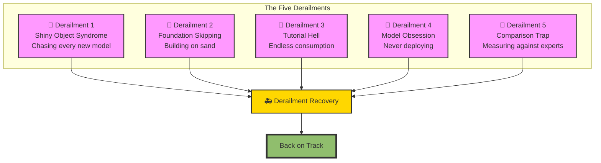
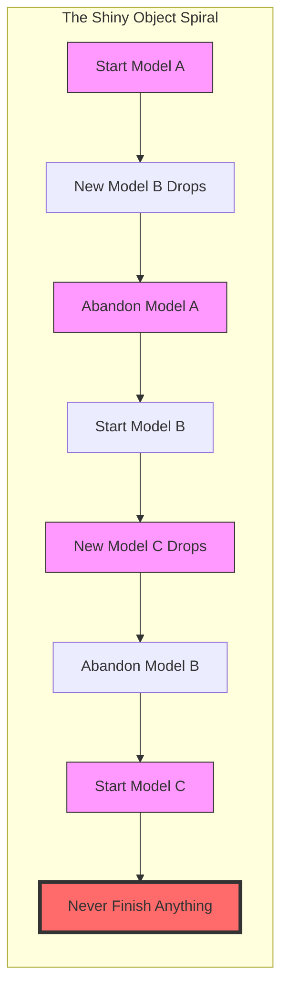
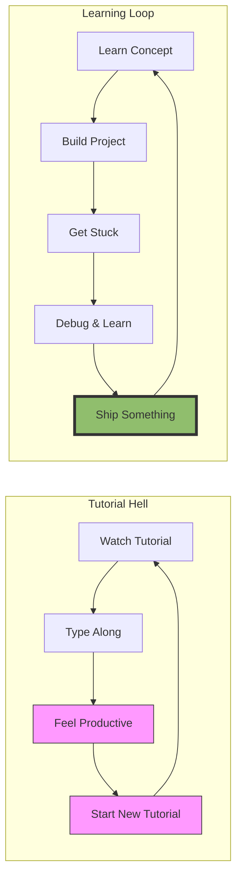
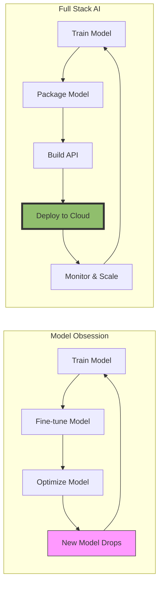
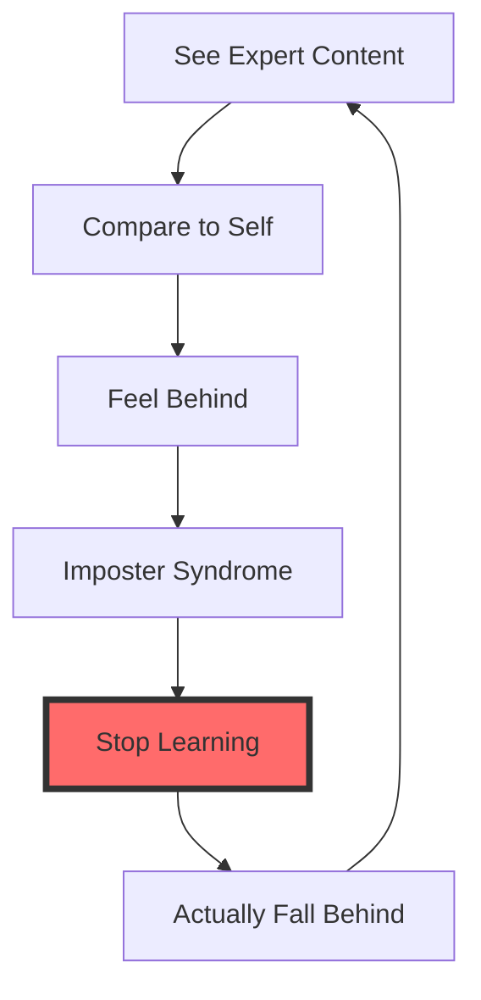
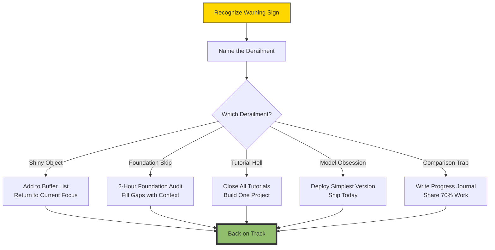

# The 2026 AI Metromap: Avoiding Derailments

## The Most Common Pitfalls That Stop AI Engineers in 2026

---

## 📖 Introduction

**Welcome to the third stop of our journey.**

You've made it through the first two stations. You understand why linear learning fails. You've chosen your express line. You have a map of where you're going.

And yet, something feels different this time.

Maybe you've been here before. You started strong—three weeks of intense learning, a notebook full of code, a project that almost worked. Then something happened. A new model dropped. Your feed filled with people building things you couldn't. The tutorial you were following stopped making sense. You opened a research paper and felt your brain shut down.

You didn't quit because AI was hard. You quit because you **derailed**.

Derailments aren't failures of intelligence or effort. They're predictable patterns that catch even the most dedicated learners. The good news? Once you see them, you can avoid them.

This story—**The 2026 AI Metromap: Avoiding Derailments**—is your derailment prevention guide. We'll diagnose the five most common traps that stop AI engineers in 2026. We'll give you early warning signs. And we'll give you escape routes when you feel yourself slipping.

**Let's learn to stay on track.**

---

## 📚 Where You Are in the Journey

### The Master Story Arc: The 2026 AI Metromap Series

- 🗺️ **[The 2026 AI Metromap: Why the Old Learning Routes Are Obsolete](#)** – A paradigm shift from linear learning to transit-system mastery. We diagnosed why traditional paths fail and introduced the metromap philosophy.

- 🧭 **[The 2026 AI Metromap: Reading the Map](#)** – Strategic navigation across the three core lines. We built decision frameworks for choosing your express line and transferring between tracks.

- 🎒 **The 2026 AI Metromap: Avoiding Derailments** – Diagnosing and preventing the "shiny object syndrome," foundation-skipping disasters, tutorial hell, model obsession without deployment skills, and the comparison trap that kills momentum. **⬅️ YOU ARE HERE**

- 🏁 **[The 2026 AI Metromap: From Passenger to Driver](#)** – Translating metromap "stops" into portfolio projects that hiring managers actually notice. We'll cover project selection, documentation strategies, and demonstrating depth while showing breadth. 🔜 *Up Next*

### The Complete Story Catalog

For a complete view of all upcoming stories across every series, visit the **[Complete 2026 AI Metromap Story Catalog](#)** – your navigation guide to every station on this journey.

---

## 🚂 The Five Derailments of AI Learning

After watching hundreds of learners navigate the AI landscape, I've identified five predictable derailment patterns. They look different on the surface, but they share a common root: **losing sight of your destination while focusing on the tracks.**

Let's explore each derailment, its early warning signs, and how to get back on track.

---

## 🚨 Derailment 1: Shiny Object Syndrome

### The Trap

You're three weeks into mastering Transformers. You're finally understanding attention mechanisms. Then DeepSeek-V4 drops. It's faster, smarter, and everyone's talking about it. You abandon Transformers to learn the new architecture. Two weeks later, a new diffusion model goes viral. You pivot again.

Six months later, you know the names of thirty models but haven't built anything with any of them.

### The Psychology

Your brain is wired to seek novelty. Every new model release triggers a dopamine hit—the promise of being "current" and "cutting-edge." But learning AI isn't about knowing every model. It's about understanding the **principles** that persist across models.

### Early Warning Signs

- You've started more than three new tutorials in the past month
- Your bookmarks folder has 50+ "to read" research papers
- You can name the latest models but can't explain how attention works
- You feel "behind" every time you open Twitter or LinkedIn

### The Escape Route

**1. Adopt the 80/20 Rule**

80% of what you need comes from 20% of the models. Instead of chasing every new release, master the architectures that matter:
- **Transformers** (the foundation of everything modern)
- **Diffusion** (the foundation of generative media)
- **One production framework** (PyTorch or TensorFlow)

Everything else is a variation or optimization.

**2. Create a "Learning Buffer"**

When a new model drops, add it to a list. Wait two weeks. If it's still relevant and solving a problem you actually have, then learn it. Most new models disappear in the noise.

**3. Set Completion Criteria**

Don't start a new topic until you've completed a project with your current one. Not "read the tutorial." A **project**. A working demo. Code you'd show an employer.

---

## 🚨 Derailment 2: Foundation Skipping

### The Trap

You're smart. You've built web apps before. You understand code. You jump straight into building an AI agent because that's where the action is.

You copy-paste code from tutorials. It runs. You feel great. Then something breaks. The model hallucinates. The response is wrong. You don't know why. You try to debug but you don't understand tokens, embeddings, or attention. You're lost. You give up.

### The Psychology

Foundation skipping feels efficient. Why spend weeks on data cleaning when you can build a chatbot today? The problem is that AI systems are **fragile**. Without foundations, you can't debug. Without foundations, you can't customize. Without foundations, you're just a glorified API caller.

```mermaid
graph TD
    subgraph "Foundation Skipping"
        A[Want to Build AI Agent] --> B[Skip Data Cleaning]
        B --> C[Skip Linear Algebra]
        C --> D[Skip Git/CLI]
        D --> E[Copy Tutorial Code]
        E --> F[Code Breaks]
        F --> G[Can't Debug]
        G --> H[Give Up]
    end
    
    subgraph "Strong Foundation"
        A2[Want to Build AI Agent] --> B2[Learn Data Cleaning]
        B2 --> C2[Learn Linear Algebra]
        C2 --> D2[Learn Git/CLI]
        D2 --> E2[Understand Architecture]
        E2 --> F2[Build Custom Solution]
        F2 --> G2[Deploy & Iterate]
    end
    
    style H fill:#ff6b6b,stroke:#333,stroke-width:4px
    style G2 fill:#90be6d,stroke:#333,stroke-width:4px
```

### Early Warning Signs

- You don't know what a token is but you're building RAG systems
- You skip data cleaning because "the model will figure it out"
- You can't explain what happens inside a transformer block
- Your debugging strategy is "run it again and hope"

### The Escape Route

**1. The Minimal Viable Foundation**

You don't need a PhD in math. But you need enough foundation to debug. The minimal viable foundation is:

- **Data Cleaning** – 80% of real-world AI work. If you skip this, you fail.
- **Git & CLI** – Can you clone, branch, merge, and run training on a remote server?
- **Linear Algebra Intuition** – What's a vector? What's a matrix multiplication? What's a dot product?
- **One Architecture Deep** – Know one model (like Transformers) inside out, not ten models superficially.

**2. The Foundation-First Transfer**

If you're already in the middle of building, pause. Go back to foundations. But do it with context.

Instead of "learning linear algebra," learn it through the lens of attention:
- "What is a query, key, value vector?"
- "How is attention calculated as a dot product?"
- "Why do we scale by sqrt(dimension)?"

Context makes foundations stick.

**3. The 2-Hour Foundation Audit**

Take two hours. Audit yourself:

- Can you load a messy CSV and clean it with pandas?
- Can you push code to GitHub, create a branch, and merge a PR?
- Can you explain what a tensor is and how shapes work?
- Can you run a command on a remote server?

If you answer no to any, that's your next station.

---

## 🚨 Derailment 3: Tutorial Hell

### The Trap

You've watched 40 hours of tutorials. You've completed 12 courses. You have certificates. But you've never built a project from scratch. When someone asks "what have you built?" you have nothing to show.

You're in tutorial hell.

### The Psychology

Tutorials feel productive. You're watching, listening, typing along. Your brain registers progress. But consumption is not creation. Tutorials give you the illusion of learning while depriving you of the **struggle** that creates real understanding.

### Early Warning Signs

- You've completed more than 3 courses without building a project
- You can explain concepts but can't implement them
- When starting a project, you immediately look for a tutorial
- Your GitHub has 0 repositories or only tutorial forks

### The Escape Route

**1. The 80/20 Rule Inverted**

80% of your time should be building. 20% consuming. For every hour of tutorial, spend four hours building.

**2. The Tutorial Bridge**

Instead of following tutorials, use them as references:

- Watch the tutorial once without typing
- Close it
- Try to build from memory
- When stuck, glance at the tutorial, then close it again

This forces your brain to **retrieve** information, not just recognize it.

**3. Project-Based Learning**

Choose a project, then learn what you need to build it:

| Instead of... | Do this... |
|---------------|------------|
| "Learn PyTorch" | "Build a sentiment classifier with PyTorch" |
| "Learn Transformers" | "Build a text summarizer from scratch" |
| "Learn RAG" | "Build a document Q&A bot for your notes" |

Projects force you to encounter real problems tutorials skip.

---

## 🚨 Derailment 4: Model Obsession (Never Deploying)

### The Trap

You have 50 models in your Jupyter notebooks. You've fine-tuned Llama, trained diffusion models, built custom transformers. They work beautifully—on your laptop, with your test data.

But you've never deployed anything. You can't. You don't know how to package a model, write an API, handle inference scaling, or monitor a system in production.

You're a researcher without a release. And in 2026, shipping matters as much as building.

### The Psychology

Deployment feels scary. It's "not my job." The model is the interesting part. But AI systems exist to be used. If you can't deploy, you can't prove value. You can't get hired. You can't ship products.

### Early Warning Signs

- Your models exist only in notebooks
- You've never built a REST API
- You don't know what ONNX, TensorRT, or quantization are
- "Deployment" means saving a pickle file

### The Escape Route

**1. The Deployment Requirement**

Before you start training a model, decide how you'll deploy it. The deployment constraints (latency, memory, cost) will inform your architecture choices. This makes you a better ML engineer, not just a model trainer.

**2. The Simplest Deployment**

Start with the simplest possible deployment:

- Save your model (PyTorch: `torch.save`, TF: `model.save`)
- Use FastAPI to wrap it in an API
- Run locally with `uvicorn`
- Add a simple HTML frontend

That's it. You've deployed.

**3. The Deployment Ladder**

Once you've done simple deployment, climb the ladder:

| Level | Skill |
|-------|-------|
| 1 | Local API with FastAPI |
| 2 | Container with Docker |
| 3 | Cloud deployment (Render, Railway, Fly.io) |
| 4 | Inference optimization (quantization, ONNX) |
| 5 | Production monitoring (Prometheus, Grafana) |
| 6 | Autoscaling and load balancing |

Each level makes you more valuable. Start at level 1 today.

---

## 🚨 Derailment 5: The Comparison Trap

### The Trap

You open LinkedIn. Someone your age just launched an AI startup. A junior developer is teaching advanced concepts you haven't learned. A tweet says "everyone should know how to build agents by now."

You feel behind. You feel inadequate. You question whether you belong.

The comparison trap is the most dangerous derailment because it attacks your belief that you can succeed. And when belief dies, learning stops.

### The Psychology

Social media shows you the **highlights** of other people's journeys. You see their wins. You don't see their late nights, their failed experiments, their imposter syndrome. You're comparing your behind-the-scenes to their highlight reel.

### Early Warning Signs

- You avoid sharing your work because "it's not good enough"
- You spend more time reading about AI than building AI
- You measure yourself against people with 5+ years experience
- You feel anxiety when opening social media

### The Escape Route

**1. The Comparison Redirect**

When you feel the comparison trap closing in, redirect:

- **Instead of** "They know more than me" → **Think** "I can learn from them"
- **Instead of** "I should be further along" → **Think** "I'm exactly where I need to be for my context"
- **Instead of** "I'll never catch up" → **Think** "I only need to be better than yesterday"

**2. The Progress Journal**

Keep a simple journal. Every day, write one thing you learned. After two weeks, look back. You'll see progress you didn't feel. The comparison trap thrives on amnesia. A journal is your memory.

**3. Share Early, Share Often**

The cure for imposter syndrome is showing up. Share your work when it's 70% done. Share your failures. Share what you're learning. The people who seem "ahead" started exactly where you are. They just started sharing earlier.

**4. The 5-Year Rule**

Ask yourself: "Will this comparison matter in 5 years?" If you're consistent—building, learning, shipping—you'll be unrecognizably advanced. The only thing that stops that trajectory is quitting because of comparison.

---

## 🚑 The Derailment Recovery Protocol

You will derail. Everyone does. The difference between those who master AI and those who don't is **recovery speed**.

When you feel yourself derailing, follow this protocol:

### Step 1: Recognize (30 Seconds)

You feel stuck. You feel behind. You feel the urge to switch. **Pause.** Name the feeling. "I'm in the comparison trap." "I'm chasing shiny objects."

### Step 2: Name the Derailment (1 Minute)

Which of the five derailments matches your feeling? Be honest.

### Step 3: Apply the Escape Route (15 Minutes)

Take the escape route for that derailment. Don't think. Just act.

### Step 4: Resume with One Action (5 Minutes)

Identify one small action that moves you forward. Not a grand plan. One thing.

---

## 📊 Takeaway from This Story

**What You Learned:**

- **The Five Derailments** – Shiny Object Syndrome, Foundation Skipping, Tutorial Hell, Model Obsession, Comparison Trap. Each has predictable patterns and escape routes.

- **Early Warning Signs** – How to recognize derailments before they take you off track.

- **The Escape Routes** – Concrete actions for each derailment, from creating a learning buffer to shipping your first deployment.

- **The Recovery Protocol** – A four-step process to get back on track quickly when you derail.

**The Most Important Lesson:**

Derailments aren't failures. They're predictable learning moments. The best AI engineers aren't the ones who never derail. They're the ones who recognize derailments early, recover quickly, and keep moving.

---

## 🔗 Navigation

- **⬅️ Previous Story:** [The 2026 AI Metromap: Reading the Map](#)

- **📚 Story Catalog:** [Complete 2026 AI Metromap Story Catalog](#) – Your complete navigation guide to all 39+ stories across every series.

- **➡️ Next Story:** [The 2026 AI Metromap: From Passenger to Driver](#) – Translating metromap "stops" into portfolio projects that hiring managers actually notice. Project selection, documentation, and demonstrating depth while showing breadth.

---

## 📝 Your Invitation

Before the next story arrives, audit your current learning:

1. **Which derailment has hit you hardest?** Be honest.

2. **What's one escape route you'll apply this week?**

3. **What's one thing you'll ship** (not just learn) in the next 7 days?

Share your answers in the comments. Accountability helps us all stay on track.

---

*Found this helpful? Clap, comment, and share which derailment you're escaping. See you at the final station of the Master Arc!* 🚇