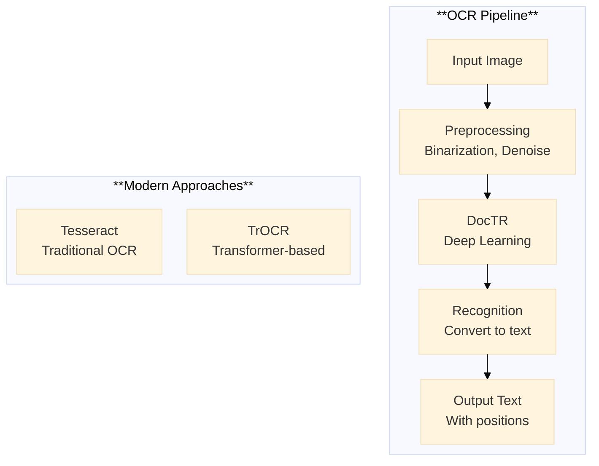

# The 2026 AI Metromap: Computer Vision Projects – From OCR to Face Recognition

## Series E: Applied AI & Agents Line | Story 5 of 15+


## 📖 Introduction

**Welcome to the fifth stop on the Applied AI & Agents Line.**

In our last four stories, we mastered prompt engineering, RAG, AI agents, and voice assistants. Your systems can now understand documents, plan actions, and converse naturally. You've built applications that interact with text and voice.

But there's a whole world of information that doesn't come in text: images. Photos, documents, faces, objects, scenes—visual data is everywhere. And AI can now see.

Computer vision has advanced dramatically. Models can read text from images (OCR), recognize faces with near-perfect accuracy, detect objects in real-time, and segment images at the pixel level. These capabilities power everything from automated document processing to security systems to self-driving cars.

This story—**The 2026 AI Metromap: Computer Vision Projects – From OCR to Face Recognition**—is your guide to building vision-powered applications. We'll master optical character recognition—extracting text from images and documents. We'll implement face detection and recognition—identifying who's who. We'll build object detection systems that locate and classify objects in real-time. And we'll explore image segmentation that understands every pixel.

**Let's give AI eyes.**

---

## 📚 Where You Are in the Journey

### The Master Story Arc: The 2026 AI Metromap Series (Complete)

- 🗺️ **[The 2026 AI Metromap: Why the Old Learning Routes Are Obsolete](#)** – A paradigm shift from linear learning to transit-system mastery.
- 🧭 **[The 2026 AI Metromap: Reading the Map](#)** – Strategic navigation across the three core lines.
- 🎒 **[The 2026 AI Metromap: Avoiding Derailments](#)** – Diagnosing and preventing the most common learning pitfalls.
- 🏁 **[The 2026 AI Metromap: From Passenger to Driver](#)** – Building your portfolio using the Metromap structure.

### Series A: Foundations Station (Complete)
### Series B: Supervised Learning Line (Complete)
### Series C: Modern Architecture Line (Complete)
### Series D: Engineering & Optimization Yard (Complete)

### Series E: Applied AI & Agents Line (15+ Stories)

- 💬 **[The 2026 AI Metromap: Prompt Engineering 101 – The Art of Talking to AI](#)** – System prompts; few-shot prompting; chain-of-thought; tree of thoughts; self-consistency; prompt templates; building robust prompts for production.

- 📚 **[The 2026 AI Metromap: RAG – Retrieval-Augmented Generation for Knowledge-Intensive Tasks](#)** – Vector databases (Chroma, Pinecone, Weaviate, Milvus); embedding models; semantic search; hybrid search; reranking; building a document Q&A system.

- 🤖 **[The 2026 AI Metromap: AI Agents & Autonomous Workflows – The Self-Driving Trains](#)** – Agent architectures (ReAct, Plan-and-Execute, AutoGPT); tool use and function calling; multi-agent systems; memory management.

- 🗣️ **[The 2026 AI Metromap: Voice Assistants & Speech Models – Making AI Talk](#)** – Speech-to-text (Whisper); text-to-speech (ElevenLabs, Coqui); voice activity detection; real-time transcription.

- 👁️ **The 2026 AI Metromap: Computer Vision Projects – From OCR to Face Recognition** – Optical character recognition (Tesseract, TrOCR); face detection and recognition; object detection (YOLO, DETR); image segmentation. **⬅️ YOU ARE HERE**

- 🎨 **[The 2026 AI Metromap: Image Generation & Editing – Diffusion Models in Practice](#)** – Stable diffusion pipelines; ControlNet; inpainting; outpainting; image-to-image; fine-tuning diffusion models with DreamBooth. 🔜 *Up Next*

**NLP & Specialized Tasks**
- 🔤 **[The 2026 AI Metromap: NLP Tasks – NER, Translation, Summarization, and Beyond](#)** – Named entity recognition; machine translation; text summarization (extractive and abstractive); sentiment analysis.

- 📈 **[The 2026 AI Metromap: Time Series Forecasting – ARIMA, LSTM, and Transformers](#)** – Classical methods (ARIMA, SARIMA); LSTM networks; Transformer for time series; forecasting stock prices, weather, and demand.

- 👍 **[The 2026 AI Metromap: Recommendation Systems – From Collaborative Filtering to Two-Tower Networks](#)** – Content-based filtering; collaborative filtering; matrix factorization; neural collaborative filtering; two-tower architectures.

**Industry Applications**
- 🏥 **[The 2026 AI Metromap: AI in Healthcare – Medical Research, Diagnostics, and Wellness](#)** – Medical imaging; EHR analysis; drug discovery; clinical decision support; regulatory considerations.

- 💰 **[The 2026 AI Metromap: AI in Finance – Banking, Insurance, and Trading](#)** – Fraud detection; algorithmic trading; credit scoring; risk management; explainable AI for compliance.

- 🎮 **[The 2026 AI Metromap: AI in Gaming, VR/AR, and Entertainment](#)** – Procedural content generation; NPC behavior with LLMs; AI-driven storytelling; game testing automation.

- 🏭 **[The 2026 AI Metromap: AI in Robotics, Manufacturing, and Supply Chain](#)** – Computer vision for quality control; predictive maintenance; autonomous navigation; warehouse optimization.

- 🌱 **[The 2026 AI Metromap: AI for Social Good – Climate Action, Agriculture, and Sustainability](#)** – Crop yield prediction; climate modeling; energy optimization; wildlife conservation; disaster response.

- 🎓 **[The 2026 AI Metromap: AI in Education – Personalized Learning and Training](#)** – Intelligent tutoring systems; automated grading; personalized content recommendation; adaptive learning paths.

### The Complete Story Catalog

For a complete view of all upcoming stories across every series, visit the **[Complete 2026 AI Metromap Story Catalog](#)**.

---

## 📄 Optical Character Recognition (OCR): Reading Text from Images

OCR extracts text from images, documents, and photos.



```python
def ocr_tesseract():
    """Implement OCR with Tesseract"""
    
    print("="*60)
    print("OCR WITH TESSERACT")
    print("="*60)
    
    print("""
    # Install: pip install pytesseract
    # Also install Tesseract binary: brew install tesseract (macOS)
    
    import pytesseract
    from PIL import Image
    import cv2
    
    # Basic OCR
    image = Image.open('document.jpg')
    text = pytesseract.image_to_string(image)
    print(text)
    
    # With bounding boxes
    boxes = pytesseract.image_to_boxes(image)
    print(boxes)
    
    # With data (confidence, position)
    data = pytesseract.image_to_data(image, output_type=pytesseract.Output.DICT)
    
    for i, text in enumerate(data['text']):
        if text.strip():
            conf = int(data['conf'][i])
            x = data['left'][i]
            y = data['top'][i]
            w = data['width'][i]
            h = data['height'][i]
            print(f"Text: '{text}', Confidence: {conf}%, Position: ({x},{y},{w},{h})")
    
    # Preprocessing for better results
    def preprocess_image(image_path):
        # Read image
        img = cv2.imread(image_path)
        
        # Convert to grayscale
        gray = cv2.cvtColor(img, cv2.COLOR_BGR2GRAY)
        
        # Apply thresholding
        _, thresh = cv2.threshold(gray, 0, 255, cv2.THRESH_BINARY + cv2.THRESH_OTSU)
        
        # Denoise
        denoised = cv2.medianBlur(thresh, 3)
        
        return denoised
    
    preprocessed = preprocess_image('document.jpg')
    text = pytesseract.image_to_string(preprocessed)
    
    # Language selection
    text = pytesseract.image_to_string(image, lang='eng+fra')  # English + French
    """)
    
    print("\n" + "="*60)
    print("TRANSFORMER-BASED OCR (TrOCR)")
    print("="*60)
    
    print("""
    # Install: pip install transformers torch
    
    from transformers import TrOCRProcessor, VisionEncoderDecoderModel
    from PIL import Image
    
    # Load model
    processor = TrOCRProcessor.from_pretrained("microsoft/trocr-base-handwritten")
    model = VisionEncoderDecoderModel.from_pretrained("microsoft/trocr-base-handwritten")
    
    # Load image
    image = Image.open('handwritten_note.jpg').convert('RGB')
    
    # Process
    pixel_values = processor(images=image, return_tensors="pt").pixel_values
    generated_ids = model.generate(pixel_values)
    text = processor.batch_decode(generated_ids, skip_special_tokens=True)[0]
    
    print(f"Recognized: {text}")
    
    # For printed text
    model = VisionEncoderDecoderModel.from_pretrained("microsoft/trocr-base-printed")
    
    # Available models:
    # - trocr-base-printed: Printed text
    # - trocr-base-handwritten: Handwritten text
    # - trocr-large-printed: Higher accuracy
    """)
    
    print("\n" + "="*60)
    print("OCR COMPARISON")
    print("="*60)
    
    comparison = [
        ("Tesseract", "Traditional", "Fast, offline", "Good for clean documents"),
        ("TrOCR", "Transformer", "Accurate, handles handwriting", "Higher accuracy"),
        ("Google Vision API", "Cloud", "Best accuracy, expensive", "Production, high-volume"),
        ("Azure Computer Vision", "Cloud", "Good accuracy, integrated", "Microsoft ecosystem"),
        ("AWS Textract", "Cloud", "Forms, tables", "Document processing")
    ]
    
    print(f"\n{'Engine':<18} {'Type':<12} {'Pros':<20} {'Best For':<20}")
    print("-"*75)
    for engine, type_, pros, best in comparison:
        print(f"{engine:<18} {type_:<12} {pros:<20} {best:<20}")

ocr_tesseract()
```

---

## 👤 Face Detection and Recognition

Face detection finds faces in images. Face recognition identifies who they are.

```python
def face_detection_recognition():
    """Implement face detection and recognition"""
    
    print("="*60)
    print("FACE DETECTION")
    print("="*60)
    
    print("""
    # Install: pip install opencv-python face-recognition
    
    import cv2
    import face_recognition
    
    # Using OpenCV Haar Cascades (fast, CPU)
    face_cascade = cv2.CascadeClassifier(cv2.data.haarcascades + 'haarcascade_frontalface_default.xml')
    
    image = cv2.imread('group_photo.jpg')
    gray = cv2.cvtColor(image, cv2.COLOR_BGR2GRAY)
    
    faces = face_cascade.detectMultiScale(gray, scaleFactor=1.1, minNeighbors=5)
    
    for (x, y, w, h) in faces:
        cv2.rectangle(image, (x, y), (x+w, y+h), (0, 255, 0), 2)
    
    # Using face_recognition library (more accurate)
    image = face_recognition.load_image_file('group_photo.jpg')
    face_locations = face_recognition.face_locations(image)
    
    for (top, right, bottom, left) in face_locations:
        print(f"Face found at: top={top}, right={right}, bottom={bottom}, left={left}")
    
    # With facial landmarks
    landmarks = face_recognition.face_landmarks(image)
    for landmark in landmarks:
        print(f"Left eye: {landmark['left_eye']}")
        print(f"Right eye: {landmark['right_eye']}")
        print(f"Nose: {landmark['nose_tip']}")
    
    # Using MTCNN (more accurate, slower)
    from mtcnn import MTCNN
    
    detector = MTCNN()
    faces = detector.detect_faces(image)
    
    for face in faces:
        print(f"Confidence: {face['confidence']}")
        print(f"Bounding box: {face['box']}")
        print(f"Keypoints: {face['keypoints']}")
    """)
    
    print("\n" + "="*60)
    print("FACE RECOGNITION")
    print("="*60)
    
    print("""
    # Face recognition (identifying specific people)
    import face_recognition
    
    # Load known faces
    known_image = face_recognition.load_image_file("obama.jpg")
    known_encoding = face_recognition.face_encodings(known_image)[0]
    
    known_faces = {
        "Barack Obama": known_encoding
    }
    
    # Load unknown image
    unknown_image = face_recognition.load_image_file("unknown.jpg")
    unknown_encodings = face_recognition.face_encodings(unknown_image)
    
    for encoding in unknown_encodings:
        # Compare with known faces
        matches = face_recognition.compare_faces(list(known_faces.values()), encoding)
        
        if True in matches:
            matched_idx = matches.index(True)
            name = list(known_faces.keys())[matched_idx]
            print(f"Found: {name}")
        else:
            print("Unknown person")
        
        # Get similarity scores
        distances = face_recognition.face_distance(list(known_faces.values()), encoding)
        print(f"Distances: {distances}")
    
    # Face recognition with deep learning (DeepFace)
    from deepface import DeepFace
    
    # Verify if two faces match
    result = DeepFace.verify("img1.jpg", "img2.jpg")
    print(f"Verified: {result['verified']}")
    print(f"Distance: {result['distance']}")
    
    # Find faces in database
    df = DeepFace.find(img_path="face.jpg", db_path="database/")
    """)
    
    print("\n" + "="*60)
    print("FACE DETECTION COMPARISON")
    print("="*60)
    
    comparison = [
        ("Haar Cascades", "Fastest, CPU", "Good", "Real-time, low-resource"),
        ("face_recognition", "Fast, accurate", "Very Good", "General purpose"),
        ("MTCNN", "Slower, accurate", "Excellent", "Small batches, accuracy"),
        ("RetinaFace", "GPU, state-of-art", "Best", "Production, high accuracy"),
        ("DeepFace", "Deep learning", "Excellent", "Recognition + analysis")
    ]
    
    print(f"\n{'Method':<18} {'Speed':<20} {'Accuracy':<12} {'Best For':<20}")
    print("-"*75)
    for method, speed, acc, best in comparison:
        print(f"{method:<18} {speed:<20} {acc:<12} {best:<20}")

face_detection_recognition()
```

---

## 🎯 Object Detection: YOLO and DETR

Object detection finds and classifies multiple objects in an image.

```python
def object_detection():
    """Implement object detection with YOLO and DETR"""
    
    print("="*60)
    print("OBJECT DETECTION WITH YOLO")
    print("="*60)
    
    print("""
    # Install: pip install ultralytics
    
    from ultralytics import YOLO
    import cv2
    
    # Load model (YOLOv8)
    model = YOLO('yolov8n.pt')  # nano, small, medium, large, x-large
    
    # Detect objects
    results = model('image.jpg')
    
    # Show results
    for result in results:
        boxes = result.boxes
        for box in boxes:
            x1, y1, x2, y2 = box.xyxy[0].tolist()
            conf = box.conf[0].item()
            cls = int(box.cls[0].item())
            label = model.names[cls]
            print(f"{label}: {conf:.2f} at ({x1:.0f}, {y1:.0f}, {x2:.0f}, {y2:.0f})")
    
    # Real-time video detection
    cap = cv2.VideoCapture(0)
    
    while True:
        ret, frame = cap.read()
        results = model(frame)
        
        # Annotate frame
        annotated = results[0].plot()
        cv2.imshow('YOLO', annotated)
        
        if cv2.waitKey(1) & 0xFF == ord('q'):
            break
    
    cap.release()
    cv2.destroyAllWindows()
    
    # Different model sizes
    models = {
        "yolov8n.pt": "nano - fastest, lowest accuracy",
        "yolov8s.pt": "small - good balance",
        "yolov8m.pt": "medium - higher accuracy",
        "yolov8l.pt": "large - best accuracy, slower",
        "yolov8x.pt": "x-large - highest accuracy"
    }
    """)
    
    print("\n" + "="*60)
    print("OBJECT DETECTION WITH DETR")
    print("="*60)
    
    print("""
    # Transformer-based object detection
    from transformers import DetrImageProcessor, DetrForObjectDetection
    import torch
    from PIL import Image
    
    # Load model
    processor = DetrImageProcessor.from_pretrained("facebook/detr-resnet-50")
    model = DetrForObjectDetection.from_pretrained("facebook/detr-resnet-50")
    
    # Load image
    image = Image.open('image.jpg')
    
    # Process
    inputs = processor(images=image, return_tensors="pt")
    outputs = model(**inputs)
    
    # Post-process
    target_sizes = torch.tensor([image.size[::-1]])
    results = processor.post_process_object_detection(
        outputs, target_sizes=target_sizes, threshold=0.9
    )[0]
    
    for score, label, box in zip(results["scores"], results["labels"], results["boxes"]):
        box = [round(i, 2) for i in box.tolist()]
        print(f"Detected {model.config.id2label[label.item()]} with confidence {round(score.item(), 3)} at {box}")
    """)
    
    print("\n" + "="*60)
    print("OBJECT DETECTION COMPARISON")
    print("="*60)
    
    comparison = [
        ("YOLOv8", "Real-time, 30-150 FPS", "Good", "Video, real-time"),
        ("DETR", "Transformer, 10-20 FPS", "Excellent", "Accuracy-critical"),
        ("Faster R-CNN", "Moderate, 5-15 FPS", "Very Good", "High accuracy"),
        ("SSD", "Fast, 20-50 FPS", "Good", "Mobile, real-time"),
        ("EfficientDet", "Efficient, 10-30 FPS", "Very Good", "Edge devices")
    ]
    
    print(f"\n{'Method':<12} {'Speed':<20} {'Accuracy':<12} {'Best For':<20}")
    print("-"*70)
    for method, speed, acc, best in comparison:
        print(f"{method:<12} {speed:<20} {acc:<12} {best:<20}")

object_detection()
```

---

## 🖼️ Image Segmentation: Understanding Every Pixel

Image segmentation classifies every pixel in an image.

```python
def image_segmentation():
    """Implement image segmentation"""
    
    print("="*60)
    print("IMAGE SEGMENTATION")
    print("="*60)
    
    print("""
    # Semantic Segmentation (every pixel gets a class)
    from transformers import SegformerImageProcessor, SegformerForSemanticSegmentation
    from PIL import Image
    import torch
    
    processor = SegformerImageProcessor.from_pretrained("nvidia/segformer-b0-finetuned-ade-512-512")
    model = SegformerForSemanticSegmentation.from_pretrained("nvidia/segformer-b0-finetuned-ade-512-512")
    
    image = Image.open('street_scene.jpg')
    inputs = processor(images=image, return_tensors="pt")
    
    with torch.no_grad():
        outputs = model(**inputs)
        logits = outputs.logits
    
    # Get predictions
    upsampled_logits = torch.nn.functional.interpolate(
        logits, size=image.size[::-1], mode="bilinear", align_corners=False
    )
    pred = upsampled_logits.argmax(dim=1)[0].numpy()
    
    # Visualize (each color represents a class)
    # Classes: road, sidewalk, building, car, person, etc.
    
    # Instance Segmentation (separate instances of same class)
    from ultralytics import YOLO
    
    model = YOLO('yolov8n-seg.pt')  # Segmentation model
    
    results = model('group_photo.jpg')
    
    for result in results:
        # Masks for each detected object
        if result.masks is not None:
            masks = result.masks.data
            for i, mask in enumerate(masks):
                print(f"Object {i} mask shape: {mask.shape}")
    
    # Panoptic Segmentation (semantic + instance)
    # Using Detectron2
    from detectron2.engine import DefaultPredictor
    from detectron2.config import get_cfg
    from detectron2 import model_zoo
    
    cfg = get_cfg()
    cfg.merge_from_file(model_zoo.get_config_file("COCO-PanopticSegmentation/panoptic_fpn_R_50_3x.yaml"))
    cfg.MODEL.WEIGHTS = model_zoo.get_checkpoint_url("COCO-PanopticSegmentation/panoptic_fpn_R_50_3x.yaml")
    predictor = DefaultPredictor(cfg)
    
    output = predictor(image)
    panoptic_result = output["panoptic_seg"][0]
    """)
    
    print("\n" + "="*60)
    print("SEGMENTATION TYPES")
    print("="*60)
    
    types = [
        ("Semantic", "Every pixel = class", "Road, sky, building", "Autonomous driving"),
        ("Instance", "Separate objects", "Car 1, Car 2, Person 1", "Object counting"),
        ("Panoptic", "Semantic + Instance", "Everything classified + separated", "Scene understanding")
    ]
    
    print(f"\n{'Type':<12} {'Description':<25} {'Example':<20} {'Use Case':<20}")
    print("-"*80)
    for type_, desc, example, use in types:
        print(f"{type_:<12} {desc:<25} {example:<20} {use:<20}")

image_segmentation()
```

---

## 🔧 Complete Computer Vision Pipeline

Let's build a complete vision pipeline for document processing.

```python
def document_processing_pipeline():
    """Complete document processing pipeline"""
    
    print("="*60)
    print("DOCUMENT PROCESSING PIPELINE")
    print("="*60)
    
    print("""
    import cv2
    import pytesseract
    from PIL import Image
    import numpy as np
    
    class DocumentProcessor:
        \"\"\"End-to-end document processing\"\"\"
        
        def __init__(self):
            self.ocr_engine = pytesseract
            self.face_detector = cv2.CascadeClassifier(
                cv2.data.haarcascades + 'haarcascade_frontalface_default.xml'
            )
        
        def preprocess(self, image):
            \"\"\"Enhance image for OCR\"\"\"
            # Convert to grayscale
            gray = cv2.cvtColor(image, cv2.COLOR_BGR2GRAY)
            
            # Denoise
            denoised = cv2.medianBlur(gray, 3)
            
            # Threshold
            _, thresh = cv2.threshold(denoised, 0, 255, cv2.THRESH_BINARY + cv2.THRESH_OTSU)
            
            # Deskew
            coords = np.column_stack(np.where(thresh > 0))
            angle = cv2.minAreaRect(coords)[-1]
            if angle < -45:
                angle = -(90 + angle)
            else:
                angle = -angle
            
            (h, w) = thresh.shape[:2]
            center = (w // 2, h // 2)
            M = cv2.getRotationMatrix2D(center, angle, 1.0)
            rotated = cv2.warpAffine(thresh, M, (w, h), flags=cv2.INTER_CUBIC, borderMode=cv2.BORDER_REPLICATE)
            
            return rotated
        
        def extract_text(self, image):
            \"\"\"Extract text from document\"\"\"            
            # Preprocess
            processed = self.preprocess(image)
            
            # OCR
            text = self.ocr_engine.image_to_string(processed)
            
            # Get text with positions
            data = self.ocr_engine.image_to_data(processed, output_type=pytesseract.Output.DICT)
            
            return {
                "text": text,
                "words": data['text'],
                "positions": {
                    'x': data['left'],
                    'y': data['top'],
                    'w': data['width'],
                    'h': data['height'],
                    'conf': data['conf']
                }
            }
        
        def detect_faces(self, image):
            \"\"\"Detect faces in document (e.g., ID card)\"\"\"
            gray = cv2.cvtColor(image, cv2.COLOR_BGR2GRAY)
            faces = self.face_detector.detectMultiScale(gray, scaleFactor=1.1, minNeighbors=5)
            
            face_images = []
            for (x, y, w, h) in faces:
                face = image[y:y+h, x:x+w]
                face_images.append(face)
            
            return face_images
        
        def extract_fields(self, image):
            \"\"\"Extract structured fields from document\"\"\"            
            text_data = self.extract_text(image)
            
            # Use regex to find patterns
            import re
            
            fields = {}
            
            # Look for dates
            date_pattern = r'\\d{1,2}[/-]\\d{1,2}[/-]\\d{4}'
            dates = re.findall(date_pattern, text_data['text'])
            if dates:
                fields['dates'] = dates
            
            # Look for emails
            email_pattern = r'[\\w.-]+@[\\w.-]+\\.\\w+'
            emails = re.findall(email_pattern, text_data['text'])
            if emails:
                fields['emails'] = emails
            
            # Look for phone numbers
            phone_pattern = r'\\+?\\d{1,3}[-.]?\\d{3}[-.]?\\d{4}'
            phones = re.findall(phone_pattern, text_data['text'])
            if phones:
                fields['phones'] = phones
            
            return fields
        
        def process(self, image_path):
            \"\"\"Complete document processing\"\"\"
            image = cv2.imread(image_path)
            
            results = {
                "text": self.extract_text(image),
                "faces": self.detect_faces(image),
                "fields": self.extract_fields(image)
            }
            
            return results
    
    # Usage
    processor = DocumentProcessor()
    results = processor.process('id_card.jpg')
    
    print("Extracted Text:", results['text']['text'])
    print("Found Fields:", results['fields'])
    print("Found Faces:", len(results['faces']))
    """)
    
    print("\n" + "="*60)
    print("APPLICATIONS")
    print("="*60)
    
    apps = [
        ("ID Card Scanning", "Extract name, DOB, ID number"),
        ("Receipt Processing", "Extract items, prices, total"),
        ("Form Automation", "Fill forms from scanned documents"),
        ("Document Classification", "Identify document type"),
        ("Redaction", "Automatically blur faces, PII")
    ]
    
    for app, desc in apps:
        print(f"  • {app}: {desc}")

document_processing_pipeline()
```

---

## 📊 Evaluation and Optimization

```python
def vision_evaluation():
    """Evaluate computer vision systems"""
    
    print("="*60)
    print("VISION SYSTEM EVALUATION")
    print("="*60)
    
    print("\n" + "="*60)
    print("KEY METRICS")
    print("="*60)
    
    metrics = [
        ("Accuracy", "% correct predictions", "Detection, classification"),
        ("Precision/Recall", "False positives vs false negatives", "Object detection"),
        ("IoU", "Intersection over Union", "Segmentation, detection"),
        ("FPS", "Frames per second", "Real-time systems"),
        ("mAP", "Mean Average Precision", "Object detection"),
        ("CER/WER", "Character/Word Error Rate", "OCR")
    ]
    
    print(f"\n{'Metric':<15} {'Description':<30} {'Use Case':<25}")
    print("-"*75)
    for metric, desc, use in metrics:
        print(f"{metric:<15} {desc:<30} {use:<25}")
    
    print("\n" + "="*60)
    print("OPTIMIZATION TECHNIQUES")
    print("="*60)
    
    optimizations = [
        "• Model Quantization: INT8 for 4x smaller, 2x faster",
        "• Model Pruning: Remove 50% of weights with minimal accuracy loss",
        "• Knowledge Distillation: Train smaller student model",
        "• GPU/TPU Acceleration: Use hardware acceleration",
        "• Batch Processing: Process multiple images at once",
        "• Input Resizing: Smaller images = faster inference"
    ]
    
    for opt in optimizations:
        print(f"  • {opt}")
    
    print("\n" + "="*60)
    print("HARDWARE COMPARISON")
    print("="*60)
    
    hardware = [
        ("CPU", "Slow, 1-10 FPS", "Development, low volume"),
        ("NVIDIA GPU", "Fast, 30-150 FPS", "Production, real-time"),
        ("Jetson/Edge", "Moderate, 10-30 FPS", "Edge devices, robots"),
        ("TPU", "Very Fast", "Cloud, batch processing")
    ]
    
    print(f"\n{'Hardware':<15} {'Speed':<20} {'Best For':<25}")
    print("-"*65)
    for hw, speed, best in hardware:
        print(f"{hw:<15} {speed:<20} {best:<25}")

vision_evaluation()
```

---

## 📊 Takeaway from This Story

**What You Learned:**

- **OCR (Optical Character Recognition)** – Tesseract (traditional, fast), TrOCR (transformer-based, accurate), Cloud APIs (best accuracy). Preprocessing improves results.

- **Face Detection** – Haar Cascades (fast), face_recognition (accurate), MTCNN (more accurate), DeepFace (deep learning). Choose based on speed vs accuracy.

- **Face Recognition** – Extract face encodings, compare with known faces. Verify identity with distance thresholds.

- **Object Detection** – YOLO (real-time, 30-150 FPS), DETR (transformer-based, accurate). Multiple model sizes for different speed/accuracy trade-offs.

- **Image Segmentation** – Semantic (pixel classification), Instance (separate objects), Panoptic (both). SegFormer for semantic, YOLO for instance.

- **Document Processing Pipeline** – Preprocess → OCR → Face Detection → Field Extraction → Structured Output.

- **Evaluation** – Accuracy, precision/recall, IoU, FPS, mAP. Optimize with quantization, pruning, hardware acceleration.

---

## 🔗 Navigation

- **⬅️ Previous Story:** [The 2026 AI Metromap: Voice Assistants & Speech Models – Making AI Talk](#)

- **📚 Series E Catalog:** [Series E: Applied AI & Agents Line](#) – View all 15+ stories in this series.

- **📚 Complete Story Catalog:** [Complete 2026 AI Metromap Story Catalog](#) – Your navigation guide to all 39+ stories.

- **➡️ Next Story:** **[The 2026 AI Metromap: Image Generation & Editing – Diffusion Models in Practice](#)** – Stable diffusion pipelines; ControlNet; inpainting; outpainting; image-to-image; fine-tuning diffusion models with DreamBooth.

---

## 📝 Your Invitation

Before the next story arrives, build a computer vision application:

1. **Set up OCR** – Install Tesseract. Extract text from a scanned document. Add preprocessing.

2. **Implement face detection** – Detect faces in a group photo. Draw bounding boxes.

3. **Build object detection** – Use YOLO to detect objects in an image. Try different model sizes.

4. **Create a document processor** – Combine OCR and face detection. Extract text and detect faces from ID cards.

5. **Optimize for speed** – Quantize a model. Compare inference time before and after.

**You've given AI eyes. Next stop: Image Generation!**

---

*Found this helpful? Clap, comment, and share your vision projects. Next stop: Image Generation!* 🚇