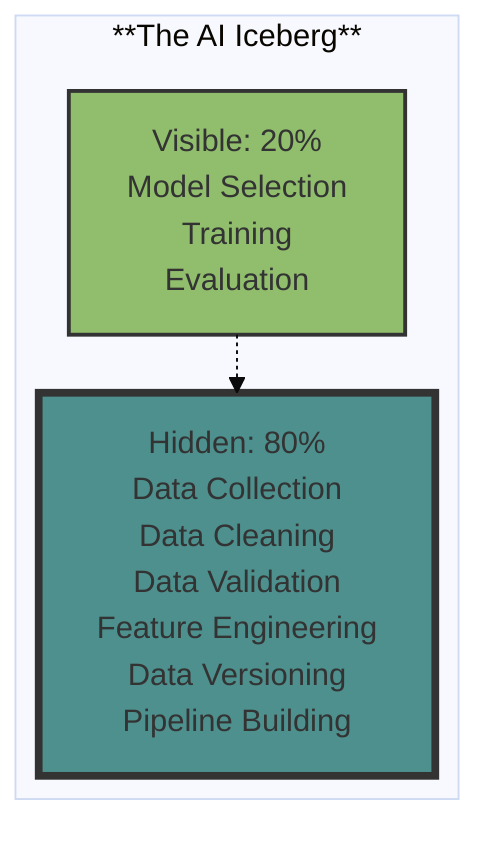
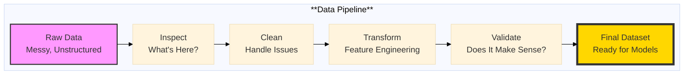

# The 2026 AI Metromap: Data Cleaning & Visualization – Turning Raw Data into Tracks

## Series A: Foundations Station | Story 4 of 5


## 📖 Introduction

**Welcome to the fourth stop at Foundations Station.**

In our last story, we learned the language of the map—linear algebra. You now understand vectors, matrices, dot products, and eigenvalues. You can read the equations in research papers without your brain shutting down.

Now we need to talk about what you actually do with that understanding.

Here's the reality that every AI engineer discovers: **You will spend 80% of your time on data.** Not models. Not algorithms. Not hyperparameter tuning. Data.

- Loading data
- Cleaning data
- Understanding data
- Validating data
- Transforming data
- Visualizing data

The models are the glamorous part. The data is the work.

This story—**The 2026 AI Metromap: Data Cleaning & Visualization – Turning Raw Data into Tracks**—is your guide to mastering the work that actually builds AI systems. We'll cover practical data wrangling with modern tools (pandas, polars, DuckDB). We'll show you how to handle the real-world messiness that tutorials skip. And we'll give you visualization techniques that turn raw data into understanding.

**Let's turn raw data into tracks.**

---

## 📚 Where You Are in the Journey

### The Master Story Arc: The 2026 AI Metromap Series (Complete)

- 🗺️ **[The 2026 AI Metromap: Why the Old Learning Routes Are Obsolete](#)** – A paradigm shift from linear learning to transit-system mastery.
- 🧭 **[The 2026 AI Metromap: Reading the Map](#)** – Strategic navigation across the three core lines.
- 🎒 **[The 2026 AI Metromap: Avoiding Derailments](#)** – Diagnosing and preventing the most common learning pitfalls.
- 🏁 **[The 2026 AI Metromap: From Passenger to Driver](#)** – Building your portfolio using the Metromap structure.

### Series A: Foundations Station (5 Stories)

- 🏗️ **[The 2026 AI Metromap: Foundations Station – Why Data Cleaning and Git Are Your Board Games, Not Just Chores](#)** – Reframing foundational skills as strategic enablers; practical data cleaning; Git workflows for model versioning.

- 🖥️ **[The 2026 AI Metromap: Command Line & Version Control – Navigating the Terminal Like a Conductor](#)** – Essential CLI tools for AI development; Git branching strategies; SSH and remote GPU training setup.

- 🧮 **[The 2026 AI Metromap: Linear Algebra for ML – The Language of the Map](#)** – Vectors, matrices, and tensors explained through intuition; dot products as attention mechanisms; eigenvalues and PCA.

- 📊 **The 2026 AI Metromap: Data Cleaning & Visualization – Turning Raw Data into Tracks** – Real-world data wrangling with pandas, polars, and DuckDB; handling missing values, outliers, and imbalanced datasets. **⬅️ YOU ARE HERE**

- 🔄 **[The 2026 AI Metromap: Ethics & Responsible AI – The Safety Systems of the Metro](#)** – Bias detection and mitigation; interpretability; privacy-preserving AI; regulatory compliance. 🔜 *Up Next*

### The Complete Story Catalog

For a complete view of all upcoming stories across every series, visit the **[Complete 2026 AI Metromap Story Catalog](#)**.

---

## 🚂 The 80% Reality: Why Data Work Defines Your Success

You've seen the glamorous demos. A few lines of code. A pretrained model. Beautiful results. It looks like AI is magic.

It's not.



**The Reality:**

- **Data determines model quality.** A brilliant model on bad data is useless. A simple model on good data wins.

- **Data cleaning is where you earn your value.** Anyone can call `model.fit()`. Few can wrangle messy, real-world data.

- **Data understanding prevents disaster.** If you don't understand your data, you won't notice when your model learns the wrong thing.

---

## 🎮 The Data Workflow: From Raw to Ready

Think of data work as a pipeline. Each stage transforms raw messiness into structured tracks.



Let's explore each stage with modern Python tools.

---

## 🔧 Stage 1: Inspect – Understanding What You Have

Before you clean anything, you need to understand what you're working with.

### Tool 1: pandas – The Classic

```python
import pandas as pd

# Load your data
df = pd.read_csv('customer_data.csv')

# Quick inspection
print(df.shape)                    # (10000, 15) - rows, columns
print(df.head())                   # First 5 rows
print(df.info())                   # Data types, non-null counts
print(df.describe())               # Statistical summary

# Check for missing values
print(df.isnull().sum())           # Missing per column
print(df.isnull().sum().sum())     # Total missing

# Check unique values
print(df['churn'].value_counts())  # Class distribution
print(df['country'].nunique())     # Number of unique countries
```

### Tool 2: polars – The Modern Alternative (Faster)

```python
import polars as pl

# Load with polars (faster, more memory efficient)
df = pl.read_csv('customer_data.csv')

# Similar inspection
print(df.shape)
print(df.head())
print(df.describe())
print(df.null_count())             # Missing values per column
```

### Tool 3: DuckDB – SQL on Your Data

```python
import duckdb

# Run SQL queries directly on files or dataframes
duckdb.sql("""
    SELECT 
        COUNT(*) as total_rows,
        COUNT(DISTINCT customer_id) as unique_customers,
        AVG(age) as avg_age,
        SUM(CASE WHEN churn = 1 THEN 1 ELSE 0 END) as churned
    FROM 'customer_data.csv'
""").show()
```

### What to Look For During Inspection

| Question | Why It Matters | Red Flags |
|----------|----------------|-----------|
| How many rows/columns? | Scale of the problem | Too few samples? Too many features? |
| What are the data types? | Correctness | Numeric columns as strings? Dates as text? |
| How many missing values? | Data quality | >5% missing needs strategy |
| What's the class distribution? | Imbalance | 90/10 split? |
| What are the ranges? | Outliers | Age = 999? Negative income? |
| Are there duplicates? | Integrity | Identical rows? Duplicate IDs? |

---

## 🧹 Stage 2: Clean – Handling the Mess

Real data is messy. Here's how to handle the most common issues.

### Issue 1: Missing Values

```python
import pandas as pd
import numpy as np

df = pd.read_csv('customer_data.csv')

# Strategy 1: Understand why values are missing
# Check if missing correlates with target
missing_mask = df['income'].isna()
churn_rate_missing = df[missing_mask]['churn'].mean()
churn_rate_present = df[~missing_mask]['churn'].mean()
print(f"Churn when income missing: {churn_rate_missing:.2%}")
print(f"Churn when income present: {churn_rate_present:.2%}")

# Strategy 2: Drop if missing is random and minimal (<5%)
if df['income'].isnull().mean() < 0.05:
    df = df.dropna(subset=['income'])

# Strategy 3: Impute with central tendency
# - Mean for normal distributions
# - Median for skewed distributions
df['income'] = df['income'].fillna(df['income'].median())

# Strategy 4: Create missing indicator (for when missing is meaningful)
df['income_missing'] = df['income'].isna()
df['income'] = df['income'].fillna(df['income'].median())

# Strategy 5: Forward fill for time series
df['price'] = df['price'].fillna(method='ffill')
```

### Issue 2: Outliers

```python
# Detect outliers with IQR method
Q1 = df['age'].quantile(0.25)
Q3 = df['age'].quantile(0.75)
IQR = Q3 - Q1
lower_bound = Q1 - 1.5 * IQR
upper_bound = Q3 + 1.5 * IQR

outliers = df[(df['age'] < lower_bound) | (df['age'] > upper_bound)]
print(f"Outliers: {len(outliers)} rows")

# Strategy 1: Cap outliers (winsorization)
df['age'] = df['age'].clip(lower=lower_bound, upper=upper_bound)

# Strategy 2: Transform to reduce impact
df['age_log'] = np.log1p(df['age'] - lower_bound + 1)

# Strategy 3: Investigate first - outliers may be real!
# Age = 0 might be missing data, not a real outlier
# Income = 1,000,000 might be a real high earner
```

### Issue 3: Inconsistent Formats

```python
# Dates
df['date'] = pd.to_datetime(df['date'], format='%Y-%m-%d')

# Categories
df['country'] = df['country'].astype('category')

# Strings to lowercase for consistency
df['city'] = df['city'].str.lower().str.strip()

# Standardize phone numbers
df['phone'] = df['phone'].str.replace(r'\D', '', regex=True)

# Fix typos in categories
df['status'] = df['status'].replace({
    'actve': 'active',
    'activ': 'active',
    'inactve': 'inactive'
})
```

### Issue 4: Duplicates

```python
# Check for duplicates
duplicates = df.duplicated().sum()
print(f"Duplicate rows: {duplicates}")

# Check for duplicates on key columns
duplicates_by_id = df.duplicated(subset=['customer_id']).sum()
print(f"Duplicate customer IDs: {duplicates_by_id}")

# Remove duplicates
df = df.drop_duplicates(subset=['customer_id'], keep='first')
```

### Issue 5: Imbalanced Classes

```python
# Check imbalance
churn_distribution = df['churn'].value_counts()
print(churn_distribution)

# Strategy 1: Use class weights in model
from sklearn.utils.class_weight import compute_class_weight
class_weights = compute_class_weight(
    'balanced',
    classes=np.unique(df['churn']),
    y=df['churn']
)

# Strategy 2: Oversample minority class
from sklearn.utils import resample
df_majority = df[df['churn'] == 0]
df_minority = df[df['churn'] == 1]

df_minority_upsampled = resample(
    df_minority,
    replace=True,
    n_samples=len(df_majority),
    random_state=42
)

df_balanced = pd.concat([df_majority, df_minority_upsampled])

# Strategy 3: Undersample majority class
df_majority_downsampled = resample(
    df_majority,
    replace=False,
    n_samples=len(df_minority),
    random_state=42
)

df_balanced = pd.concat([df_majority_downsampled, df_minority])
```

---

## 🔄 Stage 3: Transform – Feature Engineering

Clean data is ready for transformation. This is where you create the features that models actually learn from.

### Feature Engineering Strategies

```python
import pandas as pd
import numpy as np

# 1. Create interaction features
df['age_income_interaction'] = df['age'] * df['income']

# 2. Extract from dates
df['day_of_week'] = df['date'].dt.dayofweek
df['month'] = df['date'].dt.month
df['is_weekend'] = df['day_of_week'].isin([5, 6]).astype(int)

# 3. Binning numerical features
df['age_group'] = pd.cut(df['age'], 
                          bins=[0, 25, 35, 50, 100], 
                          labels=['young', 'adult', 'middle', 'senior'])

# 4. Frequency encoding for high-cardinality categories
freq_encoding = df['city'].value_counts(normalize=True)
df['city_freq'] = df['city'].map(freq_encoding)

# 5. Aggregations for group data
# Customer's average transaction
customer_avg = df.groupby('customer_id')['transaction_amount'].mean()
df['avg_transaction'] = df['customer_id'].map(customer_avg)

# 6. Rolling windows for time series
df['7_day_avg'] = df.groupby('customer_id')['amount'].transform(
    lambda x: x.rolling(7, min_periods=1).mean()
)
```

### Feature Scaling (Essential for Neural Networks)

```python
from sklearn.preprocessing import StandardScaler, MinMaxScaler

# Standardization (mean=0, std=1) - for normal distributions
scaler = StandardScaler()
df['age_scaled'] = scaler.fit_transform(df[['age']])

# Normalization (range 0-1) - for bounded features
scaler = MinMaxScaler()
df['income_normalized'] = scaler.fit_transform(df[['income']])

# Log transform for skewed distributions
df['income_log'] = np.log1p(df['income'])
```

---

## 📊 Stage 4: Validate – Does It Make Sense?

Before training models, validate that your data is ready.

### Validation Checklist

```python
# 1. Check for data leakage
# Are future values leaking into training?
# Are features created using information from the entire dataset?

# 2. Check train/test split consistency
from sklearn.model_selection import train_test_split

X_train, X_test, y_train, y_test = train_test_split(
    X, y, test_size=0.2, random_state=42, stratify=y
)

# Verify distributions match
print("Training churn rate:", y_train.mean())
print("Test churn rate:", y_test.mean())

# 3. Check for NaN in final dataset
assert not X_train.isnull().any().any(), "NaN found in training data"
assert not X_test.isnull().any().any(), "NaN found in test data"

# 4. Check feature types
print(X_train.dtypes)

# 5. Check feature ranges
print(X_train.describe())
```

---

## 📈 Stage 5: Visualize – See What Your Data Says

Visualization is how you understand your data before modeling and diagnose problems after.

### Essential Visualizations

```python
import matplotlib.pyplot as plt
import seaborn as sns

# 1. Distribution of target variable
plt.figure(figsize=(8, 5))
sns.countplot(data=df, x='churn')
plt.title('Class Distribution')
plt.show()

# 2. Missing values heatmap
plt.figure(figsize=(10, 6))
sns.heatmap(df.isnull(), cbar=False, yticklabels=False)
plt.title('Missing Values Pattern')
plt.show()

# 3. Correlation matrix
plt.figure(figsize=(12, 10))
correlation = df.select_dtypes(include=[np.number]).corr()
sns.heatmap(correlation, annot=True, cmap='coolwarm', center=0)
plt.title('Feature Correlations')
plt.show()

# 4. Distribution of numerical features
fig, axes = plt.subplots(2, 3, figsize=(15, 10))
for ax, col in zip(axes.flatten(), numerical_cols[:6]):
    sns.histplot(data=df, x=col, hue='churn', ax=ax)
    ax.set_title(f'{col} Distribution by Churn')
plt.tight_layout()
plt.show()

# 5. Box plots for outlier detection
fig, axes = plt.subplots(2, 3, figsize=(15, 10))
for ax, col in zip(axes.flatten(), numerical_cols[:6]):
    sns.boxplot(data=df, y=col, ax=ax)
    ax.set_title(f'{col} Box Plot')
plt.tight_layout()
plt.show()

# 6. Pair plot for relationships (use on sample)
sns.pairplot(df.sample(1000), hue='churn', vars=numerical_cols[:4])
plt.show()

# 7. Time series trends (if applicable)
plt.figure(figsize=(12, 6))
sns.lineplot(data=df, x='date', y='transactions', hue='customer_segment')
plt.title('Transactions Over Time')
plt.show()
```

### Advanced Visualization for AI Understanding

```python
# 1. Feature importance after model training
from sklearn.ensemble import RandomForestClassifier

model = RandomForestClassifier()
model.fit(X_train, y_train)

importance_df = pd.DataFrame({
    'feature': X_train.columns,
    'importance': model.feature_importances_
}).sort_values('importance', ascending=False)

plt.figure(figsize=(10, 6))
sns.barplot(data=importance_df.head(15), x='importance', y='feature')
plt.title('Feature Importance')
plt.show()

# 2. Confusion matrix
from sklearn.metrics import confusion_matrix, ConfusionMatrixDisplay

cm = confusion_matrix(y_test, y_pred)
disp = ConfusionMatrixDisplay(confusion_matrix=cm)
disp.plot()
plt.title('Confusion Matrix')
plt.show()

# 3. ROC Curve
from sklearn.metrics import roc_curve, auc

fpr, tpr, _ = roc_curve(y_test, y_pred_proba)
roc_auc = auc(fpr, tpr)

plt.figure(figsize=(8, 6))
plt.plot(fpr, tpr, label=f'ROC (AUC = {roc_auc:.2f})')
plt.plot([0, 1], [0, 1], 'k--')
plt.xlabel('False Positive Rate')
plt.ylabel('True Positive Rate')
plt.title('ROC Curve')
plt.legend()
plt.show()
```

---

## 🔧 Complete Data Pipeline Example

Here's a complete pipeline that ties everything together:

```python
import pandas as pd
import numpy as np
from sklearn.model_selection import train_test_split
from sklearn.preprocessing import StandardScaler
from sklearn.ensemble import RandomForestClassifier
import matplotlib.pyplot as plt
import seaborn as sns

class DataPipeline:
    """Complete data pipeline for AI projects"""
    
    def __init__(self, filepath):
        self.filepath = filepath
        self.df = None
        self.X_train = None
        self.X_test = None
        self.y_train = None
        self.y_test = None
        
    def load(self):
        """Load raw data"""
        self.df = pd.read_csv(self.filepath)
        print(f"Loaded {len(self.df)} rows, {len(self.df.columns)} columns")
        return self
    
    def inspect(self):
        """Quick inspection"""
        print("\n=== Data Overview ===")
        print(f"Shape: {self.df.shape}")
        print(f"\nMissing values:\n{self.df.isnull().sum()}")
        print(f"\nData types:\n{self.df.dtypes}")
        print(f"\nClass distribution:\n{self.df['churn'].value_counts(normalize=True)}")
        return self
    
    def clean(self):
        """Clean data"""
        # Handle missing values
        self.df['income'] = self.df['income'].fillna(self.df['income'].median())
        
        # Handle outliers (cap)
        Q1 = self.df['age'].quantile(0.25)
        Q3 = self.df['age'].quantile(0.75)
        IQR = Q3 - Q1
        lower = Q1 - 1.5 * IQR
        upper = Q3 + 1.5 * IQR
        self.df['age'] = self.df['age'].clip(lower=lower, upper=upper)
        
        # Convert dates
        self.df['date'] = pd.to_datetime(self.df['date'])
        
        print("Cleaning complete")
        return self
    
    def engineer_features(self):
        """Create new features"""
        # Time features
        self.df['month'] = self.df['date'].dt.month
        self.df['day_of_week'] = self.df['date'].dt.dayofweek
        
        # Interaction
        self.df['age_income'] = self.df['age'] * self.df['income']
        
        # Log transform
        self.df['income_log'] = np.log1p(self.df['income'])
        
        print("Feature engineering complete")
        return self
    
    def prepare(self, target_col='churn'):
        """Prepare for modeling"""
        # Drop unusable columns
        self.df = self.df.drop(['date', 'customer_id'], axis=1)
        
        # Separate features and target
        X = self.df.drop(target_col, axis=1)
        y = self.df[target_col]
        
        # One-hot encode categoricals
        X = pd.get_dummies(X, drop_first=True)
        
        # Train/test split
        self.X_train, self.X_test, self.y_train, self.y_test = train_test_split(
            X, y, test_size=0.2, random_state=42, stratify=y
        )
        
        # Scale
        scaler = StandardScaler()
        self.X_train = scaler.fit_transform(self.X_train)
        self.X_test = scaler.transform(self.X_test)
        
        print(f"Prepared {self.X_train.shape[1]} features")
        return self
    
    def quick_model(self):
        """Quick model to validate data quality"""
        model = RandomForestClassifier(n_estimators=100, random_state=42)
        model.fit(self.X_train, self.y_train)
        score = model.score(self.X_test, self.y_test)
        print(f"Quick model accuracy: {score:.2%}")
        return score
    
    def visualize(self):
        """Key visualizations"""
        fig, axes = plt.subplots(2, 2, figsize=(12, 10))
        
        # Target distribution
        self.df['churn'].value_counts().plot(kind='bar', ax=axes[0,0])
        axes[0,0].set_title('Class Distribution')
        
        # Missing values
        axes[0,1].imshow(self.df.isnull(), aspect='auto')
        axes[0,1].set_title('Missing Values Pattern')
        
        # Correlation
        numeric = self.df.select_dtypes(include=[np.number])
        corr = numeric.corr()
        sns.heatmap(corr, ax=axes[1,0])
        axes[1,0].set_title('Correlation Matrix')
        
        # Feature distributions
        numeric.iloc[:,:3].hist(ax=axes[1,1])
        axes[1,1].set_title('Feature Distributions')
        
        plt.tight_layout()
        plt.show()
        return self

# Run the pipeline
pipeline = DataPipeline('customer_data.csv')
pipeline.load() \
        .inspect() \
        .clean() \
        .engineer_features() \
        .prepare() \
        .quick_model() \
        .visualize()
```

---

## 📊 Takeaway from This Story

**What You Learned:**

- **The 80% Reality** – Data work defines your success. Model code is the visible 20%. Data cleaning is the hidden 80%.

- **The Data Pipeline** – Inspect → Clean → Transform → Validate → Visualize. Each stage builds on the last.

- **Modern Tools** – pandas for flexibility, polars for speed, DuckDB for SQL on files. Choose based on your needs.

- **Common Issues & Strategies** – Missing values, outliers, inconsistent formats, duplicates, imbalanced classes. Each has multiple handling strategies.

- **Visualization as Understanding** – Distribution plots, correlation matrices, feature importance, confusion matrices. See what your data is saying.

---

## 🔗 Navigation

- **⬅️ Previous Story:** [The 2026 AI Metromap: Linear Algebra for ML – The Language of the Map](#)

- **📚 Series A Catalog:** [Series A: Foundations Station](#) – View all 5 stories in this series.

- **📚 Complete Story Catalog:** [Complete 2026 AI Metromap Story Catalog](#) – Your navigation guide to all 39+ stories.

- **➡️ Next Story:** **[The 2026 AI Metromap: Ethics & Responsible AI – The Safety Systems of the Metro](#)** – Bias detection and mitigation; interpretability; privacy-preserving AI; regulatory compliance.

---

## 📝 Your Invitation

Before the next story arrives, apply the data pipeline to a real dataset:

1. **Find a messy dataset** – Kaggle has many. Or use your own.

2. **Run the complete pipeline** – Inspect, clean, engineer, visualize.

3. **Document your decisions** – Why did you choose median over mean? Why did you cap that outlier?

4. **Share your process** – Data cleaning is a skill worth showing in your portfolio.

Data is the foundation of everything you'll build. Make it strong.

---

*Found this helpful? Clap, comment, and share your data cleaning strategy. Next stop: Ethics & Responsible AI!* 🚇