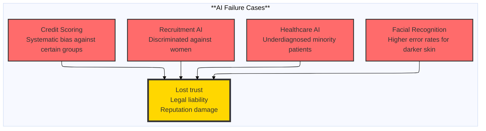
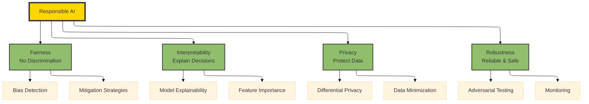
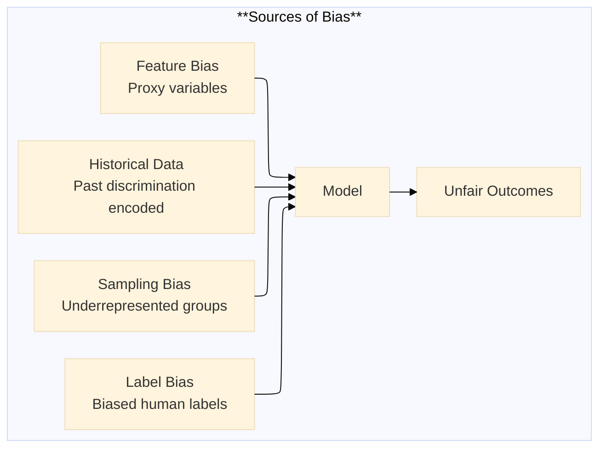
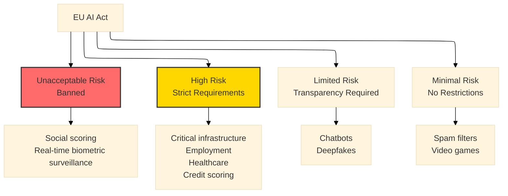
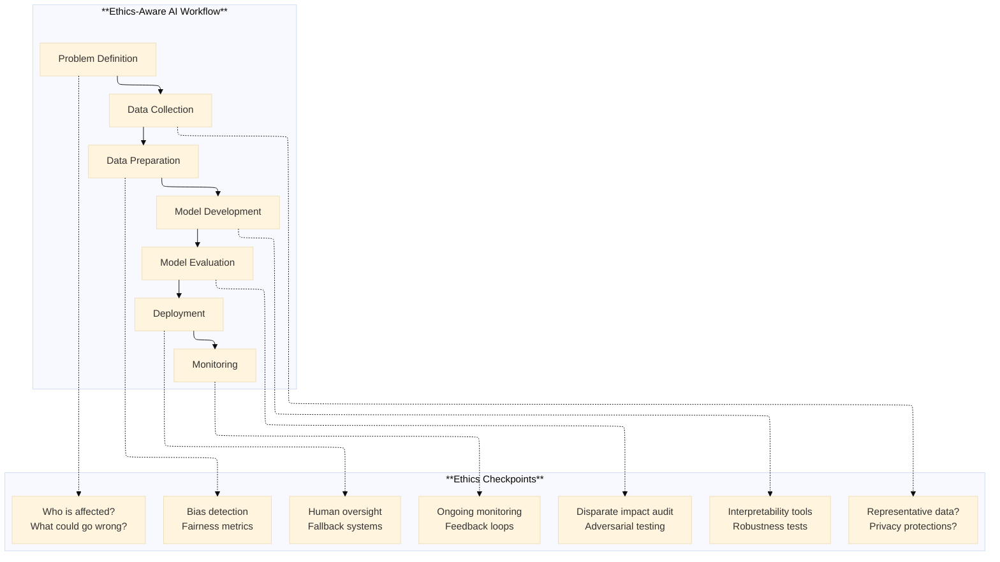

# The 2026 AI Metromap: Ethics & Responsible AI – The Safety Systems of the Metro

## Series A: Foundations Station | Story 5 of 5


## 📖 Introduction

**Welcome to the final stop at Foundations Station.**

You've come far in this series. You learned to clean data like a strategist. You mastered the terminal and version control. You built intuition for linear algebra. You turned raw data into tracks ready for modeling.

Now we need to talk about something that most AI education ignores until it's too late.

You've seen the headlines. AI systems that discriminate. Models that hallucinate. Algorithms that amplify bias. Systems that invade privacy. These aren't bugs. They're failures of ethics—failures that happen when we treat AI as just code, not as systems that impact human lives.

Ethics in AI isn't a constraint on what you can build. It's **the safety system of the metro**. Without it, the train runs fast—until it derails and hurts people.

This story—**The 2026 AI Metromap: Ethics & Responsible AI – The Safety Systems of the Metro**—is your guide to building AI that doesn't just work, but works responsibly. We'll cover bias detection and mitigation. We'll explore interpretability—understanding why your model made a decision. We'll discuss privacy-preserving AI and regulatory compliance. And we'll give you practical tools to audit your own models.

**Let's install the safety systems.**

---

## 📚 Where You Are in the Journey

### The Master Story Arc: The 2026 AI Metromap Series (Complete)

- 🗺️ **[The 2026 AI Metromap: Why the Old Learning Routes Are Obsolete](#)** – A paradigm shift from linear learning to transit-system mastery.
- 🧭 **[The 2026 AI Metromap: Reading the Map](#)** – Strategic navigation across the three core lines.
- 🎒 **[The 2026 AI Metromap: Avoiding Derailments](#)** – Diagnosing and preventing the most common learning pitfalls.
- 🏁 **[The 2026 AI Metromap: From Passenger to Driver](#)** – Building your portfolio using the Metromap structure.

### Series A: Foundations Station (5 Stories – Complete)

- 🏗️ **[The 2026 AI Metromap: Foundations Station – Why Data Cleaning and Git Are Your Board Games, Not Just Chores](#)** – Reframing foundational skills as strategic enablers; practical data cleaning; Git workflows for model versioning.

- 🖥️ **[The 2026 AI Metromap: Command Line & Version Control – Navigating the Terminal Like a Conductor](#)** – Essential CLI tools for AI development; Git branching strategies; SSH and remote GPU training setup.

- 🧮 **[The 2026 AI Metromap: Linear Algebra for ML – The Language of the Map](#)** – Vectors, matrices, and tensors explained through intuition; dot products as attention mechanisms; eigenvalues and PCA.

- 📊 **[The 2026 AI Metromap: Data Cleaning & Visualization – Turning Raw Data into Tracks](#)** – Real-world data wrangling with pandas, polars, and DuckDB; handling missing values, outliers, and imbalanced datasets.

- 🔄 **The 2026 AI Metromap: Ethics & Responsible AI – The Safety Systems of the Metro** – Bias detection and mitigation; interpretability; privacy-preserving AI; regulatory compliance. **⬅️ YOU ARE HERE**

### Series A Complete!

You've completed all five stories in Foundations Station. Your next journey continues into the express lines:

- 📊 **Series B: Supervised Learning Line** – The classic route that built modern AI
- 🚀 **Series C: Modern Architecture Line** – The express train to cutting-edge AI
- ⚙️ **Series D: Engineering & Optimization Yard** – Production, deployment, and scale
- 🤖 **Series E: Applied AI & Agents Line** – Real-world applications across industries

### The Complete Story Catalog

For a complete view of all upcoming stories across every series, visit the **[Complete 2026 AI Metromap Story Catalog](#)**.

---

## 🚂 The Ethics Gap: Why Responsible AI Matters

You've probably heard about AI failures. But you might think they're edge cases—someone else's problem.

They're not.



**The Hard Truth:**

- **Bias is not a bug—it's a feature of data.** Models learn from historical data. Historical data contains historical biases. Your model will amplify them unless you intervene.

- **Black boxes are dangerous.** If you can't explain why your model denied a loan or flagged a patient, you can't defend it. And you can't fix it.

- **Regulation is coming.** GDPR in Europe. The EU AI Act. California privacy laws. You need to know what's required.

Ethics isn't optional. It's the safety system that keeps the metro running.

---

## 🎮 The Four Pillars of Responsible AI



Let's explore each pillar with practical tools and techniques.

---

## ⚖️ Pillar 1: Fairness – Detecting and Mitigating Bias

### Where Does Bias Come From?



**Example:** A hiring model trained on historical data learns that "men were hired more often." It doesn't know this was due to bias. It just learns the pattern. It then rejects qualified women.

### Tool 1: Fairness Indicators with AIF360

```python
# Install: pip install aif360

import pandas as pd
import numpy as np
from aif360.datasets import BinaryLabelDataset
from aif360.metrics import BinaryLabelDatasetMetric
from aif360.algorithms.preprocessing import Reweighing

# Load your data
df = pd.read_csv('loan_data.csv')

# Convert to AIF360 dataset
dataset = BinaryLabelDataset(
    df=df,
    label_names=['loan_approved'],
    protected_attribute_names=['race', 'gender'],
    favorable_label=1,
    unfavorable_label=0
)

# Check for bias before mitigation
metric = BinaryLabelDatasetMetric(
    dataset,
    unprivileged_groups=[{'race': 0, 'gender': 0}],  # Minority group
    privileged_groups=[{'race': 1, 'gender': 1}]     # Majority group
)

print(f"Disparate Impact: {metric.disparate_impact():.3f}")
print(f"Statistical Parity Difference: {metric.statistical_parity_difference():.3f}")

# Disparate Impact < 0.8 indicates bias
# Statistical Parity Difference < 0.1 indicates bias
```

### Bias Mitigation Strategies

| Strategy | When to Use | How It Works |
|----------|-------------|--------------|
| **Pre-processing** | You control data collection | Reweight samples to balance representation |
| **In-processing** | You control model training | Add fairness constraints to loss function |
| **Post-processing** | Model already trained | Adjust decision thresholds per group |

```python
from aif360.algorithms.preprocessing import Reweighing

# Pre-processing: Reweighing to balance groups
rw = Reweighing(
    unprivileged_groups=[{'race': 0}],
    privileged_groups=[{'race': 1}]
)

dataset_transformed = rw.fit_transform(dataset)

# Check bias after mitigation
metric_after = BinaryLabelDatasetMetric(
    dataset_transformed,
    unprivileged_groups=[{'race': 0}],
    privileged_groups=[{'race': 1}]
)

print(f"Disparate Impact After: {metric_after.disparate_impact():.3f}")
```

### In-Processing with Fairness Constraints

```python
from aif360.algorithms.inprocessing import PrejudiceRemover

# Train with fairness constraint
pr = PrejudiceRemover(eta=0.1)  # eta controls fairness vs accuracy trade-off
pr.fit(dataset)

# Now the model is trained to be both accurate and fair
```

### Practical Fairness Checklist

```python
def audit_fairness(model, X_test, y_test, protected_attributes):
    """
    Quick fairness audit for any model
    """
    from sklearn.metrics import accuracy_score, precision_score, recall_score
    
    results = {}
    
    for group, mask in protected_attributes.items():
        # Predictions for this group
        y_pred = model.predict(X_test[mask])
        y_true = y_test[mask]
        
        # Calculate metrics
        results[group] = {
            'accuracy': accuracy_score(y_true, y_pred),
            'precision': precision_score(y_true, y_pred, zero_division=0),
            'recall': recall_score(y_true, y_pred, zero_division=0),
            'sample_count': len(y_true)
        }
    
    # Check for disparities
    print("=== Fairness Audit ===")
    for group, metrics in results.items():
        print(f"\n{group}:")
        print(f"  Accuracy: {metrics['accuracy']:.3f}")
        print(f"  Precision: {metrics['precision']:.3f}")
        print(f"  Recall: {metrics['recall']:.3f}")
        print(f"  Samples: {metrics['sample_count']}")
    
    # Flag disparities > 10%
    groups = list(results.keys())
    for metric in ['accuracy', 'precision', 'recall']:
        values = [results[g][metric] for g in groups]
        if max(values) - min(values) > 0.1:
            print(f"\n⚠️ Disparity detected in {metric}: {max(values)-min(values):.3f}")
    
    return results
```

---

## 🔍 Pillar 2: Interpretability – Understanding Why Your Model Decided

Black box models are dangerous. If you can't explain a decision, you can't trust it, debug it, or defend it.

### Tool 1: SHAP (SHapley Additive Explanations)

SHAP tells you which features contributed to each prediction.

```python
import shap
import xgboost as xgb
import pandas as pd

# Train a model
X_train, X_test, y_train, y_test = train_test_split(X, y, test_size=0.2)
model = xgb.XGBClassifier()
model.fit(X_train, y_train)

# Create SHAP explainer
explainer = shap.TreeExplainer(model)
shap_values = explainer.shap_values(X_test)

# Global feature importance
shap.summary_plot(shap_values, X_test, feature_names=X.columns)

# Explanation for a single prediction
shap.force_plot(explainer.expected_value, shap_values[0], X_test.iloc[0])
```

**What SHAP Shows:**
- **Red features** push prediction higher
- **Blue features** push prediction lower
- **Feature length** shows magnitude of impact

```python
# Extract feature importance for debugging
feature_importance = pd.DataFrame({
    'feature': X.columns,
    'importance': np.abs(shap_values).mean(axis=0)
}).sort_values('importance', ascending=False)

print("Top 5 Most Important Features:")
print(feature_importance.head())
```

### Tool 2: LIME (Local Interpretable Model-agnostic Explanations)

LIME explains individual predictions by creating a simple, interpretable model around that prediction.

```python
import lime
import lime.lime_tabular

# Create LIME explainer
explainer = lime.lime_tabular.LimeTabularExplainer(
    X_train.values,
    feature_names=X.columns,
    class_names=['No Churn', 'Churn'],
    mode='classification'
)

# Explain a single prediction
i = 0  # First test sample
exp = explainer.explain_instance(
    X_test.values[i], 
    model.predict_proba,
    num_features=5
)

exp.show_in_notebook()
```

### Tool 3: Interpretable Models When Possible

Sometimes the most interpretable model is the best choice.

```python
from sklearn.tree import DecisionTreeClassifier, plot_tree
import matplotlib.pyplot as plt

# Decision tree - fully interpretable
tree = DecisionTreeClassifier(max_depth=3)
tree.fit(X_train, y_train)

# Visualize the entire decision path
plt.figure(figsize=(20, 10))
plot_tree(tree, feature_names=X.columns, class_names=['No Churn', 'Churn'], filled=True)
plt.show()

# Each prediction follows a clear path:
# "Age > 30 AND Income < 50K AND Usage < 10 → Churn"
```

---

## 🔒 Pillar 3: Privacy – Protecting Sensitive Data

AI systems often train on sensitive data. Privacy techniques protect individuals while still enabling learning.

### Differential Privacy

Differential privacy adds noise to training data so that the model doesn't memorize individual examples.

```python
# Using TensorFlow Privacy
!pip install tensorflow-privacy

import tensorflow as tf
import tensorflow_privacy as tfp

# Standard model
model = tf.keras.Sequential([
    tf.keras.layers.Dense(64, activation='relu'),
    tf.keras.layers.Dense(1, activation='sigmoid')
])

# Differential privacy optimizer
optimizer = tfp.DifferentialPrivacyAdamGaussianOptimizer(
    l2_norm_clip=1.0,
    noise_multiplier=0.1,
    num_microbatches=256,
    learning_rate=0.001
)

model.compile(optimizer=optimizer, loss='binary_crossentropy')

# Train with privacy guarantees
model.fit(X_train, y_train, epochs=10, batch_size=256)

# The model now has a privacy budget (epsilon)
# Lower epsilon = more privacy, less accuracy
```

### Practical Privacy Checklist

```python
def privacy_audit(dataset):
    """
    Quick privacy audit for your dataset
    """
    issues = []
    
    # Check for PII (Personally Identifiable Information)
    pii_columns = ['name', 'email', 'phone', 'address', 'ssn', 'id']
    present_pii = [col for col in pii_columns if col in dataset.columns]
    
    if present_pii:
        issues.append(f"⚠️ PII columns found: {present_pii}")
        issues.append("   → Consider removing or anonymizing before training")
    
    # Check for small groups (potential re-identification risk)
    for col in dataset.select_dtypes(['object', 'category']).columns:
        value_counts = dataset[col].value_counts()
        small_groups = value_counts[value_counts < 5]
        if len(small_groups) > 0:
            issues.append(f"⚠️ Column '{col}' has {len(small_groups)} groups with <5 samples")
            issues.append("   → Risk of re-identification")
    
    return issues

privacy_issues = privacy_audit(df)
for issue in privacy_issues:
    print(issue)
```

---

## 🛡️ Pillar 4: Robustness – Ensuring Reliability

AI systems fail in unexpected ways. Robustness testing finds those failures before they reach users.

### Adversarial Testing

```python
import foolbox as fb
import torch
import torch.nn as nn

# Your PyTorch model
model = nn.Sequential(
    nn.Linear(784, 128),
    nn.ReLU(),
    nn.Linear(128, 10)
)

# Wrap with foolbox
fmodel = fb.PyTorchModel(model, bounds=(0, 1))

# Test adversarial robustness
attack = fb.attacks.LinfPGD()
epsilon = 0.03  # Small perturbation

for batch in test_loader:
    images, labels = batch
    _, advs, success = attack(fmodel, images, labels, epsilons=epsilon)
    
    if success.any():
        print(f"⚠️ Model fooled on {success.sum()} samples")
```

### Robustness Checklist

```python
def robustness_audit(model, test_data):
    """
    Quick robustness checks
    """
    results = {}
    
    # 1. Test on clean data
    clean_accuracy = model.evaluate(test_data)
    results['clean_accuracy'] = clean_accuracy
    
    # 2. Test with missing features
    # (Check if model degrades gracefully)
    
    # 3. Test with out-of-distribution data
    # (Check if model knows when it doesn't know)
    
    # 4. Test with small perturbations
    # (Check stability to small input changes)
    
    return results
```

---

## 📜 Regulatory Landscape: What You Need to Know

### EU AI Act – Risk Categories



### Compliance Checklist for Your AI System

```python
def compliance_audit(model_type, use_case, jurisdiction):
    """
    Check regulatory requirements for your AI system
    """
    requirements = []
    
    # GDPR (Europe) - Right to explanation
    if jurisdiction in ['EU', 'UK']:
        requirements.append("Provide meaningful explanations for decisions")
        requirements.append("Allow users to contest automated decisions")
        requirements.append("Delete user data on request")
    
    # EU AI Act - High-risk requirements
    high_risk_use_cases = ['hiring', 'credit', 'healthcare', 'education', 'critical_infrastructure']
    if use_case in high_risk_use_cases:
        requirements.append("Register in EU database")
        requirements.append("Conduct conformity assessment")
        requirements.append("Implement risk management system")
        requirements.append("Maintain technical documentation")
    
    # California Privacy Rights Act
    if jurisdiction == 'California':
        requirements.append("Allow opt-out of data sales")
        requirements.append("Disclose data collection practices")
    
    return requirements

# Example
requirements = compliance_audit(
    model_type='classification',
    use_case='credit_scoring',
    jurisdiction='EU'
)

print("Compliance Requirements:")
for req in requirements:
    print(f"  • {req}")
```

---

## 🔧 Practical Ethics Workflow for AI Projects

Integrate ethics into every stage of your AI workflow.



### Ethics Audit Template

```python
class EthicsAudit:
    """
    Comprehensive ethics audit for AI projects
    """
    
    def __init__(self, project_name):
        self.project_name = project_name
        self.checkpoints = []
    
    def add_checkpoint(self, stage, question, status, notes):
        self.checkpoints.append({
            'stage': stage,
            'question': question,
            'status': status,  # ✅ Pass, ⚠️ Warning, ❌ Fail
            'notes': notes
        })
    
    def run_audit(self):
        print(f"\n=== Ethics Audit: {self.project_name} ===\n")
        
        for cp in self.checkpoints:
            print(f"[{cp['stage']}] {cp['status']} {cp['question']}")
            if cp['notes']:
                print(f"   → {cp['notes']}")
            print()
        
        # Check for fails
        fails = [cp for cp in self.checkpoints if cp['status'] == '❌']
        if fails:
            print(f"❌ AUDIT FAILED: {len(fails)} critical issues found")
            for fail in fails:
                print(f"   • {fail['question']}")
        else:
            print("✅ AUDIT PASSED: All ethics checkpoints cleared")
        
        return len(fails) == 0

# Example usage
audit = EthicsAudit("Customer Churn Predictor")

audit.add_checkpoint(
    stage="Problem Definition",
    question="Who is affected by this model?",
    status="✅",
    notes="Customer retention team. Model used internally, not for external decisions."
)

audit.add_checkpoint(
    stage="Data Collection",
    question="Does data represent all customer groups fairly?",
    status="⚠️",
    notes="Underrepresentation of customers from Region X. Plan to oversample."
)

audit.add_checkpoint(
    stage="Model Evaluation",
    question="Is there disparate impact across groups?",
    status="✅",
    notes="Fairness metrics within acceptable thresholds across all groups."
)

audit.run_audit()
```

---

## 📊 Takeaway from This Story

**What You Learned:**

- **The Four Pillars of Responsible AI** – Fairness, Interpretability, Privacy, Robustness. Each is essential for trustworthy AI.

- **Bias Detection and Mitigation** – Tools like AIF360 to detect disparate impact. Strategies for pre-processing, in-processing, and post-processing.

- **Model Interpretability** – SHAP for global and local explanations. LIME for individual predictions. Simple models when appropriate.

- **Privacy Techniques** – Differential privacy to protect individuals. PII removal and anonymization.

- **Regulatory Compliance** – EU AI Act risk categories. GDPR right to explanation. Practical compliance checklists.

- **Ethics Workflow** – Integrating ethics checkpoints into every stage of AI development.

---

## 🔗 Navigation

- **⬅️ Previous Story:** [The 2026 AI Metromap: Data Cleaning & Visualization – Turning Raw Data into Tracks](#)

- **📚 Series A Catalog:** [Series A: Foundations Station](#) – View all 5 stories in this series.

- **📚 Complete Story Catalog:** [Complete 2026 AI Metromap Story Catalog](#) – Your navigation guide to all 39+ stories.

- **➡️ Your Next Station:** Foundations Station is complete! Choose your next series:

  - 📊 **[Series B: Supervised Learning Line](#)** – The classic route that built modern AI
  - 🚀 **[Series C: Modern Architecture Line](#)** – The express train to cutting-edge AI
  - ⚙️ **[Series D: Engineering & Optimization Yard](#)** – Production, deployment, and scale
  - 🤖 **[Series E: Applied AI & Agents Line](#)** – Real-world applications across industries

---

## 📝 Your Invitation

Foundations Station is complete. You now have the core skills that make everything else possible. Before moving to your next series:

1. **Audit a model you've built** – Run fairness metrics. Generate SHAP explanations. Check privacy.

2. **Create an ethics checklist** – Customize the audit template for your own projects.

3. **Share what you've learned** – Ethics in AI is everyone's responsibility. Share your audit process.

**Your foundation is strong. The tracks are laid. The safety systems are installed.**

**Now it's time to ride the express lines.**

---

*Found this helpful? Clap, comment, and share your ethics audit experience. Foundations Station is complete. Your journey continues!* 🚇