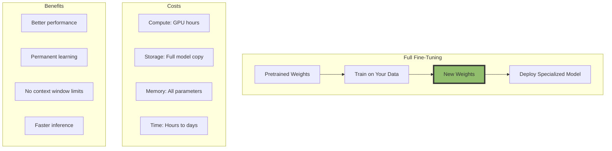
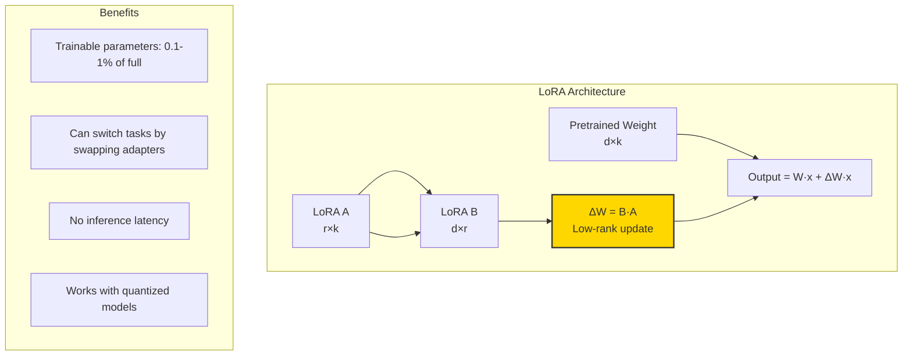
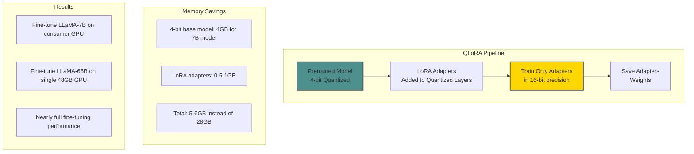
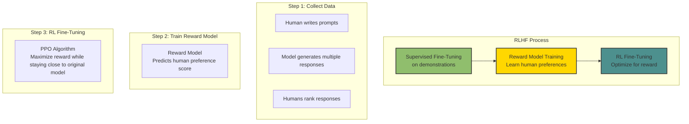
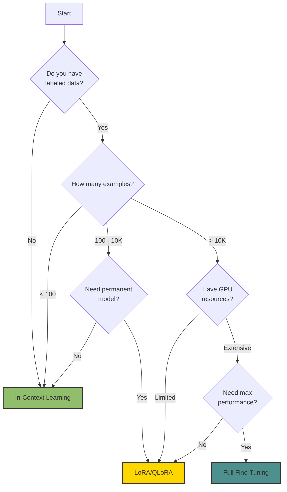

# The 2026 AI Metromap: Fine-Tuning vs. In-Context Learning – When to Train vs. When to Prompt

## Series C: Modern Architecture Line | Story 5 of 6

---

## 📖 Introduction

**Welcome to the fifth stop on the Modern Architecture Line.**

In our last four stories, we mastered the architectures that define modern AI: Transformers, GPT, Diffusion, and Multimodal models. You understand how these models work, how they're trained, and what they can do.

Now we face a practical question that every AI engineer encounters daily: **"I have a model. How do I make it do what I want?"**

You have a pretrained LLM. It knows language. It knows facts. But it doesn't know your specific task. It doesn't know your data. It doesn't know your users.

You have two paths:

- **Fine-tuning** – Update the model's weights to specialize it for your task. More work, more resources, but more permanent.
- **In-Context Learning** – Keep the model frozen, give it examples in the prompt. Zero work, zero training, but limited context.

Which do you choose? When is fine-tuning worth the cost? When does in-context learning fail? And what about the middle ground—parameter-efficient fine-tuning that updates only a fraction of the weights?

This story—**The 2026 AI Metromap: Fine-Tuning vs. In-Context Learning – When to Train vs. When to Prompt**—is your practical guide to adapting models. We'll explore in-context learning—how models learn from examples in the prompt. We'll dive into fine-tuning—from full fine-tuning to parameter-efficient methods like LoRA and QLoRA. We'll understand instruction tuning and RLHF—how models learn to follow instructions. And we'll build a decision framework for when to use each approach.

**Let's learn how to adapt.**

---

## 📚 Where You Are in the Journey

### The Master Story Arc: The 2026 AI Metromap Series (Complete)

- 🗺️ **[The 2026 AI Metromap: Why the Old Learning Routes Are Obsolete](#)** – A paradigm shift from linear learning to transit-system mastery.
- 🧭 **[The 2026 AI Metromap: Reading the Map](#)** – Strategic navigation across the three core lines.
- 🎒 **[The 2026 AI Metromap: Avoiding Derailments](#)** – Diagnosing and preventing the most common learning pitfalls.
- 🏁 **[The 2026 AI Metromap: From Passenger to Driver](#)** – Building your portfolio using the Metromap structure.

### Series A: Foundations Station (Complete)
### Series B: Supervised Learning Line (Complete)

### Series C: Modern Architecture Line (6 Stories)

- 📖 **[The 2026 AI Metromap: Transformers & Attention – The Station That Changed Everything](#)** – The "Attention Is All You Need" paper decoded; self-attention mechanisms; multi-head attention; positional encoding; encoder-decoder architecture.

- 🤖 **[The 2026 AI Metromap: GPT & LLM Architecture – Understanding the Engine of the Express Train](#)** – Decoder-only architecture; causal masking; next token prediction; scaling laws; context windows; emergent abilities.

- 🎨 **[The 2026 AI Metromap: Diffusion Models – The Scenic Route to Generative AI](#)** – How diffusion models work; forward diffusion process; reverse denoising; U-Net architecture; stable diffusion.

- 🌐 **[The 2026 AI Metromap: Multimodal Models – The Interchange Stations](#)** – CLIP: connecting images and text; Flamingo: few-shot multimodal learning; Gemini: native multimodality; contrastive learning.

- 🧩 **The 2026 AI Metromap: Fine-Tuning vs. In-Context Learning – When to Train vs. When to Prompt** – Parameter-efficient fine-tuning (LoRA, QLoRA); instruction tuning; RLHF; in-context learning; few-shot prompting. **⬅️ YOU ARE HERE**

- 📚 **[The 2026 AI Metromap: Open Source LLMs – LLaMA, Mistral, DeepSeek, and Beyond](#)** – Running LLMs locally; quantization (GGUF, GPTQ); inference optimization; model comparison; open-source ecosystem. 🔜 *Up Next*

### The Complete Story Catalog

For a complete view of all upcoming stories across every series, visit the **[Complete 2026 AI Metromap Story Catalog](#)**.

---

## 🎯 The Two Paths: Training vs. Prompting

When you have a pretrained model, you have two ways to adapt it to your task.

```mermaid
graph TD
    subgraph "In-Context Learning"
        P[Pretrained Model<br/>Frozen Weights] --> I[Prompt with Examples]
        I --> O[Model Learns from Context]
        O --> R[No weight updates<br/>Fast, flexible, limited context]
    end
    
    subgraph "Fine-Tuning"
        P2[Pretrained Model] --> F[Update Weights]
        F --> T[Trained on Your Data]
        T --> R2[Permanent change<br/>Slower, more resource, better performance]
    end
    
    subgraph "Parameter-Efficient Fine-Tuning"
        P3[Pretrained Model<br/>Frozen Weights] --> L[Add Small Adapters]
        L --> A[Train Only Adapters]
        A --> B[Best of both worlds]
    end
    
    style I fill:#90be6d,stroke:#333,stroke-width:2px
    style F fill:#4d908e,stroke:#333,stroke-width:2px
    style L fill:#ffd700,stroke:#333,stroke-width:4px
```



---

## 📝 In-Context Learning: Learning from Examples

In-context learning is the ability of LLMs to learn from examples provided in the prompt—without any weight updates.

```python
def explain_in_context_learning():
    """Demonstrate how in-context learning works"""
    
    print("="*60)
    print("IN-CONTEXT LEARNING")
    print("="*60)
    
    print("\nZero-Shot Learning:")
    print("   Prompt: 'Classify sentiment: \"I love this movie!\"'")
    print("   Model: 'Positive'")
    print("   → No examples needed")
    
    print("\nOne-Shot Learning:")
    print("   Prompt:")
    print("     'Example: \"This is terrible\" → Negative'")
    print("     'Classify: \"I love this movie!\"'")
    print("   Model: 'Positive'")
    print("   → One example shows the format")
    
    print("\nFew-Shot Learning:")
    print("   Prompt:")
    print("     'Examples:'")
    print("     '\"Amazing film!\" → Positive'")
    print("     '\"Waste of time\" → Negative'")
    print("     '\"Pretty good\" → Positive'")
    print("     'Classify: \"I love this!\"'")
    print("   Model: 'Positive'")
    print("   → Multiple examples improve accuracy")
    
    print("\n" + "="*60)
    print("WHY IT WORKS")
    print("="*60)
    print("During pretraining, models see billions of examples.")
    print("They learn pattern recognition, not just facts.")
    print("When you show examples in context, the model recognizes")
    print("the pattern and continues it.")
    print("\nThis is emergent—small models can't do this well.")

explain_in_context_learning()
```

### In-Context Learning Limitations

```python
def visualize_icl_limitations():
    """Show limitations of in-context learning"""
    
    fig, axes = plt.subplots(2, 2, figsize=(12, 10))
    
    limitations = [
        {
            "title": "Context Window Limit",
            "description": "Can only fit ~100-200 examples\n(200K tokens max, but examples are long)",
            "emoji": "📏"
        },
        {
            "title": "No Permanent Learning",
            "description": "Must repeat examples every time\nNo memory across sessions",
            "emoji": "🔄"
        },
        {
            "title": "Format Sensitivity",
            "description": "Small changes in formatting\ncan break performance",
            "emoji": "🎯"
        },
        {
            "title": "Complex Reasoning",
            "description": "Struggles with tasks requiring\nmultiple steps or computation",
            "emoji": "🧠"
        }
    ]
    
    for idx, lim in enumerate(limitations):
        row = idx // 2
        col = idx % 2
        ax = axes[row, col]
        
        rect = plt.Rectangle((0.1, 0.1), 0.8, 0.8, fill=True, 
                              facecolor='lightcoral', edgecolor='red', alpha=0.3)
        ax.add_patch(rect)
        
        ax.text(0.5, 0.7, lim['emoji'], ha='center', va='center', fontsize=40)
        ax.text(0.5, 0.5, lim['title'], ha='center', va='center', fontsize=12, fontweight='bold')
        ax.text(0.5, 0.3, lim['description'], ha='center', va='center', fontsize=10)
        
        ax.set_xlim(0, 1)
        ax.set_ylim(0, 1)
        ax.axis('off')
    
    plt.suptitle('In-Context Learning Limitations', fontsize=14)
    plt.tight_layout()
    plt.show()
    
    print("\n" + "="*60)
    print("WHEN TO USE IN-CONTEXT LEARNING")
    print("="*60)
    print("✓ Quick prototyping")
    print("✓ When you have few examples (<100)")
    print("✓ When tasks change frequently")
    print("✓ When you can't access model weights")
    print("✗ When you need consistent, production-grade performance")
    print("✗ When you have thousands of examples")
    print("✗ When you need low latency")

visualize_icl_limitations()
```

---

## 🔧 Fine-Tuning: Updating the Weights

Fine-tuning updates the model's weights to specialize it for your task.



```python
def explain_fine_tuning():
    """Explain full fine-tuning"""
    
    print("="*60)
    print("FULL FINE-TUNING")
    print("="*60)
    
    print("\nProcess:")
    print("  1. Start with pretrained weights (e.g., GPT-3)")
    print("  2. Replace/adapt output layer for your task")
    print("  3. Train on your labeled data")
    print("  4. All weights are updated")
    print("  5. Deploy specialized model")
    
    print("\nResource Requirements (GPT-3 175B example):")
    print("  • GPU memory: ~350GB (full model)")
    print("  • Training time: days to weeks")
    print("  • Cost: $10,000 - $1,000,000")
    print("  • Storage: ~350GB per model")
    
    print("\nWhen to use full fine-tuning:")
    print("  ✓ When you have large datasets (10K+ examples)")
    print("  ✓ When you need maximum performance")
    print("  ✓ When you have compute resources")
    print("  ✗ When you're experimenting")
    print("  ✗ When you have limited data")
    
    # Visualize parameter updates
    fig, ax = plt.subplots(figsize=(10, 2))
    ax.set_xlim(0, 10)
    ax.set_ylim(0, 1)
    ax.axis('off')
    
    # Parameters visualization
    for i in range(20):
        color = 'blue' if i < 20 else 'lightgray'
        rect = plt.Rectangle((i*0.5, 0.3), 0.4, 0.4, facecolor=color, edgecolor='black')
        ax.add_patch(rect)
    
    ax.text(5, 0.8, 'All parameters updated during fine-tuning', ha='center', fontsize=12)
    ax.text(5, 0.1, f'{20} of {20} parameters changed', ha='center', fontsize=10)
    
    plt.title('Full Fine-Tuning: All Weights Updated')
    plt.tight_layout()
    plt.show()

explain_fine_tuning()
```

---

## 🪢 LoRA: Low-Rank Adaptation

LoRA (Low-Rank Adaptation) is a parameter-efficient fine-tuning method that adds small trainable matrices to existing weights.



```python
class LoRA:
    """
    Simplified LoRA implementation.
    Adds trainable low-rank matrices to frozen pretrained weights.
    """
    
    def __init__(self, pretrained_weight, rank=8):
        """
        Args:
            pretrained_weight: Original weight matrix (d×k)
            rank: Rank of LoRA matrices (r)
        """
        self.pretrained = pretrained_weight  # Frozen
        self.rank = rank
        
        d, k = pretrained_weight.shape
        
        # Initialize LoRA matrices
        # A: random Gaussian, B: zeros
        self.A = np.random.randn(rank, k) * 0.01
        self.B = np.zeros((d, rank))
    
    def forward(self, x):
        """Forward pass with LoRA"""
        # Pretrained output (frozen)
        pretrained_out = x @ self.pretrained.T
        
        # LoRA output (trainable)
        lora_out = x @ self.A.T @ self.B.T
        
        return pretrained_out + lora_out
    
    def trainable_params(self):
        """Number of trainable parameters"""
        return self.A.size + self.B.size

def visualize_lora():
    """Compare full fine-tuning vs LoRA parameter counts"""
    
    # Example: GPT-3 sized model
    d_model = 12288  # 12K dimension
    num_layers = 96
    num_attention_heads = 96
    
    # Full fine-tuning parameters
    full_params = d_model * d_model * num_layers * 4  # Q, K, V, O projections
    
    # LoRA parameters (rank=8)
    lora_params = (d_model * 8 + 8 * d_model) * num_layers * 4  # A + B for each projection
    
    fig, axes = plt.subplots(1, 2, figsize=(14, 5))
    
    # Parameter count comparison
    params = [full_params, lora_params]
    labels = ['Full Fine-Tuning', 'LoRA (r=8)']
    colors = ['#4d908e', '#ffd700']
    
    bars = axes[0].bar(labels, params, color=colors)
    axes[0].set_ylabel('Parameters')
    axes[0].set_title('Parameter Count Comparison')
    axes[0].set_yscale('log')
    
    # Add value labels
    for bar, val in zip(bars, params):
        axes[0].text(bar.get_x() + bar.get_width()/2, bar.get_height() + 0.1,
                    f'{val/1e9:.1f}B', ha='center', va='bottom')
    
    # Percentage of trainable parameters
    lora_percent = (lora_params / full_params) * 100
    
    axes[1].pie([lora_percent, 100 - lora_percent], 
                labels=[f'LoRA Trainable\n{lora_percent:.1f}%', 'Frozen Pretrained'],
                colors=['#ffd700', '#e0e0e0'], autopct='%1.1f%%')
    axes[1].set_title('LoRA: Only 0.1-1% Parameters Trainable')
    
    plt.suptitle('LoRA Dramatically Reduces Trainable Parameters', fontsize=14)
    plt.tight_layout()
    plt.show()
    
    print("\n" + "="*60)
    print("LORA ADVANTAGES")
    print("="*60)
    print(f"Full fine-tuning: {full_params/1e9:.1f}B parameters")
    print(f"LoRA (r=8): {lora_params/1e9:.1f}B parameters")
    print(f"Reduction: {full_params / lora_params:.0f}x fewer parameters")
    print("\nThis means:")
    print("  • Train on a single GPU instead of a cluster")
    print("  • Fine-tune in hours instead of days")
    print("  • Store multiple adapters for different tasks")

visualize_lora()
```

---

## 💾 QLoRA: Quantized LoRA

QLoRA combines LoRA with 4-bit quantization to fine-tune massive models on consumer hardware.



```python
def explain_qlora():
    """Explain QLoRA and its benefits"""
    
    print("="*60)
    print("QLORA: QUANTIZED LORA")
    print("="*60)
    
    print("\nWhat is QLoRA?")
    print("  • Quantize base model to 4-bit (compressed)")
    print("  • Add LoRA adapters (16-bit precision)")
    print("  • Train only the adapters")
    print("  • Quantization is frozen during training")
    
    print("\nMemory Requirements (LLaMA-7B):")
    print("  • Full 16-bit: 14GB (not feasible on consumer GPU)")
    print("  • 4-bit quantized: 4GB")
    print("  • LoRA adapters: 0.5GB")
    print("  • Gradients: 0.5GB")
    print("  • Total: ~5-6GB (fits on consumer GPU!)")
    
    print("\nPerformance:")
    print("  • Within 1-2% of full fine-tuning")
    print("  • Can fine-tune 65B models on single 48GB GPU")
    print("  • Preserves model quality while dramatically reducing memory")
    
    print("\nDouble Quantization:")
    print("  • Quantize the quantization constants")
    print("  • Saves additional 0.5GB memory")
    print("  • No performance loss")
    
    # Visualize memory comparison
    fig, ax = plt.subplots(figsize=(10, 6))
    
    methods = ['Full\nFine-Tuning', 'LoRA\n(16-bit)', 'QLoRA\n(4-bit)']
    memory_7b = [28, 16, 6]  # GB for 7B model
    memory_13b = [52, 30, 10]  # GB for 13B model
    
    x = np.arange(len(methods))
    width = 0.35
    
    bars1 = ax.bar(x - width/2, memory_7b, width, label='LLaMA-7B', color='#4d908e')
    bars2 = ax.bar(x + width/2, memory_13b, width, label='LLaMA-13B', color='#ffd700')
    
    ax.set_ylabel('Memory (GB)')
    ax.set_title('Fine-Tuning Memory Requirements')
    ax.set_xticks(x)
    ax.set_xticklabels(methods)
    ax.legend()
    ax.axhline(y=24, color='red', linestyle='--', label='Consumer GPU Limit (24GB)')
    ax.axhline(y=48, color='orange', linestyle='--', label='Pro GPU Limit (48GB)')
    
    # Add value labels
    for bar in bars1:
        height = bar.get_height()
        ax.text(bar.get_x() + bar.get_width()/2., height,
                f'{height}GB', ha='center', va='bottom')
    for bar in bars2:
        height = bar.get_height()
        ax.text(bar.get_x() + bar.get_width()/2., height,
                f'{height}GB', ha='center', va='bottom')
    
    ax.grid(True, alpha=0.3, axis='y')
    plt.tight_layout()
    plt.show()
    
    print("\n" + "="*60)
    print("WHEN TO USE QLORA")
    print("="*60)
    print("✓ When you have limited GPU memory (consumer GPUs)")
    print("✓ When you want to fine-tune large models (13B, 30B, 65B)")
    print("✓ When you need near-full fine-tuning performance")
    print("✓ When you want to store multiple adapters")
    print("✗ When you have access to large GPU clusters")
    print("✗ When you need absolute maximum performance")

explain_qlora()
```

---

## 🎓 Instruction Tuning: Teaching Models to Follow Instructions

Instruction tuning is fine-tuning on (instruction, response) pairs to make models better at following instructions.

```python
def explain_instruction_tuning():
    """Explain instruction tuning and its importance"""
    
    print("="*60)
    print("INSTRUCTION TUNING")
    print("="*60)
    
    print("\nBefore Instruction Tuning:")
    print("  Prompt: 'Translate to French: Hello'")
    print("  Response: 'Hello in French is Bonjour'")
    print("  → Model outputs explanation, not just translation")
    
    print("\nAfter Instruction Tuning:")
    print("  Prompt: 'Translate to French: Hello'")
    print("  Response: 'Bonjour'")
    print("  → Model directly follows instruction")
    
    print("\nHow it works:")
    print("  • Collect (instruction, response) pairs")
    print("  • Format as conversation:")
    print("    {'role': 'user', 'content': instruction}")
    print("    {'role': 'assistant', 'content': response}")
    print("  • Fine-tune model on these examples")
    print("  • Model learns to follow instructions directly")
    
    print("\nExample datasets:")
    print("  • FLAN: 1.8M tasks")
    print("  • Alpaca: 52K instructions")
    print("  • Dolly: 15K human-generated")
    print("  • ShareGPT: 90K real conversations")
    
    # Visualize instruction tuning
    fig, axes = plt.subplots(1, 2, figsize=(12, 5))
    
    # Before
    axes[0].axis('off')
    rect1 = plt.Rectangle((0.1, 0.1), 0.8, 0.8, facecolor='lightcoral', alpha=0.3)
    axes[0].add_patch(rect1)
    axes[0].text(0.5, 0.7, 'Before Instruction Tuning', ha='center', fontsize=12, fontweight='bold')
    axes[0].text(0.5, 0.5, 'User: "Translate: Hello"\nModel: "Hello in French is Bonjour"', 
                ha='center', va='center', fontsize=10)
    axes[0].set_title('Explanations, not instructions')
    
    # After
    axes[1].axis('off')
    rect2 = plt.Rectangle((0.1, 0.1), 0.8, 0.8, facecolor='lightgreen', alpha=0.3)
    axes[1].add_patch(rect2)
    axes[1].text(0.5, 0.7, 'After Instruction Tuning', ha='center', fontsize=12, fontweight='bold')
    axes[1].text(0.5, 0.5, 'User: "Translate: Hello"\nModel: "Bonjour"', 
                ha='center', va='center', fontsize=10)
    axes[1].set_title('Direct instruction following')
    
    plt.suptitle('Instruction Tuning Teaches Models to Follow Instructions')
    plt.tight_layout()
    plt.show()

explain_instruction_tuning()
```

---

## 🎯 RLHF: Reinforcement Learning from Human Feedback

RLHF (Reinforcement Learning from Human Feedback) is used to align models with human preferences—making them helpful, harmless, and honest.



```python
def explain_rlhf():
    """Explain RLHF and its importance for alignment"""
    
    print("="*60)
    print("RLHF: REINFORCEMENT LEARNING FROM HUMAN FEEDBACK")
    print("="*60)
    
    print("\nWhy RLHF?")
    print("  • Language models optimize for next-token prediction")
    print("  • This doesn't align with 'helpful, harmless, honest'")
    print("  • RLHF teaches models what humans actually prefer")
    
    print("\nThe Three Steps:")
    print("\n1. SUPERVISED FINE-TUNING:")
    print("   • Collect human-written demonstrations")
    print("   • Fine-tune model on these")
    print("   • Teaches basic instruction following")
    
    print("\n2. REWARD MODEL TRAINING:")
    print("   • Model generates multiple responses to prompts")
    print("   • Humans rank responses from best to worst")
    print("   • Train a model to predict human preferences")
    
    print("\n3. RL FINE-TUNING (PPO):")
    print("   • Use reward model to score model outputs")
    print("   • Optimize model to maximize reward")
    print("   • Add KL penalty to prevent drifting too far")
    
    print("\nResults:")
    print("  • ChatGPT, Claude, and other aligned models")
    print("  • Much more helpful, harmless responses")
    print("  • Reduced toxic/harmful outputs")
    print("  • Better instruction following")
    
    # Visualize preference learning
    fig, ax = plt.subplots(figsize=(10, 6))
    ax.set_xlim(0, 10)
    ax.set_ylim(0, 5)
    ax.axis('off')
    
    # Prompts
    prompts = [
        ("Tell me about climate change", 1, 4),
        ("How to build a bomb?", 1, 3.5),
        ("What's 2+2?", 3, 4),
        ("Write a poem about AI", 5, 4.5)
    ]
    
    for text, x, y in prompts:
        ax.text(x, y, text, ha='center', va='center', fontsize=10,
               bbox=dict(boxstyle='round', facecolor='lightblue', alpha=0.5))
    
    # Bad responses
    bad_responses = [
        ("Climate change is a hoax", 2, 3),
        ("Here's how to make explosives...", 2, 2.5),
        ("4", 4, 3),
        ("Roses are red...", 6, 3.5)
    ]
    
    for text, x, y in bad_responses:
        ax.text(x, y, text, ha='center', va='center', fontsize=9, color='red')
    
    # Good responses
    good_responses = [
        ("Climate change is real...", 2, 2),
        ("I can't help with that", 2, 1.5),
        ("4", 4, 2),
        ("AI learns, then creates...", 6, 2.5)
    ]
    
    for text, x, y in good_responses:
        ax.text(x, y, text, ha='center', va='center', fontsize=9, color='green')
    
    # Arrows
    ax.annotate('', xy=(2, 2.5), xytext=(2, 3), arrowprops=dict(arrowstyle='->', lw=2, color='green'))
    ax.annotate('', xy=(2, 1.5), xytext=(2, 2.5), arrowprops=dict(arrowstyle='->', lw=2, color='green'))
    ax.annotate('', xy=(6, 3), xytext=(6, 3.5), arrowprops=dict(arrowstyle='->', lw=2, color='green'))
    
    ax.set_title('RLHF: Models Learn to Prefer Helpful Responses (green)\nOver Harmful Ones (red)')
    plt.tight_layout()
    plt.show()

explain_rlhf()
```

---

## 🎯 Decision Framework: Which Approach to Use?



```python
def decision_framework():
    """Provide practical guidance for choosing adaptation method"""
    
    print("="*60)
    print("DECISION FRAMEWORK: WHICH METHOD TO USE?")
    print("="*60)
    
    scenarios = [
        {
            "scenario": "Prototyping a new idea",
            "data": "0-10 examples",
            "resources": "Any",
            "recommendation": "In-Context Learning",
            "why": "Fastest iteration, no training needed"
        },
        {
            "scenario": "Personal assistant with your style",
            "data": "100-500 examples",
            "resources": "Consumer GPU",
            "recommendation": "QLoRA (r=8-16)",
            "why": "Good performance with limited resources"
        },
        {
            "scenario": "Enterprise classification system",
            "data": "5K-50K examples",
            "resources": "Enterprise GPU",
            "recommendation": "LoRA (r=16-64)",
            "why": "Excellent performance, easy to maintain"
        },
        {
            "scenario": "Research on new capabilities",
            "data": "50K+ examples",
            "resources": "GPU cluster",
            "recommendation": "Full Fine-Tuning",
            "why": "Maximum performance, full control"
        }
    ]
    
    for i, s in enumerate(scenarios):
        print(f"\n{'='*50}")
        print(f"Scenario {i+1}: {s['scenario']}")
        print(f"{'='*50}")
        print(f"Data: {s['data']}")
        print(f"Resources: {s['resources']}")
        print(f"✅ Recommendation: {s['recommendation']}")
        print(f"📝 Why: {s['why']}")
    
    print("\n" + "="*60)
    print("SUMMARY: PARAMETER EFFICIENCY HIERARCHY")
    print("="*60)
    print("In-Context Learning: 0 parameters trained, 0 GPU needed")
    print("LoRA: 0.1-1% parameters trained, consumer GPU possible")
    print("QLoRA: 0.1-1% parameters, 4-bit base model, consumer GPU")
    print("Full Fine-Tuning: 100% parameters, GPU cluster needed")

decision_framework()
```

---

## 📊 Takeaway from This Story

**What You Learned:**

- **In-Context Learning** – Learning from examples in the prompt. Zero training, limited context, fast iteration. Best for prototyping.

- **Full Fine-Tuning** – Updating all model weights. Maximum performance, high cost, permanent changes. Best when you have large datasets and compute.

- **LoRA (Low-Rank Adaptation)** – Adds small trainable matrices. 0.1-1% of parameters trained. Can switch tasks by swapping adapters.

- **QLoRA** – LoRA with 4-bit quantization. Fine-tune 65B models on consumer GPUs. Near full fine-tuning performance.

- **Instruction Tuning** – Fine-tuning on instruction-response pairs. Teaches models to follow instructions directly.

- **RLHF** – Reinforcement Learning from Human Feedback. Aligns models with human preferences (helpful, harmless, honest).

- **Decision Framework** – Choose based on data size, resources, and performance needs.

---

## 🔗 Navigation

- **⬅️ Previous Story:** [The 2026 AI Metromap: Multimodal Models – The Interchange Stations](#)

- **📚 Series C Catalog:** [Series C: Modern Architecture Line](#) – View all 6 stories in this series.

- **📚 Complete Story Catalog:** [Complete 2026 AI Metromap Story Catalog](#) – Your navigation guide to all 39+ stories.

- **➡️ Next Story:** **[The 2026 AI Metromap: Open Source LLMs – LLaMA, Mistral, DeepSeek, and Beyond](#)** – Running LLMs locally; quantization (GGUF, GPTQ); inference optimization; model comparison; open-source ecosystem.

---

## 📝 Your Invitation

Before the next story arrives, experiment with adaptation methods:

1. **Try in-context learning** – Give a model 3-5 examples of your task. How does performance compare to zero-shot?

2. **Experiment with LoRA** – Use a library like PEFT to fine-tune a small model with LoRA. Compare parameter count.

3. **Explore QLoRA** – Try fine-tuning a 7B model on consumer hardware using 4-bit quantization.

4. **Build a decision framework** – For your next project, document which method you choose and why.

**You've mastered adaptation. Next stop: Open Source LLMs!**

---

*Found this helpful? Clap, comment, and share your fine-tuning experiments. Next stop: Open Source LLMs!* 🚇