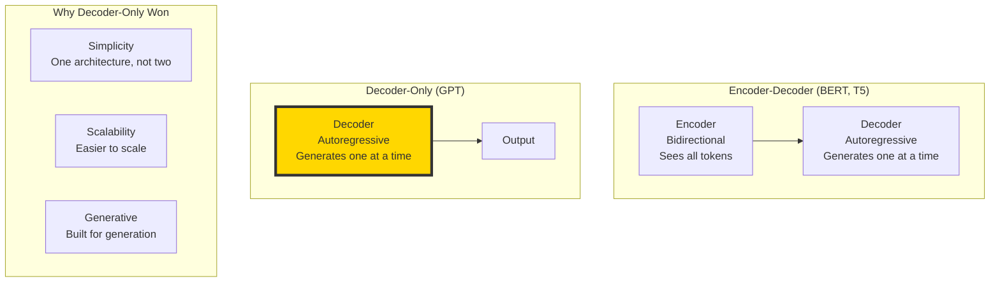
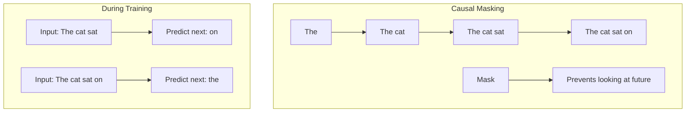
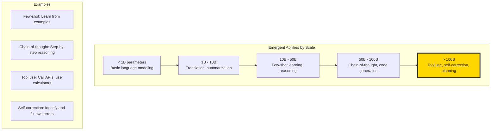

# The 2026 AI Metromap: GPT & LLM Architecture – Understanding the Engine of the Express Train

## Series C: Modern Architecture Line | Story 2 of 6


## 📖 Introduction

**Welcome to the second stop on the Modern Architecture Line.**

In our last story, we built the Transformer—the architecture that changed everything. We understood attention, multi-head mechanisms, positional encoding, and the encoder-decoder structure that powers translation and summarization.

But there's a version of the Transformer you've probably used more than any other. It powers ChatGPT, Claude, and almost every chatbot you interact with. It's the **decoder-only architecture**—and it's called GPT.

When OpenAI released GPT in 2018, few predicted what would follow. By scaling this simple architecture—more data, more parameters, more compute—we witnessed emergent abilities no one expected: reasoning, code generation, chain-of-thought, tool use.

This story—**The 2026 AI Metromap: GPT & LLM Architecture – Understanding the Engine of the Express Train**—is your deep dive into the architecture that powers modern language models. We'll understand why GPT uses only the decoder. We'll explore causal masking—how models learn to predict the next token without cheating. We'll uncover scaling laws and emergent abilities. And we'll see how the humble next-token prediction task leads to intelligence.

**Let's understand the engine.**

---

## 📚 Where You Are in the Journey

### The Master Story Arc: The 2026 AI Metromap Series (Complete)

- 🗺️ **[The 2026 AI Metromap: Why the Old Learning Routes Are Obsolete](#)** – A paradigm shift from linear learning to transit-system mastery.
- 🧭 **[The 2026 AI Metromap: Reading the Map](#)** – Strategic navigation across the three core lines.
- 🎒 **[The 2026 AI Metromap: Avoiding Derailments](#)** – Diagnosing and preventing the most common learning pitfalls.
- 🏁 **[The 2026 AI Metromap: From Passenger to Driver](#)** – Building your portfolio using the Metromap structure.

### Series A: Foundations Station (Complete)
### Series B: Supervised Learning Line (Complete)

### Series C: Modern Architecture Line (6 Stories)

- 📖 **[The 2026 AI Metromap: Transformers & Attention – The Station That Changed Everything](#)** – The "Attention Is All You Need" paper decoded; self-attention mechanisms; multi-head attention; positional encoding; encoder-decoder architecture.

- 🤖 **The 2026 AI Metromap: GPT & LLM Architecture – Understanding the Engine of the Express Train** – Decoder-only architecture; causal masking; next token prediction; scaling laws; context windows; emergent abilities. **⬅️ YOU ARE HERE**

- 🎨 **[The 2026 AI Metromap: Diffusion Models – The Scenic Route to Generative AI](#)** – How diffusion models work; forward diffusion process; reverse denoising; U-Net architecture; stable diffusion. 🔜 *Up Next*

- 🌐 **[The 2026 AI Metromap: Multimodal Models – The Interchange Stations](#)** – CLIP: connecting images and text; Flamingo: few-shot multimodal learning; Gemini: native multimodality; contrastive learning.

- 🧩 **[The 2026 AI Metromap: Fine-Tuning vs. In-Context Learning – When to Train vs. When to Prompt](#)** – Parameter-efficient fine-tuning (LoRA, QLoRA); instruction tuning; RLHF; in-context learning; few-shot prompting.

- 📚 **[The 2026 AI Metromap: Open Source LLMs – LLaMA, Mistral, DeepSeek, and Beyond](#)** – Running LLMs locally; quantization (GGUF, GPTQ); inference optimization; model comparison; open-source ecosystem.

### The Complete Story Catalog

For a complete view of all upcoming stories across every series, visit the **[Complete 2026 AI Metromap Story Catalog](#)**.

---

## 🏗️ Why Decoder-Only? The GPT Architecture

The original Transformer had two parts: encoder (reads) and decoder (writes). GPT asked: **What if we only need the decoder?**



**The Insight:** Language generation is fundamentally autoregressive. Given previous tokens, predict the next. The encoder isn't needed—the model can learn to understand context from the left-to-right flow alone.

---

## 🔒 Causal Masking: The Secret to Next-Token Prediction

The key innovation in decoder-only models is **causal masking**. When predicting the next token, the model cannot see future tokens.



```python
import numpy as np
import matplotlib.pyplot as plt

def visualize_causal_mask(seq_len=8):
    """Visualize how causal masking works"""
    
    # Create causal mask (lower triangular)
    mask = np.tril(np.ones((seq_len, seq_len)))
    
    fig, axes = plt.subplots(1, 3, figsize=(15, 5))
    
    # Causal mask heatmap
    im = axes[0].imshow(mask, cmap='Blues', aspect='auto', vmin=0, vmax=1)
    axes[0].set_title('Causal Attention Mask')
    axes[0].set_xlabel('Key (attended to)')
    axes[0].set_ylabel('Query (attending from)')
    axes[0].set_xticks(range(seq_len))
    axes[0].set_yticks(range(seq_len))
    plt.colorbar(im, ax=axes[0])
    
    # Add text showing what each token can see
    for i in range(seq_len):
        for j in range(seq_len):
            if mask[i, j] > 0:
                axes[0].text(j, i, '✓', ha='center', va='center', color='white' if mask[i,j] > 0.5 else 'black')
            else:
                axes[0].text(j, i, '✗', ha='center', va='center', color='red')
    
    # Show token visibility
    axes[1].bar(range(seq_len), np.sum(mask, axis=1))
    axes[1].set_xlabel('Token Position')
    axes[1].set_ylabel('Tokens It Can See')
    axes[1].set_title('Number of Visible Tokens')
    axes[1].set_xticks(range(seq_len))
    
    # Show attention pattern example
    example_attention = np.random.rand(seq_len, seq_len) * mask
    example_attention = example_attention / (example_attention.sum(axis=1, keepdims=True) + 1e-8)
    
    axes[2].imshow(example_attention, cmap='Blues', aspect='auto')
    axes[2].set_title('Example Attention (Masked)')
    axes[2].set_xlabel('Key')
    axes[2].set_ylabel('Query')
    
    plt.suptitle('Causal Masking: Tokens Can Only Attend to Previous Tokens', fontsize=12)
    plt.tight_layout()
    plt.show()
    
    print("\n" + "="*60)
    print("CAUSAL MASKING EXPLANATION")
    print("="*60)
    print("Token 0 (first) can only see itself.")
    print("Token 1 can see tokens 0-1.")
    print("Token 2 can see tokens 0-2.")
    print("...")
    print(f"Token {seq_len-1} can see all {seq_len} tokens.")
    print("\nThis ensures the model never cheats by looking at future tokens!")

visualize_causal_mask()
```

---

## 🔮 Next-Token Prediction: The Learning Objective

GPT models learn one simple task: **predict the next token**.

```python
def visualize_next_token_prediction():
    """Show how next-token prediction works"""
    
    # Example sequence
    tokens = ["The", "cat", "sat", "on", "the", "mat", "."]
    
    print("="*60)
    print("NEXT-TOKEN PREDICTION")
    print("="*60)
    print(f"\nFull sequence: {' '.join(tokens)}")
    print("\nTraining examples created from this sequence:\n")
    
    for i in range(1, len(tokens)):
        input_tokens = tokens[:i]
        target_token = tokens[i]
        print(f"Input: {' '.join(input_tokens):20} → Predict: {target_token}")
    
    print("\n" + "="*60)
    print("WHY THIS WORKS")
    print("="*60)
    print("By predicting the next token billions of times,")
    print("the model learns:")
    print("  • Grammar and syntax")
    print("  • World knowledge")
    print("  • Reasoning patterns")
    print("  • Task completion")
    print("\nThis single objective creates emergent intelligence!")

visualize_next_token_prediction()
```

---

## 📈 Scaling Laws: The Power of Size

The most important discovery of the LLM era: **performance scales predictably with size**.

```python
def visualize_scaling_laws():
    """Visualize scaling laws for language models"""
    
    # Simulated scaling data (based on OpenAI's paper)
    model_sizes = [125e6, 350e6, 760e6, 1.3e9, 2.7e9, 6.7e9, 13e9, 30e9, 66e9, 175e9]
    
    # Loss as function of model size (lower is better)
    losses = [3.2, 2.8, 2.6, 2.4, 2.2, 2.0, 1.85, 1.7, 1.55, 1.45]
    
    # Loss as function of data size
    data_sizes = [1e9, 2e9, 5e9, 10e9, 20e9, 50e9, 100e9, 200e9, 500e9, 1000e9]
    losses_data = [2.8, 2.6, 2.4, 2.2, 2.0, 1.85, 1.7, 1.6, 1.5, 1.45]
    
    # Compute scaling (log-log)
    fig, axes = plt.subplots(1, 2, figsize=(14, 5))
    
    # Model size scaling
    axes[0].loglog(model_sizes, losses, 'bo-', linewidth=2, markersize=8)
    axes[0].set_xlabel('Model Size (parameters)')
    axes[0].set_ylabel('Loss')
    axes[0].set_title('Scaling Law: Model Size')
    axes[0].grid(True, alpha=0.3)
    
    # Data size scaling
    axes[1].loglog(data_sizes, losses_data, 'ro-', linewidth=2, markersize=8)
    axes[1].set_xlabel('Data Size (tokens)')
    axes[1].set_ylabel('Loss')
    axes[1].set_title('Scaling Law: Data Size')
    axes[1].grid(True, alpha=0.3)
    
    plt.tight_layout()
    plt.show()
    
    print("\n" + "="*60)
    print("SCALING LAWS")
    print("="*60)
    print("As models get bigger (more parameters):")
    print("  • Loss decreases predictably")
    print("  • New capabilities emerge at certain thresholds")
    print("\nAs models see more data:")
    print("  • Loss continues to decrease")
    print("  • There's no 'data wall' yet")
    print("\nKey Insight: Both size AND data matter!")
    print("The best models balance both dimensions.")

visualize_scaling_laws()
```

---

## 🚀 Emergent Abilities: When Scale Creates Intelligence

At certain scales, models develop abilities that weren't explicitly trained for.



```python
def visualize_emergence():
    """Show emergent abilities with examples"""
    
    abilities = {
        'Few-Shot Learning': {
            'description': 'Learn from examples without parameter updates',
            'example': """
            Example: Classify sentiment
            Review: "This movie was amazing!" → Positive
            Review: "I hated every minute." → Negative
            Review: "It was okay, not great." → ? (Model predicts: Neutral)
            """
        },
        'Chain-of-Thought': {
            'description': 'Step-by-step reasoning',
            'example': """
            Q: Roger has 5 tennis balls. He buys 2 more cans. Each can has 3 balls. How many now?
            A: Roger starts with 5 balls.
               2 cans × 3 balls = 6 balls.
               5 + 6 = 11 balls.
               Answer: 11
            """
        },
        'Tool Use': {
            'description': 'Use external tools',
            'example': """
            User: What's 238475 × 238475?
            Model: Let me calculate... [calls calculator API]
            Result: 56,847,775,625
            """
        }
    }
    
    fig, axes = plt.subplots(1, 3, figsize=(15, 8))
    
    for idx, (name, data) in enumerate(abilities.items()):
        axes[idx].axis('off')
        axes[idx].set_title(name, fontsize=12, fontweight='bold')
        axes[idx].text(0.1, 0.9, data['description'], 
                      fontsize=10, wrap=True, transform=axes[idx].transAxes)
        axes[idx].text(0.1, 0.6, data['example'], 
                      fontsize=9, family='monospace', wrap=True, 
                      transform=axes[idx].transAxes,
                      bbox=dict(boxstyle='round', facecolor='lightgray', alpha=0.3))
    
    plt.suptitle('Emergent Abilities in Large Language Models', fontsize=14)
    plt.tight_layout()
    plt.show()

visualize_emergence()
```

---

## 🏗️ Building a Mini-GPT

Let's build a miniature GPT model from scratch to understand the architecture.

```python
import numpy as np

class MiniGPT:
    """
    A miniature GPT model with causal masking and next-token prediction.
    This captures the core architecture of modern LLMs.
    """
    
    def __init__(self, vocab_size, d_model, num_heads, num_layers, max_seq_len):
        """
        Args:
            vocab_size: Number of tokens in vocabulary
            d_model: Embedding dimension
            num_heads: Number of attention heads
            num_layers: Number of transformer blocks
            max_seq_len: Maximum sequence length
        """
        self.vocab_size = vocab_size
        self.d_model = d_model
        self.num_heads = num_heads
        self.num_layers = num_layers
        self.max_seq_len = max_seq_len
        
        # Token embeddings
        self.token_embeddings = np.random.randn(vocab_size, d_model) * 0.01
        
        # Positional embeddings (learned)
        self.position_embeddings = np.random.randn(max_seq_len, d_model) * 0.01
        
        # Transformer blocks
        self.blocks = []
        for _ in range(num_layers):
            self.blocks.append(self._create_transformer_block())
        
        # Output projection
        self.output_projection = np.random.randn(d_model, vocab_size) * 0.01
        
        # Causal mask (lower triangular)
        self.causal_mask = np.tril(np.ones((max_seq_len, max_seq_len)))
    
    def _create_transformer_block(self):
        """Create a simplified transformer block"""
        return {
            'W_Q': np.random.randn(self.d_model, self.d_model) * 0.01,
            'W_K': np.random.randn(self.d_model, self.d_model) * 0.01,
            'W_V': np.random.randn(self.d_model, self.d_model) * 0.01,
            'W_O': np.random.randn(self.d_model, self.d_model) * 0.01,
            'W_FF1': np.random.randn(self.d_model, 4 * self.d_model) * 0.01,
            'W_FF2': np.random.randn(4 * self.d_model, self.d_model) * 0.01,
            'gamma1': np.ones(self.d_model),
            'beta1': np.zeros(self.d_model),
            'gamma2': np.ones(self.d_model),
            'beta2': np.zeros(self.d_model)
        }
    
    def softmax(self, x):
        exp_x = np.exp(x - np.max(x, axis=-1, keepdims=True))
        return exp_x / np.sum(exp_x, axis=-1, keepdims=True)
    
    def layer_norm(self, x, gamma, beta, eps=1e-6):
        mean = np.mean(x, axis=-1, keepdims=True)
        var = np.var(x, axis=-1, keepdims=True)
        return gamma * (x - mean) / np.sqrt(var + eps) + beta
    
    def attention(self, Q, K, V, mask):
        """Scaled dot-product attention with causal mask"""
        d_k = Q.shape[-1]
        scores = Q @ K.transpose(0, 2, 1) / np.sqrt(d_k)
        
        # Apply causal mask
        seq_len = scores.shape[-1]
        mask = self.causal_mask[:seq_len, :seq_len]
        scores = scores * mask + (1 - mask) * -1e9
        
        attn_weights = self.softmax(scores)
        output = attn_weights @ V
        return output
    
    def forward(self, input_ids):
        """
        Args:
            input_ids: (batch_size, seq_len) token indices
        
        Returns:
            logits: (batch_size, seq_len, vocab_size)
        """
        batch_size, seq_len = input_ids.shape
        
        # Get token embeddings
        token_emb = self.token_embeddings[input_ids]  # (batch, seq, d_model)
        
        # Add position embeddings
        pos_emb = self.position_embeddings[:seq_len]  # (seq, d_model)
        x = token_emb + pos_emb  # (batch, seq, d_model)
        
        # Pass through transformer blocks
        for block in self.blocks:
            # Multi-head attention
            # For simplicity, we use single-head attention
            Q = x @ block['W_Q']
            K = x @ block['W_K']
            V = x @ block['W_V']
            
            # Reshape for multi-head (simplified)
            Q = Q.reshape(batch_size, seq_len, self.num_heads, self.d_model // self.num_heads)
            K = K.reshape(batch_size, seq_len, self.num_heads, self.d_model // self.num_heads)
            V = V.reshape(batch_size, seq_len, self.num_heads, self.d_model // self.num_heads)
            
            Q = Q.transpose(0, 2, 1, 3)
            K = K.transpose(0, 2, 1, 3)
            V = V.transpose(0, 2, 1, 3)
            
            # Attention
            attn_out = self.attention(Q, K, V, self.causal_mask)
            
            # Concatenate heads
            attn_out = attn_out.transpose(0, 2, 1, 3).reshape(batch_size, seq_len, self.d_model)
            
            # Output projection
            attn_out = attn_out @ block['W_O']
            
            # Residual + LayerNorm
            x = x + attn_out
            x = self.layer_norm(x, block['gamma1'], block['beta1'])
            
            # Feed-forward
            ff_out = np.maximum(0, x @ block['W_FF1']) @ block['W_FF2']
            x = x + ff_out
            x = self.layer_norm(x, block['gamma2'], block['beta2'])
        
        # Output projection
        logits = x @ self.output_projection
        
        return logits
    
    def generate(self, input_ids, max_new_tokens, temperature=1.0):
        """
        Generate tokens autoregressively.
        
        Args:
            input_ids: Initial token sequence
            max_new_tokens: Number of tokens to generate
            temperature: Sampling temperature (higher = more random)
        
        Returns:
            Generated token sequence
        """
        generated = input_ids.copy()
        
        for _ in range(max_new_tokens):
            # Forward pass
            logits = self.forward(generated)
            
            # Get logits for last token
            next_token_logits = logits[0, -1, :] / temperature
            
            # Sample from distribution
            probs = self.softmax(next_token_logits[None, :])[0]
            next_token = np.random.choice(self.vocab_size, p=probs)
            
            # Append to sequence
            generated = np.append(generated, next_token)
        
        return generated

# Create a tiny GPT
vocab_size = 1000
d_model = 64
num_heads = 4
num_layers = 3
max_seq_len = 128

gpt = MiniGPT(vocab_size, d_model, num_heads, num_layers, max_seq_len)

print("="*60)
print("MINI-GPT ARCHITECTURE")
print("="*60)
print(f"Vocabulary size: {vocab_size}")
print(f"Embedding dimension: {d_model}")
print(f"Number of heads: {num_heads}")
print(f"Number of layers: {num_layers}")
print(f"Max sequence length: {max_seq_len}")
print(f"\nTotal parameters: ~{vocab_size*d_model + d_model*max_seq_len + num_layers*(d_model**2*4 + d_model*4*d_model*2):,}")

# Test forward pass
batch_size = 1
seq_len = 10
test_input = np.random.randint(0, vocab_size, (batch_size, seq_len))
logits = gpt.forward(test_input)

print(f"\nInput shape: {test_input.shape}")
print(f"Output shape: {logits.shape}")
print("\n✅ Forward pass successful!")
```

---

## 📊 Context Windows: The Memory of LLMs

The context window determines how much text the model can process at once.

```python
def visualize_context_windows():
    """Show how context windows have grown"""
    
    models = [
        ('GPT-1', 512),
        ('GPT-2', 1024),
        ('GPT-3', 2048),
        ('GPT-4', 8192),
        ('GPT-4 Turbo', 128000),
        ('Claude 3', 200000),
        ('Gemini 1.5', 1000000)
    ]
    
    names, sizes = zip(*models)
    
    fig, ax = plt.subplots(figsize=(12, 6))
    
    # Log scale to show range
    bars = ax.barh(names, sizes, color='steelblue')
    
    # Add value labels
    for bar, size in zip(bars, sizes):
        width = bar.get_width()
        ax.text(width + 1000, bar.get_y() + bar.get_height()/2, 
                f'{size:,}', ha='left', va='center')
    
    ax.set_xlabel('Context Window (tokens)')
    ax.set_title('Evolution of Context Windows in LLMs')
    ax.set_xscale('log')
    ax.grid(True, alpha=0.3, axis='x')
    
    plt.tight_layout()
    plt.show()
    
    print("\n" + "="*60)
    print("WHAT CONTEXT WINDOWS ENABLE")
    print("="*60)
    print("512 tokens: Short paragraphs")
    print("2K tokens: Articles")
    print("8K tokens: Short stories")
    print("128K tokens: Entire books (The Great Gatsby)")
    print("200K tokens: All of Harry Potter Book 1")
    print("1M tokens: All three books of The Three-Body Problem")

visualize_context_windows()
```

---

## 📊 Takeaway from This Story

**What You Learned:**

- **Decoder-Only Architecture** – GPT uses only the decoder half of the Transformer. Simpler, more scalable, built for generation.

- **Causal Masking** – Tokens can only attend to previous tokens, not future ones. Essential for next-token prediction without cheating.

- **Next-Token Prediction** – The simple objective that creates intelligence. Predict the next word billions of times.

- **Scaling Laws** – Performance improves predictably with model size and data size. No wall in sight.

- **Emergent Abilities** – At certain scales, models develop reasoning, tool use, and self-correction without explicit training.

- **Context Windows** – Growing rapidly. Enables processing entire books, codebases, and long conversations.

---

## 🔗 Navigation

- **⬅️ Previous Story:** [The 2026 AI Metromap: Transformers & Attention – The Station That Changed Everything](#)

- **📚 Series C Catalog:** [Series C: Modern Architecture Line](#) – View all 6 stories in this series.

- **📚 Complete Story Catalog:** [Complete 2026 AI Metromap Story Catalog](#) – Your navigation guide to all 39+ stories.

- **➡️ Next Story:** **[The 2026 AI Metromap: Diffusion Models – The Scenic Route to Generative AI](#)** – How diffusion models work; forward diffusion process; reverse denoising; U-Net architecture; stable diffusion.

---

## 📝 Your Invitation

Before the next story arrives, experiment with GPT architecture:

1. **Implement causal masking** – Write your own attention with masking. Verify tokens can't see the future.

2. **Experiment with scaling** – Train tiny models of different sizes. Does loss decrease predictably?

3. **Explore emergent abilities** – Try few-shot prompting. What can small models do vs large?

4. **Build a text generator** – Use your MiniGPT to generate text. Experiment with temperature.

**You've mastered the engine of the express train. Next stop: Diffusion Models!**

---

*Found this helpful? Clap, comment, and share your GPT experiments. Next stop: Diffusion Models!* 🚇