# The 2026 AI Metromap: Linear Algebra for ML – The Language of the Map

## Series A: Foundations Station | Story 3 of 5


## 📖 Introduction

**Welcome to the third stop at Foundations Station.**

In our first two foundation stories, you learned to clean data like a strategist and navigate the terminal like a conductor. You've built the operational skills that make AI work possible.

Now we need to talk about the language that makes AI work intelligible.

If you've avoided linear algebra, you're in good company. It looks like abstract math—matrices, vectors, transformations. It feels like something you should have learned in college but didn't. And when you see equations in research papers, your brain shuts down.

But here's what nobody tells you: **You don't need to be a mathematician to understand linear algebra for AI. You need intuition.**

Every AI concept you care about—attention, embeddings, neural networks—is built on a handful of linear algebra ideas. Understand these ideas, and the math stops being a barrier. It becomes a language you speak.

This story—**The 2026 AI Metromap: Linear Algebra for ML – The Language of the Map**—is your intuition builder. We'll strip away the abstraction and show you what vectors, matrices, and transformations actually *mean* in the context of AI. We'll connect each concept to something you've already built or used. And we'll give you the minimal math you need to read research papers and debug your models.

**Let's learn the language of the map.**

---

## 📚 Where You Are in the Journey

### The Master Story Arc: The 2026 AI Metromap Series (Complete)

- 🗺️ **[The 2026 AI Metromap: Why the Old Learning Routes Are Obsolete](#)** – A paradigm shift from linear learning to transit-system mastery.
- 🧭 **[The 2026 AI Metromap: Reading the Map](#)** – Strategic navigation across the three core lines.
- 🎒 **[The 2026 AI Metromap: Avoiding Derailments](#)** – Diagnosing and preventing the most common learning pitfalls.
- 🏁 **[The 2026 AI Metromap: From Passenger to Driver](#)** – Building your portfolio using the Metromap structure.

### Series A: Foundations Station (5 Stories)

- 🏗️ **[The 2026 AI Metromap: Foundations Station – Why Data Cleaning and Git Are Your Board Games, Not Just Chores](#)** – Reframing foundational skills as strategic enablers; practical data cleaning; Git workflows for model versioning.

- 🖥️ **[The 2026 AI Metromap: Command Line & Version Control – Navigating the Terminal Like a Conductor](#)** – Essential CLI tools for AI development; Git branching strategies; SSH and remote GPU training setup.

- 🧮 **The 2026 AI Metromap: Linear Algebra for ML – The Language of the Map** – Vectors, matrices, and tensors explained through intuition; dot products as attention mechanisms; eigenvalues and PCA. **⬅️ YOU ARE HERE**

- 📊 **[The 2026 AI Metromap: Data Cleaning & Visualization – Turning Raw Data into Tracks](#)** – Real-world data wrangling with pandas, polars, and DuckDB; handling missing values, outliers, and imbalanced datasets. 🔜 *Up Next*

- 🔄 **[The 2026 AI Metromap: Ethics & Responsible AI – The Safety Systems of the Metro](#)** – Bias detection and mitigation; interpretability; privacy-preserving AI; regulatory compliance.

### The Complete Story Catalog

For a complete view of all upcoming stories across every series, visit the **[Complete 2026 AI Metromap Story Catalog](#)**.

---

## 🚂 The Linear Algebra Anxiety

If the words "linear algebra" make you nervous, you're not alone. Most AI learners hit this wall.

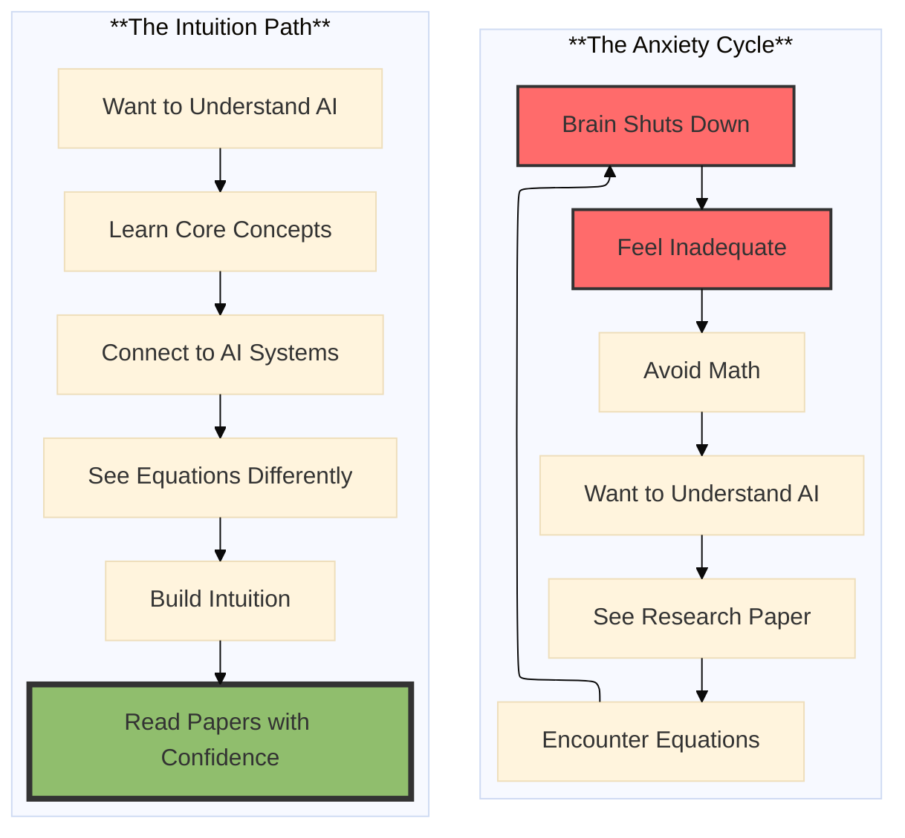

**The Secret:** You don't need to derive equations. You need to understand what they *mean*. Linear algebra for AI is about relationships, not calculations. The computer does the calculations. You need to understand the geometry.

---

## 🎮 The Four Core Concepts

Everything in AI linear algebra comes down to four concepts. Master these, and you master the language.

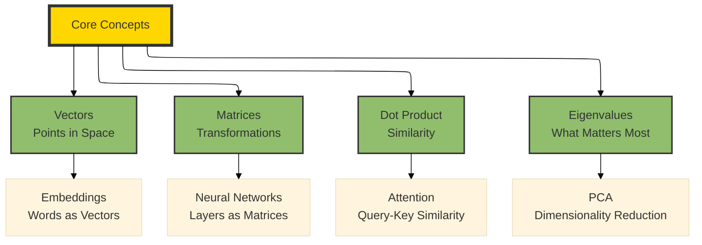

Let's explore each one through the lens of AI.

---

## 📍 Concept 1: Vectors – Points in Space

### What Is a Vector?

A vector is just a list of numbers. But more importantly, it's a **point in space**—or an arrow pointing from the origin to that point.

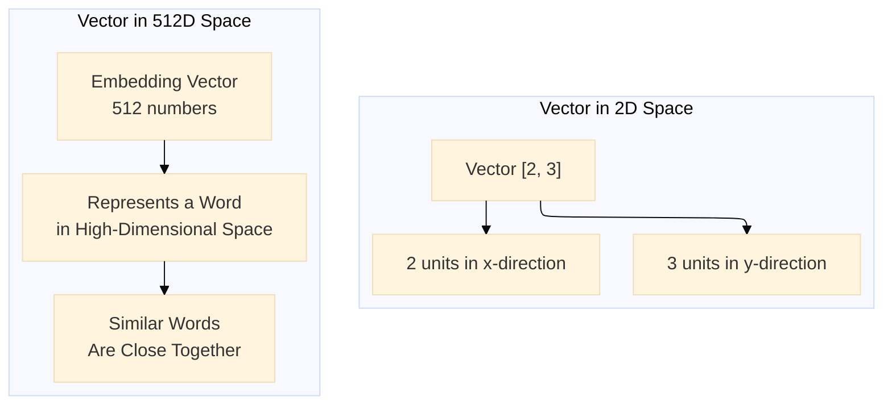

### In AI: Embeddings

Every word, image, or concept in AI can be represented as a vector. This is called an **embedding**.

- "King" might be represented as `[0.2, -0.5, 0.8, ...]` (512 numbers)
- "Queen" might be represented as `[0.18, -0.48, 0.82, ...]` (very similar)
- "Apple" (fruit) vs "Apple" (company) have different vectors

**The Intuition:** Vectors are the native language of AI. Everything you input—text, images, audio—gets converted to vectors. AI operates entirely in vector space.

**Why This Matters:**

- **Similar words have similar vectors** – The geometry captures meaning
- **Operations on vectors have meaning** – "King" - "Man" + "Woman" ≈ "Queen"
- **Distance between vectors measures similarity** – This is how search and recommendation work

**The Minimal Math:**
```python
import numpy as np

# A vector is just an array
word_embedding = np.array([0.2, -0.5, 0.8, 0.1, -0.3])

# Shape tells you the dimension
print(word_embedding.shape)  # (5,) - 5-dimensional vector

# In practice, embeddings are much higher dimensional
real_embedding = np.random.randn(512)  # 512 dimensions
print(real_embedding.shape)  # (512,)
```

---

## 🔄 Concept 2: Matrices – Transformations

### What Is a Matrix?

A matrix is a grid of numbers. But more importantly, it's a **transformation**—it takes vectors and moves them to new positions in space.

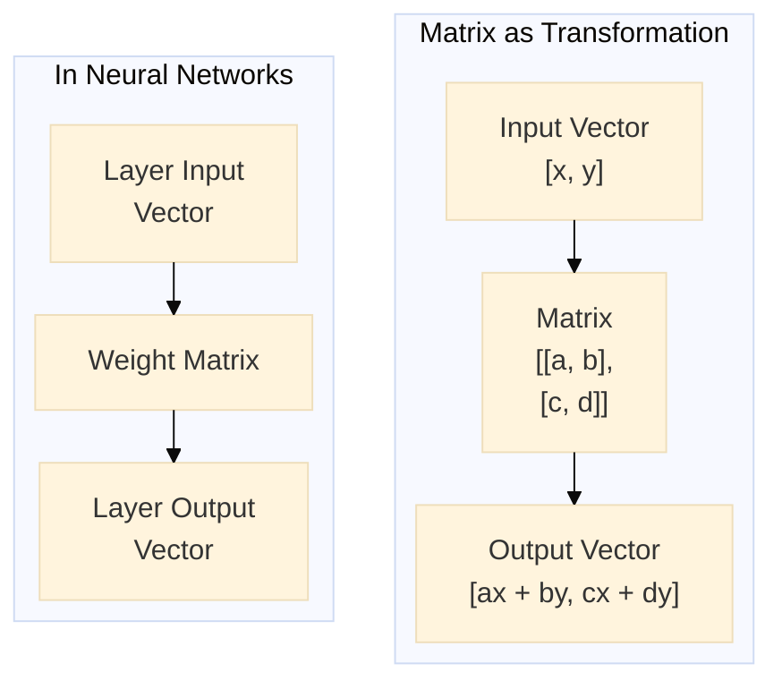

### In AI: Neural Network Layers

Every layer in a neural network is a matrix multiplication. You feed in a vector (your data), multiply by a weight matrix (the learned transformation), and get a new vector (the representation at the next layer).

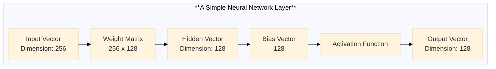

**The Intuition:** A neural network is a series of transformations. Each matrix learns to reshape the vector space so that similar things (in the output) end up close together.

**Why This Matters:**

- **Matrix dimensions tell you the architecture** – Input size, hidden size, output size
- **Matrix multiplication is the cost** – This is what GPUs are optimized for
- **Learning is finding the right matrices** – Training adjusts these numbers

**The Minimal Math:**
```python
import numpy as np

# A matrix is a 2D array
weight_matrix = np.array([
    [0.5, -0.2, 0.1],
    [0.3, 0.8, -0.4],
    [0.1, 0.2, 0.9]
])

# Input vector
input_vector = np.array([1.0, 2.0, 3.0])

# Matrix multiplication (transformation)
output_vector = weight_matrix @ input_vector
print(output_vector)  # New vector in transformed space
```

---

## 💖 Concept 3: Dot Product – Measuring Similarity

### What Is a Dot Product?

The dot product takes two vectors and returns a single number. It measures **how much they point in the same direction**.

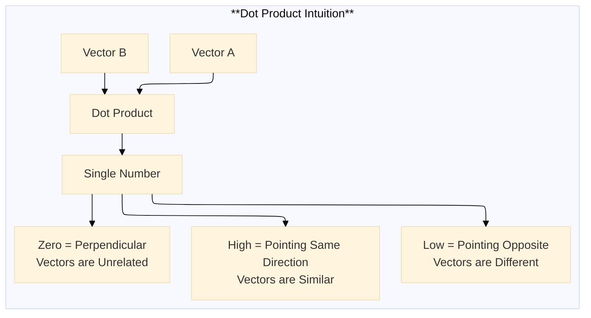

### In AI: Attention Mechanism

The attention mechanism—the heart of Transformers—is built entirely on dot products.

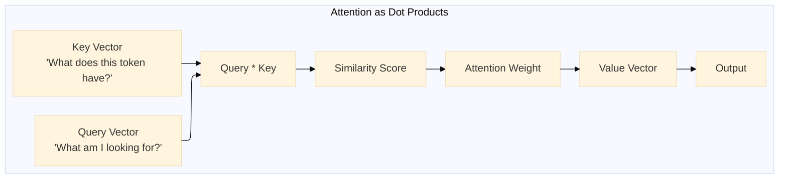

**The Intuition:** In attention, every token asks "How relevant is every other token to me?" It answers by taking the dot product of its query vector with everyone's key vectors. High dot product = high relevance.

**Why This Matters:**

- **Attention is just dot products** – No magic. Just similarity measurement.
- **Scale matters** – Transformers scale dot products by √d to keep values stable
- **This is why Transformers are powerful** – Every token can attend to every other token

**The Minimal Math:**
```python
import numpy as np

# Two vectors
query = np.array([1.0, 2.0, 3.0])
key = np.array([0.5, 1.5, 2.5])

# Dot product = sum of element-wise multiplication
dot_product = np.dot(query, key)
# = (1.0 * 0.5) + (2.0 * 1.5) + (3.0 * 2.5)
# = 0.5 + 3.0 + 7.5 = 11.0

print(dot_product)  # 11.0

# Higher dot product = more similar
similar = np.dot([1, 0, 0], [1, 0, 0])    # = 1.0
different = np.dot([1, 0, 0], [0, 1, 0])  # = 0.0
opposite = np.dot([1, 0, 0], [-1, 0, 0])  # = -1.0
```

---

## 🎯 Concept 4: Eigenvalues – What Matters Most

### What Are Eigenvalues?

Eigenvalues tell you what's **important** in your data. They measure how much a transformation stretches or compresses vectors in different directions.

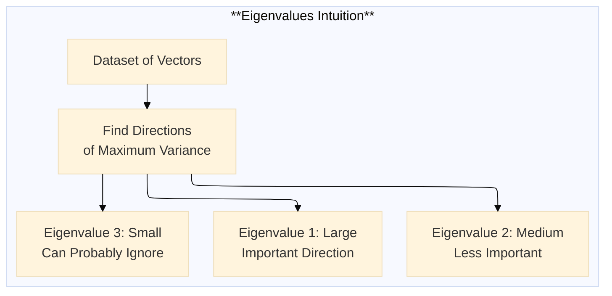

### In AI: Principal Component Analysis (PCA)

PCA uses eigenvalues to reduce dimensionality—to find the few directions that capture most of the information in your data.

**The Intuition:** Imagine you have 1000 features, but most of the variance is captured by 50 directions. You can compress your data to 50 dimensions with minimal information loss.

**Why This Matters:**

- **Dimensionality reduction** – Make models faster, reduce overfitting
- **Understanding your data** – What features actually matter?
- **Visualization** – Reduce to 2D or 3D to see clusters

**The Minimal Math:**
```python
import numpy as np
from sklearn.decomposition import PCA

# Your data: 100 samples, 50 features
data = np.random.randn(100, 50)

# PCA finds eigenvalues
pca = PCA()
pca.fit(data)

# eigenvalues = explained variance
explained_variance = pca.explained_variance_ratio_

# First 5 eigenvalues capture 80% of variance?
print(f"First 5 components: {explained_variance[:5].sum():.2%}")
print(f"First 10 components: {explained_variance[:10].sum():.2%}")

# If first 10 capture 90% of variance, you can reduce from 50 to 10 dimensions
```

---

## 🧩 Connecting Concepts to AI Systems

Now let's see how these four concepts come together in the AI systems you use every day.

### Example 1: Word Embeddings (Word2Vec, GloVe)

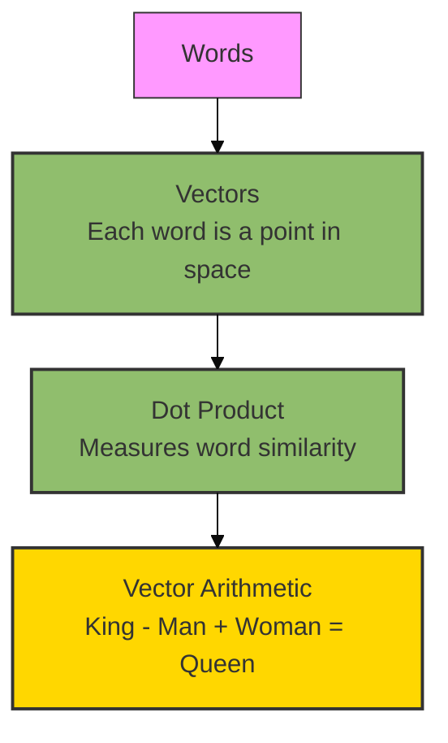

**What's Happening:**
- Each word becomes a **vector** (embedding)
- Similar words have similar vectors (geometry captures meaning)
- **Dot product** measures semantic similarity
- Vector arithmetic captures analogies

---

### Example 2: Transformer Attention

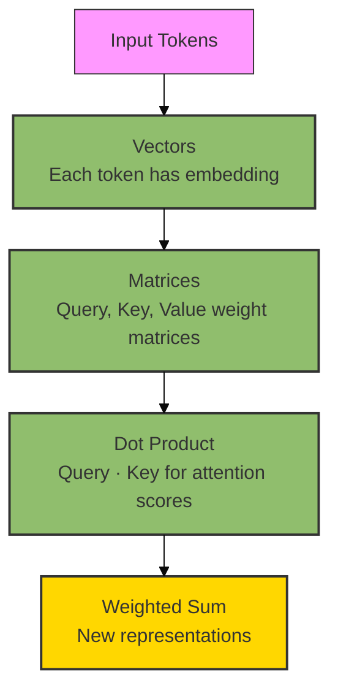

**What's Happening:**
- Each token is a **vector**
- **Matrices** (W_Q, W_K, W_V) transform vectors into query, key, value spaces
- **Dot product** between query and key vectors measures relevance
- Output is weighted combination of values

---

### Example 3: Neural Network Layer

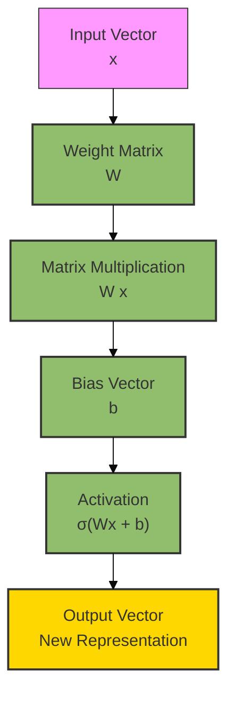

**What's Happening:**
- Input **vector** passes through **matrix** transformation
- **Matrix multiplication** = linear transformation
- Activation introduces non-linearity
- Each layer learns a new representation

---

## 🔧 Practical Intuition: Building a Recommendation System

Let's apply these concepts to build intuition for a real AI system: a movie recommender.

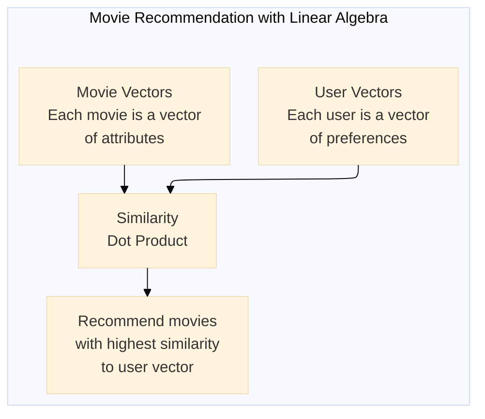

**Step 1: Represent Everything as Vectors**

```python
import numpy as np

# Users as vectors (preferences for genres)
users = {
    "Alice": np.array([0.9, 0.1, 0.0, 0.8, 0.2]),  # [Action, Comedy, Drama, SciFi, Romance]
    "Bob": np.array([0.1, 0.8, 0.7, 0.1, 0.9]),    # Loves Romance and Comedy
}

# Movies as vectors (genre composition)
movies = {
    "Inception": np.array([0.8, 0.1, 0.3, 0.9, 0.1]),
    "The Notebook": np.array([0.0, 0.2, 0.9, 0.0, 0.9]),
    "Deadpool": np.array([0.7, 0.9, 0.1, 0.2, 0.3]),
}
```

**Step 2: Measure Similarity with Dot Product**

```python
def recommend(user_vector, movies_dict, top_n=2):
    scores = {}
    for movie, movie_vector in movies_dict.items():
        # Dot product measures similarity
        similarity = np.dot(user_vector, movie_vector)
        scores[movie] = similarity
    
    # Sort by similarity
    return sorted(scores.items(), key=lambda x: x[1], reverse=True)[:top_n]

# Recommendations for Alice (SciFi/Action fan)
print(recommend(users["Alice"], movies))
# [('Inception', 1.66), ('Deadpool', 0.99)]

# Recommendations for Bob (Romance/Comedy fan)
print(recommend(users["Bob"], movies))
# [('The Notebook', 1.57), ('Deadpool', 0.83)]
```

**Step 3: Understand What's Happening**

- **Vectors** capture preferences and attributes
- **Dot product** measures alignment between user and movie
- **Matrix operations** let you scale to millions of users and movies
- **Eigenvalues** help you find the most important dimensions (genres)

---

## 📊 The Minimal Math You Actually Need

You don't need to derive equations. You need to understand these operations:

| Operation | Symbol | What It Means | Where You See It |
|-----------|--------|---------------|------------------|
| Vector | `v = [1, 2, 3]` | A point in space | Embeddings, activations |
| Matrix | `M = [[a,b],[c,d]]` | A transformation | Neural network weights |
| Dot Product | `v · w` | Similarity between vectors | Attention, cosine similarity |
| Matrix Multiplication | `M @ v` | Transform a vector | Forward pass through layer |
| Norm | `||v||` | Length of vector | Normalization, distance |
| Transpose | `M^T` | Swap rows and columns | Calculating gradients |
| Eigenvalues | `λ` | Importance of directions | PCA, dimensionality reduction |

**The Golden Rule:** If you understand what these operations *do* (not how to compute them by hand), you understand enough linear algebra for 95% of AI work.

---

## 📊 Takeaway from This Story

**What You Learned:**

- **Vectors are the native language of AI** – Everything becomes a vector. Geometry captures meaning.

- **Matrices are transformations** – Neural network layers are learned matrices that reshape vector space.

- **Dot products measure similarity** – Attention, recommendation, and search all use dot products to find what's relevant.

- **Eigenvalues reveal importance** – PCA and dimensionality reduction find what actually matters in your data.

- **The Four Concepts Connect** – Embeddings (vectors) → Attention (dot products) → Neural Nets (matrices) → PCA (eigenvalues) form the foundation of modern AI.

**The Most Important Lesson:**

Linear algebra isn't about calculations. It's about **relationships**. Vectors relate to each other (dot product). Spaces relate to each other (transformations). Dimensions relate to importance (eigenvalues).

You don't need to be a mathematician. You need to be a **geometer**—someone who understands the shape of data.

---

## 🔗 Navigation

- **⬅️ Previous Story:** [The 2026 AI Metromap: Command Line & Version Control – Navigating the Terminal Like a Conductor](#)

- **📚 Series A Catalog:** [Series A: Foundations Station](#) – View all 5 stories in this series.

- **📚 Complete Story Catalog:** [Complete 2026 AI Metromap Story Catalog](#) – Your navigation guide to all 39+ stories.

- **➡️ Next Story:** **[The 2026 AI Metromap: Data Cleaning & Visualization – Turning Raw Data into Tracks](#)** – Real-world data wrangling with pandas, polars, and DuckDB; handling missing values, outliers, and imbalanced datasets.

---

## 📝 Your Invitation

Before the next story arrives, build your linear algebra intuition:

1. **Play with embeddings** – Use a pre-trained word embedding model. Find similar words. Explore vector arithmetic.

2. **Visualize vectors** – Reduce some data to 2D with PCA and see the clusters.

3. **Read attention differently** – When you see attention equations, think "dot product measuring similarity."

4. **Build a simple recommender** – Use the code above and extend it with real movie data.

Linear algebra is the language of AI. You don't need to be fluent overnight. You need to understand enough to read the map.

---

*Found this helpful? Clap, comment, and share what concept finally clicked for you. Next stop: Data Cleaning & Visualization!* 🚇