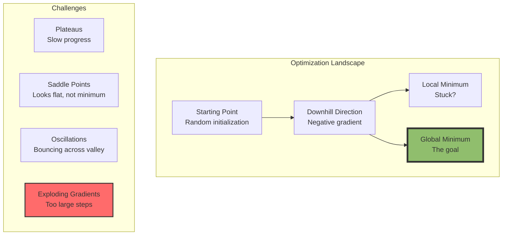

# The 2026 AI Metromap: Loss Functions & Optimization – Navigating to the Minimum

## Series B: Supervised Learning Line | Story 4 of 4


## 📖 Introduction

**Welcome to the final stop on the Supervised Learning Line.**

In our last story, you built backpropagation—the algorithm that computes gradients for every weight in your network. You saw how error flows backward through the layers, and how activation functions shape that flow.

Now we need to answer the final question: **Once we have gradients, how do we actually update the weights?**

This is optimization. And it's not as simple as "subtract gradient times learning rate."

If you've ever trained a neural network, you've seen it: loss curves that bounce wildly, training that converges too slowly, or worse—loss that explodes to infinity. These aren't failures of your model. They're failures of optimization.

This story—**The 2026 AI Metromap: Loss Functions & Optimization – Navigating to the Minimum**—is your guide to making networks learn efficiently. We'll explore loss functions—how we measure wrongness. We'll journey through gradient descent variants—from simple SGD to Adam, the optimizer that just works. We'll master learning rate schedules—the art of when to move fast and when to slow down. And we'll build intuition for why some optimizers converge faster than others.

**Let's navigate to the minimum.**

---

## 📚 Where You Are in the Journey

### The Master Story Arc: The 2026 AI Metromap Series (Complete)

- 🗺️ **[The 2026 AI Metromap: Why the Old Learning Routes Are Obsolete](#)** – A paradigm shift from linear learning to transit-system mastery.
- 🧭 **[The 2026 AI Metromap: Reading the Map](#)** – Strategic navigation across the three core lines.
- 🎒 **[The 2026 AI Metromap: Avoiding Derailments](#)** – Diagnosing and preventing the most common learning pitfalls.
- 🏁 **[The 2026 AI Metromap: From Passenger to Driver](#)** – Building your portfolio using the Metromap structure.

### Series A: Foundations Station (Complete)

- 🏗️ **[The 2026 AI Metromap: Foundations Station – Why Data Cleaning and Git Are Your Board Games, Not Just Chores](#)**
- 🖥️ **[The 2026 AI Metromap: Command Line & Version Control – Navigating the Terminal Like a Conductor](#)**
- 🧮 **[The 2026 AI Metromap: Linear Algebra for ML – The Language of the Map](#)**
- 📊 **[The 2026 AI Metromap: Data Cleaning & Visualization – Turning Raw Data into Tracks](#)**
- 🔄 **[The 2026 AI Metromap: Ethics & Responsible AI – The Safety Systems of the Metro](#)**

### Series B: Supervised Learning Line (4 Stories – Complete)

- 📊 **[The 2026 AI Metromap: Regression & Classification – The Grand Central Station of AI](#)** – Linear regression from scratch; logistic regression; evaluation metrics; connecting classical ML to modern deep learning.

- 🧬 **[The 2026 AI Metromap: Neural Network Architecture – From Perceptron to MLP](#)** – The biological inspiration; perceptron implementation; multi-layer perceptrons; forward propagation; universal approximation theorem.

- ⚡ **[The 2026 AI Metromap: Activation Functions & Backpropagation – The Electrical Grid of the Network](#)** – Sigmoid, tanh, ReLU, Leaky ReLU, Swish, GELU; the chain rule explained visually; backpropagation step-by-step; vanishing and exploding gradients.

- 🎯 **The 2026 AI Metromap: Loss Functions & Optimization – Navigating to the Minimum** – Cross-entropy, MSE, MAE, Huber loss; gradient descent variants (SGD, Momentum, Adam, AdamW); learning rate schedules. **⬅️ YOU ARE HERE**

### Series B Complete!

You've completed all four stories in the Supervised Learning Line. Your next journey continues into:

- 🚀 **Series C: Modern Architecture Line** – Transformers, LLMs, diffusion models, and multimodal systems
- ⚙️ **Series D: Engineering & Optimization Yard** – Production, deployment, and scale
- 🤖 **Series E: Applied AI & Agents Line** – Real-world applications across industries

### The Complete Story Catalog

For a complete view of all upcoming stories across every series, visit the **[Complete 2026 AI Metromap Story Catalog](#)**.

---

## 🎯 Loss Functions: How We Measure Wrongness

Before we can optimize, we need to measure. Loss functions quantify how far our predictions are from reality.

```mermaid
graph TD
    subgraph "Loss Functions"
        Y[True Value y] --> L[Loss = f(y, ŷ)]
        YH[Prediction ŷ] --> L
        L --> O[Optimizer minimizes this]
    end
    
    subgraph "Regression Losses"
        MSE[Mean Squared Error<br/>(y - ŷ)²]
        MAE[Mean Absolute Error<br/>|y - ŷ|]
        H[Huber<br/>Combines MSE + MAE]
    end
    
    subgraph "Classification Losses"
        BCE[Binary Cross-Entropy<br/>-y·log(ŷ) - (1-y)·log(1-ŷ)]
        CE[Categorical Cross-Entropy<br/>-Σyᵢ·log(ŷᵢ)]
        HL[Hinge Loss<br/>max(0, 1 - y·ŷ)]
    end
    
    style MSE fill:#90be6d,stroke:#333,stroke-width:2px
    style BCE fill:#4d908e,stroke:#333,stroke-width:2px
```

### Visualizing Loss Functions

```python
import numpy as np
import matplotlib.pyplot as plt
from sklearn.metrics import mean_squared_error, mean_absolute_error

def visualize_loss_functions():
    """Visualize different loss functions"""
    
    # True value
    y_true = 0
    
    # Predictions range
    y_pred = np.linspace(-2, 2, 1000)
    
    # Regression losses
    mse = (y_true - y_pred) ** 2
    mae = np.abs(y_true - y_pred)
    huber = np.where(np.abs(y_true - y_pred) <= 1,
                     0.5 * (y_true - y_pred) ** 2,
                     1 * (np.abs(y_true - y_pred) - 0.5))
    
    # Classification losses (binary, with y_true=1)
    y_true_binary = 1
    bce = -y_true_binary * np.log(np.clip(y_pred, 1e-7, 1-1e-7)) - \
          (1 - y_true_binary) * np.log(np.clip(1 - y_pred, 1e-7, 1-1e-7))
    # For probabilities only
    y_pred_proba = np.linspace(0.01, 0.99, 1000)
    bce_proba = -y_true_binary * np.log(y_pred_proba) - \
                (1 - y_true_binary) * np.log(1 - y_pred_proba)
    
    fig, axes = plt.subplots(1, 3, figsize=(15, 5))
    
    # Regression losses
    axes[0].plot(y_pred, mse, 'b-', linewidth=2, label='MSE')
    axes[0].plot(y_pred, mae, 'r-', linewidth=2, label='MAE')
    axes[0].plot(y_pred, huber, 'g-', linewidth=2, label='Huber (δ=1)')
    axes[0].axvline(x=0, color='k', linestyle='--', alpha=0.5)
    axes[0].set_xlabel('Prediction - Truth')
    axes[0].set_ylabel('Loss')
    axes[0].set_title('Regression Loss Functions')
    axes[0].legend()
    axes[0].grid(True, alpha=0.3)
    
    # Classification loss (probability space)
    axes[1].plot(y_pred_proba, bce_proba, 'b-', linewidth=2)
    axes[1].axvline(x=0.5, color='r', linestyle='--', alpha=0.5, label='Decision Boundary')
    axes[1].set_xlabel('Predicted Probability (y_true=1)')
    axes[1].set_ylabel('Binary Cross-Entropy Loss')
    axes[1].set_title('Classification Loss: BCE')
    axes[1].legend()
    axes[1].grid(True, alpha=0.3)
    
    # Compare gradient magnitudes
    mse_grad = 2 * (y_pred - y_true)
    mae_grad = np.sign(y_pred - y_true)
    axes[2].plot(y_pred, mse_grad, 'b-', linewidth=2, label='MSE Gradient')
    axes[2].plot(y_pred, mae_grad, 'r-', linewidth=2, label='MAE Gradient')
    axes[2].axhline(y=0, color='k', linestyle='-', alpha=0.5)
    axes[2].axvline(x=0, color='k', linestyle='--', alpha=0.5)
    axes[2].set_xlabel('Prediction - Truth')
    axes[2].set_ylabel('Gradient')
    axes[2].set_title('Loss Gradients')
    axes[2].legend()
    axes[2].grid(True, alpha=0.3)
    
    plt.tight_layout()
    plt.show()
    
    # Print comparison
    print("\n" + "="*60)
    print("LOSS FUNCTION COMPARISON")
    print("="*60)
    print("MSE (Mean Squared Error):")
    print("  • Penalizes large errors heavily")
    print("  • Gradient grows with error → unstable with outliers")
    print("  • Best when errors are normally distributed")
    print("\nMAE (Mean Absolute Error):")
    print("  • Constant gradient magnitude → robust to outliers")
    print("  • Gradient discontinuous at 0")
    print("  • Best when outliers are expected")
    print("\nHuber Loss:")
    print("  • Best of both worlds")
    print("  • Quadratic for small errors, linear for large")
    print("  • δ controls transition point")
    print("\nBinary Cross-Entropy:")
    print("  • For classification probabilities")
    print("  • Gradient proportional to error")
    print("  • Matches sigmoid output naturally")

visualize_loss_functions()
```

### Choosing the Right Loss Function

| Problem Type | Loss Function | Why |
|--------------|---------------|-----|
| Regression (normal errors) | MSE | Smooth, convex, penalizes large errors |
| Regression (outliers expected) | MAE or Huber | Robust to outliers |
| Binary Classification | Binary Cross-Entropy | Matches sigmoid output, probabilistic interpretation |
| Multi-class Classification | Categorical Cross-Entropy | Softmax + cross-entropy = natural fit |
| Imbalanced Classification | Weighted BCE | Gives more weight to minority class |

---

## 🏔️ Optimization Landscape: The Geometry of Learning

Think of optimization as navigating a landscape. Your goal: find the lowest point.



---

## 🚶 Gradient Descent Variants: From Slow to Fast

### 1. Stochastic Gradient Descent (SGD) – The Classic

```python
class SGD:
    """Stochastic Gradient Descent - The simplest optimizer"""
    
    def __init__(self, learning_rate=0.01):
        self.lr = learning_rate
    
    def update(self, params, grads):
        """Simple parameter update"""
        for param, grad in zip(params, grads):
            param -= self.lr * grad
        return params
```

### 2. SGD with Momentum – Adding Inertia

```python
class SGDWithMomentum:
    """
    SGD with Momentum - Accelerates in consistent directions.
    Smooths oscillations.
    """
    
    def __init__(self, learning_rate=0.01, momentum=0.9):
        self.lr = learning_rate
        self.momentum = momentum
        self.velocities = []
    
    def update(self, params, grads):
        if not self.velocities:
            self.velocities = [np.zeros_like(p) for p in params]
        
        for i, (param, grad) in enumerate(zip(params, grads)):
            # Update velocity: v = μ·v - η·∇L
            self.velocities[i] = self.momentum * self.velocities[i] - self.lr * grad
            # Update parameter: θ = θ + v
            param += self.velocities[i]
        
        return params
```

### 3. AdaGrad – Adaptive Learning Rates per Parameter

```python
class AdaGrad:
    """
    AdaGrad - Larger updates for sparse features.
    Learning rate decays for frequent features.
    """
    
    def __init__(self, learning_rate=0.01, epsilon=1e-8):
        self.lr = learning_rate
        self.epsilon = epsilon
        self.cache = []
    
    def update(self, params, grads):
        if not self.cache:
            self.cache = [np.zeros_like(p) for p in params]
        
        for i, (param, grad) in enumerate(zip(params, grads)):
            # Accumulate squared gradients
            self.cache[i] += grad ** 2
            # Update with adaptive learning rate
            param -= self.lr * grad / (np.sqrt(self.cache[i]) + self.epsilon)
        
        return params
```

### 4. RMSprop – Fixing AdaGrad's Decay

```python
class RMSprop:
    """
    RMSprop - Uses moving average of squared gradients.
    Prevents learning rate from decaying to zero.
    """
    
    def __init__(self, learning_rate=0.001, decay_rate=0.9, epsilon=1e-8):
        self.lr = learning_rate
        self.decay_rate = decay_rate
        self.epsilon = epsilon
        self.cache = []
    
    def update(self, params, grads):
        if not self.cache:
            self.cache = [np.zeros_like(p) for p in params]
        
        for i, (param, grad) in enumerate(zip(params, grads)):
            # Moving average of squared gradients
            self.cache[i] = self.decay_rate * self.cache[i] + (1 - self.decay_rate) * grad ** 2
            # Update
            param -= self.lr * grad / (np.sqrt(self.cache[i]) + self.epsilon)
        
        return params
```

### 5. Adam – The Modern Standard

```python
class Adam:
    """
    Adam (Adaptive Moment Estimation) - Combines momentum and RMSprop.
    The default optimizer for most deep learning.
    """
    
    def __init__(self, learning_rate=0.001, beta1=0.9, beta2=0.999, epsilon=1e-8):
        self.lr = learning_rate
        self.beta1 = beta1
        self.beta2 = beta2
        self.epsilon = epsilon
        self.m = []  # First moment (momentum)
        self.v = []  # Second moment (RMSprop)
        self.t = 0   # Time step
    
    def update(self, params, grads):
        self.t += 1
        
        if not self.m:
            self.m = [np.zeros_like(p) for p in params]
            self.v = [np.zeros_like(p) for p in params]
        
        for i, (param, grad) in enumerate(zip(params, grads)):
            # Update biased first moment estimate
            self.m[i] = self.beta1 * self.m[i] + (1 - self.beta1) * grad
            
            # Update biased second moment estimate
            self.v[i] = self.beta2 * self.v[i] + (1 - self.beta2) * grad ** 2
            
            # Bias correction
            m_hat = self.m[i] / (1 - self.beta1 ** self.t)
            v_hat = self.v[i] / (1 - self.beta2 ** self.t)
            
            # Update parameters
            param -= self.lr * m_hat / (np.sqrt(v_hat) + self.epsilon)
        
        return params
```

---

## 🧪 Comparing Optimizers

Let's see how different optimizers perform on a challenging loss landscape.

```python
import numpy as np
import matplotlib.pyplot as plt
from sklearn.datasets import make_classification
from sklearn.model_selection import train_test_split

def compare_optimizers():
    """
    Compare different optimizers on a neural network.
    """
    # Generate non-linear classification data
    X, y = make_classification(
        n_samples=1000,
        n_features=20,
        n_informative=15,
        n_redundant=5,
        n_clusters_per_class=1,
        random_state=42
    )
    X_train, X_test, y_train, y_test = train_test_split(X, y, test_size=0.2, random_state=42)
    
    # Define a simple network
    class SimpleNetwork:
        def __init__(self, layer_sizes):
            self.layer_sizes = layer_sizes
            self.num_layers = len(layer_sizes)
            self.weights = []
            self.biases = []
            
            for i in range(self.num_layers - 1):
                w = np.random.randn(layer_sizes[i], layer_sizes[i+1]) * 0.1
                b = np.zeros((1, layer_sizes[i+1]))
                self.weights.append(w)
                self.biases.append(b)
        
        def forward(self, X):
            self.z = []
            self.a = [X]
            current = X
            
            for i in range(self.num_layers - 2):
                z = current @ self.weights[i] + self.biases[i]
                self.z.append(z)
                current = np.maximum(0, z)  # ReLU
                self.a.append(current)
            
            # Output layer
            z = current @ self.weights[-1] + self.biases[-1]
            self.z.append(z)
            current = 1 / (1 + np.exp(-z))  # Sigmoid
            self.a.append(current)
            
            return current
        
        def backward(self, X, y):
            n = X.shape[0]
            
            # Output layer gradient
            dz = self.a[-1] - y.reshape(-1, 1)
            
            grads_w = [np.zeros_like(w) for w in self.weights]
            grads_b = [np.zeros_like(b) for b in self.biases]
            
            for i in reversed(range(self.num_layers - 1)):
                grads_w[i] = (1 / n) * self.a[i].T @ dz
                grads_b[i] = (1 / n) * np.sum(dz, axis=0, keepdims=True)
                
                if i > 0:
                    da = dz @ self.weights[i].T
                    dz = da * (self.z[i-1] > 0).astype(float)
            
            return grads_w, grads_b
        
        def train_step(self, X, y, optimizer):
            # Forward
            predictions = self.forward(X)
            
            # Loss
            loss = -np.mean(y * np.log(predictions + 1e-8) + 
                           (1 - y) * np.log(1 - predictions + 1e-8))
            
            # Backward
            grads_w, grads_b = self.backward(X, y)
            
            # Update with optimizer
            params = self.weights + self.biases
            grads = grads_w + grads_b
            
            new_params = optimizer.update(params, grads)
            
            self.weights = new_params[:len(self.weights)]
            self.biases = new_params[len(self.weights):]
            
            return loss
    
    # Define optimizers to test
    optimizers = {
        'SGD': SGD(learning_rate=0.01),
        'Momentum': SGDWithMomentum(learning_rate=0.01, momentum=0.9),
        'Adam': Adam(learning_rate=0.001)
    }
    
    # Train networks with each optimizer
    results = {}
    
    fig, axes = plt.subplots(1, 3, figsize=(15, 5))
    
    for idx, (name, optimizer) in enumerate(optimizers.items()):
        print(f"\nTraining with {name}...")
        
        # Initialize network
        network = SimpleNetwork([20, 64, 32, 1])
        
        losses = []
        val_accuracies = []
        
        for epoch in range(300):
            # Train on random batch (simulating mini-batch)
            batch_idx = np.random.choice(len(X_train), 64, replace=False)
            X_batch = X_train[batch_idx]
            y_batch = y_train[batch_idx]
            
            loss = network.train_step(X_batch, y_batch, optimizer)
            losses.append(loss)
            
            # Evaluate every 10 epochs
            if epoch % 10 == 0:
                train_pred = network.forward(X_train)
                train_acc = np.mean((train_pred.flatten() >= 0.5) == y_train)
                val_pred = network.forward(X_test)
                val_acc = np.mean((val_pred.flatten() >= 0.5) == y_test)
                val_accuracies.append(val_acc)
        
        results[name] = {
            'losses': losses,
            'val_accuracies': val_accuracies,
            'final_acc': val_accuracies[-1]
        }
        
        # Plot
        axes[idx].plot(losses, linewidth=2)
        axes[idx].set_title(f'{name} - Final Acc: {val_accuracies[-1]:.2%}')
        axes[idx].set_xlabel('Epoch')
        axes[idx].set_ylabel('Loss')
        axes[idx].grid(True, alpha=0.3)
        axes[idx].set_yscale('log')
    
    plt.tight_layout()
    plt.show()
    
    # Print comparison
    print("\n" + "="*60)
    print("OPTIMIZER COMPARISON")
    print("="*60)
    for name, res in results.items():
        print(f"{name:10} | Final Accuracy: {res['final_acc']:.2%} | Final Loss: {res['losses'][-1]:.4f}")
    
    return results

# Run comparison
comparison = compare_optimizers()
```

**What You'll Observe:**

- **SGD** – Slowest convergence, noisy loss curve
- **Momentum** – Faster convergence, smoother loss curve
- **Adam** – Fastest convergence, most stable, highest final accuracy

---

## 📈 Learning Rate Schedules: When to Slow Down

The learning rate is the most important hyperparameter. But a fixed learning rate is rarely optimal.

```mermaid
graph TD
    subgraph "Learning Rate Strategies"
        F[Fixed<br/>Constant η] --> P[Problems:<br/>Too fast → diverge<br/>Too slow → slow convergence]
        
        S[Step Decay<br/>Reduce by factor every N epochs] --> B[Balance:<br/>Fast start, fine later]
        
        E[Exponential Decay<br/>η = η₀·e⁻ᵏᵗ] --> S2[Smooth reduction]
        
        C[Cosine Annealing<br/>η = η_min + (η₀-η_min)·(1+cos(πt/T))/2] --> W[Warm restarts<br/>Escape local minima]
        
        W[Warmup<br/>Increase η gradually] --> U[Stable start<br/>Prevents early divergence]
    end
    
    style F fill:#f9f,stroke:#333,stroke-width:2px
    style S fill:#90be6d,stroke:#333,stroke-width:2px
    style W fill:#ffd700,stroke:#333,stroke-width:2px
```

### Implementing Learning Rate Schedules

```python
import numpy as np
import matplotlib.pyplot as plt

def visualize_lr_schedules():
    """Visualize different learning rate schedules"""
    
    epochs = 100
    initial_lr = 0.1
    final_lr = 0.001
    
    # Schedule functions
    def constant(epoch):
        return initial_lr
    
    def step_decay(epoch, drop_rate=0.5, epochs_drop=30):
        return initial_lr * (drop_rate ** (epoch // epochs_drop))
    
    def exponential_decay(epoch, decay_rate=0.95):
        return initial_lr * (decay_rate ** epoch)
    
    def cosine_annealing(epoch, T_max=100, eta_min=0.001):
        return eta_min + (initial_lr - eta_min) * (1 + np.cos(np.pi * epoch / T_max)) / 2
    
    def warmup(epoch, warmup_epochs=10):
        if epoch < warmup_epochs:
            return initial_lr * (epoch + 1) / warmup_epochs
        return initial_lr
    
    schedules = {
        'Constant': constant,
        'Step Decay (30 epochs)': step_decay,
        'Exponential Decay (0.95)': exponential_decay,
        'Cosine Annealing': cosine_annealing,
        'Warmup (10 epochs)': warmup
    }
    
    fig, axes = plt.subplots(1, 3, figsize=(15, 5))
    
    # Plot learning rates
    axes[0].set_prop_cycle(color=['b', 'r', 'g', 'orange', 'purple'])
    for name, schedule in schedules.items():
        rates = [schedule(e) for e in range(epochs)]
        axes[0].plot(rates, linewidth=2, label=name)
    axes[0].set_xlabel('Epoch')
    axes[0].set_ylabel('Learning Rate')
    axes[0].set_title('Learning Rate Schedules')
    axes[0].legend()
    axes[0].grid(True, alpha=0.3)
    
    # Step decay zoom
    axes[1].plot([step_decay(e) for e in range(epochs)], 'b-', linewidth=2)
    axes[1].set_xlabel('Epoch')
    axes[1].set_ylabel('Learning Rate')
    axes[1].set_title('Step Decay - Clear Steps')
    axes[1].grid(True, alpha=0.3)
    
    # Cosine annealing with restarts
    def cosine_restarts(epoch, T_0=30, T_mult=2):
        """Cosine annealing with warm restarts"""
        T_cur = epoch
        T_i = T_0
        while T_cur >= T_i:
            T_cur -= T_i
            T_i *= T_mult
        return final_lr + (initial_lr - final_lr) * (1 + np.cos(np.pi * T_cur / T_i)) / 2
    
    axes[2].plot([cosine_restarts(e) for e in range(200)], 'g-', linewidth=2)
    axes[2].set_xlabel('Epoch')
    axes[2].set_ylabel('Learning Rate')
    axes[2].set_title('Cosine Annealing with Warm Restarts')
    axes[2].grid(True, alpha=0.3)
    
    plt.tight_layout()
    plt.show()
    
    # Print recommendations
    print("\n" + "="*60)
    print("LEARNING RATE SCHEDULE RECOMMENDATIONS")
    print("="*60)
    print("Constant:")
    print("  • Simple, but rarely optimal")
    print("  • Best when you know the right learning rate")
    print("\nStep Decay:")
    print("  • Standard for many tasks")
    print("  • Reduce by factor of 0.1-0.5 every 30-50 epochs")
    print("\nExponential Decay:")
    print("  • Smooth reduction")
    print("  • Good for long training runs")
    print("\nCosine Annealing:")
    print("  • Popular in modern architectures")
    print("  • Helps escape local minima")
    print("\nWarmup:")
    print("  • Essential for very deep networks")
    print("  • Prevents early instability")
    print("  • Often combined with other schedules")

visualize_lr_schedules()
```

---

## 🔧 The Complete Optimization Pipeline

Here's how everything fits together.

```python
class CompleteOptimizer:
    """
    Complete optimizer with learning rate scheduling and gradient clipping.
    """
    
    def __init__(self, optimizer='adam', lr=0.001, lr_schedule='constant', 
                 clip_grad_norm=None, **kwargs):
        """
        Args:
            optimizer: 'sgd', 'momentum', 'adam'
            lr: Initial learning rate
            lr_schedule: 'constant', 'step', 'cosine'
            clip_grad_norm: Max gradient norm (for stability)
        """
        self.base_lr = lr
        self.lr_schedule = lr_schedule
        self.clip_grad_norm = clip_grad_norm
        self.epoch = 0
        
        # Create optimizer
        if optimizer == 'sgd':
            self.opt = SGD(learning_rate=lr)
        elif optimizer == 'momentum':
            self.opt = SGDWithMomentum(learning_rate=lr, momentum=kwargs.get('momentum', 0.9))
        elif optimizer == 'adam':
            self.opt = Adam(learning_rate=lr, beta1=kwargs.get('beta1', 0.9),
                          beta2=kwargs.get('beta2', 0.999))
        else:
            raise ValueError(f"Unknown optimizer: {optimizer}")
    
    def get_lr(self):
        """Get learning rate for current epoch"""
        if self.lr_schedule == 'constant':
            return self.base_lr
        elif self.lr_schedule == 'step':
            return self.base_lr * (0.5 ** (self.epoch // 30))
        elif self.lr_schedule == 'cosine':
            return 0.001 + (self.base_lr - 0.001) * (1 + np.cos(np.pi * self.epoch / 100)) / 2
        else:
            return self.base_lr
    
    def update(self, params, grads):
        """Update parameters with current learning rate and gradient clipping"""
        self.epoch += 1
        
        # Update optimizer learning rate
        self.opt.lr = self.get_lr()
        
        # Clip gradients if needed
        if self.clip_grad_norm:
            total_norm = np.sqrt(sum(np.sum(g ** 2) for g in grads))
            if total_norm > self.clip_grad_norm:
                scale = self.clip_grad_norm / total_norm
                grads = [g * scale for g in grads]
        
        # Update parameters
        return self.opt.update(params, grads)

# Example usage
optimizer = CompleteOptimizer(
    optimizer='adam',
    lr=0.01,
    lr_schedule='cosine',
    clip_grad_norm=1.0
)
```

---

## 📊 Takeaway from This Story

**What You Learned:**

- **Loss Functions** – How we measure error. MSE for regression, cross-entropy for classification. Choose based on your problem and data distribution.

- **Optimization Landscape** – The geometry of learning. Local minima, saddle points, plateaus, and how optimizers navigate them.

- **Optimizer Evolution** – From simple SGD to Momentum (inertia) to AdaGrad (adaptive per parameter) to Adam (momentum + adaptive). Adam is the modern default.

- **Learning Rate Schedules** – When to move fast and when to slow down. Step decay, cosine annealing, warmup, and their combinations.

- **Gradient Clipping** – Preventing exploding gradients. Essential for RNNs and deep networks.

- **The Complete Pipeline** – Loss function + optimizer + learning rate schedule = trainable network.

---

## 🔗 Navigation

- **⬅️ Previous Story:** [The 2026 AI Metromap: Activation Functions & Backpropagation – The Electrical Grid of the Network](#)

- **📚 Series B Catalog:** [Series B: Supervised Learning Line](#) – View all 4 stories in this series.

- **📚 Complete Story Catalog:** [Complete 2026 AI Metromap Story Catalog](#) – Your navigation guide to all 39+ stories.

- **➡️ Your Next Station:** Supervised Learning Line is complete! Choose your next series:

  - 🚀 **[Series C: Modern Architecture Line](#)** – Transformers, LLMs, diffusion models, and multimodal systems
  - ⚙️ **[Series D: Engineering & Optimization Yard](#)** – Production, deployment, and scale
  - 🤖 **[Series E: Applied AI & Agents Line](#)** – Real-world applications across industries

---

## 📝 Your Invitation

Supervised Learning Line is complete. You now understand the foundations of how neural networks learn—from architecture to activation to optimization.

Before moving to your next series:

1. **Experiment with optimizers** – Train the same network with SGD, Momentum, and Adam. Compare convergence.

2. **Visualize loss landscapes** – Plot loss as a function of two weights. See the geometry.

3. **Implement learning rate schedules** – Watch how training behavior changes with different schedules.

4. **Build your own optimizer** – Implement something novel. What happens if you combine momentum with gradient clipping differently?

**You've mastered the classic route. Now it's time to ride the express lines.**

---

*Found this helpful? Clap, comment, and share your optimizer experiments. Supervised Learning Line is complete. Your journey continues!* 🚇