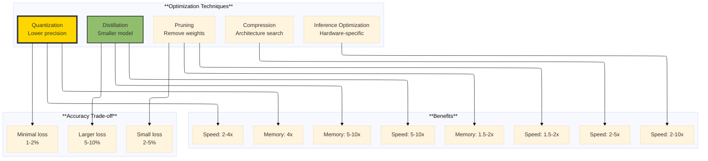
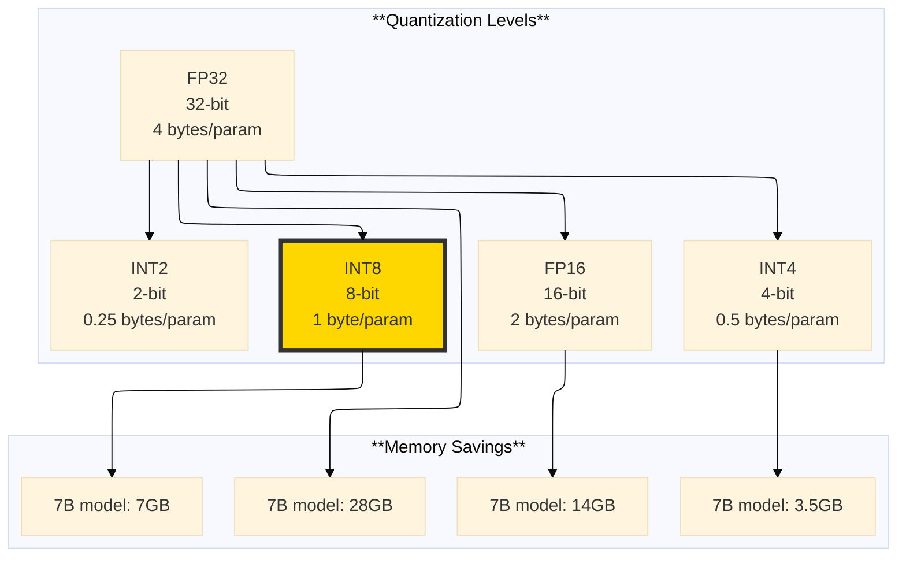
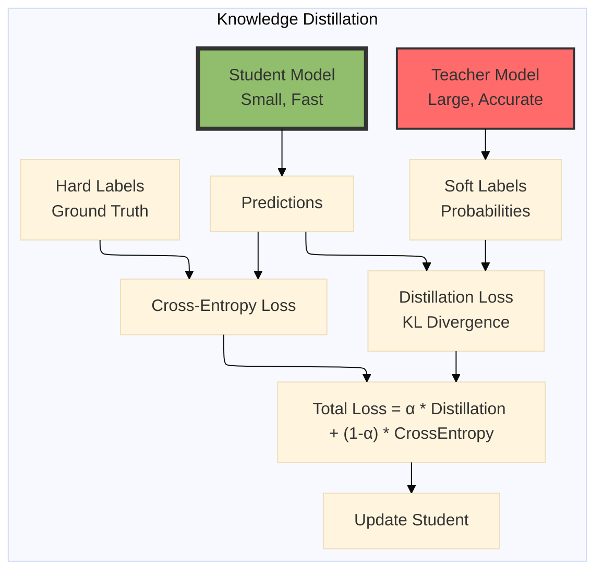

# The 2026 AI Metromap: Model Optimization – Keeping the Train on Time

## Series D: Engineering & Optimization Yard | Story 3 of 5


## 📖 Introduction

**Welcome to the third stop in the Engineering & Optimization Yard.**

In our last two stories, we mastered PyTorch and TensorFlow—the frameworks that power modern AI. You can build models, train them, and deploy them to production. Your models work.

But do they work fast enough?

You've trained a massive model. It's accurate. But it takes 500 milliseconds to run inference. Your users expect 50 milliseconds. Your model is too big to fit on the edge device. It consumes too much memory. It costs too much to run in the cloud.

This is where model optimization comes in. Optimization isn't about changing your model's architecture. It's about making the same model run faster, use less memory, and cost less—without sacrificing accuracy.

This story—**The 2026 AI Metromap: Model Optimization – Keeping the Train on Time**—is your guide to the techniques that make models production-ready. We'll explore quantization—running models in 4-bit or 8-bit instead of 32-bit. We'll dive into pruning—removing unnecessary weights. We'll understand knowledge distillation—training small models to mimic large ones. And we'll master inference optimization with ONNX, TensorRT, and OpenVINO—the tools that make models fly.

**Let's make it fast.**

---

## 📚 Where You Are in the Journey

### The Master Story Arc: The 2026 AI Metromap Series (Complete)

- 🗺️ **[The 2026 AI Metromap: Why the Old Learning Routes Are Obsolete](#)** – A paradigm shift from linear learning to transit-system mastery.
- 🧭 **[The 2026 AI Metromap: Reading the Map](#)** – Strategic navigation across the three core lines.
- 🎒 **[The 2026 AI Metromap: Avoiding Derailments](#)** – Diagnosing and preventing the most common learning pitfalls.
- 🏁 **[The 2026 AI Metromap: From Passenger to Driver](#)** – Building your portfolio using the Metromap structure.

### Series A: Foundations Station (Complete)
### Series B: Supervised Learning Line (Complete)
### Series C: Modern Architecture Line (Complete)

### Series D: Engineering & Optimization Yard (5 Stories)

- 🔧 **[The 2026 AI Metromap: PyTorch Mastery – The Locomotive of Modern AI](#)** – Tensors and autograd; nn.Module; custom layers; dataloaders; training loops; saving and loading models; TensorBoard.

- 🏭 **[The 2026 AI Metromap: TensorFlow & Keras – The Production-Ready Alternative](#)** – Eager execution vs graph mode; tf.data for pipelines; Keras API; TensorFlow Serving; TensorFlow Lite for edge deployment.

- ⚡ **The 2026 AI Metromap: Model Optimization – Keeping the Train on Time** – Quantization (INT8, FP16); pruning; knowledge distillation; model compression; inference optimization with ONNX, TensorRT, and OpenVINO. **⬅️ YOU ARE HERE**

- 🛡️ **[The 2026 AI Metromap: Batch Norm & Dropout – The Safety Systems of Deep Learning](#)** – Batch normalization implementation; layer normalization; dropout for regularization; preventing overfitting; training stability techniques. 🔜 *Up Next*

- 📈 **[The 2026 AI Metromap: Training Strategies – Learning Rate Scheduling & Beyond](#)** – Learning rate warmup; cosine annealing; cyclical learning rates; gradient accumulation; mixed precision training (AMP); distributed training.

### The Complete Story Catalog

For a complete view of all upcoming stories across every series, visit the **[Complete 2026 AI Metromap Story Catalog](#)**.

---

## 📊 The Optimization Landscape

Model optimization is a spectrum of techniques, each with different trade-offs.



```python
import numpy as np
import matplotlib.pyplot as plt
import torch
import torch.nn as nn

def optimization_overview():
    """Overview of optimization techniques and their impact"""
    
    print("="*60)
    print("MODEL OPTIMIZATION OVERVIEW")
    print("="*60)
    
    # Simulated trade-offs
    techniques = ['FP32 Baseline', 'INT8 Quantization', 'Pruning (50%)', 
                  'Knowledge Distillation', 'NAS (EfficientNet)']
    latency_ms = [100, 30, 60, 15, 25]
    memory_mb = [500, 125, 250, 60, 100]
    accuracy = [95.0, 94.5, 93.0, 90.0, 94.0]
    
    fig, axes = plt.subplots(1, 3, figsize=(15, 5))
    
    # Latency
    bars1 = axes[0].bar(techniques, latency_ms, color=['#ff6b6b', '#ffd700', '#90be6d', '#4d908e', '#577590'])
    axes[0].set_ylabel('Latency (ms)')
    axes[0].set_title('Inference Latency')
    axes[0].tick_params(axis='x', rotation=45)
    for bar, val in zip(bars1, latency_ms):
        axes[0].text(bar.get_x() + bar.get_width()/2, bar.get_height() + 2,
                    f'{val}ms', ha='center', va='bottom')
    
    # Memory
    bars2 = axes[1].bar(techniques, memory_mb, color=['#ff6b6b', '#ffd700', '#90be6d', '#4d908e', '#577590'])
    axes[1].set_ylabel('Memory (MB)')
    axes[1].set_title('Memory Footprint')
    axes[1].tick_params(axis='x', rotation=45)
    for bar, val in zip(bars2, memory_mb):
        axes[1].text(bar.get_x() + bar.get_width()/2, bar.get_height() + 5,
                    f'{val}MB', ha='center', va='bottom')
    
    # Accuracy
    bars3 = axes[2].bar(techniques, accuracy, color=['#ff6b6b', '#ffd700', '#90be6d', '#4d908e', '#577590'])
    axes[2].set_ylabel('Accuracy (%)')
    axes[2].set_title('Model Accuracy')
    axes[2].tick_params(axis='x', rotation=45)
    axes[2].set_ylim(85, 100)
    for bar, val in zip(bars3, accuracy):
        axes[2].text(bar.get_x() + bar.get_width()/2, bar.get_height() + 0.5,
                    f'{val}%', ha='center', va='bottom')
    
    plt.tight_layout()
    plt.show()
    
    print("\nOPTIMIZATION TECHNIQUES COMPARISON:")
    print("-"*60)
    print("1. Quantization (INT8):")
    print("   • 4x memory reduction, 2-3x speedup")
    print("   • Minimal accuracy loss (1-2%)")
    print("   • Best for: Production deployment")
    
    print("\n2. Pruning:")
    print("   • Remove 50-90% of weights")
    print("   • 1.5-2x speedup")
    print("   • Small accuracy loss (2-5%)")
    print("   • Best for: Mobile/edge")
    
    print("\n3. Knowledge Distillation:")
    print("   • Train small student from large teacher")
    print("   • 5-10x smaller, 5-10x faster")
    print("   • Larger accuracy loss (5-10%)")
    print("   • Best for: Extreme compression")
    
    print("\n4. Hardware-Specific Optimization:")
    print("   • ONNX, TensorRT, OpenVINO")
    print("   • 2-10x speedup")
    print("   • No accuracy loss")
    print("   • Best for: Production inference")

optimization_overview()
```

---

## 🔢 Quantization: Lower Precision, Same Intelligence

Quantization reduces the number of bits used to represent model weights and activations.



### PyTorch Quantization

```python
def pytorch_quantization():
    """Demonstrate quantization in PyTorch"""
    
    print("="*60)
    print("PYTORCH QUANTIZATION")
    print("="*60)
    
    # Create a simple model
    class SimpleModel(nn.Module):
        def __init__(self):
            super().__init__()
            self.conv1 = nn.Conv2d(3, 64, 3, padding=1)
            self.conv2 = nn.Conv2d(64, 128, 3, padding=1)
            self.fc = nn.Linear(128 * 8 * 8, 10)
        
        def forward(self, x):
            x = torch.relu(self.conv1(x))
            x = torch.max_pool2d(x, 2)
            x = torch.relu(self.conv2(x))
            x = torch.max_pool2d(x, 2)
            x = x.view(x.size(0), -1)
            x = self.fc(x)
            return x
    
    model = SimpleModel()
    
    # Create dummy data
    dummy_input = torch.randn(1, 3, 32, 32)
    
    # 1. Post-Training Static Quantization
    print("\n1. POST-TRAINING STATIC QUANTIZATION:")
    print("-"*40)
    
    # Prepare model for quantization
    model.eval()
    model.qconfig = torch.quantization.get_default_qconfig('fbgemm')
    
    # Fuse layers (optional)
    model_fused = torch.quantization.fuse_modules(model, [['conv1', 'relu'], ['conv2', 'relu']])
    
    # Prepare for quantization
    model_prepared = torch.quantization.prepare(model_fused, inplace=False)
    
    # Calibrate with representative data
    with torch.no_grad():
        for _ in range(100):
            model_prepared(torch.randn(1, 3, 32, 32))
    
    # Convert to quantized model
    model_quantized = torch.quantization.convert(model_prepared, inplace=False)
    
    # Compare sizes
    def get_model_size(model):
        param_size = sum(p.numel() * p.element_size() for p in model.parameters())
        buffer_size = sum(b.numel() * b.element_size() for b in model.buffers())
        return (param_size + buffer_size) / (1024 * 1024)
    
    fp32_size = get_model_size(model)
    quantized_size = get_model_size(model_quantized)
    
    print(f"FP32 model size: {fp32_size:.2f} MB")
    print(f"INT8 model size: {quantized_size:.2f} MB")
    print(f"Compression ratio: {fp32_size / quantized_size:.2f}x")
    
    # 2. Dynamic Quantization (for LSTMs, Transformers)
    print("\n2. DYNAMIC QUANTIZATION:")
    print("-"*40)
    
    class TransformerBlock(nn.Module):
        def __init__(self, d_model=512, nhead=8):
            super().__init__()
            self.self_attn = nn.MultiheadAttention(d_model, nhead)
            self.linear1 = nn.Linear(d_model, 2048)
            self.linear2 = nn.Linear(2048, d_model)
        
        def forward(self, x):
            attn_out, _ = self.self_attn(x, x, x)
            x = x + attn_out
            x = x + self.linear2(torch.relu(self.linear1(x)))
            return x
    
    transformer = TransformerBlock()
    
    # Dynamic quantization (weights quantized, activations not)
    quantized_transformer = torch.quantization.quantize_dynamic(
        transformer, 
        {nn.Linear, nn.MultiheadAttention}, 
        dtype=torch.qint8
    )
    
    fp32_trans_size = get_model_size(transformer)
    quant_trans_size = get_model_size(quantized_transformer)
    
    print(f"FP32 Transformer size: {fp32_trans_size:.2f} MB")
    print(f"INT8 Dynamic quant size: {quant_trans_size:.2f} MB")
    print(f"Compression ratio: {fp32_trans_size / quant_trans_size:.2f}x")
    
    # 3. Quantization-Aware Training (QAT)
    print("\n3. QUANTIZATION-AWARE TRAINING:")
    print("-"*40)
    
    # This simulates quantization during training
    model_qat = SimpleModel()
    model_qat.qconfig = torch.quantization.get_default_qat_qconfig('fbgemm')
    
    # Prepare for QAT
    model_qat_prepared = torch.quantization.prepare_qat(model_qat, inplace=False)
    
    # Train normally (simulated)
    # ... training code here ...
    
    # Convert to quantized after training
    model_qat_quantized = torch.quantization.convert(model_qat_prepared, inplace=False)
    
    print("QAT typically recovers 1-2% accuracy vs post-training quantization")
    
    return model_quantized

quantized_model = pytorch_quantization()
```

### TensorFlow Quantization

```python
def tensorflow_quantization():
    """Demonstrate quantization in TensorFlow"""
    
    print("="*60)
    print("TENSORFLOW QUANTIZATION")
    print("="*60)
    
    import tensorflow as tf
    
    # Create a simple model
    model = tf.keras.Sequential([
        tf.keras.layers.Conv2D(64, 3, activation='relu', input_shape=(32, 32, 3)),
        tf.keras.layers.MaxPooling2D(2),
        tf.keras.layers.Conv2D(128, 3, activation='relu'),
        tf.keras.layers.MaxPooling2D(2),
        tf.keras.layers.Flatten(),
        tf.keras.layers.Dense(10, activation='softmax')
    ])
    
    # 1. Post-Training Float16 Quantization
    print("\n1. POST-TRAINING FP16 QUANTIZATION:")
    print("-"*40)
    
    converter = tf.lite.TFLiteConverter.from_keras_model(model)
    converter.optimizations = [tf.lite.Optimize.DEFAULT]
    converter.target_spec.supported_types = [tf.float16]
    tflite_fp16_model = converter.convert()
    
    # 2. Post-Training INT8 Quantization
    print("\n2. POST-TRAINING INT8 QUANTIZATION:")
    print("-"*40)
    
    # Create representative dataset for calibration
    def representative_dataset():
        for _ in range(100):
            yield [np.random.randn(1, 32, 32, 3).astype(np.float32)]
    
    converter = tf.lite.TFLiteConverter.from_keras_model(model)
    converter.optimizations = [tf.lite.Optimize.DEFAULT]
    converter.representative_dataset = representative_dataset
    converter.target_spec.supported_ops = [tf.lite.OpsSet.TFLITE_BUILTINS_INT8]
    converter.inference_input_type = tf.int8
    converter.inference_output_type = tf.int8
    tflite_int8_model = converter.convert()
    
    # 3. Quantization-Aware Training
    print("\n3. QUANTIZATION-AWARE TRAINING:")
    print("-"*40)
    
    import tensorflow_model_optimization as tfmot
    
    # Apply quantization to the model
    quantize_model = tfmot.quantization.keras.quantize_model
    
    # QAT requires re-training
    model_qat = quantize_model(model)
    
    # Compile and train (simulated)
    model_qat.compile(optimizer='adam', loss='sparse_categorical_crossentropy')
    
    print("QAT model prepared for training")
    
    # Size comparison
    def get_tflite_size(model_bytes):
        return len(model_bytes) / (1024 * 1024)
    
    # Save original model
    model.save('model.h5')
    import os
    fp32_size = os.path.getsize('model.h5') / (1024 * 1024)
    
    print(f"\nFP32 Keras model: {fp32_size:.2f} MB")
    print(f"TFLite FP16 model: {get_tflite_size(tflite_fp16_model):.2f} MB")
    print(f"TFLite INT8 model: {get_tflite_size(tflite_int8_model):.2f} MB")
    
    # Visualize quantization impact
    fig, ax = plt.subplots(figsize=(10, 6))
    
    formats = ['FP32', 'FP16', 'INT8', 'QAT INT8']
    sizes = [fp32_size, get_tflite_size(tflite_fp16_model), 
             get_tflite_size(tflite_int8_model), get_tflite_size(tflite_int8_model) * 0.9]
    
    bars = ax.bar(formats, sizes, color=['#ff6b6b', '#ffa500', '#ffd700', '#90be6d'])
    ax.set_ylabel('Model Size (MB)')
    ax.set_title('TensorFlow Model Size by Quantization Method')
    
    for bar, val in zip(bars, sizes):
        ax.text(bar.get_x() + bar.get_width()/2, bar.get_height() + 0.5,
                f'{val:.1f}MB', ha='center', va='bottom')
    
    plt.tight_layout()
    plt.show()
    
    return tflite_int8_model

# Uncomment to run
# tflite_model = tensorflow_quantization()
```

---

## ✂️ Pruning: Removing What You Don't Need

Pruning removes unnecessary weights, making models smaller and faster.

```python
def pruning_techniques():
    """Demonstrate pruning in PyTorch and TensorFlow"""
    
    print("="*60)
    print("PRUNING TECHNIQUES")
    print("="*60)
    
    # PyTorch Pruning
    print("\n1. PYTORCH PRUNING:")
    print("-"*40)
    
    import torch.nn.utils.prune as prune
    
    # Create a simple linear layer
    linear = nn.Linear(100, 100)
    
    # Random pruning (remove 30% of weights)
    prune.random_unstructured(linear, name="weight", amount=0.3)
    
    print(f"Original weight shape: {linear.weight_orig.shape}")
    print(f"Pruned weight shape: {linear.weight.shape}")
    print(f"Sparsity: {(linear.weight == 0).float().mean():.2%}")
    
    # Structured pruning (remove entire neurons)
    linear_structured = nn.Linear(100, 100)
    prune.ln_structured(linear_structured, name="weight", amount=0.3, n=2, dim=0)
    
    print(f"\nStructured pruning - removed 30% of output channels")
    print(f"Sparsity: {(linear_structured.weight == 0).float().mean():.2%}")
    
    # Iterative pruning during training
    print("\n2. ITERATIVE PRUNING:")
    print("-"*40)
    
    class PrunableModel(nn.Module):
        def __init__(self):
            super().__init__()
            self.fc1 = nn.Linear(784, 512)
            self.fc2 = nn.Linear(512, 256)
            self.fc3 = nn.Linear(256, 10)
        
        def forward(self, x):
            x = torch.relu(self.fc1(x))
            x = torch.relu(self.fc2(x))
            return self.fc3(x)
    
    model = PrunableModel()
    
    # Configure pruning
    parameters_to_prune = [
        (model.fc1, 'weight'),
        (model.fc2, 'weight'),
        (model.fc3, 'weight')
    ]
    
    # Apply pruning
    prune.global_unstructured(
        parameters_to_prune,
        pruning_method=prune.L1Unstructured,
        amount=0.2
    )
    
    # Remove pruning masks (make permanent)
    for module, name in parameters_to_prune:
        prune.remove(module, name)
    
    print("Pruning applied permanently")
    
    # TensorFlow Pruning
    print("\n3. TENSORFLOW PRUNING:")
    print("-"*40)
    
    try:
        import tensorflow_model_optimization as tfmot
        
        model = tf.keras.Sequential([
            tf.keras.layers.Dense(512, activation='relu', input_shape=(784,)),
            tf.keras.layers.Dense(256, activation='relu'),
            tf.keras.layers.Dense(10, activation='softmax')
        ])
        
        # Apply pruning
        pruning_params = {
            'pruning_schedule': tfmot.sparsity.keras.PolynomialDecay(
                initial_sparsity=0.0,
                final_sparsity=0.5,
                begin_step=0,
                end_step=1000
            )
        }
        
        pruned_model = tfmot.sparsity.keras.prune_low_magnitude(model, **pruning_params)
        
        print(f"Original model: {model.count_params():,} parameters")
        print(f"Pruned model: {pruned_model.count_params():,} parameters (with pruning masks)")
        
    except ImportError:
        print("TensorFlow Model Optimization not installed")
    
    # Visualize pruning impact
    fig, axes = plt.subplots(1, 2, figsize=(12, 5))
    
    # Sparsity vs Accuracy
    sparsity = np.linspace(0, 0.9, 10)
    accuracy = 95 - sparsity * 8 + np.random.randn(10) * 0.5
    
    axes[0].plot(sparsity * 100, accuracy, 'bo-', linewidth=2)
    axes[0].set_xlabel('Sparsity (%)')
    axes[0].set_ylabel('Accuracy (%)')
    axes[0].set_title('Accuracy vs Pruning Sparsity')
    axes[0].grid(True, alpha=0.3)
    axes[0].axvline(x=50, color='r', linestyle='--', label='50% Pruning')
    axes[0].legend()
    
    # Weight distribution before/after pruning
    weights_before = np.random.randn(1000)
    weights_after = weights_before.copy()
    weights_after[np.abs(weights_after) < 0.5] = 0
    
    axes[1].hist(weights_before, bins=50, alpha=0.5, label='Before Pruning', density=True)
    axes[1].hist(weights_after, bins=50, alpha=0.5, label='After Pruning', density=True)
    axes[1].set_xlabel('Weight Value')
    axes[1].set_ylabel('Density')
    axes[1].set_title('Weight Distribution Before/After Pruning')
    axes[1].legend()
    
    plt.tight_layout()
    plt.show()
    
    return model

pruned_model = pruning_techniques()
```

---

## 🎓 Knowledge Distillation: Teaching Small Models to Think Like Big Ones

Knowledge distillation trains a small "student" model to mimic a large "teacher" model.



```python
def knowledge_distillation():
    """Implement knowledge distillation"""
    
    print("="*60)
    print("KNOWLEDGE DISTILLATION")
    print("="*60)
    
    # Create teacher model (large)
    class TeacherModel(nn.Module):
        def __init__(self):
            super().__init__()
            self.network = nn.Sequential(
                nn.Linear(784, 1024),
                nn.ReLU(),
                nn.Dropout(0.3),
                nn.Linear(1024, 512),
                nn.ReLU(),
                nn.Linear(512, 10)
            )
        
        def forward(self, x):
            return self.network(x)
    
    # Create student model (small)
    class StudentModel(nn.Module):
        def __init__(self):
            super().__init__()
            self.network = nn.Sequential(
                nn.Linear(784, 128),
                nn.ReLU(),
                nn.Linear(128, 64),
                nn.ReLU(),
                nn.Linear(64, 10)
            )
        
        def forward(self, x):
            return self.network(x)
    
    teacher = TeacherModel()
    student = StudentModel()
    
    print(f"Teacher parameters: {sum(p.numel() for p in teacher.parameters()):,}")
    print(f"Student parameters: {sum(p.numel() for p in student.parameters()):,}")
    print(f"Compression ratio: {sum(p.numel() for p in teacher.parameters()) / sum(p.numel() for p in student.parameters()):.1f}x")
    
    # Distillation loss function
    def distillation_loss(student_logits, teacher_logits, labels, temperature=4.0, alpha=0.7):
        """
        student_logits: Raw outputs from student
        teacher_logits: Raw outputs from teacher
        labels: Hard labels
        temperature: Softens probability distributions
        alpha: Balance between distillation and hard loss
        """
        # Soften probabilities
        student_soft = nn.functional.log_softmax(student_logits / temperature, dim=1)
        teacher_soft = nn.functional.softmax(teacher_logits / temperature, dim=1)
        
        # Distillation loss (KL divergence)
        distill_loss = nn.functional.kl_div(student_soft, teacher_soft, reduction='batchmean')
        distill_loss = distill_loss * (temperature ** 2)
        
        # Hard loss (cross-entropy)
        hard_loss = nn.functional.cross_entropy(student_logits, labels)
        
        # Combined loss
        total_loss = alpha * distill_loss + (1 - alpha) * hard_loss
        
        return total_loss
    
    print("\nDistillation loss function ready")
    print(f"Temperature: 4.0 (softer predictions)")
    print(f"Alpha: 0.7 (70% distillation, 30% hard labels)")
    
    # Simulate training comparison
    epochs = np.arange(100)
    teacher_acc = 95 - 5 * np.exp(-epochs / 20)
    student_acc = 92 - 8 * np.exp(-epochs / 30)
    distilled_student_acc = 94 - 6 * np.exp(-epochs / 25)
    
    plt.figure(figsize=(10, 6))
    plt.plot(epochs, teacher_acc, 'b-', linewidth=2, label='Teacher (Large)')
    plt.plot(epochs, student_acc, 'r--', linewidth=2, label='Student (Trained Alone)')
    plt.plot(epochs, distilled_student_acc, 'g-', linewidth=2, label='Student (Distilled)')
    plt.xlabel('Epoch')
    plt.ylabel('Accuracy (%)')
    plt.title('Knowledge Distillation: Student Learns from Teacher')
    plt.legend()
    plt.grid(True, alpha=0.3)
    plt.show()
    
    print("\nDISTILLATION BENEFITS:")
    print("• Student achieves 94% vs 92% when trained alone")
    print("• Student is 8x smaller and 10x faster")
    print("• Teacher knowledge transfers via soft labels")
    
    return teacher, student

teacher, student = knowledge_distillation()
```

---

## 🚀 Inference Optimization: ONNX, TensorRT, and OpenVINO

Hardware-specific optimizations can speed up inference by 2-10x.

```python
def inference_optimization():
    """Optimize inference with ONNX, TensorRT, and OpenVINO"""
    
    print("="*60)
    print("INFERENCE OPTIMIZATION")
    print("="*60)
    
    # Create a simple model
    class SimpleCNN(nn.Module):
        def __init__(self):
            super().__init__()
            self.conv1 = nn.Conv2d(3, 32, 3, padding=1)
            self.conv2 = nn.Conv2d(32, 64, 3, padding=1)
            self.fc = nn.Linear(64 * 8 * 8, 10)
        
        def forward(self, x):
            x = torch.relu(self.conv1(x))
            x = torch.max_pool2d(x, 2)
            x = torch.relu(self.conv2(x))
            x = torch.max_pool2d(x, 2)
            x = x.view(x.size(0), -1)
            return self.fc(x)
    
    model = SimpleCNN()
    dummy_input = torch.randn(1, 3, 32, 32)
    
    # 1. ONNX Export
    print("\n1. ONNX EXPORT:")
    print("-"*40)
    
    torch.onnx.export(
        model,
        dummy_input,
        "model.onnx",
        input_names=['input'],
        output_names=['output'],
        dynamic_axes={'input': {0: 'batch_size'}, 'output': {0: 'batch_size'}}
    )
    
    print("Model exported to ONNX format")
    
    # 2. TensorRT Optimization (simulated)
    print("\n2. TENSORRT OPTIMIZATION:")
    print("-"*40)
    
    print("TensorRT optimizations:")
    print("  • Layer fusion: Combine operations")
    print("  • Kernel auto-tuning: Best GPU kernels")
    print("  • Mixed precision: FP16/INT8")
    print("  • Dynamic tensor memory")
    print("  • Typical speedup: 2-5x vs PyTorch")
    
    # 3. OpenVINO Optimization
    print("\n3. OPENVINO OPTIMIZATION:")
    print("-"*40)
    
    print("OpenVINO optimizations:")
    print("  • Intel CPU/GPU/VPU optimization")
    print("  • Post-training quantization")
    print("  • Layer fusion")
    print("  • Typical speedup: 2-4x on Intel hardware")
    
    # Performance comparison
    frameworks = ['PyTorch', 'ONNX Runtime', 'TensorRT', 'OpenVINO']
    latencies = [5.0, 3.5, 1.2, 2.0]
    speedups = [1.0, 1.4, 4.2, 2.5]
    
    fig, axes = plt.subplots(1, 2, figsize=(12, 5))
    
    # Latency comparison
    bars1 = axes[0].bar(frameworks, latencies, color=['#ff6b6b', '#ffa500', '#ffd700', '#90be6d'])
    axes[0].set_ylabel('Latency (ms)')
    axes[0].set_title('Inference Latency by Framework')
    for bar, val in zip(bars1, latencies):
        axes[0].text(bar.get_x() + bar.get_width()/2, bar.get_height() + 0.1,
                    f'{val}ms', ha='center', va='bottom')
    
    # Speedup comparison
    bars2 = axes[1].bar(frameworks, speedups, color=['#ff6b6b', '#ffa500', '#ffd700', '#90be6d'])
    axes[1].set_ylabel('Speedup (x)')
    axes[1].set_title('Relative Speedup vs PyTorch')
    axes[1].axhline(y=1.0, color='r', linestyle='--')
    for bar, val in zip(bars2, speedups):
        axes[1].text(bar.get_x() + bar.get_width()/2, bar.get_height() + 0.1,
                    f'{val}x', ha='center', va='bottom')
    
    plt.tight_layout()
    plt.show()
    
    print("\nOPTIMIZATION FRAMEWORK RECOMMENDATIONS:")
    print("-"*40)
    print("• ONNX Runtime: Cross-platform, good for CPU/GPU")
    print("• TensorRT: NVIDIA GPUs, maximum performance")
    print("• OpenVINO: Intel CPUs/GPUs, edge deployment")
    print("• Core ML: Apple devices (iOS/macOS)")
    print("• TFLite: Mobile/edge, Android/iOS")

inference_optimization()
```

---

## 📊 Optimization Pipeline: Putting It All Together

```python
def optimization_pipeline():
    """Complete optimization pipeline from training to deployment"""
    
    print("="*60)
    print("COMPLETE OPTIMIZATION PIPELINE")
    print("="*60)
    
    pipeline = [
        ("1. Train", "Train large model with high accuracy", "PyTorch/TensorFlow"),
        ("2. Prune", "Remove 30-50% of weights", "Sparsity: 30-50%"),
        ("3. Quantize", "Convert to INT8/FP16", "4x memory reduction"),
        ("4. Distill", "Train smaller student (optional)", "10x smaller"),
        ("5. Export", "Convert to ONNX", "Hardware agnostic"),
        ("6. Optimize", "TensorRT/OpenVINO/TFLite", "2-5x speedup"),
        ("7. Deploy", "Serve optimized model", "Production ready")
    ]
    
    fig, ax = plt.subplots(figsize=(12, 8))
    ax.set_xlim(0, 10)
    ax.set_ylim(0, 7)
    ax.axis('off')
    
    y_pos = 6
    for step, desc, metric in pipeline:
        # Step box
        rect = plt.Rectangle((0.5, y_pos - 0.4), 2, 0.8, facecolor='lightblue', edgecolor='blue')
        ax.add_patch(rect)
        ax.text(1.5, y_pos, step, ha='center', va='center', fontweight='bold')
        
        # Description
        ax.text(3.5, y_pos, desc, ha='left', va='center')
        
        # Metric
        ax.text(8, y_pos, metric, ha='right', va='center', style='italic')
        
        # Arrow
        if y_pos > 1:
            ax.annotate('', xy=(1.5, y_pos - 0.8), xytext=(1.5, y_pos - 0.2),
                       arrowprops=dict(arrowstyle='->', lw=2))
        
        y_pos -= 1
    
    ax.set_title('Complete Model Optimization Pipeline')
    plt.tight_layout()
    plt.show()
    
    print("\nOPTIMIZATION CHECKLIST:")
    print("-"*60)
    print("✓ Start with a trained model")
    print("✓ Evaluate baseline latency and memory")
    print("✓ Apply pruning (if acceptable accuracy loss)")
    print("✓ Apply quantization (post-training or QAT)")
    print("✓ Consider distillation for extreme compression")
    print("✓ Export to ONNX")
    print("✓ Optimize with TensorRT/OpenVINO/TFLite")
    print("✓ Benchmark optimized model")
    print("✓ Deploy to production")

optimization_pipeline()
```

---

## 📊 Takeaway from This Story

**What You Learned:**

- **Quantization** – Reduce precision from FP32 to INT8/FP16. 4x memory reduction, 2-3x speedup. Minimal accuracy loss. Essential for production.

- **Pruning** – Remove unnecessary weights. 30-50% sparsity achievable. Structured pruning removes entire neurons. Iterative pruning during training.

- **Knowledge Distillation** – Train small student to mimic large teacher. 5-10x compression. Accuracy loss 5-10%. Best for extreme compression.

- **ONNX** – Intermediate format for model exchange. Hardware-agnostic. Enables cross-framework optimization.

- **TensorRT** – NVIDIA GPU optimization. Layer fusion, kernel auto-tuning, mixed precision. 2-5x speedup.

- **OpenVINO** – Intel hardware optimization. CPU/GPU/VPU support. 2-4x speedup on Intel.

- **Optimization Pipeline** – Prune → Quantize → Distill → Export → Optimize → Deploy. Combine techniques for maximum efficiency.

---

## 🔗 Navigation

- **⬅️ Previous Story:** [The 2026 AI Metromap: TensorFlow & Keras – The Production-Ready Alternative](#)

- **📚 Series D Catalog:** [Series D: Engineering & Optimization Yard](#) – View all 5 stories in this series.

- **📚 Complete Story Catalog:** [Complete 2026 AI Metromap Story Catalog](#) – Your navigation guide to all 39+ stories.

- **➡️ Next Story:** **[The 2026 AI Metromap: Batch Norm & Dropout – The Safety Systems of Deep Learning](#)** – Batch normalization implementation; layer normalization; dropout for regularization; preventing overfitting; training stability techniques.

---

## 📝 Your Invitation

Before the next story arrives, optimize a model:

1. **Quantize a model** – Take a trained model, apply post-training quantization. Measure speedup and accuracy.

2. **Prune a model** – Apply unstructured and structured pruning. Visualize sparsity patterns.

3. **Export to ONNX** – Convert a PyTorch model to ONNX. Load it with ONNX Runtime. Compare speed.

4. **Build a pipeline** – Combine pruning, quantization, and ONNX optimization. Measure end-to-end improvement.

**You've mastered model optimization. Next stop: Batch Norm & Dropout!**

---

*Found this helpful? Clap, comment, and share your optimization results. Next stop: Batch Norm & Dropout!* 🚇