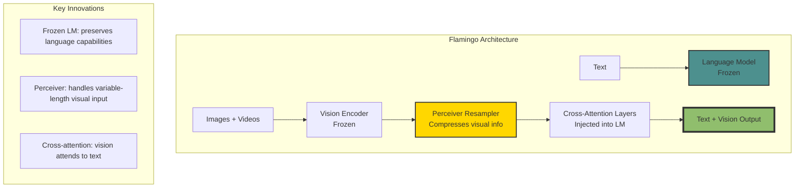
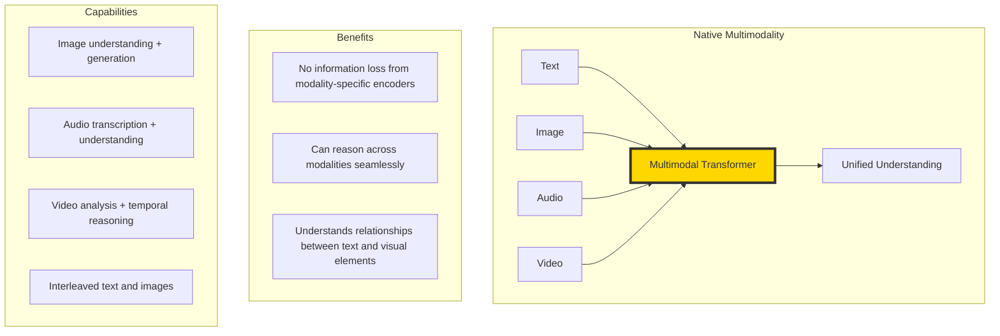

# The 2026 AI Metromap: Multimodal Models – The Interchange Stations

## Series C: Modern Architecture Line | Story 4 of 6

---

## 📖 Introduction

**Welcome to the fourth stop on the Modern Architecture Line.**

In our last three stories, we mastered three powerful architectures: Transformers for language, GPT for generation, and Diffusion for images. Each is impressive alone. But the real magic happens when they combine.

Think about how humans understand the world. We don't process text in isolation. We see an image, read its caption, hear its sound, and understand the connection. We are multimodal.

For years, AI models were unimodal—separate models for text, images, audio, and video. They couldn't connect a picture of a cat to the word "cat." They couldn't describe what they saw. They couldn't answer questions about images.

Then came CLIP. In 2021, OpenAI trained a model to connect images and text by learning a shared embedding space. Suddenly, you could search images with text, classify images without training, and bridge the gap between vision and language. CLIP was followed by Flamingo, Gemini, and models that can understand and generate across modalities.

This story—**The 2026 AI Metromap: Multimodal Models – The Interchange Stations**—is your journey into the architectures that connect different modalities. We'll decode CLIP—how it learns to align images and text. We'll explore Flamingo—how to add vision to language models. We'll understand Gemini—native multimodality from the ground up. And we'll see how these models enable image search, visual question answering, and beyond.

**Let's connect the tracks.**

---

## 📚 Where You Are in the Journey

### The Master Story Arc: The 2026 AI Metromap Series (Complete)

- 🗺️ **[The 2026 AI Metromap: Why the Old Learning Routes Are Obsolete](#)** – A paradigm shift from linear learning to transit-system mastery.
- 🧭 **[The 2026 AI Metromap: Reading the Map](#)** – Strategic navigation across the three core lines.
- 🎒 **[The 2026 AI Metromap: Avoiding Derailments](#)** – Diagnosing and preventing the most common learning pitfalls.
- 🏁 **[The 2026 AI Metromap: From Passenger to Driver](#)** – Building your portfolio using the Metromap structure.

### Series A: Foundations Station (Complete)
### Series B: Supervised Learning Line (Complete)

### Series C: Modern Architecture Line (6 Stories)

- 📖 **[The 2026 AI Metromap: Transformers & Attention – The Station That Changed Everything](#)** – The "Attention Is All You Need" paper decoded; self-attention mechanisms; multi-head attention; positional encoding; encoder-decoder architecture.

- 🤖 **[The 2026 AI Metromap: GPT & LLM Architecture – Understanding the Engine of the Express Train](#)** – Decoder-only architecture; causal masking; next token prediction; scaling laws; context windows; emergent abilities.

- 🎨 **[The 2026 AI Metromap: Diffusion Models – The Scenic Route to Generative AI](#)** – How diffusion models work; forward diffusion process; reverse denoising; U-Net architecture; stable diffusion.

- 🌐 **The 2026 AI Metromap: Multimodal Models – The Interchange Stations** – CLIP: connecting images and text; Flamingo: few-shot multimodal learning; Gemini: native multimodality; contrastive learning. **⬅️ YOU ARE HERE**

- 🧩 **[The 2026 AI Metromap: Fine-Tuning vs. In-Context Learning – When to Train vs. When to Prompt](#)** – Parameter-efficient fine-tuning (LoRA, QLoRA); instruction tuning; RLHF; in-context learning; few-shot prompting. 🔜 *Up Next*

- 📚 **[The 2026 AI Metromap: Open Source LLMs – LLaMA, Mistral, DeepSeek, and Beyond](#)** – Running LLMs locally; quantization (GGUF, GPTQ); inference optimization; model comparison; open-source ecosystem.

### The Complete Story Catalog

For a complete view of all upcoming stories across every series, visit the **[Complete 2026 AI Metromap Story Catalog](#)**.

---

## 🧩 The Core Idea: Shared Embedding Space

Multimodal models learn to map different modalities (text, images, audio) into the same embedding space.

```mermaid
graph TD
    subgraph "Shared Embedding Space"
        T[Text: "A cat sitting on a mat"] --> E[Embedding Space]
        I[Image of cat on mat] --> E
        
        E --> S[Similar vectors<br/>are close together]
        
        T2[Text: "A dog running"] --> E2[Different location]
        I2[Image of dog] --> E2
    end
    
    subgraph "What This Enables"
        A[Text-to-Image Search]
        B[Image-to-Text Search]
        C[Zero-shot Classification]
        D[Visual Question Answering]
    end
    
    style E fill:#ffd700,stroke:#333,stroke-width:4px
```

**The Insight:** If we can learn a shared space where "cat" text embeddings are close to "cat" image embeddings, we can compare across modalities.

---

## 🔗 CLIP: Connecting Images and Text

CLIP (Contrastive Language-Image Pre-training) learns to align images and text by training on 400 million image-text pairs from the internet.

```mermaid
graph TD
    subgraph "CLIP Architecture"
        I[Image] --> V[Vision Encoder<br/>ViT or ResNet]
        V --> VI[Image Embedding<br/>512-dim]
        
        T[Text: "A cat"] --> L[Text Encoder<br/>Transformer]
        L --> TI[Text Embedding<br/>512-dim]
        
        VI --> C[Contrastive Loss<br/>Maximize similarity of matching pairs]
        TI --> C
    end
    
    subgraph "Training Objective"
        P[Positive pairs: matching image-text<br/>→ high similarity]
        N[Negative pairs: mismatched<br/>→ low similarity]
    end
    
    style VI fill:#90be6d,stroke:#333,stroke-width:2px
    style TI fill:#90be6d,stroke:#333,stroke-width:2px
    style C fill:#ffd700,stroke:#333,stroke-width:2px
```

```python
import numpy as np
import matplotlib.pyplot as plt

class CLIP:
    """
    Simplified CLIP model for understanding the architecture.
    """
    
    def __init__(self, embedding_dim=512):
        self.embedding_dim = embedding_dim
        
        # Simplified encoders (in reality, these are ViT and Transformer)
        self.image_encoder = np.random.randn(embedding_dim, 768) * 0.01  # Placeholder
        self.text_encoder = np.random.randn(embedding_dim, 512) * 0.01   # Placeholder
        
    def encode_image(self, images):
        """Encode images to embeddings"""
        # Simplified: random embeddings for demonstration
        return np.random.randn(len(images), self.embedding_dim)
    
    def encode_text(self, texts):
        """Encode texts to embeddings"""
        return np.random.randn(len(texts), self.embedding_dim)
    
    def similarity(self, image_embeds, text_embeds):
        """Compute cosine similarity between all image-text pairs"""
        # Normalize embeddings
        image_embeds = image_embeds / np.linalg.norm(image_embeds, axis=1, keepdims=True)
        text_embeds = text_embeds / np.linalg.norm(text_embeds, axis=1, keepdims=True)
        
        # Compute similarity matrix
        return image_embeds @ text_embeds.T

def visualize_clip_embedding_space():
    """Visualize how CLIP aligns images and text in shared space"""
    
    # Simulated embeddings for different concepts
    concepts = [
        "cat", "dog", "car", "house", "cat photo", "dog photo", "red car", "blue house"
    ]
    
    # Create simulated 2D embeddings for visualization
    np.random.seed(42)
    embeddings = {}
    
    # Create clusters
    cat_center = np.array([2, 2])
    dog_center = np.array([2, -2])
    car_center = np.array([-2, 2])
    house_center = np.array([-2, -2])
    
    # Text embeddings
    embeddings["cat"] = cat_center + np.random.randn(2) * 0.2
    embeddings["dog"] = dog_center + np.random.randn(2) * 0.2
    embeddings["car"] = car_center + np.random.randn(2) * 0.2
    embeddings["house"] = house_center + np.random.randn(2) * 0.2
    
    # Image embeddings
    embeddings["cat photo"] = cat_center + np.random.randn(2) * 0.3
    embeddings["dog photo"] = dog_center + np.random.randn(2) * 0.3
    embeddings["red car"] = car_center + np.random.randn(2) * 0.3
    embeddings["blue house"] = house_center + np.random.randn(2) * 0.3
    
    # Plot
    fig, ax = plt.subplots(figsize=(10, 8))
    
    # Plot text embeddings
    for name, emb in embeddings.items():
        if "photo" in name or "red" in name or "blue" in name:
            ax.scatter(emb[0], emb[1], s=200, marker='s', alpha=0.7, 
                      color='blue' if "cat" in name else 'green' if "dog" in name else 'red')
            ax.annotate(name, emb + np.array([0.1, 0.1]), fontsize=9)
        else:
            ax.scatter(emb[0], emb[1], s=200, marker='o', alpha=0.7,
                      color='blue' if name == "cat" else 'green' if name == "dog" else 'red')
            ax.annotate(name, emb + np.array([0.1, 0.1]), fontsize=9)
    
    # Draw connections between matching pairs
    for text in ["cat", "dog", "car", "house"]:
        image = f"{text} photo" if text != "car" and text != "house" else f"{'red' if text == 'car' else 'blue'} {text}"
        if image in embeddings:
            ax.plot([embeddings[text][0], embeddings[image][0]],
                   [embeddings[text][1], embeddings[image][1]],
                   'k--', alpha=0.5)
    
    ax.set_xlim(-3, 3)
    ax.set_ylim(-3, 3)
    ax.set_title('CLIP Shared Embedding Space\nText (circles) and Images (squares) are close for matching concepts')
    ax.grid(True, alpha=0.3)
    
    plt.tight_layout()
    plt.show()
    
    print("\n" + "="*60)
    print("CLIP EMBEDDING SPACE")
    print("="*60)
    print("Text 'cat' and image of cat are close together.")
    print("Text 'dog' and image of dog are close together.")
    print("Text 'cat' and image of dog are far apart.")
    print("\nThis enables zero-shot classification and cross-modal search!")

visualize_clip_embedding_space()
```

---

## 🔬 Contrastive Learning: The Secret Sauce

CLIP uses contrastive learning—pulling matching pairs together and pushing mismatched pairs apart.

```python
def visualize_contrastive_learning():
    """Demonstrate how contrastive learning works"""
    
    # Simulate a batch of image-text pairs
    batch_size = 4
    concepts = ["cat", "dog", "car", "house"]
    
    # Simulated similarity matrix (ideal)
    similarity = np.zeros((batch_size, batch_size))
    for i in range(batch_size):
        similarity[i, i] = 1.0  # Perfect similarity for matching pairs
    
    # Add some noise
    for i in range(batch_size):
        for j in range(batch_size):
            if i != j:
                similarity[i, j] = 0.1  # Low similarity for mismatched
    
    fig, axes = plt.subplots(1, 2, figsize=(12, 5))
    
    # Similarity matrix
    im = axes[0].imshow(similarity, cmap='Blues', vmin=0, vmax=1, aspect='auto')
    axes[0].set_xticks(range(batch_size))
    axes[0].set_yticks(range(batch_size))
    axes[0].set_xticklabels([f"Image: {c}" for c in concepts], rotation=45, ha='right')
    axes[0].set_yticklabels([f"Text: {c}" for c in concepts])
    axes[0].set_title('Similarity Matrix\nHigh on diagonal (matching pairs)')
    plt.colorbar(im, ax=axes[0])
    
    # Add text annotations
    for i in range(batch_size):
        for j in range(batch_size):
            axes[0].text(j, i, f'{similarity[i,j]:.2f}', ha='center', va='center',
                        color='white' if similarity[i,j] > 0.5 else 'black')
    
    # Loss contribution
    axes[1].axis('off')
    axes[1].set_title('Contrastive Loss', fontsize=12)
    
    loss_text = """
    Contrastive Loss (InfoNCE):
    
    For each image i:
        L_i = -log( exp(sim(i, text_i)/τ) / 
                    Σⱼ exp(sim(i, text_j)/τ) )
    
    What this does:
    • Maximize similarity for matching pairs (i,i)
    • Minimize similarity for mismatched pairs (i,j)
    • Temperature τ controls sharpness
    
    This is applied symmetrically:
    • Image→Text direction
    • Text→Image direction
    """
    
    axes[1].text(0.1, 0.5, loss_text, fontsize=10, family='monospace',
                transform=axes[1].transAxes, verticalalignment='center')
    
    plt.tight_layout()
    plt.show()
    
    print("\n" + "="*60)
    print("CONTRASTIVE LEARNING")
    print("="*60)
    print("Goal: Pull matching pairs together in embedding space")
    print("      Push non-matching pairs apart")
    print("\nThis creates a structured embedding space where")
    print("similar concepts cluster together across modalities!")

visualize_contrastive_learning()
```

---

## 🦩 Flamingo: Adding Vision to Language Models

Flamingo (DeepMind, 2022) showed how to add vision understanding to frozen language models.



```python
def explain_flamingo():
    """Explain Flamingo's architecture"""
    
    print("="*60)
    print("FLAMINGO: VISUAL LANGUAGE MODELS")
    print("="*60)
    
    print("\n1. Frozen Language Model:")
    print("   Start with a pretrained LLM (like Chinchilla)")
    print("   Freeze its weights to preserve language ability")
    
    print("\n2. Vision Encoder:")
    print("   Use a pretrained vision model (like NFNet)")
    print("   Extract features from images and videos")
    
    print("\n3. Perceiver Resampler:")
    print("   Vision output can be variable length (multiple images, frames)")
    print("   Perceiver compresses to fixed number of tokens")
    print("   Uses cross-attention between learned queries and visual features")
    
    print("\n4. GATED CROSS-ATTENTION:")
    print("   Insert cross-attention layers between LM layers")
    print("   These attend to visual tokens")
    print("   Gating controls how much vision influences language")
    
    print("\n5. Result:")
    print("   Model can process interleaved images and text")
    print("   Few-shot learning across modalities")
    print("   State-of-the-art on visual question answering")
    
    # Visualize Perceiver
    fig, ax = plt.subplots(figsize=(10, 6))
    ax.set_xlim(0, 10)
    ax.set_ylim(0, 8)
    ax.axis('off')
    
    # Vision features
    for i in range(6):
        rect = plt.Rectangle((1, 6 - i*0.8), 1, 0.6, facecolor='lightblue', edgecolor='blue')
        ax.add_patch(rect)
    ax.text(1.5, 6.5, 'Vision Features\n(64 tokens)', ha='center', fontsize=10)
    
    # Learned queries
    for i in range(4):
        rect = plt.Rectangle((4, 6 - i*1.2), 1, 0.6, facecolor='lightgreen', edgecolor='green')
        ax.add_patch(rect)
    ax.text(4.5, 6.5, 'Learned Queries\n(16 tokens)', ha='center', fontsize=10)
    
    # Cross-attention arrow
    ax.annotate('', xy=(5, 4), xytext=(2.5, 4),
                arrowprops=dict(arrowstyle='->', lw=2, color='red'))
    ax.text(3.8, 4.2, 'Cross-Attention', ha='center', fontsize=10)
    
    # Output
    for i in range(4):
        rect = plt.Rectangle((7, 6 - i*1.2), 1, 0.6, facecolor='lightyellow', edgecolor='orange')
        ax.add_patch(rect)
    ax.text(7.5, 6.5, 'Compressed\nVisual Tokens', ha='center', fontsize=10)
    
    ax.set_title('Perceiver Resampler: Compresses Variable Visual Input to Fixed Tokens')
    plt.tight_layout()
    plt.show()

explain_flamingo()
```

---

## 🌟 Gemini: Native Multimodality

Unlike models that combine separate encoders, Gemini is natively multimodal—trained from scratch on text, images, audio, and video.



```python
def explain_gemini():
    """Explain Gemini's native multimodal architecture"""
    
    print("="*60)
    print("GEMINI: NATIVE MULTIMODALITY")
    print("="*60)
    
    print("\nWhat makes Gemini different:")
    print("   • NOT separate vision + language encoders")
    print("   • NOT a frozen LM with vision adapters")
    print("   • Single model trained on all modalities from scratch")
    
    print("\nArchitecture highlights:")
    print("   1. Multimodal tokenizer: handles text, images, audio as tokens")
    print("   2. Transformer processes all modalities uniformly")
    print("   3. Trained on interleaved sequences (text + images + video frames)")
    print("   4. Can generate text and images (depending on variant)")
    
    print("\nCapabilities:")
    print("   • Understand images: count objects, answer questions")
    print("   • Understand audio: transcribe, identify sounds")
    print("   • Understand video: track objects, reason about temporal events")
    print("   • Combine modalities: describe a video in text, answer questions about images")
    
    print("\nExample interaction:")
    print("   User: [shows image of a math problem]")
    print("   User: 'Solve this'")
    print("   Gemini: [understands the image, solves the problem in text]")
    
    # Visualize multimodal token sequence
    fig, ax = plt.subplots(figsize=(12, 4))
    ax.set_xlim(0, 12)
    ax.set_ylim(0, 2)
    ax.axis('off')
    
    tokens = [
        ("<text>", 0.5), ("The", 1.5), ("cat", 2.5), ("sat", 3.5),
        ("<image>", 4.5), ("<img_tokens>", 5.5, "images"),
        ("<text>", 6.5), ("It", 7.5), ("was", 8.5), ("sleeping", 9.5),
        ("<audio>", 10.5), ("<audio_tokens>", 11.5, "audio")
    ]
    
    for i, token in enumerate(tokens):
        if len(token) == 2:
            name, x = token
            color = 'lightblue' if name.startswith('<') else 'lightgreen'
            rect = plt.Rectangle((x-0.4, 0.5), 0.8, 1, facecolor=color, edgecolor='black')
            ax.add_patch(rect)
            ax.text(x, 1, name, ha='center', va='center', fontsize=10)
        else:
            name, x, desc = token
            rect = plt.Rectangle((x-0.8, 0.5), 1.6, 1, facecolor='lightyellow', edgecolor='black')
            ax.add_patch(rect)
            ax.text(x, 1, name, ha='center', va='center', fontsize=10)
            ax.text(x, 0.7, desc, ha='center', va='center', fontsize=8)
    
    ax.set_title('Gemini Processes All Modalities as a Single Token Stream')
    plt.tight_layout()
    plt.show()

explain_gemini()
```

---

## 🎯 Applications of Multimodal Models

```python
def visualize_multimodal_applications():
    """Show real-world applications of multimodal models"""
    
    applications = [
        {
            "name": "Image Search",
            "description": "Search images using text descriptions",
            "example": 'Query: "red car on a rainy street" → relevant images'
        },
        {
            "name": "Visual Question Answering",
            "description": "Answer questions about images",
            "example": 'Q: "What color is the cat?" → A: "Orange"'
        },
        {
            "name": "Image Captioning",
            "description": "Generate text descriptions of images",
            "example": 'Image → "A dog playing fetch in a park"'
        },
        {
            "name": "Zero-Shot Classification",
            "description": "Classify images without training",
            "example": 'Image + ["cat", "dog", "bird"] → "cat"'
        },
        {
            "name": "Video Understanding",
            "description": "Analyze temporal events in video",
            "example": 'Video → "Person picks up phone, dials number"'
        },
        {
            "name": "Text-to-Image Generation",
            "description": "Generate images from text",
            "example": '"A cat wearing a hat" → [generated image]'
        }
    ]
    
    fig, axes = plt.subplots(2, 3, figsize=(15, 10))
    axes = axes.flatten()
    
    for idx, app in enumerate(applications):
        axes[idx].axis('off')
        axes[idx].set_title(app['name'], fontsize=12, fontweight='bold')
        
        # Create visual representation
        rect = plt.Rectangle((0.1, 0.1), 0.8, 0.8, fill=True, 
                              facecolor='lightblue', edgecolor='navy', alpha=0.3)
        axes[idx].add_patch(rect)
        
        axes[idx].text(0.5, 0.65, app['description'], ha='center', va='center',
                      fontsize=10, style='italic')
        axes[idx].text(0.5, 0.35, app['example'], ha='center', va='center',
                      fontsize=9, family='monospace', 
                      bbox=dict(boxstyle='round', facecolor='white', alpha=0.8))
        
        # Emoji for visual
        emoji = "🔍" if idx == 0 else "❓" if idx == 1 else "📝" if idx == 2 else "🎯" if idx == 3 else "🎬" if idx == 4 else "🎨"
        axes[idx].text(0.5, 0.85, emoji, ha='center', va='center', fontsize=20)
        
        axes[idx].set_xlim(0, 1)
        axes[idx].set_ylim(0, 1)
    
    plt.suptitle('Multimodal Models Enable Cross-Modal Understanding', fontsize=14)
    plt.tight_layout()
    plt.show()

visualize_multimodal_applications()
```

---

## 🔧 Building a Simple Multimodal Search

Let's build a simplified version of how CLIP enables image search.

```python
class SimpleMultimodalSearch:
    """
    A simplified multimodal search engine inspired by CLIP.
    """
    
    def __init__(self):
        # Simulated image database
        self.images = []
        self.image_embeddings = []
        
    def add_image(self, image_id, features):
        """Add an image to the database"""
        self.images.append(image_id)
        self.image_embeddings.append(features)
    
    def search_by_text(self, text_embedding, top_k=3):
        """Search for images matching text query"""
        # Compute similarities
        similarities = []
        for img_emb in self.image_embeddings:
            # Cosine similarity
            sim = np.dot(text_embedding, img_emb) / (np.linalg.norm(text_embedding) * np.linalg.norm(img_emb))
            similarities.append(sim)
        
        # Return top-k results
        indices = np.argsort(similarities)[::-1][:top_k]
        return [(self.images[i], similarities[i]) for i in indices]

def simulate_multimodal_search():
    """Simulate how CLIP enables text-to-image search"""
    
    # Create simulated embeddings for images
    np.random.seed(42)
    
    images = [
        "cat_sitting.jpg",
        "dog_running.jpg",
        "red_car.jpg",
        "blue_house.jpg",
        "cat_sleeping.jpg",
        "dog_barking.jpg"
    ]
    
    # Create embedding space (2D for visualization)
    embeddings = {
        "cat_sitting.jpg": np.array([2.1, 2.0]),
        "cat_sleeping.jpg": np.array([1.9, 2.1]),
        "dog_running.jpg": np.array([2.0, -1.9]),
        "dog_barking.jpg": np.array([2.2, -2.0]),
        "red_car.jpg": np.array([-1.8, 2.1]),
        "blue_house.jpg": np.array([-2.0, -1.9])
    }
    
    # Text queries
    queries = {
        "cat": np.array([2.0, 2.0]),
        "dog": np.array([2.0, -2.0]),
        "car": np.array([-2.0, 2.0]),
        "house": np.array([-2.0, -2.0])
    }
    
    # Visualize
    fig, axes = plt.subplots(2, 2, figsize=(12, 10))
    axes = axes.flatten()
    
    for idx, (query, query_emb) in enumerate(queries.items()):
        ax = axes[idx]
        
        # Plot images
        for img, emb in embeddings.items():
            if "cat" in img and query == "cat":
                ax.scatter(emb[0], emb[1], s=200, marker='s', color='blue', alpha=0.8, label=img)
            elif "dog" in img and query == "dog":
                ax.scatter(emb[0], emb[1], s=200, marker='s', color='green', alpha=0.8, label=img)
            elif "car" in img and query == "car":
                ax.scatter(emb[0], emb[1], s=200, marker='s', color='red', alpha=0.8, label=img)
            elif "house" in img and query == "house":
                ax.scatter(emb[0], emb[1], s=200, marker='s', color='orange', alpha=0.8, label=img)
            else:
                ax.scatter(emb[0], emb[1], s=100, marker='s', color='gray', alpha=0.4)
        
        # Plot query
        ax.scatter(query_emb[0], query_emb[1], s=300, marker='*', color='gold', 
                  edgecolor='black', label=f'Query: "{query}"')
        
        # Draw arrows to top matches
        distances = []
        for img, emb in embeddings.items():
            if (query == "cat" and "cat" in img) or \
               (query == "dog" and "dog" in img) or \
               (query == "car" and "car" in img) or \
               (query == "house" and "house" in img):
                distances.append((img, emb, np.linalg.norm(emb - query_emb)))
        
        distances.sort(key=lambda x: x[2])
        for img, emb, dist in distances[:2]:
            ax.annotate('', xy=emb, xytext=query_emb,
                       arrowprops=dict(arrowstyle='->', lw=2, color='red', alpha=0.7))
        
        ax.set_xlim(-3, 3)
        ax.set_ylim(-3, 3)
        ax.set_title(f'Search: "{query}"')
        ax.grid(True, alpha=0.3)
        ax.legend(loc='upper right', fontsize=8)
    
    plt.suptitle('Multimodal Search: Text Query Finds Relevant Images', fontsize=14)
    plt.tight_layout()
    plt.show()
    
    print("\n" + "="*60)
    print("HOW MULTIMODAL SEARCH WORKS")
    print("="*60)
    print("1. All images are pre-encoded into embeddings")
    print("2. Text query is encoded into the same embedding space")
    print("3. Find images with closest embeddings to the text query")
    print("4. Return images in order of similarity")
    print("\nThis enables searching billions of images with text in milliseconds!")

simulate_multimodal_search()
```

---

## 📊 Takeaway from This Story

**What You Learned:**

- **Shared Embedding Space** – The core idea of multimodal models. Map different modalities into the same space where similar concepts are close.

- **CLIP** – Contrastive learning on 400M image-text pairs. Enables zero-shot classification, image search, and cross-modal understanding.

- **Contrastive Learning** – Pull matching pairs together, push non-matching pairs apart. The secret sauce behind multimodal alignment.

- **Flamingo** – Adds vision understanding to frozen language models. Perceiver resampler compresses visual information. Gated cross-attention injects vision into LM layers.

- **Gemini** – Native multimodality trained from scratch. Processes text, images, audio, and video as a single token stream.

- **Applications** – Image search, visual question answering, captioning, zero-shot classification, video understanding, text-to-image generation.

---

## 🔗 Navigation

- **⬅️ Previous Story:** [The 2026 AI Metromap: Diffusion Models – The Scenic Route to Generative AI](#)

- **📚 Series C Catalog:** [Series C: Modern Architecture Line](#) – View all 6 stories in this series.

- **📚 Complete Story Catalog:** [Complete 2026 AI Metromap Story Catalog](#) – Your navigation guide to all 39+ stories.

- **➡️ Next Story:** **[The 2026 AI Metromap: Fine-Tuning vs. In-Context Learning – When to Train vs. When to Prompt](#)** – Parameter-efficient fine-tuning (LoRA, QLoRA); instruction tuning; RLHF; in-context learning; few-shot prompting.

---

## 📝 Your Invitation

Before the next story arrives, experiment with multimodal models:

1. **Try CLIP** – Use OpenAI's CLIP model to search images with text. How accurate is it?

2. **Visualize embeddings** – Take a small dataset, encode images and text, and visualize the embedding space.

3. **Build a multimodal search** – Create a simple search engine for a small image collection using CLIP embeddings.

4. **Explore zero-shot classification** – Use CLIP to classify images without training. How well does it work?

**You've connected the tracks. Next stop: Fine-Tuning vs. In-Context Learning!**

---

*Found this helpful? Clap, comment, and share your multimodal experiments. Next stop: Fine-Tuning vs. In-Context Learning!* 🚇