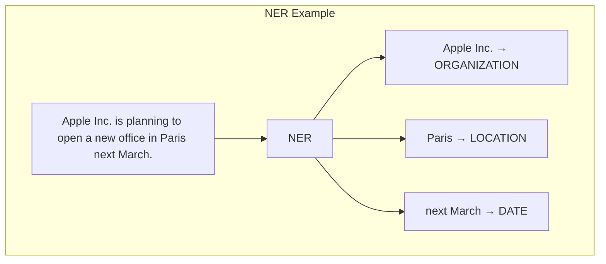

# The 2026 AI Metromap: NLP Tasks – NER, Translation, Summarization, and Beyond

## Series E: Applied AI & Agents Line | Story 7 of 15+


## 📖 Introduction

**Welcome to the seventh stop on the Applied AI & Agents Line.**

In our last six stories, we mastered prompt engineering, RAG, AI agents, voice assistants, computer vision, and image generation. Your systems can now understand text, retrieve knowledge, take actions, speak, see, and create. You've built applications across multiple modalities.

But there's a category of AI tasks that remains fundamental to almost every application: **natural language processing (NLP)** .

Before LLMs, NLP was a collection of specialized tasks—named entity recognition (NER), machine translation, summarization, sentiment analysis, and more. Today, LLMs can handle many of these tasks with simple prompts. But for production applications—where you need reliability, speed, and cost-efficiency—specialized models still win.

This story—**The 2026 AI Metromap: NLP Tasks – NER, Translation, Summarization, and Beyond**—is your guide to building production-ready NLP systems. We'll master named entity recognition—extracting people, places, organizations from text. We'll implement machine translation—converting between languages. We'll build summarization systems—condensing long documents. And we'll explore sentiment analysis, text classification, and more.

**Let's process language at scale.**

---

## 📚 Where You Are in the Journey

### The Master Story Arc: The 2026 AI Metromap Series (Complete)

- 🗺️ **[The 2026 AI Metromap: Why the Old Learning Routes Are Obsolete](#)** – A paradigm shift from linear learning to transit-system mastery.
- 🧭 **[The 2026 AI Metromap: Reading the Map](#)** – Strategic navigation across the three core lines.
- 🎒 **[The 2026 AI Metromap: Avoiding Derailments](#)** – Diagnosing and preventing the most common learning pitfalls.
- 🏁 **[The 2026 AI Metromap: From Passenger to Driver](#)** – Building your portfolio using the Metromap structure.

### Series A: Foundations Station (Complete)
### Series B: Supervised Learning Line (Complete)
### Series C: Modern Architecture Line (Complete)
### Series D: Engineering & Optimization Yard (Complete)

### Series E: Applied AI & Agents Line (15+ Stories)

- 💬 **[The 2026 AI Metromap: Prompt Engineering 101 – The Art of Talking to AI](#)**
- 📚 **[The 2026 AI Metromap: RAG – Retrieval-Augmented Generation for Knowledge-Intensive Tasks](#)**
- 🤖 **[The 2026 AI Metromap: AI Agents & Autonomous Workflows – The Self-Driving Trains](#)**
- 🗣️ **[The 2026 AI Metromap: Voice Assistants & Speech Models – Making AI Talk](#)**
- 👁️ **[The 2026 AI Metromap: Computer Vision Projects – From OCR to Face Recognition](#)**
- 🎨 **[The 2026 AI Metromap: Image Generation & Editing – Diffusion Models in Practice](#)**
- 🔤 **The 2026 AI Metromap: NLP Tasks – NER, Translation, Summarization, and Beyond** – Named entity recognition; machine translation; text summarization (extractive and abstractive); sentiment analysis. **⬅️ YOU ARE HERE**

- 📈 **[The 2026 AI Metromap: Time Series Forecasting – ARIMA, LSTM, and Transformers](#)** – Classical methods (ARIMA, SARIMA); LSTM networks; Transformer for time series; forecasting stock prices, weather, and demand. 🔜 *Up Next*

- 👍 **[The 2026 AI Metromap: Recommendation Systems – From Collaborative Filtering to Two-Tower Networks](#)** – Content-based filtering; collaborative filtering; matrix factorization; neural collaborative filtering; two-tower architectures.

**Industry Applications**
- 🏥 **[The 2026 AI Metromap: AI in Healthcare – Medical Research, Diagnostics, and Wellness](#)**
- 💰 **[The 2026 AI Metromap: AI in Finance – Banking, Insurance, and Trading](#)**
- 🎮 **[The 2026 AI Metromap: AI in Gaming, VR/AR, and Entertainment](#)**
- 🏭 **[The 2026 AI Metromap: AI in Robotics, Manufacturing, and Supply Chain](#)**
- 🌱 **[The 2026 AI Metromap: AI for Social Good – Climate Action, Agriculture, and Sustainability](#)**
- 🎓 **[The 2026 AI Metromap: AI in Education – Personalized Learning and Training](#)**

### The Complete Story Catalog

For a complete view of all upcoming stories across every series, visit the **[Complete 2026 AI Metromap Story Catalog](#)**.

---

## 🔍 Named Entity Recognition (NER): Extracting Structure from Text

NER identifies and classifies named entities in text: people, organizations, locations, dates, and more.



```python
def named_entity_recognition():
    """Implement NER with spaCy and HuggingFace"""
    
    print("="*60)
    print("NAMED ENTITY RECOGNITION")
    print("="*60)
    
    print("""
    # Using spaCy (fast, production-ready)
    import spacy
    
    # Load model (English)
    nlp = spacy.load("en_core_web_sm")
    
    text = "Apple Inc. is planning to open a new office in Paris next March. CEO Tim Cook announced the expansion."
    
    doc = nlp(text)
    
    for ent in doc.ents:
        print(f"{ent.text} → {ent.label_}")
    
    # Output:
    # Apple Inc. → ORG
    # Paris → GPE
    # next March → DATE
    # Tim Cook → PERSON
    
    # Entity labels:
    # PERSON, ORG, GPE (countries/cities), LOC (non-GPE locations)
    # DATE, TIME, MONEY, PERCENT, PRODUCT, EVENT, LAW, etc.
    
    # Visualize entities
    from spacy import displacy
    displacy.render(doc, style="ent", jupyter=True)
    
    # Using HuggingFace Transformers (more accurate, slower)
    from transformers import pipeline
    
    ner = pipeline("ner", model="dslim/bert-base-NER", aggregation_strategy="simple")
    
    results = ner(text)
    for result in results:
        print(f"{result['word']} → {result['entity_group']} (score: {result['score']:.3f})")
    
    # Custom NER with fine-tuning
    # 1. Prepare training data in spaCy format
    TRAIN_DATA = [
        ("Apple is looking to buy U.K. startup for $1 billion", 
         {"entities": [(0, 5, "ORG"), (27, 31, "GPE"), (48, 54, "MONEY")]}),
        ("Elon Musk founded SpaceX in California", 
         {"entities": [(0, 10, "PERSON"), (18, 24, "ORG"), (28, 38, "GPE")]})
    ]
    
    # 2. Fine-tune spaCy model
    # nlp = spacy.blank("en")
    # ner = nlp.add_pipe("ner")
    # for _, annotations in TRAIN_DATA:
    #     for ent in annotations["entities"]:
    #         ner.add_label(ent[2])
    # # Train the model...
    """)
    
    print("\n" + "="*60)
    print("NER MODELS COMPARISON")
    print("="*60)
    
    comparison = [
        ("spaCy (en_core_web_sm)", "Fast, CPU", "Good", "Production, real-time"),
        ("spaCy (en_core_web_trf)", "Transformer-based", "Excellent", "High accuracy"),
        ("BERT-NER", "Transformer", "Very Good", "Batch processing"),
        ("GLiNER", "Lightweight", "Good", "Edge, low-resource"),
        ("Flair", "Contextual embeddings", "Excellent", "Research")
    ]
    
    print(f"\n{'Model':<25} {'Speed':<15} {'Accuracy':<12} {'Best For':<20}")
    print("-"*75)
    for model, speed, acc, best in comparison:
        print(f"{model:<25} {speed:<15} {acc:<12} {best:<20}")

named_entity_recognition()
```

---

## 🌐 Machine Translation: Converting Between Languages

Machine translation converts text from one language to another.

```python
def machine_translation():
    """Implement machine translation with various models"""
    
    print("="*60)
    print("MACHINE TRANSLATION")
    print("="*60)
    
    print("""
    # Using HuggingFace Transformers
    from transformers import pipeline
    
    # Load translation pipeline
    translator = pipeline("translation", model="Helsinki-NLP/opus-mt-en-fr")
    
    text = "Hello, how are you today?"
    result = translator(text)
    print(result[0]['translation_text'])  # "Bonjour, comment allez-vous aujourd'hui?"
    
    # Available language pairs
    models = {
        "en-fr": "Helsinki-NLP/opus-mt-en-fr",
        "en-es": "Helsinki-NLP/opus-mt-en-es",
        "en-de": "Helsinki-NLP/opus-mt-en-de",
        "en-zh": "Helsinki-NLP/opus-mt-en-zh",
        "en-ja": "Helsinki-NLP/opus-mt-en-ja",
        "en-ar": "Helsinki-NLP/opus-mt-en-ar"
    }
    
    # Using M2M100 (multilingual, any-to-any)
    from transformers import M2M100ForConditionalGeneration, M2M100Tokenizer
    
    model = M2M100ForConditionalGeneration.from_pretrained("facebook/m2m100_418M")
    tokenizer = M2M100Tokenizer.from_pretrained("facebook/m2m100_418M")
    
    text = "Hello, how are you?"
    tokenizer.src_lang = "en"
    
    encoded = tokenizer(text, return_tensors="pt")
    generated_tokens = model.generate(**encoded, forced_bos_token_id=tokenizer.get_lang_id("fr"))
    translation = tokenizer.batch_decode(generated_tokens, skip_special_tokens=True)
    print(translation[0])  # "Bonjour, comment allez-vous?"
    
    # Using NLLB (No Language Left Behind) - 200+ languages
    from transformers import AutoModelForSeq2SeqLM, AutoTokenizer
    
    model = AutoModelForSeq2SeqLM.from_pretrained("facebook/nllb-200-distilled-600M")
    tokenizer = AutoTokenizer.from_pretrained("facebook/nllb-200-distilled-600M")
    
    text = "Hello, how are you?"
    inputs = tokenizer(text, return_tensors="pt")
    
    # Translate to French
    generated_tokens = model.generate(**inputs, forced_bos_token_id=tokenizer.lang_code_to_id["fra_Latn"])
    translation = tokenizer.batch_decode(generated_tokens, skip_special_tokens=True)
    
    # Using LLMs (OpenAI, Claude)
    import openai
    
    response = openai.ChatCompletion.create(
        model="gpt-4",
        messages=[
            {"role": "system", "content": "Translate the following to French."},
            {"role": "user", "content": "Hello, how are you?"}
        ]
    )
    print(response.choices[0].message.content)
    """)
    
    print("\n" + "="*60)
    print("TRANSLATION MODELS COMPARISON")
    print("="*60)
    
    comparison = [
        ("Helsinki-NLP (Opus-MT)", "Fast, CPU", "Good", "Single language pair"),
        ("M2M100", "Moderate", "Very Good", "Any-to-any, 100 languages"),
        ("NLLB", "Moderate", "Excellent", "200+ languages, low-resource"),
        ("LLM (GPT-4)", "Slow, API", "Best", "Quality, context-aware"),
        ("Google Translate API", "Fast, API", "Excellent", "Production, high-volume")
    ]
    
    print(f"\n{'Model':<20} {'Speed':<15} {'Quality':<12} {'Best For':<25}")
    print("-"*75)
    for model, speed, quality, best in comparison:
        print(f"{model:<20} {speed:<15} {quality:<12} {best:<25}")

machine_translation()
```

---

## 📝 Text Summarization: Condensing Long Documents

Summarization reduces long text to its essential information.

```python
def text_summarization():
    """Implement extractive and abstractive summarization"""
    
    print("="*60)
    print("TEXT SUMMARIZATION")
    print("="*60)
    
    print("""
    # EXTRACTIVE SUMMARIZATION (selects existing sentences)
    from sumy.parsers.plaintext import PlaintextParser
    from sumy.nlp.tokenizers import Tokenizer
    from sumy.summarizers.lsa import LsaSummarizer
    from sumy.summarizers.text_rank import TextRankSummarizer
    
    text = """
    Artificial intelligence (AI) is intelligence demonstrated by machines, in contrast to the natural intelligence displayed by humans and animals. Leading AI textbooks define the field as the study of "intelligent agents": any device that perceives its environment and takes actions that maximize its chance of successfully achieving its goals. Colloquially, the term "artificial intelligence" is often used to describe machines that mimic "cognitive" functions that humans associate with the human mind, such as "learning" and "problem solving".
    
    AI research has been divided into subfields that often fail to communicate with each other. These subfields are based on technical considerations, such as particular goals (e.g. "robotics" or "machine learning"), the use of particular tools ("logic" or "artificial neural networks"), or deep philosophical differences. Subfields have also been based on social factors (particular institutions or the work of particular researchers).
    """
    
    parser = PlaintextParser.from_string(text, Tokenizer("english"))
    
    # LSA summarizer
    lsa_summarizer = LsaSummarizer()
    lsa_summary = lsa_summarizer(parser.document, 2)  # 2 sentences
    print("LSA Summary:")
    for sentence in lsa_summary:
        print(f"  {sentence}")
    
    # TextRank summarizer
    textrank_summarizer = TextRankSummarizer()
    textrank_summary = textrank_summarizer(parser.document, 2)
    print("TextRank Summary:")
    for sentence in textrank_summary:
        print(f"  {sentence}")
    
    # ABSTRACTIVE SUMMARIZATION (generates new text)
    from transformers import pipeline
    
    summarizer = pipeline("summarization", model="facebook/bart-large-cnn")
    
    summary = summarizer(text, max_length=130, min_length=30, do_sample=False)
    print(summary[0]['summary_text'])
    
    # Using Pegasus (optimized for summarization)
    from transformers import PegasusTokenizer, PegasusForConditionalGeneration
    
    model_name = "google/pegasus-xsum"
    tokenizer = PegasusTokenizer.from_pretrained(model_name)
    model = PegasusForConditionalGeneration.from_pretrained(model_name)
    
    inputs = tokenizer(text, truncation=True, max_length=1024, return_tensors="pt")
    summary_ids = model.generate(inputs["input_ids"], max_length=100, min_length=30)
    summary = tokenizer.decode(summary_ids[0], skip_special_tokens=True)
    print(summary)
    
    # Using LLMs for summarization
    import openai
    
    response = openai.ChatCompletion.create(
        model="gpt-4",
        messages=[
            {"role": "system", "content": "Summarize the following text in 2-3 sentences."},
            {"role": "user", "content": text}
        ]
    )
    print(response.choices[0].message.content)
    """)
    
    print("\n" + "="*60)
    print("SUMMARIZATION MODELS COMPARISON")
    print("="*60)
    
    comparison = [
        ("Extractive (LSA/TextRank)", "Fast", "Selects sentences", "Quick, interpretable"),
        ("BART", "Moderate", "Abstractive, good", "General purpose"),
        ("Pegasus", "Moderate", "Abstractive, excellent", "News, articles"),
        ("T5", "Moderate", "Abstractive, versatile", "Multiple tasks"),
        ("LLM (GPT-4)", "Slow", "Best, context-aware", "Complex, nuanced")
    ]
    
    print(f"\n{'Model':<20} {'Speed':<12} {'Quality':<20} {'Best For':<20}")
    print("-"*75)
    for model, speed, quality, best in comparison:
        print(f"{model:<20} {speed:<12} {quality:<20} {best:<20}")

text_summarization()
```

---

## 💬 Sentiment Analysis: Understanding Emotion

Sentiment analysis detects emotions and opinions in text.

```python
def sentiment_analysis():
    """Implement sentiment analysis"""
    
    print("="*60)
    print("SENTIMENT ANALYSIS")
    print("="*60)
    
    print("""
    # Using TextBlob (simple, fast)
    from textblob import TextBlob
    
    text = "This movie is absolutely amazing! I loved every minute of it."
    blob = TextBlob(text)
    
    print(f"Polarity: {blob.sentiment.polarity}")  # -1 to 1 (negative to positive)
    print(f"Subjectivity: {blob.sentiment.subjectivity}")  # 0 to 1 (factual to opinion)
    
    # Output: Polarity: 0.85, Subjectivity: 0.9
    
    # Using VADER (good for social media)
    from vaderSentiment.vaderSentiment import SentimentIntensityAnalyzer
    
    analyzer = SentimentIntensityAnalyzer()
    
    texts = [
        "I love this product! It's amazing.",
        "This is terrible. I hate it.",
        "It's okay, nothing special."
    ]
    
    for text in texts:
        scores = analyzer.polarity_scores(text)
        print(f"{text[:30]}... → {scores}")
        # Output: {'neg': 0.0, 'neu': 0.3, 'pos': 0.7, 'compound': 0.85}
    
    # Using HuggingFace Transformers
    from transformers import pipeline
    
    sentiment = pipeline("sentiment-analysis")
    
    results = sentiment([
        "I love this product! It's amazing.",
        "This is terrible. I hate it.",
        "It's okay, nothing special."
    ])
    
    for result in results:
        print(f"{result['label']}: {result['score']:.3f}")
    
    # Output:
    # POSITIVE: 0.999
    # NEGATIVE: 0.998
    # NEGATIVE: 0.523 (borderline)
    
    # Aspect-based sentiment (sentiment per aspect)
    from transformers import pipeline
    
    aspect_sentiment = pipeline("text-classification", model="nlptown/bert-base-multilingual-uncased-sentiment")
    
    text = "The food was delicious but the service was slow."
    # This requires more complex models to extract per-aspect sentiment
    
    # Using LLMs for nuanced sentiment
    import openai
    
    response = openai.ChatCompletion.create(
        model="gpt-4",
        messages=[
            {"role": "system", "content": "Analyze the sentiment of the following text. Output JSON with overall sentiment, confidence, and key emotions."},
            {"role": "user", "content": text}
        ]
    )
    print(response.choices[0].message.content)
    """)
    
    print("\n" + "="*60)
    print("SENTIMENT ANALYSIS MODELS COMPARISON")
    print("="*60)
    
    comparison = [
        ("TextBlob", "Very Fast", "Basic", "Quick prototyping"),
        ("VADER", "Fast", "Good for social media", "Twitter, reviews"),
        ("BERT-base", "Moderate", "Very Good", "General purpose"),
        ("RoBERTa", "Moderate", "Excellent", "High accuracy"),
        ("LLM (GPT-4)", "Slow", "Best, nuanced", "Complex analysis")
    ]
    
    print(f"\n{'Model':<12} {'Speed':<12} {'Accuracy':<12} {'Best For':<25}")
    print("-"*65)
    for model, speed, acc, best in comparison:
        print(f"{model:<12} {speed:<12} {acc:<12} {best:<25}")

sentiment_analysis()
```

---

## 🏷️ Text Classification: Categorizing Documents

Text classification assigns categories to documents.

```python
def text_classification():
    """Implement text classification"""
    
    print("="*60)
    print("TEXT CLASSIFICATION")
    print("="*60)
    
    print("""
    # Zero-shot classification (no training required)
    from transformers import pipeline
    
    classifier = pipeline("zero-shot-classification")
    
    text = "Apple is planning to release a new iPhone with advanced AI capabilities."
    candidate_labels = ["technology", "sports", "politics", "business", "science"]
    
    result = classifier(text, candidate_labels)
    print(result['labels'][0])  # "technology"
    print(result['scores'][0])  # 0.85
    
    # Fine-tuned classification
    from transformers import AutoTokenizer, AutoModelForSequenceClassification
    import torch
    
    model_name = "cardiffnlp/twitter-roberta-base-sentiment-latest"
    tokenizer = AutoTokenizer.from_pretrained(model_name)
    model = AutoModelForSequenceClassification.from_pretrained(model_name)
    
    texts = [
        "This is great news for the company!",
        "The stock market is crashing badly."
    ]
    
    for text in texts:
        inputs = tokenizer(text, return_tensors="pt")
        outputs = model(**inputs)
        predictions = torch.nn.functional.softmax(outputs.logits, dim=-1)
        print(f"{text} → {predictions}")
    
    # Topic modeling (unsupervised)
    from sklearn.feature_extraction.text import TfidfVectorizer
    from sklearn.decomposition import NMF
    
    documents = [
        "Machine learning models are trained on data.",
        "The stock market reacted to the news.",
        "Deep learning is a subset of machine learning."
    ]
    
    vectorizer = TfidfVectorizer(max_features=100)
    tfidf = vectorizer.fit_transform(documents)
    
    nmf = NMF(n_components=2, random_state=42)
    topics = nmf.fit_transform(tfidf)
    
    feature_names = vectorizer.get_feature_names_out()
    for topic_idx, topic in enumerate(nmf.components_):
        top_features = [feature_names[i] for i in topic.argsort()[:-10:-1]]
        print(f"Topic {topic_idx}: {' '.join(top_features)}")
    
    # BERTopic for modern topic modeling
    from bertopic import BERTopic
    
    topic_model = BERTopic()
    topics, probs = topic_model.fit_transform(documents)
    topic_model.get_topic_info()
    """)
    
    print("\n" + "="*60)
    print("CLASSIFICATION APPROACHES")
    print("="*60)
    
    approaches = [
        ("Zero-shot", "No training", "New categories", "Flexible"),
        ("Fine-tuned BERT", "Moderate data", "Fixed categories", "High accuracy"),
        ("Few-shot", "Few examples", "New categories", "LLM-based"),
        ("Traditional ML", "Small data", "Simple categories", "Interpretable")
    ]
    
    print(f"\n{'Approach':<15} {'Data Need':<12} {'Flexibility':<12} {'Use Case':<15}")
    print("-"*60)
    for app, data, flex, use in approaches:
        print(f"{app:<15} {data:<12} {flex:<12} {use:<15}")

text_classification()
```

---

## 🔧 Complete NLP Pipeline

```python
def nlp_pipeline():
    """Complete NLP processing pipeline"""
    
    print("="*60)
    print("COMPLETE NLP PIPELINE")
    print("="*60)
    
    print("""
    import spacy
    from transformers import pipeline
    from textblob import TextBlob
    
    class NLPPipeline:
        \"\"\"Complete NLP processing pipeline\"\"\"
        
        def __init__(self):
            # Load models
            self.nlp = spacy.load("en_core_web_sm")
            self.ner = pipeline("ner", model="dslim/bert-base-NER", aggregation_strategy="simple")
            self.sentiment = pipeline("sentiment-analysis")
            self.summarizer = pipeline("summarization", model="facebook/bart-large-cnn")
            self.classifier = pipeline("zero-shot-classification")
            
        def process(self, text):
            \"\"\"Run all NLP tasks on text\"\"\"
            
            results = {
                "entities": self.extract_entities(text),
                "sentiment": self.analyze_sentiment(text),
                "summary": self.summarize(text),
                "topics": self.classify_topic(text),
                "metrics": self.text_metrics(text)
            }
            return results
        
        def extract_entities(self, text):
            \"\"\"Extract named entities\"\"\"
            doc = self.nlp(text)
            entities = []
            for ent in doc.ents:
                entities.append({
                    "text": ent.text,
                    "label": ent.label_,
                    "start": ent.start_char,
                    "end": ent.end_char
                })
            return entities
        
        def analyze_sentiment(self, text):
            \"\"\"Analyze sentiment\"\"\"
            blob = TextBlob(text)
            result = self.sentiment(text)[0]
            
            return {
                "polarity": blob.sentiment.polarity,
                "subjectivity": blob.sentiment.subjectivity,
                "label": result['label'],
                "confidence": result['score']
            }
        
        def summarize(self, text):
            \"\"\"Summarize text\"\"\"
            if len(text.split()) > 50:
                summary = self.summarizer(text, max_length=100, min_length=30)
                return summary[0]['summary_text']
            return text
        
        def classify_topic(self, text):
            \"\"\"Classify into topics\"\"\"
            topics = ["technology", "business", "science", "politics", "entertainment", "sports"]
            result = self.classifier(text, topics)
            return {
                "topic": result['labels'][0],
                "confidence": result['scores'][0],
                "alternatives": result['labels'][1:3]
            }
        
        def text_metrics(self, text):
            \"\"\"Calculate text statistics\"\"\"
            doc = self.nlp(text)
            return {
                "word_count": len(doc),
                "sentence_count": len(list(doc.sents)),
                "avg_word_length": sum(len(token.text) for token in doc) / len(doc),
                "unique_words": len(set(token.text.lower() for token in doc if not token.is_punct))
            }
    
    # Usage
    pipeline = NLPPipeline()
    
    text = """
    Apple Inc. announced today that they will be opening a new AI research facility in Seattle. 
    The facility will focus on developing advanced machine learning models for healthcare applications. 
    This is expected to create over 500 new jobs in the region. CEO Tim Cook stated that this represents 
    a significant investment in the future of artificial intelligence.
    """
    
    results = pipeline.process(text)
    
    print("Entities:")
    for ent in results['entities']:
        print(f"  {ent['text']} → {ent['label']}")
    
    print(f"\\nSentiment: {results['sentiment']['label']} (conf: {results['sentiment']['confidence']:.3f})")
    print(f"Topic: {results['topics']['topic']} (conf: {results['topics']['confidence']:.3f})")
    print(f"\\nSummary: {results['summary']}")
    print(f"\\nText Stats: {results['metrics']['word_count']} words, {results['metrics']['sentence_count']} sentences")
    """)
    
    print("\n" + "="*60)
    print("APPLICATIONS")
    print("="*60)
    
    apps = [
        ("Document Processing", "Extract entities, summarize, classify"),
        ("Social Media Monitoring", "Sentiment analysis, topic detection"),
        ("Customer Support", "Categorize tickets, extract intents"),
        ("News Aggregation", "Classify articles, extract key entities"),
        ("Legal Tech", "Extract entities from contracts, classify clauses")
    ]
    
    for app, desc in apps:
        print(f"  • {app}: {desc}")

nlp_pipeline()
```

---

## 📊 Takeaway from This Story

**What You Learned:**

- **Named Entity Recognition (NER)** – Extract people, organizations, locations, dates. spaCy for fast production, BERT for higher accuracy. Fine-tune for custom entities.

- **Machine Translation** – Helsinki-NLP for single language pairs, M2M100 for any-to-any, NLLB for 200+ languages. LLMs for context-aware translation.

- **Text Summarization** – Extractive (LSA, TextRank) selects sentences. Abstractive (BART, Pegasus) generates new text. LLMs for nuanced summarization.

- **Sentiment Analysis** – TextBlob for basic, VADER for social media, BERT/RoBERTa for high accuracy. LLMs for nuanced aspect-based sentiment.

- **Text Classification** – Zero-shot for flexible categories, fine-tuned for fixed categories. BERTopic for unsupervised topic modeling.

- **Complete Pipeline** – Combine all tasks into a single processing pipeline. Extract entities, analyze sentiment, summarize, classify topics, calculate metrics.

---

## 🔗 Navigation

- **⬅️ Previous Story:** [The 2026 AI Metromap: Image Generation & Editing – Diffusion Models in Practice](#)

- **📚 Series E Catalog:** [Series E: Applied AI & Agents Line](#) – View all 15+ stories in this series.

- **📚 Complete Story Catalog:** [Complete 2026 AI Metromap Story Catalog](#) – Your navigation guide to all 39+ stories.

- **➡️ Next Story:** **[The 2026 AI Metromap: Time Series Forecasting – ARIMA, LSTM, and Transformers](#)** – Classical methods (ARIMA, SARIMA); LSTM networks; Transformer for time series; forecasting stock prices, weather, and demand.

---

## 📝 Your Invitation

Before the next story arrives, build an NLP pipeline:

1. **Implement NER** – Use spaCy to extract entities from news articles. Visualize with displacy.

2. **Build a translator** – Use M2M100 or Helsinki models. Translate between multiple languages.

3. **Create a summarizer** – Compare extractive (TextRank) and abstractive (BART) summarization.

4. **Analyze sentiment** – Use VADER on social media text. Compare with BERT sentiment.

5. **Combine into pipeline** – Process documents: extract entities, classify sentiment, summarize.

**You've mastered core NLP tasks. Next stop: Time Series Forecasting!**

---

*Found this helpful? Clap, comment, and share your NLP pipeline. Next stop: Time Series Forecasting!* 🚇