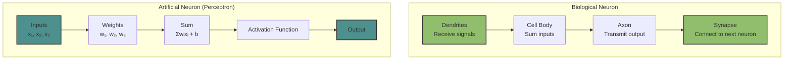
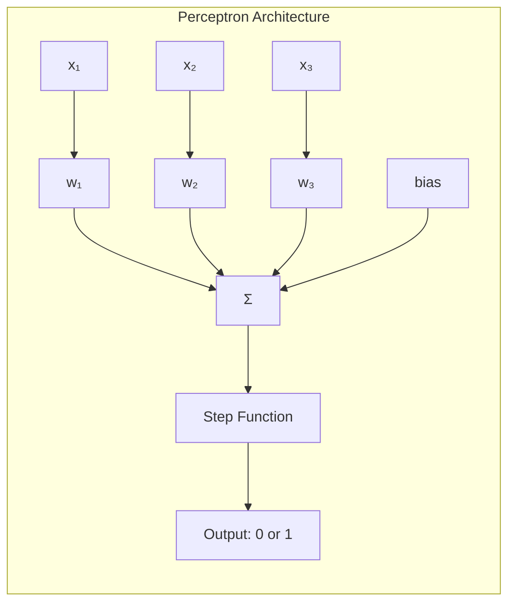
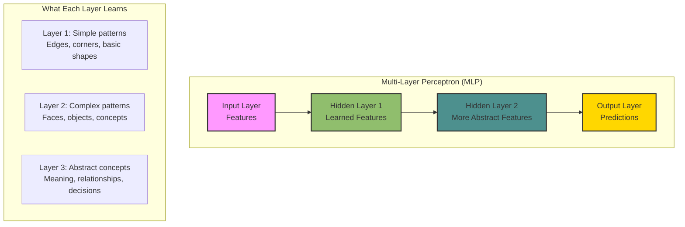
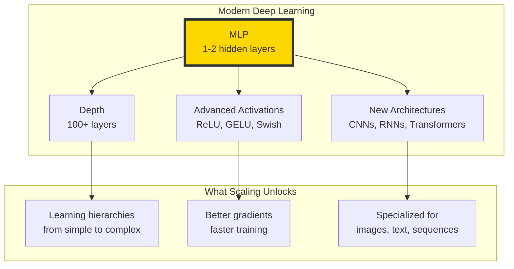

# The 2026 AI Metromap: Neural Network Architecture – From Perceptron to MLP

## Series B: Supervised Learning Line | Story 2 of 4

---

## 📖 Introduction

**Welcome to the second stop on the Supervised Learning Line.**

In our last story, you built the simplest models—linear and logistic regression. You saw how they learn through gradient descent. You understood the mechanics of learning.

Now it's time to ask: **What if one model isn't enough?**

A single linear regression can only learn straight lines. A single logistic regression can only learn simple boundaries. But the world isn't linear. Speech isn't linear. Images aren't linear. Language isn't linear.

To capture complexity, you need **depth**. You need to stack simple models on top of each other. You need a network.

This story—**The 2026 AI Metromap: Neural Network Architecture – From Perceptron to MLP**—is your journey from the single neuron to the multi-layer network. We'll start with the biological inspiration that gave us artificial neurons. We'll build the perceptron—the simplest neural unit. Then we'll stack them into Multi-Layer Perceptrons (MLPs)—the foundation of all modern deep learning.

**Let's build the network.**

---

## 📚 Where You Are in the Journey

### The Master Story Arc: The 2026 AI Metromap Series (Complete)

- 🗺️ **[The 2026 AI Metromap: Why the Old Learning Routes Are Obsolete](#)** – A paradigm shift from linear learning to transit-system mastery.
- 🧭 **[The 2026 AI Metromap: Reading the Map](#)** – Strategic navigation across the three core lines.
- 🎒 **[The 2026 AI Metromap: Avoiding Derailments](#)** – Diagnosing and preventing the most common learning pitfalls.
- 🏁 **[The 2026 AI Metromap: From Passenger to Driver](#)** – Building your portfolio using the Metromap structure.

### Series A: Foundations Station (Complete)

- 🏗️ **[The 2026 AI Metromap: Foundations Station – Why Data Cleaning and Git Are Your Board Games, Not Just Chores](#)**
- 🖥️ **[The 2026 AI Metromap: Command Line & Version Control – Navigating the Terminal Like a Conductor](#)**
- 🧮 **[The 2026 AI Metromap: Linear Algebra for ML – The Language of the Map](#)**
- 📊 **[The 2026 AI Metromap: Data Cleaning & Visualization – Turning Raw Data into Tracks](#)**
- 🔄 **[The 2026 AI Metromap: Ethics & Responsible AI – The Safety Systems of the Metro](#)**

### Series B: Supervised Learning Line (4 Stories)

- 📊 **[The 2026 AI Metromap: Regression & Classification – The Grand Central Station of AI](#)** – Linear regression from scratch; logistic regression; evaluation metrics; connecting classical ML to modern deep learning.

- 🧬 **The 2026 AI Metromap: Neural Network Architecture – From Perceptron to MLP** – The biological inspiration; perceptron implementation; multi-layer perceptrons; forward propagation; universal approximation theorem. **⬅️ YOU ARE HERE**

- ⚡ **[The 2026 AI Metromap: Activation Functions & Backpropagation – The Electrical Grid of the Network](#)** – Sigmoid, tanh, ReLU, Leaky ReLU, Swish, GELU; the chain rule explained visually; backpropagation step-by-step; vanishing and exploding gradients. 🔜 *Up Next*

- 🎯 **[The 2026 AI Metromap: Loss Functions & Optimization – Navigating to the Minimum](#)** – Cross-entropy, MSE, MAE, Huber loss; gradient descent variants (SGD, Momentum, Adam, AdamW); learning rate schedules.

### The Complete Story Catalog

For a complete view of all upcoming stories across every series, visit the **[Complete 2026 AI Metromap Story Catalog](#)**.

---

## 🧠 The Biological Inspiration: How Real Neurons Work

Before artificial neurons, there were real ones. Understanding the biology helps us understand the design.



**The Parallel:**

| Biological Neuron | Artificial Neuron |
|-------------------|-------------------|
| Dendrites receive signals | Input features (x₁, x₂, x₃) |
| Synapses weigh importance | Weights (w₁, w₂, w₃) |
| Cell body sums inputs | Linear combination (Σwᵢxᵢ + b) |
| Axon fires if threshold met | Activation function |
| Connects to next neuron | Output feeds to next layer |

The artificial neuron is a simplified mathematical model of what happens in your brain every moment.

---

## 🔬 The Perceptron: The Simplest Neural Network

The perceptron, invented in 1958 by Frank Rosenblatt, was the first artificial neuron. It's the building block of everything that followed.



### Building the Perceptron from Scratch

```python
import numpy as np
import matplotlib.pyplot as plt
from sklearn.datasets import make_classification
from sklearn.model_selection import train_test_split

class Perceptron:
    """
    The Perceptron: The original neural network.
    Uses a step function activation.
    """
    
    def __init__(self, learning_rate=0.01, n_iterations=1000):
        self.lr = learning_rate
        self.n_iterations = n_iterations
        self.weights = None
        self.bias = None
        self.errors = []
    
    def step_function(self, z):
        """Step activation: 1 if z >= 0, else 0"""
        return np.where(z >= 0, 1, 0)
    
    def fit(self, X, y):
        """
        Train the perceptron using the perceptron learning rule.
        
        Args:
            X: Training features (n_samples, n_features)
            y: Training targets (n_samples,) with values 0 or 1
        """
        n_samples, n_features = X.shape
        
        # Initialize weights and bias
        self.weights = np.zeros(n_features)
        self.bias = 0
        
        for _ in range(self.n_iterations):
            errors = 0
            
            for xi, target in zip(X, y):
                # Forward pass
                linear_output = np.dot(xi, self.weights) + self.bias
                prediction = self.step_function(linear_output)
                
                # Update if prediction is wrong
                error = target - prediction
                if error != 0:
                    self.weights += self.lr * error * xi
                    self.bias += self.lr * error
                    errors += 1
            
            self.errors.append(errors)
            
            # Stop if no errors
            if errors == 0:
                print(f"Converged after {_ + 1} iterations")
                break
    
    def predict(self, X):
        """Predict class labels"""
        linear_output = np.dot(X, self.weights) + self.bias
        return self.step_function(linear_output)
    
    def score(self, X, y):
        """Accuracy score"""
        y_pred = self.predict(X)
        return np.mean(y_pred == y)

# Generate linearly separable data
X, y = make_classification(
    n_samples=200,
    n_features=2,
    n_redundant=0,
    n_clusters_per_class=1,
    class_sep=2.0,  # Make it linearly separable
    random_state=42
)

X_train, X_test, y_train, y_test = train_test_split(X, y, test_size=0.2, random_state=42)

# Train perceptron
perceptron = Perceptron(learning_rate=0.01, n_iterations=100)
perceptron.fit(X_train, y_train)

# Evaluate
train_acc = perceptron.score(X_train, y_train)
test_acc = perceptron.score(X_test, y_test)

print(f"Perceptron Results:")
print(f"Train Accuracy: {train_acc:.4f}")
print(f"Test Accuracy: {test_acc:.4f}")
print(f"Weights: {perceptron.weights}")
print(f"Bias: {perceptron.bias:.4f}")

# Visualize decision boundary
def plot_decision_boundary(X, y, model, title):
    x_min, x_max = X[:, 0].min() - 0.5, X[:, 0].max() + 0.5
    y_min, y_max = X[:, 1].min() - 0.5, X[:, 1].max() + 0.5
    xx, yy = np.meshgrid(np.arange(x_min, x_max, 0.02),
                         np.arange(y_min, y_max, 0.02))
    Z = model.predict(np.c_[xx.ravel(), yy.ravel()])
    Z = Z.reshape(xx.shape)
    
    plt.figure(figsize=(12, 4))
    
    plt.subplot(1, 2, 1)
    plt.contourf(xx, yy, Z, alpha=0.3, cmap='RdYlBu')
    plt.scatter(X[:, 0], X[:, 1], c=y, cmap='RdYlBu', edgecolors='k')
    plt.xlabel('Feature 1')
    plt.ylabel('Feature 2')
    plt.title(title)
    
    plt.subplot(1, 2, 2)
    plt.plot(model.errors)
    plt.xlabel('Iteration')
    plt.ylabel('Number of Errors')
    plt.title('Perceptron Training Errors')
    plt.grid(True, alpha=0.3)
    
    plt.tight_layout()
    plt.show()

plot_decision_boundary(X_train, y_train, perceptron, 'Perceptron Decision Boundary')
```

**The Perceptron Limitation:** It can only learn **linearly separable** problems. XOR? Impossible. This limitation, highlighted by Minsky and Papert in 1969, caused the first AI winter.

---

## 🏗️ The Multi-Layer Perceptron (MLP): Adding Depth

The solution to the perceptron's limitation was simple: **stack them.**



### Building an MLP from Scratch

```python
import numpy as np
import matplotlib.pyplot as plt
from sklearn.datasets import make_moons
from sklearn.model_selection import train_test_split

class MLP:
    """
    Multi-Layer Perceptron with one hidden layer.
    This is the foundation of modern deep learning.
    """
    
    def __init__(self, input_size, hidden_size, output_size, learning_rate=0.01):
        """
        Initialize the MLP with random weights.
        
        Args:
            input_size: Number of input features
            hidden_size: Number of neurons in hidden layer
            output_size: Number of output neurons (1 for binary classification)
            learning_rate: Step size for gradient descent
        """
        self.lr = learning_rate
        
        # Initialize weights and biases
        # He initialization: scale by sqrt(2/input_size) for ReLU
        self.W1 = np.random.randn(input_size, hidden_size) * np.sqrt(2 / input_size)
        self.b1 = np.zeros((1, hidden_size))
        self.W2 = np.random.randn(hidden_size, output_size) * np.sqrt(2 / hidden_size)
        self.b2 = np.zeros((1, output_size))
        
        self.loss_history = []
    
    def sigmoid(self, z):
        """Sigmoid activation for output layer (binary classification)"""
        return 1 / (1 + np.exp(-z))
    
    def sigmoid_derivative(self, z):
        """Derivative of sigmoid"""
        s = self.sigmoid(z)
        return s * (1 - s)
    
    def relu(self, z):
        """ReLU activation for hidden layer"""
        return np.maximum(0, z)
    
    def relu_derivative(self, z):
        """Derivative of ReLU"""
        return (z > 0).astype(float)
    
    def forward(self, X):
        """
        Forward propagation.
        
        Returns:
            layer1: Hidden layer activations
            output: Final predictions
        """
        # Hidden layer: X (n_samples, input_size) @ W1 (input_size, hidden_size)
        self.z1 = X @ self.W1 + self.b1
        self.a1 = self.relu(self.z1)
        
        # Output layer: a1 (n_samples, hidden_size) @ W2 (hidden_size, output_size)
        self.z2 = self.a1 @ self.W2 + self.b2
        output = self.sigmoid(self.z2)
        
        return self.a1, output
    
    def backward(self, X, y, output, a1):
        """
        Backward propagation using the chain rule.
        
        Args:
            X: Input features
            y: True labels
            output: Predicted probabilities
            a1: Hidden layer activations
        """
        n_samples = X.shape[0]
        
        # Output layer gradients
        # dL/doutput = -(y/output) + (1-y)/(1-output)
        # Combined with sigmoid derivative: output - y
        dz2 = output - y.reshape(-1, 1)
        
        # Gradients for W2 and b2
        dW2 = (1 / n_samples) * a1.T @ dz2
        db2 = (1 / n_samples) * np.sum(dz2, axis=0, keepdims=True)
        
        # Hidden layer gradients
        # Chain rule: dz1 = dz2 @ W2.T * relu_derivative(z1)
        da1 = dz2 @ self.W2.T
        dz1 = da1 * self.relu_derivative(self.z1)
        
        # Gradients for W1 and b1
        dW1 = (1 / n_samples) * X.T @ dz1
        db1 = (1 / n_samples) * np.sum(dz1, axis=0, keepdims=True)
        
        # Update weights and biases
        self.W2 -= self.lr * dW2
        self.b2 -= self.lr * db2
        self.W1 -= self.lr * dW1
        self.b1 -= self.lr * db1
    
    def fit(self, X, y, epochs=1000, verbose=True):
        """
        Train the MLP using gradient descent.
        
        Args:
            X: Training features
            y: Training targets (0 or 1)
            epochs: Number of training epochs
            verbose: Print progress
        """
        for epoch in range(epochs):
            # Forward pass
            a1, output = self.forward(X)
            
            # Calculate loss (Binary Cross-Entropy)
            loss = -np.mean(y * np.log(output + 1e-8) + 
                           (1 - y) * np.log(1 - output + 1e-8))
            self.loss_history.append(loss)
            
            # Backward pass
            self.backward(X, y, output, a1)
            
            # Print progress
            if verbose and epoch % 100 == 0:
                print(f"Epoch {epoch}: Loss = {loss:.4f}")
    
    def predict(self, X, threshold=0.5):
        """Predict class labels"""
        _, output = self.forward(X)
        return (output >= threshold).astype(int).flatten()
    
    def predict_proba(self, X):
        """Predict probabilities"""
        _, output = self.forward(X)
        return output.flatten()
    
    def score(self, X, y):
        """Accuracy score"""
        y_pred = self.predict(X)
        return np.mean(y_pred == y)

# Generate non-linearly separable data (the classic XOR-like problem)
X, y = make_moons(n_samples=500, noise=0.1, random_state=42)
X_train, X_test, y_train, y_test = train_test_split(X, y, test_size=0.2, random_state=42)

# Create and train MLP
mlp = MLP(input_size=2, hidden_size=10, output_size=1, learning_rate=0.5)
mlp.fit(X_train, y_train, epochs=1000, verbose=True)

# Evaluate
train_acc = mlp.score(X_train, y_train)
test_acc = mlp.score(X_test, y_test)

print(f"\nMLP Results:")
print(f"Train Accuracy: {train_acc:.4f}")
print(f"Test Accuracy: {test_acc:.4f}")

# Visualize decision boundary
def plot_mlp_boundary(X, y, model, title):
    x_min, x_max = X[:, 0].min() - 0.5, X[:, 0].max() + 0.5
    y_min, y_max = X[:, 1].min() - 0.5, X[:, 1].max() + 0.5
    xx, yy = np.meshgrid(np.arange(x_min, x_max, 0.02),
                         np.arange(y_min, y_max, 0.02))
    Z = model.predict(np.c_[xx.ravel(), yy.ravel()])
    Z = Z.reshape(xx.shape)
    
    plt.figure(figsize=(12, 4))
    
    plt.subplot(1, 2, 1)
    plt.contourf(xx, yy, Z, alpha=0.3, cmap='RdYlBu')
    plt.scatter(X[:, 0], X[:, 1], c=y, cmap='RdYlBu', edgecolors='k')
    plt.xlabel('Feature 1')
    plt.ylabel('Feature 2')
    plt.title(title)
    
    plt.subplot(1, 2, 2)
    plt.plot(model.loss_history)
    plt.xlabel('Epoch')
    plt.ylabel('Binary Cross-Entropy Loss')
    plt.title('MLP Training Loss')
    plt.grid(True, alpha=0.3)
    
    plt.tight_layout()
    plt.show()

plot_mlp_boundary(X_train, y_train, mlp, 'MLP Decision Boundary (Non-Linear)')
```

**What Just Happened?**

The MLP learned a **non-linear** decision boundary. Unlike the perceptron, it can solve XOR, moons, and other complex problems. Depth gave it power.

---

## 📐 The Universal Approximation Theorem

The Universal Approximation Theorem states: **A feedforward neural network with a single hidden layer can approximate any continuous function to arbitrary accuracy, given enough neurons.**

```mermaid
graph TD
    subgraph "Universal Approximation Theorem"
        F[Any Continuous Function<br/>f(x)] --> N[Neural Network<br/>One Hidden Layer]
        N --> A[Arbitrary Accuracy<br/>with enough neurons]
    end
    
    subgraph "Why Depth Matters"
        S[Shallow Network<br/>One hidden layer] --> E[Exponential neurons needed<br/>for complex functions]
        D[Deep Network<br/>Many hidden layers] --> E2[Linear neurons needed<br/>more efficient]
    end
    
    style F fill:#f9f,stroke:#333,stroke-width:2px
    style N fill:#ffd700,stroke:#333,stroke-width:2px
```

**The Key Insight:**

- **Shallow networks** can approximate anything but may need exponentially many neurons.
- **Deep networks** can represent the same functions with exponentially fewer neurons.
- This is why deep learning works: depth is efficient.

---

## 🔬 Visualizing What Hidden Layers Learn

Let's visualize the features learned by the hidden layer of our MLP.

```python
def visualize_hidden_features(mlp, X):
    """
    Visualize what the hidden layer neurons learn.
    """
    # Forward pass to get hidden layer activations
    z1 = X @ mlp.W1 + mlp.b1
    a1 = mlp.relu(z1)
    
    # Create a grid of plots for each hidden neuron
    n_neurons = a1.shape[1]
    n_cols = 4
    n_rows = (n_neurons + n_cols - 1) // n_cols
    
    fig, axes = plt.subplots(n_rows, n_cols, figsize=(16, n_rows * 3))
    axes = axes.flatten()
    
    x_min, x_max = X[:, 0].min() - 0.5, X[:, 0].max() + 0.5
    y_min, y_max = X[:, 1].min() - 0.5, X[:, 1].max() + 0.5
    xx, yy = np.meshgrid(np.arange(x_min, x_max, 0.02),
                         np.arange(y_min, y_max, 0.02))
    
    for i in range(n_neurons):
        if i < n_neurons:
            # Get activation of neuron i for each point in grid
            grid_points = np.c_[xx.ravel(), yy.ravel()]
            grid_z1 = grid_points @ mlp.W1 + mlp.b1
            grid_activations = mlp.relu(grid_z1)
            grid_activations_i = grid_activations[:, i].reshape(xx.shape)
            
            # Plot
            axes[i].contourf(xx, yy, grid_activations_i, levels=20, cmap='viridis')
            axes[i].scatter(X[:, 0], X[:, 1], c=y, cmap='RdYlBu', edgecolors='k', alpha=0.5)
            axes[i].set_title(f'Neuron {i+1}')
            axes[i].axis('off')
    
    # Hide unused subplots
    for i in range(n_neurons, len(axes)):
        axes[i].axis('off')
    
    plt.suptitle('Hidden Layer Neuron Activations', fontsize=14)
    plt.tight_layout()
    plt.show()

visualize_hidden_features(mlp, X_train)
```

**What You'll See:**

Each hidden neuron learns to detect a different pattern in the input space. Some detect one cluster. Some detect boundaries. Some detect combinations. The output layer combines these detected patterns to make the final prediction.

---

## 🏗️ Scaling Up: From MLP to Deep Networks

The MLP you just built is the foundation. Modern deep learning scales it in three ways:



**What Comes Next:**

| Next Step | What It Does | When You'll Learn It |
|-----------|--------------|---------------------|
| **Activation Functions** | Make deep networks trainable | Next story |
| **Backpropagation** | Learn across many layers | Next story |
| **CNNs** | Specialized for images | Series C |
| **Transformers** | Specialized for sequences | Series C |

---

## 📊 Takeaway from This Story

**What You Learned:**

- **The Perceptron** – The simplest neural network. Can only learn linear boundaries. The building block of everything.

- **The Perceptron Limitation** – Cannot solve XOR or other non-linear problems. Led to the first AI winter.

- **The Multi-Layer Perceptron (MLP)** – Stacks neurons into layers. Adds hidden layers between input and output. Can learn non-linear boundaries.

- **Forward Propagation** – Information flows from input through hidden layers to output. Each layer transforms the representation.

- **The Universal Approximation Theorem** – A network with one hidden layer can approximate any function. Depth makes it efficient.

- **Hidden Layer Features** – Each neuron learns to detect different patterns. The output layer combines them.

---

## 🔗 Navigation

- **⬅️ Previous Story:** [The 2026 AI Metromap: Regression & Classification – The Grand Central Station of AI](#)

- **📚 Series B Catalog:** [Series B: Supervised Learning Line](#) – View all 4 stories in this series.

- **📚 Complete Story Catalog:** [Complete 2026 AI Metromap Story Catalog](#) – Your navigation guide to all 39+ stories.

- **➡️ Next Story:** **[The 2026 AI Metromap: Activation Functions & Backpropagation – The Electrical Grid of the Network](#)** – Sigmoid, tanh, ReLU, Leaky ReLU, Swish, GELU; the chain rule explained visually; backpropagation step-by-step; vanishing and exploding gradients.

---

## 📝 Your Invitation

Before the next story arrives, experiment with MLPs:

1. **Change the hidden size** – Try 2, 5, 20, 100 neurons. How does decision boundary change?

2. **Change learning rate** – Too high? Too low? Find the sweet spot.

3. **Add more hidden layers** – Can you build a 3-layer network? How does training change?

4. **Visualize the features** – Run the hidden layer visualization. What patterns do you see?

**You've built your first neural network. Now it's time to understand how it learns.**

---

*Found this helpful? Clap, comment, and share your MLP experiments. Next stop: Activation Functions & Backpropagation!* 🚇