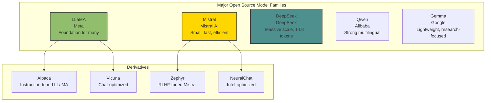
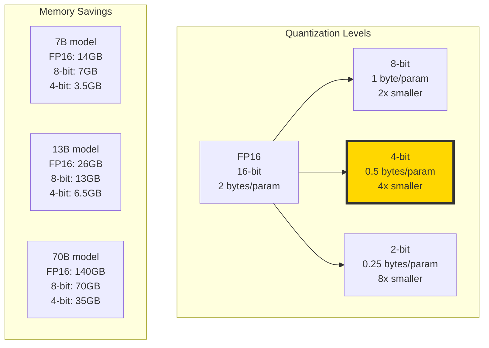

# The 2026 AI Metromap: Open Source LLMs – LLaMA, Mistral, DeepSeek, and Beyond

## Series C: Modern Architecture Line | Story 6 of 6

---

## 📖 Introduction

**Welcome to the final stop on the Modern Architecture Line.**

In our last five stories, we mastered the architectures that define modern AI: Transformers, GPT, Diffusion, Multimodal models, and adaptation methods. You understand how these models work, how to train them, and how to adapt them.

Now we face the most practical question of all: **"How do I actually use these models?"**

For years, powerful LLMs were locked behind APIs. You couldn't run GPT-4 locally. You couldn't fine-tune it. You couldn't own it. You were a passenger, not a driver.

Then came the open source revolution.

In 2023, Meta released LLaMA. It wasn't as powerful as GPT-4, but you could run it on your own hardware. Soon after came Mistral—smaller, faster, sometimes better. Then DeepSeek—trained on 14.8 trillion tokens, rivaling closed models. Today, open source LLMs match or exceed closed models on many benchmarks. They run on laptops, phones, and edge devices. They can be fine-tuned, quantized, and customized.

This story—**The 2026 AI Metromap: Open Source LLMs – LLaMA, Mistral, DeepSeek, and Beyond**—is your guide to the open source ecosystem. We'll explore the major model families and their trade-offs. We'll master quantization—running 70B models on consumer GPUs. We'll understand inference optimization—making models fast. And we'll build practical tools to run, serve, and deploy open source models.

**Let's open the source.**

---

## 📚 Where You Are in the Journey

### The Master Story Arc: The 2026 AI Metromap Series (Complete)

- 🗺️ **[The 2026 AI Metromap: Why the Old Learning Routes Are Obsolete](#)** – A paradigm shift from linear learning to transit-system mastery.
- 🧭 **[The 2026 AI Metromap: Reading the Map](#)** – Strategic navigation across the three core lines.
- 🎒 **[The 2026 AI Metromap: Avoiding Derailments](#)** – Diagnosing and preventing the most common learning pitfalls.
- 🏁 **[The 2026 AI Metromap: From Passenger to Driver](#)** – Building your portfolio using the Metromap structure.

### Series A: Foundations Station (Complete)
### Series B: Supervised Learning Line (Complete)

### Series C: Modern Architecture Line (6 Stories – Complete)

- 📖 **[The 2026 AI Metromap: Transformers & Attention – The Station That Changed Everything](#)** – The "Attention Is All You Need" paper decoded; self-attention mechanisms; multi-head attention; positional encoding; encoder-decoder architecture.

- 🤖 **[The 2026 AI Metromap: GPT & LLM Architecture – Understanding the Engine of the Express Train](#)** – Decoder-only architecture; causal masking; next token prediction; scaling laws; context windows; emergent abilities.

- 🎨 **[The 2026 AI Metromap: Diffusion Models – The Scenic Route to Generative AI](#)** – How diffusion models work; forward diffusion process; reverse denoising; U-Net architecture; stable diffusion.

- 🌐 **[The 2026 AI Metromap: Multimodal Models – The Interchange Stations](#)** – CLIP: connecting images and text; Flamingo: few-shot multimodal learning; Gemini: native multimodality; contrastive learning.

- 🧩 **[The 2026 AI Metromap: Fine-Tuning vs. In-Context Learning – When to Train vs. When to Prompt](#)** – Parameter-efficient fine-tuning (LoRA, QLoRA); instruction tuning; RLHF; in-context learning; few-shot prompting.

- 📚 **The 2026 AI Metromap: Open Source LLMs – LLaMA, Mistral, DeepSeek, and Beyond** – Running LLMs locally; quantization (GGUF, GPTQ); inference optimization; model comparison; open-source ecosystem. **⬅️ YOU ARE HERE**

### Series C Complete!

You've completed all six stories in the Modern Architecture Line. Your next journey continues into:

- ⚙️ **Series D: Engineering & Optimization Yard** – Production, deployment, and scale
- 🤖 **Series E: Applied AI & Agents Line** – Real-world applications across industries

### The Complete Story Catalog

For a complete view of all upcoming stories across every series, visit the **[Complete 2026 AI Metromap Story Catalog](#)**.

---

## 🌍 The Open Source LLM Landscape

The open source ecosystem has exploded. Here are the major model families.



```python
def model_comparison():
    """Compare major open source LLM families"""
    
    models = [
        {
            "name": "LLaMA",
            "creator": "Meta",
            "sizes": ["7B", "13B", "33B", "65B", "405B"],
            "strengths": "Strong foundation, widely adapted",
            "weaknesses": "Original version had limited context",
            "best_for": "Fine-tuning, research, derivatives"
        },
        {
            "name": "Mistral",
            "creator": "Mistral AI",
            "sizes": ["7B", "8x7B (MoE)", "12B", "123B"],
            "strengths": "Efficient, fast inference, strong performance/size ratio",
            "weaknesses": "Smaller models may lack world knowledge",
            "best_for": "Production deployment, edge devices"
        },
        {
            "name": "DeepSeek",
            "creator": "DeepSeek (China)",
            "sizes": ["7B", "16B", "67B", "236B", "671B (MoE)"],
            "strengths": "Massive training data (14.8T tokens), strong reasoning",
            "weaknesses": "Larger models need significant compute",
            "best_for": "Research, complex reasoning tasks"
        },
        {
            "name": "Qwen",
            "creator": "Alibaba",
            "sizes": ["0.5B", "1.8B", "7B", "14B", "32B", "72B", "110B"],
            "strengths": "Excellent multilingual, strong coding",
            "weaknesses": "Some models have restrictive licenses",
            "best_for": "Non-English applications, coding"
        },
        {
            "name": "Gemma",
            "creator": "Google",
            "sizes": ["2B", "7B", "9B", "27B"],
            "strengths": "Research-friendly, well-documented",
            "weaknesses": "Smaller scale than competitors",
            "best_for": "Research, education, lightweight applications"
        }
    ]
    
    print("="*80)
    print("OPEN SOURCE LLM FAMILIES COMPARISON")
    print("="*80)
    
    for model in models:
        print(f"\n📦 {model['name']} ({model['creator']})")
        print(f"   Sizes: {', '.join(model['sizes'])}")
        print(f"   ✅ Strengths: {model['strengths']}")
        print(f"   ⚠️ Weaknesses: {model['weaknesses']}")
        print(f"   🎯 Best for: {model['best_for']}")
    
    print("\n" + "="*80)
    print("SELECTION GUIDE")
    print("="*80)
    print("For consumer GPUs (8-12GB): Mistral-7B, Qwen-7B, Gemma-7B")
    print("For pro GPUs (24GB): LLaMA-13B, Mistral-8x7B, Qwen-14B")
    print("For research clusters: DeepSeek-67B+, LLaMA-70B+")
    print("For edge/mobile: Gemma-2B, Qwen-1.8B, DeepSeek-7B (quantized)")

model_comparison()
```

---

## 📦 Quantization: Running Big Models on Small Hardware

Quantization reduces model size by using fewer bits per parameter.



```python
def explain_quantization():
    """Explain quantization formats and their trade-offs"""
    
    print("="*60)
    print("QUANTIZATION FORMATS")
    print("="*60)
    
    formats = [
        {
            "name": "GGUF (GGML Unified Format)",
            "creator": "Georgi Gerganov (llama.cpp)",
            "bits": "2-bit to 8-bit",
            "best_for": "CPU inference, consumer hardware",
            "quality": "Good, especially Q4_K_M and Q5_K_M"
        },
        {
            "name": "GPTQ",
            "creator": "GPTQ team",
            "bits": "2-bit to 8-bit",
            "best_for": "GPU inference, batch processing",
            "quality": "Excellent, preserves accuracy well"
        },
        {
            "name": "AWQ (Activation-Aware Quantization)",
            "creator": "MIT",
            "bits": "4-bit",
            "best_for": "GPU inference, low-bit high-quality",
            "quality": "State-of-the-art for 4-bit"
        }
    ]
    
    for fmt in formats:
        print(f"\n📦 {fmt['name']}")
        print(f"   Creator: {fmt['creator']}")
        print(f"   Bits: {fmt['bits']}")
        print(f"   Best for: {fmt['best_for']}")
        print(f"   Quality: {fmt['quality']}")
    
    print("\n" + "="*60)
    print("PRACTICAL RECOMMENDATIONS")
    print("="*60)
    print("For CPU-only inference: GGUF (Q4_K_M or Q5_K_M)")
    print("For GPU inference (single batch): GPTQ (4-bit)")
    print("For maximum quality with 4-bit: AWQ")
    print("For edge/mobile: GGUF (Q4_0 or Q3_K_S)")
    
    # Visualize memory requirements
    fig, ax = plt.subplots(figsize=(12, 6))
    
    models = ['7B', '13B', '30B', '70B']
    formats = ['FP16', '8-bit', '4-bit', '2-bit']
    colors = ['#ff6b6b', '#ffa500', '#ffd700', '#90be6d']
    
    memory = {
        '7B': [14, 7, 3.5, 1.75],
        '13B': [26, 13, 6.5, 3.25],
        '30B': [60, 30, 15, 7.5],
        '70B': [140, 70, 35, 17.5]
    }
    
    x = np.arange(len(models))
    width = 0.2
    
    for i, (fmt, color) in enumerate(zip(formats, colors)):
        values = [memory[m][i] for m in models]
        bars = ax.bar(x + i*width, values, width, label=fmt, color=color)
        
        # Add value labels
        for bar, val in zip(bars, values):
            if val < 200:  # Only show reasonable values
                ax.text(bar.get_x() + bar.get_width()/2, bar.get_height() + 1,
                       f'{val}GB', ha='center', va='bottom', fontsize=9)
    
    ax.set_xlabel('Model Size')
    ax.set_ylabel('Memory (GB)')
    ax.set_title('Memory Requirements by Quantization Level')
    ax.set_xticks(x + width*1.5)
    ax.set_xticklabels(models)
    ax.legend()
    ax.axhline(y=24, color='red', linestyle='--', label='Consumer GPU (24GB)')
    ax.axhline(y=12, color='orange', linestyle='--', label='Budget GPU (12GB)')
    ax.grid(True, alpha=0.3, axis='y')
    
    plt.tight_layout()
    plt.show()

explain_quantization()
```

---

## 🚀 Running Open Source Models Locally

Let's build practical code to run open source models on consumer hardware.

### Option 1: llama.cpp (CPU/GPU Hybrid)

```python
def run_llama_cpp_example():
    """Example of running GGUF models with llama.cpp"""
    
    print("="*60)
    print("RUNNING MODELS WITH LLAMA.CPP")
    print("="*60)
    
    print("""
Installation:
    pip install llama-cpp-python

Basic Usage:
    from llama_cpp import Llama
    
    # Load quantized model
    llm = Llama(
        model_path="models/mistral-7b-instruct-v0.2.Q4_K_M.gguf",
        n_ctx=4096,          # Context window
        n_threads=8,         # CPU threads
        n_gpu_layers=35,     # Offload to GPU
        verbose=False
    )
    
    # Generate
    output = llm(
        "Explain quantum computing in simple terms:",
        max_tokens=256,
        temperature=0.7,
        top_p=0.9,
        repeat_penalty=1.1
    )
    
    print(output['choices'][0]['text'])
    
Advanced Features:
    • Streaming: stream=True
    • Chat template: apply_chat_template()
    • Embeddings: llm.embed()
    • Function calling: custom formatting
    """)
    
    # Show model sizes
    print("\n" + "="*60)
    print("RECOMMENDED MODELS BY HARDWARE")
    print("="*60)
    print("\n8GB RAM (CPU only):")
    print("  • Phi-3-mini-4k-instruct.Q4_K_M.gguf (3.8B, ~2.5GB)")
    print("  • Gemma-2B-it.Q4_K_M.gguf (2B, ~1.5GB)")
    print("\n12GB VRAM (GPU):")
    print("  • Mistral-7B-Instruct-v0.2.Q4_K_M.gguf (7B, ~4.2GB)")
    print("  • Qwen2.5-7B-Instruct.Q4_K_M.gguf (7B, ~4.2GB)")
    print("\n24GB VRAM (GPU):")
    print("  • Llama-3.1-8B-Instruct.Q4_K_M.gguf (8B, ~4.8GB)")
    print("  • DeepSeek-V2-Lite-Chat.Q4_K_M.gguf (16B, ~9.5GB)")
    print("  • Mixtral-8x7B-Instruct-v0.1.Q4_K_M.gguf (47B, ~26GB)")

run_llama_cpp_example()
```

### Option 2: Transformers + BitsAndBytes (PyTorch)

```python
def run_transformers_quantized():
    """Example of running quantized models with HuggingFace Transformers"""
    
    print("="*60)
    print("RUNNING MODELS WITH TRANSFORMERS + BITSANDBYTES")
    print("="*60)
    
    print("""
Installation:
    pip install transformers accelerate bitsandbytes

Basic Usage:
    from transformers import AutoModelForCausalLM, AutoTokenizer
    import torch
    
    # Load with 4-bit quantization
    model = AutoModelForCausalLM.from_pretrained(
        "mistralai/Mistral-7B-Instruct-v0.2",
        device_map="auto",
        load_in_4bit=True,
        bnb_4bit_compute_dtype=torch.float16,
        bnb_4bit_quant_type="nf4",
        bnb_4bit_use_double_quant=True
    )
    
    tokenizer = AutoTokenizer.from_pretrained("mistralai/Mistral-7B-Instruct-v0.2")
    
    # Chat template
    messages = [
        {"role": "user", "content": "Explain quantum computing"}
    ]
    
    inputs = tokenizer.apply_chat_template(
        messages, 
        tokenize=True, 
        add_generation_prompt=True,
        return_tensors="pt"
    ).to("cuda")
    
    # Generate
    outputs = model.generate(
        inputs,
        max_new_tokens=512,
        temperature=0.7,
        do_sample=True,
        top_p=0.9
    )
    
    response = tokenizer.decode(outputs[0][inputs.shape[1]:], skip_special_tokens=True)
    print(response)
    
Memory Tips:
    • load_in_8bit=True for 8-bit quantization
    • device_map="auto" for automatic GPU/CPU placement
    • torch_dtype=torch.float16 for mixed precision
    """)

run_transformers_quantized()
```

### Option 3: vLLM for High-Throughput Serving

```python
def run_vllm_example():
    """Example of high-throughput serving with vLLM"""
    
    print("="*60)
    print("HIGH-THROUGHPUT SERVING WITH VLLM")
    print("="*60)
    
    print("""
Installation:
    pip install vllm

Basic Usage:
    from vllm import LLM, SamplingParams
    
    # Load model
    llm = LLM(
        model="meta-llama/Llama-2-7b-chat-hf",
        tensor_parallel_size=1,    # GPUs for model parallelism
        dtype="float16",
        quantization="awq"         # or "gptq"
    )
    
    # Sampling parameters
    sampling_params = SamplingParams(
        temperature=0.7,
        top_p=0.9,
        max_tokens=512
    )
    
    # Generate batch
    prompts = [
        "Explain quantum computing",
        "Write a Python function for fibonacci",
        "Summarize the history of AI"
    ]
    
    outputs = llm.generate(prompts, sampling_params)
    
    for output in outputs:
        print(output.outputs[0].text)
    
Performance:
    • vLLM is 10-20x faster than HuggingFace for batch inference
    • Uses PagedAttention for efficient memory management
    • Supports continuous batching
    • Can serve hundreds of concurrent requests
    """)

run_vllm_example()
```

---

## 🧪 Benchmarking Open Source Models

Let's compare performance across model families and sizes.

```python
def benchmark_comparison():
    """Compare performance characteristics of open source models"""
    
    models = [
        {
            "name": "Phi-3-mini",
            "size": "3.8B",
            "quality": "Good for its size",
            "speed": "Very Fast",
            "memory_gb": 2.5,
            "best_use": "Edge, mobile, low-resource"
        },
        {
            "name": "Gemma-7B",
            "size": "7B",
            "quality": "Good",
            "speed": "Fast",
            "memory_gb": 4.5,
            "best_use": "General purpose, research"
        },
        {
            "name": "Mistral-7B",
            "size": "7B",
            "quality": "Excellent",
            "speed": "Fast",
            "memory_gb": 4.5,
            "best_use": "Production, fine-tuning"
        },
        {
            "name": "Qwen2.5-14B",
            "size": "14B",
            "quality": "Very Good",
            "speed": "Medium",
            "memory_gb": 8.5,
            "best_use": "Coding, multilingual"
        },
        {
            "name": "LLaMA-3-8B",
            "size": "8B",
            "quality": "Excellent",
            "speed": "Fast",
            "memory_gb": 5,
            "best_use": "General purpose, chat"
        },
        {
            "name": "Mixtral-8x7B",
            "size": "47B (MoE)",
            "quality": "Outstanding",
            "speed": "Medium",
            "memory_gb": 26,
            "best_use": "High-quality, enterprise"
        },
        {
            "name": "DeepSeek-V2-16B",
            "size": "16B",
            "quality": "State-of-the-art",
            "speed": "Medium",
            "memory_gb": 10,
            "best_use": "Complex reasoning, coding"
        }
    ]
    
    print("="*100)
    print("OPEN SOURCE MODEL BENCHMARK COMPARISON")
    print("="*100)
    print(f"{'Model':<18} {'Size':<8} {'Quality':<12} {'Speed':<10} {'Memory':<8} {'Best Use'}")
    print("-"*100)
    
    for m in models:
        print(f"{m['name']:<18} {m['size']:<8} {m['quality']:<12} {m['speed']:<10} {m['memory_gb']:<8.1f}GB {m['best_use']}")
    
    # Visualization
    fig, axes = plt.subplots(1, 2, figsize=(14, 6))
    
    # Memory vs Quality (qualitative)
    names = [m['name'] for m in models]
    memories = [m['memory_gb'] for m in models]
    quality_scores = {
        "Phi-3-mini": 6,
        "Gemma-7B": 7,
        "Mistral-7B": 8,
        "Qwen2.5-14B": 8.5,
        "LLaMA-3-8B": 8,
        "Mixtral-8x7B": 9,
        "DeepSeek-V2-16B": 9
    }
    qualities = [quality_scores[m['name']] for m in models]
    
    colors = ['#90be6d' if '7B' in m['size'] else '#ffd700' if '14B' in m['size'] or '16B' in m['size'] else '#4d908e' for m in models]
    
    axes[0].scatter(memories, qualities, s=200, c=colors, alpha=0.7)
    for i, name in enumerate(names):
        axes[0].annotate(name, (memories[i] + 0.3, qualities[i]), fontsize=9)
    
    axes[0].set_xlabel('Memory (GB) - Lower is Better')
    axes[0].set_ylabel('Quality (1-10) - Higher is Better')
    axes[0].set_title('Memory vs Quality Trade-off')
    axes[0].grid(True, alpha=0.3)
    
    # Speed comparison (relative)
    speeds = {
        "Phi-3-mini": 10,
        "Gemma-7B": 8,
        "Mistral-7B": 8,
        "Qwen2.5-14B": 5,
        "LLaMA-3-8B": 8,
        "Mixtral-8x7B": 4,
        "DeepSeek-V2-16B": 5
    }
    
    speed_values = [speeds[m['name']] for m in models]
    bars = axes[1].barh(names, speed_values, color=colors)
    axes[1].set_xlabel('Relative Speed (Higher is Better)')
    axes[1].set_title('Inference Speed Comparison')
    
    for bar, val in zip(bars, speed_values):
        axes[1].text(val + 0.3, bar.get_y() + bar.get_height()/2, 
                    f'{val}/10', ha='left', va='center')
    
    plt.tight_layout()
    plt.show()
    
    print("\n" + "="*100)
    print("SELECTION RECOMMENDATIONS")
    print("="*100)
    print("\n🔹 Best Overall (Quality/Size Ratio): Mistral-7B")
    print("🔹 Best for Consumer GPUs (8-12GB): LLaMA-3-8B, Mistral-7B")
    print("🔹 Best for Edge/Low Memory: Phi-3-mini (3.8B, 2.5GB)")
    print("🔹 Best for Coding: Qwen2.5-14B, DeepSeek-V2-16B")
    print("🔹 Best for Enterprise/High Quality: Mixtral-8x7B, DeepSeek-V2")
    print("🔹 Best for Research: LLaMA-3 (any size), Gemma")

benchmark_comparison()
```

---

## 🛠️ Building a Local LLM Service

Let's build a complete local LLM service that can be used as an API.

```python
def build_local_llm_service():
    """Guide to building a local LLM API service"""
    
    print("="*60)
    print("BUILDING A LOCAL LLM SERVICE")
    print("="*60)
    
    print("""
1. CHOOSE YOUR STACK:
   ┌─────────────────────────────────────────────────────────────┐
   │ Option A: llama.cpp (CPU/GPU hybrid, simple)              │
   │   • Server: llama-cpp-python server                        │
   │   • Command: python -m llama_cpp.server --model model.gguf │
   │   • Endpoint: http://localhost:8000/v1/chat/completions    │
   └─────────────────────────────────────────────────────────────┘
   
   ┌─────────────────────────────────────────────────────────────┐
   │ Option B: vLLM (High-throughput, OpenAI-compatible)        │
   │   • Server: vllm serve --model meta-llama/Llama-2-7b       │
   │   • Endpoint: http://localhost:8000/v1                      │
   │   • Supports: completions, chat, embeddings                │
   └─────────────────────────────────────────────────────────────┘
   
   ┌─────────────────────────────────────────────────────────────┐
   │ Option C: Text Generation Inference (HuggingFace)          │
   │   • Server: text-generation-launcher --model-id mistralai  │
   │   • Endpoint: http://localhost:8080                        │
   │   • Features: Continuous batching, quantization, metrics   │
   └─────────────────────────────────────────────────────────────┘

2. EXAMPLE API CLIENT:
   
   import requests
   
   def chat_with_local_llm(prompt, system_prompt=None):
       url = "http://localhost:8000/v1/chat/completions"
       
       messages = []
       if system_prompt:
           messages.append({"role": "system", "content": system_prompt})
       messages.append({"role": "user", "content": prompt})
       
       response = requests.post(url, json={
           "model": "local-model",
           "messages": messages,
           "temperature": 0.7,
           "max_tokens": 512,
           "stream": False
       })
       
       return response.json()["choices"][0]["message"]["content"]

3. DOCKER DEPLOYMENT:
   
   # llama.cpp server
   docker run -d \\
     -p 8000:8000 \\
     -v ./models:/models \\
     ghcr.io/ggerganov/llama.cpp:server \\
     -m /models/mistral-7b.Q4_K_M.gguf \\
     --host 0.0.0.0 \\
     --port 8000

4. PERFORMANCE TUNING:
   • Use tensor parallelism for multi-GPU (vLLM: --tensor-parallel-size 2)
   • Enable continuous batching for concurrent users
   • Use prefix caching for repeated prompts
   • Quantize to 4-bit for 4x memory reduction
   • Use speculative decoding for 2x speedup

5. MONITORING:
   • Track: tokens/s, latency, GPU memory, queue length
   • Tools: Prometheus + Grafana, vLLM metrics endpoint
   • Log errors and response times for debugging
    """)

build_local_llm_service()
```

---

## 📊 Open Source vs Closed Models

```python
def compare_open_vs_closed():
    """Compare open source vs closed models"""
    
    print("="*60)
    print("OPEN SOURCE VS CLOSED MODELS")
    print("="*60)
    
    comparison = {
        "Open Source": {
            "Pros": [
                "✅ Run locally, no API calls",
                "✅ Full control over model",
                "✅ No data privacy concerns",
                "✅ Can fine-tune arbitrarily",
                "✅ No rate limits or costs",
                "✅ Can deploy anywhere"
            ],
            "Cons": [
                "❌ Requires hardware",
                "❌ Setup complexity",
                "❌ May lag behind frontier models",
                "❌ Support varies"
            ]
        },
        "Closed (OpenAI, Anthropic, etc.)": {
            "Pros": [
                "✅ No hardware required",
                "✅ Instant access",
                "✅ State-of-the-art performance",
                "✅ Managed infrastructure",
                "✅ Good documentation"
            ],
            "Cons": [
                "❌ API costs add up",
                "❌ Data privacy concerns",
                "❌ Rate limits",
                "❌ Can't fine-tune fully",
                "❌ Vendor lock-in"
            ]
        }
    }
    
    for category, details in comparison.items():
        print(f"\n{'='*60}")
        print(f"{category}")
        print(f"{'='*60}")
        print("\nPros:")
        for pro in details['Pros']:
            print(f"  {pro}")
        print("\nCons:")
        for con in details['Cons']:
            print(f"  {con}")
    
    print("\n" + "="*60)
    print("HYBRID APPROACH")
    print("="*60)
    print("Many teams use both:")
    print("  • Open source for development, internal tools, fine-tuning")
    print("  • Closed APIs for production, complex tasks, when quality matters most")
    print("\nBest of both worlds: start with open source, fall back to closed APIs")

compare_open_vs_closed()
```

---

## 📊 Takeaway from This Story

**What You Learned:**

- **Open Source Ecosystem** – LLaMA (Meta), Mistral, DeepSeek, Qwen, Gemma. Each with different strengths, sizes, and licenses.

- **Quantization** – GGUF (CPU), GPTQ (GPU), AWQ (4-bit quality). 4-bit models use 4x less memory with minimal quality loss.

- **Running Locally** – llama.cpp for CPU/GPU hybrid, Transformers+bitsandbytes for PyTorch, vLLM for high-throughput serving.

- **Model Selection** – Choose based on hardware (8GB → 7B models, 24GB → 13-30B models), task (coding → Qwen/DeepSeek), and quality needs.

- **Deployment Options** – Local service, Docker container, cloud VM. Open source gives you full control.

- **Open vs Closed** – Open source for control and privacy, closed APIs for convenience and frontier performance. Hybrid approach works best.

---

## 🔗 Navigation

- **⬅️ Previous Story:** [The 2026 AI Metromap: Fine-Tuning vs. In-Context Learning – When to Train vs. When to Prompt](#)

- **📚 Series C Catalog:** [Series C: Modern Architecture Line](#) – View all 6 stories in this series.

- **📚 Complete Story Catalog:** [Complete 2026 AI Metromap Story Catalog](#) – Your navigation guide to all 39+ stories.

- **➡️ Your Next Station:** Modern Architecture Line is complete! Choose your next series:

  - ⚙️ **[Series D: Engineering & Optimization Yard](#)** – Production, deployment, and scale
  - 🤖 **[Series E: Applied AI & Agents Line](#)** – Real-world applications across industries

---

## 📝 Your Invitation

Modern Architecture Line is complete. You now understand Transformers, GPT, Diffusion, Multimodal models, adaptation methods, and the open source ecosystem.

Before moving to your next series:

1. **Download a model** – Get a 7B model (Mistral, LLaMA, or Qwen) in GGUF format.

2. **Run it locally** – Use llama.cpp to chat with the model. See how it performs on your hardware.

3. **Experiment with quantization** – Download the same model in 4-bit and 8-bit. Compare quality and speed.

4. **Build a simple API** – Wrap the model in a FastAPI service. Call it from a simple frontend.

**You've mastered the express train. Now it's time to build!**

---

*Found this helpful? Clap, comment, and share your open source LLM experiments. Modern Architecture Line is complete. Your journey continues!* 🚇