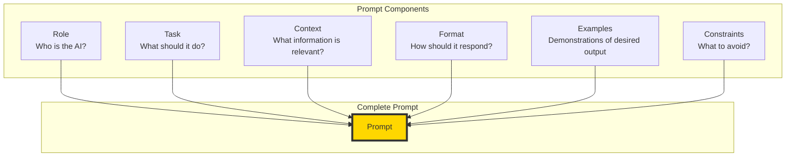
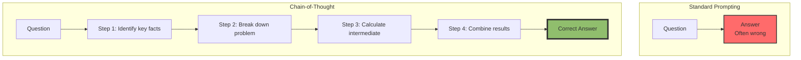

# The 2026 AI Metromap: Prompt Engineering 101 – The Art of Talking to AI

## Series E: Applied AI & Agents Line | Story 1 of 15+


## 📖 Introduction

**Welcome to the Applied AI & Agents Line—the destination stops where theory becomes reality.**

You've completed Foundations Station. You've mastered the Supervised Learning Line. You've ridden the Modern Architecture Line from Transformers to GPT to Diffusion. You've built production-ready systems in the Engineering & Optimization Yard. You have the tools.

Now it's time to build.

The Applied AI & Agents Line is where everything comes together. This is where you build chatbots, agents, vision systems, and real-world applications across healthcare, finance, gaming, and beyond. This is what you've been training for.

But before you can build complex agents and applications, you need to master the fundamental skill that powers them all: **prompt engineering**.

Prompt engineering isn't just "writing instructions." It's the art and science of communicating with LLMs to get precisely what you want. A well-crafted prompt can turn a generic model into a specialized assistant. A poorly crafted prompt can make the smartest model seem useless.

This story—**The 2026 AI Metromap: Prompt Engineering 101 – The Art of Talking to AI**—is your foundation for all the applied stories that follow. We'll master the anatomy of a prompt. We'll explore system prompts, few-shot prompting, and chain-of-thought. We'll learn techniques for controlling output format, tone, and style. And we'll build robust prompts that work consistently across different models.

**Let's learn to talk to AI.**

---

## 📚 Where You Are in the Journey

### The Master Story Arc: The 2026 AI Metromap Series (Complete)

- 🗺️ **[The 2026 AI Metromap: Why the Old Learning Routes Are Obsolete](#)** – A paradigm shift from linear learning to transit-system mastery.
- 🧭 **[The 2026 AI Metromap: Reading the Map](#)** – Strategic navigation across the three core lines.
- 🎒 **[The 2026 AI Metromap: Avoiding Derailments](#)** – Diagnosing and preventing the most common learning pitfalls.
- 🏁 **[The 2026 AI Metromap: From Passenger to Driver](#)** – Building your portfolio using the Metromap structure.

### Series A: Foundations Station (Complete)
### Series B: Supervised Learning Line (Complete)
### Series C: Modern Architecture Line (Complete)
### Series D: Engineering & Optimization Yard (Complete)

### Series E: Applied AI & Agents Line (15+ Stories)

**LLM Applications**
- 💬 **The 2026 AI Metromap: Prompt Engineering 101 – The Art of Talking to AI** – System prompts; few-shot prompting; chain-of-thought; tree of thoughts; self-consistency; prompt templates; building robust prompts for production. **⬅️ YOU ARE HERE**

- 📚 **[The 2026 AI Metromap: RAG – Retrieval-Augmented Generation for Knowledge-Intensive Tasks](#)** – Vector databases (Chroma, Pinecone, Weaviate, Milvus); embedding models; semantic search; hybrid search; reranking; building a document Q&A system. 🔜 *Up Next*

- 🤖 **[The 2026 AI Metromap: AI Agents & Autonomous Workflows – The Self-Driving Trains](#)** – Agent architectures (ReAct, Plan-and-Execute, AutoGPT); tool use and function calling; multi-agent systems; memory management.

- 🗣️ **[The 2026 AI Metromap: Voice Assistants & Speech Models – Making AI Talk](#)** – Speech-to-text (Whisper); text-to-speech (ElevenLabs, Coqui); voice activity detection; real-time transcription.

**Computer Vision**
- 👁️ **[The 2026 AI Metromap: Computer Vision Projects – From OCR to Face Recognition](#)** – Optical character recognition (Tesseract, TrOCR); face detection and recognition; object detection (YOLO, DETR); image segmentation.

- 🎨 **[The 2026 AI Metromap: Image Generation & Editing – Diffusion Models in Practice](#)** – Stable diffusion pipelines; ControlNet; inpainting; outpainting; image-to-image; fine-tuning diffusion models with DreamBooth.

**NLP & Specialized Tasks**
- 🔤 **[The 2026 AI Metromap: NLP Tasks – NER, Translation, Summarization, and Beyond](#)** – Named entity recognition; machine translation; text summarization (extractive and abstractive); sentiment analysis.

- 📈 **[The 2026 AI Metromap: Time Series Forecasting – ARIMA, LSTM, and Transformers](#)** – Classical methods (ARIMA, SARIMA); LSTM networks; Transformer for time series; forecasting stock prices, weather, and demand.

- 👍 **[The 2026 AI Metromap: Recommendation Systems – From Collaborative Filtering to Two-Tower Networks](#)** – Content-based filtering; collaborative filtering; matrix factorization; neural collaborative filtering; two-tower architectures.

**Industry Applications**
- 🏥 **[The 2026 AI Metromap: AI in Healthcare – Medical Research, Diagnostics, and Wellness](#)** – Medical imaging; EHR analysis; drug discovery; clinical decision support; regulatory considerations.

- 💰 **[The 2026 AI Metromap: AI in Finance – Banking, Insurance, and Trading](#)** – Fraud detection; algorithmic trading; credit scoring; risk management; explainable AI for compliance.

- 🎮 **[The 2026 AI Metromap: AI in Gaming, VR/AR, and Entertainment](#)** – Procedural content generation; NPC behavior with LLMs; AI-driven storytelling; game testing automation.

- 🏭 **[The 2026 AI Metromap: AI in Robotics, Manufacturing, and Supply Chain](#)** – Computer vision for quality control; predictive maintenance; autonomous navigation; warehouse optimization.

- 🌱 **[The 2026 AI Metromap: AI for Social Good – Climate Action, Agriculture, and Sustainability](#)** – Crop yield prediction; climate modeling; energy optimization; wildlife conservation; disaster response.

- 🎓 **[The 2026 AI Metromap: AI in Education – Personalized Learning and Training](#)** – Intelligent tutoring systems; automated grading; personalized content recommendation; adaptive learning paths.

### The Complete Story Catalog

For a complete view of all upcoming stories across every series, visit the **[Complete 2026 AI Metromap Story Catalog](#)**.

---

## 💬 The Anatomy of a Prompt

A prompt is more than just a question. It's a structured communication that guides the model's behavior.



```python
def prompt_anatomy():
    """Demonstrate the components of an effective prompt"""
    
    print("="*60)
    print("THE ANATOMY OF A PROMPT")
    print("="*60)
    
    # Example: Customer support agent
    prompt = """
    # ROLE
    You are a helpful customer support agent for Acme Corporation.
    
    # TASK
    Help the customer resolve their issue with a delayed order.
    
    # CONTEXT
    - Order #12345 was placed on March 15, 2026
    - Expected delivery: March 20, 2026
    - Current status: "In transit" (last updated March 18)
    - Customer has been waiting 5 days
    
    # FORMAT
    Respond with:
    1. Empathy statement
    2. Current status explanation
    3. Next steps
    4. Estimated resolution time
    
    # CONSTRAINTS
    - Don't promise specific delivery dates
    - Don't offer refunds without approval
    - Be polite and professional
    """
    
    print("Example Prompt Structure:")
    print(prompt)
    
    print("\n" + "="*60)
    print("KEY COMPONENTS")
    print("="*60)
    print("1. ROLE: Defines who the AI is and its persona")
    print("   • 'You are a...' sets the context")
    print("   • Affects tone, expertise, and boundaries")
    
    print("\n2. TASK: What the AI should accomplish")
    print("   • Be specific about the goal")
    print("   • One clear objective per prompt")
    
    print("\n3. CONTEXT: Relevant information")
    print("   • Facts the model needs")
    print("   • Historical context")
    print("   • User information")
    
    print("\n4. FORMAT: How to structure the response")
    print("   • Bullet points, JSON, paragraphs")
    print("   • Sections or headers")
    print("   • Length constraints")
    
    print("\n5. EXAMPLES: Demonstrations of desired output")
    print("   • Few-shot examples")
    print("   • Input-output pairs")
    print("   • Edge cases")
    
    print("\n6. CONSTRAINTS: What to avoid")
    print("   • Don't do X")
    print("   • Stay within boundaries")
    print("   • Safety guardrails")

prompt_anatomy()
```

---

## 🎭 System Prompts: Setting the Stage

System prompts define the model's behavior, persona, and boundaries.

```python
def system_prompts():
    """Explore system prompts for controlling model behavior"""
    
    print("="*60)
    print("SYSTEM PROMPTS")
    print("="*60)
    
    # Example system prompts for different use cases
    system_prompts = {
        "Helpful Assistant": """
        You are a helpful, harmless, and honest AI assistant.
        You provide accurate information and admit when you don't know.
        You are friendly and conversational.
        """,
        
        "Code Expert": """
        You are an expert Python developer with 10 years of experience.
        You write clean, efficient, well-documented code.
        You explain your reasoning and suggest best practices.
        You include error handling and type hints.
        """,
        
        "Medical Disclaimer": """
        You are a medical information assistant.
        You provide educational information only.
        You always include a disclaimer that users should consult real doctors.
        You never make diagnoses or prescribe treatments.
        """,
        
        "Creative Writer": """
        You are a creative writing assistant with a poetic style.
        You use vivid imagery and emotional language.
        You write in the style of classic literature.
        You focus on character development and atmosphere.
        """
    }
    
    print("Example System Prompts:\n")
    for name, prompt in system_prompts.items():
        print(f"{name}:")
        print(f"  {prompt.strip()[:100]}...")
        print()
    
    print("="*60)
    print("SYSTEM PROMPT BEST PRACTICES")
    print("="*60)
    print("• Be specific about the persona")
    print("• Define boundaries and limitations")
    print("• Set tone and communication style")
    print("• Include safety guardrails")
    print("• Keep concise (long system prompts waste tokens)")

system_prompts()
```

---

## 📝 Few-Shot Prompting: Learning from Examples

Few-shot prompting gives the model examples of the desired input-output format.

```python
def few_shot_prompting():
    """Demonstrate few-shot prompting with examples"""
    
    print("="*60)
    print("FEW-SHOT PROMPTING")
    print("="*60)
    
    # Example: Sentiment classification
    few_shot = """
    Classify the sentiment of the following reviews as Positive, Negative, or Neutral.
    
    Examples:
    
    Review: "This product exceeded all my expectations! Amazing quality!"
    Sentiment: Positive
    
    Review: "Waste of money. Broke after one use."
    Sentiment: Negative
    
    Review: "It's okay. Does what it says but nothing special."
    Sentiment: Neutral
    
    Review: "Decent value for the price. Would recommend."
    Sentiment: Positive
    
    Now classify this review:
    
    Review: "The customer service was terrible but the product itself is great."
    Sentiment:
    """
    
    print("Few-Shot Prompt:")
    print(few_shot)
    
    print("\n" + "="*60)
    print("WHY FEW-SHOT WORKS")
    print("="*60)
    print("• Models learn patterns from examples")
    print("• Shows the desired format explicitly")
    print("• Handles edge cases through demonstration")
    print("• Reduces ambiguity")
    
    print("\nFEW-SHOT TIPS:")
    print("• Use 3-5 diverse examples")
    print("• Include edge cases")
    print("• Match the format you want in output")
    print("• Keep examples representative of real data")

few_shot_prompting()
```

---

## 🧠 Chain-of-Thought: Step-by-Step Reasoning

Chain-of-Thought (CoT) prompts the model to show its reasoning, improving accuracy on complex tasks.



```python
def chain_of_thought():
    """Demonstrate chain-of-thought prompting for complex reasoning"""
    
    print("="*60)
    print("CHAIN-OF-THOUGHT PROMPTING")
    print("="*60)
    
    # Without CoT
    print("\n1. WITHOUT CHAIN-OF-THOUGHT:")
    print("-"*40)
    prompt_no_cot = """
    Question: Roger has 5 tennis balls. He buys 2 more cans of tennis balls. 
    Each can has 3 tennis balls. How many tennis balls does he have now?
    
    Answer:
    """
    print(prompt_no_cot)
    
    # With CoT
    print("\n2. WITH CHAIN-OF-THOUGHT:")
    print("-"*40)
    prompt_cot = """
    Question: Roger has 5 tennis balls. He buys 2 more cans of tennis balls. 
    Each can has 3 tennis balls. How many tennis balls does he have now?
    
    Let's think step by step:
    1. Roger starts with 5 tennis balls.
    2. He buys 2 cans, each with 3 balls.
    3. Balls from cans: 2 × 3 = 6 balls.
    4. Total balls: 5 + 6 = 11 balls.
    
    Answer: 11
    
    Question: There are 3 cars in a parking lot. 2 more cars arrive. 
    Then 1 car leaves. How many cars are left?
    
    Let's think step by step:
    1. Start with 3 cars.
    2. 2 cars arrive: 3 + 2 = 5 cars.
    3. 1 car leaves: 5 - 1 = 4 cars.
    
    Answer: 4
    
    Question: A bakery sells 48 cookies in the morning and 32 in the afternoon. 
    They had 100 cookies to start. How many are left?
    
    Let's think step by step:
    """
    
    print(prompt_cot)
    
    print("\n" + "="*60)
    print("CHAIN-OF-THOUGHT VARIANTS")
    print("="*60)
    
    variants = {
        "Zero-Shot CoT": """
        Add "Let's think step by step" to any prompt.
        Works without examples.
        """,
        
        "Few-Shot CoT": """
        Provide examples with reasoning steps.
        Best for complex, structured reasoning.
        """,
        
        "Self-Consistency": """
        Generate multiple reasoning chains.
        Take majority vote.
        Improves accuracy by 10-20%.
        """,
        
        "Tree of Thoughts": """
        Explore multiple reasoning paths.
        Evaluate and select best.
        For complex planning tasks.
        """
    }
    
    for name, desc in variants.items():
        print(f"\n{name}:")
        print(f"  {desc.strip()}")
    
    print("\n" + "="*60)
    print("BEST PRACTICES")
    print("="*60)
    print("• Always include 'Let's think step by step'")
    print("• Show intermediate calculations")
    print("• Use consistent formatting")
    print("• Validate each reasoning step")

chain_of_thought()
```

---

## 📊 Controlling Output Format

Structured outputs make prompts reliable and parsable.

```python
def output_formatting():
    """Techniques for controlling output format"""
    
    print("="*60)
    print("CONTROLLING OUTPUT FORMAT")
    print("="*60)
    
    # 1. JSON Output
    print("\n1. JSON OUTPUT:")
    print("-"*40)
    json_prompt = """
    Extract the following information from the text and return as JSON:
    
    Text: "John Smith, 35 years old, works as a software engineer at Google in Mountain View."
    
    Output format:
    {
        "name": "...",
        "age": ...,
        "occupation": "...",
        "company": "...",
        "location": "..."
    }
    """
    print(json_prompt)
    
    # 2. Bullet Points
    print("\n2. BULLET POINTS:")
    print("-"*40)
    bullet_prompt = """
    Summarize the key benefits of renewable energy as bullet points:
    
    - Benefit 1: ...
    - Benefit 2: ...
    - Benefit 3: ...
    """
    print(bullet_prompt)
    
    # 3. Markdown Tables
    print("\n3. MARKDOWN TABLES:")
    print("-"*40)
    table_prompt = """
    Compare Python, JavaScript, and Go in a markdown table with columns:
    | Language | Typing | Performance | Learning Curve | Best Use |
    """
    print(table_prompt)
    
    # 4. XML Tags
    print("\n4. XML TAGS:")
    print("-"*40)
    xml_prompt = """
    Extract key information using XML tags:
    
    <summary>...</summary>
    <key_points>
        <point>...</point>
        <point>...</point>
    </key_points>
    <action_items>
        <action>...</action>
    </action_items>
    """
    print(xml_prompt)
    
    print("\n" + "="*60)
    print("FORMATTING TIPS")
    print("="*60)
    print("• Explicitly state the desired format")
    print("• Show the format with placeholders")
    print("• Use consistent delimiters")
    print("• Validate output with regex")
    print("• Consider JSON for programmatic use")

output_formatting()
```

---

## 🎯 Temperature and Sampling Parameters

Control creativity and determinism with sampling parameters.

```python
def sampling_parameters():
    """Explore temperature, top_p, and other sampling parameters"""
    
    print("="*60)
    print("SAMPLING PARAMETERS")
    print("="*60)
    
    parameters = {
        "Temperature": {
            "description": "Controls randomness. Lower = more deterministic, higher = more creative.",
            "range": "0.0 to 2.0",
            "use_cases": {
                "0.0-0.3": "Code generation, factual Q&A, classification",
                "0.5-0.7": "Creative writing, conversation, general tasks",
                "0.8-1.2": "Brainstorming, poetry, diverse outputs",
                "1.5-2.0": "Experimental, highly creative (may become incoherent)"
            }
        },
        "Top P (Nucleus Sampling)": {
            "description": "Considers tokens with top probability mass. Alternative to temperature.",
            "range": "0.0 to 1.0",
            "use_cases": {
                "0.1-0.3": "Focused, deterministic",
                "0.5-0.7": "Balanced",
                "0.9-1.0": "Diverse, creative"
            }
        },
        "Frequency Penalty": {
            "description": "Penalizes tokens based on frequency. Reduces repetition.",
            "range": "-2.0 to 2.0",
            "use_cases": {
                "0.0": "No penalty (may repeat)",
                "0.3-0.7": "Moderate penalty (recommended)",
                "1.0-2.0": "Strong penalty (forces diversity)"
            }
        },
        "Presence Penalty": {
            "description": "Penalizes tokens already present. Encourages new topics.",
            "range": "-2.0 to 2.0",
            "use_cases": {
                "0.0": "No penalty",
                "0.3-0.7": "Encourages topic variety",
                "1.0-2.0": "Forces new topics"
            }
        }
    }
    
    for name, info in parameters.items():
        print(f"\n{name}:")
        print(f"  {info['description']}")
        print(f"  Range: {info['range']}")
        print("  Recommended values:")
        for val, use in info['use_cases'].items():
            print(f"    {val}: {use}")
    
    print("\n" + "="*60)
    print("COMBINATION TIPS")
    print("="*60)
    print("• Temperature 0.2 + Top P 0.1: Highly deterministic")
    print("• Temperature 0.7 + Top P 0.9: Balanced creativity")
    print("• Temperature 1.0 + Top P 1.0: Maximum creativity")
    print("• Add frequency penalty 0.5 to reduce repetition")
    print("• Add presence penalty 0.5 for topic variety")

sampling_parameters()
```

---

## 🛠️ Building Robust Prompts for Production

Production prompts need to be reliable, safe, and testable.

```python
def production_prompts():
    """Best practices for production-grade prompts"""
    
    print("="*60)
    print("PRODUCTION PROMPT ENGINEERING")
    print("="*60)
    
    print("\n1. USE PROMPT TEMPLATES:")
    print("-"*40)
    prompt_template = """
    You are a {role}.
    
    Context: {context}
    
    User: {user_input}
    
    Instructions:
    {instructions}
    
    Respond in this format:
    {format}
    """
    print(prompt_template)
    
    print("\n2. IMPLEMENT PROMPT VERSIONING:")
    print("-"*40)
    versions = {
        "v1.0": "Initial prompt structure",
        "v1.1": "Added examples, fixed formatting",
        "v2.0": "New chain-of-thought approach"
    }
    for ver, desc in versions.items():
        print(f"  {ver}: {desc}")
    
    print("\n3. ADD SAFETY GUARDRAILS:")
    print("-"*40)
    safety_prompt = """
    IMPORTANT SAFETY RULES:
    1. Never provide harmful instructions
    2. Never share personal information
    3. If uncertain, say "I don't know"
    4. Flag inappropriate content
    
    If any unsafe content is detected, respond with:
    "I can't help with that request."
    """
    print(safety_prompt)
    
    print("\n4. IMPLEMENT EVALUATION METRICS:")
    print("-"*40)
    eval_metrics = """
    Track these metrics per prompt version:
    • Success rate: % of desired outputs
    • Latency: Time to generate
    • Token usage: Cost
    • Safety violations: % of flagged outputs
    • User feedback: Ratings
    """
    print(eval_metrics)
    
    print("\n5. A/B TEST PROMPTS:")
    print("-"*40)
    ab_test = """
    Test prompt variations:
    • Version A: Standard instruction
    • Version B: With examples
    • Version C: With chain-of-thought
    
    Measure:
    • User satisfaction
    • Task completion rate
    • Time to completion
    """
    print(ab_test)
    
    print("\n" + "="*60)
    print("PRODUCTION CHECKLIST")
    print("="*60)
    print("✓ Prompt is version controlled")
    print("✓ Safety guardrails are in place")
    print("✓ Output format is validated")
    print("✓ Error handling is implemented")
    print("✓ Performance metrics are tracked")
    print("✓ Prompt is tested with edge cases")
    print("✓ Documentation is current")

production_prompts()
```

---

## 🧪 Prompt Evaluation Framework

```python
def evaluate_prompt():
    """Framework for evaluating prompt quality"""
    
    print("="*60)
    print("PROMPT EVALUATION FRAMEWORK")
    print("="*60)
    
    class PromptEvaluator:
        def __init__(self, prompt):
            self.prompt = prompt
            self.metrics = {}
        
        def evaluate(self):
            self.metrics = {
                "clarity": self._check_clarity(),
                "specificity": self._check_specificity(),
                "format_consistency": self._check_format(),
                "safety": self._check_safety(),
                "token_efficiency": self._check_tokens()
            }
            return self.metrics
        
        def _check_clarity(self):
            """Check if instructions are clear"""
            indicators = ["be", "do", "provide", "list", "summarize"]
            has_action = any(word in self.prompt.lower() for word in indicators)
            return "Good" if has_action else "Needs action verb"
        
        def _check_specificity(self):
            """Check if enough context is provided"""
            if len(self.prompt) < 100:
                return "Too short - may lack context"
            elif len(self.prompt) > 2000:
                return "Too long - may waste tokens"
            return "Good length"
        
        def _check_format(self):
            """Check if output format is specified"""
            format_indicators = ["format", "json", "bullet", "list", "table"]
            has_format = any(word in self.prompt.lower() for word in format_indicators)
            return "Good" if has_format else "Consider specifying output format"
        
        def _check_safety(self):
            """Check for safety guidelines"""
            safety_indicators = ["not", "never", "don't", "cannot", "avoid"]
            has_safety = any(word in self.prompt.lower() for word in safety_indicators)
            return "Good" if has_safety else "Consider adding safety constraints"
        
        def _check_tokens(self):
            """Estimate token usage"""
            tokens = len(self.prompt.split()) * 1.3  # Rough estimate
            if tokens < 100:
                return f"Efficient (~{int(tokens)} tokens)"
            elif tokens < 500:
                return f"Moderate (~{int(tokens)} tokens)"
            else:
                return f"High (~{int(tokens)} tokens) - consider trimming"
    
    # Test a prompt
    test_prompt = """
    You are a helpful assistant. Answer the user's question.
    Use bullet points. Be concise.
    """
    
    evaluator = PromptEvaluator(test_prompt)
    results = evaluator.evaluate()
    
    print("\nEvaluation Results:")
    for metric, result in results.items():
        print(f"  {metric}: {result}")

evaluate_prompt()
```

---

## 📊 Takeaway from This Story

**What You Learned:**

- **Prompt Anatomy** – Role, Task, Context, Format, Examples, Constraints. Every component matters.

- **System Prompts** – Define persona, behavior, and boundaries. Essential for consistent behavior.

- **Few-Shot Prompting** – Provide examples of desired input-output. Models learn patterns from examples.

- **Chain-of-Thought** – Force step-by-step reasoning. Improves accuracy on complex tasks by 10-30%.

- **Output Formatting** – JSON, bullet points, tables, XML. Make outputs parseable and reliable.

- **Sampling Parameters** – Temperature (creativity), Top P (diversity), Frequency/Presence penalties (repetition).

- **Production Prompts** – Version control, safety guardrails, evaluation metrics, A/B testing.

---

## 🔗 Navigation

- **⬅️ Previous Story:** [The 2026 AI Metromap: Training Strategies – Learning Rate Scheduling & Beyond](#) – The final story of Engineering & Optimization Yard.

- **📚 Series E Catalog:** [Series E: Applied AI & Agents Line](#) – View all 15+ stories in this series.

- **📚 Complete Story Catalog:** [Complete 2026 AI Metromap Story Catalog](#) – Your navigation guide to all 39+ stories.

- **➡️ Next Story:** **[The 2026 AI Metromap: RAG – Retrieval-Augmented Generation for Knowledge-Intensive Tasks](#)** – Vector databases (Chroma, Pinecone, Weaviate, Milvus); embedding models; semantic search; hybrid search; reranking; building a document Q&A system.

---

## 📝 Your Invitation

Before the next story arrives, practice prompt engineering:

1. **Write a system prompt** – Define a persona for a specific use case (code assistant, medical advisor, creative writer).

2. **Create few-shot examples** – Pick a classification task. Write 5 diverse examples.

3. **Use chain-of-thought** – Take a reasoning problem. Write a prompt that forces step-by-step reasoning.

4. **Experiment with temperature** – Run the same prompt at temperature 0.1, 0.7, and 1.5. Compare outputs.

5. **Build a prompt template** – Create a reusable template with placeholders for your application.

**You've mastered the art of talking to AI. Next stop: RAG!**

---

*Found this helpful? Clap, comment, and share your best prompts. Next stop: RAG!* 🚇