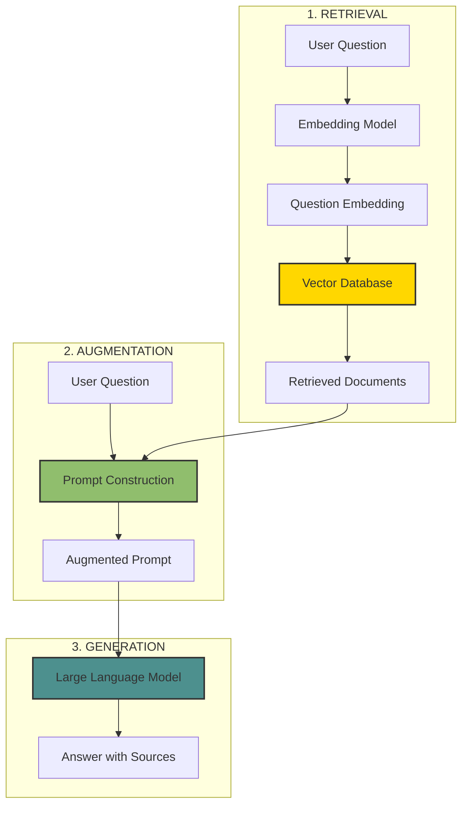

# The 2026 AI Metromap: RAG – Retrieval-Augmented Generation for Knowledge-Intensive Tasks

## Series E: Applied AI & Agents Line | Story 2 of 15+


## 📖 Introduction

**Welcome to the second stop on the Applied AI & Agents Line.**

In our last story, we mastered prompt engineering—the art of communicating with LLMs. You learned how to craft system prompts, use few-shot examples, and implement chain-of-thought reasoning. Your prompts are now precise, reliable, and production-ready.

But there's a fundamental limitation you've probably encountered: **LLMs have a fixed knowledge cutoff.** They don't know your private documents. They don't know your company's internal data. They don't know what happened yesterday. And even if they did, they can't fit an entire knowledge base into their context window.

Enter RAG—Retrieval-Augmented Generation.

RAG is the most important technique for building practical LLM applications today. Instead of relying solely on the model's parametric knowledge, RAG retrieves relevant information from an external knowledge base and injects it into the prompt. The result: an LLM that can answer questions about your private data, cite its sources, and stay current with the latest information.

This story—**The 2026 AI Metromap: RAG – Retrieval-Augmented Generation for Knowledge-Intensive Tasks**—is your complete guide to building RAG systems. We'll understand the RAG architecture—retrieval, augmentation, generation. We'll master vector databases—Chroma, Pinecone, Weaviate, Milvus. We'll dive into embedding models and semantic search. And we'll build a complete document Q&A system from scratch.

**Let's augment knowledge.**

---

## 📚 Where You Are in the Journey

### The Master Story Arc: The 2026 AI Metromap Series (Complete)

- 🗺️ **[The 2026 AI Metromap: Why the Old Learning Routes Are Obsolete](#)** – A paradigm shift from linear learning to transit-system mastery.
- 🧭 **[The 2026 AI Metromap: Reading the Map](#)** – Strategic navigation across the three core lines.
- 🎒 **[The 2026 AI Metromap: Avoiding Derailments](#)** – Diagnosing and preventing the most common learning pitfalls.
- 🏁 **[The 2026 AI Metromap: From Passenger to Driver](#)** – Building your portfolio using the Metromap structure.

### Series A: Foundations Station (Complete)
### Series B: Supervised Learning Line (Complete)
### Series C: Modern Architecture Line (Complete)
### Series D: Engineering & Optimization Yard (Complete)

### Series E: Applied AI & Agents Line (15+ Stories)

- 💬 **[The 2026 AI Metromap: Prompt Engineering 101 – The Art of Talking to AI](#)** – System prompts; few-shot prompting; chain-of-thought; tree of thoughts; self-consistency; prompt templates; building robust prompts for production.

- 📚 **The 2026 AI Metromap: RAG – Retrieval-Augmented Generation for Knowledge-Intensive Tasks** – Vector databases (Chroma, Pinecone, Weaviate, Milvus); embedding models; semantic search; hybrid search; reranking; building a document Q&A system. **⬅️ YOU ARE HERE**

- 🤖 **[The 2026 AI Metromap: AI Agents & Autonomous Workflows – The Self-Driving Trains](#)** – Agent architectures (ReAct, Plan-and-Execute, AutoGPT); tool use and function calling; multi-agent systems; memory management. 🔜 *Up Next*

- 🗣️ **[The 2026 AI Metromap: Voice Assistants & Speech Models – Making AI Talk](#)** – Speech-to-text (Whisper); text-to-speech (ElevenLabs, Coqui); voice activity detection; real-time transcription.

**Computer Vision**
- 👁️ **[The 2026 AI Metromap: Computer Vision Projects – From OCR to Face Recognition](#)** – Optical character recognition (Tesseract, TrOCR); face detection and recognition; object detection (YOLO, DETR); image segmentation.

- 🎨 **[The 2026 AI Metromap: Image Generation & Editing – Diffusion Models in Practice](#)** – Stable diffusion pipelines; ControlNet; inpainting; outpainting; image-to-image; fine-tuning diffusion models with DreamBooth.

**NLP & Specialized Tasks**
- 🔤 **[The 2026 AI Metromap: NLP Tasks – NER, Translation, Summarization, and Beyond](#)** – Named entity recognition; machine translation; text summarization (extractive and abstractive); sentiment analysis.

- 📈 **[The 2026 AI Metromap: Time Series Forecasting – ARIMA, LSTM, and Transformers](#)** – Classical methods (ARIMA, SARIMA); LSTM networks; Transformer for time series; forecasting stock prices, weather, and demand.

- 👍 **[The 2026 AI Metromap: Recommendation Systems – From Collaborative Filtering to Two-Tower Networks](#)** – Content-based filtering; collaborative filtering; matrix factorization; neural collaborative filtering; two-tower architectures.

**Industry Applications**
- 🏥 **[The 2026 AI Metromap: AI in Healthcare – Medical Research, Diagnostics, and Wellness](#)** – Medical imaging; EHR analysis; drug discovery; clinical decision support; regulatory considerations.

- 💰 **[The 2026 AI Metromap: AI in Finance – Banking, Insurance, and Trading](#)** – Fraud detection; algorithmic trading; credit scoring; risk management; explainable AI for compliance.

- 🎮 **[The 2026 AI Metromap: AI in Gaming, VR/AR, and Entertainment](#)** – Procedural content generation; NPC behavior with LLMs; AI-driven storytelling; game testing automation.

- 🏭 **[The 2026 AI Metromap: AI in Robotics, Manufacturing, and Supply Chain](#)** – Computer vision for quality control; predictive maintenance; autonomous navigation; warehouse optimization.

- 🌱 **[The 2026 AI Metromap: AI for Social Good – Climate Action, Agriculture, and Sustainability](#)** – Crop yield prediction; climate modeling; energy optimization; wildlife conservation; disaster response.

- 🎓 **[The 2026 AI Metromap: AI in Education – Personalized Learning and Training](#)** – Intelligent tutoring systems; automated grading; personalized content recommendation; adaptive learning paths.

### The Complete Story Catalog

For a complete view of all upcoming stories across every series, visit the **[Complete 2026 AI Metromap Story Catalog](#)**.

---

## 🏗️ The RAG Architecture: Retrieval + Augmentation + Generation

RAG combines three components into a powerful pipeline.



```python
def rag_architecture():
    """Explain the RAG architecture components"""
    
    print("="*60)
    print("RAG ARCHITECTURE")
    print("="*60)
    
    print("\n1. RETRIEVAL:")
    print("   • Convert user question to embedding")
    print("   • Search vector database for similar documents")
    print("   • Return top-k most relevant chunks")
    
    print("\n2. AUGMENTATION:")
    print("   • Combine retrieved documents with user question")
    print("   • Format as prompt with context")
    print("   • Add instructions for answer generation")
    
    print("\n3. GENERATION:")
    print("   • Pass augmented prompt to LLM")
    print("   • Generate answer using retrieved context")
    print("   • Optionally cite sources")
    
    print("\n" + "="*60)
    print("ADVANTAGES OVER STANDARD LLM")
    print("="*60)
    print("✓ Up-to-date information (no knowledge cutoff)")
    print("✓ Access to private/internal documents")
    print("✓ Source attribution and citations")
    print("✓ Lower hallucination rates")
    print("✓ No training required for new knowledge")
    print("✓ Easier to update knowledge base")

rag_architecture()
```

---

## 🔢 Embeddings: The Foundation of Retrieval

Embeddings are vector representations of text that capture semantic meaning.

```python
def embeddings_explained():
    """Understand how embeddings work for semantic search"""
    
    print("="*60)
    print("EMBEDDINGS FOR SEMANTIC SEARCH")
    print("="*60)
    
    # Simulated embeddings for demonstration
    import numpy as np
    
    # Create simple 2D embeddings for visualization
    texts = [
        "cat sitting on a mat",
        "dog playing in the park",
        "car driving on the highway",
        "cat sleeping on the couch",
        "dog barking at mailman"
    ]
    
    # Simulated embedding vectors (2D for visualization)
    embeddings = {
        "cat sitting on a mat": np.array([0.95, 0.31]),
        "cat sleeping on the couch": np.array([0.92, 0.38]),
        "dog playing in the park": np.array([0.31, 0.92]),
        "dog barking at mailman": np.array([0.28, 0.88]),
        "car driving on the highway": np.array([-0.85, 0.52])
    }
    
    # Query: "cat"
    query_embedding = np.array([0.93, 0.35])
    
    print("Semantic Space Visualization:")
    print("(Cat-related texts cluster together)")
    print("(Dog-related texts cluster together)")
    print("(Car-related texts are separate)\n")
    
    # Calculate similarities
    import matplotlib.pyplot as plt
    
    fig, ax = plt.subplots(figsize=(10, 8))
    
    # Plot all texts
    colors = {'cat': 'blue', 'dog': 'green', 'car': 'red'}
    for text, emb in embeddings.items():
        if 'cat' in text:
            color = 'blue'
            category = 'cat'
        elif 'dog' in text:
            color = 'green'
            category = 'dog'
        else:
            color = 'red'
            category = 'car'
        
        ax.scatter(emb[0], emb[1], s=200, c=color, alpha=0.6)
        ax.annotate(text, (emb[0] + 0.02, emb[1] + 0.02), fontsize=9)
    
    # Plot query
    ax.scatter(query_embedding[0], query_embedding[1], s=300, c='gold', 
               edgecolor='black', marker='*', label='Query: "cat"')
    
    ax.set_xlim(-1, 1.2)
    ax.set_ylim(0, 1.2)
    ax.set_xlabel('Dimension 1')
    ax.set_ylabel('Dimension 2')
    ax.set_title('Embedding Space: Similar Concepts Are Close')
    ax.legend()
    ax.grid(True, alpha=0.3)
    
    plt.tight_layout()
    plt.show()
    
    print("\n" + "="*60)
    print("POPULAR EMBEDDING MODELS")
    print("="*60)
    
    models = [
        ("OpenAI text-embedding-3-small", "1536", "Good balance", "$0.02/1M tokens"),
        ("OpenAI text-embedding-3-large", "3072", "Best quality", "$0.13/1M tokens"),
        ("Cohere embed-english-v3", "1024", "Good for search", "Free tier available"),
        ("BAAI/bge-large-en", "1024", "Open source", "Free, run locally"),
        ("sentence-transformers/all-mpnet-base-v2", "768", "Popular open source", "Free, run locally"),
        ("intfloat/e5-mistral-7b", "4096", "State-of-the-art", "Free, needs GPU")
    ]
    
    print(f"\n{'Model':<40} {'Dim':<6} {'Use Case':<15} {'Cost'}")
    print("-"*70)
    for name, dim, use, cost in models:
        print(f"{name:<40} {dim:<6} {use:<15} {cost}")

embeddings_explained()
```

---

## 🗄️ Vector Databases: Storing and Searching Embeddings

Vector databases are purpose-built for storing and searching embeddings at scale.

```python
def vector_databases():
    """Compare popular vector databases for RAG"""
    
    print("="*60)
    print("VECTOR DATABASES COMPARISON")
    print("="*60)
    
    databases = [
        {
            "name": "Chroma",
            "type": "Open source, embedded",
            "best_for": "Prototyping, local development",
            "features": "Simple API, lightweight, persistent",
            "scaling": "Local, up to millions of vectors"
        },
        {
            "name": "Pinecone",
            "type": "Managed cloud",
            "best_for": "Production, managed service",
            "features": "High availability, automatic scaling, metadata filtering",
            "scaling": "Cloud, billions of vectors"
        },
        {
            "name": "Weaviate",
            "type": "Open source + cloud",
            "best_for": "Hybrid search, production",
            "features": "Built-in modules, hybrid search, graphQL API",
            "scaling": "Self-hosted or cloud, billions"
        },
        {
            "name": "Milvus",
            "type": "Open source",
            "best_for": "Large scale, enterprise",
            "features": "GPU acceleration, multiple index types",
            "scaling": "Distributed, billion+ vectors"
        },
        {
            "name": "Qdrant",
            "type": "Open source + cloud",
            "best_for": "High performance, Rust-based",
            "features": "Filtering, payload storage, high throughput",
            "scaling": "Self-hosted or cloud, billions"
        },
        {
            "name": "FAISS",
            "type": "Library (not database)",
            "best_for": "Research, custom solutions",
            "features": "Fast similarity search, GPU support",
            "scaling": "Memory-based, limited by RAM"
        }
    ]
    
    print(f"\n{'Database':<12} {'Type':<18} {'Best For':<20} {'Key Feature':<30}")
    print("-"*85)
    for db in databases:
        print(f"{db['name']:<12} {db['type']:<18} {db['best_for']:<20} {db['features']:<30}")
    
    print("\n" + "="*60)
    print("SELECTION GUIDELINES")
    print("="*60)
    print("For prototyping: Chroma (easiest to start)")
    print("For production with minimal ops: Pinecone")
    print("For open source with hybrid search: Weaviate or Qdrant")
    print("For massive scale (100M+ vectors): Milvus")
    print("For custom research: FAISS")

vector_databases()
```

---

## 🔧 Building a RAG System with Chroma

Let's build a complete document Q&A system using Chroma and OpenAI.

```python
def build_rag_system():
    """Complete RAG implementation with Chroma"""
    
    print("="*60)
    print("BUILDING A RAG SYSTEM")
    print("="*60)
    
    # This is a conceptual implementation
    # Install: pip install chromadb openai tiktoken
    
    print("""
    # 1. INSTALL DEPENDENCIES
    pip install chromadb openai tiktoken
    
    # 2. IMPORT MODULES
    import chromadb
    from chromadb.utils import embedding_functions
    import openai
    import os
    
    # 3. INITIALIZE CHROMA
    client = chromadb.Client()
    collection = client.create_collection(
        name="my_documents",
        embedding_function=embedding_functions.OpenAIEmbeddingFunction(
            api_key=os.getenv("OPENAI_API_KEY"),
            model_name="text-embedding-3-small"
        )
    )
    
    # 4. ADD DOCUMENTS
    documents = [
        "RAG stands for Retrieval-Augmented Generation. It combines retrieval and generation.",
        "Vector databases store embeddings for semantic search. Chroma is a popular option.",
        "Embeddings convert text to vectors. Similar texts have similar vectors.",
        "The RAG pipeline: retrieve relevant documents, augment the prompt, generate answer."
    ]
    
    # Add documents with metadata
    for i, doc in enumerate(documents):
        collection.add(
            ids=[f"doc_{i}"],
            documents=[doc],
            metadatas=[{"source": "tutorial", "chunk": i}]
        )
    
    # 5. QUERY AND RETRIEVE
    query = "What is RAG?"
    results = collection.query(
        query_texts=[query],
        n_results=2
    )
    
    print("Retrieved documents:", results['documents'])
    
    # 6. GENERATE ANSWER
    context = "\\n\\n".join(results['documents'][0])
    
    prompt = f\"\"\"
    Answer the question based on the following context.
    
    Context:
    {context}
    
    Question: {query}
    
    Answer:
    \"\"\"
    
    response = openai.ChatCompletion.create(
        model="gpt-4",
        messages=[{"role": "user", "content": prompt}]
    )
    
    print("Answer:", response.choices[0].message.content)
    """)
    
    print("\n" + "="*60)
    print("RAG PIPELINE STEPS")
    print("="*60)
    
    steps = [
        ("1. Document Ingestion", "Load and chunk documents into manageable pieces"),
        ("2. Embedding Generation", "Convert chunks to vector embeddings"),
        ("3. Vector Storage", "Store embeddings with metadata in vector DB"),
        ("4. Query Embedding", "Convert user question to embedding"),
        ("5. Similarity Search", "Find most similar document chunks"),
        ("6. Prompt Augmentation", "Combine retrieved chunks with question"),
        ("7. Generation", "LLM generates answer using context")
    ]
    
    for step, desc in steps:
        print(f"{step}: {desc}")

build_rag_system()
```

---

## ✂️ Chunking Strategies: How to Split Documents

Chunking is critical for RAG performance. Too small = missing context. Too large = wasted tokens.

```python
def chunking_strategies():
    """Compare different document chunking strategies"""
    
    print("="*60)
    print("CHUNKING STRATEGIES")
    print("="*60)
    
    strategies = [
        {
            "name": "Fixed-size chunking",
            "method": "Split by token count (e.g., 512 tokens)",
            "pros": "Simple, predictable",
            "cons": "May cut sentences, loses structure",
            "best_for": "Simple documents, prototyping"
        },
        {
            "name": "Sentence-aware chunking",
            "method": "Split at sentence boundaries",
            "pros": "Preserves grammatical units",
            "cons": "Variable sizes, may break paragraphs",
            "best_for": "General text"
        },
        {
            "name": "Paragraph-based chunking",
            "method": "Split at paragraph breaks",
            "pros": "Preserves semantic units",
            "cons": "Large variations in size",
            "best_for": "Structured documents, articles"
        },
        {
            "name": "Semantic chunking",
            "method": "Use embeddings to find natural breaks",
            "pros": "Best semantic coherence",
            "cons": "Complex, computationally expensive",
            "best_for": "High-quality RAG systems"
        },
        {
            "name": "Recursive chunking",
            "method": "Try multiple strategies, fall back",
            "pros": "Robust to different document types",
            "cons": "More complex implementation",
            "best_for": "Mixed document sources"
        }
    ]
    
    print(f"\n{'Strategy':<20} {'Method':<25} {'Best For':<25}")
    print("-"*75)
    for s in strategies:
        print(f"{s['name']:<20} {s['method']:<25} {s['best_for']:<25}")
    
    print("\n" + "="*60)
    print("CHUNKING BEST PRACTICES")
    print("="*60)
    print("• Aim for 512-1024 tokens per chunk")
    print("• Overlap chunks by 10-20% (maintains context)")
    print("• Preserve document structure where possible")
    print("• Test different strategies with your documents")
    print("• Include metadata: source, page, section")

chunking_strategies()
```

---

## 🔍 Hybrid Search: Combining Semantic and Keyword Search

Hybrid search combines vector similarity with keyword matching for better results.

```python
def hybrid_search():
    """Explain hybrid search for improved retrieval"""
    
    print("="*60)
    print("HYBRID SEARCH")
    print("="*60)
    
    print("\nWhy hybrid search?")
    print("• Semantic search (vectors) finds related concepts")
    print("• Keyword search (BM25) finds exact matches")
    print("• Combining both gives best of both worlds")
    
    print("\nExample:")
    print("   Query: 'How to fix error code 404'")
    print("   Semantic: Finds documents about HTTP errors")
    print("   Keyword: Finds exact matches for '404'")
    print("   Hybrid: Both → best results")
    
    print("\n" + "="*60)
    print("IMPLEMENTATION APPROACHES")
    print("="*60)
    
    approaches = [
        ("Weighted Average", "score = α·semantic + (1-α)·keyword", "Simple, adjustable"),
        ("RRF (Reciprocal Rank Fusion)", "score = Σ 1/(k + rank)", "No parameter tuning"),
        ("Cross-Encoder Reranking", "Re-rank top-k with cross-encoder", "Highest accuracy, slower")
    ]
    
    print(f"\n{'Method':<15} {'Formula':<35} {'Trade-off':<25}")
    print("-"*75)
    for method, formula, tradeoff in approaches:
        print(f"{method:<15} {formula:<35} {tradeoff:<25}")
    
    print("\n" + "="*60)
    print("WEAVIATE HYBRID SEARCH EXAMPLE")
    print("="*60)
    print("""
    # Configure Weaviate for hybrid search
    collection = client.collections.get("Documents")
    
    # Query with hybrid search
    response = collection.query.hybrid(
        query="error code 404",
        alpha=0.5,  # Balance between vector and keyword (0=keyword only, 1=vector only)
        limit=10
    )
    
    for obj in response.objects:
        print(obj.properties["text"])
        print(f"Score: {obj.metadata.score}")
    """)

hybrid_search()
```

---

## 🎯 Reranking: Improving Retrieval Quality

Reranking reorders retrieved documents to put the most relevant ones first.

```python
def reranking():
    """Explain reranking for better retrieval"""
    
    print("="*60)
    print("RERANKING")
    print("="*60)
    
    print("\nWhy rerank?")
    print("• Initial retrieval (embedding) is fast but coarse")
    print("• Reranking uses more accurate (but slower) models")
    print("• Small top-k → rerank → final answer")
    
    print("\n" + "="*60)
    print("RERANKING WORKFLOW")
    print("="*60)
    print("""
    1. Initial retrieval: Get 50 candidates (fast embedding search)
    2. Reranking: Score candidates with cross-encoder (accurate)
    3. Final selection: Take top 5 reranked results
    4. Generation: Use top 5 for context
    """)
    
    print("\n" + "="*60)
    print("RERANKING MODELS")
    print("="*60)
    
    models = [
        ("cross-encoder/ms-marco-MiniLM-L-6-v2", "Fast, good for English", "Open source"),
        ("BAAI/bge-reranker-large", "High accuracy, multilingual", "Open source"),
        ("Cohere rerank", "State-of-the-art, API", "Commercial"),
        ("Voyage rerank", "High accuracy, optimized", "Commercial")
    ]
    
    print(f"\n{'Model':<40} {'Use Case':<25} {'Type'}")
    print("-"*75)
    for name, use, type_ in models:
        print(f"{name:<40} {use:<25} {type_}")
    
    print("\n" + "="*60)
    print("RERANKING IMPLEMENTATION")
    print("="*60)
    print("""
    from sentence_transformers import CrossEncoder
    
    # Load reranker
    reranker = CrossEncoder('cross-encoder/ms-marco-MiniLM-L-6-v2')
    
    # Initial retrieval (fast)
    candidates = vector_db.search(query, k=50)
    
    # Prepare pairs for reranking
    pairs = [(query, doc.text) for doc in candidates]
    
    # Get scores
    scores = reranker.predict(pairs)
    
    # Sort by score
    reranked = sorted(zip(candidates, scores), key=lambda x: x[1], reverse=True)
    
    # Take top 5
    top_docs = reranked[:5]
    """)

reranking()
```

---

## 🏗️ Advanced RAG Techniques

Beyond basic RAG, there are advanced techniques for better performance.

```python
def advanced_rag():
    """Explore advanced RAG techniques"""
    
    print("="*60)
    print("ADVANCED RAG TECHNIQUES")
    print("="*60)
    
    techniques = [
        {
            "name": "Self-RAG",
            "description": "Model decides when to retrieve and when to generate",
            "benefits": "Reduces unnecessary retrievals, better efficiency",
            "implementation": "Fine-tune model with special tokens for retrieval decisions"
        },
        {
            "name": "Corrective RAG",
            "description": "Validates retrieved documents and corrects if needed",
            "benefits": "Handles low-quality retrieval, more robust",
            "implementation": "Add verification step before generation"
        },
        {
            "name": "Adaptive RAG",
            "description": "Dynamically chooses retrieval strategy based on query",
            "benefits": "Optimizes for different query types",
            "implementation": "Route queries to different strategies"
        },
        {
            "name": "Multi-Hop RAG",
            "description": "Retrieves iteratively to answer complex questions",
            "benefits": "Handles questions requiring multiple pieces of evidence",
            "implementation": "Generate sub-queries, retrieve, combine"
        },
        {
            "name": "HyDE (Hypothetical Document Embeddings)",
            "description": "Generate hypothetical answer, then retrieve",
            "benefits": "Better for complex, open-ended questions",
            "implementation": "LLM generates answer, embed that for retrieval"
        }
    ]
    
    for t in techniques:
        print(f"\n{t['name']}:")
        print(f"  {t['description']}")
        print(f"  ✓ {t['benefits']}")
        print(f"  → {t['implementation']}")

advanced_rag()
```

---

## 📊 Complete RAG Pipeline Implementation

```python
def complete_rag_pipeline():
    """Full implementation of a production RAG system"""
    
    print("="*60)
    print("COMPLETE RAG PIPELINE")
    print("="*60)
    
    print("""
    class RAGSystem:
        def __init__(self):
            self.vector_db = self._init_vector_db()
            self.embedding_model = self._init_embeddings()
            self.llm = self._init_llm()
            self.reranker = self._init_reranker()
        
        def ingest_documents(self, documents):
            \"\"\"Process and store documents\"\"\"
            chunks = self._chunk_documents(documents)
            embeddings = self.embedding_model.encode(chunks)
            self.vector_db.add(chunks, embeddings, metadata)
        
        def query(self, question, top_k=10, rerank=True):
            \"\"\"Answer question using RAG\"\"\"
            # 1. Embed question
            q_embedding = self.embedding_model.encode([question])
            
            # 2. Retrieve candidates
            candidates = self.vector_db.search(q_embedding, k=top_k)
            
            # 3. Rerank (optional)
            if rerank:
                candidates = self._rerank(question, candidates)
            
            # 4. Build prompt
            context = self._format_context(candidates)
            prompt = self._build_prompt(question, context)
            
            # 5. Generate answer
            answer = self.llm.generate(prompt)
            
            # 6. Add citations
            answer_with_citations = self._add_citations(answer, candidates)
            
            return {
                "answer": answer_with_citations,
                "sources": [c.metadata for c in candidates[:3]],
                "confidence": self._calculate_confidence(candidates)
            }
        
        def _chunk_documents(self, documents):
            # Semantic or fixed-size chunking
            pass
        
        def _rerank(self, question, candidates):
            # Cross-encoder reranking
            pass
        
        def _format_context(self, candidates):
            # Format for prompt
            pass
        
        def _build_prompt(self, question, context):
            # Create augmented prompt
            return f\"\"\"
            Answer based on context. Cite sources.
            
            Context:
            {context}
            
            Question: {question}
            
            Answer with sources:
            \"\"\"
        
        def _add_citations(self, answer, candidates):
            # Add source citations to answer
            pass
        
        def _calculate_confidence(self, candidates):
            # Score based on retrieval relevance
            pass
    """)
    
    print("\n" + "="*60)
    print("EVALUATION METRICS")
    print("="*60)
    metrics = [
        ("Hit Rate", "Relevant document in top-k", "Higher is better"),
        ("MRR (Mean Reciprocal Rank)", "Position of first relevant", "Higher is better"),
        ("NDCG", "Ranking quality", "Higher is better"),
        ("Answer Correctness", "LLM judges answer", "Human evaluation"),
        ("Latency", "End-to-end time", "Lower is better"),
        ("Cost", "API calls + compute", "Lower is better")
    ]
    
    print(f"\n{'Metric':<15} {'Description':<35} {'Goal'}")
    print("-"*65)
    for metric, desc, goal in metrics:
        print(f"{metric:<15} {desc:<35} {goal}")

complete_rag_pipeline()
```

---

## 📊 Takeaway from This Story

**What You Learned:**

- **RAG Architecture** – Retrieval (find relevant documents) → Augmentation (add to prompt) → Generation (LLM answers). Overcomes knowledge cutoff and enables private data access.

- **Embeddings** – Vector representations of text. Semantic meaning captured in vector space. Similar concepts have similar vectors.

- **Vector Databases** – Chroma (prototyping), Pinecone (managed), Weaviate (hybrid search), Milvus (scale). Choose based on needs.

- **Chunking Strategies** – Fixed-size, sentence-aware, paragraph-based, semantic. Overlap 10-20% for context.

- **Hybrid Search** – Combine vector (semantic) + keyword (BM25) for best results. Weighted average or RRF fusion.

- **Reranking** – Cross-encoder models reorder candidates. 2-10x better retrieval quality.

- **Advanced RAG** – Self-RAG, Corrective RAG, Adaptive RAG, Multi-Hop, HyDE for complex scenarios.

---

## 🔗 Navigation

- **⬅️ Previous Story:** [The 2026 AI Metromap: Prompt Engineering 101 – The Art of Talking to AI](#)

- **📚 Series E Catalog:** [Series E: Applied AI & Agents Line](#) – View all 15+ stories in this series.

- **📚 Complete Story Catalog:** [Complete 2026 AI Metromap Story Catalog](#) – Your navigation guide to all 39+ stories.

- **➡️ Next Story:** **[The 2026 AI Metromap: AI Agents & Autonomous Workflows – The Self-Driving Trains](#)** – Agent architectures (ReAct, Plan-and-Execute, AutoGPT); tool use and function calling; multi-agent systems; memory management.

---

## 📝 Your Invitation

Before the next story arrives, build a RAG system:

1. **Set up Chroma** – Install ChromaDB. Create a collection. Add sample documents.

2. **Implement chunking** – Try different chunk sizes. Measure retrieval quality.

3. **Build a query pipeline** – Embed queries, search, generate answers.

4. **Add hybrid search** – Combine vector and keyword search. Compare results.

5. **Experiment with reranking** – Use a cross-encoder to improve results.

**You've mastered RAG. Next stop: AI Agents!**

---

*Found this helpful? Clap, comment, and share your RAG system. Next stop: AI Agents!* 🚇