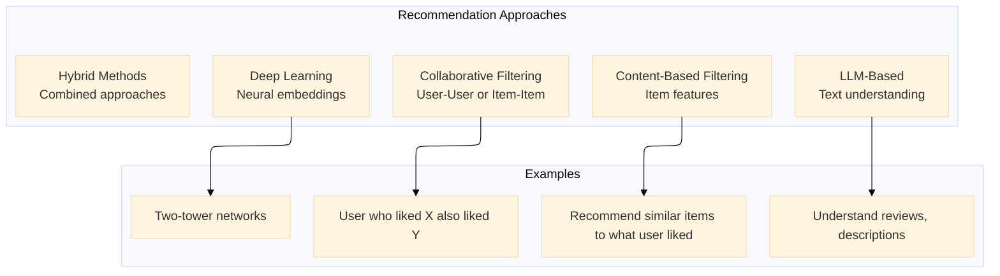
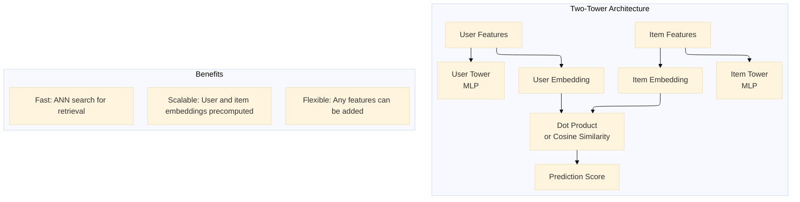

# The 2026 AI Metromap: Recommendation Systems – From Collaborative Filtering to Two-Tower Networks

## Series E: Applied AI & Agents Line | Story 9 of 15+


## 📖 Introduction

**Welcome to the ninth stop on the Applied AI & Agents Line.**

In our last eight stories, we mastered prompt engineering, RAG, AI agents, voice assistants, computer vision, image generation, NLP tasks, and time series forecasting. Your systems can now understand text, generate images, see the world, converse, and predict the future.

But there's one more essential application that powers much of the internet: **recommendation systems**.

Every time Netflix suggests a movie, Amazon recommends a product, Spotify creates a playlist, or TikTok serves a video, a recommendation system is working behind the scenes. These systems are responsible for billions of dollars in revenue and countless hours of user engagement. They're the engines of personalization.

Recommendation systems have evolved dramatically. Early systems used simple collaborative filtering—"users who liked this also liked that." Today, deep learning powers two-tower networks that learn complex user and item representations. And with the rise of LLMs, we can now build recommendation systems that understand natural language descriptions, user reviews, and contextual signals.

This story—**The 2026 AI Metromap: Recommendation Systems – From Collaborative Filtering to Two-Tower Networks**—is your guide to building personalized recommendation engines. We'll master collaborative filtering with matrix factorization. We'll implement content-based filtering using item features. We'll build neural collaborative filtering with embeddings. And we'll construct two-tower networks—the modern industry standard for large-scale recommendation.

**Let's personalize the experience.**

---

## 📚 Where You Are in the Journey

### The Master Story Arc: The 2026 AI Metromap Series (Complete)

- 🗺️ **[The 2026 AI Metromap: Why the Old Learning Routes Are Obsolete](#)** – A paradigm shift from linear learning to transit-system mastery.
- 🧭 **[The 2026 AI Metromap: Reading the Map](#)** – Strategic navigation across the three core lines.
- 🎒 **[The 2026 AI Metromap: Avoiding Derailments](#)** – Diagnosing and preventing the most common learning pitfalls.
- 🏁 **[The 2026 AI Metromap: From Passenger to Driver](#)** – Building your portfolio using the Metromap structure.

### Series A: Foundations Station (Complete)
### Series B: Supervised Learning Line (Complete)
### Series C: Modern Architecture Line (Complete)
### Series D: Engineering & Optimization Yard (Complete)

### Series E: Applied AI & Agents Line (15+ Stories)

- 💬 **[The 2026 AI Metromap: Prompt Engineering 101 – The Art of Talking to AI](#)**
- 📚 **[The 2026 AI Metromap: RAG – Retrieval-Augmented Generation for Knowledge-Intensive Tasks](#)**
- 🤖 **[The 2026 AI Metromap: AI Agents & Autonomous Workflows – The Self-Driving Trains](#)**
- 🗣️ **[The 2026 AI Metromap: Voice Assistants & Speech Models – Making AI Talk](#)**
- 👁️ **[The 2026 AI Metromap: Computer Vision Projects – From OCR to Face Recognition](#)**
- 🎨 **[The 2026 AI Metromap: Image Generation & Editing – Diffusion Models in Practice](#)**
- 🔤 **[The 2026 AI Metromap: NLP Tasks – NER, Translation, Summarization, and Beyond](#)**
- 📈 **[The 2026 AI Metromap: Time Series Forecasting – ARIMA, LSTM, and Transformers](#)**
- 👍 **The 2026 AI Metromap: Recommendation Systems – From Collaborative Filtering to Two-Tower Networks** – Content-based filtering; collaborative filtering; matrix factorization; neural collaborative filtering; two-tower architectures. **⬅️ YOU ARE HERE**

**Industry Applications**
- 🏥 **[The 2026 AI Metromap: AI in Healthcare – Medical Research, Diagnostics, and Wellness](#)** 🔜 *Up Next*
- 💰 **[The 2026 AI Metromap: AI in Finance – Banking, Insurance, and Trading](#)**
- 🎮 **[The 2026 AI Metromap: AI in Gaming, VR/AR, and Entertainment](#)**
- 🏭 **[The 2026 AI Metromap: AI in Robotics, Manufacturing, and Supply Chain](#)**
- 🌱 **[The 2026 AI Metromap: AI for Social Good – Climate Action, Agriculture, and Sustainability](#)**
- 🎓 **[The 2026 AI Metromap: AI in Education – Personalized Learning and Training](#)**

### The Complete Story Catalog

For a complete view of all upcoming stories across every series, visit the **[Complete 2026 AI Metromap Story Catalog](#)**.

---

## 🎯 Recommendation System Types

Recommendation systems fall into several categories.



```python
def recommendation_types():
    """Overview of recommendation system types"""
    
    print("="*60)
    print("RECOMMENDATION SYSTEM TYPES")
    print("="*60)
    
    print("\n1. COLLABORATIVE FILTERING:")
    print("   • User-User: Find similar users, recommend what they liked")
    print("   • Item-Item: Find similar items to what user liked")
    print("   • Matrix Factorization: Learn latent factors for users and items")
    print("   • Pros: Works without item features")
    print("   • Cons: Cold start problem for new users/items")
    
    print("\n2. CONTENT-BASED FILTERING:")
    print("   • Use item features (genre, category, description)")
    print("   • Build user profile from liked items")
    print("   • Recommend similar items to profile")
    print("   • Pros: No cold start for new items")
    print("   • Cons: Limited to item features, no serendipity")
    
    print("\n3. DEEP LEARNING:")
    print("   • Neural Collaborative Filtering")
    print("   • Two-Tower Networks (user tower + item tower)")
    print("   • Learn non-linear interactions")
    print("   • Pros: Handles complex patterns, scalable")
    print("   • Cons: Requires more data, compute")
    
    print("\n4. LLM-BASED:")
    print("   • Use text embeddings from reviews, descriptions")
    print("   • Zero-shot recommendations")
    print("   • Conversational recommendations")
    print("   • Pros: Understands semantics, handles cold start")
    print("   • Cons: Slower, more expensive")

recommendation_types()
```

---

## 👥 Collaborative Filtering: Matrix Factorization

Collaborative filtering learns latent factors that represent user preferences and item characteristics.

```python
def collaborative_filtering():
    """Implement collaborative filtering with matrix factorization"""
    
    print("="*60)
    print("COLLABORATIVE FILTERING")
    print("="*60)
    
    print("""
    import numpy as np
    import pandas as pd
    from sklearn.decomposition import TruncatedSVD
    from sklearn.metrics.pairwise import cosine_similarity
    from surprise import SVD, Dataset, Reader
    from surprise.model_selection import train_test_split
    
    # User-Item interaction matrix (ratings)
    # Rows: users, Columns: items, Values: ratings
    ratings = np.array([
        [5, 4, 0, 0, 1],
        [4, 5, 0, 0, 2],
        [0, 0, 5, 4, 0],
        [0, 0, 4, 5, 0],
        [2, 3, 0, 0, 4]
    ])
    
    # 1. SVD for matrix factorization
    svd = TruncatedSVD(n_components=2, random_state=42)
    user_factors = svd.fit_transform(ratings)
    item_factors = svd.components_.T
    
    print(f"User factors shape: {user_factors.shape}")
    print(f"Item factors shape: {item_factors.shape}")
    
    # Reconstruct predictions
    predicted_ratings = user_factors @ item_factors.T
    print("Predicted ratings:\\n", predicted_ratings.round(1))
    
    # 2. Using Surprise library
    # Load MovieLens dataset
    data = Dataset.load_builtin('ml-100k')
    trainset, testset = train_test_split(data, test_size=0.2)
    
    # SVD model (matrix factorization)
    model = SVD(n_factors=100, n_epochs=20, lr_all=0.005, reg_all=0.02)
    model.fit(trainset)
    
    # Predict for a user-item pair
    prediction = model.predict(uid=196, iid=302, r_ui=4)
    print(f"Predicted rating: {prediction.est:.2f}")
    
    # Get top-N recommendations for a user
    def get_top_n_recommendations(user_id, model, trainset, n=10):
        \"\"\"Get top-N recommendations for a user\"\"\"
        # Get all items not rated by user
        all_items = set(range(trainset.n_items))
        rated_items = set([item for (item, _) in trainset.ur[trainset.to_inner_uid(user_id)]])
        unseen_items = all_items - rated_items
        
        # Predict ratings for unseen items
        predictions = []
        for item in unseen_items:
            pred = model.predict(user_id, trainset.to_raw_iid(item))
            predictions.append((trainset.to_raw_iid(item), pred.est))
        
        # Sort by predicted rating
        predictions.sort(key=lambda x: x[1], reverse=True)
        return predictions[:n]
    
    recommendations = get_top_n_recommendations(196, model, trainset, n=5)
    for item_id, score in recommendations:
        print(f"Item {item_id}: predicted rating {score:.2f}")
    
    # 3. Item-based collaborative filtering
    # Find similar items based on user ratings
    item_similarity = cosine_similarity(ratings.T)
    
    # For item 0, find most similar items
    similar_items = item_similarity[0].argsort()[::-1][1:6]
    print(f"Items similar to item 0: {similar_items}")
    """)
    
    print("\n" + "="*60)
    print("MATRIX FACTORIZATION PARAMETERS")
    print("="*60)
    
    params = [
        ("n_factors", "Latent dimensions", "50-200", "More = more capacity"),
        ("n_epochs", "Training iterations", "20-50", "More = better convergence"),
        ("lr_all", "Learning rate", "0.001-0.01", "Lower = stable"),
        ("reg_all", "Regularization", "0.01-0.1", "Higher = less overfitting")
    ]
    
    print(f"\n{'Parameter':<15} {'Description':<20} {'Range':<12} {'Effect':<20}")
    print("-"*70)
    for param, desc, range_, effect in params:
        print(f"{param:<15} {desc:<20} {range_:<12} {effect:<20}")

collaborative_filtering()
```

---

## 📦 Content-Based Filtering: Using Item Features

Content-based filtering recommends items similar to what a user has liked in the past.

```python
def content_based_filtering():
    """Implement content-based filtering with item features"""
    
    print("="*60)
    print("CONTENT-BASED FILTERING")
    print("="*60)
    
    print("""
    import numpy as np
    import pandas as pd
    from sklearn.feature_extraction.text import TfidfVectorizer
    from sklearn.metrics.pairwise import cosine_similarity
    
    # Sample movie data
    movies = pd.DataFrame({
        'movie_id': [1, 2, 3, 4, 5],
        'title': ['The Matrix', 'Inception', 'The Notebook', 'Titanic', 'Interstellar'],
        'genres': ['Action Sci-Fi', 'Action Sci-Fi Thriller', 'Romance Drama', 'Romance Drama', 'Sci-Fi Drama'],
        'description': [
            'A computer hacker learns about reality',
            'A thief enters dreams to steal secrets',
            'A love story spanning decades',
            'A romance on a sinking ship',
            'Explorers travel through a wormhole'
        ]
    })
    
    # Create TF-IDF features from genres and descriptions
    movies['combined_features'] = movies['genres'] + ' ' + movies['description']
    
    tfidf = TfidfVectorizer(stop_words='english')
    tfidf_matrix = tfidf.fit_transform(movies['combined_features'])
    
    # Compute item similarity
    item_similarity = cosine_similarity(tfidf_matrix)
    
    # Recommend similar movies
    def get_similar_movies(movie_id, n=3):
        idx = movies[movies['movie_id'] == movie_id].index[0]
        scores = list(enumerate(item_similarity[idx]))
        scores = sorted(scores, key=lambda x: x[1], reverse=True)
        
        similar_indices = [i for i, _ in scores[1:n+1]]
        return movies.iloc[similar_indices][['movie_id', 'title', 'genres']]
    
    print("Movies similar to 'The Matrix':")
    print(get_similar_movies(1))
    
    # Build user profile from liked items
    liked_movies = [1, 2]  # User liked Matrix and Inception
    liked_indices = [movies[movies['movie_id'] == mid].index[0] for mid in liked_movies]
    
    # Average TF-IDF vectors of liked movies
    user_profile = np.mean(tfidf_matrix[liked_indices].toarray(), axis=0)
    
    # Compute similarity to all movies
    similarities = cosine_similarity([user_profile], tfidf_matrix)[0]
    
    # Recommend top movies not already liked
    recommendations = []
    for i, score in enumerate(similarities):
        if movies.iloc[i]['movie_id'] not in liked_movies:
            recommendations.append((movies.iloc[i]['movie_id'], movies.iloc[i]['title'], score))
    
    recommendations.sort(key=lambda x: x[2], reverse=True)
    print("\\nRecommendations based on user profile:")
    for movie_id, title, score in recommendations[:3]:
        print(f"  {title} (similarity: {score:.3f})")
    """)
    
    print("\n" + "="*60)
    print("FEATURE ENGINEERING FOR CONTENT-BASED")
    print("="*60)
    
    features = [
        ("Categorical", "Genre, category, tags", "One-hot encoding, embeddings"),
        ("Textual", "Title, description, reviews", "TF-IDF, word embeddings, BERT"),
        ("Numerical", "Price, rating, year", "Normalization, binning"),
        ("Image", "Poster, product image", "CNN features, CLIP embeddings"),
        ("Audio", "Music features", "Spectrograms, embeddings")
    ]
    
    print(f"\n{'Feature Type':<15} {'Examples':<25} {'Encoding':<30}")
    print("-"*75)
    for ftype, examples, encoding in features:
        print(f"{ftype:<15} {examples:<25} {encoding:<30}")

content_based_filtering()
```

---

## 🧠 Neural Collaborative Filtering (NCF)

Neural Collaborative Filtering uses neural networks to learn non-linear user-item interactions.

```python
def neural_collaborative_filtering():
    """Implement neural collaborative filtering"""
    
    print("="*60)
    print("NEURAL COLLABORATIVE FILTERING")
    print("="*60)
    
    print("""
    import torch
    import torch.nn as nn
    import torch.optim as optim
    import numpy as np
    from sklearn.model_selection import train_test_split
    
    class NeuralCollaborativeFiltering(nn.Module):
        \"\"\"Neural Collaborative Filtering with GMF and MLP\"\"\"
        
        def __init__(self, num_users, num_items, embedding_dim=32, hidden_layers=[64, 32]):
            super().__init__()
            
            # User and item embeddings
            self.user_embedding = nn.Embedding(num_users, embedding_dim)
            self.item_embedding = nn.Embedding(num_items, embedding_dim)
            
            # GMF (Generalized Matrix Factorization) - element-wise product
            self.gmf_output = nn.Linear(embedding_dim, 1)
            
            # MLP (Multi-Layer Perceptron) - concatenation + dense layers
            self.mlp_layers = nn.ModuleList()
            input_dim = embedding_dim * 2
            
            for hidden_dim in hidden_layers:
                self.mlp_layers.append(nn.Linear(input_dim, hidden_dim))
                self.mlp_layers.append(nn.ReLU())
                self.mlp_layers.append(nn.Dropout(0.2))
                input_dim = hidden_dim
            
            self.mlp_output = nn.Linear(input_dim, 1)
            
            # Final output
            self.final = nn.Linear(2, 1)
            self.sigmoid = nn.Sigmoid()
        
        def forward(self, user_ids, item_ids):
            # Get embeddings
            user_emb = self.user_embedding(user_ids)
            item_emb = self.item_embedding(item_ids)
            
            # GMF path (element-wise product)
            gmf = user_emb * item_emb
            gmf_out = self.gmf_output(gmf)
            
            # MLP path (concatenation)
            mlp_input = torch.cat([user_emb, item_emb], dim=1)
            mlp = mlp_input
            for layer in self.mlp_layers:
                mlp = layer(mlp)
            mlp_out = self.mlp_output(mlp)
            
            # Combine
            combined = torch.cat([gmf_out, mlp_out], dim=1)
            output = self.final(combined)
            return self.sigmoid(output).squeeze()
    
    # Generate synthetic user-item interaction data
    np.random.seed(42)
    num_users = 1000
    num_items = 500
    num_interactions = 10000
    
    # Create random interactions
    users = np.random.randint(0, num_users, num_interactions)
    items = np.random.randint(0, num_items, num_interactions)
    ratings = np.random.randint(1, 6, num_interactions)  # 1-5 ratings
    
    # Train/val/test split
    train_data, test_data = train_test_split(
        list(zip(users, items, ratings)), test_size=0.2, random_state=42
    )
    
    # Convert to tensors
    def prepare_data(data):
        u = torch.tensor([d[0] for d in data], dtype=torch.long)
        i = torch.tensor([d[1] for d in data], dtype=torch.long)
        r = torch.tensor([d[2] for d in data], dtype=torch.float32) / 5.0  # Normalize to [0,1]
        return u, i, r
    
    train_u, train_i, train_r = prepare_data(train_data)
    test_u, test_i, test_r = prepare_data(test_data)
    
    # Initialize model
    model = NeuralCollaborativeFiltering(num_users, num_items, embedding_dim=32)
    optimizer = optim.Adam(model.parameters(), lr=0.001)
    criterion = nn.MSELoss()
    
    # Train
    epochs = 20
    batch_size = 256
    
    for epoch in range(epochs):
        model.train()
        total_loss = 0
        
        for i in range(0, len(train_u), batch_size):
            u_batch = train_u[i:i+batch_size]
            i_batch = train_i[i:i+batch_size]
            r_batch = train_r[i:i+batch_size]
            
            optimizer.zero_grad()
            predictions = model(u_batch, i_batch)
            loss = criterion(predictions, r_batch)
            loss.backward()
            optimizer.step()
            
            total_loss += loss.item()
        
        # Evaluation
        model.eval()
        with torch.no_grad():
            test_preds = model(test_u, test_i)
            test_loss = criterion(test_preds, test_r)
        
        print(f"Epoch {epoch+1}: Train Loss = {total_loss/len(train_u):.4f}, Test Loss = {test_loss:.4f}")
    
    # Get recommendations for a user
    def recommend_for_user(user_id, model, all_items, known_items, top_k=10):
        model.eval()
        user_tensor = torch.tensor([user_id] * len(all_items), dtype=torch.long)
        item_tensor = torch.tensor(all_items, dtype=torch.long)
        
        with torch.no_grad():
            scores = model(user_tensor, item_tensor).numpy()
        
        # Filter out already interacted items
        for item in known_items:
            if item in all_items:
                scores[all_items.index(item)] = -1
        
        # Get top-k items
        top_indices = np.argsort(scores)[::-1][:top_k]
        return [all_items[i] for i in top_indices]
    
    # Example: recommend for user 0
    all_items = list(range(num_items))
    known_items = [items[i] for i in range(num_interactions) if users[i] == 0]
    recommendations = recommend_for_user(0, model, all_items, known_items, top_k=10)
    print(f"Recommendations for user 0: {recommendations[:5]}")
    """)
    
    print("\n" + "="*60)
    print("NCF ARCHITECTURE COMPONENTS")
    print("="*60)
    
    components = [
        ("GMF", "Element-wise product", "Captures linear interactions"),
        ("MLP", "Concatenation + dense layers", "Captures non-linear interactions"),
        ("Embedding Size", "32-256", "More = more capacity"),
        ("Hidden Layers", "[64, 32, 16]", "Deeper = more complex patterns"),
        ("Output", "Sigmoid", "Predicts probability of interaction")
    ]
    
    print(f"\n{'Component':<12} {'Operation':<20} {'Purpose':<30}")
    print("-"*65)
    for comp, op, purpose in components:
        print(f"{comp:<12} {op:<20} {purpose:<30}")

neural_collaborative_filtering()
```

---

## 🏗️ Two-Tower Networks: The Industry Standard

Two-tower networks are the modern architecture for large-scale recommendation systems.



```python
def two_tower_network():
    """Implement two-tower network for recommendation"""
    
    print("="*60)
    print("TWO-TOWER NETWORK")
    print("="*60)
    
    print("""
    import torch
    import torch.nn as nn
    import torch.optim as optim
    import numpy as np
    from sklearn.preprocessing import LabelEncoder
    
    class TwoTowerRecommender(nn.Module):
        \"\"\"Two-tower network for recommendation\"\"\"
        
        def __init__(self, num_users, num_items, user_features_dim, item_features_dim,
                     embedding_dim=64, hidden_layers=[128, 64]):
            super().__init__()
            
            # User tower
            user_layers = []
            input_dim = user_features_dim
            
            for hidden_dim in hidden_layers:
                user_layers.append(nn.Linear(input_dim, hidden_dim))
                user_layers.append(nn.ReLU())
                user_layers.append(nn.Dropout(0.2))
                input_dim = hidden_dim
            
            user_layers.append(nn.Linear(input_dim, embedding_dim))
            self.user_tower = nn.Sequential(*user_layers)
            
            # Item tower
            item_layers = []
            input_dim = item_features_dim
            
            for hidden_dim in hidden_layers:
                item_layers.append(nn.Linear(input_dim, hidden_dim))
                item_layers.append(nn.ReLU())
                item_layers.append(nn.Dropout(0.2))
                input_dim = hidden_dim
            
            item_layers.append(nn.Linear(input_dim, embedding_dim))
            self.item_tower = nn.Sequential(*item_layers)
        
        def forward(self, user_features, item_features):
            user_emb = self.user_tower(user_features)
            item_emb = self.item_tower(item_features)
            
            # Cosine similarity
            user_emb = nn.functional.normalize(user_emb, dim=1)
            item_emb = nn.functional.normalize(item_emb, dim=1)
            
            return (user_emb * item_emb).sum(dim=1)  # Dot product
        
        def get_user_embedding(self, user_features):
            return nn.functional.normalize(self.user_tower(user_features), dim=1)
        
        def get_item_embedding(self, item_features):
            return nn.functional.normalize(self.item_tower(item_features), dim=1)
    
    # Generate synthetic data
    np.random.seed(42)
    num_samples = 10000
    num_users = 1000
    num_items = 500
    
    # Create features
    user_age = np.random.randint(18, 70, num_samples)
    user_gender = np.random.randint(0, 2, num_samples)
    user_location = np.random.randint(0, 50, num_samples)
    
    item_category = np.random.randint(0, 20, num_samples)
    item_price = np.random.uniform(10, 200, num_samples)
    item_popularity = np.random.uniform(0, 1, num_samples)
    
    # Combine features
    user_features = np.stack([user_age, user_gender, user_location], axis=1).astype(np.float32)
    item_features = np.stack([item_category, item_price, item_popularity], axis=1).astype(np.float32)
    
    # Normalize numerical features
    user_features[:, 0] = (user_features[:, 0] - user_features[:, 0].mean()) / user_features[:, 0].std()
    item_features[:, 1] = (item_features[:, 1] - item_features[:, 1].mean()) / item_features[:, 1].std()
    
    # Generate labels (interaction)
    # Simulate: users with similar features to items get positive interactions
    labels = []
    for i in range(num_samples):
        # Simple heuristic: similar age category, similar location
        score = (np.abs(user_age[i] - item_category[i] * 3) < 20) * 1.0
        score += (user_location[i] == item_category[i] % 50) * 1.0
        labels.append(min(1.0, score / 3 + np.random.randn() * 0.2))
    
    labels = np.array(labels)
    labels = (labels > 0.5).astype(np.float32)
    
    # Train/val split
    split = int(0.8 * num_samples)
    train_u = torch.tensor(user_features[:split])
    train_i = torch.tensor(item_features[:split])
    train_y = torch.tensor(labels[:split])
    
    val_u = torch.tensor(user_features[split:])
    val_i = torch.tensor(item_features[split:])
    val_y = torch.tensor(labels[split:])
    
    # Initialize model
    model = TwoTowerRecommender(
        num_users, num_items,
        user_features_dim=3,
        item_features_dim=3,
        embedding_dim=32
    )
    
    optimizer = optim.Adam(model.parameters(), lr=0.001)
    criterion = nn.BCEWithLogitsLoss()
    
    # Train
    epochs = 20
    batch_size = 256
    
    for epoch in range(epochs):
        model.train()
        total_loss = 0
        
        for i in range(0, len(train_u), batch_size):
            u_batch = train_u[i:i+batch_size]
            i_batch = train_i[i:i+batch_size]
            y_batch = train_y[i:i+batch_size]
            
            optimizer.zero_grad()
            predictions = model(u_batch, i_batch)
            loss = criterion(predictions, y_batch)
            loss.backward()
            optimizer.step()
            
            total_loss += loss.item()
        
        # Validation
        model.eval()
        with torch.no_grad():
            val_preds = model(val_u, val_i)
            val_loss = criterion(val_preds, val_y)
            val_acc = ((torch.sigmoid(val_preds) > 0.5).float() == val_y).float().mean()
        
        print(f"Epoch {epoch+1}: Train Loss = {total_loss/len(train_u):.4f}, "
              f"Val Loss = {val_loss:.4f}, Val Acc = {val_acc:.4f}")
    
    # For retrieval: precompute item embeddings and use ANN
    # Create item embeddings for all items
    all_items = torch.tensor(item_features[:num_items])  # Simplified
    model.eval()
    with torch.no_grad():
        item_embeddings = model.get_item_embedding(all_items).numpy()
    
    # For a user, get their embedding and find nearest items
    sample_user = torch.tensor(user_features[0:1])
    with torch.no_grad():
        user_emb = model.get_user_embedding(sample_user).numpy()
    
    # Compute similarities (dot product)
    similarities = item_embeddings @ user_emb.T
    
    # Get top-k items
    top_k = 5
    top_indices = np.argsort(similarities.flatten())[::-1][:top_k]
    print(f"\\nTop {top_k} items for user: {top_indices}")
    """)
    
    print("\n" + "="*60)
    print("TWO-TOWER ADVANTAGES")
    print("="*60)
    
    advantages = [
        ("Scalability", "User/item embeddings precomputed, fast retrieval"),
        ("Flexibility", "Any user/item features can be added"),
        ("Retrieval", "Use approximate nearest neighbor (ANN) for billions of items"),
        ("Cold Start", "New items/uses can get embeddings from features"),
        ("Real-time", "User embeddings computed on the fly, item embeddings cached")
    ]
    
    print(f"\n{'Advantage':<15} {'Description':<45}")
    print("-"*65)
    for adv, desc in advantages:
        print(f"{adv:<15} {desc:<45}")

two_tower_network()
```

---

## 🤖 LLM-Powered Recommendations

LLMs enable recommendation systems that understand natural language and user intent.

```python
def llm_recommendations():
    """Implement LLM-powered recommendation systems"""
    
    print("="*60)
    print("LLM-POWERED RECOMMENDATIONS")
    print("="*60)
    
    print("""
    import openai
    from sentence_transformers import SentenceTransformer
    import numpy as np
    from sklearn.metrics.pairwise import cosine_similarity
    
    # 1. Zero-shot recommendation with LLM
    def llm_recommend(user_query, items, model="gpt-4"):
        \"\"\"Use LLM to recommend from item descriptions\"\"\"
        items_text = "\\n".join([f"- {item}" for item in items])
        
        prompt = f\"\"\"
        User is looking for: {user_query}
        
        Available items:
        {items_text}
        
        Recommend the top 3 items that best match the user's request.
        Explain why each is a good match.
        \"\"\"
        
        response = openai.ChatCompletion.create(
            model=model,
            messages=[{"role": "user", "content": prompt}]
        )
        
        return response.choices[0].message.content
    
    # 2. Embedding-based recommendation with LLM
    class LLMRecommender:
        def __init__(self, embedding_model="all-MiniLM-L6-v2"):
            self.encoder = SentenceTransformer(embedding_model)
            self.item_embeddings = []
            self.item_metadata = []
        
        def add_items(self, items, metadata=None):
            \"\"\"Add items with their descriptions\"\"\"
            texts = [item['description'] for item in items]
            embeddings = self.encoder.encode(texts)
            
            self.item_embeddings.extend(embeddings)
            self.item_metadata.extend(items)
        
        def recommend(self, query, top_k=5):
            \"\"\"Recommend items based on query\"\"\"
            query_embedding = self.encoder.encode([query])
            similarities = cosine_similarity(query_embedding, self.item_embeddings)[0]
            
            top_indices = np.argsort(similarities)[::-1][:top_k]
            
            recommendations = []
            for idx in top_indices:
                recommendations.append({
                    'item': self.item_metadata[idx],
                    'score': similarities[idx]
                })
            
            return recommendations
    
    # 3. Conversational recommendations
    class ConversationalRecommender:
        def __init__(self, items):
            self.items = items
            self.context = []
            self.encoder = SentenceTransformer('all-MiniLM-L6-v2')
            self.item_embeddings = self.encoder.encode([i['description'] for i in items])
        
        def chat(self, user_input):
            \"\"\"Have a conversation to refine recommendations\"\"\"
            self.context.append(f"User: {user_input}")
            
            # Generate embedding for user input
            query_emb = self.encoder.encode([user_input])
            
            # Find similar items
            similarities = cosine_similarity(query_emb, self.item_embeddings)[0]
            top_indices = np.argsort(similarities)[::-1][:3]
            
            recommendations = [self.items[i]['title'] for i in top_indices]
            
            # Generate response with LLM
            response = openai.ChatCompletion.create(
                model="gpt-4",
                messages=[
                    {"role": "system", "content": "You are a helpful recommendation assistant. Suggest items based on user preferences."},
                    {"role": "user", "content": f"Based on the conversation so far, recommend items. User said: {user_input}"}
                ]
            )
            
            self.context.append(f"Assistant: {response.choices[0].message.content}")
            
            return response.choices[0].message.content
    
    # 4. Review-based recommendations
    class ReviewBasedRecommender:
        def __init__(self):
            self.review_encoder = SentenceTransformer('all-MiniLM-L6-v2')
        
        def analyze_reviews(self, reviews):
            \"\"\"Extract sentiment and aspects from reviews\"\"\"
            # Use LLM to analyze reviews
            prompt = f\"\"\"
            Analyze these product reviews and extract:
            1. Overall sentiment (positive/negative/neutral)
            2. Key aspects mentioned (quality, price, etc.)
            3. Common praise points
            4. Common complaints
            
            Reviews:
            {reviews}
            \"\"\"
            
            response = openai.ChatCompletion.create(
                model="gpt-4",
                messages=[{"role": "user", "content": prompt}]
            )
            
            return response.choices[0].message.content
        
        def recommend_from_reviews(self, user_preference, reviews):
            \"\"\"Recommend based on review analysis\"\"\"
            analysis = self.analyze_reviews(reviews)
            
            prompt = f\"\"\"
            User preference: {user_preference}
            
            Review analysis: {analysis}
            
            Would this product be a good fit for the user?
            Explain your reasoning.
            \"\"\"
            
            response = openai.ChatCompletion.create(
                model="gpt-4",
                messages=[{"role": "user", "content": prompt}]
            )
            
            return response.choices[0].message.content
    """)
    
    print("\n" + "="*60)
    print("LLM RECOMMENDATION PATTERNS")
    print("="*60)
    
    patterns = [
        ("Zero-shot", "No training data", "New domains, cold start"),
        ("Embedding-based", "Semantic similarity", "Large catalogs, efficient"),
        ("Conversational", "Interactive refinement", "Complex preferences"),
        ("Review-based", "Natural language understanding", "Rich user feedback")
    ]
    
    print(f"\n{'Pattern':<18} {'Description':<25} {'Best For':<25}")
    print("-"*70)
    for pattern, desc, best in patterns:
        print(f"{pattern:<18} {desc:<25} {best:<25}")

llm_recommendations()
```

---

## 📊 Complete Recommendation Pipeline

```python
def recommendation_pipeline():
    """Complete recommendation system pipeline"""
    
    print("="*60)
    print("COMPLETE RECOMMENDATION PIPELINE")
    print("="*60)
    
    print("""
    import numpy as np
    import pandas as pd
    from sklearn.model_selection import train_test_split
    from sklearn.metrics import precision_score, recall_score
    
    class RecommenderPipeline:
        \"\"\"Complete recommendation system pipeline\"\"\"
        
        def __init__(self, model_type='two_tower'):
            self.model_type = model_type
            self.model = None
            self.user_encoder = None
            self.item_encoder = None
        
        def load_data(self, interactions_path, items_path=None, users_path=None):
            \"\"\"Load interaction data and optional features\"\"\"
            interactions = pd.read_csv(interactions_path)
            
            if items_path:
                items = pd.read_csv(items_path)
                self.items = items
                self.item_features = self._prepare_item_features(items)
            
            if users_path:
                users = pd.read_csv(users_path)
                self.users = users
                self.user_features = self._prepare_user_features(users)
            
            self.interactions = interactions
            return self
        
        def _prepare_item_features(self, items):
            \"\"\"Convert item features to numerical representation\"\"\"
            features = []
            
            # Categorical features
            if 'category' in items.columns:
                from sklearn.preprocessing import LabelEncoder
                le = LabelEncoder()
                cat_features = le.fit_transform(items['category'])
                features.append(cat_features)
            
            # Text features
            if 'description' in items.columns:
                from sentence_transformers import SentenceTransformer
                encoder = SentenceTransformer('all-MiniLM-L6-v2')
                text_embeddings = encoder.encode(items['description'].tolist())
                features.append(text_embeddings)
            
            return np.concatenate(features, axis=1) if features else None
        
        def build_model(self):
            \"\"\"Build model based on type\"\"\"
            if self.model_type == 'two_tower':
                self.model = TwoTowerRecommender(
                    num_users=len(self.users) if hasattr(self, 'users') else None,
                    num_items=len(self.items) if hasattr(self, 'items') else None,
                    user_features_dim=self.user_features.shape[1] if hasattr(self, 'user_features') else 10,
                    item_features_dim=self.item_features.shape[1] if hasattr(self, 'item_features') else 10,
                    embedding_dim=64
                )
            elif self.model_type == 'ncf':
                self.model = NeuralCollaborativeFiltering(
                    num_users=len(self.users) if hasattr(self, 'users') else None,
                    num_items=len(self.items) if hasattr(self, 'items') else None,
                    embedding_dim=32
                )
            return self
        
        def train(self, epochs=10):
            \"\"\"Train recommendation model\"\"\"
            # Prepare training data
            train_data, val_data = train_test_split(
                self.interactions, test_size=0.2, random_state=42
            )
            
            # Train based on model type
            if self.model_type == 'two_tower':
                self._train_two_tower(train_data, val_data, epochs)
            elif self.model_type == 'ncf':
                self._train_ncf(train_data, val_data, epochs)
            
            return self
        
        def recommend(self, user_id, top_k=10):
            \"\"\"Generate recommendations for a user\"\"\"
            if self.model_type == 'two_tower':
                # Get user features
                user_features = self.user_features[user_id]
                
                # Get user embedding
                user_emb = self.model.get_user_embedding(
                    torch.tensor(user_features, dtype=torch.float32).unsqueeze(0)
                )
                
                # Get all item embeddings
                item_embs = self.model.get_item_embedding(
                    torch.tensor(self.item_features, dtype=torch.float32)
                )
                
                # Compute similarities
                similarities = (user_emb @ item_embs.T).squeeze().numpy()
                
                # Filter out already interacted items
                interacted = self.interactions[self.interactions['user_id'] == user_id]['item_id'].tolist()
                for idx in interacted:
                    if idx < len(similarities):
                        similarities[idx] = -np.inf
                
                # Get top-k
                top_indices = np.argsort(similarities)[::-1][:top_k]
                return [self.items.iloc[i] for i in top_indices]
            
            return []
        
        def evaluate(self, test_data, k=10):
            \"\"\"Evaluate recommendation quality\"\"\"          
            hits = 0
            total = 0
            
            for _, row in test_data.iterrows():
                user_id = row['user_id']
                ground_truth = row['item_id']
                
                recommendations = self.recommend(user_id, top_k=k)
                recommended_ids = [rec['item_id'] for rec in recommendations]
                
                if ground_truth in recommended_ids:
                    hits += 1
                total += 1
            
            return {'hit_rate': hits / total, 'precision@k': hits / (total * k)}
    
    # Example usage
    pipeline = RecommenderPipeline(model_type='two_tower')
    pipeline.load_data(
        interactions_path='user_item_interactions.csv',
        items_path='items.csv',
        users_path='users.csv'
    )
    pipeline.build_model().train(epochs=10)
    
    recommendations = pipeline.recommend(user_id=123, top_k=5)
    for rec in recommendations:
        print(f"Recommend: {rec['title']}")
    """)
    
    print("\n" + "="*60)
    print("EVALUATION METRICS")
    print("="*60)
    
    metrics = [
        ("Precision@k", "% of recommendations that are relevant", "Higher is better"),
        ("Recall@k", "% of relevant items recommended", "Higher is better"),
        ("Hit Rate", "Whether relevant item in top-k", "Higher is better"),
        ("NDCG", "Ranking quality", "Higher is better"),
        ("MAP", "Mean Average Precision", "Higher is better")
    ]
    
    print(f"\n{'Metric':<12} {'Description':<35} {'Goal':<15}")
    print("-"*65)
    for metric, desc, goal in metrics:
        print(f"{metric:<12} {desc:<35} {goal:<15}")

recommendation_pipeline()
```

---

## 📊 Takeaway from This Story

**What You Learned:**

- **Collaborative Filtering** – User-user, item-item, matrix factorization. Works without item features. Cold start problem. Surprise library for easy implementation.

- **Content-Based Filtering** – Uses item features. Builds user profile from liked items. No cold start for new items. TF-IDF, embeddings for features.

- **Neural Collaborative Filtering** – Combines GMF (linear) and MLP (non-linear). Learns complex user-item interactions. Embeddings for users and items.

- **Two-Tower Networks** – Industry standard for large-scale. Separate towers for user and item features. Dot product for scoring. Precompute item embeddings for fast retrieval.

- **LLM-Powered Recommendations** – Zero-shot with LLMs, embedding-based similarity, conversational recommendations, review analysis. Handles cold start, natural language.

- **Complete Pipeline** – Data loading, feature engineering, model training, recommendation generation, evaluation. Precision@k, recall@k, hit rate.

---

## 🔗 Navigation

- **⬅️ Previous Story:** [The 2026 AI Metromap: Time Series Forecasting – ARIMA, LSTM, and Transformers](#)

- **📚 Series E Catalog:** [Series E: Applied AI & Agents Line](#) – View all 15+ stories in this series.

- **📚 Complete Story Catalog:** [Complete 2026 AI Metromap Story Catalog](#) – Your navigation guide to all 39+ stories.

- **➡️ Next Story:** **[The 2026 AI Metromap: AI in Healthcare – Medical Research, Diagnostics, and Wellness](#)** – Medical imaging; EHR analysis; drug discovery; clinical decision support; regulatory considerations.

---

## 📝 Your Invitation

Before the next story arrives, build a recommendation system:

1. **Implement collaborative filtering** – Use Surprise on MovieLens dataset. Compare SVD vs KNN.

2. **Build content-based filtering** – Use TF-IDF on movie descriptions. Recommend similar movies.

3. **Create a two-tower network** – Build user and item towers. Train on synthetic data. Precompute item embeddings.

4. **Try LLM recommendations** – Use embeddings from sentence-transformers. Recommend based on natural language queries.

5. **Evaluate your system** – Compute precision@k and recall@k. Compare different approaches.

**You've mastered recommendation systems. Next stop: AI in Healthcare!**

---

*Found this helpful? Clap, comment, and share your recommendation system. Next stop: AI in Healthcare!* 🚇